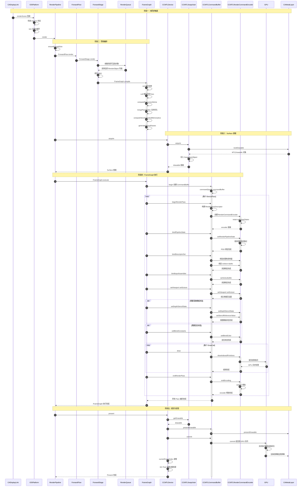

+++
title = "Cocos 引擎 iOS 渲染管线深度解析：从 CADisplayLink 到屏幕呈现"
date = '2026-07-08T19:00:15+08:00'
draft = false
tags = ['Cocos', 'Metal', '图形渲染', '渲染管线', 'iOS', '源码分析']
categories = ['源码分析']
+++

# Cocos 引擎 iOS 渲染管线深度解析：从 CADisplayLink 到屏幕呈现

## 引言

在移动端图形开发中，理解渲染管线的底层实现是走向高级工程师的必经之路。Cocos Creator 作为主流的跨平台游戏引擎，其 iOS Metal 后端的渲染实现采用了现代化的 FrameGraph 架构，结合脏状态追踪、资源池化等优化手段，是一份极佳的学习样本。

本文基于对 Cocos 引擎 `gfx-metal` 模块的源码分析，梳理从 `CADisplayLink` 帧回调触发到最终 GPU 呈现的完整渲染链路，并深入解读各阶段的关键实现细节。

## 整体架构概览

在深入时序之前,先理清核心模块的职责分工：

| 模块 | 文件 | 职责 |
|------|------|------|
| **IOSPlatform** | `IOSPlatform.mm` | iOS 平台入口，持有 `CADisplayLink` 驱动渲染循环 |
| **RenderPipeline** | `RenderPipeline.cpp` | 管线编排器，遍历相机并调度 Flow/Stage |
| **ForwardFlow** | `ForwardFlow.cpp` | 前向渲染流程，决定渲染策略 |
| **ForwardStage** | `ForwardStage.cpp` | 前向渲染阶段，收集渲染对象并填充 UBO |
| **RenderQueue** | `RenderQueue.cpp` | 渲染队列，对可渲染对象排序 |
| **FrameGraph** | `FrameGraph.cpp` | 帧图调度器，负责 Pass 编译、排序、合并和执行 |
| **CCMTLDevice** | `MTLDevice.mm` | Metal 设备抽象，管理 Swapchain 和 Queue |
| **CCMTLSwapchain** | `MTLSwapchain.mm` | 交换链，管理 `CAMetalLayer` 和 drawable |
| **CCMTLCommandBuffer** | `MTLCommandBuffer.mm` | 命令缓冲区封装，核心渲染编码入口 |
| **CCMTLRenderCommandEncoder** | `MTLRenderCommandEncoder.h` | 渲染编码器，含脏状态追踪优化 |

## 完整渲染时序图

以下 Mermaid 时序图展示了从屏幕刷新信号到最终呈现的五个阶段：



## 五阶段详细解读

### 阶段一：帧同步触发

一切从 `CADisplayLink` 开始。在 [IOSPlatform.mm](https://github.com/cocos/cocos-engine/blob/v3.8.0/native/cocos/platform/ios/IOSPlatform.mm) 中：

```objc
// IOSPlatform 初始化时注册 CADisplayLink
_displayLink = [CADisplayLink displayLinkWithTarget:self 
                                           selector:@selector(renderScene:)];
[_displayLink addToRunLoop:[NSRunLoop currentRunLoop] 
                   forMode:NSRunLoopCommonModes];
```

`CADisplayLink` 按屏幕刷新率（通常 60Hz，ProMotion 设备可达 120Hz）触发 `renderScene:` 回调。引擎在回调中进行状态检查（是否处于 inactive 状态），随后调用 `CC_CURRENT_ENGINE()->tick()` 驱动整个引擎更新循环，最后调用 `RenderPipeline::render(cameras)` 启动渲染管线。

### 阶段二：管线编排

`RenderPipeline::render()` 是管线编排的入口，核心流程如下：

1. **容量检查**：`ensureEnoughSize(cameras)` 确保内部数据结构能容纳当前相机数量
2. **流程调度**：遍历每个相机，调用对应的 `RenderFlow::render()`
3. **阶段执行**：`ForwardFlow` 依次调度其注册的多个 `RenderStage`，最核心的是 `ForwardStage`

在 `ForwardStage::render()` 中：

- **对象收集**：通过 `RenderQueue` 收集场景中所有可渲染对象，并基于材质、深度等进行排序，减少状态切换
- **UBO 填充**：将 Model、View、Projection 矩阵等 Uniform 数据填充到 Uniform Buffer Object 中
- **FrameGraph 编译**：调用 `FrameGraph::compile()`，触发一系列编译优化：

```cpp
// FrameGraph 编译流程（伪代码）
void FrameGraph::compile() {
    sort();                          // Pass 拓扑排序
    cull();                          // 裁剪无用 Pass
    computeResourceLifetime();       // 计算资源生命周期
    mergePassNodes();                // 合并可合并的 Pass 节点
    computeStoreActionAndMemoryless(); // 计算 Store Action
    generateDevicePasses();          // 生成设备层 Pass 描述
}
```

> **设计亮点**：FrameGraph 是引擎的核心优化手段。通过 `mergePassNodes()`，相邻且兼容的 Pass 可以被合并，减少 RenderPass 的 begin/end 开销——这在移动端 GPU 上尤为重要。

### 阶段三：Surface 获取

管线编排完成后，需要从 `CAMetalLayer` 获取当前帧的绘制目标。这一阶段的核心在 [MTLDevice.mm](https://github.com/cocos/cocos-engine/blob/v3.8.0/native/cocos/renderer/gfx-metal/MTLDevice.mm) 和 [MTLSwapchain.mm](https://github.com/cocos/cocos-engine/blob/v3.8.0/native/cocos/renderer/gfx-metal/MTLSwapchain.mm)：

```objc
// MTLSwapchain::acquire() 核心逻辑
- (void)acquire {
    id<CAMetalDrawable> drawable = [_metalLayer nextDrawable];
    // 将 drawable 封装到内部结构
    _swapchainObject.drawable = drawable;
    _swapchainObject.texture = drawable.texture;
}
```

`nextDrawable` 调用后，系统会从 drawable 池中分配一个可用的 `id<CAMetalDrawable>`。Cocos 将其封装在 `CCMTLGPUSwapchainObject` 中，以便后续的 FrameGraph 执行阶段使用。

> **注意**：`nextDrawable` 是阻塞点之一。如果 GPU 处理速度跟不上，drawable 池耗尽时调用会阻塞，可能导致掉帧。这就是为什么 GPU 性能优化直接影响帧率的原因。

### 阶段四：FrameGraph 执行 — 核心渲染编码

这是整个渲染链路中代码量最大、最复杂的阶段，由 [MTLCommandBuffer.mm](https://github.com/cocos/cocos-engine/blob/v3.8.0/native/cocos/renderer/gfx-metal/MTLCommandBuffer.mm)（约 60KB）承载。

FrameGraph 执行的过程本质上是对 Metal API 的一层薄封装，按 DevicePass 的顺序依次编码：


#### 4.1 创建 CommandBuffer

```objc
id<MTLCommandBuffer> mtlCmdBuf = [_commandQueue commandBuffer];
```

每个帧的开始，从 `MTLCommandQueue` 中创建一个新的 `MTLCommandBuffer`，它是本帧所有 GPU 命令的容器。

#### 4.2 遍历 DevicePass — 创建 RenderCommandEncoder

```objc
MTLRenderPassDescriptor* desc = [MTLRenderPassDescriptor renderPassDescriptor];
desc.colorAttachments[0].texture = drawable.texture;
desc.colorAttachments[0].loadAction = MTLLoadActionClear;
desc.colorAttachments[0].storeAction = MTLStoreActionStore;

id<MTLRenderCommandEncoder> encoder = 
    [mtlCmdBuf renderCommandEncoderWithDescriptor:desc];
```

每个 DevicePass 通过 `beginRenderPass()` 创建对应的 `MTLRenderCommandEncoder`。

#### 4.3 脏状态追踪优化

这是 Cocos 引擎 Metal 后端**最精巧的优化**之一。在 [MTLRenderCommandEncoder.h](https://github.com/cocos/cocos-engine/blob/v3.8.0/native/cocos/renderer/gfx-metal/MTLRenderCommandEncoder.h) 中：

```cpp
class CCMTLRenderCommandEncoder {
    // 脏状态标记
    bool _isViewportDirty;
    bool _isScissorDirty;
    bool _isCullModeDirty;
    bool _isDepthStencilStateDirty;
    id<MTLRenderPipelineState> _lastPSO;
    // ... 更多状态缓存
    
    void setRenderPipelineState(id<MTLRenderPipelineState> pso) {
        if (pso == _lastPSO) return;  // 状态未变，跳过
        _lastPSO = pso;
        [_encoder setRenderPipelineState:pso];
    }
};
```

**核心思路**：Metal 的每次 `setRenderPipelineState:`、`setDepthStencilState:` 等调用都有开销。Cocos 在 C++ 层面缓存了上一次设置的状态值，每次 `set*` 调用前先比对，相同则直接跳过，避免冗余的 Metal API 调用。这在批量绘制相同材质的对象时效果显著。

#### 4.4 资源绑定

按顺序绑定 DescriptorSet（纹理、Sampler、Buffer）、InputAssembler（顶点/索引缓冲区）、Viewport、Scissor、深度模板状态、混合状态等，为 DrawCall 做准备。

#### 4.5 执行 DrawCall

```objc
[encoder drawIndexedPrimitives:MTLPrimitiveTypeTriangle
                    indexCount:indexCount
                     indexType:MTLIndexTypeUInt16
                   indexBuffer:indexBuffer
             indexBufferOffset:0];
```

DrawCall 是渲染的主工作单元。Cocos 引擎在 `RenderQueue` 阶段已经对绘制对象进行了排序，最大化地减少了状态切换。

#### 4.6 结束编码

```objc
[encoder endEncoding];
```

每个 Pass 的编码工作完成后，调用 `endEncoding` 关闭 encoder。编码器被释放回池中，供下一个 Pass 或下一帧复用。

### 阶段五：提交与呈现

所有 Pass 编码完成后，进入最终的提交阶段：

```objc
[mtlCmdBuf presentDrawable:drawable];  // 注册呈现目标
[mtlCmdBuf commit];                     // 提交到 GPU 队列
```

`presentDrawable:` 告知 Metal 渲染结果应呈现到哪个 drawable，`commit` 将整个命令缓冲区提交到 GPU 命令队列。之后：

- GPU 异步执行所有编码的绘制命令
- 执行完成后，渲染结果输出到屏幕
- `_currentFrameIndex` 递增
- **GC Pool** 清理：`CCMTLGPUStagingBufferPool` 回收暂存缓冲区，`CCMTLGPUGarbageCollectionPool` 安全释放多帧飞行中的过期资源

> **关键设计**：GPU 是异步执行的，`commit` 后 CPU 立即返回。因此 Cocos 使用了多帧飞行的资源管理策略——当前帧使用的资源不能立即释放，必须等到 GPU 使用完毕（通常滞后 2-3 帧）。GC Pool 通过 `_currentFrameIndex` 追踪资源的安全释放时机。

## 关键代码文件清单

对想要深入阅读源码的开发者，建议按以下优先级阅读：

### 必读（核心渲染链路）

| 文件 | 大小 | 关键内容 |
|------|------|----------|
| `MTLDevice.mm` | ~600 行 | `present()`、`acquire()`、GC Pool 管理 |
| `MTLCommandBuffer.mm` | ~60KB | `beginRenderPass()`、`draw()`、资源绑定 |
| `MTLRenderCommandEncoder.h` | ~310 行 | 脏状态追踪、状态缓存与跳过逻辑 |
| `MTLSwapchain.mm` | ~200 行 | `nextDrawable` 获取、drawable 管理 |
| `MTLGPUObjects.h` | ~340 行 | GPU 对象定义、Swapchain 对象结构 |

### 进阶（管线调度层）

| 文件 | 关键内容 |
|------|----------|
| `RenderPipeline.cpp` | 管线入口、相机遍历、Flow 调度 |
| `ForwardFlow.cpp` | 前向渲染流程编排 |
| `ForwardStage.cpp` | 渲染对象收集、UBO 填充 |
| `RenderQueue.cpp` | 渲染对象排序策略 |
| `FrameGraph.cpp` | Pass 编译、合并、执行 |

### 参考（平台入口）

| 文件 | 关键内容 |
|------|----------|
| `IOSPlatform.mm` | `CADisplayLink` 注册、`renderScene:` 回调 |
| `GFXDevice.h` | 设备抽象接口定义 |

## 核心代码解析

了解了整体渲染时序后，本节深入剖析五个核心组件的源码实现细节。

### 一、CCMTLDevice：Metal 设备初始化

[MTLDevice.mm](https://github.com/cocos/cocos-engine/blob/v3.8.0/native/cocos/renderer/gfx-metal/MTLDevice.mm) 是 Metal 后端的入口类，负责创建 `MTLDevice`、查询设备能力、初始化 Swapchain 和资源池。

#### 1.1 构造函数 — API 特性预设

```cpp
CCMTLDevice::CCMTLDevice() {
    _api = API::METAL;
    _deviceName = "Metal";

    // 关键差异：Metal 的裁剪空间坐标 Z 范围是 [0, 1]
    // OpenGL 则是 [-1, 1]，投影矩阵需据此调整
    _caps.clipSpaceMinZ = 0.0f;
    _caps.screenSpaceSignY = -1.0f;
    _caps.clipSpaceSignY = 1.0f;
}
```

这段看似简单的构造函数包含了跨平台最重要的差异处理：

| 属性 | Metal | OpenGL | 含义 |
|------|-------|--------|------|
| `clipSpaceMinZ` | `0.0f` | `-1.0f` | NDC 空间中 Z 的最小值 |
| `screenSpaceSignY` | `-1.0f` | `1.0f` | 屏幕空间 Y 轴方向 |
| `clipSpaceSignY` | `1.0f` | `-1.0f` | 裁剪空间 Y 轴方向 |

这些差异直接影响投影矩阵的构造——同样的场景数据在不同 API 下需要不同的矩阵才能获得一致的渲染结果。

#### 1.2 doInit() — 设备查询与能力检测

```objc
bool CCMTLDevice::doInit(const DeviceInfo &info) {
    // 1. 获取系统默认的 Metal 设备
    id<MTLDevice> mtlDevice = MTLCreateSystemDefaultDevice();
    _mtlDevice = mtlDevice;

    // 2. 查询设备名称和特性集
    NSString *deviceName = [mtlDevice name];
    _deviceName = [deviceName UTF8String];
    _mtlFeatureSet = [mtlDevice supportsFamily:MTLGPUFamilyApple7]
        ? MTLGPUFamilyApple7 : MTLGPUFamilyApple6; // ...

    // 3. 创建命令队列
    _mtlCommandQueue = [mtlDevice newCommandQueue];

    // 4. 查询硬件限制
    _maxSamplerUnits = 16;  // Metal 最大采样器数量
    _maxBufferBindingIndex = 30; // Shader 中 buffer 绑定的最大索引

    // 5. 初始化逐帧资源
    for (int i = 0; i < MAX_FRAMES_IN_FLIGHT; i++) {
        _gpuStagingBufferPools[i] =
            ccnew CCMTLGPUStagingBufferPool((id<MTLDevice>)_mtlDevice);
    }
}
```

`doInit()` 的调用顺序经过精心设计：

```
MTLCreateSystemDefaultDevice()
    → 查询 GPU 名称 / 特性集 / 能力
    → 创建 newCommandQueue
    → 统计采样器 / buffer 绑定上限
    → 初始化多帧 StagingBufferPool
    → 注册内存告警监听
```

> **为什么不直接存 `MTLDevice` 的指针数量等信息？** 因为不同 GPU 代际（A12/A13/A14/A15）的能力差异很大，必须在初始化阶段动态查询，才能做出最优的资源配置决策。

---

### 二、CCMTLSwapchain：CAMetalLayer 与多缓冲管理

[MTLSwapchain.mm](https://github.com/cocos/cocos-engine/blob/v3.8.0/native/cocos/renderer/gfx-metal/MTLSwapchain.mm) 封装了与 `CAMetalLayer` 的交互，是整个渲染链路中连接 UIView 层级和 Metal 渲染的桥梁。

#### 2.1 初始化 — 三种窗口句柄的兼容处理

```objc
void CCMTLSwapchain::doInit(const SwapchainInfo &info) {
    void *windowHandle = info.windowHandle;

    // 情况 1：直接传入 CAMetalLayer（纯 Metal 场景）
    if ([((__bridge id)windowHandle) isKindOfClass:[CAMetalLayer class]]) {
        _metalLayer = (__bridge CAMetalLayer *)windowHandle;
    }
    // 情况 2：传入 UIView，通过 +layerClass 获取 CAMetalLayer
    else if ([((__bridge id)windowHandle) isKindOfClass:[UIView class]]) {
        UIView *view = (__bridge UIView *)windowHandle;
        _metalLayer = (CAMetalLayer *)view.layer;
    }
    // 情况 3：传入 CocosView，用 cocosMetalLayer 方法获取
    else {
        _metalLayer = [view cocosMetalLayer];
    }

    // 配置 CAMetalLayer 属性
    _metalLayer.pixelFormat = MTLPixelFormatBGRA8Unorm;
    _metalLayer.framebufferOnly = NO;
    _metalLayer.device = (__bridge id<MTLDevice>)_device->getMTLDevice();
}
```

三种兼容路径的设计使得 Cocos 引擎可以灵活嵌入不同的 iOS 视图层级中，同时保持统一的 Metal 渲染管道。

#### 2.2 acquire() — 获取当前帧的 drawable

```objc
void CCMTLSwapchain::acquire() {
    // 从 CAMetalLayer 获取下一帧的 drawable
    id<CAMetalDrawable> drawable = [_metalLayer nextDrawable];

    if (drawable) {
        // 封装到内部结构体，供后续渲染阶段使用
        _gpuSwapchainObj->currentDrawable = drawable;
        _gpuSwapchainObj->mtlTexture = drawable.texture;
        _width = drawable.texture.width;
        _height = drawable.texture.height;
    }
}
```

`nextDrawable` 的工作机制：

```
CAMetalLayer 内部维护一个 drawable 池（通常 3 个）

    ┌──────────┐    ┌──────────┐    ┌──────────┐
    │ Drawable │    │ Drawable │    │ Drawable │
    │    #0    │    │    #1    │    │    #2    │
    │ (GPU 使用) │    │ (可用)    │    │ (可用)    │
    └──────────┘    └──────────┘    └──────────┘
         ↑
    nextDrawable 返回 #1 或 #2

如果所有 drawable 都在 GPU 使用中 → 阻塞等待 → 可能掉帧
```

> **掉帧陷阱**：如果 CPU 编码速度持续快于 GPU 执行速度，drawable 池会耗尽，`nextDrawable` 调用会阻塞。此时即使 CPU 工作正常，用户也会观察到掉帧。监控 `nextDrawable` 的耗时是排查渲染性能问题的重要线索。

#### 2.3 resize() — 动态分辨率适配

```objc
void CCMTLSwapchain::resize(uint32_t width, uint32_t height) {
    _metalLayer.drawableSize = CGSizeMake(
        width * _metalLayer.contentsScale,
        height * _metalLayer.contentsScale
    );
}
```

`drawableSize` 与 `contentsScale` 的关系：在 Retina 屏幕上，`contentsScale = 2.0`，实际 drawable 分辨率为逻辑分辨率的 2 倍。Cocos 会根据设备的 `contentsScale` 自动调整渲染分辨率，保证画质的同时避免不必要的像素填充。

---

### 三、CCMTLRenderCommandEncoder：脏状态追踪

[MTLRenderCommandEncoder.h](https://github.com/cocos/cocos-engine/blob/v3.8.0/native/cocos/renderer/gfx-metal/MTLRenderCommandEncoder.h) 是整个 Metal 后端性能优化的核心，约 310 行代码实现了完整的状态缓存与跳过机制。

#### 3.1 状态缓存体系

```cpp
class CCMTLRenderCommandEncoder {
    // ===== 状态缓存标记 =====
    bool _isViewportSet = false;         // 视口是否已设置
    bool _isScissorRectSet = false;      // 裁剪矩形是否已设置
    bool _isCullModeSet = false;         // 剔除模式是否已设置
    bool _isFrontFacingWinding = false;  // 正面环绕方向
    bool _isTriangleFillModeSet = false; // 三角形填充模式
    bool _isDepthClipModeSet = false;    // 深度裁剪模式
    bool _isDepthBiasSet = false;        // 深度偏移
    bool _isBlendColorSet = false;       // 混合颜色

    // ===== 缓存的上一次状态值 =====
    id<MTLRenderPipelineState> _pipelineState = nil;
    id<MTLDepthStencilState> _depthStencilState = nil;
    MTLCullMode _cullMode = MTLCullModeNone;
    MTLWinding _frontFacingWinding = MTLWindingClockwise;
    Viewport _viewport;
    Rect _scissorRect;

    // ===== 资源绑定缓存（按 slot index 组织）=====
    ccstd::unordered_map<uint32_t, BufferBinding> _vertexBufferMap;
    ccstd::unordered_map<uint32_t, BufferBinding> _fragmentBufferMap;
    ccstd::unordered_map<uint32_t, id<MTLTexture>> _vertexTextureMap;
    ccstd::unordered_map<uint32_t, id<MTLTexture>> _fragmentTextureMap;
    ccstd::unordered_map<uint32_t, id<MTLSamplerState>> _vertexSamplerMap;
    ccstd::unordered_map<uint32_t, id<MTLSamplerState>> _fragmentSamplerMap;
};
```

`clearStates()` 在每次创建 encoder 时被调用，将所有标记重置为 `false`，因为新的 encoder 没有任何状态被设置过。

#### 3.2 状态设置接口 — 以 setCullMode 为例

```cpp
void setCullMode(MTLCullMode mode) {
    // 第一步：检查脏标记和值是否相同
    if (_isCullModeSet && (_cullMode == mode))
        return;  // 状态未变，跳过

    // 第二步：更新缓存
    _cullMode = mode;
    _isCullModeSet = true;

    // 第三步：调用 Metal API
    [_mtlEncoder setCullMode:mode];
}
```

每个状态设置方法都遵循相同的三步模式：

```
┌─────────────┐     ┌──────────────┐     ┌─────────────┐
│ 检查脏标记   │ →   │ 值与上次相同？ │ →   │ 调用 Metal  │
│ 和值是否相同  │     │ → 是：跳过     │     │ API 并缓存   │
└─────────────┘     └──────────────┘     └─────────────┘
```

#### 3.3 资源绑定缓存 — 以 setVertexBuffer 为例

```cpp
void setVertexBuffer(const id<MTLBuffer> buffer, uint32_t offset, uint32_t index) {
    // 检查 slot index 是否已绑定过相同的 buffer
    if (_vertexBufferMap.count(index) > 0) {
        const auto &bufferBinding = _vertexBufferMap[index];
        if (buffer == bufferBinding.buffer && offset == bufferBinding.offset) {
            return;  // 相同 buffer 且相同 offset，跳过
        }
    }

    // 更新缓存并调用 Metal API
    _vertexBufferMap[index] = {buffer, offset};
    [_mtlEncoder setVertexBuffer:buffer offset:offset atIndex:index];
}
```

与状态设置不同，资源绑定使用 `unordered_map<slot, binding>` 来追踪每个 slot 的资源。这意味着：

- **同一 slot 绑定不同资源** → 触发 Metal API 调用
- **同一 slot 绑定相同资源但不同 offset** → 触发 Metal API 调用
- **同一 slot 绑定完全相同的资源和 offset** → 跳过

#### 3.4 优化效果量化

假设渲染 100 个使用相同材质的三角形网格：

| 场景 | 无缓存 | 有缓存 |
|------|--------|--------|
| `setRenderPipelineState` 调用 | 100 次 | 1 次 |
| `setDepthStencilState` 调用 | 100 次 | 1 次 |
| `setCullMode` 调用 | 100 次 | 1 次 |
| 每个 slot 的 `setVertexBuffer` | 100 次 | 1-100 次 |
| **总计 Metal API 调用** | **~1000+** | **~10+** |

在复杂场景中这个优化可以将 Metal API 调用量降低 90% 以上。

#### 3.5 编码结束与资源释放

```cpp
void endEncoding() {
    [_mtlEncoder endEncoding];  // 结束 Metal 编码
    [_mtlEncoder release];       // 释放 encoder 引用
    _mtlEncoder = nil;
}
```

---

### 四、CCMTLCommandBuffer：命令缓冲区封装

[MTLCommandBuffer.mm](https://github.com/cocos/cocos-engine/blob/v3.8.0/native/cocos/renderer/gfx-metal/MTLCommandBuffer.mm) 是代码量最大的文件（约 60KB），包含了所有绘制命令的 Metal 转换逻辑。

#### 4.1 beginRenderPass — 创建渲染编码器

```objc
void CCMTLCommandBuffer::beginRenderPass(
    RenderPass *renderPass, Framebuffer *fbo,
    const Rect &renderArea, const Color *colors,
    float depth, uint32_t stencil,
    CommandBuffer *const *secondaryCBs, uint32_t secondaryCBCount)
{
    // 1. 从 Framebuffer 获取 MTLRenderPassDescriptor
    MTLRenderPassDescriptor *descriptor =
        static_cast<CCMTLFramebuffer *>(fbo)->getMTLRenderPassDescriptor();

    // 2. 配置颜色附件的清理值
    for (int i = 0; i < colorAttachmentCount; i++) {
        descriptor.colorAttachments[i].clearColor =
            MTLClearColorMake(colors[i].x, colors[i].y,
                              colors[i].z, colors[i].w);
    }

    // 3. 配置深度和模板清理值
    descriptor.depthAttachment.clearDepth = depth;
    descriptor.stencilAttachment.clearStencil = stencil;

    // 4. 创建 MTLRenderCommandEncoder
    _renderEncoder.initialize(_mtlCommandBuffer, descriptor);
}
```

关键数据结构关系：

```
MTLRenderPassDescriptor (Metal 原生)
    ├── colorAttachments[0]
    │   ├── texture        ← 从 Framebuffer 获取
    │   ├── loadAction     ← Clear / Load / DontCare
    │   ├── storeAction    ← Store / DontCare / MultisampleResolve
    │   └── clearColor     ← 清理颜色
    ├── colorAttachments[1..N]
    ├── depthAttachment
    │   ├── texture        ← 深度缓冲区纹理
    │   ├── loadAction
    │   ├── storeAction
    │   └── clearDepth
    └── stencilAttachment
```

> **storeAction 优化**：在 `FrameGraph::compile()` 的 `computeStoreActionAndMemoryless()` 阶段，对中间渲染目标设置 `MTLStoreActionDontCare`，告知 GPU 不需要保留数据到显存——这在 Tile-Based GPU 上的 `memoryless` 模式下尤为高效。

#### 4.2 draw — 执行绘制调用

```objc
void CCMTLCommandBuffer::draw(const DrawInfo &info) {
    // 1. 获取 InputAssembler 中的顶点/索引缓冲区
    CCMTLInputAssembler *ia = _inputAssembler;
    auto *indexBuffer  = ia->getIndexBuffer();
    auto *vertexBuffer = ia->getVertexBuffer();

    // 2. 根据是否有索引缓冲区选择绘制方式
    if (indexBuffer) {
        // 索引绘制（最常用）
        [_renderEncoder.getMTLEncoder()
            drawIndexedPrimitives:mu::toMTLPrimitive(_pipelineState->getPrimitive())
                        indexCount:info.indexCount
                         indexType:MTLIndexTypeUInt16
                       indexBuffer:indexBuffer->getMTLBuffer()
                 indexBufferOffset:info.firstIndex * sizeof(uint16_t)];
    } else {
        // 直接顶点绘制
        [_renderEncoder.getMTLEncoder()
            drawPrimitives:mu::toMTLPrimitive(_pipelineState->getPrimitive())
               vertexStart:info.firstVertex
               vertexCount:info.vertexCount];
    }

    // 3. 更新统计信息
    _numDrawCalls++;
    _numTriangles += info.indexCount / 3;
}
```

`DrawInfo` 结构体到 Metal 参数映射：

```
DrawInfo.vertexCount    → vertexCount
DrawInfo.firstVertex    → vertexStart
DrawInfo.indexCount     → indexCount
DrawInfo.firstIndex     → indexBufferOffset
PipelineState.primitive → MTLPrimitiveType
```

#### 4.3 updateBuffer — 动态数据上传

```objc
void CCMTLCommandBuffer::updateBuffer(Buffer *buff, const void *data, uint32_t size) {
    // 使用 StagingBufferPool 分配临时缓冲区
    CCMTLGPUBuffer gpuBuffer;
    gpuBuffer.size = size;
    _gpuStagingBufferPool->alloc(&gpuBuffer);

    // 将数据拷贝到共享内存
    memcpy(gpuBuffer.mappedData, data, size);

    // 注册到 GC Pool，在当前帧使用完毕后释放
    _gpuStagingBufferPool->recycle(&gpuBuffer);
}
```

动态数据的上传流程：

```
CPU 数据
    │
    ▼
memcpy → CCMTLGPUStagingBufferPool (共享内存, MTLStorageModeShared)
    │
    ▼
[_encoder setVertexBuffer:gpuBuffer.mtlBuffer offset:...]
    │
    ▼
GPU 直接从共享内存读取（零拷贝）
```

`MTLStorageModeShared` 使 CPU 和 GPU 可以共享同一块物理内存，避免了 `MTLStorageModePrivate` 下需要的 `blit` 复制操作。

---

### 五、CCMTLGPUStagingBufferPool 与 GC Pool：资源生命周期管理

#### 5.1 StagingBufferPool — 环形缓冲区池

```cpp
class CCMTLGPUStagingBufferPool {
    void alloc(CCMTLGPUBuffer *gpuBuffer) {
        // 1. 遍历现有 buffer，查找有足够空间的
        for (auto &buffer : _pool) {
            uint32_t offset = alignUp(buffer.curOffset, alignment);
            if (gpuBuffer->instanceSize + offset <= [buffer.mtlBuffer length]) {
                // 复用已有 buffer
                gpuBuffer->mtlBuffer = buffer.mtlBuffer;
                gpuBuffer->startOffset = offset;
                gpuBuffer->mappedData = buffer.mappedData + offset;
                buffer.curOffset = offset + gpuBuffer->instanceSize;
                return;
            }
        }

        // 2. 没有可用 buffer，创建新的
        uint32_t needs = alignUp(gpuBuffer->instanceSize, MEGA_BYTES);
        Buffer newBuffer;
        newBuffer.mtlBuffer = [_device newBufferWithLength:needs
            options:MTLResourceStorageModeShared];
        newBuffer.mappedData = (uint8_t *)newBuffer.mtlBuffer.contents;
        _pool.push_back(newBuffer);
        // ...
    }

    void reset() {
        for (auto &buffer : _pool) {
            buffer.curOffset = 0;  // 每帧重置偏移量
        }
    }
};
```

设计精髓：

```
MTLBuffer (1MB)    MTLBuffer (1MB)    MTLBuffer (1MB)
┌─────────────────┐┌─────────────────┐┌─────────────────┐
│ UBO ─────►      ││ 已满             ││ VBO ────►       │
│ curOffset = 256 ││ curOffset = 1024 ││ curOffset = 512  │
└─────────────────┘└─────────────────┘└─────────────────┘
       ↑                                    ↑
  UBO 从偏移 0 开始写入              VBO 从偏移 0 开始写入

每帧结束时 reset() → 所有 curOffset 归零 → 下一帧从头写入
```

#### 5.2 GarbageCollectionPool — 延迟释放

```cpp
class CCMTLGPUGarbageCollectionPool {
    void collect(std::function<void(void)> destroyFunc) {
        uint8_t curFrameIndex = _getFrameIndex();
        _releaseQueue[curFrameIndex].push(destroyFunc);
    }

    void clear(uint8_t currentFrameIndex) {
        while (!_releaseQueue[currentFrameIndex].empty()) {
            auto &&gcFunc = _releaseQueue[currentFrameIndex].front();
            gcFunc();  // 现在 GPU 已经完成对该帧资源的使用，可以安全释放
            _releaseQueue[currentFrameIndex].pop();
        }
    }
};
```

多帧飞行释放的时间线：

```
帧索引:    0       1       2       3       4
         ────→  ────→  ────→  ────→  ────→

CPU:     [编码 0] [编码 1] [编码 2] [编码 3] [编码 4]
GPU:              [执行 0] [执行 1] [执行 2] [执行 3]

释放队列:
  [0]: collect(destroy_A) ─────────→ clear(0) → destroy_A ✓
  [1]: collect(destroy_B) ─────────→ clear(1) → destroy_B ✓
  [2]: collect(destroy_C) ─────────→ clear(2) → destroy_C ✓
```

> **为什么不能立即释放？** 假设在第 0 帧执行 `commit` 后立即释放 drawable：GPU 可能还在异步执行渲染命令，此时的 drawable 正被 GPU 使用。立即释放会导致 GPU 访问野指针，引发崩溃或渲染错乱。

---

## 多端适配与桌面架构

Cocos 引擎天然支持 iOS 和 macOS 双端，其平台层采用了一套精巧的**接口抽象 + 平台特化**架构。理解这套设计模式，对从事跨平台图形应用开发的工程师至关重要。

### iOS vs macOS 架构对照

```
┌──────────────────────────────────────────────────────┐
│                   Cocos 引擎核心                       │
│         (RenderPipeline / FrameGraph / Scene)         │
├──────────────────────────────────────────────────────┤
│                  接口抽象层 (OSInterface)               │
│     ISystemWindow / IScreen / ISystemWindowManager     │
├─────────────────────────┬────────────────────────────┤
│     iOS 平台特化         │     macOS 平台特化           │
│  platform/ios/          │  platform/mac/             │
│  ├── IOSPlatform.mm     │  ├── MacPlatform.mm        │
│  ├── CocosView.mm       │  ├── CocosView.mm          │
│  ├── CocosRenderView.mm │  ├── View.mm               │
│  └── modules/           │  └── modules/              │
├─────────────────────────┴────────────────────────────┤
│              Metal 图形后端 (gfx-metal)                 │
│         CCMTLDevice / CCMTLSwapchain / ...            │
└──────────────────────────────────────────────────────┘
```

**核心差异对照表**：

| 维度 | iOS | macOS |
|------|-----|-------|
| UI 框架 | `UIKit` (`UIView`) | `AppKit` (`NSView`) |
| Layer 类 | `+layerClass` 静态返回 | `makeBackingLayer` + `wantsLayer` |
| 帧同步 | `CADisplayLink` | `CVDisplayLink` / `NSTimer` |
| 窗口模型 | 单窗口全屏 | 多窗口、分屏、`NSWindow` |
| 触控/键鼠 | `UITouch` 手势 | `NSEvent` 鼠标键盘 |
| 前后台通知 | `UIApplication` 通知 | `NSApplication` 通知 |
| 像素比 | `[UIScreen nativeScale]` | 自定义 `pixelRatio` |
| Metal 设备 | `MTLCreateSystemDefaultDevice()` | `MTLCreateSystemDefaultDevice()` (同) |

---

### 帧同步机制：CADisplayLink vs CVDisplayLink

#### iOS：CADisplayLink

在 [IOSPlatform.mm](https://github.com/cocos/cocos-engine/blob/v3.8.0/native/cocos/platform/ios/IOSPlatform.mm) 中，iOS 使用 `CADisplayLink` 作为默认的帧同步驱动：

```objc
// IOSPlatform 支持两种定时器模式
typedef NS_ENUM(NSInteger, CocosTimerType) {
    COCOS_TIMER_DISPLAY_LINK,   // 默认：与屏幕刷新同步 (60/120Hz)
    COCOS_TIMER_SOURCE_TIMER,   // 备选：dispatch_source 定时器
};

// 切换定时器类型
- (void)changeCCTimerType:(CocosTimerType)type {
    if (_type == type) return;
    _type = type;
    if (_running) {
        [self pause];
        [self resume];
    }
}
```

`CADisplayLink` 的优势在于与屏幕刷新率完全同步，在 ProMotion 设备上可达 120Hz。iOS 还内置了前后台状态感知：

```objc
// App 进入后台时挂起渲染
- (void)resignActive:(NSNotification *)notifacation {
    [self setInactive:YES];  // renderScene: 回调中会跳过
}

- (void)renderScene:(id)sender {
    if (_inactive) return;   // 后台静默，不执行渲染
    _platform->runTask();
}
```

#### macOS：CVDisplayLink + NSTimer 双模

在 [MacPlatform.mm](https://github.com/cocos/cocos-engine/blob/v3.8.0/native/cocos/platform/mac/MacPlatform.mm) 中，macOS 的实现更为复杂：

```objc
@interface MyTimer : NSObject {
    CVDisplayLinkRef _displayLink;  // 与屏幕刷新同步
    NSTimer *_timer;                // 基于指定 FPS 的定时器
    NSInteger _framerate;           // >0 使用 NSTimer，0 使用 CVDisplayLink
}

- (void)start {
    _running = YES;
    if (_framerate > 0) {
        [self stopDisplayLink];
        [self startTimer];           // NSTimer 模式
    } else {
        [self stopTimer];
        [self startDiplayLink];      // CVDisplayLink 模式
    }
}
```

`CVDisplayLink` 的回调在独立的高优先级线程中执行，需要通过 `dispatch_async(dispatch_get_main_queue(), ...)` 将渲染任务调度回主线程：

```objc
static CVReturn displayLinkCallback(
    CVDisplayLinkRef displayLink,
    const CVTimeStamp *inNow,
    const CVTimeStamp *inOutputTime,
    CVOptionFlags flagsIn,
    CVOptionFlags *flagsOut,
    void *displayLinkContext)
{
    MyTimer *timer = (__bridge MyTimer *)displayLinkContext;
    dispatch_async(dispatch_get_main_queue(), ^{
        [timer renderScene];
    });
    return kCVReturnSuccess;
}
```

> **设计要点**：macOS 提供了 `framerate > 0` 时用 `NSTimer` 按指定帧率驱动、`framerate == 0` 时用 `CVDisplayLink` 跟随屏幕刷新的双模切换。这与 iOS 的 `CocosTimerType` 枚举设计一脉相承，都是在灵活性与性能间寻找平衡。

---

### 视图层差异：UIView vs NSView

#### iOS：`+layerClass` 静态绑定

在 [CocosView.mm](https://github.com/cocos/cocos-engine/blob/v3.8.0/native/cocos/platform/ios/CocosView.mm) 中：

```objc
@implementation CocosView

#ifdef CC_USE_METAL
+ (Class)layerClass {
    if (!FeatureSwitch::singletonMetalLayer) {
        return [CAMetalLayer class];  // 让 UIView 的 backing layer 就是 CAMetalLayer
    } else {
        return [CALayer class];       // 多窗口共享场景，用普通 CALayer
    }
}
#endif

- (id)initWithFrame:(CGRect)frame {
    self = [super initWithFrame:frame];
    float pixelRatio = [[UIScreen mainScreen] nativeScale];
    CGSize size = CGSizeMake(
        frame.size.width * pixelRatio,
        frame.size.height * pixelRatio);
    self.contentScaleFactor = pixelRatio;

    if (!FeatureSwitch::singletonMetalLayer) {
        // 配置 CAMetalLayer
        CAMetalLayer *layer = (CAMetalLayer *)self.layer;
        layer.pixelFormat = MTLPixelFormatBGRA8Unorm;
        layer.device = MTLCreateSystemDefaultDevice();
        layer.drawableSize = size;
    }
    return self;
}
```

`+layerClass` 是 iOS/UIKit 的独有机制：在 `UIView` 构造时，系统自动调用此方法确定 backing layer 的类型，返回 `CAMetalLayer` 即可无缝将 Metal 渲染接入 UIKit 渲染管线。

#### macOS：`makeBackingLayer` + `wantsLayer`

在 [mac/CocosView.mm](https://github.com/cocos/cocos-engine/blob/v3.8.0/native/cocos/platform/mac/CocosView.mm) 中：

```objc
@implementation CocosView

+ (Class)layerClass {
    return [CAMetalLayer class];
}

- (id)initWithFrame:(CGRect)frame {
    self = [super initWithFrame:frame];
    float pixelRatio = [[CocosCreator sharedInstance] getPixelRatio];
    CGSize size = CGSizeMake(
        frame.size.width * pixelRatio,
        frame.size.height * pixelRatio);

    // AppKit 必须显式启用 layer-backed 模式
    self.wantsLayer = YES;
    self.autoresizesSubviews = YES;
    self.autoresizingMask = NSViewWidthSizable | NSViewHeightSizable;

    // 手动配置 CAMetalLayer
    CAMetalLayer *layer = (CAMetalLayer *)self.layer;
    layer.drawableSize = size;
    layer.pixelFormat = MTLPixelFormatBGRA8Unorm;
    layer.device = MTLCreateSystemDefaultDevice();
    layer.autoresizingMask = kCALayerWidthSizable | kCALayerHeightSizable;
    self.layerContentsPlacement =
        NSViewLayerContentsPlacementScaleProportionallyToFill;

    return self;
}

// 手动创建 backing layer（而非依赖 layerClass）
- (CALayer *)makeBackingLayer {
    CAMetalLayer *layer = [CAMetalLayer layer];
    layer.delegate = self;
    layer.autoresizingMask = true;
    layer.needsDisplayOnBoundsChange = true;
    return layer;
}
```

macOS 与 iOS 的关键差异：

| 步骤 | iOS (`UIView`) | macOS (`NSView`) |
|------|----------------|-------------------|
| 启用 Layer | 默认启用 | `self.wantsLayer = YES` |
| Layer 创建 | `+layerClass` 自动 | `makeBackingLayer` 手动创建 |
| 尺寸适配 | `contentScaleFactor` | `layerContentsPlacement` 枚举 |
| 自动调整 | `autoresizesSubviews` | `autoresizingMask` + `kCALayerWidthSizable` |

---

### 事件处理差异

#### iOS：UITouch 多点触控

```objc
- (void)dispatchTouchEvent:(cc::TouchEvent::Type)type
                 withEvent:(NSSet *)touches {
    cc::TouchEvent touchEvent;
    touchEvent.type = type;
    for (UITouch *touch in touches) {
        touchEvent.touches.push_back({
            [touch locationInView:[touch view]].x,
            [touch locationInView:[touch view]].y,
            (intptr_t)touch
        });
    }
    cc::events::Touch::broadcast(touchEvent);
}
```

iOS 原生支持多点触控，每个 `UITouch` 有独立的生命周期。

#### macOS：NSEvent 鼠标键盘

```objc
- (void)sendMouseEvent:(int)button
                  type:(cc::MouseEvent::Type)type
                 event:(NSEvent *)event {
    _mouseEvent.type = type;
    _mouseEvent.button = button;
    _mouseEvent.xDelta = [event deltaX];
    _mouseEvent.yDelta = [event deltaY];
    NSPoint location = [self convertPoint:[event locationInWindow]
                                 fromView:nil];
    _mouseEvent.x = location.x;
    _mouseEvent.y = self.frame.size.height - location.y;
    cc::events::Mouse::broadcast(_mouseEvent);
}
```

macOS 需要处理丰富的桌面交互：鼠标移动/拖拽/滚轮、键盘输入、右键菜单。`NSTrackingArea` 用于追踪鼠标进入/离开/移动事件，这是 iOS 不需要的。

---

### 前后台管理差异

**iOS** — 使用 `UIApplication` 通知：

```objc
[[NSNotificationCenter defaultCenter]
    addObserver:self
       selector:@selector(resignActive:)
           name:UIApplicationWillResignActiveNotification
         object:nil];

- (void)resignActive:(NSNotification *)notifacation {
    [self setInactive:YES];   // 标记 inactive
    // renderScene: 中检测 _inactive 为 true 时直接 return
}
```

**macOS** — 使用 `WindowEvent` 广播：

```objc
void MacPlatform::onPause() {
    cc::WindowEvent ev;
    ev.type = cc::WindowEvent::Type::HIDDEN;
    cc::events::WindowEvent::broadcast(ev);
}

void MacPlatform::onResume() {
    cc::WindowEvent ev;
    ev.type = cc::WindowEvent::Type::SHOW;
    cc::events::WindowEvent::broadcast(ev);
}
```

macOS 的窗口管理更加灵活：每个窗口独立管理显隐，通过 `SystemWindowManager` 统一调度。

---

### 跨平台架构设计总结

Cocos 引擎的跨平台设计遵循了经典的**策略模式**：

```
                 OSInterface (抽象接口)
                      │
        ┌─────────────┼─────────────┐
        │             │             │
   IOSPlatform   MacPlatform    AndroidPlatform
        │             │             │
   ISystemWindow  ISystemWindow  ISystemWindow
   IScreen        IScreen        IScreen
   IAccelerometer IAccelerometer ...
```

每个平台模块只需实现 `OSInterface` 中定义的接口，引擎核心层通过 `BasePlatform::getInterface<T>()` 获取平台特化实现。这不仅降低了跨平台适配的复杂度，也为添加新平台（如 visionOS）提供了清晰的扩展路径。

---

## 极致打包工程化

Cocos 引擎使用 **CMake** 作为原生层的构建系统，支持 iOS、macOS、Android、Windows、Linux 等多个目标平台。本节深入分析其打包构建体系。

### CMake 构建架构

构建入口位于 [CMakeLists.txt](https://github.com/cocos/cocos-engine/blob/v3.8.0/native/CMakeLists.txt)（约 150KB），核心结构如下：

```
CMakeLists.txt
├── include(cmake/predefine.cmake)     # 预定义宏和工具函数
├── 选项定义 (USE_SE_V8 / CC_USE_METAL / ...)
├── 源文件收集 (COCOS_SOURCE_LIST)
├── add_library(${ENGINE_NAME} STATIC ...)  # 静态库目标
├── 平台特化编译选项 (APPLE / ANDROID / ...)
└── source_group 源码组织
```

### 平台后端自动切换

CMake 根据目标平台自动选择图形后端：

```cmake
if(MACOSX OR IOS)
    cc_set_if_undefined(CC_USE_METAL ON)
    cc_set_if_undefined(CC_USE_VULKAN OFF)
    cc_set_if_undefined(CC_USE_GLES3 OFF)
elseif(ANDROID OR WINDOWS OR OHOS)
    cc_set_if_undefined(CC_USE_GLES3 ON)
    cc_set_if_undefined(CC_USE_VULKAN OFF)
elseif(NX)
    cc_set_if_undefined(CC_USE_VULKAN ON)
    cc_set_if_undefined(CC_USE_GLES3 OFF)
endif()
```

这个设计使得开发者无需手动指定图形 API——构建 iOS/macOS 时自动启用 Metal，构建 Android 时自动启用 GLES3。引擎内部通过 `#ifdef CC_USE_METAL` 条件编译来包含对应的后端代码。

### iOS/macOS 链接配置

在 CMake 的 `APPLE` 平台块中，iOS 和 macOS 有差异化的框架链接：

```cmake
if(APPLE)
    target_link_libraries(${ENGINE_NAME} PUBLIC
        "-framework Metal"
        "-framework MetalKit"
        "-framework QuartzCore"
        "-framework MetalPerformanceShaders"
        "-framework Foundation"
        "-framework GameController"
        # ...
    )

    # macOS 额外框架
    if(MACOSX)
        target_link_libraries(${ENGINE_NAME} PUBLIC
            "-framework OpenGL"    # macOS 需要 OpenGL
            "-framework AppKit"    # 桌面 UI 框架
        )
        target_compile_definitions(${ENGINE_NAME} PUBLIC
            CC_KEYBOARD_SUPPORT    # 桌面独有的键盘支持
        )
    elseif(IOS)
        # iOS 额外框架
        target_link_libraries(${ENGINE_NAME} PUBLIC
            "-framework UIKit"         # 移动端 UI 框架
            "-framework WebKit"
            "-framework CoreMotion"    # 传感器
            "-framework AVKit"
            "-framework CoreVideo"
        )
        # 设置部署目标和关闭 Bitcode
        set_property(TARGET ${ENGINE_NAME} PROPERTY
            XCODE_ATTRIBUTE_IPHONEOS_DEPLOYMENT_TARGET ${TARGET_IOS_VERSION})
        set_property(TARGET ${ENGINE_NAME} PROPERTY
            XCODE_ATTRIBUTE_ENABLE_BITCODE "NO")
    endif()
endif()
```

框架依赖对比：

| 框架 | iOS | macOS | 用途 |
|------|-----|-------|------|
| `Metal` / `MetalKit` / `QuartzCore` | ✅ | ✅ | 图形渲染核心 |
| `MetalPerformanceShaders` | ✅ | ✅ | GPU 计算加速 |
| `UIKit` | ✅ | ❌ | 移动端 UI |
| `AppKit` | ❌ | ✅ | 桌面端 UI |
| `OpenGL` | ❌ | ✅ | macOS 需要 OpenGL 框架 |
| `CoreMotion` | ✅ | ❌ | 陀螺仪/加速度计 |
| `WebKit` / `AVKit` | ✅ | ❌ | WebView/视频播放 |
| `GameController` | ✅ | ✅ | 游戏手柄 |

### 静态库与架构配置

Cocos 引擎构建为静态库，ARM64 架构：

```cmake
set_target_properties(${ENGINE_NAME} PROPERTIES
    XCODE_ATTRIBUTE_ONLY_ACTIVE_ARCH "YES"
    OSX_ARCHITECTURES "arm64;x86_64"
    ARCHIVE_OUTPUT_DIRECTORY ${CMAKE_CURRENT_BINARY_DIR}/archives
)
```

- `ONLY_ACTIVE_ARCH "YES"`：Debug 模式只编译当前设备架构，加速开发迭代
- `OSX_ARCHITECTURES "arm64;x86_64"`：支持 Apple Silicon + Intel Mac
- iOS 端自动适配 `arm64`（iPhone）/ `arm64-simulator`

静态库输出到 `archives/` 目录，可供上层 App 工程链接。

### XCFramework 打包思路

虽然当前项目未直接配置 XCFramework，但从 CMake 的现有结构可以推导出打包为 XCFramework 的路径：

```bash
# 构建 ARM64 真机静态库
cmake .. -G Xcode \
    -DCMAKE_SYSTEM_NAME=iOS \
    -DCMAKE_OSX_ARCHITECTURES=arm64 \
    -DCMAKE_OSX_SYSROOT=iphoneos
cmake --build . --config Release

# 构建 ARM64 模拟器静态库
cmake .. -G Xcode \
    -DCMAKE_SYSTEM_NAME=iOS \
    -DCMAKE_OSX_ARCHITECTURES=arm64 \
    -DCMAKE_OSX_SYSROOT=iphonesimulator
cmake --build . --config Release

# 打包为 XCFramework
xcodebuild -create-xcframework \
    -library build/ios-device/libcocos_engine.a \
    -library build/ios-simulator/libcocos_engine.a \
    -output CocosEngine.xcframework
```

**XCFramework 的优势**：
- 单个包同时支持真机和模拟器
- Xcode 自动选择正确的架构切片
- 支持 Swift Package Manager 分发
- 解决了传统 fat binary 在 App Store 需要 stripping 的问题

### 动态库安全：符号可见性控制

对于需要分发为动态库的场景，CMake 通过编译选项控制符号可见性：

```cmake
# 隐藏所有符号，仅导出指定 API
set(CMAKE_CXX_VISIBILITY_PRESET hidden)
set(CMAKE_C_VISIBILITY_PRESET hidden)
set(CMAKE_VISIBILITY_INLINES_HIDDEN YES)

# 需要导出的 API 使用 __attribute__((visibility("default")))
```

这确保了动态库的 ABI 稳定性——只有明确标记的公共 API 才对外可见，内部实现变更不会影响下游。

### 打包工程化最佳实践总结

| 实践 | 代码位置 | 说明 |
|------|---------|------|
| 平台后端自动切换 | `CMakeLists.txt` L65-74 | `CC_USE_METAL` / `CC_USE_GLES3` 宏 |
| 框架差异化链接 | `CMakeLists.txt` L3400-3480 | iOS/macOS 分别链接不同框架 |
| 条件编译宏 | `CC_KEYBOARD_SUPPORT` | macOS 独有键盘支持 |
| 静态库目标 | `add_library(${ENGINE_NAME} STATIC ...)` | 统一为静态库 |
| 多架构支持 | `OSX_ARCHITECTURES` | arm64 + x86_64 双架构 |
| Xcode 属性注入 | `XCODE_ATTRIBUTE_*` | 部署目标、Bitcode 开关 |
| 符号可见性 | `-fvisibility=hidden` | 动态库场景下的 ABI 管控 |

## 关键优化技术总结

### 1. 脏状态追踪

在 `CCMTLRenderCommandEncoder` 中，每次 Metal 状态设置调用前，先检查状态是否与上一次相同。相同则跳过，避免冗余 API 调用。

**适用场景**：连续绘制相同材质的大量对象。

### 2. FrameGraph Pass 合并

在 `FrameGraph::compile()` 阶段，通过 `mergePassNodes()` 将相邻且兼容的 Pass 合并，减少 RenderPass begin/end 的开销。

**适用场景**：移动端 GPU（Tile-Based Deferred Rendering 架构）对此优化尤为敏感。

### 3. 资源生命周期管理

GPU 异步执行要求 CPU 侧不能过早释放资源。Cocos 通过 GC Pool 和帧索引追踪，确保资源在 GPU 使用完毕后安全释放。

**核心机制**：`_currentFrameIndex` 递增 + 滞后释放策略。

### 4. 渲染对象排序

`RenderQueue` 在收集阶段按材质、深度等对渲染对象排序，最大化减少状态切换次数，降低 DrawCall 开销。

### 5. 缓冲区池化

`CCMTLGPUStagingBufferPool` 和 `CCMTLGPUBufferPool` 对 GPU 缓冲区进行池化管理，避免频繁创建/销毁带来的内存分配开销。

## 总结

1. **分层架构清晰**：从 Platform → Pipeline → Flow → Stage → FrameGraph → GPU，每一层职责明确，便于跨平台扩展
2. **编译期优化**：FrameGraph 在 `compile()` 阶段进行 Pass 合并和资源分析，减少运行时开销
3. **运行时优化**：脏状态追踪避免了大量冗余的 Metal API 调用
4. **资源管理严谨**：多帧飞行 + GC Pool 确保异步 GPU 环境下的资源安全

理解这些设计，不仅能帮助掌握 Cocos 引擎的使用，更能触类旁通地理解 Unreal 的 RDG（Render Dependency Graph）、Frostbite 的 FrameGraph 等工业级渲染架构的设计思路。

---

> **延伸阅读**：Metal Best Practices Guide、Cocos Creator 渲染管线文档、FrameGraph: Extensible Rendering Architecture in Frostbite (GDC 2017)