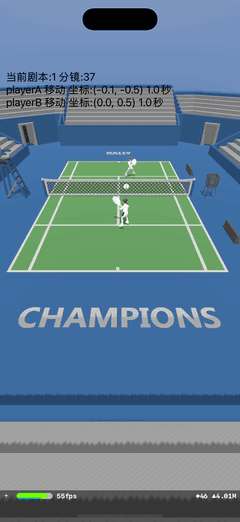

+++
date = '2026-05-30T17:30:28+08:00'
draft = false
title = '3D球场项目 (三)'
tags = ['Cocos', 'Cocos Creator', 'C++', 'LLM', 'Opta']
categories = ['iOS 开发', '前端开发']
weight = 3
+++

在[3D球场项目 (二)](../part-two/)中，我们梳理了视频弹幕引擎的整体架构、引擎初始化流程。现在，3D 球场部分基本已经探索完毕，我们接下来就是要解决这个项目的数据驱动部分了。

我们现在研究一下下发数据的来源：[Opta](https://theanalyst.com/)，它是全球顶级的体育数据公司，1996 年创立于英国伦敦，现隶属于 Stats Perform，是行业公认的足球数据金标准。
+ 覆盖：20+ 运动、3900+ 赛事、每年 6 万 + 场比赛
+ 规模：7.2PB 历史数据、年采集超 10 亿数据点
+ 精度：单场足球2 万 + 事件点，事件识别准确率 99.8%

腾讯体育采买了 Opta WTA 网球比赛的数据，我们可以通过 Opta 的 API 来获取数据。

根据他们官网的[介绍](https://documentation.statsperform.com/docs/rh/sdapi/Topics/basketball/opta-sdapi-basketball-api-match-events.htm)，一个 MA3 网球赛事数据中 typeId 对应的意义如下：

<details>
<summary>点击展开 / 折叠 Event TypeId 完整对照表</summary>

| Event TypeId | Event Name | Description |
| --- | --- | --- |
| 20 | STOP_GAME | Indicates that the game has finished. |
| 41 | START_SET_1 | Start 1st Set |
| 42 | START_SET_2 | Start 2nd Set |
| 43 | START_SET_3 | Start 3rd Set |
| 44 | START_SET_4 | Start 4th Set |
| 45 | START_SET_5 | Start 5th Set |
| 46 | STOP_SET | Stop Set |
| 47 | T_WO1 | w.o. Player 1 |
| 48 | T_WO2 | w.o. Player 2 |
| 128 | SAFE | Safe (No longer used) |
| 129 | DANGER | Danger (Technical/connection issue at venue) |
| 132 | INJ_BREAK | Game suspended - Player injured |
| 133 | PLAYERS_COMING_OUT | Players coming out |
| 141 | GAME_ABOUT_TO_START | Game about to start |
| 149 | GAME_SUSPENDED | Game suspended |
| 160 | PLAYERS_WARMING_UP | Players warming up |
| 162 | SHAKE_HANDS_WITH_REFEREE | Players shake hands with referee |
| 163 | COIN_FLIPPING_FOR_FIRST_SERVER | Coin flip to choose first server |
| 164 | PLAYERS_TALKING_TO_REFEREE | Player(s) talking to the referee |
| 165 | REFEREE_CHECKING_POINTMARK | Referee checking pointmark |
| 166 | BOTH_PLAYERS_SEATED | Both players seated |
| 167 | PLAYER1_RECEIVING_TREATMENT | Player 1 receiving treatment |
| 168 | PLAYER2_RECEIVING_TREATMENT | Player 2 receiving treatment |
| 169 | PLAYERS_GOING_TO_COURT | Players going back to court |
| 170 | NEXT_GAME_ABOUT_TO_START | Next game is about to start |
| 180 | T_MORE_THAN_5 | Rally, over five shots |
| 181 | T_MORE_THAN_10 | Rally over ten shots |
| 182 | T_MORE_THAN_15 | Rally over fifteen shots |
| 187 | T_POINT_UNDER_INVESTIGATION | Point under investigation |
| 188 | T_START_TIE_BREAK | Start tie break |
| 191 | T_POINT_STOPPED_BY_REF | Point stopped by referee |
| 197 | UPDATE_SCORE_START | Start score update |
| 198 | UPDATE_SCORE_FINISHED | Score update finished |
| 200 | SIDE_CHANGE | Side change |
| 206 | SHOT_CNT | Shot count |
| 216 | STATISTIC_VERIFICATION | Statistics confirmation |
| 240 | NEW_BALLS | New balls |
| 241 | UMPIRE_ON_COURT | UMPIRE ON COURT |
| 242 | WARMING_UP_VOLLEY | Warming up - volley |
| 243 | WARMING_UP_SERVICE | Warming up - service |
| 244 | ONE_MINUTE | One minute |
| 245 | TIME | Time |
| 246 | SHOT_DETAILS | Shot details |
| 256 | CLS | Cancel last sent event |
| 257 | CLR | Clear events |
| 258 | GCC | Game conditions changed. |
| 261 | SCORER | Event details for %RELATED_EVENT% in the %MIN%. minute changed |
| 262 | BP | Ball position event |
| 264 | ODD | Odds event (deprecated) |
| 266 | TIME_CORRECTION_EVENT | Correct timestamp for a missed event |
| 276 | START_GAME_CLOCK | The (stopped) game clock is (re)started the game is running |
| 277 | STOP_GAME_CLOCK | The game clock is stopped. Time will not change until Start Game Clock is sent again |
| 278 | ADJUST_GAME_CLOCK | Game clock value is adjusted manually |
| 279 | CSTAT | A statistical value is cleared and an additional event with the correct action is sent (e.g. an invalid Ace Home event is replaced by a Service Winner Home) |
| 280 | CONF_PERIOD_SCORE | Period score confirmed |
| 282 | TIME_ADAPTION | Time for event %RELATED_EVENT% was adapted by %SEC% seconds |
| 285 | PLAYER_DATA_CONFIRMED | Player data for %RELATED_EVENT% in the %MIN% confirmed |
| 513 | SYS_MSG | System Message |
| 514 | SCOUT_IN_STADION | Scout in Stadium |
| 515 | CONNECTION_PROBLEMSSCOUT_OFFLINE | Connection problems Scout offline |
| 516 | CONNECTION_PROBLEMS | Connection problems |
| 517 | TRANSMISSION_ONLINE | Transmission online |
| 520 | LINEUP_CHANGED | Line-up changed |
| 524 | JERSEY_CHANGED | Jersey colors updated |
| 782 | GAME CANCELLED | Automatic "Game cancelled" event after first "cancellation" System message is sent |
| 1152 | T_SERVE1 | Service Player 1 |
| 1153 | T_1ST_SERVICE1 | 1st service Player 1 |
| 1154 | T_2ND_SERVICE1 | 2nd service Player 1 |
| 1155 | T_NA1 | Net approach player 1 |
| 1156 | T_W_FH1 | Winner (forehand) Player 1 |
| 1157 | T_W_BH1 | Winner (backhand) Player 1 |
| 1158 | T_FE_FH1 | Forced error (forehand) Player 1 |
| 1159 | T_FE_BH1 | Forced error (backhand) Player 1 |
| 1160 | T_UE_FH1 | Unforced error (forehand) Player 1 |
| 1161 | T_UE_BH1 | Unforced error (backhand) Player 1 |
| 1162 | T_HE1 | Hawkeye Player 1 |
| 1163 | T_WBR1 | Warning by referee Player 1 |
| 1164 | T_CBR1 | Cautioned by referee Player 1 |
| 1165 | T_SRV_NET1 | Net Player 1 |
| 1166 | T_SRV_OUT1 | Out Player 1 |
| 1167 | T_SRV_FF1 | Foot fault Player 1 |
| 1168 | T_SRV_DF1 | Double fault Player 1 |
| 1169 | T_SRV_A1 | Ace Player 1 |
| 1170 | T_SRV_SW1 | Service winner Player 1 |
| 1171 | T_SRV_RW_FH1 | Return winner (forehand) Player 1 |
| 1172 | T_SRV_IN1 | Serve in Player 1 |
| 1173 | T_POINT1 | Point Player 1 |
| 1174 | T_CONF1 | Confirm Point Player 1 |
| 1175 | T_GAME1 | Game Player 1 |
| 1176 | T_SET1 | Set Player 1 |
| 1177 | T_BL1 | Baseline Player 1 |
| 1178 | T_SRV_NR1 | Net/Retake Player 1 |
| 1179 | T_W1 | Winner Player 1 |
| 1180 | T_FE1 | Forced error Player 1 |
| 1181 | T_UE1 | Unforced error Player 1 |
| 1182 | T_SRV_RW_BH1 | Return winner (backhand) Player 1 |
| 1183 | T_V_FH1 | Volley (forehand) Player 1 |
| 1184 | T_V_BH1 | Volley (backhand) Player 1 |
| 1185 | T_BB1 | Break ball Player 1 |
| 1186 | T_B1 | Break Player 1 |
| 1187 | T_HES1 | Hawk eye successful Player 1 |
| 1188 | T_ITO1 | Injury Timeout Player 1 |
| 1189 | T_START_SRV1 | Start Service Player 1 |
| 1190 | T_WARNING1 | 1st offence - warning Player 1 |
| 1191 | T_PENALTY_POINT1 | 2nd offence - penalty point Player 1 |
| 1192 | T_PENALTY_GAME1 | 3rd offence - penalty game Player 1 |
| 1193 | T_DISQUALIFICATION1 | Disqualification Player 1 |
| 1194 | T_UE_NET1 | Unforced error net Player 1 |
| 1195 | T_FE_NET1 | Forced error net Player 1 |
| 1196 | T_SUCCESSFUL_NET_APPROACH1 | Successful net approach Player 1 |
| 1197 | T_TIME_VIOLATION1 | Time violation Player 1 |
| 1198 | T_PENALTY_POINT1<br>T_UNSUCCESSFUL_NET_APPROACH1 | Unsuccessful net approach Player 1 |
| 1199 | T_AT_NET1 | At net Player 1 |
| 1200 | T_AT_BASELINE1 | At baseline Player 1 |
| 1201 | T_SET_BALL1 | Set ball Player 1 |
| 1202 | T_MATCH_BALL1 | Match ball Player 1 |
| 2176 | T_SERVE2 | Service Player 2 |
| 2177 | T_1ST_SERVICE2 | 1st service Player 2 |
| 2178 | T_2ND_SERVICE2 | 2nd service Player 2 |
| 2179 | T_NA2 | Net approach player 2 |
| 2180 | T_W_FH2 | Winner (forehand) Player 2 |
| 2181 | T_W_BH2 | Winner (backhand) Player 2 |
| 2182 | T_FE_FH2 | Forced error (forehand) Player 2 |
| 2183 | T_FE_BH2 | Forced error (backhand) Player 2 |
| 2184 | T_UE_FH2 | Unforced error (forehand) Player 2 |
| 2185 | T_UE_BH2 | Unforced error (backhand) Player 2 |
| 2186 | T_HE2 | Hawkeye Player 2 |
| 2187 | T_WBR2 | Warning by referee Player 2 |
| 2188 | T_CBR2 | Cautioned by referee Player 2 |
| 2189 | T_SRV_NET2 | Net Player 2 |
| 2190 | T_SRV_OUT2 | Out Player 2 |
| 2191 | T_SRV_FF2 | Foot fault Player 2 |
| 2192 | T_SRV_DF2 | Double fault Player 2 |
| 2193 | T_SRV_A2 | Ace Player 2 |
| 2194 | T_SRV_SW2 | Service winner Player 2 |
| 2195 | T_SRV_RW_FH2 | Return winner (forehand) Player 2 |
| 2196 | T_SRV_IN2 | Serve in Player 2 |
| 2197 | T_POINT2 | Point Player 2 |
| 2198 | T_CONF2 | Confirm Point Player 2 |
| 2199 | T_GAME2 | Game Player 2 |
| 2200 | T_SET2 | Set Player 2 |
| 2201 | T_BL2 | Baseline Player 2 |
| 2202 | T_SRV_NR2 | Net/Retake Player 2 |
| 2203 | T_W2 | Winner Player 2 |
| 2204 | T_FE2 | Forced error Player 2 |
| 2205 | T_UE2 | Unforced error Player 2 |
| 2206 | T_SRV_RW_BH2 | Return winner (backhand) Player 2 |
| 2207 | T_V_FH2 | Volley (forehand) Player 2 |
| 2208 | T_V_BH2 | Volley (backhand) Player 2 |
| 2209 | T_BB2 | Break ball Player 2 |
| 2210 | T_B2 | Break Player 2 |
| 2211 | T_HES2 | Hawk eye successful Player 2 |
| 2212 | T_ITO | Injury Timeout Player 2 |
| 2213 | T_START_SRV2 | Start Service Player 2 |
| 2214 | T_WARNING2 | 1st offence - warning Player 2 |
| 2215 | T_PENALTY_POINT2 | 2nd offence - penalty point Player 2 |
| 2216 | T_PENALTY_GAME2 | 3rd offence - penalty game Player 2 |
| 2217 | T_DISQUALIFICATION2 | Disqualification Player 2 |
| 2218 | T_UE_NET2 | Unforced error net Player 2 |
| 2219 | T_FE_NET2 | Forced error net Player 2 |
| 2220 | T_SUCCESSFUL_NET_APPROACH2 | Successful net approach Player 2 |
| 2221 | T_TIME_VIOLATION2 | Time violation Player 2 |
| 2222 | T_AT_NET2 | Unsuccessful net approach Player 2 |
| 2223 |  | At net Player 2 |
| 2224 | T_AT_BASELINE2 | At baseline Player 2 |
| 2225 | T_SET_BALL2 | Set ball Player 2 |
| 2226 | T_MATCH_BALL2 | Match ball Player 2 |

</details>

**PBP = Play-by-Play（逐回合 / 逐事件数据）**，就是把一场比赛里每一次事件都按时间线秒级记录下来的最细粒度原始数据流。口语里也叫 “逐帧数据 / 流水账数据”。网球赛事的数据，都是以这个形式下发的，一段数据可能下发的数据是这样的：


```json
{
  "match_id": "atp-2026-1047",
  "tournament": "Roland Garros",
  "round": "SF",
  "court": "Philippe Chatrier",
  "players": {
    "p1": {
      "id": "nadal",
      "name": "Rafael Nadal",
      "country": "ESP"
    },
    "p2": {
      "id": "djokovic",
      "name": "Novak Djokovic",
      "country": "SRB"
    }
  },
  "points": [
    {
      "point_id": "pt-001",
      "set": 1,
      "game": 1,
      "point_in_game": 1,
      "server": "p1",
      "receiver": "p2",
      "score_before": {
        "p1": "0",
        "p2": "0"
      },
      "score_after": {
        "p1": "15",
        "p2": "0"
      },
      "point_winner": "p1",
      "serve": {
        "serve_num": 1,
        "speed_kmh": 185,
        "speed_mph": 115,
        "direction": "T",
        "is_ace": true,
        "is_double_fault": false
      },
      "rally": {
        "rally_count": 1,
        "shots": [
          {
            "player": "p1",
            "stroke": "serve",
            "side": "deuce",
            "x": 12.3,
            "y": 4.1,
            "result": "ace"
          }
        ]
      },
      "time": {
        "point_start": "14:22:03",
        "point_end": "14:22:04"
      },
      "is_break_point": false,
      "is_set_point": false,
      "is_match_point": false
    },
    {
      "point_id": "pt-002",
      "set": 1,
      "game": 1,
      "point_in_game": 2,
      "server": "p1",
      "receiver": "p2",
      "score_before": {
        "p1": "15",
        "p2": "0"
      },
      "score_after": {
        "p1": "30",
        "p2": "0"
      },
      "point_winner": "p1",
      "serve": {
        "serve_num": 1,
        "speed_kmh": 172,
        "speed_mph": 107,
        "direction": "W",
        "is_ace": false,
        "is_double_fault": false
      },
      "rally": {
        "rally_count": 3,
        "shots": [
          {
            "player": "p1",
            "stroke": "serve",
            "side": "ad",
            "x": 11.8,
            "y": 2.9,
            "result": "in"
          },
          {
            "player": "p2",
            "stroke": "backhand",
            "side": "ad",
            "x": 8.2,
            "y": 7.4,
            "result": "return"
          },
          {
            "player": "p1",
            "stroke": "forehand",
            "side": "deuce",
            "x": 15.1,
            "y": 3.3,
            "result": "winner"
          }
        ]
      },
      "time": {
        "point_start": "14:22:10",
        "point_end": "14:22:14"
      },
      "is_break_point": false,
      "is_set_point": false,
      "is_match_point": false
    }
  ]
}
```

可以看出，这个数据还是很简单的，顶多只能看出球员什么时候得分/失误等等，但对于 3D 球场来说，仅凭这样的数据是不够的，至少要知道让两个 Player 在屏幕上如何行动，做了什么动作。而且 Opta 不可能持续的推数据，一般是以得分为单位进行推送。这期间由于没有数据，球员就只能在屏幕上干等。

为了让比赛画面尽可能的生动的还原起来，我们借用了大模型的能力，创建了一个“导演“ Agent。我们让该 Agent 持存的接收 PBP 数据，想象比赛场面的画面，并引入分镜的概念，最后把数据再以 JSON 的格式推过来，这个导演的职能有：
1. Player 如何行动，行动持存多少时间，移动位置（只能使用模型预置的动作，这些动作怎么来的，可以查看[3D球场项目 (一)](../part-one/);
2. 音效，现在就三个背景音乐类型，1进行中，2得分，3结束；
3. 镜头调度，现在都是正视角，角度为：1:特写A，2:特写B，3:A侧，4:B侧；

我们线下使用历史的 pbp 数据，生成了一段 10min 左右的脚本，导入我们的项目中。OK，我们的 3D 球场 Demo 跑起来了。

<p style="text-align:center;">
  
</p>

或许有小伙伴会问了，前面提到了我们可以识别视频动作，我们完全可以找一个网球直播的清流来识别动作，然后把这些数据跟 pbp 一起推给客户端。这样画面更还原，不必我们用大模型来瞎编更好吗？理论上这个技术是可行的，但这就涉及版权问题了，这么做差不多就是把比赛现场一比一还原了，这个是会被告侵权的。

后来我们采用长链推 pbp 的进行实际测试的过程中，我们也遇到了一些问题，比如：
1. 大模型没有及时出结果，player 只能在 idle 状态；
2. 编的动作有问题，两个球员一直在来回发球，下一轮脚本推过来了，直接中断，衔接的很不自然；
3. 长链断了，客户端重连，这时候应该是什么动作，后台需要提供一个补充数据下发接口；

在来回联调下，这三个问题都得到了解决——不过解法和我们 demo 阶段的设想差别很大：导演 Agent
不再是"一次 LLM 调用搞定一切"，而是被拆成了 **确定性脚本层 + LLM 解说层 + 双重下发保险**
的组合。具体怎么落地的，下一篇 [3D球场项目 (四)](../part-four/)
继续讲。