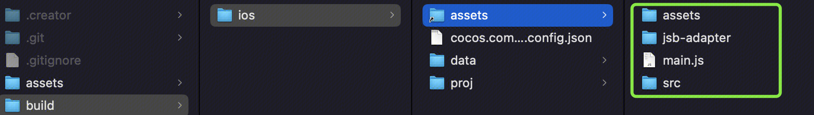
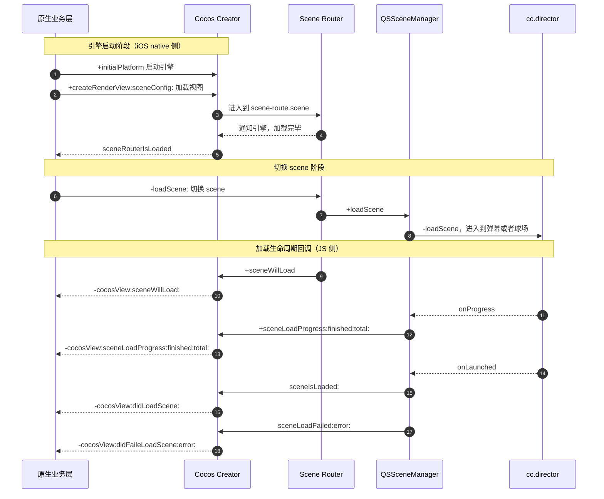

+++
date = '2026-05-30T10:00:00+08:00'
draft = false
title = '3D球场项目 (二)'
tags = ['Cocos', 'Cocos Creator', 'C++']
categories = ['iOS 开发', '前端开发']
weight = 2
+++

在[3D球场项目 (一)](../part-one/)中，我们搞定了 3D 资产，也选定了落地框架。但是这不代表我们可以直接使用，这个作为的弹幕引擎的一部引入的 Cocos，是有一些定制逻辑在的。我们需要抽丝剥茧的先了解这个弹幕系统做了什么，再来制定具体的实施方案。

## 视频弹幕引擎

腾讯视频的弹幕引擎作为一个悠久的项目，支撑了腾讯视频大量的互动活动。弹幕引擎框架也是几经迭代，从最早的原生版本，到 PAG，再到现在的 Cocos Creator版本。

之所以想要使用 Cocos 来替换原来的方案，是因为有以下两大优势：
+ **能力强：** 支持完善的图形渲染、运动、物理、粒子、3D、光照等游戏引擎能力，充分利用游戏引擎所提供的这些能力，可以在弹幕上实现丰富的玩法。
+ **跨平台：** Cocos Creator 是一款高效、清凉、免费开源的跨平台图形引擎，支持所有主流平台支持，真正实现一次开发，全平台运行。框架迭代几乎都是使用 Cocos Creator 开发，少部分业务，如数据上报、客户端交互等，才需要做做少量适配工作，这极大的节省了人力;
+ **动态化：** 动态发布新特性和配置能力，更方便配合运营做活动，不需要等 app 发版铺量；

弹幕引擎的工程划分，大致如下：

<div class="arch-diagram">
  <style>
    .arch-diagram { font-size: 13px; color: #222; margin: 1.2em 0; max-width: 100%; overflow-x: auto; }
    .arch-diagram .layer {
      background: #f0f4f8;
      border: 1.5px solid #aab4c2;
      border-radius: 8px;
      padding: 14px 16px 16px;
      margin: 10px 0;
      position: relative;
    }
    .arch-diagram .layer-title {
      font-weight: 600;
      color: #334155;
      margin-bottom: 10px;
      font-size: 14px;
    }
    .arch-diagram .row { display: flex; gap: 10px; flex-wrap: wrap; align-items: center; }
    .arch-diagram .node {
      background: #fff;
      border: 1px solid #8b8b8b;
      border-radius: 18px;
      padding: 6px 14px;
      min-width: 60px;
      text-align: center;
      box-shadow: 0 1px 1px rgba(0,0,0,0.03);
      flex: 1 1 auto;
      white-space: nowrap;
    }
    .arch-diagram .node.wrap {
      white-space: normal;
      line-height: 1.35;
      padding: 8px 12px;
    }
    .arch-diagram .group {
      background: #fafbfc;
      border: 1px dashed #9aa4b2;
      border-radius: 8px;
      padding: 12px;
      flex: 1;
      min-width: 200px;
      display: flex;
      flex-direction: column;
    }
    .arch-diagram .group-title {
      font-weight: 600;
      color: #475569;
      margin-bottom: 8px;
      font-size: 13px;
    }
    .arch-diagram .inner {
      background: #fff;
      border: 1px solid #c5ccd6;
      border-radius: 6px;
      padding: 10px;
      margin-bottom: 8px;
    }
    .arch-diagram .inner:last-child { margin-bottom: 0; }
    .arch-diagram .inner-title {
      color: #475569;
      font-size: 12px;
      text-align: center;
      margin-bottom: 6px;
    }
    .arch-diagram .arrow {
      text-align: center;
      color: #94a3b8;
      font-size: 18px;
      line-height: 1;
      margin: 4px 0;
      user-select: none;
    }
    .arch-diagram .app-row { display: flex; justify-content: center; }
    .arch-diagram .app-row .node { flex: 0 0 auto; min-width: 120px; padding: 8px 24px; }
    .arch-diagram .md-row { display: flex; gap: 12px; align-items: flex-start; flex-wrap: wrap; }
    .arch-diagram .md-row > .group:first-child { flex: 2.4 1 360px; }
    .arch-diagram .md-row > .group:last-child { flex: 1 1 200px; }
    .arch-diagram .ce-row { display: flex; gap: 10px; align-items: flex-start; flex-wrap: wrap; }
    .arch-diagram .ce-row .nodes { display: flex; gap: 10px; flex: 1 1 280px; flex-wrap: wrap; }
    .arch-diagram .ce-row .ext-group { flex: 1 1 38%; min-width: 220px; }

    /* Mobile & tablet responsive: <= 900px */
    @media (max-width: 900px) {
      .arch-diagram { font-size: 12px; }
      .arch-diagram .layer { padding: 10px 10px 12px; }
      .arch-diagram .layer-title { font-size: 13px; margin-bottom: 8px; }
      .arch-diagram .row { gap: 6px; }
      .arch-diagram .row > .node {
        flex: 1 1 calc(33.333% - 6px);
        padding: 5px 6px;
        min-width: 0;
        font-size: 11.5px;
        white-space: normal;
        line-height: 1.3;
        word-break: break-word;
      }
      .arch-diagram .node.wrap { padding: 6px 8px; line-height: 1.3; }
      .arch-diagram .group { padding: 8px; min-width: 0; }
      .arch-diagram .inner { padding: 8px; }
      .arch-diagram .app-row .node { min-width: 0; padding: 6px 18px; flex: 0 0 auto; white-space: nowrap; }
      .arch-diagram .md-row { flex-direction: column; gap: 8px; }
      .arch-diagram .md-row > .group:first-child,
      .arch-diagram .md-row > .group:last-child { flex: 1 1 auto; width: 100%; }
      .arch-diagram .ce-row { flex-direction: column; gap: 8px; }
      .arch-diagram .ce-row .nodes { flex: 1 1 auto; width: 100%; }
      .arch-diagram .ce-row .ext-group { flex: 1 1 auto; width: 100%; min-width: 0; }
    }

    /* Extra small mobile: <= 420px */
    @media (max-width: 420px) {
      .arch-diagram .row > .node { flex: 1 1 calc(50% - 6px); }
    }

    @media (prefers-color-scheme: dark) {
      .arch-diagram { color: #e2e8f0; }
      .arch-diagram .layer { background: #1e293b; border-color: #475569; }
      .arch-diagram .group { background: #0f172a; border-color: #475569; }
      .arch-diagram .inner { background: #1e293b; border-color: #475569; }
      .arch-diagram .node { background: #0f172a; border-color: #94a3b8; color: #e2e8f0; }
      .arch-diagram .layer-title, .arch-diagram .group-title, .arch-diagram .inner-title { color: #cbd5e1; }
    }
  </style>

  <div class="app-row">
    <div class="node">腾讯视频 APP</div>
  </div>
  <div class="arrow">▲</div>

  <div class="layer">
    <div class="layer-title">弹幕业务接入层 MagicDanmakuiOS</div>
    <div class="row">
      <div class="node">资源包</div>
      <div class="node">业务接入层</div>
      <div class="node">JS 注册绑定</div>
      <div class="node">动态化</div>
      <div class="node">playground</div>
      <div class="node">…</div>
    </div>
  </div>
  <div class="arrow">▲</div>

  <div class="layer">
    <div class="layer-title">弹幕实现 MagicDanmaku</div>
    <div class="md-row">
      <div class="group">
        <div class="group-title">Assets 资源包</div>
        <div class="inner">
          <div class="inner-title">TypeScript 版弹幕组件</div>
          <div class="row">
            <div class="node">样式</div>
            <div class="node">轨道</div>
            <div class="node">特效</div>
            <div class="node">通信</div>
            <div class="node">…</div>
          </div>
        </div>
        <div class="inner">
          <div class="inner-title">素材</div>
          <div class="row">
            <div class="node">图片</div>
            <div class="node">视频</div>
            <div class="node">音频</div>
            <div class="node">…</div>
          </div>
        </div>
      </div>
      <div class="group">
        <div class="group-title">二进制库</div>
        <div class="row">
          <div class="node wrap">engine framework</div>
          <div class="node wrap">external framework</div>
        </div>
      </div>
    </div>
  </div>
  <div class="arrow">▲</div>

  <div class="layer">
    <div class="layer-title">引擎内核 cocos-engine</div>
    <div class="ce-row">
      <div class="nodes">
        <div class="node">2D</div>
        <div class="node">3D</div>
        <div class="node">物理</div>
        <div class="node">粒子</div>
        <div class="node">…</div>
      </div>
      <div class="group ext-group">
        <div class="group-title">引擎内核扩展 cocos-engine/native/external</div>
        <div class="row">
          <div class="node">webp</div>
          <div class="node">freetype</div>
          <div class="node">…</div>
        </div>
      </div>
    </div>
  </div>
</div>

从上面的结构图来看，弹幕整体架构划分了 3 层：
+ **引擎内核层:** 是 Cocos Creator 引擎内核仓库，内部依赖了第三方库仓库，其中
**Cocos Engine** 是官方 [3.8.3](https://github.com/cocos/cocos-engine/tree/3.8.3) 版本的 fork版本，进行了一些定制化修改（比如单 Metal View复用）等等；
**external framework** 同样也是[官方版本](https://github.com/cocos/cocos-engine-external)的 fork版本，包括但不限于 webp、SSL、Freetype 等；
+ **跨端弹幕层** MagicDanmaku 是一份 Cocos Creator工程，用于存在业务 TS 代码、Assets 资源，**弹幕和我们后续的 3D 球场的业务逻辑**，都存放在这里；
+ **业务接入层** MagicDanmakuiOS 是将上面 MagicDanmaku 打包后的产物接入到 iOS 工程的组件，用于输入业务数据、桥接/注册 JS 层逻辑、动态化能力实现；

## MagicDanmaku 工程探索

我们起初新建一个 Cocos 项目来进行开发，计划是仅拿出打包工程的 JS 及 assets 部分拿到主工程，复用已有逻辑来进行加载。



但是，我们很快发现这个方式行不通。可以看到，产物有一个`` main.js``文件，这里就是游戏的入口函数文件。前面提到了，主工程已经有了 MagicDanmaku 的相关资源，也就有同名的``main.js``函数。也许你会想到，3D 球场完全可以和 MagicDanmaku 不在同一个目录，但是尴尬之处是，我们发现，资源文件存放的路径是固定的，具体 iOS 工程来说，就是要放到 assets/CocosFiles 目录下，否则就会加载失败，失败的原因，我们在后面会讲。

就算解决了路径问题，我发现还要对引擎进行一些深度改造才能复用现在弹幕的 Cocos 加载逻辑。具体来说，MagicDanmakuiOS 封装了一个 `CocosCreator` 的核心管理类(不要跟上面的工具名)，负责 iOS 平台入口（IOSPlatform/AppDelegateBridge）的启动和生命周期管理，以及渲染视图（CocosView）的创建与销毁。该类构成了整个引擎在 iOS 平台上的运行基础。这个管理类被设计成了单例，来对引擎的创建、加载、销毁来进行统一的管理.

如果我们梳理一下引擎初始化流程，大致如下：

<div class="flow-timeline">
  <style>
    .flow-timeline { font-size: 13px; color: #222; margin: 1.4em 0; max-width: 100%; }
    .flow-timeline .ft-title {
      text-align: center;
      font-weight: 600;
      color: #334155;
      font-size: 15px;
      margin-bottom: 14px;
      padding: 8px 14px;
      background: #f0f4f8;
      border: 1.5px solid #aab4c2;
      border-radius: 8px;
      display: inline-block;
      width: 100%;
      box-sizing: border-box;
    }
    .flow-timeline .ft-step {
      display: flex;
      gap: 12px;
      align-items: stretch;
      margin-bottom: 4px;
    }
    .flow-timeline .ft-num {
      flex: 0 0 36px;
      width: 36px;
      height: 36px;
      border-radius: 50%;
      background: #4f6c8c;
      color: #fff;
      font-weight: 600;
      font-size: 14px;
      display: flex;
      align-items: center;
      justify-content: center;
      box-shadow: 0 1px 2px rgba(0,0,0,0.08);
    }
    .flow-timeline .ft-card {
      flex: 1;
      background: #ffffff;
      border: 1px solid #c5ccd6;
      border-radius: 8px;
      padding: 10px 14px 12px;
      box-shadow: 0 1px 1px rgba(0,0,0,0.03);
    }
    .flow-timeline .ft-card-title {
      font-weight: 600;
      color: #334155;
      font-size: 13.5px;
      margin-bottom: 4px;
    }
    .flow-timeline .ft-card-title code {
      background: #f1f5f9;
      padding: 1px 6px;
      border-radius: 4px;
      font-size: 12.5px;
      color: #1e293b;
    }
    .flow-timeline .ft-card-desc {
      color: #475569;
      font-size: 12.5px;
      line-height: 1.55;
    }
    .flow-timeline .ft-chips {
      display: flex;
      flex-wrap: wrap;
      gap: 6px;
      margin-top: 8px;
    }
    .flow-timeline .ft-chip {
      background: #f1f5f9;
      border: 1px solid #d6dde6;
      border-radius: 14px;
      padding: 3px 10px;
      font-size: 12px;
      color: #334155;
      white-space: nowrap;
    }
    .flow-timeline .ft-sublist {
      list-style: none;
      padding: 0;
      margin: 8px 0 0;
      display: grid;
      grid-template-columns: repeat(2, minmax(0, 1fr));
      gap: 4px 14px;
    }
    .flow-timeline .ft-sublist li {
      position: relative;
      padding-left: 14px;
      font-size: 12.5px;
      color: #475569;
      line-height: 1.5;
    }
    .flow-timeline .ft-sublist li::before {
      content: "•";
      position: absolute;
      left: 2px;
      color: #94a3b8;
    }
    .flow-timeline .ft-arrow {
      display: flex;
      justify-content: flex-start;
      margin: 0 0 4px 16px;
      color: #94a3b8;
      font-size: 14px;
      line-height: 1;
      user-select: none;
    }

    @media (max-width: 600px) {
      .flow-timeline { font-size: 12px; }
      .flow-timeline .ft-step { gap: 8px; }
      .flow-timeline .ft-num { flex: 0 0 28px; width: 28px; height: 28px; font-size: 12.5px; }
      .flow-timeline .ft-card { padding: 8px 10px 10px; }
      .flow-timeline .ft-card-title { font-size: 12.5px; }
      .flow-timeline .ft-card-desc { font-size: 11.5px; }
      .flow-timeline .ft-chip { font-size: 11px; padding: 2px 8px; }
      .flow-timeline .ft-sublist { grid-template-columns: 1fr; gap: 2px 0; }
      .flow-timeline .ft-arrow { margin-left: 12px; }
    }

    @media (prefers-color-scheme: dark) {
      .flow-timeline { color: #e2e8f0; }
      .flow-timeline .ft-title { background: #1e293b; border-color: #475569; color: #e2e8f0; }
      .flow-timeline .ft-card { background: #0f172a; border-color: #475569; }
      .flow-timeline .ft-card-title { color: #e2e8f0; }
      .flow-timeline .ft-card-title code { background: #1e293b; color: #cbd5e1; }
      .flow-timeline .ft-card-desc, .flow-timeline .ft-sublist li { color: #cbd5e1; }
      .flow-timeline .ft-num { background: #64748b; }
      .flow-timeline .ft-chip { background: #1e293b; border-color: #475569; color: #cbd5e1; }
    }
  </style>

  <div class="ft-title">引擎初始化流程</div>

  <div class="ft-step">
    <div class="ft-num">1</div>
    <div class="ft-card">
      <div class="ft-card-title">应用启动</div>
      <div class="ft-card-desc">iOS 应用进入入口，开始引擎初始化</div>
    </div>
  </div>
  <div class="ft-arrow">▼</div>

  <div class="ft-step">
    <div class="ft-num">2</div>
    <div class="ft-card">
      <div class="ft-card-title"><code>[CocosCreator initialPlatform]</code></div>
      <div class="ft-card-desc">调用 <code>BasePlatform::getPlatform()</code> 创建 <code>IOSPlatform</code> 单例</div>
    </div>
  </div>
  <div class="ft-arrow">▼</div>

  <div class="ft-step">
    <div class="ft-num">3</div>
    <div class="ft-card">
      <div class="ft-card-title"><code>IOSPlatform::init()</code></div>
      <div class="ft-card-desc">创建定时器并注册各功能模块：</div>
      <div class="ft-chips">
        <span class="ft-chip">MyTimer (fps=60)</span>
        <span class="ft-chip">Accelerometer</span>
        <span class="ft-chip">Battery</span>
        <span class="ft-chip">Network</span>
        <span class="ft-chip">Screen</span>
        <span class="ft-chip">System</span>
        <span class="ft-chip">Vibrator</span>
        <span class="ft-chip">SystemWindowManager</span>
      </div>
    </div>
  </div>
  <div class="ft-arrow">▼</div>

  <div class="ft-step">
    <div class="ft-num">4</div>
    <div class="ft-card">
      <div class="ft-card-title"><code>[CocosCreator sharedInstance]</code></div>
      <div class="ft-card-desc">创建 <code>CocosCreator</code> 单例，初始化 <code>AppDelegateBridge</code></div>
    </div>
  </div>
  <div class="ft-arrow">▼</div>

  <div class="ft-step">
    <div class="ft-num">5</div>
    <div class="ft-card">
      <div class="ft-card-title"><code>[CocosCreator createWithRenderView:]</code></div>
      <ul class="ft-sublist">
        <li>设置 <code>running = true</code></li>
        <li>记录 <code>renderSize</code></li>
        <li>绑定 <code>CocosView</code> 到 <code>MetalLayerManager</code></li>
        <li>调用 <code>[AppDelegateBridge createWithBounds:]</code></li>
      </ul>
      <div class="ft-card-desc" style="margin-top:8px;">随后调用 <code>starLoopIfNeeded()</code>：获取 IOSPlatform 实例 → 创建主窗口 (<code>mainWindowId</code>) → <code>platform-&gt;loop()</code></div>
    </div>
  </div>
  <div class="ft-arrow">▼</div>

  <div class="ft-step">
    <div class="ft-num">6</div>
    <div class="ft-card">
      <div class="ft-card-title"><code>IOSPlatform::loop()</code></div>
      <div class="ft-card-desc">调用 <code>cocos_main(0, nullptr)</code>，启动引擎主逻辑</div>
    </div>
  </div>
  <div class="ft-arrow">▼</div>

  <div class="ft-step">
    <div class="ft-num">7</div>
    <div class="ft-card">
      <div class="ft-card-title"><code>[MyTimer resume]</code></div>
      <div class="ft-card-desc">创建 <code>CADisplayLink</code> 或 <code>dispatch_source_timer</code>，开始渲染循环</div>
    </div>
  </div>
  <div class="ft-arrow">▼</div>

  <div class="ft-step">
    <div class="ft-num">8</div>
    <div class="ft-card">
      <div class="ft-card-title">每帧调用 <code>[MyTimer renderScene:]</code></div>
      <div class="ft-card-desc">通过 <code>platform-&gt;runTask()</code> 执行引擎主任务</div>
    </div>
  </div>
</div>

在第六步中，主引擎启动，Cocos 的 JS 引擎这个时候也会把 ``main.js`` 被加载进来，JS 引擎初始化流程图大概是这样的：
<div class="flow-timeline">
  <div class="ft-title">JS 引擎初始化完整流程</div>

  <div class="ft-step">
    <div class="ft-num">1</div>
    <div class="ft-card">
      <div class="ft-card-title">iOS 应用启动 → 渲染视图就绪</div>
      <div class="ft-card-desc">
        <code>[CocosCreator createWithRenderView:]</code> →
        <code>[AppDelegateBridge createWithBounds:]</code> →
        <code>IOSPlatform::loop()</code>
      </div>
    </div>
  </div>
  <div class="ft-arrow">▼</div>

  <div class="ft-step">
    <div class="ft-num">2</div>
    <div class="ft-card">
      <div class="ft-card-title"><code>cocos_main(argc, argv)</code></div>
      <div class="ft-card-desc">由 <code>CC_REGISTER_APPLICATION(Game)</code> 宏展开生成入口，最终调用 <code>CC_APPLICATION_MANAGER()-&gt;createApplication&lt;Game&gt;(argc, argv)</code>，创建 <code>Game</code> 实例。</div>
    </div>
  </div>
  <div class="ft-arrow">▼</div>

  <div class="ft-step">
    <div class="ft-num">3</div>
    <div class="ft-card">
      <div class="ft-card-title"><code>Game::init()</code></div>
      <ul class="ft-sublist">
        <li>配置 <code>_windowInfo</code></li>
        <li>配置 <code>_debuggerInfo</code></li>
        <li>设置 <code>_xxteaKey</code></li>
      </ul>
    </div>
  </div>
  <div class="ft-arrow">▼</div>

  <div class="ft-step">
    <div class="ft-num">4</div>
    <div class="ft-card">
      <div class="ft-card-title"><code>BaseGame::init()</code></div>
      <ul class="ft-sublist">
        <li>调用 <code>cc_load_all_plugins()</code></li>
        <li>配置调试器（如果启用）</li>
      </ul>
    </div>
  </div>
  <div class="ft-arrow">▼</div>

  <div class="ft-step">
    <div class="ft-num">5</div>
    <div class="ft-card">
      <div class="ft-card-title"><code>CocosApplication::init()</code></div>
      <ul class="ft-sublist">
        <li><code>_engine-&gt;init()</code>：BaseEngine 初始化（渲染设备、管线等）</li>
        <li>获取主窗口 <code>_systemWindow</code></li>
        <li>注册引擎事件监听 <code>ON_START</code> / <code>ON_PAUSE</code> / <code>ON_RESUME</code> / <code>ON_CLOSE</code></li>
      </ul>
    </div>
  </div>
  <div class="ft-arrow">▼</div>

  <div class="ft-step">
    <div class="ft-num">6</div>
    <div class="ft-card">
      <div class="ft-card-title">ScriptEngine 初始化</div>
      <ul class="ft-sublist">
        <li><code>se::ScriptEngine::getInstance()</code></li>
        <li><code>jsb_init_file_operation_delegate()</code>：设置文件读取代理</li>
        <li><code>se-&gt;setExceptionCallback(...)</code>：设置 JS 异常回调</li>
      </ul>
    </div>
  </div>
  <div class="ft-arrow">▼</div>

  <div class="ft-step">
    <div class="ft-num">7</div>
    <div class="ft-card">
      <div class="ft-card-title"><code>jsb_register_all_modules()</code></div>
      <div class="ft-card-desc">按顺序注册以下模块：</div>
      <div class="ft-chips">
        <span class="ft-chip">1. global_variables</span>
        <span class="ft-chip">2. all_engine</span>
        <span class="ft-chip">3. all_cocos_manual</span>
        <span class="ft-chip">4. platform_bindings</span>
        <span class="ft-chip">5. all_gfx</span>
        <span class="ft-chip">6. all_network</span>
        <span class="ft-chip">7. all_assets</span>
        <span class="ft-chip">8. all_pipeline</span>
        <span class="ft-chip">9. all_scene</span>
        <span class="ft-chip">10. javascript_objc_bridge</span>
        <span class="ft-chip">11. script_native_bridge</span>
      </div>
    </div>
  </div>
  <div class="ft-arrow">▼</div>

  <div class="ft-step">
    <div class="ft-num">8</div>
    <div class="ft-card">
      <div class="ft-card-title"><code>se-&gt;start()</code> 内部流程</div>
      <ul class="ft-sublist">
        <li>创建 V8 <code>Isolate</code> / <code>Context</code></li>
        <li>初始化全局对象 <code>globalObj</code></li>
        <li>调用所有 <code>beforeInitHook</code></li>
        <li>初始化 <code>NativePtrToObjectMap</code></li>
        <li>调用所有注册回调</li>
        <li>调用所有 <code>afterInitHook</code></li>
        <li>启动调试器（如果配置）</li>
      </ul>
    </div>
  </div>
  <div class="ft-arrow">▼</div>

  <div class="ft-step">
    <div class="ft-num">9</div>
    <div class="ft-card">
      <div class="ft-card-title"><code>BaseGame::init()</code> 继续</div>
      <ul class="ft-sublist">
        <li><code>setXXTeaKey(_xxteaKey)</code></li>
        <li><code>runScript('jsb-adapter/web-adapter.js')</code></li>
        <li><code>runScript('main.js')</code></li>
      </ul>
    </div>
  </div>
  <div class="ft-arrow">▼</div>

  <div class="ft-step">
    <div class="ft-num">10</div>
    <div class="ft-card">
      <div class="ft-card-title">Game 初始化完成，进入主循环</div>
    </div>
  </div>
</div>

流程图里面的第 9 步，`BaseGame` 通过 `runScript('main.js')` 回去执行入口函数，那么 Cocos 是怎么找到`main.js`的呢？
于是我进一步查看 Cocos 引擎代码，在 iOS 上，引擎是这么做的：


```cpp
// FileUtils.cpp - 路径查找核心逻辑
ccstd::string FileUtils::fullPathForFilename(const ccstd::string &filename) const {
    if (filename.empty()) {
        return "";
    }

    // 绝对路径直接规范化处理
    if (isAbsolutePath(filename)) {
        return normalizePath(filename);
    }

    // 缓存机制优化性能
    auto cacheIter = _fullPathCache.find(filename);
    if (cacheIter != _fullPathCache.end()) {
        return cacheIter->second;
    }

    ccstd::string fullpath;
    // 遍历搜索路径数组进行文件查找
    for (const auto &searchIt : _searchPathArray) {
        fullpath = this->getPathForFilename(filename, searchIt);
        if (!fullpath.empty()) {
            _fullPathCache.emplace(filename, fullpath);
            return fullpath;
        }
    }
    return "";
}
```

在 iOS 平台上，路径解析采用平台特定的优化策略


```objc
// FileUtilsApple.mm - iOS 平台路径解析实现
ccstd::string FileUtilsApple::getFullPathForDirectoryAndFilename(
    const ccstd::string &directory, const ccstd::string &filename) const {
    if (directory[0] != '/') {
        NSString *dirStr = [NSString stringWithUTF8String:directory.c_str()];
        
        // 处理相对路径符号 "../"
        auto theIdx = directory.find("..");
        if (theIdx != ccstd::string::npos && theIdx > 0) {
            NSMutableArray<NSString *> *pathComps = [NSMutableArray arrayWithArray:[dirStr pathComponents]];
            NSUInteger idx = [pathComps indexOfObject:@".."];
            while (idx != NSNotFound && idx > 0) {
                [pathComps removeObjectAtIndex:idx];     // 移除 ".."
                [pathComps removeObjectAtIndex:idx - 1]; // 移除前置目录
                idx = [pathComps indexOfObject:@".."];
            }
            dirStr = [NSString pathWithComponents:pathComps];
        }

        // 利用 NSBundle 进行资源路径查找
        NSString *fullpath = [pimpl_->getBundle() pathForResource:[NSString stringWithUTF8String:filename.c_str()]
                                                           ofType:nil
                                                      inDirectory:dirStr];
        if (fullpath != nil) {
            return [fullpath UTF8String];
        }
    } else {
        // 绝对路径直接验证文件存在性
        ccstd::string fullPath = directory + filename;
        if ([s_fileManager fileExistsAtPath:[NSString stringWithUTF8String:fullPath.c_str()]]) {
            return fullPath;
        }
    }
    return "";
}
```


可以看出，引擎会对传入的路径检查是否是**全路径，如果是，则直接加载；如果不是，则会遍历搜索路径数组进行文件查找，然后拼接上找到的路径。**，这里的 `assets/CocosFiles` 就是查找目录之一，在只传入`main.js`的前提下，路径会被补全成`assets/CocosFiles/main.js`。这也是我们为什么把球场的打包产物放到别的目录下不成功的原因。

经过上面的探索，我们可以得出结论，如果我们想不跟 MagicDanmaku 的仓库耦合在一起的情况下，我们必须要改以下地方:
1. 修改 Cocos Engine的 `BaseGame` 类，使其支持传入自定义路径。由于存在层层调用，那么这一连串的函数调用我们都要修改；
2. 修改 `CocosCreator`，使其支持传入资源路径，并支持多实例。
3. 以前由于是单例，之前业务方只需要关心视图级别的接入（CocosView）问题就好了，只要视图的创建和销毁没有问题，那么就没有别的问题。引擎会在首次启动时创建，后面就不会再销毁。现在由于引入了多业务场景，业务方还需要维护引擎的创建和销毁，避免出现其他问题。

除了上述技术复杂性外（引擎大部分都是 C++代码，我们 C++经验不足），多引擎的频繁创建和销毁也会造成体验的下降，每次场景切换都需要重新启动引擎，而引擎初始化是耗时最长的环节。**弹幕是现在体育 APP 的核心场景，我们要保证线上弹幕场景的稳定和体验**。处于以上种种考虑，**在一个客户端放入两个 Cocos 工程的方案被放弃了**，我们于是放弃了 3D 球场部分作为一个独立的项目存在，将其整合进了MagicDanmaku仓库中，在业务的层面控制加载哪一个。

如何实现加载弹幕或者球场项目呢？Cocos 有一个 scene 的概念，有点类似 iOS 中的 `StoryBoard`。一个 `Scene`文件,对应一整个独立界面 / 关卡（主菜单、战斗、设置）。`Scene`是根节点，下面挂 `Layer`、`Sprite`、`UI` 控件等。
同一时间只能有一个 `Scene` 活跃，由 `Director（导演）` 负责切换。

鉴于弹幕已经使用了`main.scene`，我们的 3D 球场项目就只能重命名为`tennis.scene`。但是不同的是，iOS 中你可以删除工程里面`Main Interface`，通过代码来实现动态加载哪个 scene。Cocos 在最后的打包中，是必须要指定一个 `scene` 作为 `main scene`。但是也支持动态修改，我们可以通过覆盖配置，比如这样:

```typescript
// main.ts
import { _decorator, game, director } from 'cc';

game.init({
  overrideSettings: {
    launch: {
      // 动态决定启动场景
      launchScene: getStartSceneName() 
    }
  }
});

function getStartSceneName(): string {
  let isPlayerPage = true; // 从本地存储/配置读
  return isPlayerPage ? "main" : " tennis";
}
```

由于 Cocos 打包产物的这些文件在**只读的 App 包（Bundle）**里，被系统权限 + 代码签名双重保护，运行时绝对不让写。所有我们是不能直接通过修改代码的方式来决定加载哪一个 `scene`, 虽然我们也可以改成读配置的形式，但是上面说过了，`main.js`只会在引擎启动的时候加载一次，后面除非销毁再重新加载，否则不会重新执行 `main.js`，因此我们还需要一个新的方案。

`Ccoco`还支持启动后直接 `loadScene`，比如：

```typescript
// 游戏启动后
import { director } from 'cc';

let isPlayerPage = true;
let startScene = isPlayerPage ? "main" : "tennis";

director.loadScene(startScene, () => {
  console.log("启动场景加载完成");
});
```
如果每次我们都是先进 `main.scene`，再来决定是否要切换到`tennis.scene`的话，除了不必要的节点加载外，视觉上可能存在一闪而过弹幕元素。这里我决定再引入一个无 UI 的纯路由 `scene-route.scene`，它的业务逻辑很简单，启动后，全局注册一个 JS 方法，核心实现如下:

```typescript
private static loadScene(sceneName: string, startTime?: number, bundleEndTime?: number, extParams?: string) {
    const sceneStartTime = Date.now();

    // 通知原生端场景即将加载
    this.notifyNativeSceneWillLoad(sceneName);

    // 扩展引擎的 loadScene 方法以支持进度回调
    director.loadScene(sceneName, (finished: number, total: number, item) => {
      this.notifyNativeSceneLoadProgress(sceneName, finished, total);
    }, (error: null | Error) => {
      if (error) {
        Logger.e(tag, `场景加载失败: ${error}`);
        this.notifyNativeSceneLoadFailed(sceneName, error.message);
        return;
      }

      const sceneEndTime = Date.now();
      const sceneDuration = sceneEndTime - sceneStartTime;

      Logger.i(tag, `场景[${sceneName}]加载成功，耗时: ${sceneDuration}ms`);

      // 性能指标统计
      if (startTime && bundleEndTime) {
        const totalDuration = sceneEndTime - startTime;
        const bundleDuration = bundleEndTime - startTime;

        console.log(tag, `场景[${sceneName}]性能分析:`);
        console.log(tag, `Bundle加载耗时: ${bundleDuration}ms`);
        console.log(tag, `场景加载耗时: ${sceneDuration}ms`);
        console.log(tag, `总耗时: ${totalDuration}ms`);
      }
      // 通知原生层 scene 加载完毕
      this.notifyNativeSceneLoaded(sceneName);
    });
}
```

业务层可以在进入到业务场景后，通过 Cocos引擎提供的函数，调用这一全局函数，从而实现切换 scene 的效果。

时序图如下：


好了，到这一步，我们基本研究完毕了 3D 球场怎么整合到现有工程中了。下一步，我们就要解决怎么让项目里面的元素动起来了。