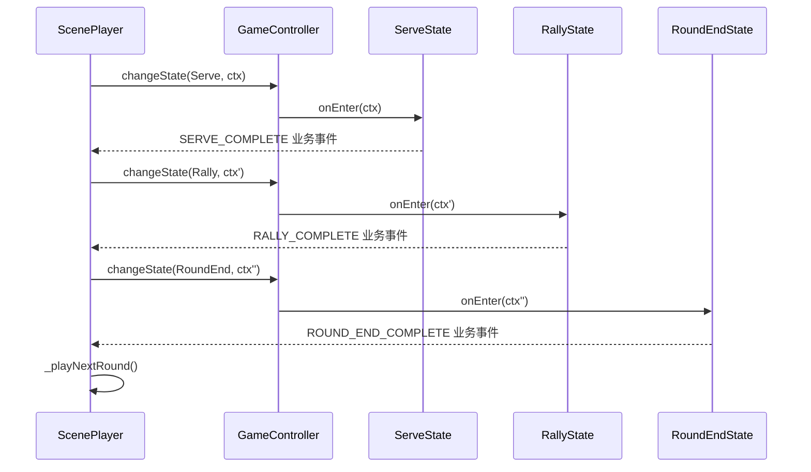
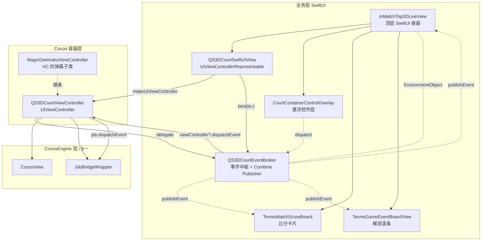
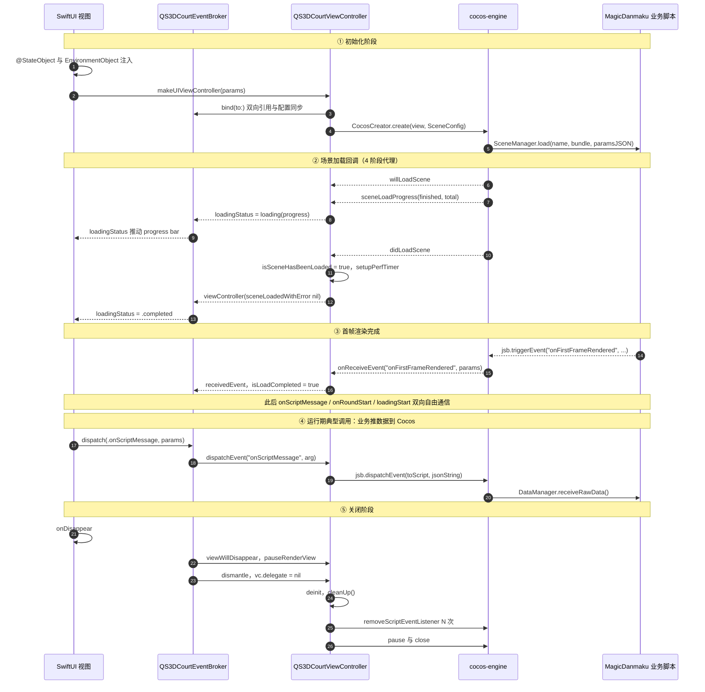

+++
date = '2026-05-30T22:40:08+08:00'
draft = true
title = '3D球场项目 (五)'
tags = ['3D', 'Cocos', 'WebGPU', 'VAT', 'iOS']
categories = ['iOS 开发', '前端开发']
+++

[3D球场项目 (四)]() 把服务端推到了线上：
导演 Agent 把每个 Point 切成 `SERVE / RALLY / CONCLUSION` 三段，配齐了动作、机位、
位置、比分、解说，按 `seq` 单调下发到客户端。本篇回到客户端，看 Cocos 这一侧拿到 Script
之后，是怎么把它变成屏幕上一拍接一拍的比赛画面的。

整个客户端改造分四层落地，本篇只讲和 3D 球场主干业务直接相关的内容：

- **CocosEngine 层**：场景加载架构升级（进度 / 传参 / Delegate 回调 / JSBridge
  内存语义）；
- **MagicDanmaku 层**：3D 球场的核心业务代码（数据流、状态机、动画 / 球轨迹 / 相机 /
  观众）；
- **MagicDanmaku iOS 层**：场景加载回调的演化，以及 `CocosPlayer` 在调用链里的角色；
- **业务层**：腾讯体育 App 的 SwiftUI 视图把上面三层包成一个标准组件。

每一层和业务流程脱钩的内容（性能优化、稳定性 / crash 修复、构建工程化）统一抽到了
[3D球场项目 (六)：客户端工程化与优化]()。

下面这张图先把四层的位置关系和数据流向摆出来，读者可以把它当作整篇文章的导航——
**箭头是数据流方向**（服务端 Script 自顶向下灌进引擎、引擎事件自底向上回到 SwiftUI），
每个节点旁标了对应章节：

<div class="arch-diagram arch-pf5">
  <style>
    .arch-pf5 { font-size: 13px; color: #222; margin: 1.2em 0; max-width: 100%; overflow-x: auto; }
    .arch-pf5 .layer {
      background: #f0f4f8;
      border: 1.5px solid #aab4c2;
      border-radius: 8px;
      padding: 14px 16px 16px;
      margin: 10px 0;
      position: relative;
    }
    .arch-pf5 .layer-title {
      font-weight: 600;
      color: #334155;
      margin-bottom: 4px;
      font-size: 14px;
    }
    .arch-pf5 .layer-sub {
      color: #64748b;
      font-size: 12px;
      margin-bottom: 10px;
    }
    .arch-pf5 .row { display: flex; gap: 10px; flex-wrap: wrap; align-items: center; }
    .arch-pf5 .node {
      background: #fff;
      border: 1px solid #8b8b8b;
      border-radius: 18px;
      padding: 6px 14px;
      min-width: 60px;
      text-align: center;
      box-shadow: 0 1px 1px rgba(0,0,0,0.03);
      flex: 1 1 auto;
      white-space: nowrap;
    }
    .arch-pf5 .node.wrap {
      white-space: normal;
      line-height: 1.35;
      padding: 8px 12px;
    }
    .arch-pf5 .node.entry {
      background: #fef3c7;
      border-color: #d97706;
      color: #78350f;
      font-weight: 600;
    }
    .arch-pf5 .node.event {
      background: #ede9fe;
      border-color: #7c3aed;
      color: #4c1d95;
    }
    .arch-pf5 .group {
      background: #fafbfc;
      border: 1px dashed #9aa4b2;
      border-radius: 8px;
      padding: 12px;
      flex: 1;
      min-width: 200px;
      display: flex;
      flex-direction: column;
    }
    .arch-pf5 .group-title {
      font-weight: 600;
      color: #475569;
      margin-bottom: 8px;
      font-size: 13px;
    }
    .arch-pf5 .arrow {
      text-align: center;
      color: #94a3b8;
      font-size: 18px;
      line-height: 1;
      margin: 4px 0;
      user-select: none;
    }
    .arch-pf5 .arrow.down::before { content: "▼ 推数据"; font-size: 12px; color: #d97706; }
    .arch-pf5 .arrow.up::before   { content: "▲ 回事件"; font-size: 12px; color: #7c3aed; }
    .arch-pf5 .arrow.bidi::before { content: "▲▼ 双向"; font-size: 12px; color: #475569; }
    .arch-pf5 .app-row { display: flex; justify-content: center; }
    .arch-pf5 .app-row .node { flex: 0 0 auto; min-width: 140px; padding: 8px 24px; }
    .arch-pf5 .legend {
      display: flex; gap: 14px; justify-content: center; align-items: center;
      margin-bottom: 10px; font-size: 12px; color: #475569; flex-wrap: wrap;
    }
    .arch-pf5 .legend .node { flex: 0 0 auto; min-width: 0; padding: 4px 12px; font-size: 12px; }

    @media (max-width: 900px) {
      .arch-pf5 { font-size: 12px; }
      .arch-pf5 .layer { padding: 10px 10px 12px; }
      .arch-pf5 .layer-title { font-size: 13px; }
      .arch-pf5 .row { gap: 6px; }
      .arch-pf5 .row > .node {
        flex: 1 1 calc(33.333% - 6px);
        padding: 5px 6px;
        min-width: 0;
        font-size: 11.5px;
        white-space: normal;
        line-height: 1.3;
        word-break: break-word;
      }
      .arch-pf5 .group { padding: 8px; min-width: 0; }
      .arch-pf5 .app-row .node { min-width: 0; padding: 6px 18px; flex: 0 0 auto; white-space: nowrap; }
    }
    @media (max-width: 420px) {
      .arch-pf5 .row > .node { flex: 1 1 calc(50% - 6px); }
    }

    @media (prefers-color-scheme: dark) {
      .arch-pf5 { color: #e2e8f0; }
      .arch-pf5 .layer { background: #1e293b; border-color: #475569; }
      .arch-pf5 .group { background: #0f172a; border-color: #475569; }
      .arch-pf5 .node { background: #0f172a; border-color: #94a3b8; color: #e2e8f0; }
      .arch-pf5 .node.entry { background: #78350f; border-color: #fbbf24; color: #fef3c7; }
      .arch-pf5 .node.event { background: #4c1d95; border-color: #a78bfa; color: #ede9fe; }
      .arch-pf5 .layer-title, .arch-pf5 .layer-sub, .arch-pf5 .group-title, .arch-pf5 .legend { color: #cbd5e1; }
    }
  </style>

  <div class="legend">
    <div class="node entry">数据入口</div>
    <div class="node event">事件回流</div>
  </div>

  <div class="app-row">
    <div class="node entry">服务端 Script（PartFour）</div>
  </div>
  <div class="arrow down"></div>

  <div class="layer">
    <div class="layer-title">业务层 SwiftUI（QQ 体育 App）</div>
    <div class="layer-sub">§四 — 把 Cocos View 包成 SwiftUI 组件，事件用 Combine Broker 双向桥接</div>
    <div class="row">
      <div class="node">InMatchTop3DLiveView</div>
      <div class="node">QS3DCourtSwiftUIView</div>
      <div class="node event">QS3DCourtEventBroker</div>
      <div class="node">CourtContainerControlOverlay</div>
      <div class="node">TennisMatchScoreBoard</div>
      <div class="node">TennisGameEventBoardView</div>
      <div class="node">QS3DCourtViewController</div>
    </div>
  </div>
  <div class="arrow bidi"></div>

  <div class="layer">
    <div class="layer-title">MagicDanmaku iOS 层（CocoaPods framework，对外导出）</div>
    <div class="layer-sub">§三 — 把引擎符号 + CocosPlayer 一起导给业务层；场景就绪回调由消费者各自实现</div>
    <div class="row">
      <div class="node">CocosView</div>
      <div class="node">CocosCreator</div>
      <div class="node">JsbBridgeWrapper</div>
      <div class="node">CocosPlayer</div>
      <div class="node">CocosMessageInvoker</div>
    </div>
  </div>
  <div class="arrow bidi"></div>

  <div class="layer">
    <div class="layer-title">CocosEngine 层（cocos-engine 内部分支）</div>
    <div class="layer-sub">§一 — loadScene 全流程能力升级（进度 / 传参 / 4 阶段代理）+ JsbBridgeWrapper 内存修复</div>
    <div class="row">
      <div class="node">Director.loadScene</div>
      <div class="node">CocosLoadSceneConfig.params</div>
      <div class="node event">CocosViewSceneDelegate（4 阶段协议）</div>
      <div class="node">SceneManager.load</div>
    </div>
  </div>
  <div class="arrow bidi"></div>

  <div class="layer">
    <div class="layer-title">MagicDanmaku 层：3D 球场业务（assets/tennis/...）</div>
    <div class="layer-sub">§二 — 数据 → 状态机 → Handler → 渲染的单向漏斗</div>
    <div class="row">
      <div class="group">
        <div class="group-title">Model 层（§2.1）</div>
        <div class="row">
          <div class="node entry">DataManager</div>
          <div class="node">ScenePlayer</div>
          <div class="node">RoundData</div>
        </div>
      </div>
      <div class="group">
        <div class="group-title">Game 层（§2.2 / §2.3）</div>
        <div class="row">
          <div class="node">GameController</div>
          <div class="node">States × 6</div>
          <div class="node">Handlers × 7</div>
        </div>
      </div>
    </div>
    <div class="arrow">▼</div>
    <div class="row">
      <div class="node">QSPlayerController + QSArmature</div>
      <div class="node">QSBallTraceController（Bezier / Physics）</div>
      <div class="node">CameraController</div>
      <div class="node">AudienceGenerator</div>
    </div>
  </div>
</div>

橙色节点是 **数据入口**——`Script JSON` 从服务端推下来，最终落到
`DataManager.receiveRawData()`。紫色节点是 **事件回流**——比如场景加载成功 / 失败、
`onRoundStart` / `onFirstFrameRendered` 等事件，由底层逐层冒泡回 SwiftUI 视图。

下面按这四层往下展开。

---

## 一、CocosEngine 层：场景加载架构

我们使用的是基于官方 cocos-engine 的内部分支（路径 `cocos-engine/`，commit range
`f02824d7..ba37d081`，约 26 个提交）。这一阶段引擎侧的改造大致可以归成四组，本章
只聚焦其中和 3D 球场主干业务直接相关的"场景加载架构"这一组——`loadScene` 这条线被
升级成"传参 + 进度 + 即将加载 / 失败回调"的全流程能力，让 Native 容器能像 UIKit
控制器那样精细管理 Cocos 场景。其余三组（应用启动模板、OpenAL 退出期 crash、Swift
友好的 OC 头标注）属于稳定性 / 工程化范畴，统一放到
[3D球场项目 (六)：客户端工程化与优化]() 里。

PartThree、PartFour 都讲过线上链路的几个动作：拉数据、加载 Cocos 场景、推 Script。
最早 Native 容器调 `loadScene` 是 **fire-and-forget** 的——传一个场景名，啥时候加载完
不知道，失败了也不知道，不能传任何业务参数。线上跑起来这个问题立刻暴露：
进度条没法画、失败没法降级、复用同一个场景换不同 mid 还得自己想办法。

这一阶段把 `loadScene` 的能力补齐：

### 1.1 `Director.loadScene` 增加进度回调（`0cfb6383`）

```typescript
// cocos-engine/cocos/game/director.ts:429
public loadScene (sceneName: string, onLaunched?: OnSceneLaunched, onUnloaded?: OnUnload): boolean;
public loadScene (
    sceneName: string,
    onProgress: OnLoadSceneProgress,           // ★ 新增进度回调
    onLaunched?: OnSceneLaunched,
    onUnloaded?: OnUnload,
): boolean;
public loadScene (sceneName, onProgressOrOnLaunched?, onLaunchedOrOnUnloaded?, onUnloaded?): boolean {
    // 通过 onProgressOrOnLaunched 的 arity 区分两种重载——
    // 进度回调签名是 (finished, total, item)，length === 3
    // ...
    if (onProgress) {
        bundle.loadScene(sceneName, onProgress, onComplete);
    } else {
        bundle.loadScene(sceneName, onComplete);
    }
}
```

用 TS 的方法重载一次扩展、保留旧签名向后兼容——业务侧不用改老代码，新代码可以多塞一个
`(finished, total, item)` 回调出来画进度条。

### 1.2 iOS `CocosViewSceneDelegate`：四阶段代理回调（`13a7ff22` / `2a722090`）

光有进度还不够，**Native 容器要的是"willLoad / progress / didLoad / didFail"** 一整套
生命周期。在 `CocosView.h` 里加了 `CocosViewSceneDelegate` 协议：

```objc
// cocos-engine/native/cocos/platform/ios/Headers/CocosView.h:46
@protocol CocosViewSceneDelegate <NSObject>
@optional
/// 场景即将加载
- (void)cocosView:(CocosView *)cocosView willLoadScene:(NSString *)sceneName;

/// 场景加载进度更新
- (void)cocosView:(CocosView *)cocosView
  sceneLoadProgress:(NSString *)sceneName
           finished:(NSInteger)finished
              total:(NSInteger)total;

/// 场景加载完成
- (void)cocosView:(CocosView *)cocosView didLoadScene:(NSString *)sceneName;

/// 场景加载失败
- (void)cocosView:(CocosView *)cocosView
   didFailLoadScene:(NSString *)sceneName
              error:(NSError * _Nullable)error;
@end

@interface CocosView : UIView<CocosMetalUIView>
#if __has_feature(objc_arc)
@property (nonatomic, weak,   nullable) id<CocosViewSceneDelegate> sceneDelegate;
#else
@property (nonatomic, assign, nullable) id<CocosViewSceneDelegate> sceneDelegate;
#endif
// ...
@end
```

容器侧只要 `cocosView.sceneDelegate = self`，就能在 SwiftUI / UIKit 这一侧拿到完整的
"页面骨架 → 加载中 → 渲染就绪 → 错误兜底"四个时机。

### 1.3 加载场景的同时支持传参（`2a614611`）

PartFour 介绍的 `mid`、`pointId`、`courtFlipped` 这些值都需要在场景启动时就告知客户端，
原本只能在场景启动后再用 JsbBridge 异步发——慢半拍。`CocosLoadSceneConfig` 增加了
`params` 字段：

```objc
// cocos-engine/native/cocos/platform/ios/Headers/CocosCreator.h:19
@interface CocosLoadSceneConfig : NSObject
@property (nonatomic, copy, readonly) NSString *sceneName;
@property (nonatomic, copy, nullable, readonly) NSString *bundleNameOrPath;
@property (nonatomic, copy, nullable, readonly) NSDictionary<NSString *, id> *params;  // ★

+ (instancetype)configWithSceneName:(NSString *)sceneName
                   bundleNameOrPath:(NSString * _Nullable)bundleNameOrPath
                             params:(NSDictionary<NSString *, id> * _Nullable)params;
@end
```

底层把这个 dict 直接 JSON 序列化拼进 `SceneManager.load(sceneName, bundle, jsonString)`
调用串里——也就是说 **params 是一条 ObjC → JS 的同步参数通道**，场景脚本第一帧就能拿到：

```objc
// cocos-engine/native/cocos/platform/ios/CocosCreator.mm:46（loadScript 拼接）
- (NSString *)loadScript {
    NSMutableString *script = [NSMutableString stringWithFormat:@"SceneManager.load('%@'", self.sceneName];
    if (self.bundleNameOrPath.length > 0) [script appendFormat:@", '%@'", self.bundleNameOrPath];
    if (self.params.count > 0) {
        NSData *jsonData = [NSJSONSerialization dataWithJSONObject:self.params
                                                           options:kNilOptions error:&error];
        NSString *jsonString = [[NSString alloc] initWithData:jsonData
                                                     encoding:NSUTF8StringEncoding];
        [script appendFormat:@", '%@'", jsonString];   // ★ 拼成第三个参数
    }
    [script appendString:@")"];
    return [script copy];
}
```

### 1.4 `JsbBridgeWrapper` 内存语义修复（`5d7f60f6`）

`loadScene` 改完之后，业务侧出现了零星的 listener 多次触发 / 触发后 crash 的情况，
根因是 `OnScriptEventListener`（一个 Objective-C block）在 `addScriptEventListener:` 里
被当成可"按指针比较"的对象，但 ARC / MRR 下 block 拷贝后地址可能变化。修法是引入
一个 `JsbScriptListenerHolder` 包装类，**同时持有原始指针（用作去重 key）和拷贝
后的 callback（用作实际调用）**：

```objc
// cocos-engine/native/cocos/platform/apple/JsbBridgeWrapper.mm:35
@interface JsbScriptListenerHolder : NSObject
@property (nonatomic, copy, readonly)   OnScriptEventListener callback;  // 拷贝后用于回调
@property (nonatomic, assign, readonly) OnScriptEventListener original; // 原始指针，仅做去重比较
- (instancetype)initWithOriginal:(OnScriptEventListener)listener;
@end

- (void)addScriptEventListener:(NSString*)eventName listener:(OnScriptEventListener)listener {
    if (!eventName || !listener) return;
    NSMutableArray* arr = [cbDictionary objectForKey:eventName];
    if (!arr) {
        NSMutableArray* newArr = [[NSMutableArray alloc] init];
        [cbDictionary setObject:newArr forKey:eventName];
        arr = newArr;
        [newArr release];                          // 字典持有
    }
    for (JsbScriptListenerHolder* h in arr) {
        if (h.original == listener) return;       // 同一原始 block 不重复加
    }
    JsbScriptListenerHolder* h = [[JsbScriptListenerHolder alloc] initWithOriginal:listener];
    [arr addObject:h];
    [h release];
}

- (void)triggerEvent:(NSString*)eventName arg:(NSString*)arg {
    NSMutableArray* arr = [cbDictionary objectForKey:eventName];
    if (!arr) return;
    // ★ 拷贝一份快照，避免回调过程中修改数组导致崩溃
    NSArray* snapshot = [[arr copy] autorelease];
    for (JsbScriptListenerHolder* h in snapshot) h.callback(arg);
}
```

两个细节值得单独点出来：① `original` 用 `assign` 不持有，只做去重比较；② `triggerEvent`
里用拷贝的 snapshot 遍历——Cocos 业务很容易在收到事件后又调 `removeScriptEventListener`，
不快照的话遍历中改数组直接 crash。

---

## 二、MagicDanmaku 层：3D 球场核心业务

3D 球场的大头都在这里，代码全部位于 `assets/tennis/resources/src/scripts/`。
本章只讲业务逻辑——也就是 Native 推送的 Script 怎么一路驱动到屏幕上的球员动作；
为了在中低端机上稳住 30 / 60 fps 做的一整轮性能优化（VAT、材质合并、减面、纹理压缩、
shader 边线…）独立成篇放到
[3D球场项目 (六)：客户端工程化与优化]() 里。

整个客户端的数据流是一个 **单向漏斗**：原始 Script JSON → 队列编排 → 状态机 → Handler
执行 → 渲染。下面是主图：

<div class="arch-diagram dataflow">
  <style>
    .dataflow { font-size: 13px; color: #222; margin: 1.4em 0; max-width: 100%; overflow-x: auto; }
    .dataflow .layer {
      background: #fafbfc;
      border: 1.5px solid #aab4c2;
      border-radius: 8px;
      padding: 12px 14px 14px;
      margin: 0;
      position: relative;
    }
    .dataflow .layer-title {
      font-weight: 600;
      color: #334155;
      font-size: 13px;
      margin-bottom: 8px;
    }
    .dataflow .row { display: flex; gap: 12px; flex-wrap: wrap; }
    .dataflow .node {
      background: #fff;
      border: 1px solid #94a3b8;
      border-radius: 8px;
      padding: 8px 12px;
      flex: 1 1 auto;
      min-width: 0;
      text-align: center;
      box-shadow: 0 1px 2px rgba(0,0,0,0.04);
      line-height: 1.4;
    }
    .dataflow .node .name { font-weight: 600; color: #1e293b; }
    .dataflow .node .desc { color: #64748b; font-size: 11.5px; margin-top: 2px; }
    .dataflow .node.entry { background: #fef3c7; border-color: #d97706; }
    .dataflow .node.entry .name { color: #78350f; }
    .dataflow .node.entry .desc { color: #92400e; }
    .dataflow .node.coordinator { background: #ede9fe; border-color: #7c3aed; }
    .dataflow .node.coordinator .name { color: #4c1d95; }
    .dataflow .node.coordinator .desc { color: #6d28d9; }
    .dataflow .node.state { background: #fef9c3; border-color: #ca8a04; }
    .dataflow .node.state .name { color: #713f12; }
    .dataflow .node.state .desc { color: #854d0e; }
    .dataflow .arrow-down {
      display: flex;
      justify-content: center;
      align-items: center;
      gap: 8px;
      margin: 0;
      padding: 6px 0;
      color: #64748b;
      font-size: 12px;
    }
    .dataflow .arrow-down::before { content: "▼"; color: #94a3b8; font-size: 14px; }
    .dataflow .arrow-down .label {
      background: #f1f5f9;
      border: 1px solid #cbd5e1;
      border-radius: 4px;
      padding: 2px 8px;
      font-family: ui-monospace, SFMono-Regular, Menlo, monospace;
      font-size: 11.5px;
      color: #475569;
    }
    .dataflow .feedback {
      margin: 8px 0 0;
      padding: 8px 12px;
      background: #f0f9ff;
      border-left: 3px solid #0284c7;
      border-radius: 4px;
      color: #075985;
      font-size: 12px;
      display: flex;
      align-items: center;
      gap: 8px;
    }
    .dataflow .feedback::before { content: "↺"; font-size: 16px; color: #0284c7; }
    .dataflow .feedback code {
      background: #e0f2fe;
      padding: 1px 6px;
      border-radius: 3px;
      font-size: 11.5px;
    }

    @media (max-width: 900px) {
      .dataflow .row { gap: 8px; }
      .dataflow .row > .node {
        flex: 1 1 calc(50% - 8px);
        padding: 6px 8px;
      }
    }
    @media (max-width: 480px) {
      .dataflow .row > .node { flex: 1 1 100%; }
    }

    @media (prefers-color-scheme: dark) {
      .dataflow { color: #e2e8f0; }
      .dataflow .layer { background: #0f172a; border-color: #475569; }
      .dataflow .node { background: #1e293b; border-color: #94a3b8; }
      .dataflow .node .name { color: #e2e8f0; }
      .dataflow .node .desc { color: #94a3b8; }
      .dataflow .node.entry { background: #78350f; border-color: #fbbf24; }
      .dataflow .node.entry .name, .dataflow .node.entry .desc { color: #fef3c7; }
      .dataflow .node.coordinator { background: #4c1d95; border-color: #a78bfa; }
      .dataflow .node.coordinator .name, .dataflow .node.coordinator .desc { color: #ede9fe; }
      .dataflow .node.state { background: #713f12; border-color: #facc15; }
      .dataflow .node.state .name, .dataflow .node.state .desc { color: #fef9c3; }
      .dataflow .layer-title { color: #cbd5e1; }
      .dataflow .arrow-down { color: #94a3b8; }
      .dataflow .arrow-down .label { background: #1e293b; border-color: #475569; color: #cbd5e1; }
      .dataflow .feedback { background: #082f49; color: #bae6fd; border-left-color: #38bdf8; }
      .dataflow .feedback code { background: #0c4a6e; color: #e0f2fe; }
    }
  </style>

  <div class="layer">
    <div class="layer-title">① Native / iOS 容器</div>
    <div class="row">
      <div class="node entry">
        <div class="name">JSBridge</div>
        <div class="desc">newScripts / scriptCompletions / completedScripts / commands</div>
      </div>
    </div>
  </div>

  <div class="arrow-down"><span class="label">receiveRawData()</span></div>

  <div class="layer">
    <div class="layer-title">② Model 层（数据 → 队列 → 章节）</div>
    <div class="row">
      <div class="node">
        <div class="name">DataManager</div>
        <div class="desc">队列 + UPSERT + 去重</div>
      </div>
      <div class="node coordinator">
        <div class="name">ScenePlayer</div>
        <div class="desc">章节调度 + 超时检查</div>
      </div>
      <div class="node">
        <div class="name">RoundData / ScriptSequence</div>
        <div class="desc">章节数据模型</div>
      </div>
    </div>
  </div>

  <div class="arrow-down"><span class="label">changeState(...)</span></div>

  <div class="layer">
    <div class="layer-title">③ Game 层（状态机 + 业务执行）</div>
    <div class="row">
      <div class="node coordinator">
        <div class="name">GameController</div>
        <div class="desc">状态机宿主 + 协调者</div>
      </div>
      <div class="node state">
        <div class="name">States × 6</div>
        <div class="desc">Serve / Rally / RoundEnd / ChangeOver / MatchEnd / Pause</div>
      </div>
      <div class="node">
        <div class="name">Handlers × 7</div>
        <div class="desc">Serve / Rally / BallToss / ServeAnimation / Pause / ChangeOver / MatchEnd</div>
      </div>
    </div>
    <div class="feedback">
      <span><code>notifyStateEvent</code> 反向把 <code>SERVE_COMPLETE / RALLY_COMPLETE / ROUND_END_COMPLETE</code> 回到 ScenePlayer，触发下一个章节</span>
    </div>
  </div>

  <div class="arrow-down"><span class="label">walk / hit / fly / 切机位</span></div>

  <div class="layer">
    <div class="layer-title">④ 渲染层</div>
    <div class="row">
      <div class="node">
        <div class="name">QSPlayerController</div>
        <div class="desc">+ QSArmature 动画状态机</div>
      </div>
      <div class="node">
        <div class="name">QSBallTraceController</div>
        <div class="desc">+ Bezier / Physics / Effect</div>
      </div>
      <div class="node">
        <div class="name">CameraController</div>
        <div class="desc">+ GestureController</div>
      </div>
      <div class="node">
        <div class="name">AudienceGenerator</div>
        <div class="desc">VAT + GPU Instancing</div>
      </div>
    </div>
  </div>
</div>

往下分四个小节展开。

### 2.1 数据流：DataManager → ScenePlayer → GameController

服务端按 PartFour 的双段式投递推下来的 JSON，进 Cocos 之前先经过 Native 容器，再通过
JSBridge 喂给 `DataManager.receiveRawData()`。这里有四路输入，按优先级写：

```typescript
// Model/DataManager.ts:387
public receiveRawData(rawData: RawServerData): void {
    // 1. 已有 newScript 的"补齐"——优先合并到 _pendingRounds 里那条占位回合上
    if (rawData.scriptCompletions?.length) {
        this._processScriptCompletions(rawData.scriptCompletions, ts, seq);
    }
    // 2. 一次到齐的完整回合（一段式）
    if (rawData.completedScripts?.length) {
        this._processCompletedScripts(rawData.completedScripts, ts, seq);
    }
    // 3. 占位回合（先 SERVE + RALLY_LOOP，等 scriptCompletions 收尾）
    if (rawData.newScripts?.length) {
        this._processNewScripts(rawData.newScripts, ts, seq);
    }
    // 4. 全局指令（换边/盘末/暂停）——按 seq 插队
    if (rawData.commands?.length) {
        this._addCommandsToQueue(rawData.commands, ts, seq);
    }
    this._restoreLoopingRounds();
    this._cleanupOldRounds();
}
```

四路输入最终统一塞进一个 **按 `seq` 升序的队列**——`ROUND` 项和 `COMMAND` 项混排。
ScenePlayer 这一侧拿队列只看一件事：当前 `seq` 是否到了，到了就 `getNextItem()`。

队列里的 `RoundData` 又是若干 `Chapter` 的容器（章节模型见 PartFour）：

```typescript
// Model/ScriptSequence.ts:36-45
export enum ChapterType {
    SERVE       = 'SERVE',
    RALLY       = 'RALLY',
    RALLY_LOOP  = 'RALLY_LOOP',  // 占位章节，等 scriptCompletions 替换
    CONCLUSION  = 'CONCLUSION',
}
```

`ScenePlayer` 拿到一项 `ROUND` 之后，走完整的章节流水线：

```typescript
// Model/ScenePlayer.ts:594 / 672 / 775
private _playNextRound(): void {
    const item = this._dataManager.getNextItem();
    if (!item) { this._changeState(WAITING_DATA); return; }
    if (item.itemType === QueueItemType.ROUND) this._executeRound(item.roundData);
    else                                       this._executeCommand(item.command);
}

private _executeRound(round: RoundData): void {
    this._currentRound = round;
    this._currentChapterIndex = 0;
    this._startRoundTimeOutCheckTimer();   // §2.1.4 会讲
    this._playCurrentChapter();
}

private _playCurrentChapter(): void {
    const chapter = this._currentRound.sequence[this._currentChapterIndex];
    switch (chapter.chapter) {
        case ChapterType.SERVE:
            this._playServeChapter(chapter as ServeChapter);       break;
        case ChapterType.RALLY:
            this._playRallyChapter(chapter as RallyChapter);       break;
        case ChapterType.RALLY_LOOP:
            this._playRallyChapter(chapter as RallyLoopChapter);   break;
        case ChapterType.CONCLUSION:
            /* 跳过：Rally 结束时已统一处理 Conclusion */          break;
    }
}
```

每一个 `_play*Chapter` 内部都做同一件事——构造 context，再 `gameController.changeState(...)`：
**ScenePlayer 是"导演"，但它不直接动球员，全部转给 GameController 的状态机执行**。

执行完一个状态后，GameController 会反向通过 `notifyStateEvent` 触发 ScenePlayer 的
回调，回调里调下一个章节，形成闭环：



### 2.2 GameController：状态机宿主 + 协调者

`GameController` 自己不写业务，它只做三件事：状态机管理、上下文数据访问、公共服务。

```typescript
// Game/GameController.ts:20-33（注释精简）
/**
 * GameController - 协调者
 * 1. 管理状态机（创建、切换、传递上下文）
 * 2. 提供数据访问接口（球员信息、网球节点等）
 * 3. 提供公共服务（位置生成、球飞行、球员移动、击球时间计算）
 * 设计原则：不处理具体业务逻辑（由 Handler 处理），所有状态转换在这里发起
 */
```

状态切换本身做了三件事：合法性校验、状态实例缓存、上下文传递：

```typescript
// Game/GameController.ts:750-782
public changeState(stateType: GameStateType, context?: any): void {
    if (this._currentState && !this._currentState.canTransitionTo(stateType)) {
        warn(`无法从 ${this._currentState.stateType} 切换到 ${stateType}`);
        return;
    }
    if (this._currentState) this._currentState.onExit();

    let newState = this._stateInstances.get(stateType);
    if (!newState) {
        newState = this._createState(stateType);
        this._stateInstances.set(stateType, newState);  // 实例缓存
    }
    this._currentState = newState;
    this._currentState.onEnter(context);
}
```

State 全集和职责：

| State | 创建的 Handler | 职责 | 允许去往 |
|---|---|---|---|
| `ServeState` | `ServeHandler` + `ServeAnimationHandler` + `BallTossHandler` | 走位 → 抛球 → 击球 → 球离手 | `Rally` / `RoundEnd` / `Pause` / `MatchEnd` |
| `RallyState` | `RallyHandler` | 多拍循环；`endLoop()` 由外部触发结束 | `RoundEnd` / `Pause` / `MatchEnd` |
| `RoundEndState` | — | 胜负动画 + 表情 + 音效，3s 后通知外部 | `Serve` / `ChangeOver` / `MatchEnd` |
| `ChangeOverState` | — | 一盘结束换边 | `Serve` |
| `PauseState` | `PauseHandler` | 球员走到椅子坐下 | `Serve` |
| `MatchEndState` | `MatchEndHandler` | 终止态 | — |

<div class="arch-diagram statemachine">
  <style>
    .statemachine { font-size: 13px; color: #222; margin: 1.4em 0; max-width: 100%; overflow-x: auto; }
    .statemachine .sm-mainline {
      display: flex;
      align-items: center;
      justify-content: center;
      gap: 0;
      flex-wrap: wrap;
      padding: 14px 8px 8px;
    }
    .statemachine .state {
      background: #fff;
      border: 1.5px solid #94a3b8;
      border-radius: 10px;
      padding: 10px 14px;
      min-width: 110px;
      text-align: center;
      box-shadow: 0 1px 2px rgba(0,0,0,0.04);
      flex: 0 0 auto;
      line-height: 1.35;
    }
    .statemachine .state .name { font-weight: 600; color: #1e293b; }
    .statemachine .state .desc { color: #64748b; font-size: 11.5px; margin-top: 2px; }
    .statemachine .state.entry { background: #fef3c7; border-color: #d97706; }
    .statemachine .state.entry .name { color: #78350f; }
    .statemachine .state.terminal { background: #fee2e2; border-color: #dc2626; }
    .statemachine .state.terminal .name { color: #7f1d1d; }
    .statemachine .state.branch { background: #ede9fe; border-color: #7c3aed; }
    .statemachine .state.branch .name { color: #4c1d95; }
    .statemachine .arrow {
      flex: 0 0 auto;
      display: flex;
      flex-direction: column;
      align-items: center;
      gap: 2px;
      margin: 0 4px;
      color: #475569;
      font-size: 11.5px;
    }
    .statemachine .arrow .label {
      background: #f1f5f9;
      border: 1px solid #cbd5e1;
      border-radius: 3px;
      padding: 1px 6px;
      font-family: ui-monospace, SFMono-Regular, Menlo, monospace;
      font-size: 11px;
      white-space: nowrap;
    }
    .statemachine .arrow .glyph { font-size: 18px; line-height: 1; color: #64748b; }
    .statemachine .arrow.up .glyph::before { content: "▲"; }
    .statemachine .arrow.right .glyph::before { content: "▶"; }
    .statemachine .arrow.down .glyph::before { content: "▼"; }
    .statemachine .arrow.fork .glyph { display: flex; gap: 8px; font-size: 16px; }
    .statemachine .arrow.fork .glyph::before { content: "▶"; }

    .statemachine .sm-roundend-fanout {
      display: flex;
      justify-content: center;
      gap: 28px;
      flex-wrap: wrap;
      margin-top: 10px;
      padding: 0 8px 8px;
    }
    .statemachine .branch-col {
      display: flex;
      flex-direction: column;
      align-items: center;
      gap: 6px;
      flex: 0 1 auto;
      min-width: 0;
    }
    .statemachine .branch-col .label {
      background: #f1f5f9;
      border: 1px solid #cbd5e1;
      border-radius: 3px;
      padding: 1px 8px;
      font-family: ui-monospace, SFMono-Regular, Menlo, monospace;
      font-size: 11px;
      color: #475569;
      white-space: nowrap;
    }
    .statemachine .branch-col .glyph {
      color: #64748b;
      font-size: 16px;
      line-height: 1;
    }
    .statemachine .branch-col .back {
      color: #0284c7;
      font-size: 11.5px;
      font-style: italic;
    }

    .statemachine .pause-row {
      margin-top: 16px;
      padding: 12px 14px;
      background: #f8fafc;
      border: 1px dashed #94a3b8;
      border-radius: 8px;
    }
    .statemachine .pause-row .pause-title {
      font-size: 12px;
      color: #475569;
      margin-bottom: 8px;
    }
    .statemachine .pause-row .pause-content {
      display: flex;
      align-items: center;
      justify-content: center;
      gap: 12px;
      flex-wrap: wrap;
    }
    .statemachine .pause-row .pause-source {
      color: #475569;
      font-family: ui-monospace, SFMono-Regular, Menlo, monospace;
      font-size: 11.5px;
    }

    @media (max-width: 720px) {
      .statemachine .sm-mainline { gap: 4px; padding: 10px 4px 6px; }
      .statemachine .state { min-width: 0; flex: 1 1 calc(33% - 8px); padding: 8px 6px; }
      .statemachine .arrow { width: 100%; flex-direction: row; justify-content: center; margin: 4px 0; }
      .statemachine .arrow .glyph::before { content: "▼" !important; }
      .statemachine .sm-roundend-fanout { gap: 12px; }
      .statemachine .branch-col { flex: 1 1 calc(33% - 12px); min-width: 0; }
    }

    @media (prefers-color-scheme: dark) {
      .statemachine { color: #e2e8f0; }
      .statemachine .state { background: #1e293b; border-color: #94a3b8; }
      .statemachine .state .name { color: #e2e8f0; }
      .statemachine .state .desc { color: #94a3b8; }
      .statemachine .state.entry { background: #78350f; border-color: #fbbf24; }
      .statemachine .state.entry .name { color: #fef3c7; }
      .statemachine .state.terminal { background: #7f1d1d; border-color: #f87171; }
      .statemachine .state.terminal .name { color: #fee2e2; }
      .statemachine .state.branch { background: #4c1d95; border-color: #a78bfa; }
      .statemachine .state.branch .name { color: #ede9fe; }
      .statemachine .arrow { color: #cbd5e1; }
      .statemachine .arrow .label,
      .statemachine .branch-col .label { background: #1e293b; border-color: #475569; color: #cbd5e1; }
      .statemachine .arrow .glyph,
      .statemachine .branch-col .glyph { color: #94a3b8; }
      .statemachine .branch-col .back { color: #38bdf8; }
      .statemachine .pause-row { background: #0f172a; border-color: #475569; }
      .statemachine .pause-row .pause-title,
      .statemachine .pause-row .pause-source { color: #cbd5e1; }
    }
  </style>

  <!-- 主线：Serve → Rally → RoundEnd -->
  <div class="sm-mainline">
    <div class="state entry">
      <div class="name">ServeState</div>
      <div class="desc">发球协调</div>
    </div>
    <div class="arrow right">
      <div class="label">球离手</div>
      <div class="glyph"></div>
    </div>
    <div class="state">
      <div class="name">RallyState</div>
      <div class="desc">多拍循环</div>
    </div>
    <div class="arrow right">
      <div class="label">Rally 结束</div>
      <div class="glyph"></div>
    </div>
    <div class="state">
      <div class="name">RoundEndState</div>
      <div class="desc">胜负动画 + 表情</div>
    </div>
  </div>

  <!-- ServeState 直接到 RoundEnd 的快路（ACE/双误）单独标注 -->
  <div style="text-align:center; color:#64748b; font-size:11.5px; padding: 0 8px 4px;">
    ↑ <span style="background:#f1f5f9; border:1px solid #cbd5e1; border-radius:3px; padding:1px 6px; font-family: ui-monospace,SFMono-Regular,Menlo,monospace; font-size:11px;">ACE / 双误</span>：ServeState 直接 → RoundEndState（跳过 Rally）
  </div>

  <!-- RoundEnd 三向分流 -->
  <div class="sm-roundend-fanout">
    <div class="branch-col">
      <span class="label">普通回合</span>
      <span class="glyph">▼</span>
      <div class="state entry">
        <div class="name">ServeState</div>
        <div class="desc">下一回合发球</div>
      </div>
    </div>
    <div class="branch-col">
      <span class="label">一盘结束</span>
      <span class="glyph">▼</span>
      <div class="state branch">
        <div class="name">ChangeOverState</div>
        <div class="desc">换边</div>
      </div>
      <span class="back">↻ 回到 ServeState</span>
    </div>
    <div class="branch-col">
      <span class="label">比赛结束</span>
      <span class="glyph">▼</span>
      <div class="state terminal">
        <div class="name">MatchEndState</div>
        <div class="desc">终止态</div>
      </div>
    </div>
  </div>

  <!-- Pause 旁路 -->
  <div class="pause-row">
    <div class="pause-title">★ 旁路：暂停 / 恢复</div>
    <div class="pause-content">
      <span class="pause-source">ServeState / RallyState</span>
      <span style="color:#64748b;">▶</span>
      <div class="state branch" style="min-width:auto;">
        <div class="name">PauseState</div>
        <div class="desc">球员走到椅子坐下</div>
      </div>
      <span style="color:#0284c7; font-size:11.5px; font-style:italic;">↻ 恢复 → ServeState</span>
    </div>
  </div>
</div>

### 2.3 Handler：每一步的真正业务执行者

`State.onEnter` 里几乎都在创建对应的 `Handler` 然后委托给它。Handler 里才会真的调
`QSPlayerController` 让球员跑、调 `QSBallTraceController` 让球飞。

**ServeHandler**（发球流程）分四步执行，全部异步：

```typescript
// Game/Handlers/ServeHandler.ts:89
public startServe(server, receiver, context): void {
    this._server = server;
    this._receiver = receiver;
    this._isServing = true;
    this._serverWalkCompleted = false;
    this._receiverWalkCompleted = false;
    this._walkPlayersToPosition();   // ① 走位
    // ② 走位回调里 → _initializeHandlers() → BallTossHandler.startToss()  抛球
    // ③ 抛球到顶 → ServeAnimationHandler 触发发球动画
    // ④ 发球动画 hit 关键帧 → ball 飞出 → _handleServeComplete()
}
```

**RallyHandler**（多拍循环）干两件事：算下一个击球点的世界坐标，算球的飞行时间。
其中击球点偏移用了一张超简单的查找表——根据"哪一边球场 × 正手/反手"四象限取值：

```typescript
// Game/Handlers/RallyHandler.ts:264
private _getHitPositionOffset(animationName: string, player: GamePlayerInfo): Vec3 {
    const isLeftCourt = player.courtSide === CourtSide.LEFT;
    switch (animationName) {
        case 'hit':           // 正手：球员身体右侧
            return isLeftCourt ? new Vec3(1.2, 0, -0.8) : new Vec3(-1.2, 0, 0.8);
        case 'back_hand_hit': // 反手：球员身体左侧
            return isLeftCourt ? new Vec3(-0.5, 0, 0)   : new Vec3(0.5, 0, 0);
        default:              return new Vec3(0, 0, 0);
    }
}
```

**球飞行时间** 是这套系统里最容易出 bug 的地方——画面要求"球到达 = 球员跑到位 +
挥拍到 hit 关键帧"。差一点点就出现"球先到，球员还在跑"或"球员挥空拍球才慢悠悠飞过来"。
线上版的算式是：

```
球飞行时间 = 球员移动时间(moveTime) + 最小等待(0.05s) + 击球关键帧时间(hitKeyframeTime)
```

并对动画播放速度做归一化（不同等级的回合可以放快/放慢动画）：

```typescript
// Game/GameController.ts:1510
public calculateBallFlightTime(receiver, receivePosition, animationName): {...} {
    const { moveTime } = receiver.controller.calculateMoveTimeAndSpeed(receivePosition);

    let hitKeyframeTime = receiver.hitKeyframeTime || 0.5;
    if (animationName) {
        const cfg = AnimationConfigManager.getAnimationConfigFromNode(receiver.node, animationName, false);
        hitKeyframeTime = (cfg.hitKeyframeTime ?? 0) / (cfg.speed || 1.0);  // 归一化
    }

    let ballFlightTime = moveTime + 0.05 + hitKeyframeTime;
    if (ballFlightTime < this._ballMinFlightTime) {
        ballFlightTime = this._ballMinFlightTime;  // 太短的球补齐到底线
    }
    return { ballFlightTime, moveTime, idleTime: 0.05, hitKeyframeTime };
}
```

### 2.4 三个易踩坑的设计点

逐节细写不必要，把三个值得展开的设计点单独抽出来。

**(a) ACE / 双误的兼容判断**（`ad5bac9f`）

PartFour 里"发球分直接结束"是 HOLD STRATEGY 控制的——服务端押后 IN_PROGRESS、等
PointConfirmed 一把推 COMPLETED。客户端拿到的是一个**只有 `SERVE` 章节、没有
`CONCLUSION`** 的 Round。如果按"必须有 CONCLUSION 才算完整"这条规则判断，整个回合永远
进不了完成态。修法是把"完整"改成三层降级：

```typescript
// Model/RoundData.ts:112
public isDataComplete(): boolean {
    if (this.isLooping) return false;                  // 占位回合
    if (this.getConclusionChapter()) return true;      // 正常有相持
    const serve = this.getServeChapter();              // ACE / 双误
    if (serve && serve.winnerId && serve.winnerId !== "") return true;
    return false;
}
```

ScenePlayer 的发球完成回调也跟着分三种处理：

```typescript
// Model/ScenePlayer.ts:1913
if (_data.isConclusion) {  // 发球直接结束
    if (serveChapter.winnerId) {
        winnerId = serveChapter.winnerId;              // 数据里有就直接用
    } else if (isFault) {
        loserId = serveChapter.actorId;                // 双误：发球者输
        winnerId = this._getOpponentActorId(loserId);
    } else {
        winnerId = serveChapter.actorId;               // ACE：发球者赢
    }
    this._gameController.changeState(GameStateType.RoundEnd, { winnerId, loserId });
}
```

**(b) RALLY_LOOP 占位章节的退出**

`newScripts` 推下来时回合还没收尾，客户端用 `RALLY_LOOP` 让球员先来回拉着别停，
等到 `scriptCompletions` 把 `RALLY` + `CONCLUSION` 推下来再替换占位章节、播完结尾。
DataManager 的 UPSERT 是统一入口：

```typescript
// Model/DataManager.ts:572
private _upsertRound(pointId, sequence, ts, seq, isLooping): void {
    const existing = this._findExistingRound(pointId);
    if (existing) {
        const round = existing.roundData;
        round.sequence = sequence;
        if (isLooping) {
            round.markLooping();
            this._pendingRounds.set(pointId, round);
        } else {
            // newScript → completedScript：退出循环 + 抽 conclusion + 填充
            round.isLooping = false;
            this._extractConclusionInfo(round);
            this._fillRoundData(round);
            this._pendingRounds.delete(pointId);
        }
    } else {
        const round = new RoundData(pointId, sequence, ts, seq);
        this._setLastRoundMatchState(round, seq);     // 把上一回合比分挂上来
        if (isLooping) {
            round.markLooping();
            this._pendingRounds.set(pointId, round);
        } else {
            this._extractConclusionInfo(round);
            this._fillRoundData(round);
        }
        this._addRoundToQueue(round, ts, seq);
    }
}
```

`END_MATCH` / `PAUSE` 这两个全局指令进队列时还要顺带 **强制退出所有正在循环的回合**
——比赛已经结束了还在 RALLY_LOOP 的话，画面会一直拉个不停（`Model/DataManager.ts:867`）。

**(c) 回合超时恢复（`30caf93e` / `1339f79c`）**

直播链路偶尔会丢包或服务端临时卡住，结果就是某个回合一直拿不到 `CONCLUSION`，画面
卡在 RALLY_LOOP。线上版用了一套"前向检测 + 后向恢复"：

```typescript
// Model/ScenePlayer.ts:2050
private _checkRoundTimeOut(): void {
    if (this._currentRound.getConclusionChapter()) {
        this._sendLoadingEnd();                        // 数据已到，退出
        return;
    }
    const elapsed = (Date.now() - this._currentRoundStartTime) / 1000;
    if (elapsed >= this.roundTimeOutThreshold) {       // 默认 120s
        this._roundTimeOutCheckCount++;
        if (!this._isLoadingStartSent) this._sendLoadingStart();   // 通知 Native：拉数据
        if (this._roundTimeOutCheckCount >= this._roundTimeOutCheckMaxCount) {
            this._clearRoundTimeOutCheckTimer();       // 5 次重试后放弃
            return;
        }
        this._handleCurrentRoundNotCompleted(this._currentRound.pointId);
    }
}

// 后向恢复：Native 拉到新数据进队列后
private _handleQueueUpdated(queueLength: number): void {
    if (this._isLoadingStartSent) {
        this._resyncFromLatestRound();   // 不补中间，直接跳到最新一回合
        this._sendLoadingEnd();
    }
}
```

设计上有两个细节要注意：① 超时阈值是 120s，Tennis 一个 Point 的时长极端值都到不了
这个量级；② 恢复时 **不补中间**，直接跳到队列里最新那回合——丢几个回合换稳定，比同步
等服务端补强百倍。

业务逻辑就讲到这里。这一层另一半内容——为了在中低端机上稳住帧率做的资产 + 代码两侧的
优化（VAT、合材、减面、shader 边线、降频缓存…）抽到了
[3D球场项目 (六)：客户端工程化与优化]()
里讲。

---

## 三、MagicDanmaku iOS 层

`MagicDanmakuiOS` 是把 §一 的 cocos-engine（`CocosView` / `CocosCreator` /
`JsbBridgeWrapper` 等头文件）+ 业务侧需要的弹幕 / CC 通道，封装成一个 **CocoaPods
framework** 对接 §四 业务层用。这一层的提交集中在 `20742594..a4b2c7c9` 范围内。

延续前面的取舍，本章只聚焦两件事——**场景加载回调怎么从引擎传到业务侧**、
**`CocosPlayer` 在调用链里的角色**；其余工程化内容（modulemap、framework 打包、
lipo 架构冲突、A11 设备 crash、引擎子模块滚动更新）都搬到了 PartSix。

### 3.1 场景加载回调演化：从 Notification 到 SceneDelegate 再回退

`CocosPlayer` 是 `MagicDanmakuiOS` 这个 pod 里直接对外的播放器封装。围绕"场景加载完成"
这个回调，commit range 内有一段值得记一笔的演化：

**Step 1（`469cc519`）：尝试从 NSNotification 切到 SceneDelegate**

§一 §1.2 引擎层新加的 `CocosViewSceneDelegate` 协议第一个吃螃蟹的就是它。改造
方向是从单例广播改成点对点代理：

```diff
// MagicDanmakuiOS/Classes/CocosPlayer.m （commit 469cc519）
-@interface CocosPlayer ()
+@interface CocosPlayer ()<CocosViewSceneDelegate>

 - (instancetype)init... {
-    // 监听 scene 加载成功
-    [NSNotificationCenter.defaultCenter addObserver:self
-        selector:@selector(mainSceneIsReady:)
-        name:CocosCreator.sceneLoadNotification object:nil];
 }

-- (void)mainSceneIsReady:(NSNotification *)noti {
-    NSString *sceneName = noti.userInfo[@"sceneName"];
-    if (sceneName.length == 0 || ![sceneName isEqualToString:@"main"]) return;
-    // ... 后续逻辑
-}

 - (void)setupCocosView... {
-    self.cocosView = [[CocosView alloc] initWithFrame:frame];
+    CocosView *view = [[CocosView alloc] initWithFrame:frame];
+    view.sceneDelegate = self;            // ★ 直接挂代理，不走 Notification
+    self.cocosView = view;
 }

+#pragma mark - CocosViewSceneDelegate
+- (void)cocosView:(CocosView *)cocosView didLoadScene:(NSString *)sceneName {
+    if (sceneName.length == 0 || ![sceneName isEqualToString:@"main"]) return;
+    self.isMainSceneIsReady = YES;
+    if ([self.delegate respondsToSelector:@selector(sceneLaunched)]) {
+        [self.delegate sceneLaunched];
+    }
+    [CocosMessageInvoker sendLiveDeltaTimeConfigToCC];
+    [CocosMessageInvoker sendInitCCLoggerToCC];
+    [self sendCCBundleInfo:self.bundlePath bundleName:[self.bundlePath lastPathComponent]];
+    [self.pendingOperations enumerateObjectsUsingBlock:^(NSOperation *op, NSUInteger idx, BOOL *stop) {
+        [NSOperationQueue.mainQueue addOperation:op];
+    }];
+    [self.pendingOperations removeAllObjects];
+}
```

切代理的工程动机非常直观：

- **NSNotification 是单例广播**——多 `CocosView` 同时存在时，CocosPlayer A 也会收到
  CocosView B 的回调，要靠 `userInfo` 里的 `sceneName` 拼字符串去判断；代理是点对点
  的，谁挂谁收；
- **生命周期清晰**——观察者要手动 `removeObserver:`，代理是 `weak`，view 销毁了引用
  自然断；
- **API 更显式**——`willLoad / progress / didLoad / didFail` 分别由独立方法承担，
  比单一 Notification 信息更结构化。

**Step 2（`27a02ef9`）：整体回滚，删掉所有 sceneDelegate 相关代码**

不到两周后，`27a02ef9`（"CHG: 更新资源"）这一笔把 `CocosPlayer.m` 里的代理改造**整体
回滚**——`<CocosViewSceneDelegate>` 协议、`isMainSceneIsReady` / `pendingOperations`
属性、`view.sceneDelegate = self`、`cocosView:didLoadScene:` 全部撤掉，回到了原本不
依赖任何"场景就绪"信号的状态。同时 `playWithTime:` 等播放控制方法也做了大量调整。

回滚的根本原因从 commit message 看不出来，但结合后续提交可以推断出方向：**需要在
`MagicDanmakuKMM` 这种跨平台分支里复用同一份代码**——`27a02ef9` 加了一个新的 `init`
重载，注释就写明了 "加一个 init 是为了兼容 MagicDanmakuKMM"。代理协议在 KMM 那边不
好桥接，干脆把这条线从 `MagicDanmakuiOS` pod 里完全摘出去。

**最终结果**：当前 commit range 末端的 `CocosPlayer.m` 里**既没有 NSNotification 监听
也没有 SceneDelegate 实现**——"场景就绪"这件事被上抛，由 §四 业务层
`QS3DCourtViewController` 自己实现 `CocosViewSceneDelegate` 来收（这正是 §四 §4.6
里看到的那段代码）。

这是个值得单独写一笔的工程教训：**当一个抽象同时服务多个上游消费者，往哪一层放
回调要看消费者本身**。`MagicDanmakuiOS` 既要服务 iOS 业务层（QQ 体育 App，纯 Swift），
又要服务 KMM 那条线（多平台），就不适合把 OC 协议这种 iOS-specific 的回调机制写死在
里面——下放到具体业务消费者那里反而更灵活。

### 3.2 业务承接：`CocosPlayer` 的角色

整套 iOS 层最关键的对外类是 `CocosPlayer`——它在调用链里夹在业务层
`QS3DCourtViewController`（§四）和 cocos-engine（§一）之间，把弹幕场景需要的"播放
控制、消息通道、热更新、tick 信号量"等都一并打包：

```objc
// MagicDanmakuiOS/Classes/CocosPlayer.m:36（实例字段精简）
@interface CocosPlayer ()
@property (nonatomic, assign, readwrite) DMMAGICPlayerEventType playEventType;
@property (nonatomic, assign, readwrite) CocosPlayerEngineType engineType;
@property (nonatomic, strong) CocosView *cocosView;
@property (nonatomic, copy)   NSString *bundlePath;
@property (nonatomic, assign) BOOL needValidateSize;
@property (nonatomic, copy)   NSDictionary *startUpDictionary;
@end
```

§3.1 提到 `27a02ef9` 把"等场景就绪再 flush 命令"那套机制撤掉之后，`CocosPlayer`
里的初始化序列变成**最直白的"创建 view → 立刻发命令"**：

```objc
// MagicDanmakuiOS/Classes/CocosPlayer.m:382（创建路径精简）
- (void)configCocosView:(CGRect)frame bundlePath:(NSString *)bundlePath {
    [[CocosCreator sharedInstance] setIsSingletonMetalLayer:[self isSingletonMetalLayer]];
    self.cocosView = [[CocosView alloc] initWithFrame:frame];
    if (![CocosCreator sharedInstance].running) {
        [[CCNativeChannel shareInstance] resetChannel];
    }
    [self initStartUpConfig];
    [[CocosCreator sharedInstance] createWithRenderView:(CocosView *)self.cocosView];
    [CocosMessageInvoker sendLiveDeltaTimeConfigToCC];        // ★ 时间同步配置
    [CocosMessageInvoker sendInitCCLoggerToCC];               // ★ 日志通道初始化
    [CocosPlayer recordCocosCreatorBeenInited:YES];
    [self sendCCBundleInfo:bundlePath bundleName:[bundlePath lastPathComponent]];  // ★ 资源包指纹
}
```

三个 `send*` 调用合起来给 §二 的 JS 业务代码提供完整的 "时间同步 + 日志通道 + 资源包
指纹" 上下文。回滚后的版本不再做"等就绪再 flush"——`createWithRenderView` 一返回就同步
发，靠 §一 §1.3 介绍的 `SceneManager.load(name, bundle, jsonString)` 机制以及引擎
内部消息队列保证早发的消息不会丢。复杂度从 iOS 容器层下沉到了引擎层。

从 §四 业务层的角度看，**`CocosPlayer` 这条路径主要是给老的弹幕场景用的**——网球
3D 球场链路 `QS3DCourtViewController` 直接面向 cocos-engine 的 `CocosCreator` /
`CocosView` / `JsbBridgeWrapper`，并不经 `CocosPlayer`。两条路径并存，这也是
`MagicDanmakuiOS` 在 modulemap 里把 `CocosPlayer` 和裸引擎符号都对外导出的原因。

### 3.3 待补的子题

这一层还有一些代码本系列暂未拿到完整样本，先列出来留作后续补充：

1. **TTS 音频流**：解说音频怎么和 Chapter 的 RALLY 时长对齐、超时如何降级；
2. **断流自愈**：调 PartFour 介绍的 `GetScript(mid, pointId?)` 拉补偿数据后
   通过 `dispatch(.onScriptMessage, ...)` 灌回 Cocos（§四 §4.4 已写过这条线的业务侧，
   等 iOS 层网络代码补齐再串完整）；
3. **CCNativeChannel 消息全集**：`MagicDanmakuViewController` 注册的 `errorReport /
   clickConsumeResult / canvasClipOptimalRequest` 三类回调 + `danmakuSetting /
   playerMsg / appendDMSegment` 等推送消息的完整契约；
4. **静音 / 切到后台**：与 PartFour 的 freeze 比分、[PartSix
   §二 OpenAL 保护]() 一起形成的
   退出 / 重入闭环。

---

## 四、业务层

业务层是 QQ 体育 App 内的"3D 球场页面"——它把 §一 的 Cocos 容器、§二 的 Script 渲染、
§三 的 iOS 桥接全部包成一个标准的 SwiftUI 视图，扔到比赛页就能用。代码组织在两个目录：

- `Classes/Cocos/`：Cocos 容器 ViewController（`QS3DCourtViewController` +
  `MagicDanmakuViewController`），是 §三 iOS 层的具体落地；
- `Classes/3DCourt/`：上层 SwiftUI 视图 + Combine 事件分发（`InMatchTop3DLiveView` /
  `QS3DCourtSwiftUIView` / `QS3DCourtEventBroker` + 各种 UI 组件）。

### 4.1 整体分层



整套架构的核心是 **Broker 模式**：`QS3DCourtEventBroker` 作为 SwiftUI 视图层和
UIKit ViewController 的中介，**双向解耦**——上层视图只跟 Broker 打交道，
ViewController 也只把 delegate 指向 Broker，谁都不直接依赖谁。

### 4.2 SwiftUI 容器：UIViewControllerRepresentable

`QS3DCourtSwiftUIView` 是一个标准的 `UIViewControllerRepresentable`，把 §三 的
`QS3DCourtViewController` 包成 SwiftUI 视图：

```swift
// 3DCourt/QS3DCourtSwiftUIView.swift:39
struct QS3DCourtSwiftUIView: UIViewControllerRepresentable {
    private let sceneName: String
    private let resHubKey: String?
    private let mainBundleName: String?
    private let bundleNameOrPath: String?
    private let params: [AnyHashable: Any]?

    /// ★ 通过 EnvironmentObject 注入，避免在每个 init 都传一遍
    @EnvironmentObject private var eventBroker: QS3DCourtEventBroker

    public func makeUIViewController(context: Context) -> QS3DCourtViewController {
        let viewController: QS3DCourtViewController
        if let resHubKey = resHubKey {
            // ResHub 远程包加载
            viewController = QS3DCourtViewController(
                sceneName: sceneName, resHubKey: resHubKey,
                mainBundleName: mainBundleName, params: params)
        } else if let bundleNameOrPath = bundleNameOrPath {
            // 本地 Bundle 加载
            viewController = QS3DCourtViewController(
                sceneName: sceneName, bundleNameOrPath: bundleNameOrPath, params: params)
        } else {
            // 内置默认
            viewController = QS3DCourtViewController(sceneName: sceneName, params: params)
        }
        // ★ 双向绑定：viewController.delegate = broker；broker 弱持有 viewController
        eventBroker.bind(to: viewController)
        return viewController
    }

    static func dismantleUIViewController(_ vc: QS3DCourtViewController, coordinator: ()) {
        vc.delegate = nil   // SwiftUI 卸载时解引用
    }
}
```

`bind(to:)` 内部就是把双向引用建好、同步配置：

```swift
// 3DCourt/QS3DCourtEventBroker.swift:187
public func bind(to viewController: QS3DCourtViewController) {
    self.viewController = viewController
    viewController.delegate = self
    // 同步配置
    viewController.perfSampleInterval = self.perfSampleInterval
    viewController.enablePerfSampling = self.enablePerfSampling
    // 自动监听加载进度
    startMonitoringProgress(viewController.progress)
}
```

### 4.3 顶层视图：`InMatchTop3DLiveView`

`InMatchTop3DLiveView` 把 Cocos View、悬浮控件、比分牌、解说滚条按 SwiftUI 的方式
拼装起来，并通过 `.onReceive` 订阅 Broker 的事件流：

```swift
// 3DCourt/InMatchTop3DLiveView.swift:62
var body: some View {
    VStack(spacing: 0) {
        QS3DCourtSwiftUIView(sceneName: sceneName,
                             resHubKey: resHubKey,
                             mainBundleName: mainBundleName,
                             bundleNameOrPath: bundleNameOrPath,
                             params: initParams)         // ← mid / playerName / voiceId 都塞 initParams
            .overlay(makeBigEventIndicator(), alignment: .topLeading)
            .overlay(makeControlOverlay())               // ← 悬浮控件层
            .overlay(makeGameResultOverlay())
            .overlay(makeGuideOverlay())
            .overlay(makeLoadingMask())
        TennisBillboard()                                 // ← 解说滚条
            .frame(height: Constants.billboardHeight)
    }
    .onReceive(eventBroker.$loadingStatus, perform: handleLoadingStatusChange)
    .onReceive(eventBroker.eventPublisher, perform: handleCourtEvent)
    .valueChanged(isLoadCompleted) { _ in sendPendingDataIfNeeded() }
    .valueChanged(lifecyclePhase, onChange: handleLifeCyclePhaseChanged)
}
```

事件分发用的是 **rawValue 转枚举 + switch** 的写法，事件名集合就是 §二 客户端往上推的
那一套：

```swift
// 3DCourt/InMatchTop3DLiveView.swift:318
private func handleCourtEvent(_ event: QS3DCourtEventBroker.CocosEvent) {
    guard case .receivedEvent(let name, let params) = event else { return }
    guard let eventType = CocosListenableEvent(rawValue: name) else { return }

    switch eventType {
    case .onRoundStart:                  handleRoundStartEvent(params: params)
    case .onCurrentRoundNotCompleted:    complementaryRequest(params as? [AnyHashable: Any])
    case .loadingStart:                  shouldShowInterruptionLoading = true
    case .loadingEnd:                    shouldShowInterruptionLoading = false
    case .onMatchEnd:                    isGameEnd = true; requestMatchEndModel()
    case .onFirstFrameRendered:          isLoadCompleted = true
    default:                             break
    }
}
```

`CocosListenableEvent` 这个 String 枚举本身就是上下游的契约（PartFour 服务端 → §二
客户端 → 业务层 SwiftUI），所有事件名都集中在这里：

```swift
// 3DCourt/TennisMatchUtils.swift:15
enum CocosListenableEvent: String, CaseIterable {
    case onRoundStart                   // 回合开始（带 RoundEventModel）
    case onRoundEnd                     // 回合结束
    case onTouchMove                    // 用户在球场上拖动了视角
    case onTouchMoveEnd                 // 拖动结束（用于"恢复默认机位"按钮显隐）
    case onCurrentRoundNotCompleted     // §二 §2.1.4 (c) 超时通知
    case loadingStart                   // §二 §2.1.4 (c) 进入 loading
    case loadingEnd                     //                  退出 loading
    case onMatchEnd                     // 比赛结束
    case errorLogs                      // 错误日志上报
    case normalLogs                     // 普通日志上报
    case onFirstFrameRendered           // 首帧渲染完成（业务层"loading 蒙层"消失的信号）
}
```

注册端用 `addAllCocosListenableEvents()` 一次性把全集订下来：

```swift
// 3DCourt/QS3DCourtEventBroker.swift:662
func addAllCocosListenableEvents() {
    CocosListenableEvent.allCases.forEach { addCocosEventListener($0) }
}
```

### 4.4 Broker 事件中枢：用 Combine 把 delegate 拉平成 Publisher

`QS3DCourtEventBroker` 同时实现 `QS3DCourtViewControllerDelegate` 和
`ObservableObject`——往上是 SwiftUI 友好的 `Publisher`，往下是传统的 OC delegate：

```swift
// 3DCourt/QS3DCourtEventBroker.swift:65
class QS3DCourtEventBroker: NSObject, ObservableObject, QS3DCourtViewControllerDelegate {
    enum CocosEvent {
        case willLoadScene
        case sceneLoaded(error: Error?)
        case loadingProgressUpdate(progress: Progress)
        case loadingStatusChanged(status: LoadingStatus)
        case receivedEvent(name: String, params: Any?)               // ← 一般事件
        case receivedRequest(name: String, params: [String: Any]?,   // ← 同步请求
                             callback: (Error?, Any?) -> Void)
        case performanceReport(CocosProfileInfo)
    }
    @Published var loadingStatus: LoadingStatus = .loading(progress: 0)
    private let eventSubject = PassthroughSubject<CocosEvent, Never>()
    var eventPublisher: AnyPublisher<CocosEvent, Never> { eventSubject.eraseToAnyPublisher() }
    // ...
}
```

订阅端的 helper 把"按事件名筛选 + 在指定线程派发"封装得很简洁，三个重载分别接 `String`
/ `CourtEventType` / `CocosListenableEvent`：

```swift
// 3DCourt/QS3DCourtEventBroker.swift:347
func onEvent(_ eventName: String,
             on queue: DispatchQueue = .main,
             handler: @escaping (Any?) -> Void) -> AnyCancellable {
    eventPublisher
        .compactMap { event -> Any?? in
            if case .receivedEvent(let name, let params) = event, name == eventName {
                return params
            }
            return nil
        }
        .receive(on: queue)
        .sink { handler($0) }
}
```

往 Cocos 推数据的方向也走 Broker——枚举 `CourtEventType` 一一对应：

```swift
// 3DCourt/TennisMatchUtils.swift:43
enum CourtEventType: String {
    // ↓ 业务侧主动推给 Cocos 的事件
    case onSceneHide                    // 业务页隐藏（Cocos 暂停渲染）
    case onSceneShow                    // 业务页显示（Cocos 恢复渲染）
    case onScriptMessage                // §二 §2.1.1 数据流入口：补偿/TCP 拉到的脚本
    case onVoiceIdChanged               // 切换解说音色

    // ↓ 业务内部使用的事件（不发给 Cocos）
    case toggleVoiceControl             // 拉起音色面板（控件层 → SwiftUI 层）
    case setMute                        // 静音 / 取消静音
    case restoreDefaultCameraView       // 一键恢复默认机位
}

// 3DCourt/QS3DCourtEventBroker.swift:686
func dispatch(event: CourtEventType, param: [AnyHashable: Any]? = nil) {
    viewController?.dispatchEvent(event.rawValue, arg: param)
}
```

注意 `onScriptMessage`——它就是 §二 §2.1.1 那个 `DataManager.receiveRawData` 的入口：
当客户端因为长链断开而调 `onCurrentRoundNotCompleted` 时，业务层会去后端拉补偿数据，
拉到后通过 `dispatch(event: .onScriptMessage, param: 序列化后的脚本)` 灌回 Cocos，
形成 §二 §2.1.4 (c) 描述的"队列更新 → 跳到最新一回合"闭环。

### 4.5 悬浮控件：UIKit `hitTest` 实现点击穿透

球场上的"静音 / 切音色 / 恢复机位"三个按钮叠在 Cocos View 之上，但用户点空白处时
**不应该被业务层拦截**——拖动球场视角是 Cocos 自己处理的。这个 "按钮拦截 + 空白穿透"
用 UIKit 的 `hitTest` 实现得最干净：

```swift
// 3DCourt/CourtContainerControlOverlay.swift:147
override func hitTest(_ point: CGPoint, with event: UIEvent?) -> UIView? {
    let hitView = super.hitTest(point, with: event)
    guard hitView == self else {
        // 点击命中了某个子视图（按钮），重置自动隐藏倒计时
        if hitView?.isDescendant(of: self) == true, isOverlayVisible {
            scheduleAutoHide()
        }
        return hitView    // ★ 子视图正常响应
    }
    // ★ 命中的是覆盖层自身（空白区域）→ 触发"显隐切换"，并返回 nil 让事件穿透到 Cocos
    togglePublisher.send(())
    return nil
}
```

按钮回调一句话直接 `dispatch` 给 Cocos：

```swift
// 3DCourt/CourtContainerControlOverlay.swift:225
@objc private func onMuteBtnClicked(_ sender: UIButton) {
    sender.isSelected.toggle()
    eventBroker?.dispatch(event: .setMute, param: ["mute": sender.isSelected])
}

@objc private func onAIVoiceBtn(_ sender: UIButton) {
    eventBroker?.dispatch(event: .toggleVoiceControl)
}

@objc private func restoreAngle(_ sender: UIButton) {
    eventBroker?.dispatch(event: .restoreDefaultCameraView)
    sender.isSelected = false
}
```

### 4.6 Cocos 容器 VC：`QS3DCourtViewController`

§三 我们留了 TODO，这一节正好讲清楚。`QS3DCourtViewController` 是个标准的
`UIViewController`，构造器接受 §一 §1.3 提到的 `sceneName / resHubKey /
mainBundleName / bundleNameOrPath / params`：

```swift
// Cocos/QS3DCourtViewController.swift:188
required init(sceneName: String = "main",
              resHubKey: String? = nil,
              mainBundleName: String? = nil,
              bundleNameOrPath: String? = nil,
              params: [AnyHashable: Any]? = nil) {
    self.sceneName = sceneName
    self.resHubKey = resHubKey
    self.mainBundleName = mainBundleName
    self.bundleNameOrPath = bundleNameOrPath
    self.extParams = params
    self.creator = CocosCreator.sharedInstance()       // ★ §一 引擎单例
    self.jsb = JsbBridgeWrapper.sharedInstance()       // ★ §一 §1.4 修过内存语义
    self.progress = Progress(totalUnitCount: 100)
    self.statistics = QS3DCourtStaticsModel()
    super.init(nibName: nil, bundle: nil)
    commonInit()
}
```

`viewDidLoad` 里把 §一 §1.2 的 `sceneDelegate` 挂上、注册前后台通知：

```swift
// Cocos/QS3DCourtViewController.swift:241
override func viewDidLoad() {
    super.viewDidLoad()
    let cocos = CocosView(frame: view.bounds)
    cocos.isMultipleTouchEnabled = true
    view.addSubview(cocos)
    self.contentView = cocos
    cocos.sceneDelegate = self                         // ★ §一 §1.2 协议
    self.cocosView = cocos

    load()                                             // 三种加载方式之一
    addRequestEventListener()                          // 订阅 JSBridge "request" 事件

    NotificationCenter.default.addObserver(self,
        selector: #selector(applicationWillResignActive(_:)),
        name: UIApplication.willResignActiveNotification, object: nil)
    NotificationCenter.default.addObserver(self,
        selector: #selector(applicationDidBecomeActive(_:)),
        name: UIApplication.didBecomeActiveNotification, object: nil)
}
```

真正调引擎是 `loadScene`，**`extParams` 在这里被规整成 String key 的 dict 传给
`CocosLoadSceneConfig`**——回扣到 §一 §1.3 的 ObjC → JS 参数通道：

```swift
// Cocos/QS3DCourtViewController.swift:414
private func loadScene(_ path: String?, isRemote: Bool) {
    var params = extParams
    var scenePath = path
    if isRemote, let remotePath = path {
        if params == nil { params = [:] }
        params?["bundleFolderPath"] = URL(fileURLWithPath: remotePath).absoluteString
        if let mainBundle = mainBundleName, !mainBundle.isEmpty {
            scenePath = (remotePath as NSString).appendingPathComponent(mainBundle)
        }
    }
    // 把 [AnyHashable: Any] 折成 [String: Any]
    var stringKeyParams: [String: Any]?
    if let params = params {
        var converted: [String: Any] = [:]
        for (k, v) in params {
            if let s = k as? String { converted[s] = v } else { converted["\(k)"] = v }
        }
        stringKeyParams = converted
    }
    // ★ 拼出引擎的 SceneConfig，最终走到 SceneManager.load(name, bundle, jsonString)
    let config = CocosLoadSceneConfig(sceneName: sceneName,
                                      bundleNameOrPath: scenePath,
                                      params: stringKeyParams)
    guard let cocos = cocosView else { return }
    creator.create(withRenderView: cocos, sceneConfig: config)
    creator.viewWillClip(to: view.size)
    creator.resume(withRenderView: cocos)
}
```

`CocosViewSceneDelegate` 四个回调都在 `QS3DCourtViewController` extension 里收口
（§一 §1.2）：

```swift
// Cocos/QS3DCourtViewController.swift:648
extension QS3DCourtViewController: CocosViewSceneDelegate {
    func cocosView(_ cocosView: CocosView, willLoadScene sceneName: String) {
        guard self.cocosView == cocosView else { return }
        statistics?.sceneLoadTime = CFAbsoluteTimeGetCurrent()        // 计时起点
    }
    func cocosView(_ cocosView: CocosView, didLoadScene sceneName: String) {
        guard self.cocosView == cocosView else { return }
        isSceneHasBeenLoaded = true
        sceneLoadProgress?.completedUnitCount = totalProgressUnit
        showContent()
        delegate?.viewController?(self, sceneLoadedWithError: nil)    // ★ 通知 Broker
        if enablePerfSampling {
            creator.setProfileToggle(true)
            setupPerformanceTimerIfNeeded()                            // 启动性能采样
        }
    }
    func cocosView(_ cocosView: CocosView,
                   sceneLoadProgress sceneName: String,
                   finished: Int, total: Int) {
        // 远程包阶段在 progress 里只占 20 单位，其余 80 给前置下载
        let totalUnit: Int64 = (resHubKey ?? "").isEmpty ? 100 : 20
        // ... 更新进度
    }
    func cocosView(_ cocosView: CocosView,
                   didFailLoadScene sceneName: String, error: (any Error)?) {
        delegate?.viewController?(self, sceneLoadedWithError: error)
    }
}
```

JSBridge 订阅和派发的关键代码——**JSB 回调始终在主线程执行，所以用 `weak self +
MainActor.assumeIsolated` 安全访问 isolated 状态，再转给 delegate**：

```swift
// Cocos/QS3DCourtViewController.swift:467
@objc open func addCocosEventListener(_ event: String) {
    guard !event.isEmpty else { return }
    let cb: ScriptEventCallback = { [weak self] data in
        MainActor.assumeIsolated {
            guard let self = self else { return }
            let ret = (data as NSString?)?.jsonValueDecoded()           // JSON 解出来
            self.delegate?.viewController?(self, onReceiveEvent: event, params: ret)
        }
    }
    jsb.addScriptEventListener(event, listener: cb)                     // ★ §一 §1.4 修过的 API
    eventCbMap[event] = cb                                              // 记下来好取消
}

// Cocos/QS3DCourtViewController.swift:517
@objc open func dispatchEvent(_ event: String, arg param: [AnyHashable: Any]?) {
    guard isSceneHasBeenLoaded else { return }                          // 场景没加载好就吞掉
    let jsonString: String? = if let dict = param, !dict.isEmpty {
        (dict as NSDictionary).jsonStringEncoded() ?? ""
    } else { nil }
    let dispatch = { @Sendable [weak self] in
        MainActor.assumeIsolated {
            guard let self = self, !self.cleaned else { return }
            if let s = jsonString { self.jsb.dispatchEvent(toScript: event, arg: s) }
            else                    { self.jsb.dispatchEvent(toScript: event) }
        }
    }
    if Thread.isMainThread { dispatch() } else { DispatchQueue.main.async(execute: dispatch) }
}
```

清理流程是 **解 listener → pause → close**，三步必须按这个顺序——pause 在 close 前是
为了让定时器先停下、避免渲染指令打到已释放的 view 上：

```swift
// Cocos/QS3DCourtViewController.swift:630
private func cleanUp() {
    cleaned = true
    destroyPerformanceTimer()
    for (event, cb) in eventCbMap {
        if let listener = cb as? ScriptEventCallback {
            JsbBridgeWrapper.sharedInstance().removeScriptEventListener(event, listener: listener)
        }
    }
    if let cocos = cocosView {
        creator.pause(withRenderView: cocos)        // 先 pause 定时器
        creator.close(withRenderView: cocos)        // 再 close 渲染视图
    }
}
```

### 4.7 完整调用时序

把上面所有片段串起来，业务层从入口到关闭的完整时序：



### 4.8 `MagicDanmakuViewController`：弹幕场景的特化

`MagicDanmakuViewController` 是 `QS3DCourtViewController` 的子类，专门给"弹幕 + 3D
球场"场景用。它在父类基础上额外：

1. 把 view / contentView 背景设成透明（弹幕场景下面要透 video）；
2. 注册 `CCNativeChannel` 的三个回调（`errorReport` / `clickConsumeResult` /
   `canvasClipOptimalRequest`）；
3. 进出页面时把 `playerEventType` 切成 resume / pause，让 Cocos 业务脚本知道播放器状态。

它**不在网球 3D 球场链路里**，只是同一套 Cocos 容器的另一种使用形态。本系列前几篇讲的
都是网球链路（用 `QS3DCourtViewController` 直接接），这里点一下名留个索引就够。

### 4.9 业务层小结

业务层这一层做的事情，可以浓缩成一句话：**用 SwiftUI 的方式把一个 UIKit
ViewController 包装好 + 用 Combine 把 OC delegate 拉平成 Publisher**。

值得记一笔的设计决策：

| 决策 | 替代方案 | 选择原因 |
|---|---|---|
| Broker 中介模式 | 视图直接持有 VC | SwiftUI 视图频繁重建，VC 不能跟着重建 |
| `@EnvironmentObject` 注入 Broker | init 参数传 Broker | 避免每个子视图都改 init 签名 |
| 字符串枚举 `CocosListenableEvent` | 强类型事件结构体 | Cocos 那侧 JS 推过来的就是字符串名 |
| `params: [String: Any]` 透传 | 强类型化 | 业务字段还在迭代，引擎层不应感知具体业务字段 |
| `hitTest` 返回 `nil` 实现穿透 | 给 overlay 加 `userInteractionEnabled = false` | 需要"按钮可点 + 空白穿透"两态 |

预留几个待写的子题（后续若有具体代码再补）：

1. **3D 球场入口**：在 App 哪些场景出现，灰度策略如何配置；
2. **配置下发**：哪些 mid 启用 3D（呼应 PartFour 的 `tennis.enabledMids` 白名单）；
3. **可观测性**：客户端关键节点埋点（首次 SERVE 渲染、断流次数、超时恢复次数、平均帧率）；
4. **降级策略**：低端机怎么识别、降级到 2D 比分卡片。

---

## 五、收尾

PartFive 走完了客户端"功能正确"这一半：

- **CocosEngine 层** 把 `loadScene` 升级成"传参 + 进度 + 四阶段代理回调"的完整能力，
  并修了 `JsbBridgeWrapper` 的内存语义问题；
- **MagicDanmaku 层** 沿着 `Native 推送 → DataManager 队列 → ScenePlayer 章节调度 →
  GameController 状态机 → Handler → 渲染层` 走通，整条链路单向、状态可观测、所有
  "延迟 / 失败 / 超时" 都有兜底；
- **MagicDanmaku iOS 层** 把场景就绪回调和 `CocosPlayer` 在调用链里的位置讲清楚——
  这一层的代理协议短暂上线又被回滚，是个值得记下的设计决策；
- **业务层** 用 SwiftUI + Combine + Broker 模式把 UIKit ViewController 抹平成
  SwiftUI 友好的组件，事件流双向解耦。

另一半——"性能可接受 + 工程化稳定"——所有改动都在
[3D球场项目 (六)：客户端工程化与优化]()
里：modulemap / framework 打包、A11 设备 crash 修复、OpenAL 退出期保护、Swift
友好标注、VAT、合材、减面、shader 边线……两篇合起来，3D 球场客户端的工程闭环才算
完整。
