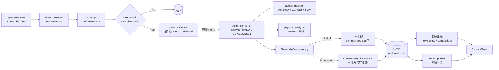
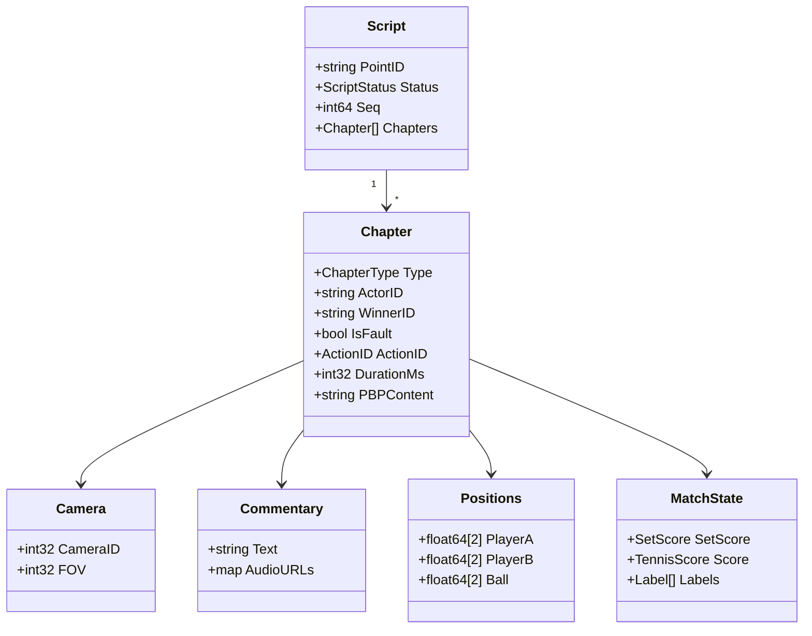
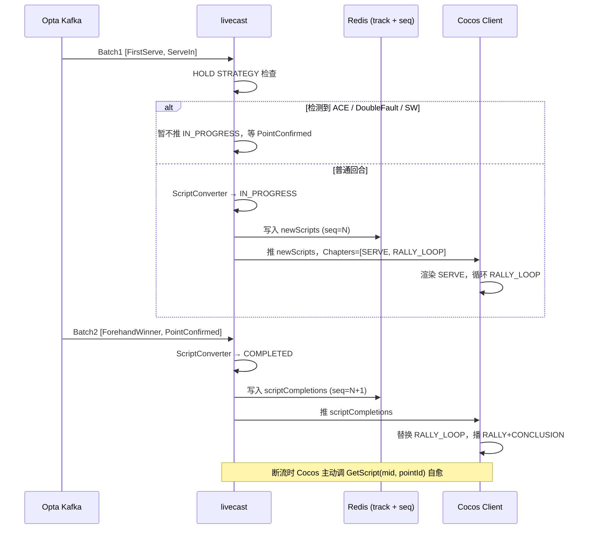

+++
date = '2026-05-30T20:23:44+08:00'
draft = false
title = '3D球场项目 (四)'
tags = ['Cocos', 'tRPC-Go', 'LLM', 'Opta']
categories = ['iOS 开发', '前端开发']
+++

项目终于来到了落地环节。
在[3D球场项目 (三)]()里，我们用一段离线
PBP 数据 + 一次 LLM 调用，把"导演 Agent"的雏形跑了起来。Demo 阶段的脚本是离线生成、整段
导入的；那时的 LLM 既负责"想象画面"，又顺手把动作、镜头、音效、解说词都打包了。

但项目一旦从 Demo 推到线上，导演 Agent 立刻面对三件事：

1. Opta 数据是按 Point 持续推过来的，**不会一次性把一场比赛喂给大模型**；
2. 大模型 **会失败、会延迟**，一旦卡住，球员就只能停在 idle；
3. 客户端会断流、会重连，**需要一个"刚才那一拍发生了什么"的回放接口**。

上一章末尾提到的三个坑——player 卡 idle、两人一直来回发球、长链断了客户端不知道
怎么补——本质都来自这三件事。线上版本的 livecast 服务（基于 tRPC-Go）做了一次完整的
工程化：导演 Agent 不再是单一 LLM，而是 **确定性脚本层 + LLM 解说层 + 双重下发保险**
的组合。本篇就讲这套组合怎么搭起来。

---

## 一、网球数据是怎么进来的

NBA 那边的 PBP 是 **单条** 投递：上游每发生一个篮球事件，就经 Kafka 推一条消息过来。
但网球数据天然是 **按回合聚合** 的——Opta 在一个 Point（一个回合）结束之后才会一次性
把这一拍涉及的所有事件下发，所以服务端也用了批量消费通道：

```
Kafka topic: pbp_flow
  └─ FlowConsumer.BatchHandle(msgs []*sarama.ConsumerMessage)
        └─ livecastSvc.ProcessBatchPBPFlow(payloads [][]byte)
```

进入 `ProcessBatchPBPFlow` 之后，先按 `mid`（match id）做二级分组、过滤掉非网球的批次，
再交给真正的 pipeline。两道闸门决定一场比赛的事件能不能走 3D 流水线：

```go
// 闸门 1：mid 必须是网球前缀（Opta WTA / ATP 的 category id）
func IsTennisMid(mid string) bool {
    // mid 形如 "100308:72845"，前缀代表 category
    return strings.HasPrefix(mid, "100308:") ||
           strings.HasPrefix(mid, "100309:")
}

// 闸门 2：在 Rainbow 配置中心的白名单里
//   livecast_config.json → tennis.enabledMids
//   命中 → 启用 3D 动画 + 深度研究素材注入
func IsTennisMatchEnabled(mid string) bool { /* … */ }
```

只有同时通过两个条件、又命中 PointConfirmed（21019）这个事件的批次才会真正走完整套链
路。下面这张图是后续几节会反复回到的"主图"，建议先看一眼留个印象：



把这张图记住，本篇剩下的内容只是把每一个方块的内部展开。

---

## 二、把若干 PBP 事件聚成一个"回合"

Opta 一批数据里通常含若干 typeId 事件：发球、接发、抽球、制胜分、得分确认……第三章
贴过那张完整的 typeId 对照表，这里只挑几个会真正影响"回合切片"的：

| 内部 EventType | typeId 段 | 含义 |
|---|---|---|
| `ServeEventTypeFirstServe` (20001) | 1153 | 一发 |
| `ServeEventTypeServeIn` (20003) | 1172 | 发球进场 |
| `PointEventTypeAce` (21001) | 1169 | ACE |
| `PointEventTypeForehandWinner` (21004) | 1156 | 正手制胜 |
| `TurnoverEventTypeDoubleFault` (3100) | 1168 | 双误 |
| `PointEventTypeQuarterWon` (21017) | 1176 | 这一盘结束 |
| `PointEventTypeConfirmed` (21019) | 1174 | 该回合得分确认 |

`point_collector` 的逻辑非常朴素：按 mid 把事件挂到一个缓冲队列里，**只有 21019
PointConfirmed 才视作回合结束**——不是任何"看起来像得分"的事件都能立刻翻篇。

```go
// 简化版：只在 PointConfirmed 命中时弹出整批事件
func (c *pointCollector) tryCompletePoint(
    ctx context.Context, mid string, eventType def.EventType,
) ([]*def.PBPEvent, bool) {
    if eventType != def.PointEventTypeConfirmed {
        return nil, false  // 还在攒事件
    }
    pointEvents := c.events[mid]
    delete(c.events, mid)
    return pointEvents, true
}
```

为什么要等 PointConfirmed？因为 Opta 会在判罚、鹰眼挑战、回收等场景**改写早先的事件**
（typeId 256/257 cancel/clear、262 ball position、266 time correction……），如果我们看到
"21001 ACE"就立刻往下推，遇到挑战翻盘就要回滚，麻烦得多。等"得分确认"是个一刀切的简单
契约。

---

## 三、确定性脚本层：导演 Agent 的"骨架"

到了这一步我们手上有一个完整的 Point（一组事件），下一步就是把它变成一段可以驱动 3D
动画的脚本。这是 PartThree 设想里"导演 Agent"的核心——但**线上版的实现完全不用 LLM**，
是确定性 Go 代码：

```go
// domain/livecast/script_converter.go
func (c *scriptConverter) ConvertEventsToScript(
    pointEvents []*def.PBPEvent,
    matchCtx *def.MatchContext,
    courtFlipped bool,
) (*def.Script, error) {
    serveEvent    := c.eventFinder.FindServeEvent(pointEvents)
    decisiveEvent := c.eventFinder.FindDecisiveEvent(pointEvents)

    // 一个 Point 切成三段
    script := &def.Script{ /* … */ }
    script.Chapters = append(script.Chapters,
        c.buildServeChapter(serveEvent, decisiveEvent, /* … */))

    // 发球分（ACE / 服务制胜 / 双误）就只有 SERVE，不要 RALLY/CONCLUSION
    if !def.IsServeResultEvent(decisiveEvent.EventType) {
        script.Chapters = append(script.Chapters, &def.Chapter{
            Type: def.ChapterTypeRally,
            DurationMs: c.CalculateRallyDuration(serveEvent, decisiveEvent),
        })
        script.Chapters = append(script.Chapters,
            c.buildConclusionChapter(decisiveEvent, /* … */))
    }
    return script, nil
}
```

也就是说，无论 LLM 是否在线、上下游网络是否抖动，**脚本骨架都是从规则里推出来的，确定
性产出**。这一句话是线上版与 PartThree demo 最大的差异。

### 3.1 一个 Chapter 里有什么



每个 Chapter 同时承载 **动作（ActionID）+ 镜头（Camera）+ 位置（Positions）+ 比分快照
（MatchState）+ 解说（Commentary）**——客户端拿到这个 Chapter 就足够独立播一段。

### 3.2 动作：一个封闭枚举

`def.ActionID` 是一个完全封闭的枚举（节选）。这样设计一是方便和客户端预置的动画绑定
（第一章里 HunYuan-MoCap 提取出来的动作库就是按这套 ID 命名），二是排错时一眼能看出
脚本里发生了什么：

| 区段 | 常量 | 含义 |
|---|---|---|
| 1–10 发球 | `ActionIDServeFirst (2)` / `ActionIDServeFirstInPlay (6)` | 一发 / 一发进场 |
| 11–20 发球结果 | `ActionIDWinnerAce (12)` / `ActionIDErrorDoubleFault (11)` | ACE / 双误 |
| 21–30 回合制胜 | `ActionIDWinner (21)` / `ActionIDWinnerVolley (22)` | 制胜 / 截击制胜 |
| 31–40 失误 | `ActionIDErrorForced (31)` / `ActionIDErrorUnforced (32)` | 受迫 / 非受迫 |
| 80–89 全局指令 | `ActionIDChangeover (80)` / `ActionIDSetEnd (85)` / `ActionIDMatchEnd (82)` | 换边 / 盘末 / 赛末 |
| 99 兜底 | `ActionIDUnknownOutcome (99)` | 拒绝渲染未知动作 |

这就是 PartThree 里那句"只能使用模型预置的动作"的代码体现——不是不让 LLM 编，而是
**LLM 根本不参与这一层**，它在确定性映射表里。

### 3.3 镜头：6 个机位 + 4 档景别

PartThree 当时写的是"4 个角度：1 特写 A、2 特写 B、3 A 侧、4 B 侧"。线上版的实现要丰富
一些：是 **6 个 CameraID + 4 档 FOV** 组合出来的：

```go
const (
    // 主机位（高位俯视）
    CameraMainA    int32 = 0
    CameraMainB    int32 = 3

    // 反打机位（低位贴边）
    CameraReverse1 int32 = 4
    CameraReverse2 int32 = 5
    CameraReverse3 int32 = 1
    CameraReverse4 int32 = 2

    // 景别由 FOV 切换
    FOVCloseUp   int32 = 45
    FOVNormal    int32 = 60
    FOVWide      int32 = 70
    FOVUltraWide int32 = 90
)
```

机位的选择规则也很简单——发球时永远用主机位 + CloseUp，回合中按拍序在反打和主机位之间
**循环**：

```go
func GetRallyCameraID(serverSide string, shotIndex int) int32 {
    if serverSide == "left" || serverSide == "playerA" {
        cameras := []int32{CameraReverse2, CameraReverse1, CameraMainA}
        return cameras[shotIndex%len(cameras)]
    }
    cameras := []int32{CameraReverse3, CameraReverse4, CameraMainB}
    return cameras[shotIndex%len(cameras)]
}
```

为什么不是固定特写？因为我们在 demo 阶段试过——一来一回都贴脸拍，画面会非常"机械"，
没有真实转播切镜头的节奏感。**循环切机位不是为了炫技，是为了让画面别那么单调**。

### 3.4 球场坐标：归一化 + 命名 Zone

第三章里那段 PBP JSON 写了 `x: 12.3, y: 4.1` 这样的浮点坐标——这是 demo 阶段的简化。
真实 Opta 数据里并没有现成的 (x, y)；落点要靠 **`PhysicsAnalyzer` 在命名 Zone 里随机
采样** 得到。

球场被归一化到 X∈[-1, +1]（长边）× Y∈[-1, +1]（宽边）。Singles 用 Y=±0.73 作边线，
Doubles 用 Y=±1.0：

```
                       Y +1.0 (doubles 边线)
                       Y +0.73 (singles 边线)
        playerA                            playerB
        baseline                           baseline
   X -1.0 ─────────┬───────┬───────┬───────────── X +1.0
                   │       │       │
         A's       │   服  │  务   │     B's
       service     │   T   │  Box  │   service
         box       │       │       │     box
                   │       │       │
                   │     net (X=0) │
                   │               │
                       Y -0.73 / -1.0
```

然后定义 30+ 个 **命名 Zone**（节选）：

```go
var CourtZones = map[string]CourtZone{
    // A 发球落点（B 的接发区）
    "SERVE_T_A_DEUCE":    {X: {0.10, 0.38}, Y: {-0.15,  0.0}},
    "SERVE_WIDE_A_DEUCE": {X: {0.10, 0.38}, Y: {-0.42, -0.30}},
    "SERVE_BODY_A_DEUCE": {X: {0.10, 0.38}, Y: {-0.28, -0.12}},

    // ACE 偏深的落点（贴近发球线）
    "ACE_T_A_DEUCE":      {X: {0.38, 0.46}, Y: {-0.12,  0.0}},
    "ACE_WIDE_A_DEUCE":   {X: {0.38, 0.46}, Y: {-0.42, -0.32}},

    // 制胜分常见的深角
    "DEEP_CORNER_A_POS_Y": {X: {-0.95, -0.75}, Y: { 0.70, 0.95}},
    "DEEP_CORNER_B_NEG_Y": {X: { 0.75,  0.95}, Y: {-0.95,-0.70}},

    // 球员所在区
    "NET_POS_A":      {X: {-0.30, -0.10}, Y: {-0.50, 0.50}},
    "BASELINE_POS_B": {X: { 0.80,  0.95}, Y: {-0.80, 0.80}},
}
```

事件类型 → 该选哪个 Zone → 在 Zone 内随机出一个 (x, y)，这样**同一个 ACE 每次"渲染"
落点都略有不同，但都落在合法区域**，画面不会因为坐标完全一致显得呆板。

最后 `applyCourtOrientation` 还做一件事：因为客户端 Cocos 的坐标系是 X 短边、Z 长边，
和我们内部 X 长边、Y 宽边正好相反，**输出前永远 swap x/y**；如果该场比赛把球员位置翻转
了（比如交换发球方），再 negate y。把这两件适配集中放在脚本输出最后一步，业务逻辑里就
不用关心坐标系怎么转。

```go
func (c *scriptConverter) applyCourtOrientation(
    pos *def.Positions, courtFlipped bool,
) *def.Positions {
    swap := func(v []float64) []float64 {
        if len(v) != 2 { return v }
        x, y := v[0], v[1]
        if courtFlipped { y = -y }
        return []float64{y, x}  // 永远 swap x/y
    }
    return &def.Positions{
        PlayerA: swap(pos.PlayerA),
        PlayerB: swap(pos.PlayerB),
        Ball:    swap(pos.Ball),
    }
}
```

到这一步为止，**没有任何 LLM 介入**。一个 Point 进来，骨架、动作、镜头、位置、比分都
已经定下来了。

---

## 四、LLM 解说层：导演 Agent 的"血肉"

LLM 在线上版只负责一件事——**给每个 Chapter 写一句不超过 15 字的解说词**。

调用点在 `srv_impl.go GenerateCommentary`：

```go
func (s *livecastService) GenerateCommentary(
    ctx context.Context,
    event *def.PBPEvent,
    matchCtx *def.MatchContext,
    frozenMatchState *def.MatchState,  // ← 这是关键
    pointEvents []*def.PBPEvent,
    positions *def.Positions,
) (string, error) {
    if s.llmClient != nil {
        prompt := s.buildCommentaryPrompt(/* … */)
        commentary, err := s.llmClient.GenerateCommentary(ctx, prompt)
        if err == nil {
            if parsed := livecast.ParseCommentaryJSON(commentary); parsed != "" {
                return parsed, nil
            }
        }
        log.WarnContextf(ctx, "LLM failed/empty, fallback to library")
    }
    return s.commentaryLib.GetCommentary(event, matchCtx), nil
}
```

设计上有三个细节值得展开：

### 4.1 强约束 JSON 输出

prompt 末尾有一段是写死的"输出指令"，要求模型 **必须只输出**：

```json
{"commentary": "你的解说词"}
```

禁 markdown 代码块、禁解释、禁评分、禁思考过程，字数 ≤15。这样下游的 `ParseCommentaryJSON`
逻辑就极简——拿出 `commentary` 字段即可，解析失败就走兜底。

为什么不让 LLM 写长文？两个原因：① 网球节奏快，下一拍随时会来，**长解说会被打断**；
② 短句更容易塞进 TTS 的发音节奏里。15 字对应约 3 秒语音，和 RALLY 的默认时长
`DefaultRallyDurationMs = 3000` 同一量级，方便后续对齐。

### 4.2 LLM 之前先 freeze 比分

注意 `GenerateCommentary` 的入参里有一个 `frozenMatchState`。它是在调用 LLM **之前** 就
已经从 `scoreBuilder.BuildMatchState` 拍下来的快照。这样做是为了防止：

> 调用 LLM 的过程中，恰好下一批数据进来了（比如 21017 QuarterWon）。如果 prompt 里塞的
> 是"实时"比分，等模型返回时实时比分已经不再适用了，解说词和画面就会错位。

把这一刻的比分先冻结，再交给 LLM，**LLM 看到什么、画面就播什么**，时序天然一致。这件事
在 demo 阶段没必要做，因为 demo 是离线生成，没有"并发批次"的概念。

### 4.3 LLM 失败必有兜底

PartThree 抱怨 "player 只能在 idle"，本质是 demo 把 LLM 当成同步生成器，模型一卡所有
东西就卡。线上版做了三件事：

1. **解耦**：LLM 与 ScriptConverter 解耦——画面动作不依赖 LLM 输出，最坏情况下只是少了
   一句解说词，球员该挥拍还是挥拍。
2. **预冻结**：上一节说的，比分先拍快照再请求。
3. **兜底库**：失败 / 空响应 / JSON 解析失败 → 取 `commentary_library_v2` 本地短句库
   （按事件类型挑句子）。库句子的语感和 LLM 比当然差一档，但**至少有声音**，画面不会
   尬住。

LLM 客户端默认参数是 `Model = gpt-5.1-chat`、`MaxTokens = 2000`、`Temperature = 1.0`、
`Timeout = 30s`，**没有客户端重试**——上游 LLMProxy 网关自行管理重试与限流，超时直接
判失败、走兜底。

---

## 五、下发与连接的双重保险

到这里画面、解说都齐了，剩下最后一道关：怎么把 Script 安全地交到客户端手里？

### 5.1 两段式投递：先占位，后收尾

Opta 的批次划分不一定和"一个完整 Point"对齐——有时候 Serve 在 Batch 1，Conclusion 在
Batch 2 才到。如果死等"完整 Point"再推，**画面在两批之间会僵住**；如果一收到 Serve 就推
完整脚本，又没法填后面的实际结果。

所以服务侧用了两段式投递：



- **Batch 1** 里只有 Serve+ServeIn → 推 `newScripts(seq=N)`，Chapters 是 `[SERVE,
  RALLY_LOOP]`，客户端先把发球播了，然后用 RALLY_LOOP 这个"占位章节"循环——可以理解成
  对峙状态的 idle 动画。
- **Batch 2** 里 Conclusion 到了 → 推 `scriptCompletions(seq=N+1)`，客户端用 `RALLY +
  CONCLUSION` 替换占位、播完结尾。
- **同一批就到齐**（很常见）→ 退化为一段式 `completedScripts(seq=N)`，客户端一次性收。

`seq` 是 Redis 的 INCR，单调递增；客户端只看 `seq` 就能判定先后顺序，不用额外去做时间戳
对齐。

### 5.2 HOLD STRATEGY：别在发球分上瞎推

PartThree 抱怨过"两个球员一直在来回发球"——根因是 demo 阶段一收到 Serve 就推 IN_PROGRESS
让客户端循环 RALLY_LOOP。如果这一拍其实是 ACE，迟到的"21001 ACE"事件还没到的时候，画面
就已经在循环对拉了，等真相到了再硬切，观感很差。

线上版加了一个 HOLD STRATEGY：

```go
// HOLD STRATEGY: 检测到发球分直接得分（ACE / 双误 / 服务制胜）
//   就先压住 IN_PROGRESS，等 PointConfirmed 一次性推 COMPLETED。
if livecast.HasServeDirectScoreEvent(bufferedEvents) {
    log.InfoContextf(ctx,
        "[Livecast] holding IN_PROGRESS: serve direct score detected, mid=%s", mid)
    return
}
// 普通回合：检测到 ServeIn 才推 IN_PROGRESS（确认发球进场了）
if !livecast.HasServeInEvent(bufferedEvents) {
    log.InfoContextf(ctx,
        "[Livecast] holding IN_PROGRESS: waiting for ServeIn, mid=%s", mid)
    return
}
```

简单说：**只有"普通对拉"会用占位章节；任何"分在发球结束"的场景都直接等 PointConfirmed
一把推完。**

### 5.3 GetScript：客户端自愈

最后是 PartThree 末尾说"长链断了，后台需要提供一个补充数据下发接口"——线上版就是
`GetScript(mid, pointId)` 这个 RPC：

```go
// 不传 pointId：返回最近的"应该播什么"
//   优先级：global command（换边/盘末）> in-progress > latest completed
// 传 pointId：定向恢复某个 Point（断点续看）
func (s *LiveCastServiceImpl) GetScript(
    ctx context.Context, req *pb.GetScriptRequest,
) (*pb.GetScriptResponse, error) {
    // 响应字段与推送字段完全对齐：
    //   completedScripts / newScripts / scriptCompletions / commands /
    //   currentState / players
}
```

关键设计是 **响应字段和推送字段完全一致**——客户端不用区分"我现在收到的是推送还是
GetScript 拉回来的"，同一套渲染逻辑。Redis 里维护的 `IN_PROGRESS` 临时态在跨批次过程中
也存着，所以即使 client 在第一批之后就掉线，重连时仍能拿到那个"等待收尾"的脚本。

---

## 六、回头看 PartThree 的三个坑

承接 PartThree 末尾的吐槽，对应的线上解法整理如下：

| PartThree 抱怨 | 根因 | 线上版的解法 |
|---|---|---|
| 大模型没及时出结果，player 只能在 idle | LLM 既负责画面又负责解说，模型卡=画面卡 | LLM 与 ScriptConverter 解耦；调用前 freeze 比分；失败/空响应回退本地短句库 |
| 编的动作有问题，两人一直来回发球 | demo 阶段无脑推 IN_PROGRESS | HOLD STRATEGY：发球分直接结束的场景押后到 PointConfirmed 再一次性推 |
| 长链断了重连不知道补什么 | 没有"回放"接口 | `GetScript(mid, pointId?)` RPC + Redis IN_PROGRESS 临时态，响应字段与推送对齐 |

把这张表反过来读，也是这一篇的总结：**导演 Agent 的工程化，本质是把"什么时候做事、做不
成怎么办、做完了怎么交付"这三件 demo 阶段忽略的事写明白**。LLM 还是在用，但只让它干它最
擅长的——**写一句话**；其他都靠确定性 Go 代码兜底。

---

## 七、还没讲到的事

到这里，**服务端**这一侧的导演 Agent 已经能稳定跑赛事了。但完整的链路还差另一半——
**客户端**：拿到 Script 之后 Cocos 怎么调度动画、怎么和占位章节 RALLY_LOOP 平滑衔接、
怎么处理 IN_PROGRESS 与 COMPLETED 替换时的过渡、怎么在断流重连时调 `GetScript` 自愈、
TTS 音频流怎么和 Chapter 的节奏点对齐……这些是另外一整套工程问题，留到下一篇再写。

至此，3D 球场项目的服务端篇就讲完了：[(一)]()
解决资产，[(二)]() 解决引擎，
[(三)]() 跑通 demo，本篇把服务端推到了
线上。下一篇 (五) 我们回到客户端，看 Cocos 这一侧是怎么把这些 Script 变成屏幕上真正的
比赛画面的。
