+++
date = '2026-05-29T08:54:50+08:00'
draft = true
title = '3D球场项目 (一)'
tags = ['3D', 'SceneKit', 'Cocos', 'Three.js', 'WebGPU']
categories = ['iOS 开发', '3D']
+++
## 介绍

2025 H2，我们开始进行技术规划。体育的现状是版权不够丰富，关注对于非版权比赛，只有两种方式: 

1. 图文直播: 就只有一个气泡文字展示
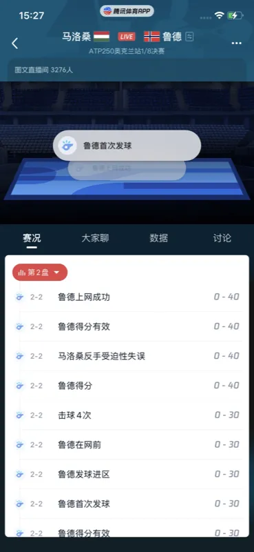

2. 文字直播：类似消息板的文字滚动

这两个形式提现都很一般，完全激不起用户的任何兴趣。竞品如爱奇艺，对于非版权赛事，也是类似的效果：

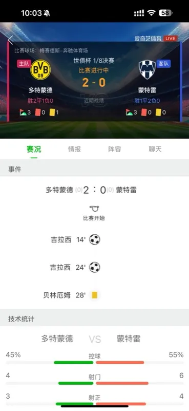

我们脑暴了一个使用 3D 来展示的计划。

## 规划阶段

最初我们计划在图文直播的基础上做一个增强，在特定情境下，如进球、得分等场景下，播放一个固定的 3D 动画。起初我们打算使用 [PAG](https://pag.io/) 形式，这个是最简单的，而且我们之前也有了一定的了解，PAG 文件支持一定程度的自定义，PAG 里面的文字、颜色，图片等等都可以替换。但是交互性相对使用 3D 模型差一些，无法实现调整视角、旋转等等，这个方案技术挑战也不足，所以很快放弃了。

我后来又想使用 [Filament](https://github.com/google/filament) 来播 3D 模型，腾讯视频 NBA 直播间曾经使用这个项目做过球员专属的进场特效，支持用户调整视角，互动性更强。


但是我们想到了几个问题：

1. 谁来做这些动画呢？我们没有 3D 资产库，这意味着我们要让设计给每个球队设计一个球队，还有动画，我们的设计团队支持不了；
2. 做到最后还是只是一个播动画，虽然交互比 PAG 提高了，但还是很单调，这个想作为一个卖点，还是有点单薄；

我们决定扩展一下这个项目，不再是图文项目的一个增强项目，而是构建一个图文直播的平替：

1. 构建一套端到端的 AI 文生 3D 动画直播生成系统;

2. 实现输入一段自然语言文本描述（如剧情、场景、动作、情感等），或标准序列化的 event数据（如网球 opta 数据），自动生成对应的3D动画内容，包括：剧本情节、3D角色与场景模型，以及带有镜头、动作与交互，可在客户端高性能展示的完整动画展示；

我们最后选择网球来落地这个项目，是基于以下的几点考量：

1. 腾讯体育是釆买了 WTA 以及澳网 OPTA 数据的版权，相比原来的图文直播，3D 直播显然能给用户提供更好的临场感；
2. 与篮球、足球相比，网球球员较少，场面没有那么复杂，不需要投入很多的额外精力进行性能优化（虽然我们后面还是做了一些）；

实际上国外已经有这种动画直播了：

**澳网 3D 动画直播：**



**索尼体育 [NFL 直播方案](https://www.sony.com/en/SonyInfo/technology/stories/entries/20240411/beyondsports/)：**



**ESPN：**



但是上述方案成本是很高的，先不说 3D 建模是单独找到团队做的，根据他们[介绍](https://www.theverge.com/2025/1/15/24344285/australian-open-livestreaming-wii-sports-style-tennis-matches)，他们的动作都是使用专业摄像头捕捉的，成本上我们这个创新项目就无法接受。

我们要探索一条我们自己的低成本路线。

## 技术调研

### 3D 技术部分

#### 人物模型部分

首先我们要解决的就是 3D 模型怎么生成，这在以前是一个不可能的任务，对于传统软件研发团队而言，3D动画制作流程复杂，涉及剧本创作，角色与场景建模，动画绑定与关键帧制作，镜头设计、灯光渲染、后期合成整个过程人力成本高、周期长、创意门槛高，难以快速响应内容需求。

但近年来，随着 AIGC（AI生成内容） 技术的爆发，文本生成图像（Text-to-Image）、文本生成视频（Text-to-Video）、3D资产生成（Text-to-3D） 取得了显著进展，为 “文生3D动画” 提供了技术可行性。

当然我们可以直接到 UE 商店里买，也可以选择直接使用 ComfyUI 等工具自己搭工作流来创建，一般workflow 就是上传一个三视图，一般是前、后、侧面图个一张，剩下的细节让大模型来生成。如果你只有一张图，也有对应的 ComfyUI 插件，同样也是基于大模型，帮你生成三视图，但是效果就比较差强人意了。

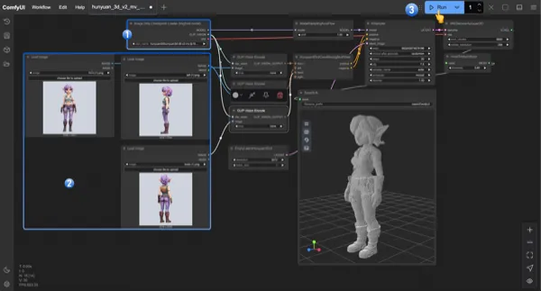

我们选择了腾讯自家的[混元3D](https://hunyuan-3d.woa.com/)，同样支持线上搭建流水线，多图最多支持上传8张图片，也支持指定面数、纹理等等：

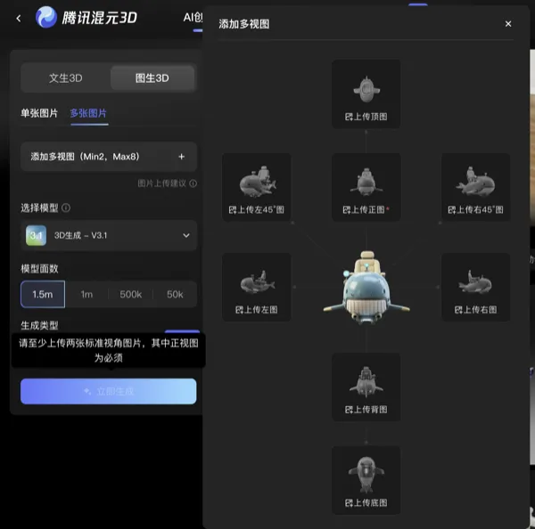

当然混元也支持使用单图生成：

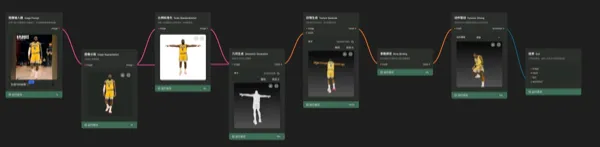

但是 3D 生成的项目也不是那么的完美：

1.目前我们目前基本都是通过单图生成，网上能找到的三视图较少，生成的还原效果可能会稍差，考虑使用参考图通过AI生成三视图，再通过三视图生成出更符合预期的模型；

2.生成的骨骼精细度不够，手部、面部的骨骼混元 3D 目前是没有的；

不过考虑到我们这个项目体量和投入，不需要精度那么高。图的部分，我们用豆包的文生图就满足了

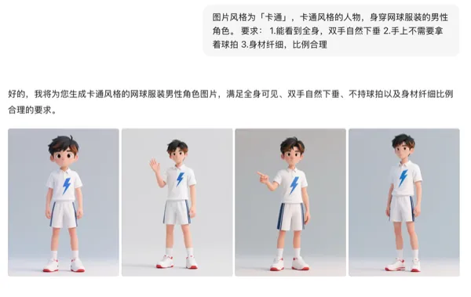

然后把图传给混元，就得到了最后的人物建模：

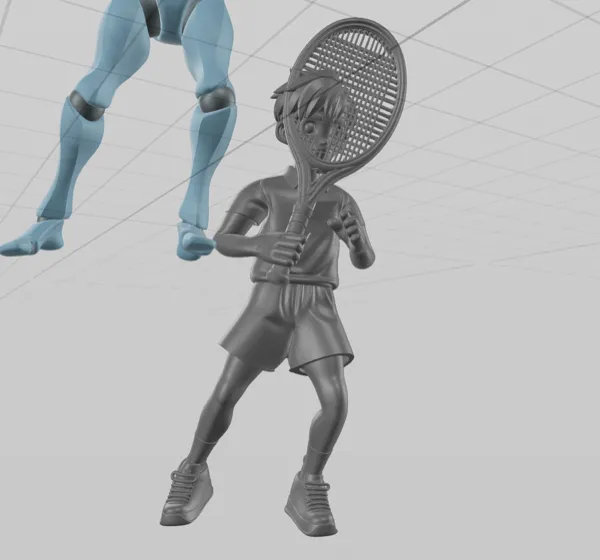

### 物体模型部分

解决完球员部分，我们还有很多 3D 资产要生成，包括但不限于球拍、网球、球场等等。

开始我们也使用混元 3D 来生成，发现小的物品还好，大的 3D 物体，如球场，混元效果就不是很好了。比如我们尝试让混元 3D 一次生成整个[球场](https://hunyuan-3d.woa.com/share?shareId=1fa68de7-0618-4a7b-a97c-9fbc41bb82c4)：

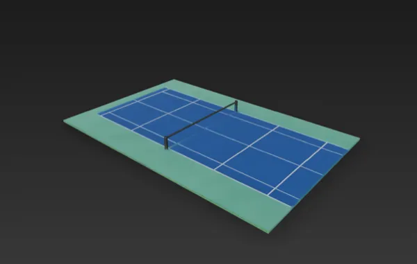

可以看到，这个球场最终生成的效果比较袖珍，像是一个玩具。我们发现球场比较好的做法，就是是一个个部件AI生成，最后拼上去。但是这个是要消耗大量精力，你要一个个生成，最后还要拼起来。

我们先是考虑釆买，从 UE 商城直接购买，我们买了几个：

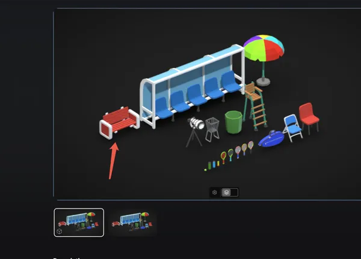
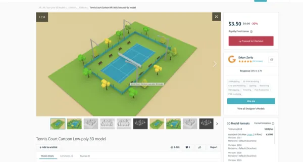

不过我们最后实际用的方案发现釆买的模型效果很差，跟人一种很廉价的感觉：

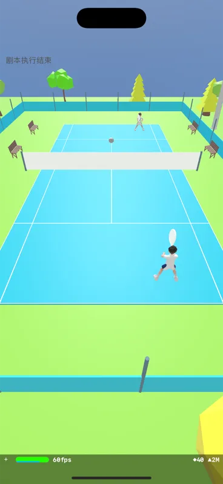

后来我们还是请了外援，找了一个专业的 3D 美术，帮我们设计了球场：

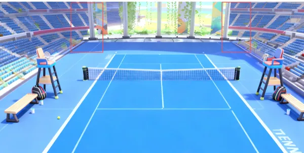

其他的一些小道具，如球场、球拍，我们就干脆自己用混元生成了。

### 动作资产

现在有了球场，有了球员，还得让球员在球场上自由的运动。这个不是让球员简单的位移就行了。我们这个虽然精度不像 3A 大作那么高，但也要尽量的像真实靠拢。球员的 3D 动作要怎么做呢？

现在我们使用混元 3D生成的球员模型，实际上是可以绑定骨骼的。现在已经有一些提供骨骼动画的网站，例如 Adobe 的 [Mixamo](https://www.mixamo.com/#/)，就提供大量的动作动画供我们下载。

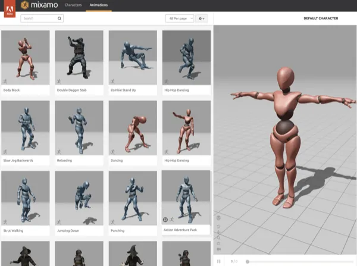

我们可以下载动作模型 fbx 下来，然后使用 Blender + 插件（我们使用的是 AutoRig）的方式，就可以实现动作的绑定：

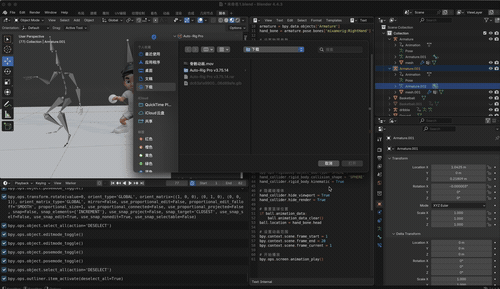

由于混元生成的骨骼名和下载的骨骼动画名没法直接对应，我们这里是通过脚本微调的。

绑定完成后，我们把任务模型导出，这个模型就已经预置了绑定的动作了。

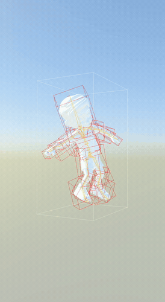

但是有些动作这个网站没提供，像是网球挥拍、发球等等，我们从哪里搞呢。

我们想到的先是直接通过大模型来生成动作，我们提供文字描述，然后大模型生成骨骼动画。我们在 Github 上找到了这个项目[MotionGPT](https://github.com/OpenMotionLab/MotionGPT)，我还专门搞了一个基于 SceneKit 的小 demo。具体来说，就是本地启动一个小 server，用户在文本框输入想要让角色的动作，大模型以 JSON 格式返回，客户端把动作绑定到骨骼上：

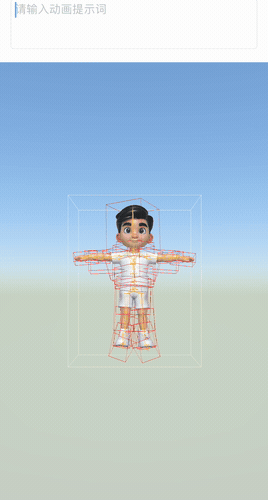

我们最早的设想就是让比赛解说的文字来驱动 3D 角色运动，这个文生动作应该是比较符合我们预期的一个方案，但是很快我们就发现了这个方案的不足之处:

1. 慢。我本地这个 demo，从输入文本到生成动作，至少有个 2～3s 的延迟。哪怕未来放到服务端，肉眼可见的延迟也是有的；
2. 大模型生成的动作是随机的，也不是标准动作，这个可能不符合我们专业赛事的定位。

所以我们还是决定，预生成一些专业动作，而不是即时生成。

我们探索了一些，发现可以利用机器学习来理解视频，进而生成专业的动作，比如这个[项目](https://github.com/TLILIFIRAS/Tennis-Video-Analysis-System-With-YOLO-Pytorch-and-CNN/tree/main)。



我们也跟混元和 IEG 的一些专业团队也咨询过，了解到混元内部已经有了数字人（HunYuan-MoCap）项目，他们直接上传视频，然后直接就能导出模型动作。他们识别的精度很高，我们利用油管上一些网球的专业比赛视频，生成了一些列的动作。HunYuan-MoCap 支持更精细的识别，带上手部识别。我们最后决定使用这个项目来创建我们的动作库。

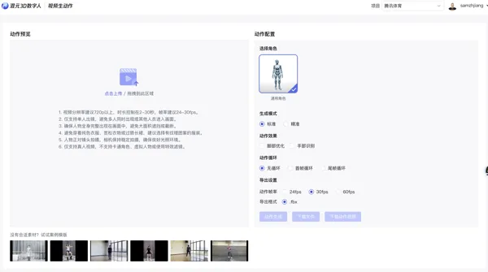

不过转换过程中，我们还是遇到了一些挑战。由于当前模型识别精度问题，会有很多模型错误动作，比如穿模：

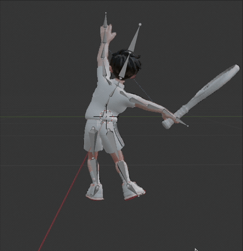

这就意味着我们从网站导出动作模型后，还要在 Blender 中进行微调。完整的流程如下：

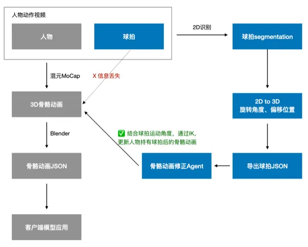

### 3D 引擎方案

项目探索阶段我们一直使用的是 iOS 的 **SceneKit**，考虑到这个项目最后还是要在双端落地。我们需要探索一下需要使用什么框架。

我们看了一下其他 APP，比如蔚来汽车 app，他们的换电站是 3D 展示的：

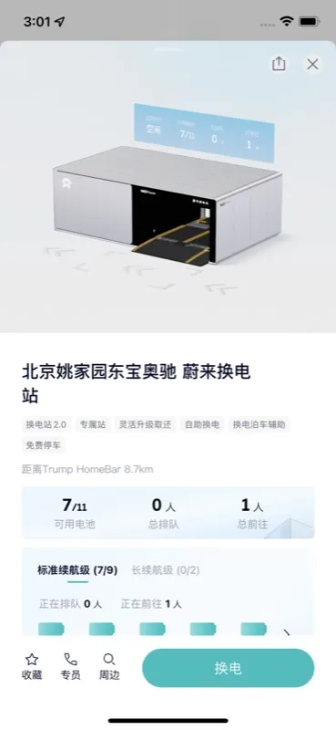

通过抓包，我们发现他们使用的是 Unity：

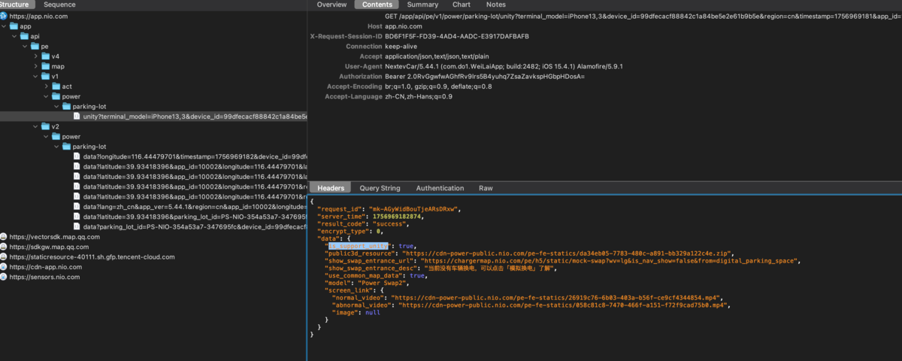

内部拆包，发现他们内部打包了 ab 包, 更加印证了我们的猜测：

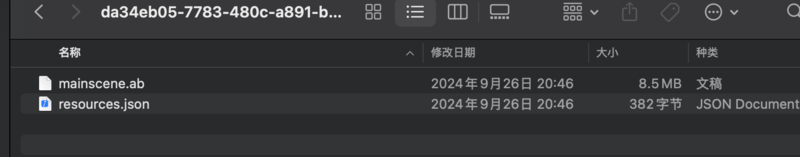

>  AB 包 （Unity AssetBundle）， 是 Unity 游戏引擎的一种资源打包格式，用于将游戏内的各种资源（如模型、贴图、音频等）打包成一个独立的文件。
>>
> **特点**
>>
> • 可以高效地管理和分发游戏资源，减小包体大小，并实现动态加载和卸载。
>>
> • 允许开发者进行资源的热更新。
>>
> •通常在Unity 编辑器中创建和使用

我们当然来调研了其他团队的方案，像是手Q 那边使用的虚幻方案，但是考虑到包体积、授权成本、学习成本、项目期限，我们放弃了使用 UE 或者 Unity 的方案，转而在想使用不需要额外增加包体积，我们又很快能上手的方案。

视频团队之前研究过 WebGL，在 iOS 26 上，我们还能开启 WebGPU 的支持，性能更好。我们可以使用 WebView 来引入，对客户端本身来说，不需要引入额外的代码和库，开箱即用。但是也不是完全没有限制因素，根据视频团队的调要，WebGPU 方案有以下限制：

1. GPU不支持对应OpenGL的版本;
2. Android4.0以下默认不支持;
3. 厂商定制限制;

检测当前 WebGPU 是否支持 WebGPU 的方式：

1. 浏览器直接访问这个[链接](https://webglreport.com/?v=13 1const)
2. 通过 JS 检测
```javascript
 canvas = document.createElement('canvas');
 const gl = canvas.getContext('webgl') || canvas.getContext('experimental-webgl');
 const gl2 = canvas.getContext('webgl2');
```
通过让 WebView 打开测试链接: https://webglsamples.org/aquarium/aquarium.html，视频团队也进行了一下性能测试

| 端 | 设备 | 设备等级 | 测试包版本 | 渲染数量 | 最低FPS |
| --- | --- | --- | --- | --- | --- |
| iOS | iPad air 2 | 低端机 | 蓝盾包：9.00.60 build：35509 | 1000 / 3750 / 050 | 50 |
| iOS | iPhone XS pro max | 中低端机 | 蓝盾包：9.00.55 build：10593 | 4500 | 30 |
| Andoird | VIVO S1 Pro | 低端机 3档 | release包 | 500 / 1000 | 45~57 / 35~42 |
| Andoird | 多个机器表现一致 | 超低端 | release包 | 500 | 加载不出来 |

看上面的性能数据，WebView 方案表现尚可。Three.js 是基于 WebGL/WebGPU 的开源 JavaScript 3D 库，这个方案似乎不错。

但我们还有一个选择，就是使用 Cocos。我们之前因为引入视频弹幕功能的原因，已经引入了这一引擎（关于这部分，我们下一部分再讲），只不过由于弹幕只是用到了 2D 能力，把 3D 相关功能给阉割掉了，引擎本身是支持 3D 的。我们如果使用 Cocos，只需要把 3D 功能加回来，至于带来的包大小变更，由于只有点纯代码变化，几乎可以忽略不计。

这两个方案都是写 JS，好在我们的前端和客户端同学都有一些这方面的技术储备，切这个方案

这样备选方案就剩下了两个，一个是 ** Three.js **，另一个是 ** Cocos **。我们需要在这两个方案里面做出选择，我们把这两个方案各做了一个 Demo，简单做了一个对比：

| | Three.js（iphone 12） | Cocos 3D（iphone 12） |
| --- | --- | --- |
| 演示视频 | 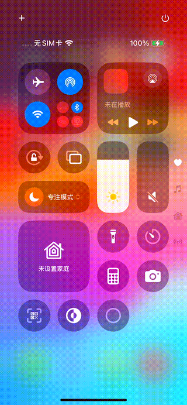 | 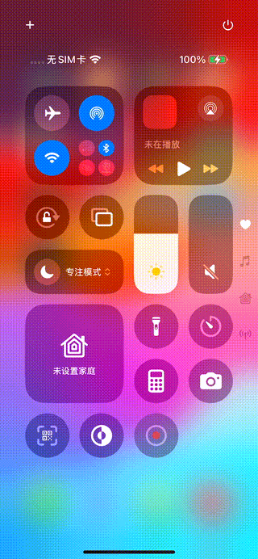 |
| 页面创建->模型组件开始加载 | 1337.21ms | 1179ms |
| 模型组件开始加载->第一帧绘制完成 | 387.00ms | 214ms |
| FPS | 30 | 60 |
| 平均内存占用 | 73 MB | 58 MB |
| 是否支持实时预览、编辑 | 否 | 是 |

从以上对比结果来看，Cocos 在性能、IDE 支持方面都更胜一筹，我们最后决定使用 Cocos 引擎。但是 Cocos 是作为弹幕引擎的一部分导入的，我们势必会有一番修改，这方面我们在下一篇再展开讲了。