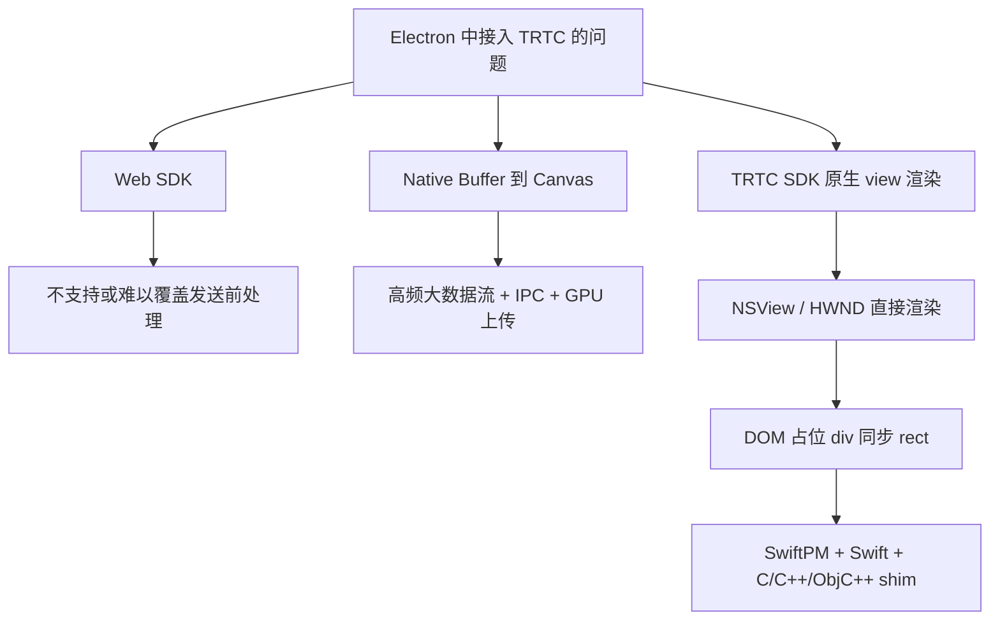
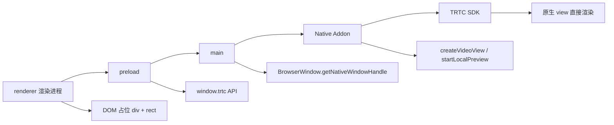
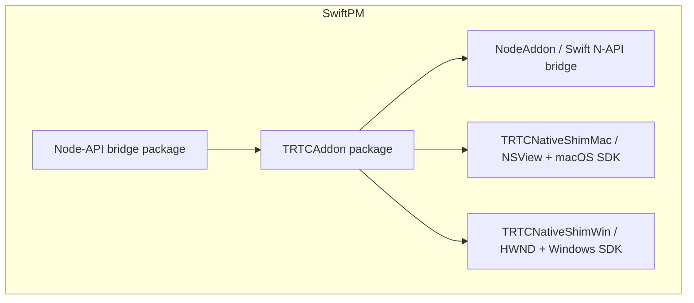
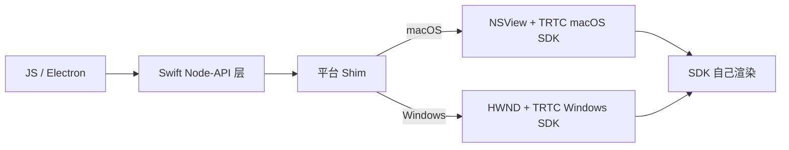
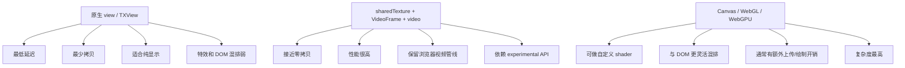

## 背景

Electron 的优势在于 UI 开发效率高，但在实现 RTC、视频前处理、美颜和虚拟背景等能力时，往往会触及 Web SDK 的边界。

TRTC 是腾讯云实时音视频 SDK，适合做采集、推流、拉流、前处理和视频渲染这条主链路。它和浏览器里的 Web SDK 不是一回事：Web SDK 更轻，TRTC Native SDK 则给了更完整的原生能力。

SwiftPM 是 Swift Package Manager，也就是 Swift 的包管理和构建工具。它不只是“装依赖”，还负责描述 target、平台条件、二进制产物和构建关系，所以很适合拿来组织 Swift、C、C++ 和 Objective-C++ 混合工程。

以 TRTC 为例，如果 Web SDK 不支持发送前的视频处理，主链路就无法只依靠 `<video>`、Canvas、WebGL 或 WebGPU，而需要接入 TRTC Native SDK。

本文整理了一套可落地的方案：用 SwiftPM 管理混合代码，构建 Node Addon；Electron 负责 UI 和布局，TRTC Native SDK 负责采集、前处理、编解码和视频渲染。

目标不是强行让所有平台共用完全相同的原生代码，而是统一 JS API 和包管理结构，并在平台适配层分别接入 macOS 与 Windows SDK。

## 为什么 addon 用 Swift

这篇方案里，addon 选择 Swift 不是为了绕开 C++，而是因为它刚好处在一个很合适的中间层：上面要接 Electron 和 Node-API，下面要接平台 SDK、窗口句柄和 TRTC。

Swift 的优势主要有三点：一是语言层更适合写桥接层，枚举、可选值、错误处理、字符串和生命周期管理都比纯 C++ glue 更轻；二是 Swift 可以直接和 C++ 互操作，官方已经明确支持双向混合代码，这让 Swift 既能调用现有 C++ API，也能把一部分 Swift 能力暴露给 C++；三是 Swift 6.3 引入了 `@c`，可以直接导出 C ABI 符号，正好适合 Node-API 这类需要稳定 C 入口的场景。对于还在旧版本 Swift 上工作的项目，`@_cdecl` 也常见，作用和用途基本一致，只是 `@c` 是更正式的新写法。

这也是为什么这里更适合采用“Swift 写 addon 壳，C/C++/Objective-C++ 写平台 shim”的结构：Swift 负责更高层的参数解析、状态管理和 JS API，底层仍然把 `HWND`、`NSView`、TRTC SDK 和第三方美颜 SDK 留给最熟悉它们的语言层。

相关官方文档：

- [Mixing Swift and C++](https://www.swift.org/documentation/cxx-interop/)
- [Swift 语言中的 `c` 调用约定](https://docs.swift.org/swift-book/documentation/the-swift-programming-language/attributes/)

## 问题拆解

一开始很容易把问题理解成“Electron 里如何显示 TRTC 视频”。如果只是显示，最自然的答案是 Web SDK 或 `<video>`。但这个项目真正的问题不是显示，而是前处理。

需要拆成三个问题：

1. 视频采集和前处理在哪里发生？
2. 处理后的画面如何推给 TRTC？
3. 本地和远端视频如何在 Electron UI 里显示？

如果前处理只用于本地视觉效果，例如显示滤镜预览，那么可以在渲染进程中使用 Canvas、WebGL 或 WebGPU。但如果处理结果需要发送给远端用户，就必须进入 TRTC 的发送链路。换言之，美颜、虚拟背景和第三方视频增强等能力不能只停留在 HTML 层，而应在原生采集或自定义采集管线中完成。

因此，方案会从 Web SDK 转向 Native SDK。

## 为什么最后选这条路

先看最省事的 Web SDK。

它对 Electron 最友好：不用 Native Addon，不用考虑 `.node`、签名、DLL、framework，也不用自己处理窗口句柄。问题也很直接，Web SDK 的能力边界由浏览器媒体管线和它暴露的 API 决定；一旦它不支持发送前处理，就很难满足这类项目的核心需求。

再看“Native SDK 回调帧数据，再由 Electron 自行绘制”。

这条路最灵活，但代价也最大。TRTC 把视频帧吐出来以后，还要经过 Native Addon、JS、IPC、渲染进程，再交给 WebGL 或 WebGPU 绘制。RTC 视频本来就是高频、大吞吐量的数据流，在 1080p、60 fps 下，单是原始数据搬运就已经很重了；再加上 Electron IPC、对象生命周期管理、CPU 到 GPU 上传和格式转换，延迟和抖动都会很快放大。

所以它更适合分析、截图、实验性效果，不适合作为默认主视频链路。

然后看 TRTC Native SDK 自己的渲染能力。

TRTC 的 macOS 和 Windows SDK 都提供了把视频渲染到平台视图或控件的 API：macOS 用 `NSView`，Windows 用 `HWND`。这说明 SDK 本身已经有完整的视频渲染链路，包括解码、缩放、色彩转换和对平台图形后端的适配。

既然 SDK 已经能直接渲染，Electron 更适合提供一个跟页面布局对齐的承载区域，而不是自己再画一套视频管线。

最后看 Electron 的 UI 结构。

Electron 的 DOM 不能直接创建真正的 `NSView` 或 `HWND`，但可以先放一个占位 `div`。渲染进程用 `getBoundingClientRect()` 拿到这个区域的位置和尺寸，Native Addon 再根据这个矩形，在 `BrowserWindow` 的原生宿主视图或窗口中创建子视图。

于是就得到这样一层分工：

```text
HTML div
  -> 只负责布局

native child view/window
  -> 跟随 div 的 rect
  -> 交给 TRTC SDK 渲染
```

再看跨平台代码怎么组织。

macOS SDK 以 `.xcframework` 形式提供，可以自然地导入 Swift；Windows SDK 则由 C++ 头文件、`liteav.lib` 和一组 DLL 构成。两端 SDK 的形态不同，如果强行全部封装在 Swift 中，Windows 侧的构建与维护会变得脆弱。

所以更合理的分层是：Swift 负责 Node-API 和跨平台业务 API，C、C++ 或 Objective-C++ Shim 负责对接平台 SDK 与窗口系统。最后得到的不是“所有代码都一模一样”，而是“一套 JS API、一套 SwiftPM 工程、多个平台 Shim”。这样既能保持上层调用一致，也符合各平台 SDK 的实际形态。



## 官方资料入口

后续开发建议优先对照官方文档和本地 SDK 头文件。TRTC 文档会按平台和产品线拆分，实际函数签名以下载的 SDK 头文件为准。

- [TRTC 产品文档入口](https://trtc.io/document)
- [TRTC Cloud API 概览](https://trtc.io/document/35131)
- [macOS TRTC API 概览](https://trtc.io/document/35119?platform=macos&product=rtcengine)
- [发布音视频流：Android、iOS、Windows、macOS](https://trtc.io/document/47634)
- [订阅音视频流：Android、iOS、Windows、macOS](https://trtc.io/document/48270)
- [自定义采集](https://trtc.io/document/35158)
- [自定义渲染](https://trtc.io/document/72270)
- [Electron BrowserWindow API](https://www.electronjs.org/docs/latest/api/browser-window)
- [Node-API 文档](https://nodejs.org/api/n-api.html)
- [SwiftPM PackageDescription](https://docs.swift.org/swiftpm/documentation/packagedescription/)
- [Swift C++ Interoperability](https://www.swift.org/documentation/cxx-interop/)
- [Electron crashReporter](https://www.electronjs.org/docs/latest/api/crash-reporter)
- [Electron Symbol Server](https://www.electronjs.org/docs/latest/development/debugging-with-symbol-server)
- [Sentry Debug Information Files](https://docs.sentry.dev/cli/dif/)
- [Windows Debugging with Symbols](https://learn.microsoft.com/en-us/windows/win32/dxtecharts/debugging-with-symbols)

## 核心结论

最终推荐方案是：

```text
Electron renderer
  -> HTML 占位 div 负责布局
  -> 同步 video rect 给 Native Addon

Electron main / preload
  -> 调用 Node addon
  -> 传 BrowserWindow native handle

Node addon
  -> Swift 负责 N-API 参数解析和 JS API
  -> C/C++/ObjC++ shim 负责平台窗口和 TRTC SDK

TRTC Native SDK
  -> macOS 渲染到 NSView
  -> Windows 渲染到 HWND
```

不要将每一帧视频数据从 Native Addon 传到 Electron 主进程，再通过 IPC 转发给渲染进程，最后交由 WebGL 或 WebGPU 绘制。这条路线可以用于演示，但在真实 RTC 场景中很容易遇到数据复制、延迟、GC、GPU 上传和队列堆积等问题。

## 几种方案对比

### TRTC Web SDK

Web SDK 最简单，Chromium 自己管理媒体管线、解码和渲染，通常也是 Electron 中显示 RTC 视频的最省心方案。

但它的短板也明显：如果 SDK 不支持发送前处理，比如美颜、虚拟背景、第三方视频增强，那就无法满足直播或连麦场景的核心需求。

适用场景：

- 只需要标准 RTC 推拉流
- 不需要 native 级别视频前处理
- 不需要深度控制采集和渲染链路

不适用场景：

- 需要第三方美颜 SDK
- 需要自定义采集
- 需要接入 Native TRTC 能力

### Native Buffer 到 Canvas

这条路径看起来灵活：

```text
TRTC frame callback
  -> Native Addon
  -> main process
  -> IPC
  -> renderer
  -> WebGL / WebGPU / Canvas
```

但这条路线的性能开销会迅速增长。以 1080p 为例，一帧 RGBA/BGRA 数据约为 8.3 MB，60 fps 时的裸数据吞吐量接近 500 MB/s。即使使用 I420 或 NV12，一帧 1080p 数据也约为 3.1 MB，60 fps 时约为 186 MB/s。这里还没有计入结构化克隆、线程切换、GC、CPU 到 GPU 的数据上传和格式转换。

这条路适合特殊场景，比如需要自定义渲染、图像分析或实验性的 WebGPU 处理。但不适合作为默认 RTC 主渲染链路。

### TRTC SDK 渲染到 TXView

TRTC macOS 和 Windows SDK 都提供把视频渲染到平台视图或控件的 API。可先看 [startLocalPreview](https://trtc.io/document/47634)、[startRemoteView](https://trtc.io/document/48270)、[setLocalRenderParams](https://trtc.io/document/72270) 和 [setRemoteRenderParams](https://trtc.io/document/72270)：

```objc
// macOS
[trtcCloud startLocalPreview:view];
[trtcCloud updateLocalView:view];
[trtcCloud startRemoteView:userId streamType:TRTCVideoStreamTypeBig view:view];
```

```cpp
// Windows
trtc_cloud->startLocalPreview((liteav::TXView)hWnd);
trtc_cloud->updateLocalView((liteav::TXView)hWnd);
trtc_cloud->startRemoteView(userId, liteav::TRTCVideoStreamTypeBig, (liteav::TXView)hWnd);
```

macOS 中的 `TXView` 是 `NSView`，Windows 中的 `TXView` 是 `HWND`。因此，更合适的做法是创建平台原生视频视图并传给 TRTC SDK，由 SDK 负责视频绘制、色彩转换、缩放、硬件加速路径和渲染同步。

这是当前最推荐的主路线。

## Electron 中如何布局

HTML 中仍然保留一个占位 `div`：

```html
<div class="room">
  <div id="local-video-slot" class="video-slot"></div>
  <div class="toolbar">...</div>
</div>
```

这个 `div` 不直接承载视频，只参与 DOM 布局。渲染进程监听它的位置变化：

```js
const slot = document.querySelector('#local-video-slot')

function syncVideoRect() {
  const rect = slot.getBoundingClientRect()

  window.trtc.updateVideoView({
    x: rect.left,
    y: rect.top,
    width: rect.width,
    height: rect.height,
    dpr: window.devicePixelRatio,
  })
}

new ResizeObserver(syncVideoRect).observe(slot)
window.addEventListener('resize', syncVideoRect)
window.addEventListener('scroll', syncVideoRect)
syncVideoRect()
```

Native Addon 根据该矩形移动原生子视图：

```text
macOS: BrowserWindow NSView -> addSubview(video NSView)
Windows: BrowserWindow HWND -> CreateWindowExW(WS_CHILD) 创建 child HWND
```

需要注意的是，原生视频视图并非真正的 DOM 元素，只是与 DOM 占位元素的位置保持同步。因此，CSS 的 `border-radius`、复杂遮罩、透明混合以及任意 DOM `z-index` 不一定能稳定生效。

如果 HUD 只包含用户名、麦克风状态和边框等信息，最好也使用原生 Overlay，或在原生视频容器中合成。不要假设 HTML HUD 一定能稳定覆盖在原生视频视图之上。

## Node addon API 设计

JS API 应围绕原生视图的生命周期设计：

```ts
type Rect = {
  x: number
  y: number
  width: number
  height: number
  dpr?: number
}

createVideoView(nativeWindowHandle: Buffer, rect: Rect): number
updateVideoView(viewId: number, rect: Rect): void
destroyVideoView(viewId: number): void

startLocalPreview(viewId: number): void
stopLocalPreview(): void

startRemoteView(viewId: number, userId: string, streamType: 'big' | 'small' | 'sub'): void
stopRemoteView(userId: string, streamType: 'big' | 'small' | 'sub'): void
```

Electron 主进程可以获取窗口的原生句柄：

```js
const { BrowserWindow, ipcMain } = require('electron')
const trtc = require('./build/Release/trtc.node')

ipcMain.handle('trtc:create-video-view', (event, rect) => {
  const win = BrowserWindow.fromWebContents(event.sender)
  const handle = win.getNativeWindowHandle()
  return trtc.createVideoView(handle, rect)
})
```

Swift Node Addon 层只负责解析 N-API 参数，然后调用 C ABI Shim：

```swift
private let createVideoViewJs: @convention(c) (OpaquePointer?, OpaquePointer?) -> OpaquePointer? = { env, info in
    guard let env, let info else { return nil }

    var argc: size_t = 2
    var argv = [OpaquePointer?](repeating: nil, count: 2)
    napi_get_cb_info(env, info, &argc, &argv, nil, nil)

    guard let handleValue = argv[0],
          let parentHandle = nativePointerFromElectronHandle(env, handleValue),
          let rect = getRectArg(env, argv[1]) else {
        napi_throw_error(env, nil, "invalid arguments")
        return nil
    }

    let viewId = trtc_create_video_view(
        parentHandle,
        Int32(rect.x),
        Int32(rect.y),
        Int32(rect.width),
        Int32(rect.height)
    )

    var result: OpaquePointer?
    napi_create_int32(env, viewId, &result)
    return result
}
```

Electron 的原生句柄以 `Buffer` 形式提供，其中保存着平台指针：

```swift
private func nativePointerFromElectronHandle(
    _ env: OpaquePointer,
    _ value: OpaquePointer
) -> UnsafeMutableRawPointer? {
    var data: UnsafeMutableRawPointer?
    var length: size_t = 0

    guard napi_get_buffer_info(env, value, &data, &length) == napi_ok,
          let data,
          length >= MemoryLayout<UInt>.size else {
        return nil
    }

    let raw = data.load(as: UInt.self)
    return UnsafeMutableRawPointer(bitPattern: raw)
}
```

## JS 层如何设计

Node Addon 不应向业务层暴露过多平台概念。比较合适的做法是分为三层：

```text
renderer（渲染进程）
  -> 只关心 DOM 占位、业务状态、按钮交互

preload
  -> 暴露类型稳定的 window.trtc API
  -> 用 ipcRenderer.invoke 和 main 通信

main
  -> 持有 Native Addon
  -> 负责 BrowserWindow native handle
  -> 调用 trtc.node
```

渲染进程不应直接调用 `require('.node')`。这样既能保持 `contextIsolation`，也能避免渲染进程直接持有原生能力。

preload 示例：

```js
const { contextBridge, ipcRenderer } = require('electron')

contextBridge.exposeInMainWorld('trtc', {
  createVideoView(rect) {
    return ipcRenderer.invoke('trtc:create-video-view', rect)
  },

  updateVideoView(viewId, rect) {
    return ipcRenderer.invoke('trtc:update-video-view', viewId, rect)
  },

  destroyVideoView(viewId) {
    return ipcRenderer.invoke('trtc:destroy-video-view', viewId)
  },

  startLocalPreview(viewId) {
    return ipcRenderer.invoke('trtc:start-local-preview', viewId)
  },

  startRemoteView(viewId, userId, streamType = 'big') {
    return ipcRenderer.invoke('trtc:start-remote-view', {
      viewId,
      userId,
      streamType,
    })
  },
})
```

主进程统一接入 Native Addon：

```js
const { BrowserWindow, ipcMain } = require('electron')
const trtc = require('./build/Release/trtc.node')

ipcMain.handle('trtc:create-video-view', (event, rect) => {
  const win = BrowserWindow.fromWebContents(event.sender)
  if (!win) {
    throw new Error('BrowserWindow not found')
  }

  const handle = win.getNativeWindowHandle()
  return trtc.createVideoView(handle, rect)
})

ipcMain.handle('trtc:update-video-view', (_event, viewId, rect) => {
  trtc.updateVideoView(viewId, rect)
})

ipcMain.handle('trtc:destroy-video-view', (_event, viewId) => {
  trtc.destroyVideoView(viewId)
})

ipcMain.handle('trtc:start-local-preview', (_event, viewId) => {
  trtc.startLocalPreview(viewId)
})

ipcMain.handle('trtc:start-remote-view', (_event, payload) => {
  trtc.startRemoteView(payload.viewId, payload.userId, payload.streamType)
})
```

渲染进程只负责同步布局：

```js
let localViewId = null
const slot = document.querySelector('#local-video-slot')

function getSlotRect() {
  const rect = slot.getBoundingClientRect()
  return {
    x: rect.left,
    y: rect.top,
    width: rect.width,
    height: rect.height,
    dpr: window.devicePixelRatio,
  }
}

async function mountLocalPreview() {
  localViewId = await window.trtc.createVideoView(getSlotRect())
  await window.trtc.startLocalPreview(localViewId)
}

function syncVideoRect() {
  if (localViewId == null) {
    return
  }

  window.trtc.updateVideoView(localViewId, getSlotRect())
}

new ResizeObserver(syncVideoRect).observe(slot)
window.addEventListener('resize', syncVideoRect)
window.addEventListener('scroll', syncVideoRect)

mountLocalPreview()
```

如果一个页面里有多个视频窗口，业务层应该维护 `userId -> viewId` 的映射：

```js
const remoteViews = new Map()

async function attachRemoteUser(userId, slot) {
  const viewId = await window.trtc.createVideoView(rectOf(slot))
  remoteViews.set(userId, { viewId, slot })
  await window.trtc.startRemoteView(viewId, userId, 'big')
}
```



这样一来，渲染进程的数据结构仍是普通 JS 对象，原生层只需处理 `viewId`，生命周期也更加清晰。

## macOS 实现思路

macOS 上可以较多使用 Swift，因为 Swift 对 AppKit 和 Objective-C SDK 的互操作很好。

TRTC macOS SDK 以 `.xcframework` 形式接入。它自带 modulemap，模块名为 `TXLiteAVSDK_TRTC_Mac`，Swift 可以直接 import：

```swift
import AppKit
import TXLiteAVSDK_TRTC_Mac
```

创建视频 view：

```swift
let videoView = NSView(frame: frame)
videoView.wantsLayer = true
videoView.layer?.backgroundColor = NSColor.black.cgColor
parent.addSubview(videoView)
```

绑定本地预览：

```swift
let trtc = TRTCCloud.sharedInstance()

let params = TRTCRenderParams()
params.fillMode = TRTCVideoFillMode.fill
params.mirrorType = TRTCVideoMirrorType.auto

trtc.setLocalRenderParams(params)
trtc.startLocalPreview(videoView)
```

绑定远端视频：

```swift
TRTCCloud.sharedInstance().startRemoteView(
    userId,
    streamType: TRTCVideoStreamTypeBig,
    view: videoView
)
```

所有 UI 操作都应该回到主线程执行：

```swift
DispatchQueue.main.sync {
    parent.addSubview(videoView)
}
```

## Windows 实现思路

Windows SDK 是 C++ SDK，目录里有 `Win32` 和 `Win64`，编译期链接 `liteav.lib`，运行期需要携带一组 DLL：

```text
liteav.dll
liteav_screen.dll
txffmpeg.dll
txsoundtouch.dll
LiteAvAudioHook.dll（Win32 中存在，是否需要以 SDK 实际说明为准）
```

Windows 中 `TXView` 是 `HWND`，因此创建 child HWND 后传给 TRTC：

```cpp
HWND child = CreateWindowExW(
    0,
    L"STATIC",
    L"",
    WS_CHILD | WS_VISIBLE | WS_CLIPSIBLINGS | WS_CLIPCHILDREN,
    x,
    y,
    width,
    height,
    parent,
    nullptr,
    GetModuleHandleW(nullptr),
    nullptr
);

auto *cloud = liteav::ITRTCCloud::getTRTCShareInstance();
cloud->startLocalPreview(reinterpret_cast<liteav::TXView>(child));
```

这里不建议让 Swift 直接调用完整 TRTC C++ SDK。更稳的做法是加一层 C ABI：

```c
typedef int32_t TRTCViewId;

TRTCViewId trtc_create_video_view(void *parentHandle, int x, int y, int width, int height);
void trtc_update_video_view(TRTCViewId viewId, int x, int y, int width, int height);
void trtc_start_local_preview(TRTCViewId viewId);
void trtc_destroy_video_view(TRTCViewId viewId);
```

Swift addon 调 C ABI，Windows 平台的 C++ shim 再调 Win32 和 TRTC C++ SDK。这样可以把 Win32 消息、`HWND` 生命周期、C++ 虚类、DLL import/export 等复杂性隔离起来。

## 为什么不全用 Swift

macOS 上基本可以全 Swift，因为 AppKit、Objective-C framework 和 Swift 的互操作成熟，TRTC macOS SDK 也能通过 `.xcframework` 和 modulemap 被 Swift 直接导入。

Windows 上理论上也可以尝试更多 Swift，但不建议把整个 native 层都写成 Swift，原因主要有几个：

- TRTC Windows SDK 是 C++ SDK，核心接口是 C++ class、虚函数和回调。
- Windows 视频承载层需要直接处理 `HWND`、窗口样式、`CreateWindowExW`、`SetWindowPos`、销毁时机和线程要求。
- 编译期链接的是 `liteav.lib`，运行期还要管理多组 DLL。
- Swift C++ interop 虽然可用，但大型第三方 C++ SDK、复杂头文件和平台宏会让 Swift target 的边界变得脆弱。
- 一旦 Swift target 开启 C++ interop，依赖链和编译设置也会被影响，后续维护成本更高。

所以更稳的分工是：

```text
Swift
  -> Node-API bridge
  -> JS 参数解析
  -> Promise / callback / lifecycle 包装
  -> 跨平台业务 API

C/C++/Objective-C++
  -> Win32 HWND
  -> AppKit NSView
  -> TRTC SDK 直接调用
  -> 第三方美颜 SDK
  -> 平台 runtime 细节
```

这个选择不是因为 Swift 做不到，而是因为平台 SDK 和窗口系统本来就属于 C/C++/Objective-C++ 更擅长的边界。真正应该统一的是 JS API、SwiftPM 结构、view 生命周期和错误模型，而不是强行消除所有平台代码。

## SwiftPM 组织方式

最终产物可以使用一套 SwiftPM 管理，代码是 Swift + C/C++/Objective-C++ 共存。

这里的 `NodeAPI` 只是本文示例仓库里的一个本地 Node-API bridge/helper package，用来导入 `node_api.h` 并把它包装成 Swift 可用的 target。对外阅读时，可以把它理解成“Node-API 适配层”，名字本身不是关键。

需要注意的是，SwiftPM 能很好地组织源码、依赖和条件编译，但它本身并不是 Windows 的“32 位 / 64 位打包器”。对 Windows 来说，SPM 更适合做构建编排；真正的架构分发，通常要交给外层脚本、CI 或安装包系统处理。

所以这个项目更现实的做法是：同一套 SwiftPM 源码树，分别产出 `win32` 和 `win64` 两套二进制物料，再由 Electron 打包层按目标架构选择对应产物。

推荐结构：

```text
swift-packages/
  NodeAPI/
    Package.swift
    Sources/NodeAPI/...

  TRTCAddon/
    Package.swift
    Vendor/
      Mac/TXLiteAVSDK_TRTC_Mac.xcframework
      Windows/SDK/CPlusPlus/Win64/...
    Sources/
      NodeAddon/
        Addon.swift
      TRTCNativeShim/
        include/TRTCNativeShim.h
        TRTCNativeShimWin.cpp
        TRTCNativeShimMac.mm
```



SwiftPM 可以按平台配置依赖：

```swift
.binaryTarget(
    name: "TXLiteAVSDK_TRTC_Mac",
    path: "Vendor/Mac/TXLiteAVSDK_TRTC_Mac.xcframework"
)
```

Windows 则链接 `.lib`：

```swift
.target(
    name: "TRTCNativeShimWin",
    path: "Sources/TRTCNativeShimWin",
    publicHeadersPath: "include",
    cxxSettings: [
        .headerSearchPath("../../Vendor/Windows/SDK/CPlusPlus/Win64/include"),
        .headerSearchPath("../../Vendor/Windows/SDK/CPlusPlus/Win64/include/TRTC"),
        .headerSearchPath("../../Vendor/Windows/SDK/CPlusPlus/Win64/include/Live2")
    ],
    linkerSettings: [
        .unsafeFlags([
            "Vendor/Windows/SDK/CPlusPlus/Win64/lib/liteav.lib"
        ], .when(platforms: [.windows]))
    ]
)
```

更干净的方式是拆成平台 target：

```swift
.target(
    name: "TRTCNativeShimMac",
    dependencies: [
        "TXLiteAVSDK_TRTC_Mac"
    ],
    path: "Sources/TRTCNativeShimMac"
),

.target(
    name: "TRTCNativeShimWin",
    path: "Sources/TRTCNativeShimWin",
    publicHeadersPath: "include",
    cxxSettings: [
        .headerSearchPath("../../Vendor/Windows/SDK/CPlusPlus/Win64/include"),
        .headerSearchPath("../../Vendor/Windows/SDK/CPlusPlus/Win64/include/TRTC")
    ],
    linkerSettings: [
        .unsafeFlags([
            "Vendor/Windows/SDK/CPlusPlus/Win64/lib/liteav.lib"
        ])
    ]
),

.target(
    name: "TRTCNativeShim",
    dependencies: [
        .target(name: "TRTCNativeShimMac", condition: .when(platforms: [.macOS])),
        .target(name: "TRTCNativeShimWin", condition: .when(platforms: [.windows]))
    ]
)
```

Node addon target 再依赖统一 shim：

```swift
.target(
    name: "NodeAddon",
    dependencies: [
        "TRTCNativeShim",
        .product(name: "NodeAPI", package: "NodeAPI")
    ],
    path: "Sources/NodeAddon"
)
```

SwiftPM 负责构建和链接，但 `.node` 产物通常仍需要构建脚本处理：

```text
SwiftPM build dynamic library
  -> copy / rename to xxx.node
  -> copy framework / dll runtime dependencies
  -> codesign / notarize / Electron packaging
```

## Windows 32 位和 64 位怎么分包

这个项目里，Windows 的解决方案建议按“源码统一、产物分开”来做。

具体可以这样组织：

```text
same SwiftPM sources
  -> win32 build
  -> win64 build
  -> different output folders
  -> Electron packaging picks one by target arch
```

也就是说，`Package.swift` 负责统一描述 target 和源码关系，外层再用 CI 或脚本分别调用 32 位和 64 位构建，最后把产物放到不同目录，例如：

```text
dist/
  win32/
    trtc.node
    liteav.dll
    ...
  win64/
    trtc.node
    liteav.dll
    ...
```

Electron 打包时根据目标架构选择对应目录即可。这样做的好处是：

- 源码只维护一份
- Windows 32/64 的差异被限制在最外层
- 依赖 DLL、签名和安装包逻辑也更容易分开处理
- macOS 仍然可以继续走同一套 SwiftPM 流程

## SDL 的位置

SDL 可以统一窗口、输入、渲染循环和跨平台 native handle 获取，但它不是必须项。

如果只是让 TRTC SDK 渲染视频，TRTC 已经接受 `NSView` / `HWND`，直接创建平台 view/window 是最短路径。引入 SDL 反而多一层窗口管理。

SDL 更适合以下场景：

- 不使用 TRTC 内置渲染，而是自己渲染处理后的 frame
- 希望统一 D3D / Metal / OpenGL / Vulkan 渲染器
- 需要跨平台输入、渲染循环或游戏式场景

如果使用 SDL3，可以从 SDL window properties 获取平台 handle：

```text
Windows: SDL_PROP_WINDOW_WIN32_HWND_POINTER
macOS: SDL_PROP_WINDOW_COCOA_WINDOW_POINTER / SDL_PROP_WINDOW_COCOA_VIEW_POINTER
```

但不要让 TRTC 和 SDL 渲染器同时往同一个窗口画。要么让 TRTC 画：

```text
TRTC -> TXView/HWND
```

要么自己画：

```text
TRTC custom frame callback -> 美颜 SDK -> SDL/D3D/Metal 渲染器
```

不要混合两套渲染管线争同一个 surface。

## 第三方美颜 SDK 如何接入

`TXView` 只是 TRTC 的渲染目标，不是 buffer sink。第三方美颜 SDK 输出的 buffer 不能直接塞给 `TXView`。

如果美颜后的画面需要真正推流出去，推荐链路是：

```text
摄像头采集
  -> 第三方美颜 SDK
  -> 输出处理后的帧
  -> TRTC 自定义采集 / send custom video data
  -> TRTC 编码推流
```

如果只是本地显示美颜效果，而不影响推流，则可以：

```text
TRTC / camera frame callback
  -> 第三方美颜 SDK
  -> 自己用 Metal / D3D / SDL 渲染
```

但直播和连麦场景通常要让远端也看到美颜后的画面，因此更推荐把处理后的 frame 送回 TRTC 自定义采集链路，而不是只在本地 view 上画。

## 补充方案：sharedTexture + VideoFrame + video / Canvas

如果项目方坚持不使用原生 view，而是希望继续在 Electron 里做 Canvas、WebGPU 或 `<video>` 渲染，那么可以把这套方案作为性能最优的补充路线，而不是主推荐路线。

核心思想是：不要把视频帧先落到 CPU，再通过 IPC 传给渲染进程；而是让 native SDK 输出可共享的 GPU texture，再把这个 texture 通过 [sharedTexture.importSharedTexture()](https://www.electronjs.org/docs/latest/api/shared-texture) 导入 Electron，转换成 [VideoFrame](https://developer.mozilla.org/en-US/docs/Web/API/VideoFrame)，最后交给浏览器媒体管线或 WebGPU 渲染。

TRTC / 美颜 SDK -> GPU texture -> Electron [sharedTexture.importSharedTexture()](https://www.electronjs.org/docs/latest/api/shared-texture) -> [SharedTextureImported.getVideoFrame()](https://www.electronjs.org/docs/latest/api/structures/shared-texture-imported) -> [VideoTrackGenerator](https://developer.mozilla.org/en-US/docs/Web/API/VideoTrackGenerator) / [MediaStreamTrackGenerator](https://developer.mozilla.org/en-US/docs/Web/API/MediaStreamTrackGenerator) -> `<video srcObject=MediaStream>`

如果要走 WebGPU，这条链路还可以继续变成：

[VideoFrame](https://developer.mozilla.org/en-US/docs/Web/API/VideoFrame) -> [GPUDevice.importExternalTexture()](https://developer.mozilla.org/en-US/docs/Web/API/GPUDevice/importExternalTexture) -> WebGPU pipeline -> canvas

这条路线的优点是：

- 在保留 Electron 渲染体系的同时，尽量避免 CPU 拷贝
- 可以继续做 WebGPU shader、DOM 叠层和视频特效
- 比传统 Buffer -> IPC -> Canvas 路线明显更快

但它也有明显限制：

- 依赖 Electron 的 `sharedTexture`、`VideoTrackGenerator`、`MediaStreamTrackGenerator` 和 WebGPU 等能力
- 其中部分 API 仍是 experimental / limited availability
- 需要 native SDK 能输出真正可共享的 GPU texture
- 纹理生命周期、同步令牌和 release/close 管理会比较复杂

因此，这条路线适合“必须在浏览器里画视频，但又想把性能尽量做高”的场景；不适合把它当成比原生 view 更优的通用方案。

## Buffer 优化思路

如果某些场景必须处理 frame buffer，优先考虑以下策略：

- 优先使用 `NV12` 或 `I420`，不要过早转 `RGBA/BGRA`
- 只保留最新帧，渲染跟不上就丢旧帧
- 使用 buffer pool / texture pool，避免每帧分配释放
- 正确处理 stride / bytesPerRow / pitch，不假设每行等于 `width * bytesPerPixel`
- 尽量让格式转换留在 GPU
- 避免每帧跨 Electron IPC 传完整图像数据

`I420` 是三平面 YUV 4:2:0：

```text
Y plane: width * height
U plane: width/2 * height/2
V plane: width/2 * height/2
```

`NV12` 是两平面 YUV 4:2:0：

```text
Y plane: width * height
UV plane: width/2 * height/2 * 2
```

Windows 上更偏向 `NV12`，因为它和 D3D、Media Foundation、硬件编解码管线更贴近。macOS 上则可以尽量保留 `CVPixelBuffer`，需要渲染时走 `CVMetalTextureCache` 一类 GPU-friendly 路径。

## 上架和打包注意事项

`.node` 文件本质是动态库，只是扩展名用于 Node addon 加载。macOS 上它会通过 `dlopen` 加载，Windows 上通过 `LoadLibrary` 加载。

macOS Electron 打包时，需要关注：

- `.node` 自身签名
- Swift runtime 依赖
- TRTC framework 及其资源
- SDK 内部 companion frameworks
- dSYM、TRTC dSYM 和 Sentry 符号上传
- Hardened Runtime
- notarization
- 隐私权限说明和 `PrivacyInfo.xcprivacy`

Windows 打包时，需要关注：

- `.node`
- `liteav.dll`
- `liteav_screen.dll`
- `txffmpeg.dll`
- `txsoundtouch.dll`
- 可能的音频 hook DLL
- 自研 `.node`、shim DLL 和第三方 SDK 的 PDB 归档与上传
- DLL 搜索路径
- x64 / arm64 / ia32 产物区分

SwiftPM 管理的是编译和链接，不会自动替你完成 Electron packaging 中所有 runtime 依赖复制。

## Crash 定位和符号上传

Native Addon 一旦 crash，通常不是抛一个 JS 异常，而是直接把 Electron 的主进程或渲染进程打崩。因此发布流程里不能只打包 `.node`、framework 和 DLL，还要把符号文件一起归档并上传到 Sentry 之类的平台。

Electron 本身使用 Crashpad 收集 native crash。接入 Sentry Electron SDK 或直接配置 Electron `crashReporter` 后，线上 crash 会以 minidump 形式上报。Sentry 收到 minidump 后，会根据崩溃栈里每个模块的 debug identifier 去匹配已经上传的 Debug Information Files，然后把地址还原成函数名、文件名和行号。

如果 crash 发生在 Electron 自身，Electron 官方也提供了符号支持，但它和业务自己的符号文件不是同一个来源。Windows 调试时可以使用 Electron 官方 symbol server：`https://symbols.electronjs.org`，WinDbg 或 Visual Studio 会按模块信息自动拉取匹配的 PDB。macOS 则可以通过 Electron 发布物料下载对应版本、平台和架构的 symbols 包，例如用 `@electron/get` 下载 `artifactSuffix: "symbols"` 的产物。也就是说，Electron 自身的符号要按 Electron 的精确版本、平台和架构匹配；业务自己的 `.node`、shim、framework 和 DLL 符号则仍然要由自己的发布流程上传和归档。

macOS 上需要关注这些符号：

- Electron app、helper app 和 Native Addon 对应的 dSYM
- SwiftPM 生成的动态库或最终重命名出来的 `.node` 对应的 dSYM
- TRTC macOS SDK 提供的 dSYM
- 如果开启了 bitcode 或符号隐藏，还要保存匹配的 BCSymbolMaps

Windows 上对应的是 PDB，而不是 dSYM。自己的 `.node`、C++ shim DLL，以及其他自研 DLL 都应该在 Release 构建时生成 PDB。MSVC 体系里通常通过编译参数 `/Zi` 或 `/ZI` 生成调试信息，再通过链接参数 `/DEBUG` 生成最终 PDB。PDB 不应该跟应用一起发给用户，但必须归档并上传到 Sentry 或内部符号服务器。

TRTC Windows SDK 如果提供 PDB，也应该和对应版本的 DLL 一起上传；如果没有提供 PDB，就只能还原到模块名、导出符号或偏移地址。这个时候至少要保存以下信息：

- TRTC SDK 的精确版本
- 实际发布出去的 DLL 文件
- 每个 DLL 的文件 hash
- 崩溃发生时 Sentry 报告里的 module name、debug identifier 和 offset

这样即使第三方库内部无法完全符号化，也能判断 crash 是否发生在自研 shim、TRTC SDK，还是 Electron/Chromium 侧。

一个比较完整的发布流程可以这样组织：

```text
1. 构建 Electron app、Native Addon 和平台 shim
2. macOS 产出 .app、.node、framework、dSYM
3. Windows 产出 .exe、.node、DLL、PDB
4. 上传 JS sourcemap
5. 上传 dSYM / PDB / 第三方 SDK 符号
6. 归档本次 release 的安装包、符号文件、TRTC SDK 版本和构建日志
7. 打包、签名、notarize 或生成 Windows installer
8. 发布应用
```

Sentry CLI 可以先检查符号是否可用，再上传：

```bash
sentry-cli debug-files check path/to/symbols
sentry-cli debug-files upload -o <org> -p <project> --wait path/to/symbols
```

线上看到 crash 后，排查顺序一般是：

1. 先看 Sentry stack trace 是否已经符号化。
2. 如果显示 missing debug information，按 Sentry 给出的 debug identifier 找对应 dSYM 或 PDB。
3. 上传缺失符号后等待处理完成，再重新打开 crash 事件。
4. 如果缺的是 TRTC Windows SDK 的 PDB，而 SDK 没提供，只能结合模块名、偏移、SDK 版本和厂商支持定位。
5. 如果 crash 落在自己的 `.node` 或 shim 里，必须能还原到具体函数和源码行，否则说明发布流程漏传了符号。

## 推荐落地顺序

第一步，只做 macOS 本地预览：

```text
createVideoView -> startLocalPreview -> updateVideoView -> destroyVideoView
```

第二步，接远端视频：

```text
startRemoteView / stopRemoteView
```

第三步，抽出统一 C ABI shim，让 Windows 也实现同样接口。

第四步，整理 SwiftPM：

```text
Node-API bridge package
TRTCAddon package
TRTCNativeShimMac
TRTCNativeShimWin
NodeAddon
```

第五步，再接第三方美颜 SDK 或 TRTC 自定义采集。

第六步，处理 Electron packaging、签名、notarization 和 Windows DLL 拷贝。

## 最终判断

这套方案的核心取舍是：

- Electron 继续负责 UI、布局和业务交互
- TRTC Native SDK 负责实时视频主链路
- Swift Node addon 提供 JS bridge
- C/C++/Objective-C++ shim 隔离平台 SDK 和窗口系统
- SwiftPM 统一管理 Native Addon 的源码、依赖和构建

不要追求“所有平台所有代码都纯 Swift”。macOS 上 Swift 很自然，Windows 上让 C++ shim 管 Win32 和 TRTC SDK 更稳。真正应该统一的是 JS API、模块边界、生命周期和构建结构，而不是强行消灭平台差异。




