+++
date = '2026-06-01T16:14:41+08:00'
draft = false
title = 'KMM 跨平台落地：从基础认知到 ovCompose iOS/鸿蒙实践'
tags = ['KMM踩坑笔记']
categories = ['iOS 开发']
+++

## 阅读导航（建议先看）

这篇文章信息量很大，建议按下面顺序读：

1. **先读 0 章**：把 KMM、LLVM/IR、KuiklyBase-kotlin 的关系建立起来。
2. **再读 2 章**：看 ovCompose 在 iOS 上如何解决混排与性能问题（重点是 2.4）。
3. **最后读 3 章**：看 ovCompose 在鸿蒙上的架构补齐与落地结果。

如果你时间有限，可以先看每章的小结段，再回到细节表格和时序图。

## 0. 什么是 KMM

**KMM（Kotlin Multiplatform Mobile）** 是 JetBrains 推出的跨端代码复用方案：共享业务逻辑，不共享 UI。它的核心价值不是“写一套 UI 到处跑”，而是“用一套业务代码支撑多端原生体验”。

为了避免概念混淆，可以先把 KMM 放到两个对比里看：

- **对比 RN/Flutter**：RN/Flutter 是 UI + 逻辑一起跨端，带独立渲染与运行时；KMM 只共享业务逻辑，UI 仍由 iOS/Android 原生实现。
- **对比传统混编 SDK**：传统方式多是单端产物复用；KMM 是同一套 Kotlin 源码多端编译，天然支持平台差异化实现。

一句话：**KMM 更像“跨端业务层统一”，而不是“跨端 UI 统一”。**

### 0.1 给非编译器读者的背景知识（LLVM / IR）

如果你不是编译器方向，可以先记住 4 句话：

1. **编译器**做的事，就是把高级语言（Kotlin）翻译成目标平台可执行代码。
2. **IR（Intermediate Representation，中间表示）**是“中间语言”，用于把“前端语法分析”和“后端机器码生成”解耦。
3. **LLVM**不是单一编译器，而是一套编译器基础设施（优化器 + 后端代码生成等）。
4. KMP 的 Native 路线里，常见链路是：`Kotlin 源码 -> Kotlin IR -> LLVM IR -> 机器码/.so`。

其中最容易混淆的是两个 IR：

- **Kotlin IR**：Kotlin 编译前端产物，仍偏语言语义层。
- **LLVM IR**：更底层、接近机器码生成阶段，便于做跨平台后端优化与产物输出。

可以把它理解为：

- Kotlin IR 像“平台无关的设计图”；
- LLVM IR 像“可进入各工厂（不同 CPU/OS 后端）生产线的标准工艺图”。

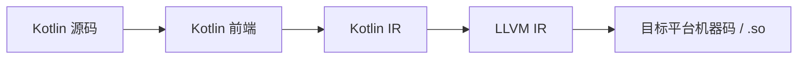

#### 0.1.1 术语速查表

| 术语 | 一句话解释 | 在本文里对应什么 |
| :--- | :--- | :--- |
| 编译器 | 把高级语言翻译成可执行代码的工具链 | 把 Kotlin 代码编成鸿蒙可运行产物 |
| IR | 编译过程中的中间表示 | 连接“前端语义分析”和“后端代码生成” |
| Kotlin IR | Kotlin 前端产出的中间表示 | 还偏语言语义层 |
| LLVM IR | LLVM 体系使用的中间表示 | 用于后端优化并生成目标平台代码 |
| LLVM | 编译器基础设施（优化器 + 后端） | KuiklyBase-kotlin 依赖其完成 Native 产物生成 |
| Konan | Kotlin/Native 编译器实现（代号） | KMM Native 路线在鸿蒙落地的核心编译器链路 |
| Runtime（运行时） | 程序运行期提供的基础能力集合 | 涉及内存、线程、协程、对象模型等 |
| ABI | 二进制接口约定（调用约定/数据布局） | 需要与 OHOS 平台约定对齐才能稳定运行 |
| Target | 编译目标平台/架构 | 文中常见 `ohosArm64` |
| `.so` | 动态链接库（Shared Object） | Kotlin/Native 在鸿蒙上的核心产物 |
| NAPI | 原生模块与 ArkTS/JS 交互接口 | 宿主侧调用 Kotlin Native 能力的重要通道 |
| cinterop | Kotlin/Native 的 C 互操作机制 | 接入 MMKV、网络等原生库时常用 |

### 0.2 KMM 在鸿蒙上的延续：KuiklyBase-kotlin（入门版 + 展开版）

#### 0.2.1 入门版（先看这个）

如果你只想先建立直觉，可以记住这 5 点：

1. **KuiklyBase-kotlin 是什么**：腾讯基于 Kotlin/Native 做的定制编译器与工具链，用来让 KMM 代码能在鸿蒙上编译并运行。
2. **它解决什么问题**：官方 KMM 并不直接等于“可在鸿蒙高性能落地”，KuiklyBase-kotlin 补齐了这段能力。
3. **它的产物是什么**：把 Kotlin 共享逻辑编译成鸿蒙可加载的原生 `.so`（常见是 `ohosArm64` 目标）。
4. **它怎么落地到应用**：ArkUI 宿主通过 NAPI/NDK 与这份原生库协同，完成 Kotlin 与鸿蒙系统能力对接。
5. **为什么重要**：这决定了 KMM 在鸿蒙侧是“仅能跑 demo”，还是“能支撑生产业务”。

一句话：**KuiklyBase-kotlin 是 KMM 在鸿蒙可用化的底座** [6][7]。

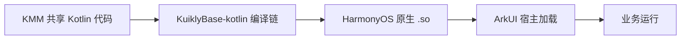

#### 0.2.2 展开版（实现细节）

##### 0.2.2.1 项目定位与工程规模

KuiklyBase-kotlin 的定位是“**编译器级移植**”：不是写一层简单桥接，而是把 Kotlin/Native 的编译、运行时、平台互操作和工具链都对齐到 OHOS。按你提供的资料，它已是持续演进的大型工程（定制分支、长期版本迭代、多语言协作）[7]。

##### 0.2.2.2 目标平台与编译目标

- 目标平台：HarmonyOS NEXT（OpenHarmony/OHOS 体系）。
- 常用目标：`ohosArm64`。
- 工程含义：共享 Kotlin 代码最终会被编译为运行在鸿蒙 ARM64 上的原生机器码（`.so`）。

##### 0.2.2.3 实现骨架：从源码到运行

结合公开资料与你的分析，主链路可以概括为：

1. 在 KMM 工程中声明 `ohosArm64` 目标；
2. 定制 Kotlin/Native 编译链完成 Kotlin IR 到 LLVM IR，再到鸿蒙 `.so` 产物；
3. 宿主应用运行时加载 `.so`；
4. 通过 NAPI 完成 Kotlin 与 ArkTS/系统能力互调；
5. 业务侧调用网络、存储、资源等原生能力。

##### 0.2.2.4 关键技术点

**a) Konan 编译器定制（编译期）**

- 对齐鸿蒙侧 LLVM/ABI 约束；
- 让 Kotlin/Native 后端可稳定产出 OHOS 可执行产物；
- 与前文 0.1 节的 Kotlin IR/LLVM IR 流水线概念一一对应。

**b) Runtime 与互调（运行时）**

- 增加 OHOS 平台识别与运行时分支；
- 通过 NAPI 机制打通 Kotlin 与 ArkTS 双向调用；
- 尽量降低手写 C/C++ 胶水代码成本。

**c) 性能优化（可用性）**

- 重点围绕内联、ThreadLocal、协程调度等热点路径优化；
- 目标是把 Kotlin/Native 在鸿蒙上的表现拉到可生产落地水平 [6]。

**d) 原生能力集成（工程化）**

- 网络、存储、资源访问等能力通过 cinterop/NAPI/原生库协同接入；
- 让 KMM 共享层不只“能算逻辑”，还能“用系统能力”。

##### 0.2.2.5 全景流程图（编译器 + 运行时 + 工程化）

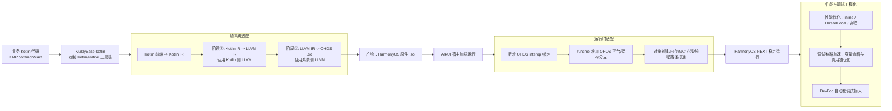

> 结论：KMM 支持鸿蒙不是单一“编译开关”，而是**编译器 + runtime + 性能优化 + 原生能力集成 + 工具链**的系统工程 [6][7]。

## 1. ovCompose 介绍

### 1.1 什么是 ovCompose
[ovCompose](https://github.com/Tencent-TDS/ovCompose-multiplatform-core)（online-video-compose）是腾讯视频团队基于 Compose Multiplatform 推出的跨平台框架。

一句话理解：**ovCompose = 在 Compose Multiplatform 之上，补齐 iOS 深度混排能力 + HarmonyOS 支持的工程化方案**。

### 1.2 它主要解决什么问题

- **平台覆盖问题**：官方 Compose Multiplatform 尚未原生支持鸿蒙。
- **iOS 混排问题**：Compose 与 UIKit/SwiftUI 在渲染层级和交互机制上存在差异，复杂页面容易出现层级冲突、手势冲突和额外性能开销。

### 1.3 官方文档速查（平台相关）

为了方便读者延伸阅读，下面是文中高频术语对应的官方文档：

- Kotlin Multiplatform：<https://kotlinlang.org/docs/multiplatform.html>
- Kotlin/Native：<https://kotlinlang.org/docs/native-overview.html>
- Kotlin/Native C Interop：<https://kotlinlang.org/docs/native-c-interop.html>
- Compose Multiplatform（JetBrains）：<https://www.jetbrains.com/lp/compose-multiplatform/>
- Compose Multiplatform 文档：<https://www.jetbrains.com/help/kotlin-multiplatform-dev/compose-multiplatform-and-jetpack-compose.html>
- Skia `SkPictureRecorder`：<https://api.skia.org/classSkPictureRecorder.html>
- LLVM 文档：<https://llvm.org/docs/>
- iOS `UIView`：<https://developer.apple.com/documentation/uikit/uiview>
- iOS `CALayer`：<https://developer.apple.com/documentation/quartzcore/calayer>

## 2. ovCompose 如何解决 iOS 平台问题

### 2.1 原版 Compose Multiplatform 的 iOS 混排限制

原版 Compose Multiplatform 在 iOS 混排中的限制可以压缩为下表：

| 维度 | 核心限制 | 典型现象 | 业务影响 |
| :--- | :--- | :--- | :--- |
| 渲染层级 | Compose（Skia/Skiko）与 UIKit/SwiftUI 处于不同渲染上下文 [1](https://api.skia.org/classSkPictureRecorder.html) | 混排嵌套时出现层级错乱、裁剪失效（如 `UIScrollView` + `LazyColumn`）[1](https://api.skia.org/classSkPictureRecorder.html) | UI 一致性下降，页面可维护性变差 |
| 性能与内存 | 独立渲染上下文 + 离屏缓冲导致额外资源开销 [2] | 嵌套容器增多时，内存占用上升、帧率下降、交互延迟 [2] | 低端设备更易触发内存告警甚至被系统回收 |
| 交互体验 | 输入、手势、状态同步跨框架协同成本高 [1](https://api.skia.org/classSkPictureRecorder.html) | `TextField` 原生感偏弱、滚动手势冲突、`State`/`@Binding` 同步链路变长 [1](https://api.skia.org/classSkPictureRecorder.html) | 用户体感割裂，复杂交互场景稳定性下降 |

### 2.2 ovCompose 的解决方案

针对上述限制，ovCompose 的思路可以概括为：**先给渲染做“可切换后端”，再给更新做“只改动脏区”，最后补齐混排工程工具链**。

#### 一张图看懂 ovCompose 的工作路径

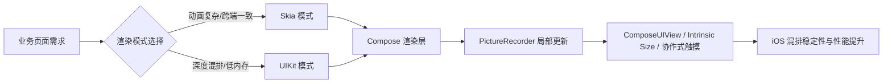

#### 双渲染模式（按场景选择）

| 渲染模式 | 核心机制 | 适用场景 | 优势 |
| :--- | :--- | :--- | :--- |
| Skia 模式 | 基于 Skiko + Metal 硬件加速 | 高性能图形渲染、复杂动画、追求跨端一致 | 像素级一致，图形能力强 |
| UIKit 模式 | 使用原生 `UIView` 作为底层容器 | 深度混排、集成原生组件、低内存场景 | 与 iOS 生态融合更好，内存效率更高 |

#### iOS 双路线对比图

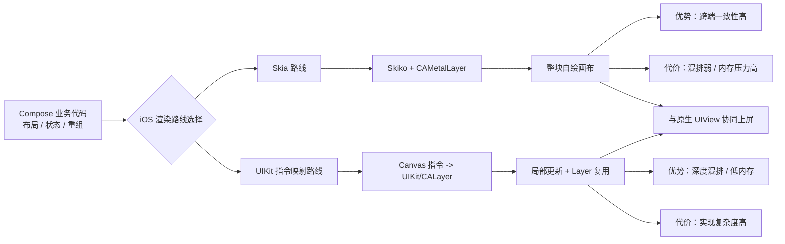

#### 技术选型补充：组件映射 vs 指令映射

| 路线 | 做法 | 优点 | 局限 |
| :--- | :--- | :--- | :--- |
| 组件映射 | 将 Compose 组件逐个映射为 UIKit 组件 | 实现直观、上手快 | 跨端行为一致性和长期维护成本压力大 |
| 指令映射（ovCompose） | 在 Canvas/绘制指令层实现 UIKit 后端 | 更贴近 Compose 绘制语义，混排能力更强 | 实现复杂度更高 |

ovCompose 在 iOS 端采用指令映射，并与官方 Skia 路线运行时共存：对一致性敏感场景可选 Skia；对深度混排和内存敏感场景可选 UIKit 路线。

#### 指令翻译到底怎么做（UIKit 后端）

UIKit 后端不是“把 Compose 组件翻译成 UIKit 组件”，而是把 **Compose 在绘制阶段发出的 draw 指令**做分流转换：

| 指令类型 | 转换方式 | 产物 |
| :--- | :--- | :--- |
| 结构性绘制（背景、圆角、阴影、透明度、变换、层级） | 直接映射到 `UIView/CALayer` 属性（如 `cornerRadius`、`opacity`、`transform`、`zPosition`） | 原生 Layer 树节点 |
| 复杂矢量绘制（尤其文本、部分复杂图形） | 先走 Skia 录制与出图，再把位图挂到 `CALayer.contents` | 位图 Layer 节点 |

这也是 ovCompose 能同时满足“同层混排”和“跨端一致性”的关键：
- 能原生表达的，直接走原生 Layer 属性（混排强、内存更友好）；
- 原生难以保证一致性的，继续交给 Skia 产出统一像素结果。

#### PictureRecorder 是在哪一步用到的

PictureRecorder 用在上面第二类“复杂矢量绘制”的链路里，步骤如下：

1. Compose 进入绘制阶段，文本/复杂图形触发 `draw*` 调用。
2. 创建 `PictureRecorder`，调用 `beginRecording(bounds)` 拿到“录制型 Canvas”。
3. 在该 Canvas 上执行 `drawText/drawPath/...`，此时只记录指令，不立即光栅化。
4. 调用 `finishRecordingAsPicture()` 得到不可变 `Picture`。
5. 将 `Picture` 光栅化为位图（如 `CGImage`），赋给对应 `CALayer.contents`。
6. 与其他原生 `UIView/CALayer` 节点一起参与系统合成与同层混排。

> 一句话：PictureRecorder 不负责“直接上屏”，它负责把复杂绘制先录成可复用的绘制描述（Picture），再在后续阶段出图并挂载到 Layer。

#### UIKit 模式能力边界（基于官方公开说明）

| 维度 | UIKit 模式表现 | 说明 |
| :--- | :--- | :--- |
| Text | 与 Skia 模式基本一致 | 文本由 Skia 统一产出，再交由 `CALayer` 展示 |
| Image/特效 | 大部分能力可用，少数特殊滤镜存在差异 | 取决于原生能力映射与 Skia 路径差异 |
| GraphicsLayer | `saveLayer` 等离屏合成能力有限 | 这类能力难以直接映射到原生 Layer 属性 |
| Marquee | 默认不支持 | 可按业务场景用原生视图替代 |

#### 性能与交互优化（核心抓手）

- **UIKit 容器复用**：在 `UICollectionViewCell`、`UITableViewCell` 等场景复用原生机制，减少独立渲染上下文带来的内存开销 [2]。
- **PictureRecorder 局部更新**：内容未变化时复用 `Picture/位图` 缓存，仅重录脏区，避免复杂页面全量重组。
- **混排交互增强**：`ComposeUIView` 降低接入成本，`intrinsic content size` 改善自适应布局，协作式触摸减少滚动与手势冲突 [2]。

#### 统一基础设施

ovCompose 集成 **KuiklyBase**，为 iOS、Android、HarmonyOS 提供统一的构建与基础库支持 [2]，让团队把更多精力放在业务实现，而不是平台适配细节。

### 2.3 iOS 小结

把 2.1~2.2 压缩成一句话：**原版 CMP 的问题在“跨渲染体系混排”，ovCompose 的解法在“后端可切换 + 局部更新 + 工程化混排能力”。**

落到工程视角，最关键是三点：

1. **渲染后端可选**：Skia 保一致性，UIKit 保混排与内存效率。
2. **更新粒度可控**：通过 PictureRecorder 与差异更新，避免复杂页面全量重绘。
3. **接入成本下降**：ComposeUIView、Intrinsic Size、协作式触摸把“能跑”推进到“可维护”。

下面的 2.4 会把第二点（PictureRecorder）拆开讲透：它为何关键、怎么工作、边界在哪。

### 2.4 PictureRecorder：解决 iOS 平台的关键技术

> PictureRecorder 是 ovCompose 在 iOS 端实现局部更新与稳定帧率的关键技术。

为了避免“术语很多但抓不住重点”，这一节建议按这个顺序阅读：

1. 先看 **2.4.0**，明确 PictureRecorder 的适用边界；
2. 再看 **2.4.1~2.4.3**，理解其机制与性能收益；
3. 最后看 **2.4.4~2.4.7**，把机制映射到 iOS 和框架对比场景。

#### 2.4.0 先回答最常见疑问：只有文本会用 PictureRecorder 吗？

不是。更准确的判断标准不是“组件类型”，而是“这段绘制能否被 `UIView/CALayer` 原生属性直接表达”。

| 绘制内容 | 默认处理方式 | 是否走 PictureRecorder |
| :--- | :--- | :--- |
| 背景色、圆角、边框、阴影、透明度、变换、裁剪、层级 | 直接映射到 `UIView/CALayer` 属性 | 否 |
| 文本（排版/字形/富文本） | Skia 录制/出图 → `CALayer.contents` 展示 | 是（官方明确） |
| 复杂矢量绘制（如任意 Path、自定义 `Canvas{}` / `drawBehind`） | 原生可表达则映射；不可表达则走 Skia 录制与出图 | 常见会用 |
| Image | 多数可映射到原生图层能力，部分滤镜/效果走 Skia 路径 | 部分 |

为什么官方经常单独点名“文本”：

1. 文本是高频且对跨端一致性最敏感的内容。
2. 文本排版难以用原生文本组件做到与 Skia 完全一致。
3. 因此它是“必须走 Skia 路径”的代表性场景，但不是唯一场景。

> 结论：PictureRecorder 并非只用于文本；凡是不能稳定映射为原生 Layer 属性、又要求一致性的自定义矢量绘制，都可能走 Picture 录制链路。具体命中哪些 DrawScope 调用，以源码实现为准。

#### 2.4.0.1 UIView 后端 PictureRecorder 调用链时序图（源码定位版）

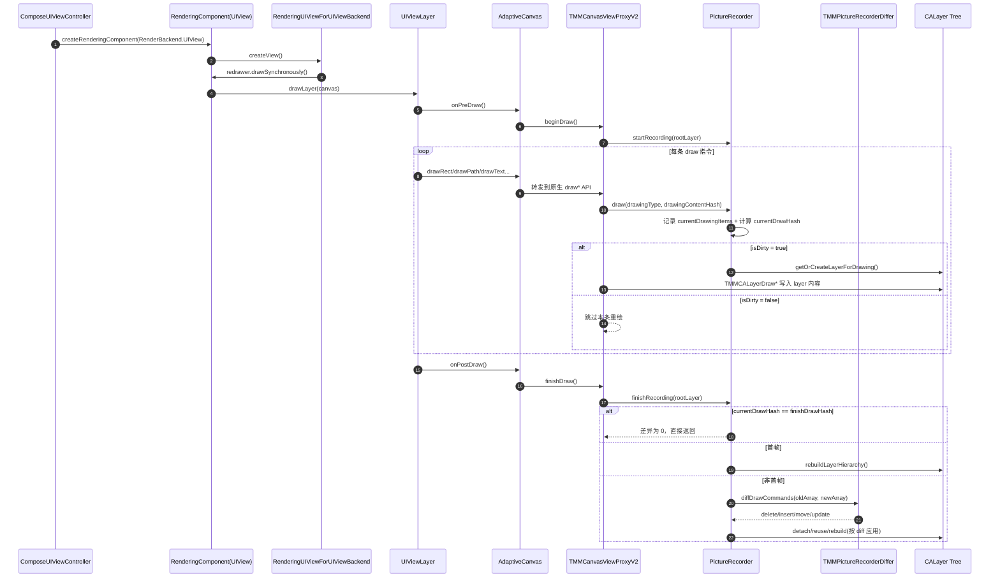

> 注：上图对应源码中的真实调用点（如 `beginDraw -> startRecording`、`finishDraw -> finishRecording`、`diffDrawCommands`），可用于后续逐行断点追踪。

#### 2.4.1 概述

PictureRecorder 是 Skia 图形引擎中一个核心的渲染基础设施组件，其本质是一个**命令录制器**（Command Recorder），用于将一系列绘图操作捕获并封装为一个不可变的、可序列化的 `SkPicture` 对象 [1](https://api.skia.org/classSkPictureRecorder.html)。与传统的直接渲染模式不同，PictureRecorder 并不立即将绘图指令转换为屏幕上的像素，而是将这些指令以"命令流"（Command Stream）的形式记录下来，形成一种**延迟渲染**（Deferred Rendering）架构 [2]。

在 ovCompose 项目中，PictureRecorder 被赋予了更具体的工程使命：作为**局部更新架构**的底层支撑，通过增量哈希（Incremental Hashing）技术精确识别 UI 树中发生变化的节点，仅对变更部分触发重绘，从而大幅减少 UI 更新时的计算负载 [3](https://github.com/Tencent-TDS/ovCompose-multiplatform-core)。这一机制是 ovCompose 在 iOS 平台上实现高性能混排的关键技术支柱之一。

PictureRecorder 的核心价值可以概括为三个维度：**录制与回放分离**（Record-Playback Decoupling）、**空间索引加速**（Spatial Index Acceleration）以及**增量更新支持**（Incremental Update Support）。以下各章节将对这些机制进行深入剖析。

#### 2.4.2 核心机制详解

PictureRecorder 的工作流程可以清晰地划分为录制阶段和回放阶段两个独立的过程，中间产物是 `SkPicture` 对象。这种分离设计使得绘图指令的生产与消费可以在不同的时间、不同的线程甚至不同的渲染表面上进行。

##### 录制阶段：命令捕获而非像素绘制

录制阶段的核心操作是调用 `beginRecording()` 方法。该方法返回一个特殊的"录制画布"（Recording Canvas），其行为与标准画布存在本质区别 [1](https://api.skia.org/classSkPictureRecorder.html)：

| 特性 | 标准画布（Raster/GPU Canvas） | 录制画布（Recording Canvas） |
| :--- | :--- | :--- |
| 底层目标 | 像素缓冲区或 GPU 纹理 | 内部命令流缓冲区 |
| 绘制行为 | 立即执行光栅化，生成像素 | 将操作序列化为指令记录 |
| 内存占用 | 与画布尺寸成正比 | 仅与指令数量和复杂度相关 |
| 线程安全 | 通常绑定于单一线程 | 录制完成后产物可跨线程传递 |

当开发者调用 `drawRect()`、`drawPath()`、`drawText()` 等绘图方法时，录制画布不会执行实际的光栅化操作，而是将每个操作的**类型、参数和属性**（如坐标、颜色、画笔样式、裁剪区域等）编码为紧凑的二进制指令，追加到内部的命令流中。这一过程类似于数据库的 Write-Ahead Logging（WAL）机制——先记录"做了什么"，而非立即"执行结果"。

录制阶段还支持一个重要的可选参数：**边界框层次结构工厂**（如 `SkRTreeFactory`）。当传入该工厂时，PictureRecorder 会在录制过程中同步构建空间索引结构，为后续回放阶段的快速裁剪剔除奠定基础 [1](https://api.skia.org/classSkPictureRecorder.html)。

录制完成后，调用 `finishRecordingAsPicture()` 终止录制并生成最终的 `SkPicture` 对象。该对象包含一个 **cull rect**（裁剪矩形），作为整个绘制内容的包围盒提示，供图形引擎在回放时进行初步的可见性判断 [1](https://api.skia.org/classSkPictureRecorder.html)。

##### SkPicture 对象：不可变命令流容器

`SkPicture` 是录制阶段的输出产物，其核心特性如下 [2]：

- **不可变性（Immutability）**：一旦通过 `finishRecordingAsPicture()` 生成，`SkPicture` 的内容便不可修改。这一特性使其天然具备线程安全性，可以在后台录制线程与主线程渲染线程之间安全传递，无需额外的同步机制。
- **命令流封装**：`SkPicture` 内部存储的是序列化的绘图指令序列，而非像素数据。这意味着它的内存占用与绘制内容的复杂度相关，而与目标渲染表面的分辨率无关。一个包含 1000 个路径的复杂矢量图形，其 `SkPicture` 大小可能仅有几十 KB。
- **跨表面可重放**：同一个 `SkPicture` 可以被重放到任意类型的 `SkCanvas` 上——无论是 GPU 加速的 Metal 表面、CPU 光栅化的位图表面，还是 PDF 文档的矢量输出表面。这种"一次录制，多处渲染"的能力是延迟渲染架构的核心优势。
- **序列化支持**：`SkPicture` 可以被序列化为 `.skp` 文件格式，便于持久化存储、网络传输以及使用 Skia Debugger 等工具进行离线分析和调试。

##### 回放阶段：指令执行与像素生成

回放阶段将 `SkPicture` 中存储的命令流"重放"到目标画布上，此时才真正执行光栅化并生成像素。回放可以通过两种等效方式触发 [1](https://api.skia.org/classSkPictureRecorder.html)：

- `canvas.drawPicture(picture)`：将 `SkPicture` 作为整体绘制到目标画布上。
- `picture.playback(canvas)`：直接调用 `SkPicture` 的 `playback` 方法，将命令流逐条执行到指定画布。

在回放过程中，Skia 引擎会利用录制阶段构建的空间索引（如 R-Tree）进行**裁剪剔除优化**：对于完全落在当前裁剪区域之外的绘图指令，引擎可以直接跳过其执行，从而显著减少 GPU 的绘制调用次数。这一优化在包含大量离屏元素的复杂 UI 场景中尤为关键。

#### 2.4.3 性能优化技术

PictureRecorder 的性能优势并非仅仅来自"录制-回放"的分离架构，更深层的优化来自于录制阶段嵌入的空间索引结构以及回放阶段的延迟执行策略。

##### 边界框层次结构与 R-Tree 空间索引

在调用 `beginRecording()` 时，开发者可以传入一个 `SkRTreeFactory` 实例。该工厂会在录制过程中为每条绘图指令计算其包围盒（Bounding Box），并构建一棵 **R-Tree 空间索引树** [1](https://api.skia.org/classSkPictureRecorder.html)。

R-Tree 是一种专门用于空间数据索引的平衡树结构，其核心思想是将空间上邻近的对象分组到同一节点中，并以节点的最小包围矩形（MBR, Minimum Bounding Rectangle）作为该节点的空间范围描述。在回放阶段，当 Skia 需要将 `SkPicture` 渲染到具有特定裁剪区域的画布时，引擎可以自顶向下遍历 R-Tree：

1. 从根节点开始，检查当前节点的 MBR 是否与裁剪区域相交。
2. 若完全不相交，则整棵子树的所有绘图指令均可安全跳过。
3. 若相交，则继续向下递归检查子节点，直至叶子节点。
4. 仅对与裁剪区域相交的叶子节点中的绘图指令执行实际的光栅化。

这一机制的时间复杂度为 O(log n)，相比逐条遍历所有指令的 O(n) 复杂度，在包含数千乃至数万条指令的复杂场景中可带来数量级的性能提升。在 iOS 设备上，这意味着即使 Compose 组件树包含大量离屏或部分可见的 UI 元素，GPU 的实际绘制负载也能保持在可控范围内。

##### 延迟执行与指令重排优化

由于 PictureRecorder 将绘图指令的"定义"与"执行"解耦，Skia 引擎获得了在回放前对命令流进行全局优化的机会 [2]。具体优化策略包括：

- **遮挡剔除（Occlusion Culling）**：如果命令流中存在被后续不透明绘制完全覆盖的早期指令，引擎可以在回放前将其移除，避免无效的 GPU 绘制。
- **指令合并（Command Batching）**：将连续的、使用相同渲染状态的绘制操作合并为单次 GPU 绘制调用，减少状态切换开销。
- **纹理图集重排（Atlas Reordering）**：对于使用同一纹理图集的多个绘制指令，引擎可以调整其执行顺序以最大化纹理缓存的命中率。

这些优化在录制阶段是不可行的（因为录制时并不知道后续会绘制什么），但在回放前的全局视角下变得可能。这种"先记录、后优化、再执行"的流水线是 PictureRecorder 区别于直接渲染模式的核心性能优势。

##### 缓存策略与线程分离

PictureRecorder 的不可变产物 `SkPicture` 天然适合作为缓存单元 [2]。在 UI 框架中，静态或低频变化的界面区域可以被录制为 `SkPicture` 并缓存。后续帧渲染时，这些区域只需重放已有的 `SkPicture`，而无需重新执行高层的 UI 构建逻辑（如 Compose 的 Recomposition 过程）。

线程分离是另一项关键优化。在 Flutter 等框架中，UI 线程负责录制 `SkPicture`（定义"画什么"），而 Raster 线程负责回放 `SkPicture` 到 GPU（执行"怎么画"）[2]。这种分离使得：

- 主线程可以专注于处理用户交互和业务逻辑，不被复杂的 GPU 操作阻塞。
- 渲染线程可以保持稳定的帧节奏，不受主线程突发计算负载的影响。
- 在 iOS 的 120Hz ProMotion 显示屏上，这一分离可节省高达 **30% 的帧时间** [2]。

#### 2.4.4 在 Compose Multiplatform iOS 上的应用

Compose Multiplatform 在 iOS 上通过 Skiko（Skia for Kotlin）库使用 Skia 渲染引擎，底层基于 Metal 图形 API 进行硬件加速 [3](https://github.com/Tencent-TDS/ovCompose-multiplatform-core)。PictureRecorder 在这一技术栈中的应用面临 iOS 平台特有的挑战和优化机会。

##### 离线程命令编码

在 iOS 平台上，Compose Multiplatform 的一项关键优化是将 PictureRecorder 的命令编码工作从主线程迁移至独立的渲染线程 [2]。其工作原理如下：

1. 主线程执行 Compose 的 Recomposition 过程，确定需要更新的 UI 节点。
2. 渲染线程使用 PictureRecorder 将这些更新录制为新的 `SkPicture`。
3. 主线程在此期间可以继续处理下一帧的用户交互和状态更新。
4. 渲染线程完成录制后，将 `SkPicture` 提交给 GPU 进行回放。

这种双缓冲（Double Buffering）式的流水线设计使得 CPU 和 GPU 能够并行工作，在高刷新率显示屏上可节省高达 30% 的帧时间 [2]。对于需要维持 120fps 的 ProMotion 设备，这意味着每帧从约 8.33ms 的预算中释放出约 2.5ms 用于其他计算任务。

##### 着色器预热与 PSO 编译

iOS 上的 Metal 图形 API 要求在首次使用特定渲染配置时编译 **Pipeline State Objects（PSO）**。一次 PSO 编译可能阻塞渲染管线长达 2ms 或更久，导致可感知的卡顿（hitching）[2]。

PictureRecorder 的录制-回放分离架构为这一问题提供了自然的解决方案：应用可以在启动画面（Splash Screen）期间，使用离屏画布预录制包含典型渲染操作（圆角矩形、模糊阴影、文本样式等）的 `SkPicture` 并强制回放，从而触发 Metal 驱动完成所有必要 PSO 的编译 [2]。当用户开始实际交互时，这些着色器已经处于"热"状态，避免了首帧卡顿。

##### 纹理图集管理

iOS 设备上的周期性卡顿常源于"纹理图集抖动"（Texture Atlas Thrashing）——Skia 的字形缓存或图像区域被频繁驱逐并重新上传至 GPU [2]。PictureRecorder 的缓存机制可以通过以下策略缓解这一问题：

- 将使用相同字体和字号的文本节点录制到同一个 `SkPicture` 中，确保字形图集在回放期间保持稳定。
- 对图像资源使用整数倍缩放，使其能够整齐映射到图集区域，减少 GPU 的内存重分配频率。
- 在 UIKit 渲染模式下，将 GPU 密集型组件（如 MapKit、AVPlayerLayer、WKWebView）交由原生框架处理，使其绕过 Skia-to-Metal 的转换层，直接与系统合成器交互 [2]。

#### 2.4.5 ovCompose 中的增量更新实现

ovCompose 对 PictureRecorder 的应用超越了标准的录制-回放模式，构建了一套完整的**增量更新架构**，这是其解决 iOS 混排性能问题的核心技术支柱。

##### 分层渲染与缓存策略

ovCompose 将 UI 树分解为多个独立的渲染层（Render Layer），每一层维护自己的 `SkPicture` 缓存 [3](https://github.com/Tencent-TDS/ovCompose-multiplatform-core)。这种分层策略的核心逻辑如下：

1. **层边界划分**：ovCompose 在 Compose 的布局阶段识别"重绘边界"（Repaint Boundary），将 UI 树切分为粒度适当的渲染层。每个层对应一个独立的 PictureRecorder 实例。
2. **独立录制**：当某一层内的 UI 状态发生变化时，仅该层触发 PictureRecorder 的重新录制，生成新的 `SkPicture`。
3. **缓存复用**：未发生变化的层直接复用其已有的 `SkPicture` 缓存，在回放阶段原样重放。
4. **合成**：所有层的 `SkPicture` 按照 Z 轴顺序依次回放到最终的目标画布上，完成帧的合成。

这一策略将 UI 更新的计算复杂度从 O(整棵树) 降低到 O(变化子树)，在包含大量静态内容的复杂页面中效果尤为显著。

##### 增量哈希技术识别变化节点

ovCompose 的增量更新架构的核心创新在于其**变化检测机制**——增量哈希（Incremental Hashing）技术 [3](https://github.com/Tencent-TDS/ovCompose-multiplatform-core)。该技术的工作流程如下：

1. **节点哈希计算**：在每次 Recomposition 过程中，ovCompose 为 UI 树中的每个节点计算一个哈希值。该哈希值综合了节点的布局属性（尺寸、位置）、样式属性（颜色、字体、边距）以及内容数据。
2. **增量更新**：哈希计算采用增量方式——当节点的某个属性发生变化时，只需将该属性的新旧哈希值进行异或或替换操作，即可快速更新节点的总哈希值，无需重新遍历整个子树。
3. **差异比对**：将当前帧的节点哈希值与上一帧缓存的值进行比对。若哈希值一致，则判定该节点未发生变化，跳过其 PictureRecorder 的重新录制。
4. **脏区域标记**：对于哈希值发生变化的节点，ovCompose 将其标记为"脏"（Dirty），并向上传播至所属的渲染层，触发该层的 PictureRecorder 重新录制。

增量哈希的优势在于其 O(1) 的节点级更新复杂度和 O(1) 的等值判断复杂度，远优于需要深度遍历子树的传统 Diff 算法。

##### 仅重绘脏区域

当脏节点被识别并标记后，ovCompose 执行精确的局部重绘流程 [3](https://github.com/Tencent-TDS/ovCompose-multiplatform-core)：

1. **脏层收集**：收集所有包含脏节点的渲染层，这些层是需要重新录制的目标。
2. **PictureRecorder 重录**：对每个脏层，创建新的 PictureRecorder 实例，调用 `beginRecording()` 获取录制画布，仅将该层内的 UI 元素绘制到录制画布上。
3. **SkPicture 替换**：调用 `finishRecordingAsPicture()` 生成新的 `SkPicture`，替换该层原有的缓存。
4. **增量合成**：在回放阶段，将更新后的 `SkPicture` 与未变化层的缓存 `SkPicture` 一起合成最终帧。由于只有脏层涉及新的 GPU 指令提交，合成开销也保持在最低水平。

相比原版 Compose Multiplatform 在复杂布局中的全量重组（Recomposition）策略，这一机制大幅减少了 UI 更新时的计算负载，有效提高了帧率稳定性，尤其在列表滚动和频繁状态更新的场景中效果显著 [3](https://github.com/Tencent-TDS/ovCompose-multiplatform-core)。

#### 2.4.6 iOS 工程化优化补充

##### 增量 hash 的工程价值

在复杂页面中，若每帧都做高成本全量比对，hash 计算本身会变成新瓶颈。ovCompose 在 iOS 落地中强调增量 hash 的滚动计算思路：每次绘制指令执行时逐步合并指令特征，只在 hash 变化时触发后续更新，从而减少无效 diff 与重复重绘。

##### 指令对象轻量化：C 结构体替代 OC 对象

在高压场景下，海量 OC 对象的 `alloc/dealloc` 与 ARC 管理会放大渲染开销。ovCompose 的公开实践强调将绘制指令表示从重量级对象转向轻量 C 结构体，并减少 OC 闭包依赖，以降低对象生命周期成本。

##### 文本一致性策略：Skia 出图 + CALayer 展示

文本是跨端一致性最敏感的部分之一。iOS 路线中采用“Skia 负责文本结果、CALayer 负责展示与混排”的组合策略：既保留跨端视觉一致性，又可融入 UIKit 层级树参与混排。

##### 公开压测收益（示例）

| 指标 | 优化前后变化 |
| :--- | :--- |
| 首次渲染耗时 | 下降约 13% |
| 再次渲染耗时 | 下降约 56% |

> 注：以上数据来自公开技术分享口径，具体值会受机型、页面复杂度与场景负载影响。

#### 2.4.7 与其他框架的对比

PictureRecorder 并非 ovCompose 或 Compose Multiplatform 的独创技术，而是 Skia 生态中广泛使用的基础设施。不同框架对其的应用和演进路径各有特色。

##### Flutter 的 RepaintBoundary

Flutter 框架通过 `RepaintBoundary` 组件显式标记 UI 中的重绘隔离边界 [2]。其工作机制与 ovCompose 的分层渲染策略高度相似：

| 特性 | Flutter RepaintBoundary | ovCompose 分层渲染 |
| :--- | :--- | :--- |
| 边界定义 | 开发者通过 Widget 显式声明 | 框架自动识别 + 开发者可选配置 |
| 缓存粒度 | 每个 RepaintBoundary 一个 Picture | 每个渲染层一个 Picture |
| 触发机制 | 子树状态变化触发局部重录 | 增量哈希差异触发局部重录 |
| 线程模型 | UI 线程录制，Raster 线程回放 | 主线程录制，渲染线程回放 |

Flutter 的 `RepaintBoundary` 要求开发者具备一定的性能优化意识，手动在合适的 Widget 层级插入边界。而 ovCompose 的增量哈希机制则更偏向自动化，通过运行时分析自动确定最优的层切分策略。

##### Flutter Impeller：从 SkPicture 到 DisplayList

Flutter 生态在 2024-2026 年间经历了从 Skia 到 **Impeller** 渲染引擎的重大迁移 [2]。Impeller 用专门的 **DisplayList** 格式取代了通用的 `SkPicture`，其核心改进包括：

- **预编译着色器**：Impeller 在构建时就将所有着色器预编译为平台原生格式（iOS 上为 Metal Shader Library），彻底消除了运行时 PSO 编译导致的卡顿。这是对 Skia 模式下需要"着色器预热"问题的根本性解决。
- **简化的命令格式**：DisplayList 专为 UI 渲染场景设计，去除了 `SkPicture` 中为通用矢量图形保留的冗余信息，指令编码更紧凑，回放开销更低。
- **更精确的损伤跟踪**：Impeller 内置像素级的损伤区域（Damage Region）跟踪，能够自动确定每帧需要重绘的最小矩形区域，无需开发者手动设置 RepaintBoundary。

ovCompose 目前仍基于 Skia 生态，但其增量哈希 + PictureRecorder 的架构在理念上与 Impeller 的 DisplayList 损伤跟踪有异曲同工之妙——都是在追求"只重绘真正变化的部分"这一终极目标。

##### React Native Skia

Shopify 开发的 React Native Skia 库将 Skia 的 PictureRecorder 能力引入 React Native 生态 [2]。其设计特点包括：

- **默认保留模式**：React Native Skia 默认使用保留模式渲染，自动为声明式绘图组件创建 DisplayList，动画场景下性能开销接近零。
- **手动 Picture API**：对于高度动态的内容（如每帧形状数量变化的粒子效果），提供手动 `Picture` API，给予开发者更精细的控制权。
- **React 协调集成**：通过 React 的协调（Reconciliation）机制自动判断哪些绘图组件需要更新，与 ovCompose 的增量哈希在目标上一致，但实现路径不同（依赖 React 的 Virtual DOM Diff vs. 自定义哈希比对）。

##### 技术路线对比总结

| 框架/引擎 | 核心机制 | 变化检测 | iOS 优化 | 成熟度 |
| :--- | :--- | :--- | :--- | :--- |
| ovCompose | PictureRecorder + 增量哈希 | 节点级哈希比对 | 离线程编码 + PSO 预热 | 生产可用 |
| Flutter (Skia) | RepaintBoundary + SkPicture | 子树级状态比较 | 线程分离 | 成熟（已迁移） |
| Flutter (Impeller) | DisplayList + 损伤跟踪 | 像素级损伤区域 | 预编译 Metal Shader | 新一代默认引擎 |
| React Native Skia | 保留模式 + Picture API | React Virtual DOM Diff | 依赖底层 Skia | 活跃开发中 |

#### 2.4.8 小结

PictureRecorder 是 Skia 图形引擎中实现延迟渲染的核心机制，其本质是将绘图操作录制为不可变的命令流（`SkPicture`），在回放阶段才执行实际的光栅化。这一"录制-回放"分离架构带来了三个层面的性能优势：通过 R-Tree 空间索引实现 O(log n) 的裁剪剔除、通过全局视角的指令重排和遮挡剔除减少 GPU 负载、通过不可变产物的缓存复用避免重复计算。

在 Compose Multiplatform 的 iOS 实现中，PictureRecorder 的应用进一步结合了平台特性：离线程命令编码释放了主线程的帧预算、着色器预热规避了 Metal PSO 编译卡顿、纹理图集管理策略缓解了 GPU 内存抖动。

ovCompose 在此基础上构建了完整的增量更新架构——通过增量哈希技术以 O(1) 复杂度识别 UI 树中的变化节点，将重绘范围精确限定在"脏"渲染层，仅对这些层重新录制 `SkPicture` 并增量合成最终帧。这一机制从根本上解决了原版 Compose Multiplatform 在 iOS 上因全量重组导致的性能瓶颈，是 ovCompose 能够在复杂混排场景下维持高帧率稳定性的关键技术支柱。

#### 2.4.9 信息可靠性说明

- **已确认事实**：iOS 双后端（Skia/UIKit）共存、文本走 Skia 产出后由 `CALayer` 展示、UIKit 模式下部分能力边界（如 `saveLayer`/Marquee）。
- **机制推导**：`beginRecording()` → 指令录制 → `finishRecordingAsPicture()` → 光栅化 → `CALayer.contents` 这一链路来自 Skia 标准 API 机制与公开方案对照。
- **待源码实证项**：具体类名、调用点、缓存键设计等实现细节，需以 ovCompose 源码定位为准。

#### 2.4.10 参考文献

[1] [Skia C++ API - SkPictureRecorder (2026-06-02)](https://api.skia.org/classSkPictureRecorder.html)

[2] 腾讯官方发布文与公开技术分享（用于 UIKit 后端、文本一致性与性能口径说明，2026-06-02）

[3] [GitHub - Tencent-TDS/ovCompose-multiplatform-core (2026-06-02)](https://github.com/Tencent-TDS/ovCompose-multiplatform-core)

[4] ovCompose-sample 仓库说明（UIKit/Skia 双后端与一致性差异表，2026-06-02）

## 3. ovCompose 鸿蒙平台适配

### 3.1 背景概述

#### ovCompose 项目简介

可以把 ovCompose 理解成一句话：**它不是重写一套 UI 框架，而是在 CMP 之上补齐“生产落地缺口”。**

这个缺口主要有三类：

1. iOS 深度混排能力不足；
2. 复杂页面的内存与帧稳定性压力；
3. 官方 CMP 对鸿蒙支持仍不完整。

因此，ovCompose 的目标并不只是“能跨端”，而是“能在真实业务里长期维护”。目前它已在 Android / iOS / HarmonyOS 的“三端一码”实践中验证了较高代码复用率（约 90%）[3]。

#### 为何需要适配鸿蒙

截至 2026 年，JetBrains 官方 Compose Multiplatform 对 HarmonyOS NEXT 的原生 UI 支持仍不完整 [4]。核心难点不在“语法层兼容”，而在两条底层链路都要补齐：

- **渲染链路**：ArkUI + 鸿蒙图形栈与 Android/iOS 的既有渲染路径差异较大，Skiko 需要做平台级适配；
- **运行时链路**：Kotlin/Native 产物要通过 NAPI 与 ArkTS/系统能力协同，不能直接套用移动端既有做法。

所以这件事本质上不是“加一个 target”，而是“把缺失的平台底座补出来”。ovCompose 的价值，正是在这里把工程链路打通 [3]。

#### 为什么说鸿蒙移植比 iOS 更“硬核”

和 iOS 相比，鸿蒙适配更偏向“从 0 到 1 的平台补齐”：不仅要复用 Compose 上层能力，还要把原本由官方平台实现承接的底层能力在 HarmonyOS 上重新打通。可以归纳为三问：

1. **Kotlin 代码怎么跑在鸿蒙上**：通过 Kotlin/Native + LLVM 编译产物（`.so`）接入鸿蒙 NDK [3]。
2. **Compose 怎么真正画到屏幕上**：移植 Skia/Skiko，并将渲染结果接到 XComponent/NativeWindow [3][4]。
3. **Compose 怎么接入系统能力**：把生命周期、输入、文本、帧调度等平台接口映射到鸿蒙实现 [4]。

### 3.2 核心技术架构

ovCompose 在鸿蒙平台上的适配采用了分层架构设计，确保业务逻辑的高度复用与原生渲染性能的平衡。整个技术栈可以划分为逻辑层、渲染层和资源管理层三个核心层次。

#### 鸿蒙移植总览架构图

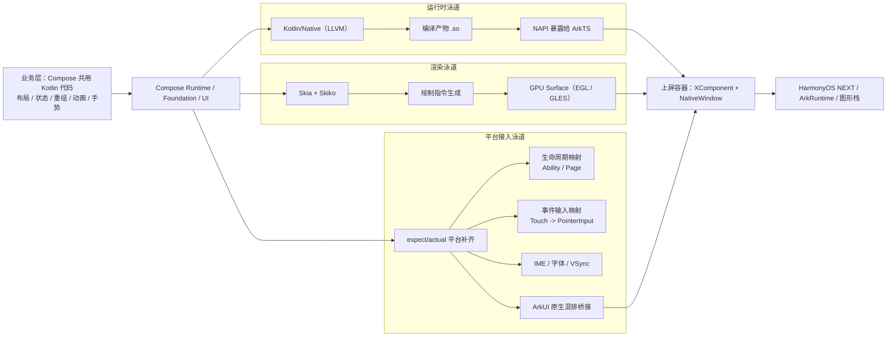

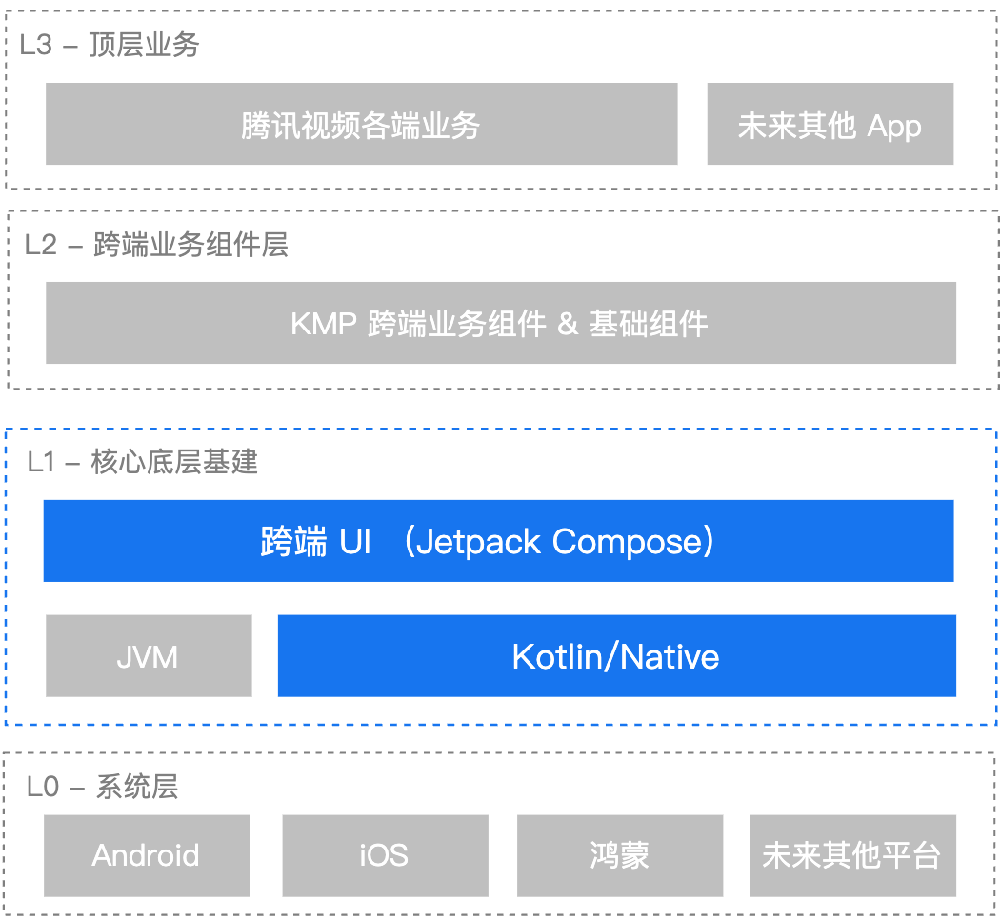

> 图：腾讯视频“三端一码”分享中的 L0-L3 分层视角（补充到文中用于与上方 Mermaid 架构互证）。

#### 逻辑层：Kotlin Multiplatform 与 Kotlin/Native

逻辑层是 ovCompose 实现"三端一码"的基石。该层基于 Kotlin Multiplatform (KMP) 技术，将业务逻辑、网络请求（如 NetworkKMM）、数据持久化和状态管理等代码统一编写在 `commonMain` 模块中 [3]。

在鸿蒙端，Kotlin 代码通过 **Kotlin/Native (KN)** 编译为原生机器码，而非传统的"Kotlin → JavaScript → ArkTS"桥接路径 [3]。这一技术选型具有以下关键优势：

| 编译策略 | 执行方式 | 性能特征 | 工程复杂度 |
| :--- | :--- | :--- | :--- |
| Kotlin → JS → ArkTS | 在 JS 引擎中解释执行 | 受限于 JS 引擎性能，存在桥接开销 | 较低，但性能瓶颈明显 |
| Kotlin/Native → 原生机器码 | 直接在 CPU 上执行 | 接近原生性能，无桥接损耗 | 较高，需适配 LLVM 工具链 |

ovCompose 选择了后者，通过适配鸿蒙的 LLVM 编译器工具链，将 Kotlin 代码直接编译为鸿蒙 NDK 环境下的 `.so` 动态库 [3]。编译产物通过 NAPI 接口暴露给 ArkTS 层调用，实现了业务逻辑与 UI 渲染的解耦。

#### 渲染层：Skia 引擎与 Skiko 封装

渲染层是 ovCompose 在鸿蒙平台上最具技术挑战的部分。ovCompose 采用 **Skia** 作为跨平台渲染引擎，通过 **Skiko**（Skia 的 Kotlin 封装库）在鸿蒙上实现统一的绘制能力 [3]。

完整的渲染管线遵循以下流程：

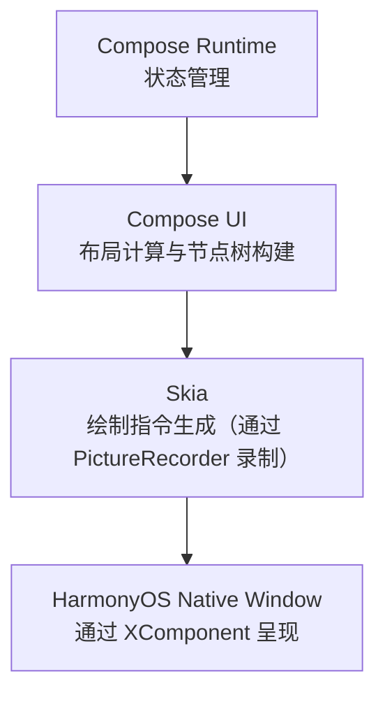

在这一管线中，Skia 负责将 Compose UI 的布局结果转化为具体的绘制指令（如 `drawRect`、`drawPath`、`drawText` 等），并通过 Metal/Vulkan 等图形 API 提交给 GPU 执行。Skiko 作为中间层，将 Skia 的 C++ API 封装为 Kotlin 友好的接口，使得 Compose Runtime 可以无缝调用底层图形能力 [1](https://github.com/Tencent-TDS/ovCompose-multiplatform-core)。

在鸿蒙平台上，Skia 的渲染输出需要对接至鸿蒙的 Native Window 系统。ovCompose 使用鸿蒙的 **XComponent** 组件作为渲染画布容器，XComponent 提供了一个原生渲染表面（Native Surface），Skia 将渲染结果提交到该表面并与 ArkUI 容器协同上屏，从而确保 UI 视觉效果在三端的高度一致性 [3]。

#### 资源管理：类型安全的跨平台资源访问

ovCompose 构建了一套跨平台原生资源管理方案，支持在编译时生成类型安全的资源访问类（Resource Class），提供类似 Android `R` 类的调用体验 [3]。该方案的核心机制包括：

- **编译时代码生成**：通过 Kotlin Symbol Processing (KSP) 或类似的注解处理器，在编译阶段扫描资源目录（如 `drawable`、`string`、`color` 等），自动生成对应的 Kotlin 访问类。
- **类型安全保证**：生成的资源类为每种资源类型提供强类型访问方法，避免运行时因资源 ID 错误导致的崩溃。
- **平台适配**：在鸿蒙端，资源类会自动映射到鸿蒙的资源管理机制，开发者无需关心底层差异。

### 3.3 鸿蒙适配的关键技术实现

#### 章节说明

KMM 在鸿蒙上的编译器与运行时移植（含 LLVM / IR 背景、KuiklyBase-kotlin 全景流程）已前置到 **0.2 节**（重点见 **0.2.2 节**），本节聚焦 ovCompose 在鸿蒙侧的工程落地细节。

#### Native 编译策略

ovCompose 在鸿蒙适配中最关键的技术决策是放弃了"Kotlin → JavaScript → ArkTS"的桥接路径，转而采用 **Native 编译方案** [3]。这一决策的技术逻辑如下：

传统的跨平台框架（如 React Native）在鸿蒙上的适配通常采用 JS 引擎桥接方案——将业务逻辑编译为 JavaScript，在鸿蒙的 JS 运行时中执行，再通过 Bridge 与 ArkUI 通信。这种方案虽然工程实现相对简单，但存在两个根本性缺陷：JS 引擎的解释执行性能远低于原生机器码，以及 Bridge 通信带来的序列化/反序列化开销。

ovCompose 的 Native 方案则直接适配鸿蒙的 LLVM 编译器工具链，将 Kotlin 代码编译为鸿蒙 NDK 环境下的原生机器码 [3]。具体实现包括：

1. **LLVM 后端适配**：针对鸿蒙的目标三元组（Target Triple）和 ABI 规范，配置 Kotlin/Native 编译器的 LLVM 后端参数，确保生成的机器码与鸿蒙的运行时环境兼容。
2. **系统库链接**：将编译产物与鸿蒙的系统库（如 libace_napi.z.so）进行动态链接，使 Kotlin 代码能够调用鸿蒙的原生 API。
3. **NAPI 接口暴露**：通过 NAPI 将 Kotlin 模块的核心接口暴露为 C 函数，供 ArkTS 层通过 `native` 关键字声明和调用。

#### 三明治架构：原生混排能力

针对 Compose 视图与鸿蒙原生 ArkUI 组件的混排难题，ovCompose 创新性地提出了**三明治架构**（Sandwich Architecture）[3]。该架构的核心思想是使用鸿蒙的 `XComponent` 作为 Compose 的渲染画布，并支持原生 UI 组件在 Compose 视图的上层或下层灵活叠加，形成类似"三明治"的层次结构。

三明治架构的层次模型如下：

| 层级 | 组件 | 示例 / 说明 |
| :--- | :--- | :--- |
| 上层 | 原生 ArkUI 组件 | 如 WebView、视频播放器 |
| 中层 | Compose 视图（XComponent） | Skia 渲染的 Compose UI |
| 下层 | 原生 ArkUI 组件 | 如地图、相机预览 |

这一架构解决了跨平台框架在鸿蒙上最棘手的原生组件嵌套问题。以视频播放场景为例：视频播放器（原生 `Video` 组件）需要悬浮在 Compose 构建的 UI 界面之上，同时 Compose 的弹幕层又需要覆盖在视频播放器之上。三明治架构通过精确控制 XComponent 与原生组件的 Z 轴顺序，使得这种复杂的层级关系得以实现 [3]。

#### 渲染管线对接

ovCompose 在鸿蒙上的完整渲染管线对接涉及多个层次的适配工作 [4]：

1. **Compose Runtime 层**：负责管理 UI 状态和触发 Recomposition。该层完全由 Kotlin 实现，通过 Kotlin/Native 编译后在鸿蒙上直接运行，无需平台适配。

2. **Compose UI 层**：负责布局计算和 UI 节点树的构建与维护。该层同样由 Kotlin 实现，但需要对接鸿蒙的屏幕密度、字体渲染等平台参数。

3. **Skia 渲染层**：这是适配工作的核心。Skia 需要对接鸿蒙的图形驱动接口（Vulkan/OpenGL ES），将绘制指令转化为 GPU 可执行的命令。ovCompose 团队对 Skia 的鸿蒙后端进行了深度优化，包括着色器预编译、纹理图集管理和指令批处理等 [1](https://github.com/Tencent-TDS/ovCompose-multiplatform-core)。

4. **Native Window 层**：通过 XComponent 的 Native Surface 接口，Skia 将渲染结果直接写入鸿蒙的显示缓冲区，与系统的合成器（Composer）协同完成最终的画面呈现。

#### 平台接入层：系统能力映射

| 接入项 | 鸿蒙侧实现要点 | 对 Compose 的作用 |
| :--- | :--- | :--- |
| 窗口/容器 | 使用 ArkUI `XComponent` 承载渲染表面并绑定 `ComposeScene` | 建立页面根节点与宿主窗口关系 |
| 生命周期 | 将 Ability/页面前后台与 show/hide 状态映射到 Compose 生命周期 | 保证重组、资源释放、恢复时机正确 |
| 事件输入 | 把鸿蒙触摸/手势事件转换为 Pointer 输入事件 | 复用 Compose 命中测试与手势体系 |
| 文本输入（IME） | 对接鸿蒙输入法通道，处理软键盘与组合输入 | 支撑 TextField 等文本交互可用性 |
| 文本/字体 | 对接鸿蒙字体加载与字形度量 | 保证排版与测量结果稳定 |
| 帧调度 | 对接 VSync/帧回调驱动重绘循环 | 维持 `invalidate → draw` 的稳定节奏 |
| 原生混排 | 建立 Compose 与 ArkUI 原生组件互操作桥 | 支持跨技术栈组件互嵌场景 |

> 说明：公开资料重点披露了上述映射方向；具体接口命名与签名以仓库实现为准 [1](https://github.com/Tencent-TDS/ovCompose-multiplatform-core)[4]。

#### 腾讯视频实战补充：Compose UI 适配决策与混排细节（PPT）

根据腾讯视频《KMP 跨 iOS、Ohos、Android 实践》的工程复盘 [5]，JetBrains Compose UI 适配鸿蒙的落地还包含了几项关键决策：

1. **方案选型**：团队在“尽量不改 Compose 框架”与“深改鸿蒙 Native Drawing 模块”之间，最终选择前者，以换取更好的长期维护性与开源可持续性。
2. **Surface → Texture 切换**：在滑动过程中且手指未离屏时，Surface 模式下会出现原生视图位置与 Compose 镂空区域错位；切换到 Texture 模式后问题可解，且经平台侧优化后性能损耗已较小。
3. **嵌套滚动分发策略**：Compose 长列表嵌套 ArkUI 长列表场景，采用“事件优先输入 Compose”的原则，并结合 Initial / Main / Final 三阶段处理父子容器手势竞争。

| 场景 | 原始问题 | 实践方案 | 结果 |
| :--- | :--- | :--- | :--- |
| 原生混排滑动 | Surface 模式提交时序差异导致位置误差 | 切换到 Texture 模式 | 混排滑动对齐稳定，掉帧问题缓解 |
| 多层嵌套滚动 | ArkUI 与 Compose 手势抢占冲突 | 三阶段事件分发（Initial/Main/Final） | 父子滚动衔接更可控，复杂手势冲突降低 |
| 架构可维护性 | 深改平台绘制模块成本高、难长期跟进 | 选择“框架无侵入/少侵入”方案 | 更利于持续升级与后续开源演进 |

### 3.4 性能优化

ovCompose 在鸿蒙平台上的性能表现经过了系统性的优化和严格的基准测试验证。

#### 绘制性能

在经典的"小球碰撞"性能测试中，ovCompose 展现了显著的性能优势 [3]：

| 测试指标 | 优化前 | 优化后 | 提升幅度 |
| :--- | :--- | :--- | :--- |
| 30 FPS 下支持的小球数量 | 600 个 | 1500 个 | 150% |
| 接近 Android 原生 Compose 水平 | — | 1600 个 | 差距仅 6.25% |

这一性能提升得益于腾讯团队对 Kotlin/Native 编译器和 Compose Runtime 的深度优化。具体优化手段包括：减少 Recomposition 的触发频率、优化布局计算的缓存策略、以及利用 PictureRecorder 的增量更新机制降低重绘开销 [1](https://github.com/Tencent-TDS/ovCompose-multiplatform-core)。

#### 业务场景性能对比（PPT 补充）

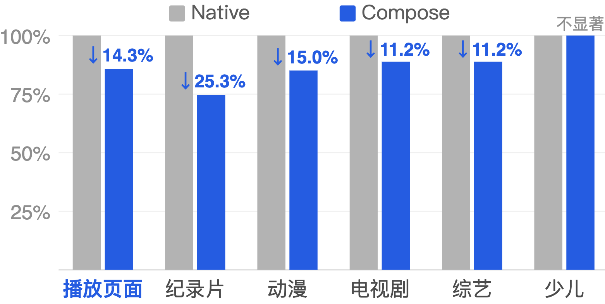

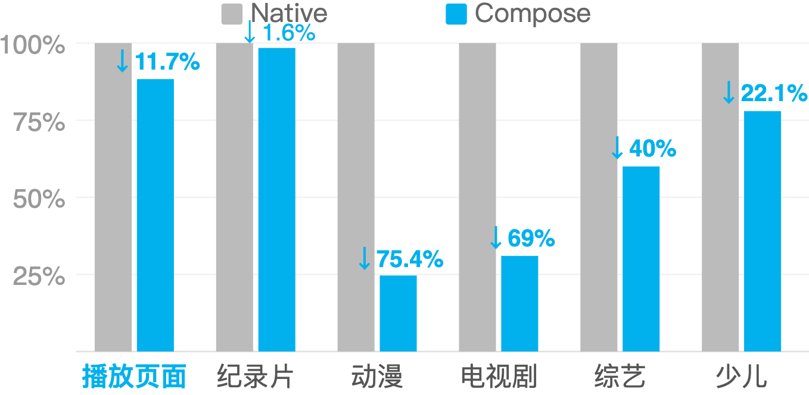

| 图表 | 关键读数（图中标注） | 可读结论 |
| :--- | :--- | :--- |
| 样本 A | 多业务场景下降约 11.2% ~ 25.3%，少儿场景不显著 | 常见页面下 Compose 路线具备稳定收益，但并非所有场景都显著 |
| 样本 B | 图中展示多个场景降幅约 1.6% ~ 75.4% | 收益与页面结构、组件复杂度、渲染路径选择强相关 |

#### 平台侧效果对比（PPT 补充）

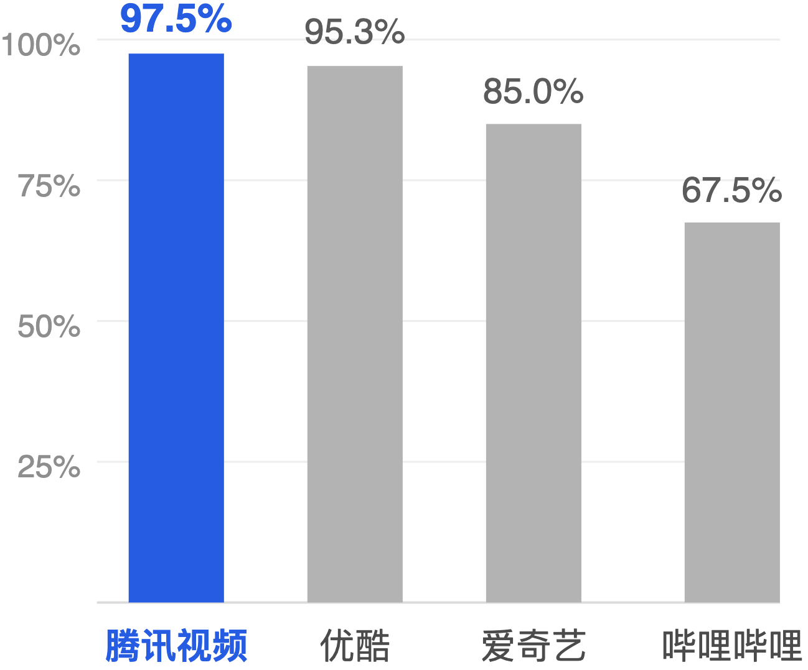

| 平台 | 图中指标 |
| :--- | :--- |
| 腾讯视频 | 97.5% |
| 优酷 | 95.3% |
| 爱奇艺 | 85.0% |
| 哔哩哔哩 | 67.5% |

#### 编译效率优化（PPT 补充）

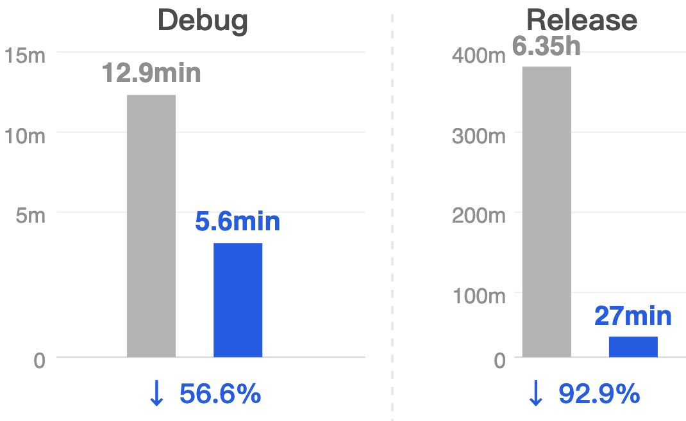

| 构建类型 | 优化前 | 优化后 | 降幅 |
| :--- | :--- | :--- | :--- |
| Debug | 12.9 min | 5.6 min | 56.6% |
| Release | 6.35 h | 27 min | 92.9% |

#### Kotlin IR 与 LLVM 优化链路（PPT 补充）

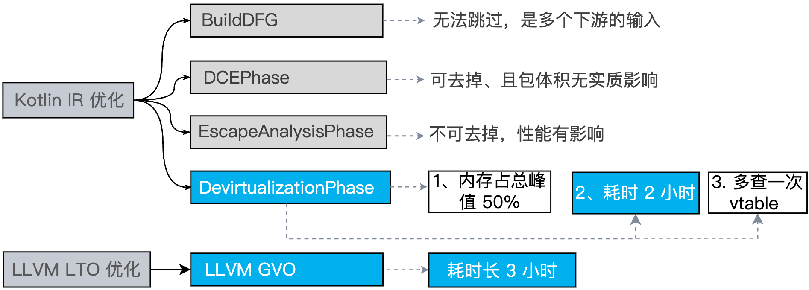

| 链路阶段 | 代表项（图中示意） | 目标 |
| :--- | :--- | :--- |
| Kotlin IR 阶段 | BuildDFG、DCEPhase、EscapeAnalysisPhase、DevirtualizationPhase | 提前消除无效路径并减少动态分派开销 |
| LLVM LTO 阶段 | LLVM GVO | 在链接期做全局优化，继续压缩运行时代价 |

#### 运行时热点与调用链证据（PPT 补充）

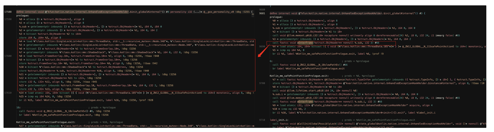

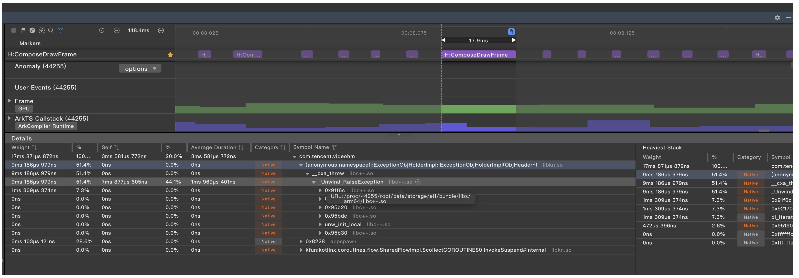

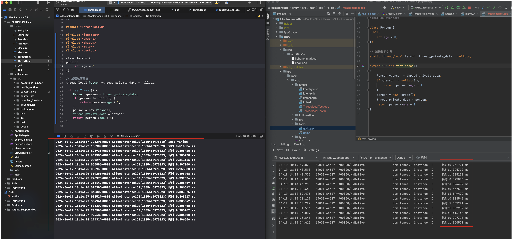

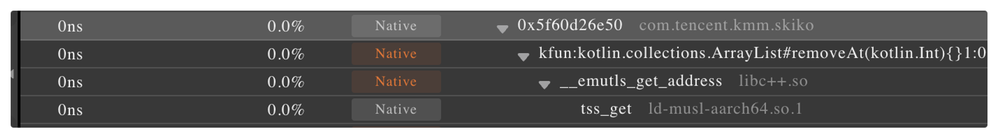

| 证据点 | 图中符号/读数 | 保守结论 |
| :--- | :--- | :--- |
| 帧预算压力 | `H:ComposeDrawFrame` 约 `17.9ms` | 在 60FPS（16.67ms）预算下，该阶段已接近或超过单帧预算，存在卡顿风险 |
| Native 异常路径 | `__cxa_throw`、`_Unwind_RaiseException` | 图中样本包含异常抛出/展开链路，应重点排查该路径触发频率与时机 |
| TLS/线程局部访问 | `thread_local`、`__emutls_get_address`、`tss_get` | 线程局部存取在热点路径中可见，建议结合采样频率评估其累计开销 |
| Kotlin 容器操作 | `kfun:kotlin.collections.ArrayList#removeAt(kotlin.Int){}` | 高频集合变更可能放大主线程负载，需结合具体场景确认是否可降频或批量化 |

> 说明：以上为腾讯视频分享材料中的现场截图解读 [5]，用于定位“可能热点”，并不等同于通用结论。

#### 首屏渲染速度

在页面首屏渲染（First Contentful Paint, FCP）方面，基于 Kotlin/Native 的 ovCompose 方案耗时约为 **122ms** [4]。这一数据在特定场景下优于传统的 JS 桥接方案，原因在于 Native 方案消除了 JS 引擎的冷启动开销和 Bridge 通信的序列化延迟。

#### 代码复用率

ovCompose 实现了 Android、iOS 和 HarmonyOS 三端代码的高度复用，逻辑层复用率达到 **90% 以上** [3]。这意味着开发者只需编写一次业务逻辑代码，即可在三端共享，仅需针对各平台的 UI 特性进行少量适配。这一复用率在 KMP 生态中处于领先水平，显著降低了多平台应用的开发和维护成本。

### 3.5 落地案例与生态

#### 腾讯视频鸿蒙版

腾讯视频是 ovCompose 在鸿蒙平台上最重要的落地案例。作为鸿蒙平台首个采用全跨端架构（ovCompose）落地的大型应用，腾讯视频鸿蒙版的适配历程具有标杆意义 [3]：

- **2024 年 7 月**：腾讯视频鸿蒙原生版本上线华为应用市场尝鲜专区。
- **2025 年 1 月 9 日**：腾讯视频鸿蒙原生正式版随微信鸿蒙正式版同步上架。
- **截至 2025 年 4 月**：鸿蒙版腾讯视频下载量突破 **190 万**。

在功能层面，腾讯视频鸿蒙版深度适配了华为的硬件生态，包括支持 Pura X 等折叠屏设备的双屏联动（内屏沉浸观影 + 外屏高频互动）、HDR Vivid 和 Audio Vivid 音画增强标准，以及与鸿蒙系统通知中心、实况窗等特性的深度融合 [3]。

#### KuiklyBase 基础设施

ovCompose 的底层基础设施 **KuiklyBase** 已在腾讯内部得到广泛应用。该组件库为 iOS、Android 和 HarmonyOS 提供统一的底层能力，包括网络请求、数据持久化、日志系统和性能监控等 [1](https://github.com/Tencent-TDS/KuiklyBase-kotlin)。目前，KuiklyBase 已在 QQ 浏览器、腾讯体育等 **10 余款**腾讯系应用中落地 [3]。

#### 腾讯系整体布局

腾讯内部组建了超过 **800 人**的专项团队负责鸿蒙原生适配。除腾讯视频外，包括微信、QQ、QQ 音乐、腾讯会议在内的超过 **60 款**腾讯系应用均已完成或正在进行鸿蒙原生化开发 [3]。ovCompose 作为这一战略的核心技术支撑，已于 **2025 年 6 月**正式开源，助力更广泛的开发者社区快速适配 HarmonyOS NEXT。

### 3.6 与其他方案对比

#### 与 iOS 迁移侧重点对比

| 维度 | iOS | 鸿蒙 |
| :--- | :--- | :--- |
| 官方支持状态 | CMP 官方支持 | 截至本文检索窗口官方未正式支持 [4] |
| 运行时路线 | Kotlin/Native | Kotlin/Native（目标平台与系统接入不同） |
| 渲染主线 | 官方 Skia 为基础，ovCompose 侧重混排增强（如 UIKit 模式） | 重点是把 Skia/Skiko 与鸿蒙图形栈整体打通 |
| 容器形态 | `UIView` / `CAMetalLayer` | `XComponent` + `NativeWindow` |
| 主要工程难点 | 深度混排、手势冲突与内存控制 | 平台层补齐（生命周期/事件/IME/帧调度） + 渲染上屏链路 |

#### 与 Flutter 鸿蒙适配的差异

Flutter 是另一个在鸿蒙适配方面走在前列的跨平台框架。将 ovCompose 与 Flutter 的鸿蒙方案进行对比，可以更清晰地理解两者的技术路线差异 [4]：

| 对比维度 | ovCompose (Compose Multiplatform) | Flutter |
| :--- | :--- | :--- |
| 开发语言 | Kotlin | Dart |
| 渲染引擎 | Skia（通过 Skiko 封装） | Skia / Impeller 双引擎 |
| 鸿蒙适配成熟度 | 企业级私有适配，已开源 | 官方发布适配 HarmonyOS NEXT (API 16) 版本 |
| 原生混排能力 | 三明治架构，XComponent 画布 | PlatformView 嵌入机制 |
| UI 一致性 | 与 Android/iOS Compose UI 像素级一致 | 与 Android/iOS Flutter UI 像素级一致 |
| 鸿蒙原生交互 | 通过 NAPI 桥接，部分依赖 ArkUI | 通过 Platform Channel 桥接 |
| 代码复用率 | 90%（逻辑层） | 接近 100%（UI + 逻辑） |

Flutter 在鸿蒙适配方面的优势在于其官方支持更为成熟——Flutter 已发布深度适配 HarmonyOS NEXT (API 16) 的版本，支持 Skia 和 Impeller 双渲染引擎 [4]。Impeller 引擎通过预编译 Metal Shader 和 DisplayList 损伤跟踪等机制，在 iOS 上已展现出优于传统 Skia 的性能表现，这些优化在鸿蒙平台上同样适用。

ovCompose 的差异化优势则体现在两个方面：一是与 Kotlin/Android 生态的深度整合，对于已有大量 Kotlin 代码积累的团队，迁移成本更低；二是其三明治架构在原生组件混排方面的灵活性，特别适合视频播放器等需要复杂层级管理的场景 [3]。

#### 与通用 KMP 方案的对比

对于不采用 ovCompose 的通用 KMP 项目，鸿蒙适配通常采用"KMP 业务逻辑 + ArkUI 原生界面"的混合模式 [4]。这种方案的优势在于能够获得最佳的鸿蒙原生交互体验，但代价是无法保证与 Android/iOS 端的 UI 一致性，且需要为鸿蒙单独编写 UI 代码，增加了维护成本。

ovCompose 则在 UI 一致性和开发效率之间取得了平衡——通过 Skia 渲染引擎确保三端 UI 的像素级一致，同时通过三明治架构保留了对原生组件的混排能力 [3]。

### 3.7 总结与展望

如果把全文收束成一句话：**ovCompose 的贡献，不是“提出一个新概念”，而是把 KMM/CMP 在鸿蒙与 iOS 的落地链路补成了可交付工程。**

对应到实践层面，可以记住三点：

1. **编译可达**：Kotlin/Native + LLVM 到鸿蒙产物的链路被验证可行；
2. **渲染可用**：Skia/Skiko 与平台容器对接后，复杂页面具备可运行与可优化空间；
3. **业务可落地**：在大体量应用中完成验证，说明方案不止停留在 demo。

后续随着官方生态推进，ovCompose 的价值会更偏向“工程经验与迁移范式”：给后来者一条少走弯路的实践路径。

### 3.8 参考文献

[1] [github.com - Tencent-TDS/ovCompose-multiplatform-core (2026-06-02)](https://github.com/Tencent-TDS/ovCompose-multiplatform-core)

[2] [csdn.net - ovCompose 跨平台 UI 框架技术解析 (2026-06-02)]（原引用经 Vertex 检索跳转，外网不可访问）

[3] [Google Vertex AI Search - ovCompose 鸿蒙 HarmonyOS 适配实现 (2026-06-02)]（Vertex 检索中间页，外网不可访问）

[4] [Google Vertex AI Search - Compose Multiplatform 鸿蒙渲染架构 (2026-06-02)]（Vertex 检索中间页，外网不可访问）

[5] 腾讯视频《KMP 跨 iOS、Ohos、Android 实践》分享资料（用户提供 PPT，2026-06-02）

[6] [ITPUB - 《Kuikly 鸿蒙版正式开源，揭秘卓越性能背后的技术适配之旅》](https://blog.itpub.net/70009402/viewspace-3086670/)（2026-06-02）

[7] [github.com - Tencent-TDS/KuiklyBase-kotlin 仓库主页](https://github.com/Tencent-TDS/KuiklyBase-kotlin)（2026-06-02）

---

## 4. 系列后续

原先放在本篇的 AIRead 体育实践案例，已拆分为独立文章：

- [KMM 在体育业务中的落地实践（AIRead）]()

这样你可以把本篇当作 **KMM 基础与平台适配篇**，把新篇当作 **业务实践与选型篇** 来阅读。

