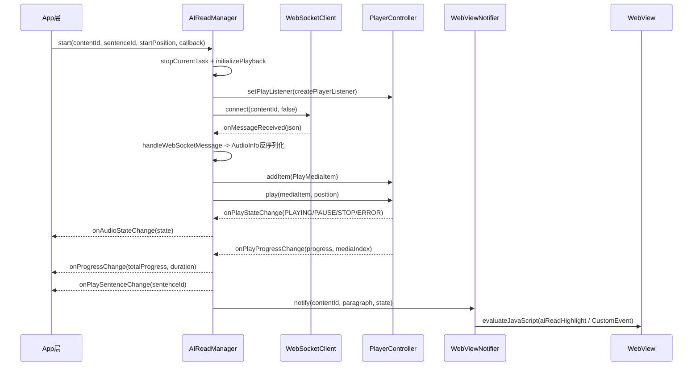

+++
date = '2026-06-02T20:30:00+08:00'
draft = true
title = 'AIRead：KMM 语音播报 SDK 工程实践拆解'
tags = ['KMM实践', 'Kotlin Multiplatform', '语音播报', 'WebSocket', 'ExoPlayer', 'AVPlayer']
categories = ['iOS 开发']
+++

## 0. 这篇写什么

这篇不再讲“概念正确性”，直接讲工程事实：

1. 仓库目录有哪些文件；
2. KMM 分层结构是什么；
3. 从 `start(contentId, sentenceId)` 到播放、高亮、回调、重连，代码是怎么跑起来的；
4. Android / iOS 两端各自做了什么。

KMM 基础与平台适配背景放在上一篇：[KMM 基础篇]()。

---

## 1. 仓库目录总览

AIRead 仓库根目录：

```text
AIRead/
├── androidApp/                # Android 示例应用（Compose + WebView）
├── iosApp/                    # iOS 示例应用（SwiftUI + WKWebView）
├── shared/                    # KMM SDK 主模块
├── gradle/                    # 版本目录、发布脚本、wrapper
├── build.gradle.kts
├── settings.gradle.kts
├── gradle.properties
└── README.md
```

`shared/src` 是核心：

```text
shared/src/
├── commonMain/kotlin/com/tencent/qqsports/airead/
│   ├── AIReadConfig.kt
│   ├── AIReadManager.kt
│   ├── data/
│   │   ├── AudioInfo.kt
│   │   ├── ParagraphInfo.kt
│   │   └── RetryConfig.kt
│   ├── player/
│   │   ├── PlayCallback.kt
│   │   ├── PlayMediaItem.kt
│   │   ├── PlayerController.kt
│   │   ├── PlayerListener.kt
│   │   └── PlayState.kt
│   ├── websocket/
│   │   └── WebSocketClient.kt
│   ├── webview/
│   │   ├── PlatformWebView.kt
│   │   ├── WebPosition.kt
│   │   └── WebViewNotifier.kt
│   ├── log/
│   │   ├── Logger.kt
│   │   └── LogUtil.kt
│   └── platform/
│       └── Platform.kt
├── androidMain/kotlin/com/tencent/qqsports/airead/
│   ├── AIReadInitConfig.kt
│   └── platform/
│       ├── Platform.android.kt
│       ├── AndroidPlayerController.kt
│       ├── AndroidPlayerControllerProxy.kt
│       ├── AndroidWebView.kt
│       └── AndroidLogger.kt
└── iosMain/kotlin/com/tencent/qqsports/airead/
    ├── AIReadInitConfig.kt
    ├── queuePlayer/
    │   ├── QueuePlayer.kt
    │   ├── QueuePlayerListener.kt
    │   ├── QueuePlayerNode.kt
    │   └── QueuePlayerState.kt
    └── platform/
        ├── Platform.ios.kt
        ├── IOSPlayerController.kt
        ├── IOSWebView.kt
        └── IOSLogger.kt
```

---

## 2. 模块结构：KMM 是怎么拆层的

### 2.1 commonMain：业务主脑

`commonMain` 放统一逻辑：

- 会话状态与控制入口：`AIReadManager.kt`
- 流式数据接收：`websocket/WebSocketClient.kt`
- 状态/进度/句子回调分发：`AIReadManager.kt`
- WebView 高亮通知：`webview/WebViewNotifier.kt`
- 重试策略与播放状态定义：`data/RetryConfig.kt`、`player/PlayState.kt`

### 2.2 androidMain / iosMain：平台实现

`commonMain` 通过 expect/actual 取平台播放器：

- expect 定义：`shared/src/commonMain/.../platform/Platform.kt`
- Android actual：`shared/src/androidMain/.../platform/Platform.android.kt`
- iOS actual：`shared/src/iosMain/.../platform/Platform.ios.kt`

Android 用 ExoPlayer：

- 核心实现：`AndroidPlayerController.kt`
- UI 线程代理：`AndroidPlayerControllerProxy.kt`

iOS 用 AVPlayer（队列封装）：

- 核心实现：`queuePlayer/QueuePlayer.kt`
- 控制器封装：`platform/IOSPlayerController.kt`

---

## 3. 构建与发布配置

`shared/build.gradle.kts` 显示这是标准 KMP 双端产物：

- 目标：`android + iosX64 + iosArm64 + iosSimulatorArm64`
- Android 发布 artifact：`airead`
- iOS Cocoapods：`name = "AIRead"`，`baseName = "AIRead"`
- 依赖：
  - common：Ktor client/websocket/logging + kotlinx serialization
  - Android：`androidx.media3:media3-exoplayer`
  - iOS：Ktor Darwin + `AIReadKVOHelper` pod

见：`/Users/jiangzhenhua/Tencent/AIRead/shared/build.gradle.kts`

另外：

- iOS Pod 入口：`shared/AIRead.podspec`
- iOS 示例 Podfile：`iosApp/Podfile`
- 版本目录：`gradle/libs.versions.toml`

---

## 4. 对外 API（代码级）

### 4.1 初始化

Android：

```kotlin
AIReadInitConfig.init(
    context,
    wsUrl,
    params,
    retryConfig,
    needTriggerScroll
)
```

定义位置：`shared/src/androidMain/kotlin/com/tencent/qqsports/airead/AIReadInitConfig.kt`

iOS：

```kotlin
AIReadInitConfig.init(wsUrl, params, retryConfig, needTriggerScroll)
```

定义位置：`shared/src/iosMain/kotlin/com/tencent/qqsports/airead/AIReadInitConfig.kt`

### 4.2 核心控制

```kotlin
AIReadManager.start(contentId, sentenceId, startPosition, callback)
AIReadManager.pause()
AIReadManager.resume()
AIReadManager.seekTo(positionMillis)
AIReadManager.seekTo(sentenceId)
AIReadManager.attachWebView(webView)
AIReadManager.detachWebView()
AIReadManager.release()
```

定义位置：`shared/src/commonMain/kotlin/com/tencent/qqsports/airead/AIReadManager.kt`

### 4.3 状态与重试

播放状态：`IDLE / BUFFER / PLAYING / STOP / PAUSE / ERROR`

定义位置：`shared/src/commonMain/kotlin/com/tencent/qqsports/airead/player/PlayState.kt`

重试策略：

- 次数：`times`（默认 3）
- 延迟模式：`FIXED / MULTIPLICATION`
- 延迟时长：`delayTimeMillis`（默认 5000ms）
- 连接超时：`timeout`（默认 60000ms）

定义位置：`shared/src/commonMain/kotlin/com/tencent/qqsports/airead/data/RetryConfig.kt`

---

## 5. “怎么做的”：端到端执行链路

下面是代码里真实执行顺序（以 Android 路径举例，iOS 同构）：



### 5.1 关键步骤对应代码

1. `start()` 入口：`AIReadManager.kt`（`start`）
2. 重置旧任务：`AIReadManager.kt`（`stopCurrentTask`）
3. 建立 WS 连接：`AIReadManager.kt`（`connectWebSocket`）→ `WebSocketClient.kt`（`connect/receivedData`）
4. 收到 JSON：`AIReadManager.kt`（`handleWebSocketMessage`）
5. 加入播放队列：`AIReadManager.kt`（`addItem`）
6. 按 `sentenceId`/`startPosition` 定位播放点：`AIReadManager.kt`（`play`）
7. 句子切换检测：`AIReadManager.kt`（`checkSentenceChange/findTargetSentenceId`）
8. 进度汇总（多段音频累计）：`AIReadManager.kt`（`checkProcessChange`）
9. WebView 高亮同步：`WebViewNotifier.kt`（`notify`）
10. 异常重连：`WebSocketClient.kt`（`reconnectWithException`）

### 5.2 WebSocket 完结信号

`WebSocketClient` 里把 `{"isEnd":true}` 作为“数据接收完成”标志；如果未完成且异常，则走重连。

定义位置：`shared/src/commonMain/kotlin/com/tencent/qqsports/airead/websocket/WebSocketClient.kt`

---

## 6. 平台实现细节

### 6.1 Android：ExoPlayer + 主线程进度轮询

`AndroidPlayerController.kt` 关键点：

- 用 `ExoPlayer.Builder(context).setLooper(Looper.getMainLooper())` 初始化；
- `onIsPlayingChanged` 映射到 `PlayState.PLAYING/PAUSE`；
- `Handler(Looper.getMainLooper())` 每秒上报一次进度；
- `play(mediaItem, position)` 通过 `mediaId` 找索引并 `seekTo(index, position)`。

再由 `AndroidPlayerControllerProxy.kt` 保证调用回到 UI 线程。

### 6.2 iOS：AVPlayer 队列 + KVO

`QueuePlayer.kt` 关键点：

- 用链表维护播放队列：`headNode/tailNode/currentNode`；
- `addPeriodicTimeObserverForInterval` 做进度回调；
- 监听 `AVPlayerItemDidPlayToEndTimeNotification` 做自动切段；
- 通过 `AIReadKVOHelper` 监听 `currentItem.status`，失败态映射到 `ERROR`。

`IOSPlayerController.kt` 负责把 `QueuePlayerState` 映射成统一 `PlayState`。

### 6.3 WebView 联动

`WebViewNotifier.kt` 有两种前端通知模式：

1. `window.aiReadHighlight(...)`
2. `window.dispatchEvent(new CustomEvent("airead.syncSentenceInfo", ...))`

开关来自 `AIReadConfig.isNeedTriggerScroll()`。

---

## 7. 示例工程怎么接入

### 7.1 Android 示例（androidApp）

- 初始化（`AudioApp.kt`）：

```kotlin
AIReadInitConfig.init(this, "wss://app.sports.qq.com/content/voice", null)
```

- 播放（`AudioViewModel.kt`）：

```kotlin
AIReadManager.start(contentId = contentId, sentenceId = "2", callback = object : PlayCallback { ... })
```

- WebView 绑定（`AudioWebView.kt`）：

```kotlin
AIReadManager.attachWebView(AndroidWebView(webView))
```

### 7.2 iOS 示例（iosApp）

- 初始化（`AudioViewModel.swift`）：

```swift
AIReadInitConfig.shared.doInit(wsUrl: "wss://preapp.sports.qq.com/content/voice")
```

- 播放：

```swift
AIReadManager.shared.start(contentId: contentID, sentenceId: nil, startPosition: nil, callback: self)
```

- WebView 绑定：

```swift
AIReadManager.shared.attachWebView(webView: IOSWebView(webView: webView))
```

---

## 8. 关键文件拆读（按阅读顺序）

这一节不讲概念，直接按“读代码最短路径”拆 5 个关键文件。

### 8.1 `AIReadManager.kt`：总调度 + 业务状态机

文件：`shared/src/commonMain/kotlin/com/tencent/qqsports/airead/AIReadManager.kt`

建议重点看这些方法：

1. `start(...)`：统一入口，串起 `stopCurrentTask -> initializePlayback -> initializePlayer -> connectWebSocket`。
2. `handleWebSocketMessage(...)`：把 WS 文本反序列化为 `AudioInfo`，去重后入队并触发播放。
3. `play(audioInfo)`：处理三种起播路径（从头播 / sentenceId 定位 / startPosition 定位）。
4. `checkSentenceChange(...)` + `findTargetSentenceId(...)`：根据播放进度推导当前句子并回调。
5. `checkProcessChange(...)`：按多段音频累计总进度，回调 `onProgressChange`。
6. `resume()`：恢复播放时补做 WS 重连（连接已断且数据未收完时）。

读完这个文件，你会拿到完整“控制平面”。

### 8.2 `WebSocketClient.kt`：数据平面（流式接收与重连）

文件：`shared/src/commonMain/kotlin/com/tencent/qqsports/airead/websocket/WebSocketClient.kt`

建议重点看：

1. `connect(contentId, isReconnect)`：重连入口。
2. `receivedData(...)`：真正消费 WS incoming frame，分发消息给 `AIReadManager`。
3. `reconnectWithException(...)`：失败后的重试分支。
4. `RetryConfig.getTotalDelayTime(...)`（在 `RetryConfig.kt`）：控制固定/线性递增延迟。

实现里有一个关键协议约定：`{"isEnd":true}` 表示流式数据接收完成。

### 8.3 `AndroidPlayerController.kt` + `AndroidPlayerControllerProxy.kt`：Android 播放执行器

文件：

- `shared/src/androidMain/kotlin/com/tencent/qqsports/airead/platform/AndroidPlayerController.kt`
- `shared/src/androidMain/kotlin/com/tencent/qqsports/airead/platform/AndroidPlayerControllerProxy.kt`

建议重点看：

1. `setPlayListener(...)`：把 ExoPlayer 状态映射到统一 `PlayState`。
2. `addItem(...)`：动态加 `MediaItem` 并在 `IDLE/ENDED` 时 prepare。
3. `play(mediaItem, position)`：通过 `mediaId` 查索引并 seek。
4. `updateProgressState()` + `Handler`：每秒进度轮询。
5. Proxy 的 `runOnUiThread(...)`：保证控制调用在主线程执行。

### 8.4 `QueuePlayer.kt` + `IOSPlayerController.kt`：iOS 播放执行器

文件：

- `shared/src/iosMain/kotlin/com/tencent/qqsports/airead/queuePlayer/QueuePlayer.kt`
- `shared/src/iosMain/kotlin/com/tencent/qqsports/airead/platform/IOSPlayerController.kt`

建议重点看：

1. `QueuePlayer.addItem(...)`：链表化队列组织。
2. `queuePlayerPlay(...)`：按节点播放、seek、错误恢复。
3. `didPlayToEnd(...)`：切到 nextNode 自动续播。
4. `didReceiveObjChange(...)`：通过 KVO 捕捉失败态并上抛 ERROR。
5. `IOSPlayerController`：把 `QueuePlayerState` 统一映射成 `PlayState`。

### 8.5 `WebViewNotifier.kt`：句子高亮桥接层

文件：`shared/src/commonMain/kotlin/com/tencent/qqsports/airead/webview/WebViewNotifier.kt`

建议重点看：

1. `notify(...)`：把 `ParagraphInfoDetail` 序列化为 JSON 注入 JS。
2. 两种前端协议：`window.aiReadHighlight(...)` 与 `CustomEvent("airead.syncSentenceInfo")`。
3. `evaluateJavaScript` 回调 `position` 后的 `scrollToPosition(...)` 调用链。

### 8.6 推荐阅读顺序（30 分钟）

1. 先读 `AIReadManager.kt`（抓主流程）。
2. 再读 `WebSocketClient.kt`（抓数据流与重连）。
3. 再读 Android 或 iOS 播放器其一（抓平台执行细节）。
4. 最后看 `WebViewNotifier.kt`（抓 UI 联动闭环）。

---

## 9. 当前实现里我认为最关键的三个点

1. **状态机集中在 commonMain**：回调语义统一，双端不需要各写一套业务状态机。  
2. **播放器完全平台化**：Android 走 ExoPlayer，iOS 走 AVPlayer，但都透出 `PlayerController`。  
3. **文本高亮与播放状态绑定**：SDK 不只“播声音”，还把句子状态同步给 WebView，形成完整体验链路。

---

## 10. Debug 手册（基于 `kotlin_debug` 工具）

这里补充一套可直接落地的 Kotlin/Native 调试流程，工具目录在：

- `content/posts/KMM/kotlin_debug`

该目录包含 4 个脚本：

- `xc_kt_install.sh`
- `xc_kt_install.py`
- `konan_lldb.py`
- `deleteKotlinVersionFromMaven.py.py`

### 10.1 先装调试插件（xcode-kotlin）

目的：让 Xcode + LLDB 能更好识别 Kotlin/Native 对象。

可选两种方式：

```bash
# 方式1：shell
bash content/posts/KMM/kotlin_debug/xc_kt_install.sh

# 方式2：python
python3 content/posts/KMM/kotlin_debug/xc_kt_install.py
```

脚本实际做了三件事：

1. 检查并安装 `brew xcode-kotlin`；
2. 执行 `xcode-kotlin install` 安装 XC 插件；
3. 扫描 `/Applications/Xcode*` 并逐个执行 `xcode-kotlin sync <XcodeAppPath>`。

对应实现可看：

- `content/posts/KMM/kotlin_debug/xc_kt_install.sh:7`
- `content/posts/KMM/kotlin_debug/xc_kt_install.sh:27`
- `content/posts/KMM/kotlin_debug/xc_kt_install.sh:62`
- `content/posts/KMM/kotlin_debug/xc_kt_install.py:18`
- `content/posts/KMM/kotlin_debug/xc_kt_install.py:54`
- `content/posts/KMM/kotlin_debug/xc_kt_install.py:98`

> 注意：脚本检测到 `Xcode is running` 会直接失败，先关 Xcode 再执行。

### 10.2 在 LLDB 导入 Kotlin synthetic provider

核心脚本是 `konan_lldb.py`，它会给 `ObjHeader *` 注册 summary/synthetic provider，让 Kotlin 对象不再只显示裸指针。

在 LLDB 里执行：

```lldb
command script import /Users/jiangzhenhua/Github/last-stand/content/posts/KMM/kotlin_debug/konan_lldb.py
```

脚本初始化时会做这些事：

- 注册 `type summary add ... konan_lldb.kotlin_object_type_summary "ObjHeader *"`；
- 注册 `type synthetic add ... konan_lldb.KonanProxyTypeProvider "ObjHeader *"`；
- 启用 `Kotlin` type category；
- 增加自定义命令：`type_name`、`type_by_address`、`symbol_by_name`。

对应实现：`content/posts/KMM/kotlin_debug/konan_lldb.py:1067`。

此外脚本会写调试日志到：

- `~/konan_lldb_log.txt`

见：`content/posts/KMM/kotlin_debug/konan_lldb.py:1069`。

### 10.3 结合 AIRead 的实战调试路径

建议按下面顺序调试（iOS 侧最有价值）：

1. 在 `AIReadManager.start`、`handleWebSocketMessage`、`play` 打断点；
2. 在 `QueuePlayer.queuePlayerPlay`、`didPlayToEnd`、`didReceiveObjChange` 打断点；
3. 命中断点后，用 LLDB 查看 Kotlin 对象摘要（脚本已接管 `ObjHeader *` 显示）；
4. 用 `symbol_by_name` 查 Kotlin 符号，用 `type_name` 看地址对应类型。

建议优先断点位置：

- `shared/src/commonMain/kotlin/com/tencent/qqsports/airead/AIReadManager.kt:61`
- `shared/src/commonMain/kotlin/com/tencent/qqsports/airead/AIReadManager.kt:273`
- `shared/src/commonMain/kotlin/com/tencent/qqsports/airead/AIReadManager.kt:299`
- `shared/src/iosMain/kotlin/com/tencent/qqsports/airead/queuePlayer/QueuePlayer.kt:141`
- `shared/src/iosMain/kotlin/com/tencent/qqsports/airead/queuePlayer/QueuePlayer.kt:83`
- `shared/src/iosMain/kotlin/com/tencent/qqsports/airead/queuePlayer/QueuePlayer.kt:279`

### 10.4 常见故障与排查

1. **插件安装总失败**
   - 先确认 Xcode 关闭；
   - 再单独跑 `xcode-kotlin info` 看是否仍是 `Plugin not installed`。

2. **对象仍显示指针，没摘要**
   - 确认 LLDB 已执行 `command script import .../konan_lldb.py`；
   - 确认当前对象类型是 `ObjHeader *`（脚本主要接管这个类型）。

3. **脚本跑了但结果不稳定**
   - `konan_lldb.py` 里有缓存字典；可重新 import 脚本并重启调试会话；
   - 看 `~/konan_lldb_log.txt` 里 `Konan_Debug...` 调用链是否异常。

4. **脚本执行方式问题**
   - `xc_kt_install.sh` 首行是全角感叹号（`#！/bin/bash`），直接可执行可能失败；
   - 建议显式 `bash xc_kt_install.sh`。

### 10.5 `deleteKotlinVersionFromMaven.py.py` 的用途

这个脚本不是运行时调试工具，而是“仓库清理工具”：

- 通过 mirrors API 枚举 `tmm-snapshot/org/jetbrains/kotlin` 工件；
- 按 `versions = [...]` 删除指定 Kotlin 版本节点。

对应实现：

- `content/posts/KMM/kotlin_debug/deleteKotlinVersionFromMaven.py.py:58`
- `content/posts/KMM/kotlin_debug/deleteKotlinVersionFromMaven.py.py:75`
- `content/posts/KMM/kotlin_debug/deleteKotlinVersionFromMaven.py.py:104`

这一步只建议给维护私有 Maven 仓库的人使用，不建议作为业务排障常规动作。

### 10.6 Debug 原理补充（从主工程视角）

SDK 集成到 iOS 主工程后，断点能不能“进 Kotlin”，核心取决于三件事：

1. **有没有 Kotlin 符号与调试信息**
   - 集成方式如果是源码 Pod（`pod 'AIRead', :git => ...` 或 `:path`），通常更容易拿到可追踪符号；
   - 如果是纯二进制分发，常见情况是只能做符号级/汇编级排查，源码断点能力受限。

2. **LLDB 是否加载了 Kotlin 对象可视化脚本**
   - `konan_lldb.py` 负责把 `ObjHeader *` 从“裸地址”转换成可读对象摘要；
   - 没加载脚本时，经常看到的是指针地址，不是字段内容。

3. **Xcode-kotlin 插件是否与本机 Xcode 版本同步**
   - 插件安装后还需要 `xcode-kotlin sync /Applications/Xcode*.app`；
   - 换 Xcode 版本后如果没同步，调试体验会明显退化。

### 10.7 SDK 集成到 iOS 主工程后的断点调试步骤

下面按“可直接执行”的顺序给步骤。

#### Step 1：主工程 Pod 集成（确认是可调试集成）

```ruby
pod 'AIRead', :git => 'https://git.woa.com/QQSports_iOS/AIRead.git', :tag => '0.1.2-SNAPSHOT'
```

示例来源：`/Users/jiangzhenhua/Tencent/AIRead/README.md:23`

> 若使用本地联调，也可 `:path` 指向本地 SDK 目录，便于直接改 SDK 源码并断点。

#### Step 2：安装并同步 xcode-kotlin（一次性 + 版本变更后重做）

```bash
bash content/posts/KMM/kotlin_debug/xc_kt_install.sh
# 或
python3 content/posts/KMM/kotlin_debug/xc_kt_install.py
```

脚本会检测并安装 brew 包、安装插件、同步全部 Xcode。见：

- `content/posts/KMM/kotlin_debug/xc_kt_install.sh:7`
- `content/posts/KMM/kotlin_debug/xc_kt_install.sh:27`
- `content/posts/KMM/kotlin_debug/xc_kt_install.sh:62`

#### Step 3：在主工程调试会话里加载 LLDB 脚本

在 Xcode 启动调试后（LLDB 控制台）执行：

```lldb
command script import /Users/jiangzhenhua/Github/last-stand/content/posts/KMM/kotlin_debug/konan_lldb.py
```

可选：把这条放进 `~/.lldbinit`，避免每次手工输入。

#### Step 4：在“调用点 + SDK 核心链路”双点位下断

主工程调用点（Swift）：

- `AIReadManager.shared.start(...)`
- `AIReadManager.shared.pause()/resume()/release()`

SDK 核心链路（Kotlin，优先这几处）：

- `shared/src/commonMain/kotlin/com/tencent/qqsports/airead/AIReadManager.kt:61`（start）
- `shared/src/commonMain/kotlin/com/tencent/qqsports/airead/AIReadManager.kt:273`（WS 消息处理）
- `shared/src/commonMain/kotlin/com/tencent/qqsports/airead/AIReadManager.kt:299`（起播定位）
- `shared/src/iosMain/kotlin/com/tencent/qqsports/airead/queuePlayer/QueuePlayer.kt:141`（queuePlayerPlay）
- `shared/src/iosMain/kotlin/com/tencent/qqsports/airead/queuePlayer/QueuePlayer.kt:83`（didPlayToEnd）

这样能同时看到：业务触发 -> SDK 状态机 -> iOS 播放器执行。

#### Step 5：断点命中后如何看对象

- 直接 `po/expr` 看 Swift 入参；
- 对 Kotlin 对象，用脚本提供的 summary/synthetic 展示；
- 辅助命令：

```lldb
symbol_by_name kfun:.*AIReadManager.*
type_name <address>
```

命令注册位置：`content/posts/KMM/kotlin_debug/konan_lldb.py:1099`。

#### Step 6：无法命中 Kotlin 断点时的排查顺序

1. 确认不是 Release 配置在跑（先用 Debug）；
2. 确认插件已安装且 sync 过当前 Xcode；
3. 确认 LLDB 已 import `konan_lldb.py`；
4. 确认当前集成方式不是“无源码的纯二进制”；
5. 退化方案：先在 Swift 调用点断，再用 `symbol_by_name` + 地址级别排查。

### 10.8 推荐的主工程调试基线

- 每次 Xcode 升级后重新执行一次 `xcode-kotlin sync`；
- 团队统一一份 `.lldbinit`（自动 import `konan_lldb.py`）；
- 关键链路固定断点模板：`start -> handleWebSocketMessage -> queuePlayerPlay`；
- 出现“对象只显示指针”时，第一优先检查 LLDB 脚本是否成功加载。

---

## 11. 目前代码可见的改进点

1. `AndroidWebView.scrollToPosition()` 与 `IOSWebView.scrollToPosition()` 目前是空实现，`WebViewNotifier` 虽然回调了 `scrollTop`，但端侧没真正滚动。  
2. Android 示例里 `AudioPlayerUiState.equals()` 固定返回 `false`，会造成状态比较异常（示例工程问题，不是 SDK 核心链路问题）。  
3. `WebSocketClient` 的完成标志依赖固定消息 `{"isEnd":true}`，协议层建议再加版本/类型字段约束，降低歧义。

---

## 12. 结论

AIRead 这套实现不是“只把 KMM 用起来”，而是完整打通了：

- 流式数据接收（WebSocket）
- 跨端播放控制（ExoPlayer / AVPlayer）
- 统一状态回调（PlayState + Progress + SentenceId）
- WebView 文本联动（JS 注入/事件分发）

一句话：**它是一个可运行、可接入、可扩展的 KMM 音频播报 SDK，而不只是一个 demo。**

---

## 13. 参考文件

- `/Users/jiangzhenhua/Tencent/AIRead/README.md`
- `/Users/jiangzhenhua/Tencent/AIRead/shared/src/commonMain/kotlin/com/tencent/qqsports/airead/AIReadManager.kt`
- `/Users/jiangzhenhua/Tencent/AIRead/shared/src/commonMain/kotlin/com/tencent/qqsports/airead/websocket/WebSocketClient.kt`
- `/Users/jiangzhenhua/Tencent/AIRead/shared/src/androidMain/kotlin/com/tencent/qqsports/airead/platform/AndroidPlayerController.kt`
- `/Users/jiangzhenhua/Tencent/AIRead/shared/src/iosMain/kotlin/com/tencent/qqsports/airead/queuePlayer/QueuePlayer.kt`
- `/Users/jiangzhenhua/Tencent/AIRead/shared/build.gradle.kts`
