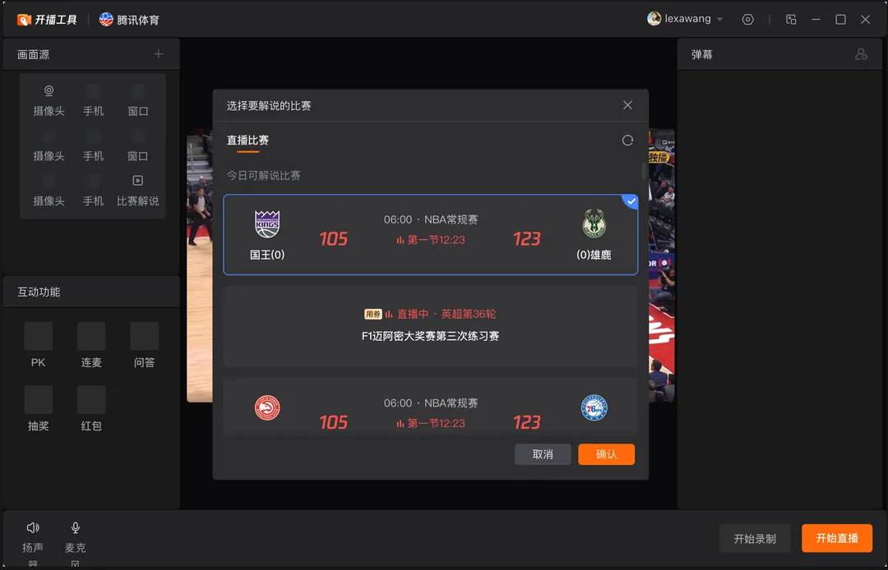
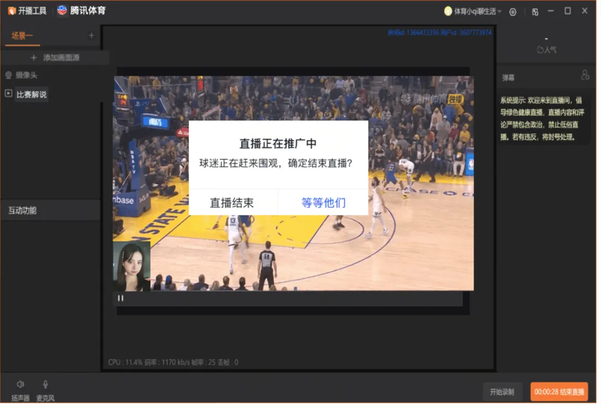

+++
date = '2026-06-01T12:00:21+08:00'
draft = true
title = 'PCHelper'
tags = ['Electron', 'Typescript', 'OBS', 'NodeJS']
categories = ['前端开发']
+++

## 背景介绍

腾讯体育的个人直播业务中，主播开启比赛陪看直播一直仅支持移动端开播。然而，移动端开播存在屏幕尺寸过小、摄像头拍摄角度受限等问题，严重影响了主播的解说体验。为了提升主播在比赛解说场景下的使用体验，同时降低使用 OBS 进行运营的人力成本，我们决定在腾讯视频 PC 开播助手的基础上进行迭代开发，新增对腾讯体育比赛陪看功能的支持。

选择陪看比赛界面：


陪看解说画面：


从零开发一款 PC 开播软件的成本较高。幸运的是，腾讯视频已经拥有一款成熟的 PC 开播助手，用于支持主播或艺人在 PC 端进行直播。虽然当时该产品尚不支持陪看直播功能，但我们可以在其基础上进行二次开发：接入腾讯体育的账号体系，并新增比赛陪看能力，从而以最小的开发成本实现业务需求。

## 整体架构概览

腾讯视频 PC 开播助手基于 Electron 框架开发，推流等核心功能则依赖 OBS Node（obs-studio-node）实现，前端部分采用 Vue.js 技术栈。

OBS Studio 是一款知名的开源直播与录屏工具，其客户端使用 Qt 框架绘制界面。OBS Node 是将 OBS Studio 的核心功能模块进行封装，使其能够被 Node.js 直接调用的扩展库。

OBS 原生支持多种推流协议，但腾讯视频直播中台采用的是 TRTC（Tencent Real-Time Communication）协议。在此基础上，视频 PC 开播助手对 OBS Node 进行了以下扩展：

1. **TRTC 协议支持**：实现基于 TRTC 的推流和连麦功能；
2. **移动设备开播支持**：支持使用手机等移动设备作为视频源进行开播。

整体技术架构如下图所示：

<div style="border:1px solid #334155;border-radius:12px;padding:14px 16px;background:rgba(15,23,42,0.35);margin:12px auto;max-width:920px;color:#e2e8f0;">
  <div style="font-weight:700;font-size:15px;margin-bottom:10px;color:#e2e8f0;">图 1｜整体技术架构</div>

  <div style="display:flex;flex-wrap:wrap;align-items:center;gap:8px;margin-bottom:10px;">
    <div style="border:1px solid #60a5fa;border-radius:8px;padding:6px 10px;min-width:150px;text-align:center;background:rgba(96,165,250,0.12);color:#dbeafe;">Renderer 进程<br/>Vue UI</div>
    <div style="font-weight:700;color:#60a5fa;">⇄ IPC ⇄</div>
    <div style="border:1px solid #60a5fa;border-radius:8px;padding:6px 10px;min-width:150px;text-align:center;background:rgba(96,165,250,0.12);color:#dbeafe;">Main 进程<br/>Node + Native</div>
    <div style="font-weight:700;color:#60a5fa;">→</div>
    <div style="border:1px solid #60a5fa;border-radius:8px;padding:6px 10px;min-width:120px;text-align:center;background:rgba(96,165,250,0.12);color:#dbeafe;">OBS Node</div>
    <div style="font-weight:700;color:#60a5fa;">+</div>
    <div style="border:1px solid #60a5fa;border-radius:8px;padding:6px 10px;min-width:120px;text-align:center;background:rgba(96,165,250,0.12);color:#dbeafe;">TRTC SDK</div>
  </div>

  <div style="display:flex;flex-wrap:wrap;align-items:center;gap:8px;margin-bottom:10px;">
    <div style="border:1px dashed #94a3b8;border-radius:8px;padding:6px 10px;background:rgba(148,163,184,0.10);color:#cbd5e1;">腾讯体育后台服务（账号/房间/陪看控制）</div>
    <div style="color:#94a3b8;">→ Main 进程</div>
    <div style="border:1px dashed #94a3b8;border-radius:8px;padding:6px 10px;background:rgba(148,163,184,0.10);color:#cbd5e1;">虚拟主播（比赛点播转直播）</div>
    <div style="color:#94a3b8;">→ TRTC SDK</div>
  </div>

  <div style="display:flex;flex-wrap:wrap;align-items:center;gap:8px;">
    <div style="border:1px solid #22d3ee;border-radius:8px;padding:6px 10px;background:rgba(34,211,238,0.12);color:#cffafe;">主播推流</div>
    <div style="color:#22d3ee;font-weight:700;">→</div>
    <div style="border:1px solid #22d3ee;border-radius:8px;padding:6px 10px;background:rgba(34,211,238,0.12);color:#cffafe;">TRTC 云端混流</div>
    <div style="color:#22d3ee;font-weight:700;">→</div>
    <div style="border:1px solid #22d3ee;border-radius:8px;padding:6px 10px;background:rgba(34,211,238,0.12);color:#cffafe;">观众端</div>
  </div>
</div>

### 多房间架构设计（SubRoom）

陪看场景最大的技术约束是：主播需要同时处于**主直播间**和**虚拟陪看房间**。为此我们在 TRTC 单房间模型之上封装了 `ITRTCSubRoom`，并通过 `SubRoomService` 统一管理子房间生命周期。

<div style="border:1px solid #334155;border-radius:12px;padding:14px 16px;background:rgba(15,23,42,0.35);margin:12px auto;max-width:920px;color:#e2e8f0;">
  <div style="font-weight:700;font-size:15px;margin-bottom:10px;color:#e2e8f0;">图 2｜多房间架构（SubRoom）</div>

  <div style="display:flex;flex-wrap:wrap;align-items:center;gap:8px;margin-bottom:8px;">
    <div style="border:1px solid #60a5fa;border-radius:8px;padding:6px 10px;background:rgba(96,165,250,0.12);color:#dbeafe;">主播客户端</div>
    <div style="color:#60a5fa;font-weight:700;">→</div>
    <div style="border:1px solid #60a5fa;border-radius:8px;padding:6px 10px;background:rgba(96,165,250,0.12);color:#dbeafe;">主直播间</div>
    <div style="color:#60a5fa;font-weight:700;">→</div>
    <div style="border:1px solid #60a5fa;border-radius:8px;padding:6px 10px;background:rgba(96,165,250,0.12);color:#dbeafe;">观众观看主流</div>
  </div>

  <div style="display:flex;flex-wrap:wrap;align-items:center;gap:8px;margin-bottom:8px;">
    <div style="border:1px solid #22d3ee;border-radius:8px;padding:6px 10px;background:rgba(34,211,238,0.12);color:#cffafe;">主播客户端</div>
    <div style="color:#22d3ee;font-weight:700;">→</div>
    <div style="border:1px solid #22d3ee;border-radius:8px;padding:6px 10px;background:rgba(34,211,238,0.12);color:#cffafe;">SubRoom 子房间</div>
    <div style="color:#22d3ee;font-weight:700;">→</div>
    <div style="border:1px solid #22d3ee;border-radius:8px;padding:6px 10px;background:rgba(34,211,238,0.12);color:#cffafe;">主播端本地预览</div>
  </div>

  <div style="display:flex;flex-wrap:wrap;align-items:center;gap:8px;margin-bottom:8px;">
    <div style="border:1px dashed #94a3b8;border-radius:8px;padding:6px 10px;background:rgba(148,163,184,0.10);color:#cbd5e1;">LinkMicV2Service</div>
    <div style="color:#94a3b8;">→</div>
    <div style="border:1px dashed #94a3b8;border-radius:8px;padding:6px 10px;background:rgba(148,163,184,0.10);color:#cbd5e1;">SubRoomService</div>
    <div style="color:#94a3b8;">→</div>
    <div style="border:1px dashed #94a3b8;border-radius:8px;padding:6px 10px;background:rgba(148,163,184,0.10);color:#cbd5e1;">ITRTCSubRoom</div>
    <div style="color:#94a3b8;">→</div>
    <div style="border:1px dashed #94a3b8;border-radius:8px;padding:6px 10px;background:rgba(148,163,184,0.10);color:#cbd5e1;">SubRoom 子房间</div>
  </div>

  <div style="display:flex;flex-wrap:wrap;align-items:center;gap:8px;">
    <div style="border:1px dashed #94a3b8;border-radius:8px;padding:6px 10px;background:rgba(148,163,184,0.10);color:#cbd5e1;">虚拟主播（比赛点播转直播）</div>
    <div style="color:#94a3b8;">→ SubRoom 子房间</div>
  </div>
</div>

该能力对应一套分层设计：

| 层次 | 模块 | 职责 |
|---|---|---|
| API 层 | `StartAccompany` / `StopAccompany` | 与后台交互、发起/结束陪看 |
| 服务层 | `LinkMicV2Service` | 业务编排 |
| 能力层 | `SubRoomService` | 子房间实例管理 |
| 底层 | `ITRTCSubRoom` | TRTC SDK 能力封装 |

## OBS Node 改造：支持 TRTC 推流

### OBS Node 推流流程概览

由于所有开播相关的操作都通过 OBS Node 完成，我们首先需要了解其基本工作流程：

<div style="border:1px solid #334155;border-radius:12px;padding:14px 16px;background:rgba(15,23,42,0.35);margin:12px auto;max-width:920px;color:#e2e8f0;">
  <div style="font-weight:700;font-size:15px;margin-bottom:10px;color:#e2e8f0;">图 3｜OBS Node 推流流程</div>
  <div style="display:flex;flex-wrap:wrap;align-items:center;gap:8px;line-height:1.8;">
    <span style="border:1px solid #60a5fa;border-radius:8px;padding:6px 10px;background:rgba(96,165,250,0.12);color:#dbeafe;">1. 加载 obs-studio-node</span>
    <span style="color:#60a5fa;">→</span>
    <span style="border:1px solid #60a5fa;border-radius:8px;padding:6px 10px;background:rgba(96,165,250,0.12);color:#dbeafe;">2. 创建输入源</span>
    <span style="color:#60a5fa;">→</span>
    <span style="border:1px solid #60a5fa;border-radius:8px;padding:6px 10px;background:rgba(96,165,250,0.12);color:#dbeafe;">3. 创建场景</span>
    <span style="color:#60a5fa;">→</span>
    <span style="border:1px solid #60a5fa;border-radius:8px;padding:6px 10px;background:rgba(96,165,250,0.12);color:#dbeafe;">4. 创建预览区</span>
    <span style="color:#60a5fa;">→</span>
    <span style="border:1px solid #60a5fa;border-radius:8px;padding:6px 10px;background:rgba(96,165,250,0.12);color:#dbeafe;">5. 调整预览位置</span>
    <span style="color:#60a5fa;">→</span>
    <span style="border:1px solid #22d3ee;border-radius:8px;padding:6px 10px;background:rgba(34,211,238,0.12);color:#cffafe;">6. 保存/读取配置</span>
    <span style="color:#22d3ee;">→</span>
    <span style="border:1px solid #22d3ee;border-radius:8px;padding:6px 10px;background:rgba(34,211,238,0.12);color:#cffafe;">7. 开始推流</span>
    <span style="color:#22d3ee;">→</span>
    <span style="border:1px solid #22d3ee;border-radius:8px;padding:6px 10px;background:rgba(34,211,238,0.12);color:#cffafe;">8. 停止推流</span>
  </div>
</div>

以下是在 main 进程中使用 OBS Node 进行推流的核心代码示例：

<details>
<summary>展开查看 OBS Node 核心推流示例代码</summary>

```javascript
const obs = require('obs-studio-node');   // 加载 OBS 库

obs.InputFactory.create();                // 创建视频输入源

obs.SceneFactory.create('test-scene');    // 创建直播场景

obs.NodeObs.OBS_content_createSourcePreviewDisplay();  // 创建预览显示区域

obs.NodeObs.OBS_content_moveDisplay();    // 调整显示区域位置

obs.NodeObs.OBS_settings_saveSettings();  // 保存 OBS 配置参数

obs.NodeObs.OBS_settings_getSettings();   // 获取 OBS 配置参数

obs.NodeObs.OBS_service_startStreaming(); // 开始推流

obs.NodeObs.OBS_service_stopStreaming(true); // 停止推流

obs.SceneFactory.create('test-scene').add(source); // 将输入源添加到场景中
```

</details>

### 基于原有接口扩展 TRTC 推流能力

在"最小化修改 OBS 源码"的原则下，我们复用了 OBS 原有的 API 接口来实现 TRTC 推流。具体做法是：通过 `OBS_settings_saveSettings` 方法设置 TRTC 相关的推流参数，然后直接调用原有的 `OBS_service_startStreaming` 接口启动推流。

<div style="border:1px solid #334155;border-radius:12px;padding:14px 16px;background:rgba(15,23,42,0.35);margin:12px auto;max-width:920px;color:#e2e8f0;">
  <div style="font-weight:700;font-size:15px;margin-bottom:10px;color:#e2e8f0;">图 4｜RTMP / TRTC 复用推流入口</div>
  <div style="display:flex;flex-wrap:wrap;align-items:center;gap:8px;margin-bottom:8px;">
    <span style="border:1px solid #60a5fa;border-radius:8px;padding:6px 10px;background:rgba(96,165,250,0.12);color:#dbeafe;">业务侧构建推流参数</span>
    <span style="color:#60a5fa;">→</span>
    <span style="border:1px solid #60a5fa;border-radius:8px;padding:6px 10px;background:rgba(96,165,250,0.12);color:#dbeafe;">OBS_settings_saveSettings('Stream', settings)</span>
    <span style="color:#60a5fa;">→</span>
    <span style="border:1px dashed #94a3b8;border-radius:8px;padding:6px 10px;background:rgba(148,163,184,0.10);color:#cbd5e1;">按 server 协议分流</span>
  </div>
  <div style="display:flex;flex-wrap:wrap;align-items:center;gap:8px;">
    <span style="border:1px solid #22d3ee;border-radius:8px;padding:6px 10px;background:rgba(34,211,238,0.12);color:#cffafe;">rtmp:// → RTMP 推流链路</span>
    <span style="color:#22d3ee;">↘</span>
    <span style="border:1px solid #22d3ee;border-radius:8px;padding:6px 10px;background:rgba(34,211,238,0.12);color:#cffafe;">OBS_service_startStreaming</span>
    <span style="color:#22d3ee;">↗</span>
    <span style="border:1px solid #22d3ee;border-radius:8px;padding:6px 10px;background:rgba(34,211,238,0.12);color:#cffafe;">trtc:// → TRTC 推流链路</span>
  </div>
</div>

这种设计使得调用方式对上层业务几乎透明。以下是 RTMP 推流与 TRTC 推流的对比示例：

**RTMP 推流（原有方式）：**
```javascript
const settings = { server: 'rtmp://*******', key: '********' };
obs.NodeObs.OBS_settings_saveSettings('Stream', settings);
obs.NodeObs.OBS_service_startStreaming();
```

**TRTC 推流（新增方式）：**
```javascript
const settings = { server: 'trtc://*********', key: '********' };
obs.NodeObs.OBS_settings_saveSettings('Stream', settings);
obs.NodeObs.OBS_service_startStreaming();
```

可以看到，两种推流方式的调用代码几乎相同，仅需修改协议类型即可。

### TRTC 推流地址构建

TRTC 推流地址由 `userId`、`roomId`、`sig` 等参数构建而成，具体实现如下：

<details>
<summary>展开查看 TRTC 推流地址构建代码</summary>

```javascript
getTrtcUrl() {
    const { trtcAppid } = getPlatformInfo();
    const role = trtcRole;
    const userid = longHandleToString(this.userId);
    const roomId = longHandleToString(this.roomId);
    const sig = this.sig;
    const streamid = this.streamid;
    
    // 构建 TRTC 自定义参数
    const str = `{"Str_uc_params":{"userdefine_push_args":"${this.trtcStr}"}}`;
    const trtcStr = encodeURIComponent(str);
    
    // 拼接完整的 TRTC 推流地址
    const trtcURL = `trtc://xxx?appid=${trtcAppid}&userid=${userid}&roomid=${roomId}&sig=${sig}&role=${role}&streamid=${streamid}&trtc_str=${trtcStr}`;
    console.log('trtcurl:', trtcURL);

    return trtcURL;
}
```

</details>

关于 OBS 配置相关的详细实现，可以在项目仓库中以 `obs_settings` 为关键词搜索相关代码。

## 比赛陪看能力设计

### 技术方案概述

PC/移动端开播助手的连麦功能基于 TRTC 连麦能力实现。当两位主播建立连麦后，TRTC 会在云端创建三路视频流：

1. **主播 A 的独立画面**
2. **主播 B 的独立画面**
3. **混合画面**（发起方在左，接收方在右）

云端会根据不同的观看场景，向用户分发相应的视频流，并在此基础上叠加 UI 元素。

### 陪看功能的技术实现

比赛陪看功能复用了连麦的技术方案，其核心流程如下：

1. **创建虚拟房间**：用户选择要解说的比赛后，客户端向后台发送请求，创建一个虚拟房间。该房间作为"虚拟主播"，负责推送比赛画面的视频流。

2. **本地画面推流**：主播端仅推送 OBS 区域内的图像（包含摄像头、图片等视频源），不包含比赛画面。

3. **云端混流**：TRTC 云端将生成三路视频流：
   - 纯主播画面
   - 纯比赛画面
   - 混合画面（比赛画面为背景，主播画面位于右下角）

4. **本地预览**：PC 主播端本地预览的比赛画面仅包含比赛流，主播的摄像头画面通过独立窗口显示。

整体流程如下所示：

<div style="border:1px solid #334155;border-radius:12px;padding:14px 16px;background:rgba(15,23,42,0.35);margin:12px auto;max-width:920px;color:#e2e8f0;">
  <div style="font-weight:700;font-size:15px;margin-bottom:10px;color:#e2e8f0;">图 5｜陪看核心流程（时序）</div>
  <ol style="margin:0;padding-left:18px;line-height:1.8;">
    <li><b>主播端</b> 调用 <code>StartAccompany(比赛ID)</code>，向后台发起陪看。</li>
    <li><b>后台服务</b> 返回虚拟房间信息。</li>
    <li><b>主播端</b> 通过 <code>SubRoomService</code> 创建并进入 TRTC 子房间。</li>
    <li><b>虚拟主播</b> 向子房间推送比赛视频流。</li>
    <li><b>主播端</b> 订阅比赛流（<code>startRemoteView</code>）并在本地预览。</li>
    <li><b>主播端</b> 继续通过 OBS 推送本地画面到云端。</li>
    <li><b>TRTC 云端混流</b> 生成并分发“比赛背景 + 主播画中画”的混合流给观众端。</li>
    <li><b>主播端</b> 发送 <code>SEI</code> 状态（静音/控制态），<b>观众端</b> 实时解析并更新 UI。</li>
  </ol>
</div>

这一套方案本质上是“虚拟主播 + 子房间订阅”模型：比赛流被包装成连麦对象，主播端复用原有连麦链路即可完成订阅与渲染。

需要特别说明的是，由于这里采用的是"虚拟直播间"方案，而非传统的 CDN 拉流播放模式，因此音量调节、播放/暂停等操作无法通过向虚拟直播间发送请求来控制，而是由客户端根据当前的连麦/混流状态自行处理。

在稳定性上，陪看状态会通过 `GetCurAccompany` 查询接口做续播恢复：当主播异常中断后重新开播，可自动恢复上一次陪看上下文，减少人工重配。

### 状态同步与 SEI 机制

在陪看模式下，观众端（主要是移动端）需要实时感知主播端的各种状态变化，以便进行相应的 UI 更新。由于观众并未参与连麦，我们采用 SEI（Supplemental Enhancement Information）机制来实现状态同步。

**SEI 工作原理**：将 TRTC 状态变化的回调信息编码到视频流的 SEI 数据中，观众端解析 SEI 信息后，结合当前页面状态进行相应处理。

以下是主播静音比赛画面时的 SEI 发送示例：

**渲染进程（构建并发送 SEI 数据）：**

<details>
<summary>展开查看 Renderer 侧 SEI 发送代码</summary>

```javascript
// 发送用户音量状态的 SEI 信息
function sendUserVolumeSEI(msg: MultiChatRoomEventMsg) {
    let muteLog = '透传静音状态SEI ';
    const seiData = new Map<string, any>();
    const anchorList = [];

    // 遍历所有主播信息，构建静音状态列表
    Object.entries(msg.chat_room_info.anchor_infos).forEach(([k, v]) => {
        const muteDict = new Map<string, any>();
        muteDict.set('uid', v.basic_info.uid.low);
        muteDict.set('mute', v.is_mute ?? false);
        anchorList.push(muteDict);
        muteLog += `uid:${v.basic_info.uid.low} mute:${v.is_mute ?? false}`;
    });

    seiData.set('anchor_list', anchorList);
    seiData.set('host_uid', this.roomService.state.info.userId);
    console.log(`🌼${muteLog}`);
    
    // 通过 IPC 发送到 main 进程
    this.streamingService.sendCustSEI('multi_link_mic', seiData);
}
```

</details>

**Main 进程（调用 TRTC SDK 发送 SEI）：**

<details>
<summary>展开查看 Main 侧 TRTC SEI 发送代码</summary>

```cpp
bool TRTCController::sendSEIMsg(
    const uint8_t* data, 
    uint32_t dataSize, 
    int32_t repeatCount) {
    
    if (data == nullptr) {
        blog(LOG_ERROR, "send sei msg data = null");
        return false;
    }
    
    // 在数据前添加 SEI 标识头
    int seiSize = dataSize + SEI_START_TAG_LEN;
    char* seiData = (char*)malloc(seiSize);
    memset(seiData, 0, seiSize);
    memcpy(seiData, SEI_START_TAG, SEI_START_TAG_LEN);
    memcpy(seiData + SEI_START_TAG_LEN, data, dataSize);
    
    blog(LOG_INFO, "send sei msg:%s,data size:%d,repeat count:%d", 
         seiData, seiSize, repeatCount);
    
    // 调用 TRTC SDK 发送 SEI 数据
    bool ret = getTRTCShareInstance()->sendSEIMsg(
        (const uint8_t*)seiData, seiSize, repeatCount);
    
    free(seiData);
    seiData = nullptr;

    return ret;
}
```

</details>

完整的 SEI 同步流程如下：

<div style="border:1px solid #334155;border-radius:12px;padding:14px 16px;background:rgba(15,23,42,0.35);margin:12px auto;max-width:920px;color:#e2e8f0;">
  <div style="font-weight:700;font-size:15px;margin-bottom:10px;color:#e2e8f0;">图 6｜SEI 状态同步链路</div>
  <div style="display:flex;flex-wrap:wrap;align-items:center;gap:8px;line-height:1.8;">
    <span style="border:1px solid #60a5fa;border-radius:8px;padding:6px 10px;background:rgba(96,165,250,0.12);color:#dbeafe;">主播端状态变更（静音/音量/连麦态）</span>
    <span style="color:#60a5fa;">→</span>
    <span style="border:1px solid #60a5fa;border-radius:8px;padding:6px 10px;background:rgba(96,165,250,0.12);color:#dbeafe;">Renderer 构建 SEI</span>
    <span style="color:#60a5fa;">→</span>
    <span style="border:1px solid #60a5fa;border-radius:8px;padding:6px 10px;background:rgba(96,165,250,0.12);color:#dbeafe;">IPC 发到 Main</span>
    <span style="color:#60a5fa;">→</span>
    <span style="border:1px solid #22d3ee;border-radius:8px;padding:6px 10px;background:rgba(34,211,238,0.12);color:#cffafe;">TRTCController.sendSEIMsg</span>
    <span style="color:#22d3ee;">→</span>
    <span style="border:1px solid #22d3ee;border-radius:8px;padding:6px 10px;background:rgba(34,211,238,0.12);color:#cffafe;">视频流附带 SEI</span>
    <span style="color:#22d3ee;">→</span>
    <span style="border:1px solid #22d3ee;border-radius:8px;padding:6px 10px;background:rgba(34,211,238,0.12);color:#cffafe;">观众端解析并更新 UI</span>
  </div>
</div>

SEI 同步的关键点是把“控制信息”绑定到视频时间轴，避免观众端 UI 状态与画面状态错位。

## Electron 渲染实现：跨进程"挖洞"渲染方案

### 技术挑战

熟悉 Electron 开发的同学可能会有疑问：Electron 应用由 main 进程（主进程）和 renderer 进程（渲染进程）组成，两者通过 IPC 进行通信。用户可见的界面由渲染进程绘制，而 OBS Node 与 TRTC 相关逻辑运行在 main 进程中。那么，如何在渲染进程的界面中显示由 main 进程生成的本地预览画面呢？

### 解决方案：同屏渲染

我们采用了类似客户端开发中的"同屏渲染"方案。核心思路是：

1. **前端"挖洞"**：渲染进程在页面上预留一块区域，并将该区域的位置、尺寸以及父窗口的句柄（Handle）发送给 main 进程。

2. **Main 进程绘制**：main 进程接收到这些信息后，在指定位置创建子窗口，并将 OBS 的本地预览画面渲染到该子窗口上。

补充该方案的关键实践要点（原外链内容提炼）：

- **句柄透传**：渲染层只负责 UI 布局，不做视频绘制，避免跨进程像素拷贝。
- **坐标同步**：窗口移动/缩放时实时下发位置与尺寸，保障子窗口始终贴合挖洞区域。
- **渲染线程隔离**：视频渲染放入独立线程，避免阻塞 Electron 主线程消息循环。
- **DPI 换算**：统一做 DIP 到物理像素转换，避免高分屏下错位。
- **生命周期一致**：创建、更新、销毁按顺序执行，防止窗口句柄和渲染资源泄漏。

> **注意**：由于目标用户群体主要使用 Windows 系统，目前仅实现了 Windows 平台的渲染逻辑，macOS 平台暂未支持。

### 核心实现代码

整个渲染方案主要包含三个核心操作：创建窗口、更新窗口、销毁窗口。

**1. 创建渲染窗口**

<details>
<summary>展开查看创建渲染窗口代码（C++）</summary>

```cpp
/**
 * 创建渲染窗口
 * - 处理 DPI 缩放转换
 * - 启动独立的渲染线程异步创建窗口
 */
void RenderWindowManager::createWindow(HWND hwnd, int x, int y, int w, int h) {
    // 如果子窗口已存在，仅更新位置
    if (subHwnd != NULL) {
        info("sub hwnd exits, refresh windows position:%d,%d,%d,%d", x, y, w, h);
        setWindowPosition(x, y, w, h, hwnd);
        return;
    }
    
    parentHwnd = hwnd;
    // 将 DIP 坐标转换为实际像素坐标
    this->x = getPixelFromDip(x);
    this->y = getPixelFromDip(y);
    this->w = getPixelFromDip(w);
    this->h = getPixelFromDip(h);
    
    registerWndClass();
    
    // 启动渲染线程
    renderThread = (HANDLE)_beginthreadex(
        NULL, 0, &render_msg_thread, (void*)this, 0, &renderThreadId);
    
    std::unique_lock<std::mutex> lock(mMutex);
    // 等待窗口创建完成（约 100-200ms）
    mCondVar.wait(lock);

    info("create windows ok:%x ,position :%d,%d,%d,%d", subHwnd, x, y, w, h);
}
```

</details>

**DPI 适配说明**

Electron 侧布局使用 DIP（设备无关像素），而 Windows 原生窗口使用物理像素。若不做转换，在高 DPI 显示器上会出现渲染窗口错位。我们通过 `getPixelFromDip` 完成坐标换算：

```cpp
int getPixelFromDip(int dip) {
    return MulDiv(dip, GetDpiForWindow(parentHwnd), 96);
}
```

**2. 更新视频帧**

<details>
<summary>展开查看更新视频帧代码（C++）</summary>

```cpp
/**
 * 更新 SDL 渲染内容
 * - 创建 YUV 纹理并更新数据
 * - 处理视频缩放和居中显示
 */
void RenderWindowManager::updateSDLRender(LiveStreamVideoFrame* videoFrame) {
    if (sdlRender == nullptr) {
        return;
    }
    
    // 首次渲染时创建纹理
    if (sdlTexture == nullptr) {
        sdlTexture = SDL_CreateTexture(
            sdlRender, 
            SDL_PIXELFORMAT_IYUV, 
            SDL_TEXTUREACCESS_STREAMING, 
            videoFrame->width, 
            videoFrame->height);
        SDL_SetTextureScaleMode(sdlTexture, SDL_ScaleMode::SDL_ScaleModeBest);
    }
    
    int width = videoFrame->width;
    int height = videoFrame->height;

    // 解析 YUV 数据指针
    char* pY = videoFrame->data;
    char* pU = videoFrame->data + width * height;
    char* pV = videoFrame->data + width * height + ((width * height) >> 2);
    
    // 更新 YUV 纹理数据
    SDL_UpdateYUVTexture(
        sdlTexture, NULL, 
        (Uint8*)pY, width, 
        (Uint8*)pU, width / 2, 
        (Uint8*)pV, width / 2);
    
    SDL_RenderClear(sdlRender);
    
    // 计算缩放和裁剪参数，保持宽高比
    int srcW = width;
    int srcH = height;
    int srcX = 0;
    int srcY = 0;
    
    if (w > h) {
        srcH = width * h / w;
        srcY = (height - srcH) / 2;
    } else {
        srcW = height * w / h;
        srcX = (width - srcW) / 2;
    }

    SDL_Rect dstRect = {0, 0, w, h};
    SDL_Rect srcRect = {srcX, srcY, srcW, srcH};

    SDL_RenderCopy(sdlRender, sdlTexture, &srcRect, &dstRect);
    SDL_RenderPresent(sdlRender);
}
```

</details>

### 零拷贝渲染与性能优化

该链路的核心是：视频帧从 SDK 进入 SDL 纹理后直接由 GPU 渲染到子窗口，避免跨进程 CPU 拷贝与额外编解码。

<div style="border:1px solid #334155;border-radius:12px;padding:14px 16px;background:rgba(15,23,42,0.35);margin:12px auto;max-width:920px;color:#e2e8f0;">
  <div style="font-weight:700;font-size:15px;margin-bottom:10px;color:#e2e8f0;">图 7｜零拷贝渲染链路</div>
  <div style="display:flex;flex-wrap:wrap;align-items:center;gap:8px;line-height:1.8;">
    <span style="border:1px solid #22d3ee;border-radius:8px;padding:6px 10px;background:rgba(34,211,238,0.12);color:#cffafe;">TRTC SDK 视频帧</span>
    <span style="color:#22d3ee;">→</span>
    <span style="border:1px solid #22d3ee;border-radius:8px;padding:6px 10px;background:rgba(34,211,238,0.12);color:#cffafe;">SDL YUV 纹理</span>
    <span style="color:#22d3ee;">→</span>
    <span style="border:1px solid #22d3ee;border-radius:8px;padding:6px 10px;background:rgba(34,211,238,0.12);color:#cffafe;">GPU 渲染</span>
    <span style="color:#22d3ee;">→</span>
    <span style="border:1px solid #22d3ee;border-radius:8px;padding:6px 10px;background:rgba(34,211,238,0.12);color:#cffafe;">Native 子窗口</span>
  </div>
</div>

性能优化要点：

| 优化项 | 方案 | 价值 |
|---|---|---|
| GPU 加速 | SDL 硬件渲染 | 降低 CPU 占用 |
| 纹理复用 | 避免重复创建纹理 | 降低内存抖动 |
| 异步渲染 | 独立渲染线程 | 不阻塞主线程 |
| YUV 直传 | 跳过 RGB 转换 | 进一步降低延迟 |

**3. 销毁窗口**

<details>
<summary>展开查看销毁渲染窗口代码（C++）</summary>

```cpp
/**
 * 销毁渲染窗口
 * - 清理 SDL 资源（纹理、渲染器、窗口）
 * - 关闭渲染线程
 */
void RenderWindowManager::destroyWindow() {
    // 释放 SDL 纹理
    if (sdlTexture != nullptr) {
        SDL_DestroyTexture(sdlTexture);
        sdlTexture = nullptr;
    }
    
    // 释放 SDL 渲染器
    if (sdlRender != nullptr) {
        SDL_RenderClear(sdlRender);
        SDL_DestroyRenderer(sdlRender);
        sdlRender = nullptr;
    }
    
    // 释放 SDL 窗口
    if (sdlWindow != nullptr) {
        SDL_DestroyWindow(sdlWindow);
        sdlWindow = nullptr;
    }
    
    // 销毁 Windows 窗口
    ShowWindow(subHwnd, SW_HIDE);
    DestroyWindow(subHwnd);
    
    // 关闭渲染线程
    if (renderThread != nullptr) {
        CloseHandle(renderThread);
        renderThread = nullptr;
    }
    
    subHwnd = NULL;
    info("destroy window and sdl info!!!");
}
```

</details>

### 资源生命周期管理

渲染资源释放顺序建议固定为：

1. SDL 纹理（`SDL_DestroyTexture`）
2. SDL 渲染器（`SDL_DestroyRenderer`）
3. SDL 窗口（`SDL_DestroyWindow`）
4. Windows 子窗口（`DestroyWindow`）
5. 渲染线程句柄（`CloseHandle`）

按顺序释放可以避免悬挂指针与线程对象泄漏。

### 获取窗口句柄

前端如何获取 Electron 窗口的句柄呢？Electron 提供了 `getNativeWindowHandle` API，通过该接口可以获取到当前窗口的原生句柄，然后将其传递给 main 进程，从而实现跨进程的画面渲染。

## 总结与经验

本文介绍了腾讯体育 PC 开播助手中比赛陪看功能的核心技术实现，主要包括以下两个关键模块：

1. **TRTC 推流改造**：通过复用 OBS 原有的 API 接口，以最小的代码修改实现了 TRTC 协议的支持，使上层业务调用几乎无感知。

2. **跨进程渲染方案**：采用"挖洞 + 同屏渲染"的技术方案，解决 Electron 架构的渲染限制。

此外，陪看功能还涉及到基于 SEI 的状态同步机制，确保观众端能够实时感知主播端的操作状态。

### 技术要点回顾

- **架构选型**：基于现有的腾讯视频 PC 开播助手进行二次开发，大幅降低了开发成本；
- **协议扩展**：在 OBS Node 层面增加 TRTC 协议支持，保持 API 兼容性；
- **混流方案**：利用 TRTC 云端混流能力，实现主播画面与比赛画面的合成；
- **状态同步**：通过 SEI 机制实现主播端状态变化向观众端的实时透传；
- **跨进程渲染**：采用原生窗口绘制技术，解决 Electron 架构的渲染限制。

### 开发心得

虽然笔者之前有 Electron 项目开发经验，但 C++ 开发和 Node FFI 项目实战经验有限。在此之前，主要是通过阅读死月的《Node.js：来一打 C 扩展》了解相关技术，这次项目是真正的实战操练。

整个项目从立项到开发完成，历时约两个月，最终于 2022 年底成功上线。希望本文的技术分享能为有类似开发需求的同学提供一些参考和借鉴。