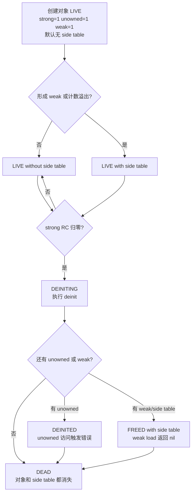

+++
date = '2026-06-16T09:06:27+08:00'
draft = false
title = 'Swift 面试：ARC 与内存管理源码解析'
tags = ['Swift', 'ARC', '内存管理', '源码分析', '面试']
categories = ['iOS开发']
weight = 1
+++

# Swift 面试：ARC 与内存管理源码解析

Swift 面试里问 ARC，通常不是想听一句“自动引用计数”。真正要答清楚的是：**对象头里有什么、strong / weak / unowned 到底差在哪里、编译器什么时候插入或消除 retain/release、为什么闭包会循环引用**。

这篇文章按面试题展开。先给可以直接回答的版本，再把结论落到 Swift 源码里的对象布局、引用计数状态机和 SIL ARC 优化。

## 面试高频问题

- Swift 的 ARC 和 Objective-C 的 ARC 有什么区别？
- Swift 对象的引用计数存在哪里？
- strong、weak、unowned 的底层差异是什么？
- 为什么 weak 在对象释放后会自动变成 nil？
- 为什么 unowned 访问已释放对象会崩溃？
- 闭包为什么容易造成循环引用？
- 编译器会如何优化 retain/release？
- 值类型是否完全不参与 ARC？
- ARC 和 Copy-on-Write 有什么关系？

## 30 秒回答版

Swift ARC 是编译器和运行时共同完成的内存管理机制。

编译器在 SIL 阶段根据所有权语义插入 `retain_value`、`release_value`、`strong_retain`、`strong_release` 等引用计数指令，并通过 ARC 优化尽量消除冗余 retain/release。运行时负责真正维护对象的引用计数。

对原生 Swift 堆对象来说，对象头包含两部分：`metadata` 和 `refCounts`。源码里 `HeapObject` 的注释明确说 `metadata` 总是指向一个有效的 metadata 对象，`refCounts` 是 Swift heap object header 的非 Objective-C 成员。

Swift 概念上维护三类引用计数：

- **strong RC**：强引用计数。归零时对象开始 `deinit`。
- **unowned RC**：未拥有引用计数。对象 `deinit` 后，如果还有 unowned 引用，分配内存不能马上释放；访问已 deinit 的 unowned 会触发错误。
- **weak RC**：弱引用计数。弱引用不直接指向对象，而是指向 side table。对象释放后 weak 读取 nil。

所以面试里可以这样总结：**strong 决定对象何时 deinit，unowned 影响对象内存何时真正回收，weak 通过 side table 支持释放后自动 nil。**

## 源码定位

下面链接指向 `swiftlang/swift` 的固定 commit，线上阅读时可以直接打开。

| 主题 | 源码位置 | 重点 |
| --- | --- | --- |
| Swift 堆对象头 | [`stdlib/public/SwiftShims/swift/shims/HeapObject.h`](https://github.com/swiftlang/swift/blob/a91d653b3703a41a8f557ccc1ba8fbbccec203e4/stdlib/public/SwiftShims/swift/shims/HeapObject.h#L45-L58) | `HeapObject` 的 `metadata` 与 `refCounts` 布局 |
| 原生对象分配和 retain/release 接口 | [`include/swift/Runtime/HeapObject.h`](https://github.com/swiftlang/swift/blob/a91d653b3703a41a8f557ccc1ba8fbbccec203e4/include/swift/Runtime/HeapObject.h#L45-L178) | `swift_allocObject`、`swift_retain`、`swift_release` |
| 引用计数布局与生命周期状态机 | [`stdlib/public/SwiftShims/swift/shims/RefCount.h`](https://github.com/swiftlang/swift/blob/a91d653b3703a41a8f557ccc1ba8fbbccec203e4/stdlib/public/SwiftShims/swift/shims/RefCount.h#L43-L177) | strong / unowned / weak、inline RC、side table |
| side table 慢路径 | [`stdlib/public/runtime/RefCount.cpp`](https://github.com/swiftlang/swift/blob/a91d653b3703a41a8f557ccc1ba8fbbccec203e4/stdlib/public/runtime/RefCount.cpp#L19-L64) | 分配 side table、weak 引用、溢出处理 |
| SIL ARC 优化说明 | [`docs/SIL/ARCOptimization.md`](https://github.com/swiftlang/swift/blob/a91d653b3703a41a8f557ccc1ba8fbbccec203e4/docs/SIL/ARCOptimization.md#L45-L57) | ARC 指令、RC Identity、COW 下的 uniqueness check |
| ARC 分析接口 | [`include/swift/SILOptimizer/Analysis/ARCAnalysis.h`](https://github.com/swiftlang/swift/blob/a91d653b3703a41a8f557ccc1ba8fbbccec203e4/include/swift/SILOptimizer/Analysis/ARCAnalysis.h#L41-L70) | retain/release 判断、生命周期安全分析 |
| RC Identity 分析 | [`lib/SILOptimizer/Analysis/RCIdentityAnalysis.cpp`](https://github.com/swiftlang/swift/blob/a91d653b3703a41a8f557ccc1ba8fbbccec203e4/lib/SILOptimizer/Analysis/RCIdentityAnalysis.cpp#L40-L48) | 识别多个 SIL value 是否操作同一个 RC |
| ARC 优化状态 | [`lib/SILOptimizer/ARC/RefCountState.h`](https://github.com/swiftlang/swift/blob/a91d653b3703a41a8f557ccc1ba8fbbccec203e4/lib/SILOptimizer/ARC/RefCountState.h#L39-L55) | 优化器如何跟踪引用计数状态 |

## Swift 对象的引用计数存在哪里？

先看对象头。

[`stdlib/public/SwiftShims/swift/shims/HeapObject.h`](https://github.com/swiftlang/swift/blob/a91d653b3703a41a8f557ccc1ba8fbbccec203e4/stdlib/public/SwiftShims/swift/shims/HeapObject.h#L50-L58) 里定义了 Swift heap object header：

```cpp
struct HeapObject {
  /// This is always a valid pointer to a metadata object.
  HeapMetadata const *__ptrauth_objc_isa_pointer metadata;

#if !SWIFT_RUNTIME_EMBEDDED
  SWIFT_HEAPOBJECT_NON_OBJC_MEMBERS;
#endif
};
```

其中 `SWIFT_HEAPOBJECT_NON_OBJC_MEMBERS` 展开后是：

```cpp
InlineRefCounts refCounts
```

源码还用静态断言要求普通 runtime 下 `HeapObject` 是两个指针大小：

```cpp
static_assert(sizeof(HeapObject) == 2*sizeof(void*),
              "HeapObject must be two pointers long");
```

所以原生 Swift 对象的基本头部可以简化成：

```text
HeapObject
├── metadata   // 类型元数据，也类似 ObjC 对象里的 isa 入口
└── refCounts  // Swift 原生引用计数信息，或 side table 指针编码
```

**已确认事实：** 源码明确把 `metadata` 和 `refCounts` 放在 `HeapObject` 头部，并说明 `metadata` 永远是有效 metadata 指针。

**机制推导：** Swift 类实例、闭包捕获盒子、部分 boxed value 都可以作为 heap object 被 ARC 管理。编译器不需要在每个对象里单独放一套复杂结构；它只需要知道对象头的位置，就可以通过运行时函数修改引用计数。

## strong、weak、unowned 的底层差异

[`stdlib/public/SwiftShims/swift/shims/RefCount.h`](https://github.com/swiftlang/swift/blob/a91d653b3703a41a8f557ccc1ba8fbbccec203e4/stdlib/public/SwiftShims/swift/shims/RefCount.h#L43-L177) 的大段注释是回答这题的核心。

源码说：一个对象概念上有三种 refcount：

```text
strong RC
unowned RC
weak RC
```

并且这些计数要么 inline 存在对象头里，要么存在 side table entry 里。

### strong：决定对象何时 deinit

源码注释对 strong RC 的定义是：

> The strong RC counts strong references to the object. When the strong RC reaches zero the object is deinited ...

也就是强引用计数归零，对象进入 `deinit`。

面试回答：

> strong 是拥有关系。只要 strong RC 大于 0，对象必须活着；当 strong RC 归零，Swift 开始执行对象的析构流程。

注意这里说的是 **deinit**，不一定等于内存马上释放。因为后面还有 unowned / weak 的生命周期问题。

### unowned：不延长对象生命周期，但影响内存回收

源码注释说 unowned RC 统计 unowned 引用，并且还有一个来自 strong 引用的额外 `+1`。这个 `+1` 会在 deinit 完成后递减。当 unowned RC 归零，对象分配内存才释放。

这解释了一个常见追问：

> 为什么 `unowned` 不会自动变 nil，而是访问已释放对象时崩溃？

因为 unowned 不是 nil-able 弱引用。对象 strong RC 归零后会进入 deinit；如果还有 unowned 引用，运行时需要保留足够的信息来判断“这个对象已经 deinit 了”。当 unowned load 发生在 deinit 之后，源码状态机描述为会在 `swift_abortRetainUnowned()` 停止。

面试回答：

> unowned 不拥有对象，不保证对象存活。它适合“被引用对象生命周期一定长于当前对象”的场景。这个前提错了，访问就是运行时错误。

### weak：通过 side table 支持自动 nil

源码注释里有两句非常关键：

```text
Strong and unowned variables point at the object.
Weak variables point at the object's side table.
```

这就是 strong / unowned 和 weak 的本质差别。

strong、unowned 变量直接指向对象；weak 变量指向对象的 side table。对象释放后，side table 可以继续存在，weak 读取时根据状态返回 nil。

源码状态机里也写了：

- `DEINITING with side table`：weak variable load returns nil
- `DEINITED with side table`：weak variable load returns nil
- `FREED with side table`：weak variable load returns nil

面试回答：

> weak 需要 side table。形成 weak 引用时，对象会获得 side table；对象 deinit 或释放后，weak 不是野指针，而是通过 side table 读出 nil。

## side table 是什么时候出现的？

源码注释明确说对象初始没有 side table：

```text
Objects initially start with no side table.
```

它们可以在这些场景获得 side table：

- 形成 weak reference
- strong RC 或 unowned RC 溢出
- 未来可能的 associated object storage 等场景

并且获得 side table 是单向操作：

```text
Gaining a side table entry is a one-way operation; an object with a side table entry never loses it.
```

[`stdlib/public/runtime/RefCount.cpp`](https://github.com/swiftlang/swift/blob/a91d653b3703a41a8f557ccc1ba8fbbccec203e4/stdlib/public/runtime/RefCount.cpp#L19-L64) 里 `allocateSideTable` 也对应这个过程：

```cpp
auto side = swift_cxx_newObject<HeapObjectSideTableEntry>(getHeapObject());
auto newbits = InlineRefCountBits(side);
...
side->initRefCounts(oldbits);
```

**面试可说法：**

> Swift 对象默认走 inline refcount 的快路径。只有 weak 引用、计数溢出等场景才切到 side table。一旦切到 side table，就不会再退回 inline，这样可以避免并发场景下的竞态。

这句话能把“性能”和“线程安全”两个点都覆盖到。

## retain / release 在运行时做什么？

[`include/swift/Runtime/HeapObject.h`](https://github.com/swiftlang/swift/blob/a91d653b3703a41a8f557ccc1ba8fbbccec203e4/include/swift/Runtime/HeapObject.h#L45-L178) 暴露了 Swift runtime 的对象分配和引用计数接口。

`swift_allocObject` 的注释说明：新对象有初始 retain count 1，并设置 metadata：

```cpp
HeapObject *swift_allocObject(HeapMetadata const *metadata,
                              size_t requiredSize,
                              size_t requiredAlignmentMask);
```

`swift_retain` 的注释说它会原子增加对象的 retain count，并且 object 可以是 null，null 时 no-op。

`swift_release` 的注释说它会原子减少 retain count；如果归零，则销毁对象：

```cpp
size_t allocSize = object->metadata->destroy(object);
if (allocSize) swift_deallocObject(object, allocSize);
```

所以可以把运行时流程简化成：

```text
创建对象
  -> swift_allocObject(metadata, size, alignment)
  -> 初始 strong retain count = 1

增加强引用
  -> swift_retain(object)
  -> strong RC + 1

减少强引用
  -> swift_release(object)
  -> strong RC - 1
  -> 如果归零，进入 destroy/deinit/dealloc 流程
```

**已确认事实：** runtime 接口层面存在 `swift_allocObject`、`swift_retain`、`swift_release`，并且注释说明对象初始 retain count 是 1，release 归零后会走 metadata destroy 和 dealloc。

**机制推导：** 这些函数是底层 ABI / runtime 接口；Swift 源码中的一次赋值、参数传递或闭包捕获，不一定都会直接生成一对运行时调用，因为编译器会在 SIL 和 IR 阶段优化掉多余操作。

## 编译器如何优化 retain/release？

面试里答 ARC，不能只答 runtime，还要答 compiler。

Swift 在 SIL 层有专门的 ARC 指令。[`docs/SIL/ARCOptimization.md`](https://github.com/swiftlang/swift/blob/a91d653b3703a41a8f557ccc1ba8fbbccec203e4/docs/SIL/ARCOptimization.md#L45-L57) 列出的引用计数指令包括：

```text
strong_retain
strong_release
strong_retain_unowned
unowned_retain
unowned_release
load_weak
store_weak
fix_lifetime
mark_dependence
is_unique
copy_block
```

文档还说明：`retain_value` 和 `release_value` 是 SIL 层“请 retain / release 这个 value”的通用形式。

它们作用在不同类型上时语义不同：

| 类型 | `retain_value` 效果 |
| --- | --- |
| Class + Strong | 增加强引用计数 |
| Struct / Tuple | 对字段递归执行 `retain_value` |
| Enum | 根据 case 对 payload 执行 `retain_value` |
| Class + Unowned | 增加 unowned 引用计数 |

这解释了一个易错点：**值类型不等于完全没有 ARC。**

比如：

```swift
struct UserViewModel {
    let service: UserService   // class
}
```

`UserViewModel` 是值类型，但它包含 class 字段。复制这个 struct 时，字段里的引用仍然可能参与 retain/release。

### RC Identity：优化器关心的是“同一个引用计数”

[`docs/SIL/ARCOptimization.md`](https://github.com/swiftlang/swift/blob/a91d653b3703a41a8f557ccc1ba8fbbccec203e4/docs/SIL/ARCOptimization.md#L90-L180) 解释了 RC Identity。核心意思是：优化器不只是看两个 SSA value 是否名字一样，而是看对它们执行 retain/release 是否会读写同一个 reference count。

[`lib/SILOptimizer/Analysis/RCIdentityAnalysis.cpp`](https://github.com/swiftlang/swift/blob/a91d653b3703a41a8f557ccc1ba8fbbccec203e4/lib/SILOptimizer/Analysis/RCIdentityAnalysis.cpp#L74-L138) 里也能看到优化器会剥掉一些保持 RC Identity 的指令，例如：

- upcast
- unchecked ref cast
- existential ref 打开或初始化
- 只有一个非 trivial 字段的 struct extract
- 只有一个引用语义元素的 tuple
- enum payload

这类分析的目的，是让优化器能识别下面这种情况：

```text
%a 和 %b 看起来是不同 SIL value
但它们最终操作同一个对象的同一个引用计数
所以可以合并、移动或删除部分 retain/release
```

### ARC 优化不是随便删 retain/release

[`include/swift/SILOptimizer/Analysis/ARCAnalysis.h`](https://github.com/swiftlang/swift/blob/a91d653b3703a41a8f557ccc1ba8fbbccec203e4/include/swift/SILOptimizer/Analysis/ARCAnalysis.h#L41-L70) 里有很多保守判断接口，例如：

- `isRetainInstruction`
- `isReleaseInstruction`
- `mayDecrementRefCount`
- `mustUseValue`
- `canNeverDecrementRefCounts`
- `valueHasARCDecrementOrCheckInInstructionRange`

这些名字本身就说明 ARC 优化关注两个问题：

1. 这条指令会不会增加或减少引用计数？
2. 移动 retain/release 会不会让对象提前释放，形成 lifetime gap？

面试回答：

> Swift ARC 优化的目标不是简单删除成对的 retain/release，而是在保证对象生命周期不被缩短的前提下，利用 RC Identity、控制流和别名信息移动或消除引用计数操作。

## Swift ARC 和 Objective-C ARC 有什么区别？

可以分三层回答。

### 1. 语言层

Objective-C 的对象基本都是引用语义；Swift 同时有值类型和引用类型。

Swift 中 `struct`、`enum` 本身是值语义，但如果内部持有 class 引用，仍然会触发引用计数操作。SIL 文档明确说 `retain_value` 作用在 struct / tuple 上时，会递归 retain 字段。

所以不能说“Swift 值类型不需要 ARC”，更准确的说法是：

> Swift 值类型自身不是引用计数对象，但值类型内部的引用字段仍然受 ARC 管理。

### 2. 对象布局层

Swift 原生对象头里有 `metadata` 和 `refCounts`。Objective-C 对象的 isa 和引用计数机制则依赖 ObjC runtime 的对象模型。

Swift runtime 的 `swift_retain` 注释也提到未来可能有不同变体：有的处理 Swift 对象、ObjC 对象和 null，有的假设操作数是 Swift object，有的可以用 non-atomic 操作。

这说明 Swift ARC 需要处理 Swift / ObjC 互操作，但原生 Swift 对象有自己的引用计数布局。

### 3. 编译器优化层

Swift 有 SIL 这个中间层，所有权和 ARC 优化是 SIL 优化的重要组成部分。Objective-C ARC 更多是 Clang/LLVM 前端和 ObjC runtime 模型下的管理。

面试里不要硬说“Swift ARC 比 Objective-C ARC 更高级”。更稳的说法是：

> Swift ARC 和 Objective-C ARC 都是自动引用计数，但 Swift 结合 SIL ownership、值类型、泛型、enum payload、COW 等语言特性做了更细的静态分析和优化；运行时上，Swift 原生对象也有自己的 heap object header 和 refcount 布局。

## 闭包为什么容易造成循环引用？

闭包是引用类型。闭包捕获 class 实例时，默认会强持有被捕获对象。

典型循环：

```swift
final class ViewModel {
    var onUpdate: (() -> Void)?

    func bind() {
        onUpdate = {
            self.reload()
        }
    }

    func reload() {}
}
```

引用关系是：

```text
ViewModel instance
  └── strong -> onUpdate closure
                    └── strong -> self(ViewModel instance)
```

只要 `onUpdate` 被 `ViewModel` 强持有，而闭包又强捕获 `self`，strong RC 永远无法归零。

常见解法：

```swift
onUpdate = { [weak self] in
    self?.reload()
}
```

或者在生命周期确定时：

```swift
onUpdate = { [unowned self] in
    self.reload()
}
```

面试要补一句边界：

> `weak` 更安全，因为对象释放后读取 nil；`unowned` 更像非空弱引用，适合被捕获对象一定活得更久的场景。生命周期判断错了，`unowned` 会崩溃。

## ARC 和 Copy-on-Write 有什么关系？

这题经常和 Array、String、Dictionary 一起问。

COW 的核心是：多个值可以共享底层 buffer，写入前检查 buffer 是否唯一引用。如果唯一，就原地改；不唯一，就复制。

[`docs/SIL/ARCOptimization.md`](https://github.com/swiftlang/swift/blob/a91d653b3703a41a8f557ccc1ba8fbbccec203e4/docs/SIL/ARCOptimization.md#L284-L349) 里说，Array、Set 这类数据结构的 COW 能力通过 `Builtin.isUnique` 高效实现，底层会 lower 到 SIL 的 `is_unique` 指令。

文档还说明：`is_unique` 只会在非空、原生 Swift 对象、strong reference count 为 1 时返回 true。

所以 COW 和 ARC 的关系是：

```text
ARC 维护引用计数
COW 利用引用计数判断 buffer 是否唯一
唯一：原地写
不唯一：复制 buffer 再写
```

这也解释了为什么 ARC 优化在遇到 `is_unique` 时必须谨慎。文档明确说，`is_unique` 虽然不实际修改引用，但在 SIL 层看起来需要把引用当作可变，优化器不能随意删除某些 retain/release 对。

## 一张图串起对象生命周期

根据 `RefCount.h` 的状态机注释，可以把对象生命周期简化成：



这张图面试时可以口头化成一句话：

> strong 归零触发 deinit；有 unowned 时对象内存可能延后释放；有 weak 时 side table 继续存在，让 weak 读取 nil。

## 易错点 / 追问

### 1. ARC 是运行时机制还是编译器机制？

两者都有。

- 编译器负责插入、移动、消除 retain/release。
- 运行时负责对象头、refcount、side table、deinit/dealloc。

只说“编译器自动插入 retain/release”不完整；只说“运行时维护引用计数”也不完整。

### 2. weak 为什么必须是 Optional？

因为 weak 引用的目标释放后会变成 nil。既然可能为 nil，Swift 类型系统要求它是 Optional。

```swift
weak var delegate: SomeDelegate?
```

这和源码状态机里 weak load returns nil 对应。

### 3. unowned 为什么不是 Optional？

`unowned` 表达的是“我不拥有它，但我相信它一定存在”。所以访问语义更接近非 Optional。

这带来的代价是：一旦生命周期假设错误，运行时会报错，而不是返回 nil。

### 4. `weak self` 一定好吗？

不一定。

`weak self` 会让闭包执行时 `self` 可能为 nil，适合 UI 回调、异步回调、生命周期不确定的场景。

如果闭包执行时业务上必须有 `self`，可以先用 `guard let self else { return }` 明确退出。

如果你能严格证明 `self` 一定比闭包活得久，才考虑 `unowned self`。

### 5. 值类型复制一定没有 retain/release 吗？

不一定。

值类型如果只包含 Int、Bool 这类 trivial 字段，复制通常不需要 ARC。但值类型如果包含 class 引用、闭包、COW buffer，就可能触发 retain/release 或 uniqueness check。

SIL ARC 文档里 `retain_value` 对 struct / tuple 的解释就是：递归 retain 字段。

### 6. `isKnownUniquelyReferenced` 和 ARC 是什么关系？

它是 COW 的关键工具。它依赖引用计数判断某个 class 实例是否唯一引用。

但它只能用于 class 实例的 `inout` 引用，且判断结果会受 ObjC 桥接、弱引用、并发访问等因素影响。面试回答时重点说：

> 它不是“是否只有一个 Swift 变量指向它”的语义判断，而是运行时层面对原生 Swift 对象强引用计数的 uniqueness check。

## 复习小结

Swift ARC 这题可以按四层记：

1. **对象头**：原生 Swift heap object 头部是 `metadata + refCounts`。
2. **三种计数**：strong 决定 deinit，unowned 决定对象内存何时能释放，weak 通过 side table 自动 nil。
3. **运行时接口**：`swift_allocObject` 初始 retain count 为 1，`swift_retain` 增加强引用，`swift_release` 递减并在归零时触发销毁。
4. **编译器优化**：SIL 层有 ARC 指令，优化器通过 RC Identity、别名和生命周期分析移动或删除多余 retain/release。

面试最后可以用这句话收束：

> Swift ARC 不是简单的“引用计数自动 +1/-1”。它是一套从语言所有权、SIL ARC 指令、优化器 RC Identity 分析，到 runtime heap object header、inline refcount 和 side table 状态机共同组成的内存管理系统。
