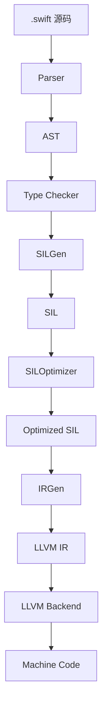
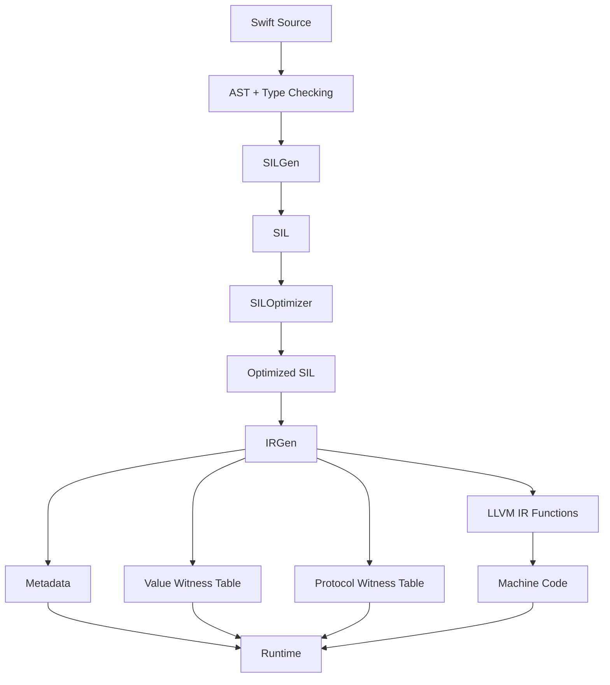

+++
date = '2026-06-16T09:06:27+08:00'
draft = false
title = 'Swift 面试：编译流程、Runtime 与元数据源码解析'
tags = ['Swift', 'Compiler', 'Runtime', 'SIL', 'Metadata', '源码分析', '面试']
categories = ['iOS开发']
weight = 5
+++

# Swift 面试：编译流程、Runtime 与元数据源码解析

Swift 面试里问编译流程和 Runtime，通常不是想听一串名词，而是想看你能不能把 **源码 -> AST -> SIL -> 优化 -> IRGen -> LLVM -> Runtime Metadata** 串起来。

这篇文章按面试题展开，把答案落到 Swift 编译器源码里的 SILGen、SILOptimizer、IRGen、Metadata、Value Witness Table、Protocol Witness Table 和 HeapObject。

## 面试高频问题

- Swift 源码从 `.swift` 到机器码经历哪些阶段？
- AST、SIL、LLVM IR 分别负责什么？
- 为什么 Swift 需要 SIL，而不是直接生成 LLVM IR？
- SILGen 做什么？SILOptimizer 做什么？
- IRGen 为什么要生成 Metadata 和 Witness Table？
- Swift Runtime Metadata 保存了哪些信息？
- Value Witness Table 是什么？
- Protocol Witness Table 和 class vtable 有什么区别？
- class、struct、enum 在 Runtime 表示上有什么差异？
- HeapObject 和 Metadata 有什么关系？

## 30 秒回答版

Swift 编译流程可以简化为：

```text
Source Code
  -> Parse / AST
  -> Type Checking
  -> SILGen
  -> SIL Optimizer
  -> IRGen
  -> LLVM IR
  -> LLVM Backend
  -> Machine Code
```

AST 表示语法和语义结构；SIL 是 Swift 专用中间表示，保留所有权、泛型、协议、ARC 等高级语义；SILOptimizer 在这个层面做 ARC、内联、泛型特化、去虚拟化等优化；IRGen 再把 SIL 降到 LLVM IR，同时生成 runtime 需要的 metadata、value witness table、protocol witness table 等结构。

Swift Runtime Metadata 让运行时知道一个类型怎么创建、复制、销毁、取字段偏移、做动态类型检查、支持泛型实例化和协议派发。Value Witness Table 提供值的 copy/destroy/layout 操作；Protocol Witness Table 提供协议 requirement 到具体实现的映射。

面试可以这样收束：

> Swift 的编译器前端负责理解语言语义，SIL 负责承载 Swift 专有优化，IRGen 负责把这些语义翻译成 LLVM 和 Runtime 可执行的数据结构。Runtime Metadata 不是只服务反射，它也服务泛型、内存管理、协议派发和 ABI。

## 源码定位

下面链接指向 `swiftlang/swift` 的固定 commit，方便线上阅读。

| 主题 | 源码位置 | 重点 |
| --- | --- | --- |
| AST 实现目录 | [`lib/AST/`](https://github.com/swiftlang/swift/tree/a91d653b3703a41a8f557ccc1ba8fbbccec203e4/lib/AST) | 类型系统、声明、语义模型 |
| SILGen | [`lib/SILGen/`](https://github.com/swiftlang/swift/tree/a91d653b3703a41a8f557ccc1ba8fbbccec203e4/lib/SILGen) | AST 到 SIL 的降级 |
| SIL | [`lib/SIL/`](https://github.com/swiftlang/swift/tree/a91d653b3703a41a8f557ccc1ba8fbbccec203e4/lib/SIL) | Swift 中间表示 |
| SILOptimizer | [`lib/SILOptimizer/`](https://github.com/swiftlang/swift/tree/a91d653b3703a41a8f557ccc1ba8fbbccec203e4/lib/SILOptimizer) | ARC、泛型特化、内联、去虚拟化 |
| IRGen | [`lib/IRGen/`](https://github.com/swiftlang/swift/tree/a91d653b3703a41a8f557ccc1ba8fbbccec203e4/lib/IRGen) | SIL 到 LLVM IR 与 runtime 结构生成 |
| ABI Metadata | [`include/swift/ABI/Metadata.h`](https://github.com/swiftlang/swift/blob/a91d653b3703a41a8f557ccc1ba8fbbccec203e4/include/swift/ABI/Metadata.h) | metadata 层次结构 |
| Runtime Metadata | [`include/swift/Runtime/Metadata.h`](https://github.com/swiftlang/swift/blob/a91d653b3703a41a8f557ccc1ba8fbbccec203e4/include/swift/Runtime/Metadata.h) | runtime metadata 入口 |
| Value Witness Table | [`include/swift/ABI/ValueWitnessTable.h`](https://github.com/swiftlang/swift/blob/a91d653b3703a41a8f557ccc1ba8fbbccec203e4/include/swift/ABI/ValueWitnessTable.h) | 值类型操作表 |
| SIL Witness Table | [`include/swift/SIL/SILWitnessTable.h`](https://github.com/swiftlang/swift/blob/a91d653b3703a41a8f557ccc1ba8fbbccec203e4/include/swift/SIL/SILWitnessTable.h) | SIL 层协议一致性 |
| HeapObject | [`include/swift/Runtime/HeapObject.h`](https://github.com/swiftlang/swift/blob/a91d653b3703a41a8f557ccc1ba8fbbccec203e4/include/swift/Runtime/HeapObject.h#L45-L178) | 堆对象分配与引用计数接口 |

## Swift 编译流程总览

一个 `.swift` 文件不是直接变成机器码的。简化流程是：



每一层解决的问题不同：

| 阶段 | 作用 |
| --- | --- |
| Parser / AST | 把源码变成结构化语法树 |
| Type Checker | 解析类型、泛型约束、重载、协议一致性 |
| SILGen | 把 AST 降级成 Swift 专用中间表示 |
| SILOptimizer | 在 Swift 语义层做优化 |
| IRGen | 生成 LLVM IR 和 runtime 数据结构 |
| LLVM | 做底层优化和目标平台机器码生成 |

面试里要强调：**SIL 是 Swift 的关键中间层。**

## 为什么需要 SIL？

LLVM IR 很强，但它不理解 Swift 的高级语义，例如：

- `strong` / `weak` / `unowned`
- ownership
- generic constraint
- protocol witness
- enum payload
- actor isolation 降级前的语义
- value witness table
- Swift ABI metadata

如果直接从 AST 到 LLVM IR，很多 Swift 特有优化就会丢失上下文。

SIL 的价值是：在降到更底层之前，保留足够多 Swift 语义，让优化器能做更准确的事情。

例如：

- ARC 优化需要知道 retain/release 是否能移动或删除。
- 泛型特化需要知道具体类型和约束。
- 协议调用去虚拟化需要知道 witness_method 的来源。
- 值类型 copy/destroy 需要理解所有权。

所以面试回答：

> SIL 是 Swift 编译器为 Swift 语言语义设计的中间表示。它比 AST 更接近执行，比 LLVM IR 更懂 Swift，因此适合承载 ARC、泛型、协议、所有权等 Swift 专有优化。

## SILGen 做什么？

SILGen 的工作是把已经类型检查过的 AST 降级成 SIL。

例如：

```swift
func add(_ a: Int, _ b: Int) -> Int {
    a + b
}
```

AST 里表示的是函数声明、参数、表达式、返回值等语法语义结构。SILGen 要把它变成更接近控制流和数据流的形式：

```text
function add
  parameter a
  parameter b
  builtin integer add
  return result
```

真实情况会更复杂，SILGen 还要处理：

- 函数和闭包生成
- ownership convention
- 参数传递方式
- 值的初始化和销毁
- defer / error handling
- witness table 相关声明
- enum / pattern matching 降级

源码入口是 [`lib/SILGen/`](https://github.com/swiftlang/swift/tree/a91d653b3703a41a8f557ccc1ba8fbbccec203e4/lib/SILGen)。

## SILOptimizer 做什么？

SILOptimizer 在 SIL 上做 Swift 专有优化。

常见优化包括：

- ARC 优化：删除冗余 retain/release
- 函数内联
- 死代码删除
- 泛型特化
- 协议派发去虚拟化
- COW mutation 简化
- ownership / lifetime 优化

例如：

```swift
func render<T: Drawable>(_ value: T) {
    value.draw()
}

render(Circle())
```

如果优化器能证明 `T == Circle`，它就可能把泛型调用特化，再把协议调用优化成直接调用，最后继续内联。

```text
generic apply
  -> specialized function
  -> witness_method 去虚拟化
  -> direct function_ref
  -> inline
```

这就是 Swift 性能经常能接近手写具体类型代码的原因之一。

## IRGen 做什么？

IRGen 是 Swift 编译器把 SIL 翻译成 LLVM IR 的阶段。

它不仅生成函数体，还要生成 runtime 需要的数据结构：

- type metadata
- nominal type descriptor
- field offset vector
- value witness table
- protocol witness table
- class metadata / vtable
- generic metadata pattern

这些结构让运行时能回答一些问题：

```text
这个类型多大？
怎么复制和销毁？
字段偏移是多少？
是否符合某个协议？
协议方法的具体实现在哪里？
泛型 T 的 metadata 是什么？
```

[`lib/IRGen/`](https://github.com/swiftlang/swift/tree/a91d653b3703a41a8f557ccc1ba8fbbccec203e4/lib/IRGen) 就是这个阶段的实现目录。

## Runtime Metadata 保存什么？

Swift metadata 可以理解成运行时类型信息，但它不只用于反射。

对 struct 来说，metadata 需要支持：

- 类型描述符
- 字段偏移
- 泛型参数信息
- value witness table 关联

对 enum 来说，metadata 还要支持：

- case 信息
- payload 布局
- tag 读写

对 class 来说，metadata 要支持：

- superclass
- 方法派发信息
- 对象大小
- 构造/析构相关信息
- HeapObject 分配所需信息

源码入口可以看 [`include/swift/ABI/Metadata.h`](https://github.com/swiftlang/swift/blob/a91d653b3703a41a8f557ccc1ba8fbbccec203e4/include/swift/ABI/Metadata.h)。其中有 `TargetMetadata`、value metadata、struct metadata、enum metadata、class metadata 等层级。

面试回答：

> Swift Metadata 是运行时理解类型的入口。它支撑泛型实例化、动态类型检查、反射、字段偏移、value witness、protocol conformance、class 分配和派发等能力。

## Value Witness Table 是什么？

泛型代码经常不知道具体类型：

```swift
func copyTwice<T>(_ value: T) -> (T, T) {
    (value, value)
}
```

如果 `T` 是 `Int`，复制很简单；如果 `T` 是包含引用的 struct，复制可能要 retain；如果 `T` 是复杂 enum，销毁也可能要递归处理 payload。

编译器需要一套“对任意值类型执行基本操作”的表，这就是 Value Witness Table。

它回答的问题包括：

- 如何 copy？
- 如何 destroy？
- size 是多少？
- alignment 是多少？
- stride 是多少？
- enum tag 如何处理？

源码入口是 [`include/swift/ABI/ValueWitnessTable.h`](https://github.com/swiftlang/swift/blob/a91d653b3703a41a8f557ccc1ba8fbbccec203e4/include/swift/ABI/ValueWitnessTable.h)。

面试回答：

> Value Witness Table 是值类型的运行时操作表。泛型代码和 existential 容器在不知道具体类型时，依赖它完成 copy、destroy、布局查询等操作。

## Protocol Witness Table 是什么？

在泛型和协议文章里我们已经讲过，Protocol Witness Table 保存的是：

```text
协议要求 -> 具体类型实现
```

例如：

```swift
protocol Drawable {
    func draw()
}

struct Circle: Drawable {
    func draw() {}
}
```

对应的表可以理解成：

```text
Circle conforms to Drawable
Drawable.draw -> Circle.draw
```

如果协议有 associated type 或继承其他协议，表里还要保存对应类型和关联 conformance。

源码入口是 [`include/swift/SIL/SILWitnessTable.h`](https://github.com/swiftlang/swift/blob/a91d653b3703a41a8f557ccc1ba8fbbccec203e4/include/swift/SIL/SILWitnessTable.h)。

面试对比：

| 表 | 服务对象 | 解决问题 |
| --- | --- | --- |
| Value Witness Table | 值类型本身 | 如何 copy/destroy/layout |
| Protocol Witness Table | 类型对协议的一致性 | 协议要求对应哪个实现 |
| class vtable | class 继承层级 | override 方法动态派发 |

## HeapObject 和 Metadata 的关系

Swift 原生堆对象头里有 metadata 指针和引用计数信息。

[`HeapObject.h`](https://github.com/swiftlang/swift/blob/a91d653b3703a41a8f557ccc1ba8fbbccec203e4/include/swift/Runtime/HeapObject.h#L45-L178) 里 `swift_allocObject` 接口需要传入 `HeapMetadata`：

```cpp
HeapObject *swift_allocObject(HeapMetadata const *metadata,
                              size_t requiredSize,
                              size_t requiredAlignmentMask);
```

这说明创建一个 Swift 堆对象时，runtime 必须知道：

- 这个对象是什么类型
- 需要分配多大
- 对齐要求是什么
- 后续怎么 destroy / dealloc

对象和 metadata 的关系可以简化成：

```text
HeapObject
├── metadata -> 描述对象类型、布局、方法等
└── refCounts -> ARC 引用计数
```

面试回答：

> HeapObject 是对象实例的运行时头部，Metadata 是类型信息。对象通过 metadata 知道自己如何被销毁、如何参与动态类型系统，ARC 通过对象头维护生命周期。

## class、struct、enum 的 Runtime 表示差异

### struct

struct 是值类型。它的值可以直接内联存储，也可能在泛型或 existential 场景下通过 value witness table 操作。

struct metadata 主要关心字段布局和字段偏移。

### enum

enum 也是值类型，但它还要表达当前 case，以及 payload 如何存储。带 payload 的 enum 需要处理 tag 和 payload layout。

### class

class 是引用类型，实例分配在堆上，通过 HeapObject 头部连接 metadata 和 refcount。class 还涉及继承、动态派发、deinit、对象大小等信息。

面试总结：

> struct / enum 更依赖 value metadata 和 value witness table；class 依赖 heap object header、class metadata、vtable 和 ARC。三者都可能有 metadata，但实例存储和生命周期模型不同。

## 泛型 Metadata 是怎么来的？

非泛型类型的 metadata 可以在编译期生成得更完整：

```swift
struct Point {
    var x: Int
    var y: Int
}
```

但泛型类型不行：

```swift
struct Box<T> {
    var value: T
}
```

`Box<Int>` 和 `Box<String>` 的布局可能不同，因为 `T` 的 size、alignment、copy/destroy 行为不同。

所以 Swift 需要泛型 metadata 实例化机制：

```text
编译期生成 Box<T> 的 metadata pattern
运行时传入 T 的 metadata
生成 Box<Int> / Box<String> 的具体 metadata
缓存起来复用
```

这就是为什么 Swift 泛型不仅是编译期概念，也需要 runtime metadata 支持。

## 一张图串起编译器和 Runtime



这张图面试时可以口头化成：

> AST 理解源码，SIL 承载 Swift 语义优化，IRGen 同时生成 LLVM IR 和 runtime 结构，最终机器码运行时依赖 metadata 与 witness table 完成动态能力。

## 易错点 / 追问

### 1. Metadata 是否只用于反射？

不是。

反射只是 metadata 的用途之一。泛型、existential、动态类型检查、对象分配、字段偏移、value witness、protocol conformance 都可能依赖 metadata。

### 2. SIL 和 LLVM IR 有什么区别？

SIL 是 Swift 专用中间表示，保留 Swift ownership、泛型、协议、ARC 等语义。LLVM IR 更底层，面向通用后端优化和机器码生成。

### 3. IRGen 是不是只生成函数代码？

不是。

IRGen 还生成 metadata、witness table、type descriptor、field offsets、vtable 等运行时数据结构。

### 4. Value Witness Table 和 Protocol Witness Table 怎么区分？

Value Witness Table 解决“这个值怎么复制、销毁、布局”；Protocol Witness Table 解决“这个类型如何满足某个协议”。

### 5. struct 是否没有 runtime metadata？

不是。

struct 是值类型，但在泛型、反射、existential、字段偏移、value witness 等场景仍然需要 metadata。

### 6. Swift 是静态语言，为什么需要 Runtime？

因为 Swift 既有静态类型系统，也支持泛型、协议、动态类型检查、反射、ARC、ObjC 互操作等运行时能力。静态优化和 runtime metadata 是互补关系。

## 复习小结

这篇文章可以按五层记：

1. **AST**：源码的语法和语义结构。
2. **SIL**：Swift 专用中间表示，承载所有权、ARC、泛型、协议等优化。
3. **IRGen / LLVM**：生成 LLVM IR 和最终机器码。
4. **Metadata / Witness Table**：让运行时理解类型、值操作和协议一致性。
5. **HeapObject / Runtime**：让 class 实例参与分配、引用计数、销毁和动态类型系统。

面试最后可以这样总结：

> Swift 不是纯静态编译后就没有运行时。它通过 AST 和 SIL 做高级语义分析与优化，通过 IRGen 生成 LLVM IR 和 metadata / witness table，再由 runtime 支撑泛型、协议、ARC、动态类型检查和对象生命周期。
