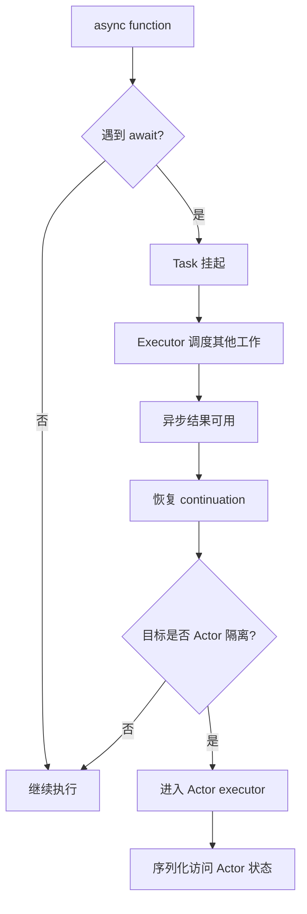

+++
date = '2026-06-16T09:06:27+08:00'
draft = false
title = 'Swift 面试：并发、async/await 与 Actor 源码解析'
tags = ['Swift', 'Concurrency', 'async-await', 'Actor', '源码分析', '面试']
categories = ['iOS开发']
weight = 4
+++

# Swift 面试：并发、async/await 与 Actor 源码解析

Swift Concurrency 面试经常从 `async/await` 问起，但真正的重点是：**Task 是结构化并发的执行单元，await 是显式暂停点，Actor 通过隔离和串行执行器保护状态，Sendable 则约束跨并发边界传递的数据。**

这篇文章按面试题展开，把结论落到 Swift 标准库和编译器源码里的 Actor、GlobalActor、MainActor、AsyncLet、TaskGroup、Sendable 和 ActorIsolation。

## 面试高频问题

- async/await 和 GCD 的关系是什么？
- `await` 到底表示线程阻塞还是任务暂停？
- Task、async let、TaskGroup 有什么区别？
- Actor 如何保证数据隔离？
- MainActor 是什么，为什么 UI 更新要回到 MainActor？
- GlobalActor 和普通 Actor 有什么区别？
- Sendable 解决什么问题？
- `Task.detached` 为什么要慎用？
- Actor 之间调用为什么需要 `await`？
- Swift Concurrency 是编译器机制还是运行时机制？

## 30 秒回答版

Swift Concurrency 是编译器、标准库和运行时共同完成的并发模型。

`async/await` 不是对 GCD 的简单语法糖。`await` 表示当前异步任务可能在这里暂停，把执行权交还给调度器；等异步结果可用时，再从 continuation 恢复。它不应该理解成“阻塞当前线程等待”。

Actor 是一种受隔离保护的引用类型。Actor 内部可变状态只能在 actor 隔离域内访问；跨 actor 访问必须异步，编译器会插入隔离检查。运行时通过 executor 保证同一 actor 的隔离状态不会被多个任务同时进入。

MainActor 是全局 actor，用来把需要主线程语义的代码隔离到主执行器上。UI 更新标注 `@MainActor`，本质是在类型系统里表达“这段代码属于 MainActor 隔离域”。

面试可以这样总结：

> Swift Concurrency 不是只解决线程调度，而是把任务结构、取消传播、actor 隔离、跨线程数据安全和主线程约束都放进语言模型里，由编译器静态检查，运行时负责调度执行。

## 源码定位

下面链接指向 `swiftlang/swift` 的固定 commit，方便线上阅读。

| 主题 | 源码位置 | 重点 |
| --- | --- | --- |
| Actor 协议 | [`stdlib/public/Concurrency/Actor.swift`](https://github.com/swiftlang/swift/blob/a91d653b3703a41a8f557ccc1ba8fbbccec203e4/stdlib/public/Concurrency/Actor.swift#L57-L75) | Actor 的 executor 要求 |
| GlobalActor | [`stdlib/public/Concurrency/GlobalActor.swift`](https://github.com/swiftlang/swift/blob/a91d653b3703a41a8f557ccc1ba8fbbccec203e4/stdlib/public/Concurrency/GlobalActor.swift#L51-L88) | 全局 actor 协议 |
| MainActor | [`stdlib/public/Concurrency/MainActor.swift`](https://github.com/swiftlang/swift/blob/a91d653b3703a41a8f557ccc1ba8fbbccec203e4/stdlib/public/Concurrency/MainActor.swift#L48-L66) | 主 actor 实现 |
| async let | [`stdlib/public/Concurrency/AsyncLet.swift`](https://github.com/swiftlang/swift/blob/a91d653b3703a41a8f557ccc1ba8fbbccec203e4/stdlib/public/Concurrency/AsyncLet.swift#L19-L44) | async let 运行时接口 |
| TaskGroup | [`stdlib/public/Concurrency/TaskGroup.swift`](https://github.com/swiftlang/swift/blob/a91d653b3703a41a8f557ccc1ba8fbbccec203e4/stdlib/public/Concurrency/TaskGroup.swift#L17-L73) | 结构化任务组 |
| AsyncSequence | [`stdlib/public/Concurrency/AsyncSequence.swift`](https://github.com/swiftlang/swift/blob/a91d653b3703a41a8f557ccc1ba8fbbccec203e4/stdlib/public/Concurrency/AsyncSequence.swift) | 异步序列协议 |
| Sendable | [`stdlib/public/core/Sendable.swift`](https://github.com/swiftlang/swift/blob/a91d653b3703a41a8f557ccc1ba8fbbccec203e4/stdlib/public/core/Sendable.swift#L64-L197) | 跨并发边界安全标记 |
| Actor 隔离检查 | [`lib/AST/ActorIsolation.cpp`](https://github.com/swiftlang/swift/blob/a91d653b3703a41a8f557ccc1ba8fbbccec203e4/lib/AST/ActorIsolation.cpp#L20-L96) | 编译器隔离分析 |
| 并发 runtime 接口 | [`include/swift/Runtime/Concurrency.h`](https://github.com/swiftlang/swift/blob/a91d653b3703a41a8f557ccc1ba8fbbccec203e4/include/swift/Runtime/Concurrency.h#L52-L86) | task / executor 运行时入口 |

## async/await 和 GCD 的关系

GCD 是底层调度队列模型，核心抽象是 queue 和 block。Swift Concurrency 的核心抽象是 task、await、actor、structured concurrency。

两者不是同一层：

```text
GCD
  -> 手动把 block dispatch 到队列
  -> 关注线程/队列调度
  -> 取消、父子任务、数据隔离需要自己约束

Swift Concurrency
  -> 用 async/await 表达异步控制流
  -> 用 Task/TaskGroup 表达任务结构
  -> 用 Actor/Sendable 表达并发安全边界
  -> 底层仍可由运行时映射到线程池/队列执行
```

所以面试不要说“async/await 就是 GCD 语法糖”。更准确：

> Swift Concurrency 是语言级并发模型，底层可以使用运行时调度和系统线程资源，但它把结构化任务、取消、优先级、actor 隔离和 Sendable 检查纳入了类型系统和编译器。

## `await` 是阻塞线程吗？

不是。

`await` 表示当前异步函数可能在这里暂停。暂停的是 task 的执行，不应该理解成当前线程被占住等待。

```swift
func loadUser() async throws -> User {
    let data = try await api.fetchUser()
    return try decode(data)
}
```

执行到 `await` 时，如果结果还没准备好，当前 task 可以挂起，线程可以去执行其他工作。等结果可用后，task 再恢复执行。

这也是为什么 `await` 必须显式写出来：它提醒你这里可能发生暂停、重入和隔离边界切换。

面试回答：

> `await` 是一个显式 suspension point，不是同步阻塞。它让编译器和读代码的人都知道：这里可能暂时离开当前执行流，恢复时状态仍然延续，但执行线程不一定是原来的线程。

## Task、async let、TaskGroup 有什么区别？

### Task

`Task` 是异步工作的基本单元。你可以显式创建：

```swift
Task {
    await refresh()
}
```

它适合从同步上下文进入异步世界，或创建一个独立异步任务。

### async let

`async let` 适合少量、固定数量的并发子任务：

```swift
async let user = loadUser()
async let orders = loadOrders()

let result = await (user, orders)
```

[`AsyncLet.swift`](https://github.com/swiftlang/swift/blob/a91d653b3703a41a8f557ccc1ba8fbbccec203e4/stdlib/public/Concurrency/AsyncLet.swift#L19-L44) 暴露了 async let 相关运行时入口，例如开始、获取、结束 async let 的接口。

### TaskGroup

`TaskGroup` 适合动态数量的子任务：

```swift
await withTaskGroup(of: Image.self) { group in
    for url in urls {
        group.addTask {
            await loadImage(url)
        }
    }

    for await image in group {
        render(image)
    }
}
```

[`TaskGroup.swift`](https://github.com/swiftlang/swift/blob/a91d653b3703a41a8f557ccc1ba8fbbccec203e4/stdlib/public/Concurrency/TaskGroup.swift#L17-L73) 是结构化任务组的标准库入口。

### 对比总结

| 抽象 | 适用场景 | 结构化程度 |
| --- | --- | --- |
| `Task {}` | 从同步上下文启动异步工作 | 取决于创建方式 |
| `async let` | 固定数量并发子任务 | 强结构化 |
| `TaskGroup` | 动态数量并发子任务 | 强结构化 |
| `Task.detached` | 脱离当前上下文的任务 | 更弱，慎用 |

## Actor 如何保证数据隔离？

Actor 的目标是保护内部可变状态。

```swift
actor Counter {
    private var value = 0

    func increment() {
        value += 1
    }

    func current() -> Int {
        value
    }
}
```

外部访问：

```swift
let counter = Counter()
await counter.increment()
let value = await counter.current()
```

跨 actor 调用需要 `await`，因为调用要进入 actor 的隔离域。

[`Actor.swift`](https://github.com/swiftlang/swift/blob/a91d653b3703a41a8f557ccc1ba8fbbccec203e4/stdlib/public/Concurrency/Actor.swift#L57-L75) 中，Actor 协议和 executor 相关属性是理解运行时执行的入口。Actor 不是简单加锁对象，它把“谁可以访问内部状态”提升到了类型系统。

**已确认事实：** Swift 编译器源码里有 [`ActorIsolation.cpp`](https://github.com/swiftlang/swift/blob/a91d653b3703a41a8f557ccc1ba8fbbccec203e4/lib/AST/ActorIsolation.cpp#L20-L96)，说明 actor 隔离不是纯运行时约定，而是编译期分析的一部分。

**机制推导：** Actor 的安全性来自两层：编译器限制跨隔离域直接访问，运行时 executor 保证进入同一 actor 的可变状态访问被序列化。

## MainActor 是什么？

`MainActor` 是一个全局 actor，通常对应主线程语义。

```swift
@MainActor
final class ProfileViewModel {
    var title: String = ""

    func updateTitle(_ title: String) {
        self.title = title
    }
}
```

标注 `@MainActor` 后，这个类型或方法属于 MainActor 隔离域。外部从非 MainActor 上下文访问时，需要 `await`。

[`MainActor.swift`](https://github.com/swiftlang/swift/blob/a91d653b3703a41a8f557ccc1ba8fbbccec203e4/stdlib/public/Concurrency/MainActor.swift#L48-L66) 是 MainActor 的标准库入口。

面试回答：

> MainActor 是 Swift Concurrency 提供的主执行器隔离域。它不是简单的 `DispatchQueue.main.async` 包装，而是把“这段代码必须在主 actor 上运行”写进类型系统，让编译器参与检查。

## GlobalActor 和普通 Actor 的区别

普通 actor 是一个实例隔离域：

```swift
actor Database {
    var cache: [String: String] = [:]
}
```

每个 `Database()` 实例有自己的隔离状态。

GlobalActor 则是把一组声明绑定到一个全局共享 actor：

```swift
@globalActor
actor ImagePipelineActor {
    static let shared = ImagePipelineActor()
}
```

然后：

```swift
@ImagePipelineActor
func decodeImage() async {}
```

所有标注 `@ImagePipelineActor` 的代码都进入同一个全局隔离域。Swift 标准库里的 [`GlobalActor.swift`](https://github.com/swiftlang/swift/blob/a91d653b3703a41a8f557ccc1ba8fbbccec203e4/stdlib/public/Concurrency/GlobalActor.swift#L51-L88) 定义了这个协议模型。

## Sendable 解决什么问题？

并发里真正危险的不是“多个线程”，而是“可变共享状态跨并发边界传递”。

`Sendable` 表示一个值可以安全跨并发边界传递：

```swift
struct User: Sendable {
    let id: Int
    let name: String
}
```

值类型如果所有成员都是 Sendable，通常更容易满足要求。引用类型则更复杂，因为 class 默认有共享可变状态风险。

[`Sendable.swift`](https://github.com/swiftlang/swift/blob/a91d653b3703a41a8f557ccc1ba8fbbccec203e4/stdlib/public/core/Sendable.swift#L64-L197) 是标准库入口。

面试可以这样答：

> Sendable 是跨并发域传值的安全标记。它告诉编译器：这个类型的值从一个任务或 actor 传到另一个任务或 actor，不会引入未受保护的共享可变状态。

如果你写：

```swift
final class Cache: @unchecked Sendable {
    private var storage: [String: String] = [:]
}
```

`@unchecked` 的意思不是“它自动安全”，而是“编译器不检查，安全责任由你承担”。这通常要求内部自己加锁、使用 actor 或不可变设计。

## AsyncSequence 为什么适合异步流？

同步序列是：

```swift
for value in values { ... }
```

异步序列是：

```swift
for await value in stream { ... }
```

区别在于每次取下一个元素都可能挂起。

[`AsyncSequence.swift`](https://github.com/swiftlang/swift/blob/a91d653b3703a41a8f557ccc1ba8fbbccec203e4/stdlib/public/Concurrency/AsyncSequence.swift) 定义了异步序列协议。它的核心语义是：`next()` 可以是异步的，因此非常适合网络流、文件流、通知流、事件流。

面试回答：

> AsyncSequence 把“异步产生多个值”的场景抽象成序列。它保留了 for-in 的表达方式，但每次迭代都允许 await，所以可以自然表达异步流和背压。

## `Task.detached` 为什么要慎用？

`Task.detached` 会创建脱离当前上下文的任务。它不天然继承当前 actor 隔离、任务局部值或优先级语义。

这意味着：

```swift
@MainActor
func update() {
    Task.detached {
        // 这里不在 MainActor 隔离域里
        // 直接访问 MainActor 状态会有问题
    }
}
```

面试建议：

> 优先使用结构化并发，比如 `async let`、`withTaskGroup`、普通 `Task`。只有明确需要脱离当前上下文时才使用 `Task.detached`，并显式处理 Sendable、隔离和取消。

## 一张图串起 Swift Concurrency



这张图可以口头化成一句：

> await 让 task 暂停和恢复，executor 决定在哪里继续，actor executor 负责隔离状态的串行访问。

## 易错点 / 追问

### 1. `await` 是否一定切线程？

不一定。

`await` 表示可能挂起，不保证切线程，也不保证不切线程。不要依赖线程身份，要依赖 actor 隔离和 MainActor 语义。

### 2. Actor 是否等于一把锁？

不等于。

锁是底层同步原语；Actor 是语言级隔离模型。Actor 通过编译期访问控制和运行时 executor 共同保护状态。

### 3. Actor 内部就一定没有并发问题吗？

不是绝对。

Actor 方法遇到 `await` 时可能发生重入。也就是说，actor 内部状态在一个异步方法暂停期间，可能被其他消息修改。面试时要提到 actor reentrancy。

### 4. MainActor 是否等于主线程？

在 Apple 平台上通常对应主线程语义，但面试更稳妥的表达是：MainActor 是主执行器隔离域。UI 框架要求主线程更新，`@MainActor` 用类型系统表达这个约束。

### 5. `@unchecked Sendable` 是否安全？

不是。

它只是让编译器相信你，实际安全需要你自己保证。常见方式是内部不可变、加锁、使用 actor，或只暴露线程安全 API。

### 6. `TaskGroup` 中取消是否会立刻杀掉子任务？

不会把子任务强制杀死。Swift 的取消通常是合作式的，子任务需要检查取消状态或在可取消挂起点响应。

## 复习小结

这篇文章可以按四层记：

1. **async/await**：表达异步控制流，`await` 是显式暂停点，不是线程阻塞。
2. **Task / TaskGroup**：表达结构化并发，让父子任务生命周期更清晰。
3. **Actor / MainActor**：表达隔离域，编译器限制访问，runtime executor 负责执行。
4. **Sendable**：表达跨并发边界传递数据的安全性。

面试最后可以这样总结：

> Swift Concurrency 的核心不是少写回调，而是把并发控制流、任务生命周期、数据隔离和跨线程安全变成语言模型。编译器负责静态检查 ActorIsolation 和 Sendable，运行时负责 Task 调度和 executor 执行。
