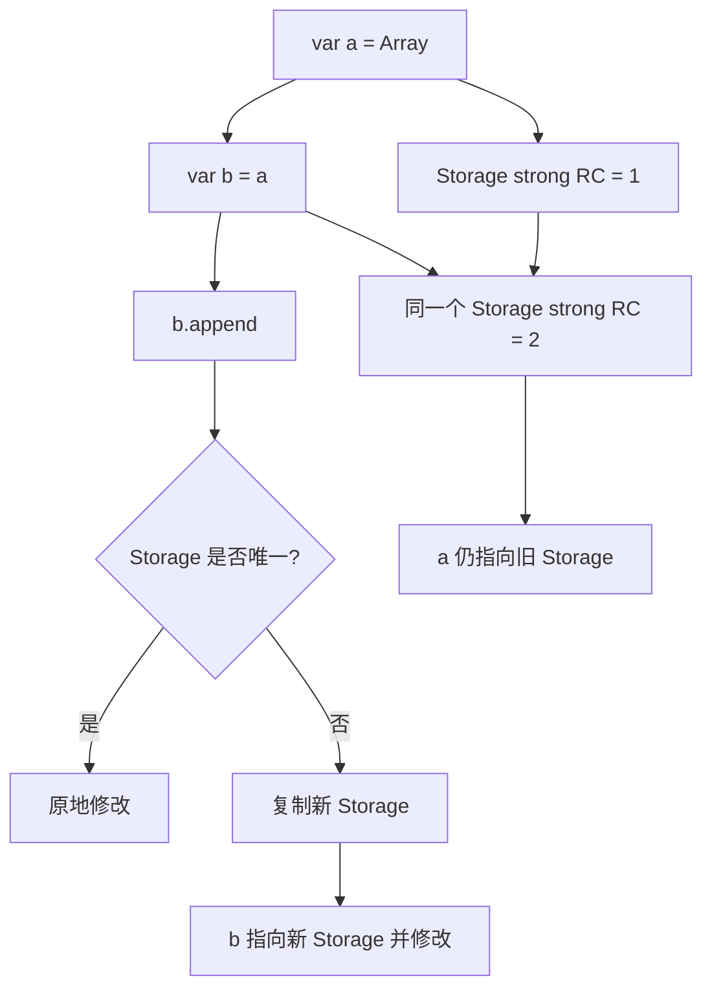

+++
date = '2026-06-16T09:06:27+08:00'
draft = false
title = 'Swift 面试：值语义、COW 与集合源码解析'
tags = ['Swift', '值语义', 'Copy-on-Write', 'Array', 'String', '源码分析', '面试']
categories = ['iOS开发']
weight = 3
+++

# Swift 面试：值语义、COW 与集合源码解析

Swift 的 `Array`、`String`、`Dictionary` 都表现为值类型，但它们不可能每次赋值都完整复制底层存储。面试官问值语义和 COW，真正想看的是你能不能说清楚：**值语义是语言语义，COW 是性能实现；集合表面是 struct，底层经常共享引用存储；写入前靠唯一性检查决定是否复制。**

这篇文章从面试题出发，把结论落到 Swift 标准库源码里的 Array buffer、String guts、Dictionary storage 和 `isKnownUniquelyReferenced`。

## 面试高频问题

- Swift 的 struct 为什么常说是值语义？
- Array 赋值时一定会复制底层元素吗？
- Copy-on-Write 的触发条件是什么？
- `isKnownUniquelyReferenced` 检查的到底是什么？
- Array、ContiguousArray、ArrayBuffer、Storage 是什么关系？
- String 为什么不能用整数下标随机访问？
- String.Index 为什么不是一个简单的 Int？
- Dictionary 也是 COW 吗？
- ArraySlice 为什么可能持有原数组存储？
- 值类型里包含 class 引用，还算值语义吗？

## 30 秒回答版

Swift 的值语义是说：从语言使用者角度看，赋值、传参、修改不会意外影响另一个值。但这不等于底层每次都立即复制。

标准库集合通常用 Copy-on-Write 实现：多个值可以共享同一份堆上 buffer；只有当某个值要写入时，才检查底层 buffer 是否唯一引用。如果唯一，就原地修改；如果不唯一，就复制一份新 buffer 再修改。

所以：

```text
值语义：用户看到的是独立值
COW：实现上先共享，写入前再判断是否复制
ARC：维护底层 buffer 的引用计数
isUnique：让 COW 判断能否原地修改
```

面试可以这样回答：

> Swift 的 Array 是 struct，但它内部持有引用语义的 storage。赋值时通常只复制结构体里的引用；真正写入时通过唯一性检查决定是否复制底层 storage。这让 Array 同时具备值语义和接近引用共享的性能。

## 源码定位

下面链接指向 `swiftlang/swift` 的固定 commit，方便线上阅读。

| 主题 | 源码位置 | 重点 |
| --- | --- | --- |
| Array 主实现 | [`stdlib/public/core/Array.swift`](https://github.com/swiftlang/swift/blob/a91d653b3703a41a8f557ccc1ba8fbbccec203e4/stdlib/public/core/Array.swift) | Array 的公开接口和 mutating 路径 |
| Array Buffer | [`stdlib/public/core/ArrayBuffer.swift`](https://github.com/swiftlang/swift/blob/a91d653b3703a41a8f557ccc1ba8fbbccec203e4/stdlib/public/core/ArrayBuffer.swift) | Array 内部 buffer 抽象 |
| 连续存储 Buffer | [`stdlib/public/core/ContiguousArrayBuffer.swift`](https://github.com/swiftlang/swift/blob/a91d653b3703a41a8f557ccc1ba8fbbccec203e4/stdlib/public/core/ContiguousArrayBuffer.swift) | 连续内存存储实现 |
| ManagedBuffer | [`stdlib/public/core/ManagedBuffer.swift`](https://github.com/swiftlang/swift/blob/a91d653b3703a41a8f557ccc1ba8fbbccec203e4/stdlib/public/core/ManagedBuffer.swift) | Header + Tail Elements 的通用 buffer 模型 |
| Dictionary Storage | [`stdlib/public/core/DictionaryStorage.swift`](https://github.com/swiftlang/swift/blob/a91d653b3703a41a8f557ccc1ba8fbbccec203e4/stdlib/public/core/DictionaryStorage.swift) | Dictionary 底层存储 |
| String 主实现 | [`stdlib/public/core/String.swift`](https://github.com/swiftlang/swift/blob/a91d653b3703a41a8f557ccc1ba8fbbccec203e4/stdlib/public/core/String.swift) | String 的公开语义 |
| String Guts | [`stdlib/public/core/StringGuts.swift`](https://github.com/swiftlang/swift/blob/a91d653b3703a41a8f557ccc1ba8fbbccec203e4/stdlib/public/core/StringGuts.swift) | String 内部表示 |
| String Index | [`stdlib/public/core/StringIndex.swift`](https://github.com/swiftlang/swift/blob/a91d653b3703a41a8f557ccc1ba8fbbccec203e4/stdlib/public/core/StringIndex.swift) | Unicode-aware index |
| COW 优化 | [`SwiftCompilerSources/Sources/Optimizer/InstructionSimplification/SimplifyBeginCOWMutation.swift`](https://github.com/swiftlang/swift/blob/a91d653b3703a41a8f557ccc1ba8fbbccec203e4/SwiftCompilerSources/Sources/Optimizer/InstructionSimplification/SimplifyBeginCOWMutation.swift) | 编译器对 COW mutation 的简化 |

## 值语义是什么？

先不要从实现讲，先从语义讲。

```swift
var a = [1, 2, 3]
var b = a
b.append(4)

print(a) // [1, 2, 3]
print(b) // [1, 2, 3, 4]
```

从使用者角度，`b` 的修改不应该影响 `a`。这就是 Array 的值语义。

但如果每次 `var b = a` 都把所有元素复制一遍，性能会很差。尤其是大数组、字符串、字典，在传参和返回值里非常常见。

所以 Swift 采用 COW：

```text
赋值时：复制 Array 这个小 struct，内部 storage 仍共享
读取时：共享无问题
写入前：检查 storage 是否唯一
  - 唯一：原地改
  - 不唯一：复制 storage，再改
```

**已确认事实：** Swift 标准库中 Array、String、Dictionary 都有内部 storage / buffer 层，公开类型保持值语义，内部通过引用存储和唯一性检查优化复制成本。

**机制推导：** 值语义是 API 层承诺；COW 是满足这个承诺的实现策略，不是语言层要求每次都 eager copy。

## Array 的三层结构

可以把 Array 简化成三层：

```text
Array<Element>       // 对外的值类型接口
└── _ArrayBuffer     // 内部 buffer 抽象
    └── Storage      // 堆上连续存储，受 ARC 管理
```

也就是说：

```swift
var a = [1, 2, 3]
var b = a
```

这一步通常只是让 `a` 和 `b` 的 buffer 引用指向同一个底层 storage。只有 `b.append(4)` 时，才需要判断 storage 是否还能安全复用。

### 写入前的核心判断

COW 的关键不是“复制”，而是“写入前判断是否唯一”。伪代码如下：

```swift
mutating func append(_ newElement: Element) {
    if !buffer.isUniquelyReferenced {
        buffer = buffer.copy()
    }
    buffer.appendInPlace(newElement)
}
```

真实源码会比这复杂，因为要处理容量、桥接、元素初始化、异常路径、优化器语义标记等，但核心模型就是这个。

面试回答：

> Array 的 mutating 操作会先保证底层 buffer 是唯一可写的；如果不是唯一，就复制 buffer，之后再修改。这样可以维持值语义，同时避免不必要的复制。

## `isKnownUniquelyReferenced` 检查什么？

`isKnownUniquelyReferenced` 是理解 COW 的关键函数。

它的语义可以简化成：

```swift
isKnownUniquelyReferenced(&object)
```

检查 `object` 指向的 class 实例是否只有一个强引用。COW 自定义类型常见写法是：

```swift
final class Storage {
    var values: [Int]

    init(_ values: [Int]) {
        self.values = values
    }
}

struct MyArrayLike {
    private var storage: Storage

    mutating func append(_ value: Int) {
        if !isKnownUniquelyReferenced(&storage) {
            storage = Storage(storage.values)
        }
        storage.values.append(value)
    }
}
```

这里有几个面试重点：

1. 参数必须是 `inout`，因为唯一性检查和优化器要把这次访问当成一次特殊的可变访问。
2. 检查的是强引用唯一性，不是“源码里是否只有一个变量名”。
3. 它适合 COW storage 这种内部 class，不是用来判断任意对象业务生命周期。

它和 ARC 的关系是：

```text
ARC 维护 strong refcount
isKnownUniquelyReferenced 读取 strong refcount 是否为 1
COW 根据结果决定是否复制
```

## COW 和 ARC 的关系

COW 不自己发明一套计数系统，而是利用 ARC 已有的引用计数。

在 ARC 文章里我们说过，Swift 原生对象有 `metadata + refCounts`。集合的底层 storage 是堆对象，就可以通过引用计数判断是否被多个值共享。

```text
var a = [1, 2, 3]
var b = a

底层 storage strong RC ≈ 2
b.append(4)
  -> 不是唯一引用
  -> 复制 storage
  -> b 指向新 storage
  -> a 保持旧 storage
```

如果没有 `b = a`，只有：

```swift
var a = [1, 2, 3]
a.append(4)
```

底层 storage 是唯一引用，就可以直接在原 buffer 上追加，避免复制。

## Dictionary 也是 COW 吗？

是。

Dictionary 的底层比 Array 复杂，因为它不是简单连续元素数组，而是哈希表结构，涉及：

- bucket
- hash
- key storage
- value storage
- occupancy / bitmap
- resize / rehash

但语义仍然是值语义。复制 Dictionary 变量不会立刻复制整张表；写入时如果 storage 不唯一，才复制底层结构。

面试可以这样答：

> Dictionary 也是值语义集合，底层通过引用 storage 表达哈希表。修改前同样要保证 storage 唯一。只是它复制的不只是元素数组，还包括哈希表元数据、key/value 存储和占用状态。

源码入口可看 [`DictionaryStorage.swift`](https://github.com/swiftlang/swift/blob/a91d653b3703a41a8f557ccc1ba8fbbccec203e4/stdlib/public/core/DictionaryStorage.swift)。

## String 为什么不能用整数下标？

这题几乎必问。

```swift
let s = "Café"
```

肉眼看到的字符数量、Unicode scalar 数量、UTF-8 code unit 数量、UTF-16 code unit 数量可能都不同。

Swift 的 `String` 是 Unicode 正确优先的设计。`String.Index` 不是一个简单 Int，是因为一个“字符”在 Swift 中对应的是 `Character`，也就是 Extended Grapheme Cluster。

例如：

```swift
let s = "🇨🇳"
```

这个国旗看起来是一个字符，但底层由多个 Unicode scalar 组合而成。用整数随机下标会让你很容易切到一个非法边界。

所以 Swift 选择：

```swift
let i = s.startIndex
let j = s.index(after: i)
```

而不是：

```swift
s[0] // 不支持
```

[`StringIndex.swift`](https://github.com/swiftlang/swift/blob/a91d653b3703a41a8f557ccc1ba8fbbccec203e4/stdlib/public/core/StringIndex.swift) 是理解这题的源码入口。

面试回答：

> String 不能用 Int 随机下标，是因为 Swift 的 Character 是扩展字形簇，不是固定宽度 code unit。第 N 个字符的位置需要根据 Unicode 边界计算，String.Index 保存的是可验证的字符串位置状态，而不是简单整数偏移。

## String 的内部表示：StringGuts

`String` 的公开 API 很简单，但内部要兼顾：

- small string
- native Swift string storage
- shared storage
- bridged NSString
- UTF-8 / UTF-16 视图
- grapheme cluster 边界

[`StringGuts.swift`](https://github.com/swiftlang/swift/blob/a91d653b3703a41a8f557ccc1ba8fbbccec203e4/stdlib/public/core/StringGuts.swift) 是内部表示的核心入口。

可以把它理解成：

```text
String
└── _StringGuts
    └── _StringObject / storage representation
```

**机制推导：** String 也是值语义，但底层可能引用共享存储。写入时同样需要考虑是否唯一、是否需要转成 native storage、是否要重新计算索引边界。

## ArraySlice 为什么可能持有原数组？

`ArraySlice` 是视图，不是完整新数组。

```swift
let array = Array(0..<1_000_000)
let slice = array[10..<20]
```

`slice` 只表示原数组的一段范围。为了避免复制，它可能持有原数组 storage。这样很快，但也带来一个陷阱：

> 一个很小的 slice 可能让一个很大的原数组 storage 继续活着。

所以如果你要长期保存小切片，应该考虑显式转成新数组：

```swift
let small = Array(slice)
```

面试回答：

> ArraySlice 是共享存储的切片视图，适合短期处理。长期保存小 slice 可能导致大数组底层 buffer 无法释放。

## 值类型里包含 class 引用，还算值语义吗？

要分情况。

```swift
struct User {
    var name: String
    var profile: Profile // class
}
```

`User` 是 struct，但如果 `profile` 是 class，复制 `User` 时两个值可能共享同一个 `Profile` 实例。修改 `profile` 内部状态，就可能影响两个 `User`。

所以值语义不是“用了 struct 就自动拥有”。更准确地说：

> struct 只保证它自己的赋值和传递是值拷贝。它的字段如果包含引用类型，引用指向的对象仍然可能共享。要实现真正的深层值语义，需要字段本身也具备值语义，或者手动做 COW。

这也是自定义 COW 类型常见的原因：用 struct 包一层 private class storage，并在 mutating 前做唯一性检查。

## 一张图串起 Array COW



这张图可以口头化成一句：

> 读共享，写检查；唯一就原地写，不唯一就复制后写。

## 易错点 / 追问

### 1. Array 是值类型，所以赋值一定复制所有元素吗？

不是。

赋值通常只复制 Array 结构体本身，底层 storage 仍共享。真正复制发生在写入且 storage 不唯一时。

### 2. COW 会不会破坏值语义？

不会。

COW 是内部优化。只要写入前能保证“不会修改其他值可见的共享 storage”，用户看到的仍然是值语义。

### 3. `isKnownUniquelyReferenced` 是否考虑 weak 引用？

面试里重点说：它用于判断强引用唯一性，服务 COW 写入优化。weak / unowned 的存在和强引用唯一性不是同一个问题。

### 4. String 为什么不支持 O(1) 第 N 个字符？

因为 Character 是可变长度的 Unicode grapheme cluster。要找到第 N 个字符通常需要从已知边界向前扫描，不能简单用 `base + n * width`。

### 5. Dictionary 修改为什么可能很贵？

如果 storage 不唯一，修改前要复制哈希表存储；如果容量不足，还可能 rehash。COW 避免的是不必要复制，不是让所有修改都 O(1)。

### 6. 自定义 COW 类型需要注意什么？

- storage 通常用 `final class`
- 对外类型用 `struct`
- 所有 mutating 操作前检查唯一性
- 复制时要做必要的深拷贝
- 不要泄露可变 storage 引用

## 复习小结

这篇文章可以按四层记：

1. **值语义**：用户看到的是独立值，修改一个不影响另一个。
2. **共享存储**：Array、String、Dictionary 表面是 struct，底层常有引用 storage。
3. **COW 检查**：写入前检查 storage 是否唯一，唯一原地改，不唯一复制后改。
4. **Unicode 与集合细节**：String.Index 不是 Int，Dictionary COW 比 Array 更复杂，ArraySlice 可能保留大 storage。

面试最后可以这样总结：

> Swift 集合的高性能来自“值语义 + 引用存储 + Copy-on-Write”的组合。值语义保证 API 行为，ARC 提供引用计数，唯一性检查决定是否复制，标准库再针对 Array、String、Dictionary 各自的存储结构做专门优化。
