+++
title = "选择器"
date = '2024-10-08T00:00:00+08:00'
lastmod = '2024-11-10T00:00:00+08:00'
draft = false
weight = 3
tags = ["面试", "前端", "CSS", "选择器", "ecool"]
categories = ["前端开发", "面试"]
source = "https://fe.ecool.fun/knowledge-learn"
+++
## CSS选取器分类

### 通配符选择器

```css
*{
    margin:0;
    padding:0;
}
```

### 元素（标签）选择器

```css
p{
    color:red;
}
```

### 类选择器

```css
.warning{
    color:red;
}
```

### ID选择器

```css
#warning{
    color:red;
}
```

**优先级**

> !important>行内样式>ID选择器>类、伪类、属性>元素、伪元素>继承>通配符

### 属性选取器

示例html

```html
<ul>
    <li foo>1</li>
    <li foo="abc">2</li>
    <li foo="abc efj">3</li>
    <li foo="abcefj">4</li>
    <li foo="efjabc">5</li>
    <li foo="ab">6</li>
</ul>
```

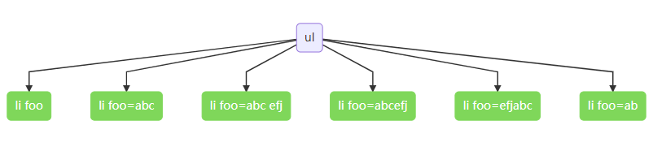

**[attribute]**

```css
[foo]{
    background-color:red;
}
```

> 选择所有带 `foo` 属性的元素

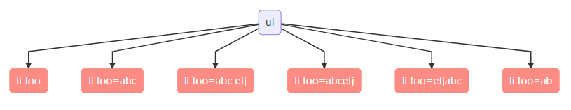

#### [attribute=value]

> 选择 attribute=value 的所有元素。

```css
[foo=abc]{
    background-color:red;
}
```

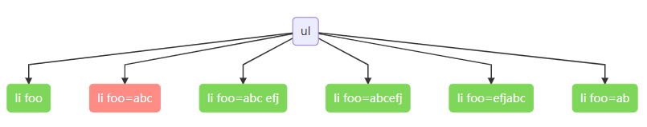

#### [attribute~=value]

> 选择 attribute 属性包含单词 value 的所有元素。

```css
[foo~=abc]{
    background-color:red;
}
```

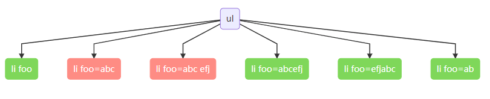

#### [attribute^=value]

> 选择其 attribute 属性值以 value 开头的所有元素。类似正则的 `^`,以什么开始

```css
[foo^=abc]{
    background-color:red;
}
```

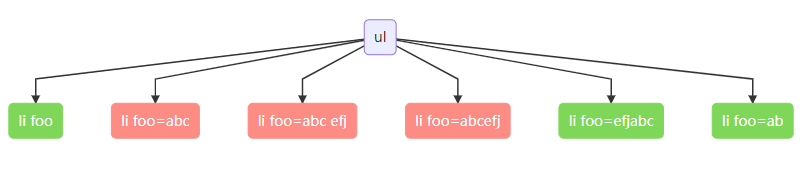

#### [attribute$=value]

> 选择其 attribute 属性值以 value 结束的所有元素。类似正则的 `$`,以什么结束

```css
[foo$=abc]{
    background-color:red;
}
```

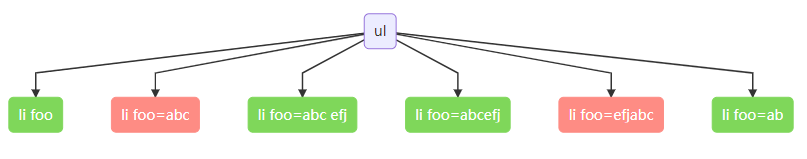

#### [attribute*=value]

> 选择其 attribute 属性中**包含** `value` **子串**的每个元素。

```css
[foo*=abc]{
    background-color:red;
}
```

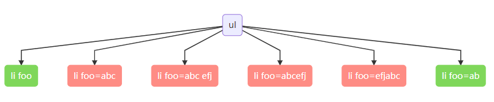

#### [attribute|=value]

> 选择 `attribute` 属性值以 `value` 开头的所有元素。

```css
[foo|=abc]{
    background-color:red;
}
```

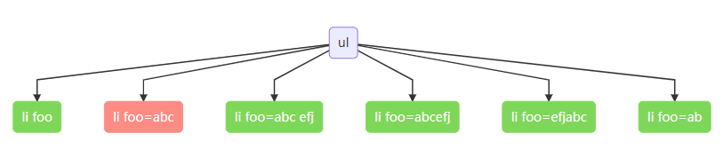

### 文档结构选择器

示例html

```html
<ul>
    <li>
        <h1>h1</h1>
        <p>p1</p>
    </li>
    <li>
        <h1>h1</h1>
        <p>p1</p>
    </li>
</ul>
```

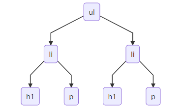

#### 后代选择器 element element

> 选择 element 元素内部的所有 element 元素。

```css
ul li{
    border: 1px solid red;
}
```

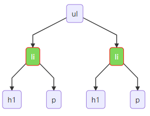

#### 子选择器 element>element

> 选择父元素为 element 元素的所有 element 子元素。

```css
 ul>li>p{
   border: 1px solid red;
}
```

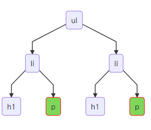

#### 相邻兄弟选择器 element+element

> 选择紧接在 element元素之后的 element 元素。

示例html

```html
<div>
    <h1>h1</h1>
    <p>p1</p>
    <p>p2</p>
    <p>p3</p>
</div>
```

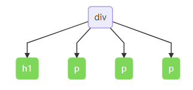

```css
h1+p{
    color:red;
}
```

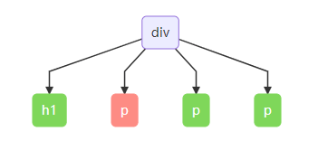

#### 一般兄弟选择器 element1~element2

> 选择前面有 element1 元素的每个 elem 元素。

示例html

```html
<div>
    <h1>h1</h1>
    <p>p1</p>
    <p>p2</p>
    <p>p3</p>
</div>
```


```css
 h1~p{
   border: 1px solid red;
}
```

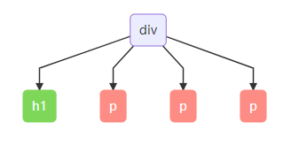

### 伪类选择器

#### :root 文档根元素伪类

```css
:root{
    background-color:red;
}
```

#### :nth-child(n) 孩子选择器

示例html

```html
<div>
    <h1>h1</h1>
    <p>p1</p>
    <p>p2</p>
    <p>p3</p>
</div>
```


```css
div :nth-child(1){
    color:red;
}
```

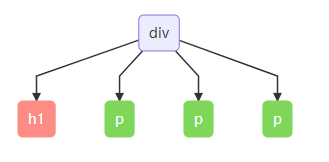

#### :nth-of-type(n) 同类型的第n个元素

```css
div p:nth-of-type(2){
    color: red;
}
```

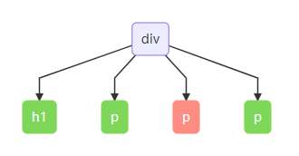

#### element:first-child

> 选择属于父元素element的第一个子元素。 等同 :nth-child(1)

#### element:last-child

> 选择属于父元素element的最后一个子元素。

#### element:first-of-type

> 同类型的第一个子元素

#### element:last-of-type

> 同类型的最后一个子元素

#### element:only-child

> 选择了父元素 element 唯一的子元素

示例html

```html
<div>
    <h1>h1</h1>
    <p>p1</p>
    <p>p2</p>
    <p>p3</p>
</div>
<div>
    <h1>h2</h1>
</div>
```

```css
 div :only-child{
    color: red;
 }
```

最终生效的元素的 div标签下面只有一个元素的 h1 ,即 内容 h2 变成红色，符合条件的都会改变

#### :empty 没有子元素

```html
<!DOCTYPE html>
<html>
<head>
<style>
p:empty
{
width:100px;
height:20px;
background:#ff0000;
}
</style>
</head>
<body>

<h1>这是标题</h1>
<p>第一个段落。</p>
<p></p>
<p>第三个段落。</p>
<p>第四个段落。</p>
<p>第五个段落。</p>

</body>
</html>
```

生效的是 `<p></p>`,没有子元素

#### :nth-last-child(n) 倒数第n个子元素

```html
<!DOCTYPE html>
<html>
<head>
<style>
div :nth-last-child(1){
    color:red;
}
</style>
</head>
<body>
    <div>
        <p>第一个段落。</p>
        <p>第二个段落。</p>
        <p>第三个段落。</p>
        <p>第四个段落。</p>
        <p>第五个段落。</p>
    </div>
</body>
</html>
```

父元素div的倒数第一个元素 被选中

#### element:nth-last-of-type(n)

> 同类型的倒数第n个子元素

```html
<!DOCTYPE html>
<html>
<head>
<style>
div p:nth-last-of-type(2){
    color:red;
}
</style>
</head>
<body>
  <div>
    <h1>h11</h1>
    <p>第一个段落。</p>
    <p>第二个段落。</p>
    <p>第三个段落。</p>
    <h1>h11</h1>
    <p>第四个段落。</p>
    <p>第五个段落。</p>
    <h1>h11</h1>
  </div>
</body>
</html>
```

> `<p>第四个段落。</p>` 处于同类型 p标签 倒数第2个

```css
div p:nth-last-of-type(2n+1){
    color:red;
}
```

> 2n+1(odd):奇数、2n(even)：偶数

#### element:last-of-type

> 同类型的倒数第一个子元素

#### element:first-of-type

> 同类型的第一个子元素

#### element:only-of-type

> 父元素里唯一同类型子元素

```html
<!DOCTYPE html>
<html>
<head>
<style>

div h1:only-of-type{
    color: red;
}

</style>
</head>
<body>
<div>
    <h1>h1</h1>
    <p>p1</p>
    <p>p2</p>
    <p>p3</p>
    <h1>h1</h1>
</div>
<div>
    <h1>h2</h1>
</div>
</body>
</html>
```

> `<h1>h2</h1>` 符合，被选中

#### a:link

> 没有访问过的状态

#### a:active

> 链接正在被点击

#### a:hover

> 选择鼠标指针位于其上的链接。

#### a:visited

> 选择所有已被访问的链接。

#### :focus

> :focus 选择器用于选取获得焦点的元素。

提示：接收键盘事件或其他用户输入的元素都允许 :focus 选择器。

#### :enabled / :disabled

> 选择每个启用的 `input` 元素 / 选择每个禁用的 `input` 元素

#### :checked

> 选择每个被选中的 `input` 元素。自定义开关可以用这个实现

#### :not(selector)

> 选择非 selector 元素的每个元素。（反向选择）

### 伪元素选择器

#### element::first-line

```html
<!DOCTYPE html>
<html>
<head>
<style>

p:first-line{
    background-color:yellow;
}

</style>
</head>
<body>
<h1>WWF's Mission Statement</h1>
<p>To stop the degradation of the planet's natural environment and to build a future in which humans live in harmony with nature, by; conserving the world's biological diversity, ensuring that the use of renewable natural resources is sustainable, and promoting the reduction of pollution and wasteful consumption.</p>
</body>
</html>
```

> p 元素的第一行发生改变

#### element::first-letter

```html
<!DOCTYPE html>
<html>
<head>
<style>
h1:first-letter{
    color:yellow;
}
</style>
</head>

<body>
<h1>WWF's Mission Statement</h1>
</body>
</html>
```

> 直接第一个字符变黄，如果JavaScript做的话，需要获取字符串，再获取第一个字符，再改变其颜色

#### element::before

> 在每个 element 元素的内容之前插入内容。我们更多的可能是当作一个div来用

#### element::after

> 在每个element元素的内容之后插入内容。我们可能更多的是用来清除浮动或验证表单提示等其它

#### ::selection

> 选择被用户选取的元素部分。

## 常见考点

### 1. **选择器基础**

- 请简述 CSS 选择器的概念。选择器的作用是什么？
- CSS 选择器分为哪几种类型？请举例说明每种类型。<br>
  - 元素选择器
  - 类选择器
  - ID 选择器
  - 属性选择器
  - 伪类选择器
  - 伪元素选择器

### 2. **基础选择器**

- `div`, `.class`, `#id` 分别是什么选择器？它们有什么区别？
- 选择器的优先级是如何计算的？请举例说明 CSS 选择器的优先级规则。
- 何时应该使用类选择器而不是 ID 选择器？
- `*` 通配符选择器的作用是什么？它会影响页面性能吗？

### 3. **组合选择器**

- 请解释并举例说明以下组合选择器的用法：<br>
  - 后代选择器（`space`）：`div p`
  - 子元素选择器（`>`）：`div > p`
  - 相邻兄弟选择器（`+`）：`div + p`
  - 通用兄弟选择器（`~`）：`div ~ p`
- 这些组合选择器的作用是什么？它们如何影响元素的匹配范围？

### 4. **属性选择器**

- 请解释属性选择器的作用，并举例说明如何使用它们：<br>
  - `[type="text"]`
  - `[type^="text"]`
  - `[type$="text"]`
  - `[type*="text"]`
- 什么是属性选择器的精确匹配、前缀匹配、后缀匹配和包含匹配？它们如何使用？

### 5. **伪类选择器**

- 伪类选择器的作用是什么？它们如何帮助实现一些动态效果？
- 常见的伪类选择器有哪些？请解释并举例：<br>
  - `:hover`
  - `:focus`
  - `:active`
  - `:nth-child()`
  - `:nth-of-type()`
  - `:first-child` / `:last-child`
  - `:not()`
  - `:empty`
- 你如何使用 `:nth-child` 或 `:nth-of-type` 来选择特定位置的元素？请举个例子。

### 6. **伪元素选择器**

- 伪元素选择器的作用是什么？它们如何与伪类选择器不同？
- 常见的伪元素选择器有哪些？请解释并举例：<br>
  - `::before`
  - `::after`
  - `::first-letter`
  - `::first-line`
- 如何使用伪元素来创建内容或装饰元素？

### 7. **组合选择器与继承**

- `div p` 和 `div > p` 的区别是什么？它们如何影响子元素的选择范围？
- 请解释 CSS 选择器中的继承机制。例如，父元素设置的字体样式如何影响子元素？

### 8. **优先级与权重**

- CSS 选择器的优先级计算规则是什么？如何根据选择器的权重来决定样式应用的顺序？
- 请给出一个选择器的优先级计算实例，说明如何处理同一元素上有多个规则时的冲突。

### 9. **选择器性能**

- 当页面中有大量元素时，如何选择器的选择方式可能影响性能？如何优化选择器以提高页面性能？
- `div p`, `div > p` 和 `.class p` 选择器性能的差异是什么？如何选择最优的选择器？

### 10. **CSS 选择器的作用域与继承**

- CSS 选择器的作用域是如何影响样式的应用的？在什么情况下需要使用 `!important`？
- 请举例说明如何使用 CSS 选择器来设置样式，确保只有特定的元素被影响，不会意外影响到其他部分。

### 11. **特定场景下的选择器**

- 如何使用 CSS 选择器来选择偶数行或奇数行的元素？
- 如何选择一个列表中除了第一个和最后一个项外的所有元素？
- 如何使用 CSS 选择器对特定的表单元素（如文本框或按钮）进行样式设置？
- 如何使用选择器来选择所有未完成的任务（例如，待办事项列表中的未选中项）？

### 12. **多重选择器**

- 如何使用多个选择器来应用相同的样式？请解释 `,`（逗号）分隔符的作用，并举例。
- 在多个选择器匹配时，CSS 是如何应用样式的？它如何处理多个选择器的冲突？
