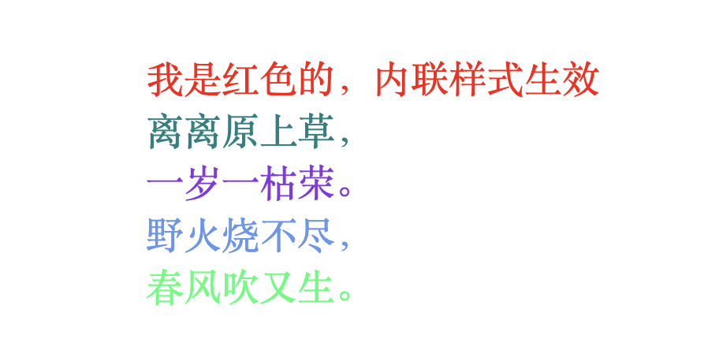

+++
title = "优先级"
date = '2024-10-10T00:00:00+08:00'
lastmod = '2024-11-10T00:00:00+08:00'
draft = false
weight = 4
tags = ["面试", "前端", "CSS", "优先级", "ecool"]
categories = ["前端开发", "面试"]
source = "https://fe.ecool.fun/knowledge-learn"
+++
在前端面试中，经常会遇到CSS选择器的问题三连：

1. 说一下CSS的选择器有哪些
2. 优先级是怎样的
3. 权重计算方式

今天就来给大家介绍选择器的优先级和权重计算方式。

## 优先级是什么？有什么用？

先提出一个问题：如果一个元素通过多种方式设置了字体大小，那么浏览器在最后渲染时会使用哪个属性值呢？

其实，浏览器会通过优先级来判断哪些属性值与一个元素最为相关，从而在该元素上应用这些属性值。优先级是基于不同种类选择器组成的匹配规则。

换种说法，优先级就是分配给指定的 CSS 声明的一个权重，它由 **匹配的选择器** 中的 **每一种选择器类型的数值** 决定。

总结一下：

- 权重决定了你css规则怎样被浏览器解析直到生效，css权重关系到你的css规则是怎样显示的。
- 当很多的样式被应用到某一个元素上时，权重决定哪种样式生效。
- 每个选择器都有自己的权重。你的每条css规则，都包含一个权重级别。 这个级别是由不同的选择器加权计算的，通过权重，不同的样式最终会作用到你的网页中 。
- 如果两个选择器同时作用到一个元素上，权重高者生效。

## 权重的计算规则

接着介绍权重的计算规则：

- 第一优先级：`!important`会覆盖页面内任何位置的元素样式
- 内联样式，如`style="color: green"`，权值为**1000**
- ID选择器，如`#app`，权值为**0100**
- 类、伪类、属性选择器，如`.foo`, `:first-child`, `div[class="foo"]`，权值为**0010**
- 标签、伪元素选择器，如`div::first-line`，权值为**0001**
- 通配符、子类选择器、兄弟选择器，如`*, >, +`，权值为**0000**
- 继承的样式没有权值

权值计算公式：

> `权值` = `第一等级选择器` x `个数`，`第二等级选择器` x `个数`，`第三等级选择器` x `个数`，`第四等级选择器` x `个数`

比如：

| 选择器 | 千位 | 百位 | 十位 | 个位 | 优先级 |
| --- | --- | --- | --- | --- | --- |
| h1 | 0 | 0 | 0 | 1 | 0001 |
| h1 + p::first-letter | 0 | 0 | 0 | 3 | 0003 |
| li > a[href*="en-US"] > .inline-warning | 0 | 0 | 2 | 2 | 0022 |
| #identifier | 0 | 1 | 0 | 0 | 0100 |
| 内联样式 | 1 | 0 | 0 | 0 | 1000 |

## 权重的比较规则

当两个权值进行比较的时候，是从高到低逐级将等级位上的权重值（如 权值 1,0,0,0 对应--> 第一等级权重值，第二等级权重值，第三等级权重值，第四等级权重值）来进行比较的，而不是简单的 1000个数 + 100个数 + 10个数 + 1个数 的总和来进行比较的，换句话说，低等级的选择器，个数再多也不会越等级超过高等级的选择器的优先级的。

下面通过几个例子进行比较规则的说明。

### 示例一

假设下面样式都作用于同一个节点元素`span`，判断下面哪个样式会生效

```css
body#god div.dad span.son {width: 200px;}
body#god span#test {width: 250px;}
```

比较规则说明：

- 先比较高权重位，即第一个样式的高权重为 `#god` = 100
- 第二个样式的高权重为 `#god` + `#text` = 200
- 100 < 200
- 所以最终计算结果是取 `width: 250px;`
- 若两个样式的高权重数量一样的话，则需要比较下一较高权重！

### 示例二

```html
<style type="text/css">
     #parent p { background-color: red;  }
      div .a.b.c.d.e.f.g.h.i.j.k p{ background-color: green;
</style>
......
<div id="parent">
     <div class="a b c d e f g h i j k">
         <p>xxxx</p>
     </div>
</div>
```

如果按照相加的错误方法，如果按照相加的规则的话，上述例子会为：

```
  qz1 = 100 + 1 = 101
  qz2 = 1 + 10*11 + 1 = 112
  qz1 < qz2
```

这样得出结论：第二条样式优先级高，背景色为 `green`。

但结果却是 `red`，这也证明了权重是按优先级进行比较的。

总结下比较规则：

- 1000 > 0100，从左向右逐个比较，前一级相等才能往后比较
- 无论是行内样式、内部样式还是外部样式，都是按照以上提到的权重方式进行比较。面试的时候遇到优先级比较，如果答案是：`行内>id>class>元素(标签)`，我们以为给了能令面试官满意的答案，其实不然，比如对同一个元素操作，在权重相等的情况下，后面的样式会覆盖前面的，这样我们给出来的答案就不成立了
- 权重相同的情况下，位于后面的样式会覆盖前面的样式
- 通配符、子选择器、兄弟选择器，虽然权重为0000，但是优先于继承的样式

## !important 例外规则

当在一个样式声明中使用一个 `!important` 规则时，此声明将覆盖任何其他声明。

虽然，从技术上讲，`!important` 与优先级无关，但它与最终的结果直接相关。

**使用 !important 是一个坏习惯，应该尽量避免**，因为这破坏了样式表中的固有的级联规则，使得调试找bug变得更加困难了。

当两条相互冲突的带有 `!important` 规则的声明被应用到相同的元素上时，拥有更大优先级的声明将会被采用。

一些经验法则：

- 一定要优先考虑使用样式规则的优先级来解决问题而不是 !important
- 只有在需要覆盖全站或外部 CSS 的特定页面中使用 !important
- 永远不要在你的插件中使用 !important
- 永远不要在全站范围的 CSS 代码中使用 !important

最后，我们再来看个例子：

```html
<!DOCTYPE html>
<html lang="en">
<head>
    <meta charset="UTF-8">
    <meta name="viewport" content="width=device-width, initial-scale=1.0">
    <title>Document</title>
    <style>
        * {
            padding: 0;
            margin: 0;
            font-size: 24px;
        }
        .main {
            position: absolute;
            top: 50%;
            left: 50%;
            transform: translate(-50%, -50%);
        }
        p {color: yellowgreen} /* 0,0,0,1 */
        .para {color: red} /* 0,0,1,0 */
        .inner p {color: pink} /* 0,0,1,1 */
        .main p[class*="para"] {color: rgb(0, 255, 115)} /* 0,0,2,0 */ /*权重相同，后者覆盖前者*/
        .main p[class="para1"] {color:teal} /* 0,0,2,0 */
        div.main p[class="para2"]{color: blueviolet;} /* 0,0,2,1 */
        .inner p:nth-child(4) {color: cornflowerblue !important;} /*0,0,2,0, !important提升优先级*/
    </style>
</head>
<body>
    <div class="main">
        <div id="app" class="inner" >
            <p style="color: red;">我是红色的，内联样式生效</p>
            <p class="para1">离离原上草，</p>
            <p class="para2">一岁一枯荣。</p>
            <p class="para3">野火烧不尽，</p>
            <p class="para4">春风吹又生。</p>
        </div>
    </div>
</body>
</html>
```

样式呈现的效果如下：



## 常见考点

### 1. **CSS 层叠**

- 请解释什么是 **CSS 层叠**（Cascading）。它是如何影响样式的应用的？
- 当多个 CSS 规则作用于同一元素时，CSS 如何决定哪个规则生效？请简述层叠的过程。
- 在 CSS 层叠中，出现冲突时，样式的优先级是如何确定的？CSS 层叠规则的顺序是什么？

### 2. **CSS 优先级**

- CSS 的优先级（Specificity）是什么？如何计算优先级？
- 请列举并解释以下选择器的优先级从高到低的顺序：<br>
  - 元素选择器（例如 `div`）
  - 类选择器（例如 `.class-name`）
  - ID 选择器（例如 `#id-name`）
  - 内联样式（如 `style="..."`）
  - 通配符选择器（如 `*`）
- 如果出现多个选择器优先级相同的情况，CSS 是如何决定哪个规则生效的？例如，两个类选择器作用于同一个元素。

### 3. **选择器优先级计算**

- 解释如何计算选择器的优先级，例如：`div.class1` 和 `#id1 .class2` 哪个优先级更高？
- 你如何通过调试工具查看一个元素的最终样式？如何知道哪些规则生效？
- 请给出几个例子，展示不同选择器组合的优先级如何影响最终应用的样式。

### 4. **内联样式和外部样式的优先级**

- 内联样式的优先级高于外部样式表的规则，为什么？能否通过 `!important` 来覆盖内联样式？
- 当存在内联样式与外部样式表规则冲突时，哪一方的样式会生效？
- 你如何避免过度使用内联样式以提高代码的可维护性？

### 5. **`!important`**

- `!important` 在 CSS 中是做什么用的？它如何影响样式的优先级？
- 使用 `!important` 时要小心哪些问题？过度使用 `!important` 会带来哪些潜在问题？
- 如何排查 CSS 中 `!important` 导致的样式冲突？

### 6. **CSS 继承**

- 请解释什么是 **CSS 继承**。哪些 CSS 属性是可以继承的，哪些不能继承？
- 请举例说明常见的继承属性，例如 `color`、`font-family` 和 `line-height`。
- CSS 继承是如何工作的？子元素是否会自动继承父元素的样式？
- 如果需要防止某些属性继承到子元素，你该如何做？<br>
  - 比如，如何防止 `font-family` 在子元素中继承？

### 7. **`inherit`、`initial` 和 `unset`**

- `inherit`、`initial` 和 `unset` 这三个关键字有什么区别？它们在继承和样式初始化中分别有什么作用？
- 你如何使用 `inherit` 来强制一个元素继承某个样式？
- `initial` 和 `unset` 在特定情况下的行为是怎样的？它们与默认值有何不同？

### 8. **层叠顺序与 CSS 规则**

- 如果多个选择器的优先级相同，CSS 如何决定哪个规则应用？请解释层叠的顺序。
- CSS 层叠顺序的规则包括样式表的位置、选择器的优先级等，如何理解这些规则？
- 当在样式表中多次定义相同的规则时，最后一条规则会覆盖前面的规则吗？

### 9. **样式表的来源**

- 请列举并解释以下样式表的来源以及它们在层叠和优先级中的影响：<br>
  - 浏览器的默认样式表（user agent stylesheets）
  - 外部样式表
  - 内联样式
  - 嵌入式样式（`<style>` 标签）
- 如何利用浏览器的开发者工具查看每个样式来源？

### 10. **继承与性能**

- 继承样式在性能上有何影响？继承的样式是否会增加浏览器渲染的负担？
- 你如何优化具有复杂继承关系的页面样式，以提高性能？

### 11. **实际应用**

- 请描述一个实际开发中的场景，如何根据层叠和优先级解决样式冲突问题？
- 如果多个 CSS 文件中的样式有冲突，你如何调试和解决这些问题？在多人协作开发时，如何确保 CSS 样式的可维护性？

### 12. **层叠与模块化开发**

- 在模块化开发中（如使用 CSS 模块、SCSS 或 BEM 等方法），如何处理 CSS 层叠问题？
- 你如何确保不同模块间的样式不会相互影响？有哪些方法可以隔离 CSS 样式？

### 13. **层叠顺序与组件库**

- 在使用第三方组件库时，如果该库的样式与项目中的样式发生冲突，你如何通过调整优先级或其他方式解决这些冲突？
- 你如何使用 CSS 变量、`!important` 或 CSS 重置来管理大型项目中的样式冲突？

### 14. **浏览器的默认样式**

- 每个浏览器都有自己的默认样式表（user agent stylesheet）。它对页面样式的影响是什么？
- 如何通过 CSS 重置或标准化（如使用 `normalize.css`）来解决不同浏览器间的样式差异？
