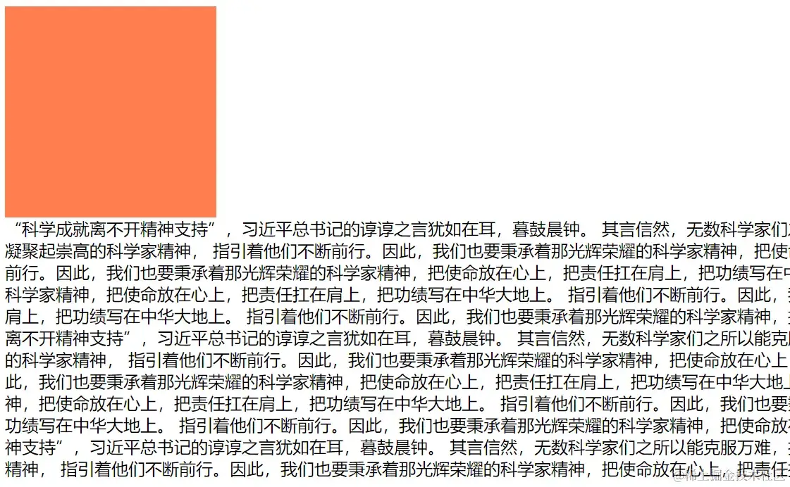
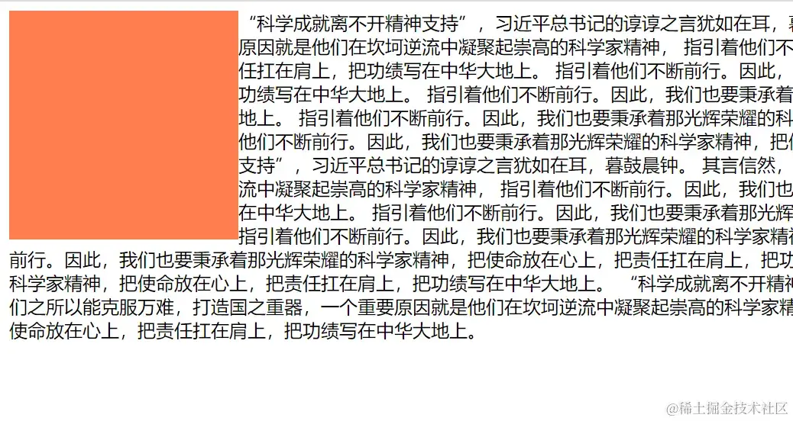
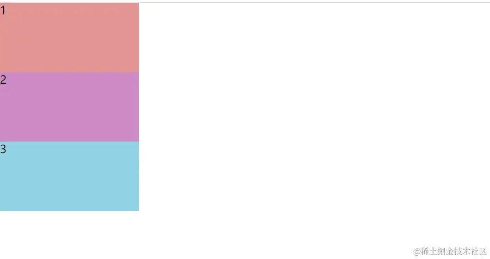
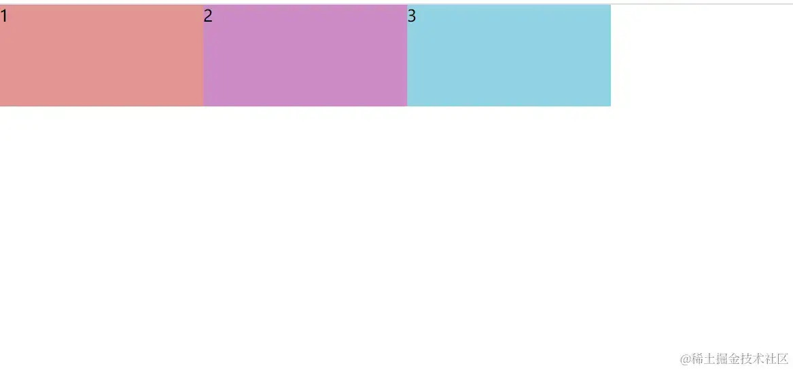
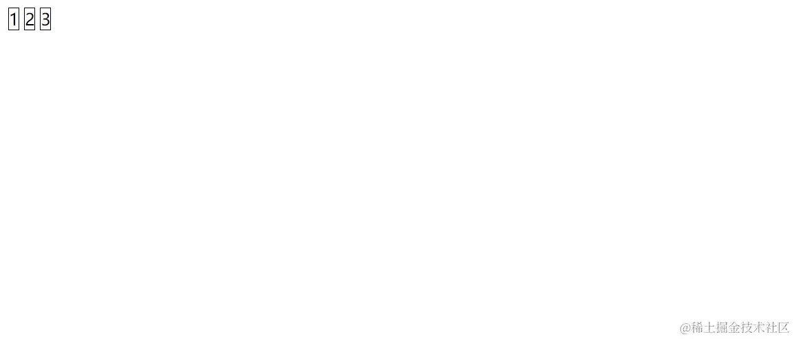
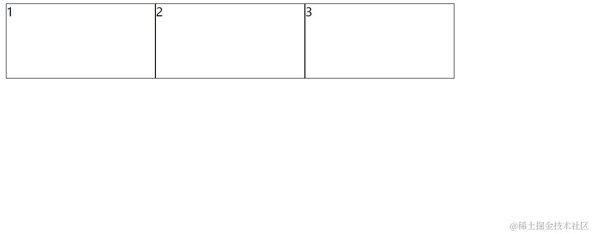
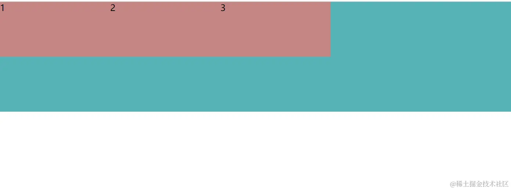
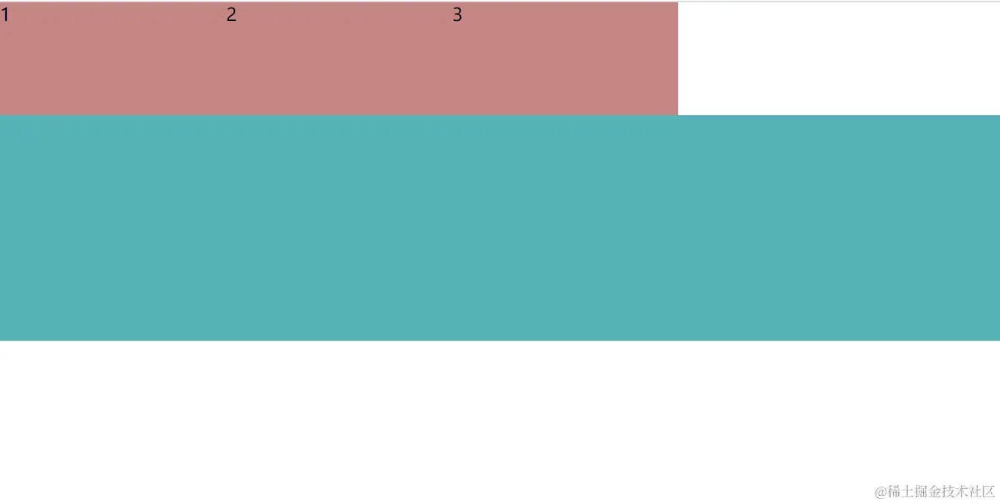
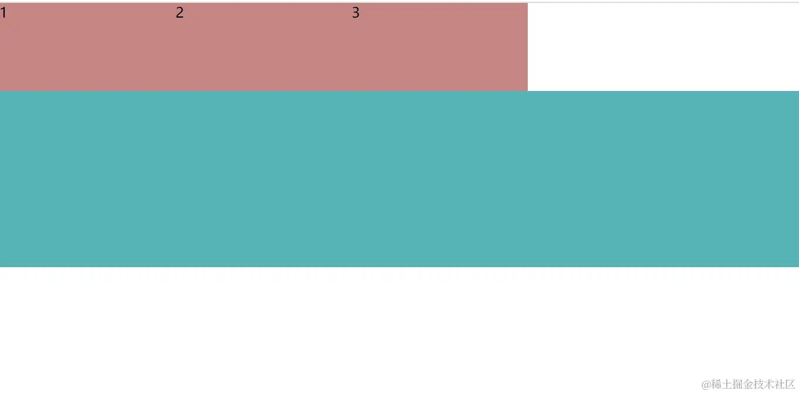

+++
title = "浮动、清除浮动和BFC"
date = '2024-10-10T00:00:00+08:00'
lastmod = '2024-11-10T00:00:00+08:00'
draft = false
weight = 13
tags = ["面试", "前端", "CSS", "浮动、清除浮动和BFC", "ecool"]
categories = ["前端开发", "面试"]
source = "https://fe.ecool.fun/knowledge-learn"
+++
浮动、清除浮动和BFC是前端开发中常见的概念，它们对于页面布局及美化至关重要。

## 浮动

在网页设计中，浮动是一种常见的布局技术，可以让元素脱离文档流，我们来看看它有什么作用吧！

1. **使文字环绕**

代码示例如下：

html结构：

```ini
<div class="box"></div>
<div class="text">一段文字</div>
```

css样式：

```css
 .box{
        width: 200px;
        height: 200px;
        background-color: coral;
    }
```

若不加浮动，则页面是这样的效果：



但若是在box加上float: left;(向左浮动)，则能使文字环绕box这个盒子：

```css
 .box{
        width: 200px;
        height: 200px;
        background-color: coral;
        float: left;
    }
```



2. **让块级元素同行显示**

块级元素本身是占据一整行的，但浮动能让多个块级元素处于同一行，示例如下：

若不加浮动，则多个块级元素各自占据一行：

html结构：

```css
 <ul>
    <li>1</li>
    <li>2</li>
    <li>3</li>
 </ul>

```

css样式：

```css
    *{
        margin: 0;
        padding: 0;
    }
    ul li{
        list-style:none;
        width: 200px;
        height: 100px;
        font-size: 16px;
    }
    li:nth-child(1){/*子容器选择器   */
        background-color: rgb(227, 149, 149);
    }
    li:nth-child(2){
        background-color: rgb(205, 139, 197);
    }
    li:nth-child(3){
        background-color: rgb(145, 212, 227);
    }
```

页面如图：



但若是给li加上浮动属性：

```css
    ul li{
        list-style:none;
        width: 200px;
        height: 100px;
        font-size: 16px;
        float: left;
    }

```

则各个li到同一行去了：



3. **让行内元素可以设置宽高**

span为行内元素，它不能直接设置宽高，就算给它设置宽高，它也不会变，为了看的更明显，我们给它设置一个边框：

html结构：

```css
<div>
    <span>1</span>
    <span>2</span>
    <span>3</span>
</div>
```

css样式：

```css
    span{
        width: 200px;
        height: 100px;
        border: 1px solid #000;
    }
```

页面如下：



但若是加上浮动属性，则设置的宽高会变为有效：

```css
    span{
        width: 200px;
        height: 100px;
        border: 1px solid #000;
        float: left;
    }
```



4. **浮动元素可以使用margin，但是不能使用margin: 0 auto;**

margin用来设置页边距，而`margin: 0 auto;`可以使块级元素居中。加了浮动属性的元素能用margin来设置页边距，但margin: 0 auto;对它是无效的。

## 清除浮动

尽管浮动能够带来美观的页面布局，但有时也会带来一些问题，比如父容器高度塌陷等。因此，我们知道了如何使用浮动，也需要学会如何清除浮动。

1. **给父容器设置高度**

我们看以下代码示例：

html结构：

```xml
 <ul >
    <li>1</li>
    <li>2</li>
    <li>3</li>
    <!-- <div class="clear"></div> class="clear"-->
</ul>
<div class="content"></div>
```

css样式：

```css
    *{
        margin: 0;
        padding: 0;
    }
    ul li{
        list-style:none;
        width: 200px;
        height: 100px;
        background-color: #c58585;
        float: left;
    }
    .content{
        width: 100%;
        height: 200px;
        background-color: rgb(87, 179, 182);
    }

```

使li浮动后，li会脱离文档流，导致别的元素出现在它下面：



但要清除它浮动带来的这种影响，我们可以用给它父容器设置一个高度来实现，在css中给ul加上高度：

```css
    ul{
        height: 100px;
    }
```



2. **增加一个子容器，在子容器身上清除浮动**

若我们增加一个子容器，在子容器身上清除浮动，也可以消除浮动带来的不好的影响，同样用上一个例子：

增加一个子容器：

```css
 <ul >
    <li>1</li>
    <li>2</li>
    <li>3</li>
    <div class="clear"></div>
</ul>
```

在css中清除子容器的浮动：

```arduino
  .clear{
        clear: left;
  }
```

也可以实现同样的效果：



3. **借助伪元素 after 来清除**

还是这个例子，给ul加上clear类：

```css
<ul class="clear">
    <li>1</li>
    <li>2</li>
    <li>3</li>
</ul>
```

在css中设置伪元素after：

```css
.clear::after{
    content: '';
    clear:left;
    display: block;
}
```

最后的页面也是一样的效果。

还有一个方法可以清除浮动，那就是利用BFC，BFC容器可以清除浮动。

## BFC(Block Formatting Context--块级格式化上下文)

BFC 是块级格式化上下文的缩写，它是一种特殊的渲染区域，具有独立的布局规则。创建 BFC 可以解决一些常见的布局问题，比如外边距重叠等。

- 如何创建BFC？给容器设置以下属性能成为BFC容器：<br>
  1. 浮动：float: left | right
  2. 定位：position: absolute | fixed
  3. 行内块：display: inline-block
  4. 表格单元：display: table-cell | table-XXX
  5. overflow: auto | hidden | scroll
  6. 弹性格子：display: flex | inline-flex

### BFC的特征

BFC的效果是让处于BFC内部的元素与外部的元素相互隔离，使内外元素的定位不会相互影响。

1. 内部盒子也会按照文档流的顺序排列
2. bfc容器在计算高度时，会将内部浮动的子元素的高度也计算在内
3. 解决外边距重叠的问题

> 原文：[https://juejin.cn/post/7301201921204011049](https://juejin.cn/post/7301201921204011049)

## 常见考点

### 1. **浮动（Float）**

- **浮动的概念**：什么是浮动？为什么 CSS 中引入 `float` 属性？
- **使用场景**：浮动元素通常在哪些场景下使用？在传统布局中如何使用浮动实现基本的左右排布或文字环绕效果？
- **浮动的影响**：当元素设置为浮动后，会如何影响周围的元素？浮动的元素是否还占据原本的文档流位置？
- **浮动的陷阱**：浮动布局有哪些常见的坑？如父容器高度塌陷，子元素脱离正常文档流导致布局错乱等。

### 2. **清除浮动（Clearfix）**

- **清除浮动的必要性**：为什么需要清除浮动？如果不清除浮动，布局会产生什么问题？
- **清除浮动的方法**：常见的清除浮动方法有哪些？可以分别介绍以下几种：<br>
  - **使用 `clear` 属性**：如何通过在浮动元素后添加一个设置了 `clear: both` 的空元素实现清除浮动？
  - **伪元素清除法**：如何利用伪元素（如 `::after`）来清除浮动？为什么 `content: ""` 和 `display: table` 可以解决浮动问题？
  - **触发 BFC**：如何通过触发 BFC 清除浮动？相对于其他方法，它的优缺点是什么？
- **现代布局替代**：在 CSS Flex 和 Grid 布局越来越普遍的情况下，浮动和清除浮动的场景是否还适用？它们是否会逐渐被替代？

### 3. **BFC（块级格式化上下文）**

- **BFC 的定义**：什么是块级格式化上下文（Block Formatting Context, BFC）？
- **BFC 的特点**：BFC 有哪些特性？例如，BFC 内部的元素不会与外部浮动元素重叠、计算高度时包含浮动元素等。
- **触发 BFC 的方法**：有哪些 CSS 属性可以触发 BFC？请列举常见的几种触发方式：<br>
  - 设置 `overflow: hidden`、`auto`、`scroll`。
  - 设置 `display: inline-block`、`table-cell`、`flex`、`grid`。
  - 设置 `position: absolute`、`fixed` 等。
- **BFC 的应用场景**：在什么情况下会用到 BFC？<br>
  - **清除浮动**：通过触发 BFC 来包裹浮动元素，从而解决父容器高度塌陷问题。
  - **避免外边距合并**：如何利用 BFC 解决上下相邻元素间的外边距合并问题？
  - **布局控制**：BFC 如何帮助控制布局中的重叠和对齐？

### 4. **浮动与 BFC 的应用实例**

- **清除浮动的实例**：如何实现一个两栏布局，左侧导航栏浮动，右侧内容区域自动填充？
- **BFC 的实际应用**：假如有一个容器，内部包含多个浮动元素，该如何处理使容器的高度不塌陷？
- **组合布局**：在使用 BFC 清除浮动的同时，还可以利用 Flex 布局来处理整体布局，避免浮动和 BFC 带来的复杂性。

### 5. **浮动和 BFC 对性能的影响**

- **页面性能考虑**：在现代网页设计中，使用大量浮动和 BFC 是否会影响性能？如何平衡布局方式与性能？
- **替代方案**：在需要清除浮动或控制布局时，是否可以用 CSS Grid 或 Flexbox 替代浮动和 BFC？这些新的布局方式有什么优势？
