+++
title = "新变化"
date = '2024-11-09T00:00:00+08:00'
lastmod = '2024-11-10T00:00:00+08:00'
draft = false
weight = 27
tags = ["面试", "前端", "CSS", "新变化", "ecool"]
categories = ["前端开发", "面试"]
source = "https://fe.ecool.fun/knowledge-learn"
+++
## CSS 发展史

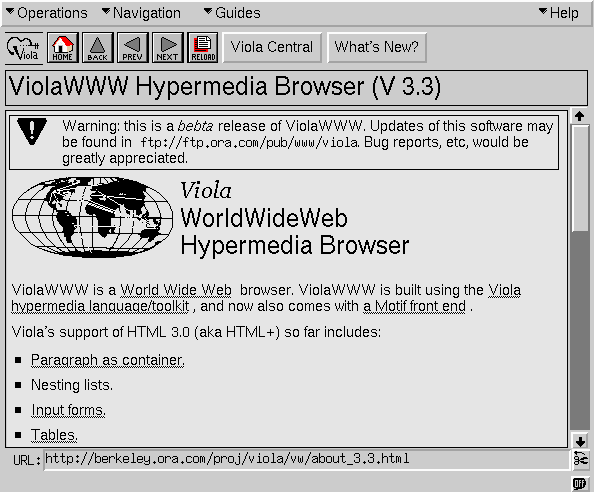

上图是20 世纪 90 年万维网刚出现时，由于当时并没有可以装饰网页的方法，原始的 Web 页面呈现的效果，随着 CSS（层叠样式表，Cascading Style Sheets）的诞生与发展，Web页面的样式有了翻天覆地的变化。

## CSS的发布过程

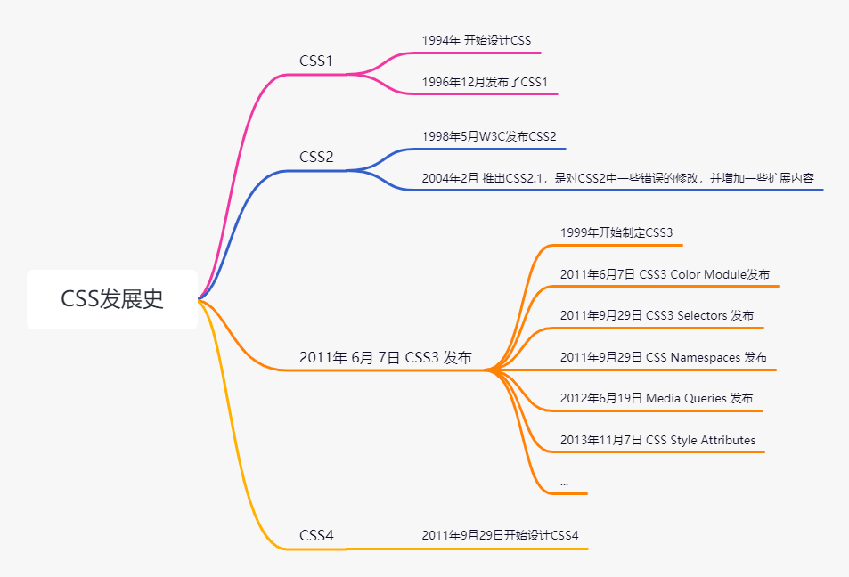

1. CSS1.0 19912月W3C发布了第一个有关样式的标准CSS1.0。这个版本中，已经包含了的相关font的相关属性、颜色与背景的相关属性、文字的相关属性、box的相关属性等。
2. CSS2.0 1985年5月，CSS2.0正式推出。这个版本推荐的是内容和表现效果分离的方式，并开始使用样式表结构。
3. CSS2.1 2004年2月，CSS2.1正式推出。它在CSS2.0的基础上略微做了改动，删除了许多不被浏览器支持的属性
4. CSS3 从2011年开始CSS被分为多个模块单独升级。这些模块统称为CSS3 包含有：

- CSS 选择器level3
- CSS 媒体查询level3
- CSS color level3

5. CSS4 设计中

CSS 标准的制定大概有下面几个步骤

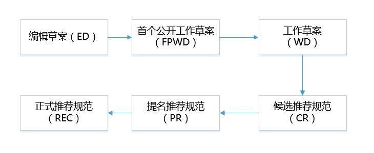

---

下面主要介绍的是与我们日常工作有关联的一些新特性，其中一些已经在主流浏览器中得到了支持，还有一些特性还在草案阶段，可能还会有一些变化。

## CSS 伪类选择器

### is()和where()

在编写css时，有时会需要使用很长的选择器列表来定位具有相同样式的子元素，比如对所有H元素下的span设置为block，之前会这么写:

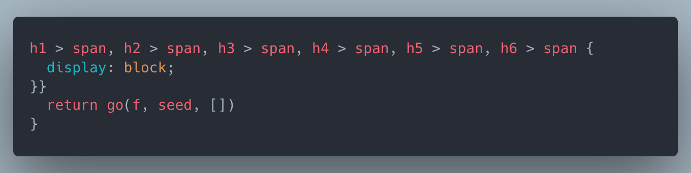

这样写选择器看起来很长，可读性差。 此时，可以使用is()来提高易读性，同时避免使用长选择器

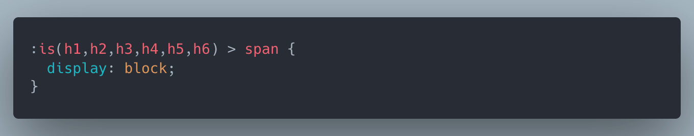

浏览器支持:

- :is() Chrome 88/ Firefox 78/ Edge 88 /Safari 14
- :where() Chrome 88/ Firefox 78/ Edge 88 /Safari 14

注意：

1. is()和where()在使用方法上和其他的伪类选择器一样，可以任意组合排列。
2. is()和where()的功能大体上是一样的，他们的差异性体现在选择器的权重上

- where()选择器没有权重，也就是权重是0
- is()选择器的权重由它的选择器列表中的最搞权重决定

规则示例:

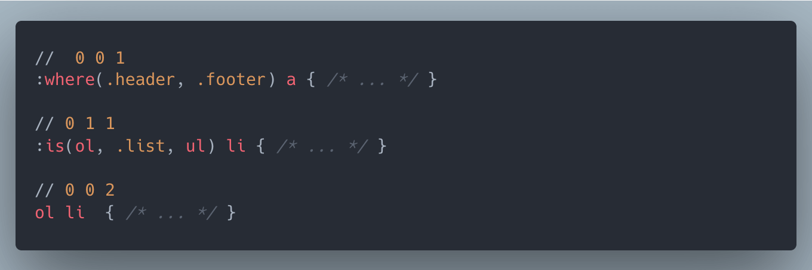

### has()

has()选择器一般被描述为"父选择器"，它接受一个相对的选择器列表，如果至少有一个其他元素与列表中的选择器相匹配，那么它将代表这一个元素。

它的使用方法如下:

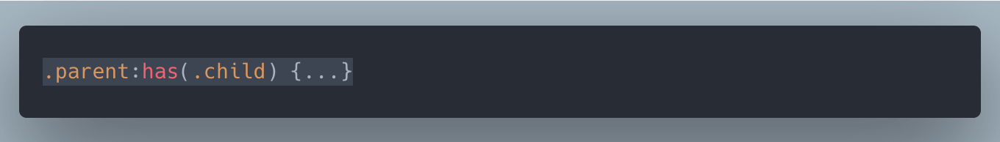

这个选择器的意思是，如果parent元素下有child元素，则选中parent,这也是为什么可以称它为"父选择器"

注意：

has()选择器的权重和is()选择器一样，都由它的选择器列表中权重最高的选择器决定

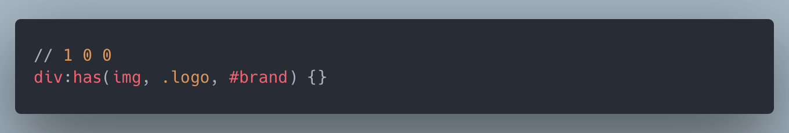

浏览器支持:

这个选择器目前只有Safari支持，且需要在实验性功能中手动开启

- Safari 15.4

---

## CSS 颜色

### hwb()

HWB是一种新的颜色定义函数，它的三个值分别代表色调、白度和黑度。它是一种更人性化的表达颜色的方式，因为它只是一种色调和一定量的白色或黑色来变亮或变暗

hwb()颜色函数产生的颜色也是来自sRGB颜色空间，所以它不会产生新的颜色

浏览器支持:

- Chrome 101/ Firefox 96/ Edge 101 /Safari 15

lch, oklch, lab, oklab, display-p3 等新的颜色空间 2022 年的CSS将提供10个新的颜色空间，每个空间都具有独特的功能，它们相对于sRGB颜色空间能带来更丰富的色彩显示

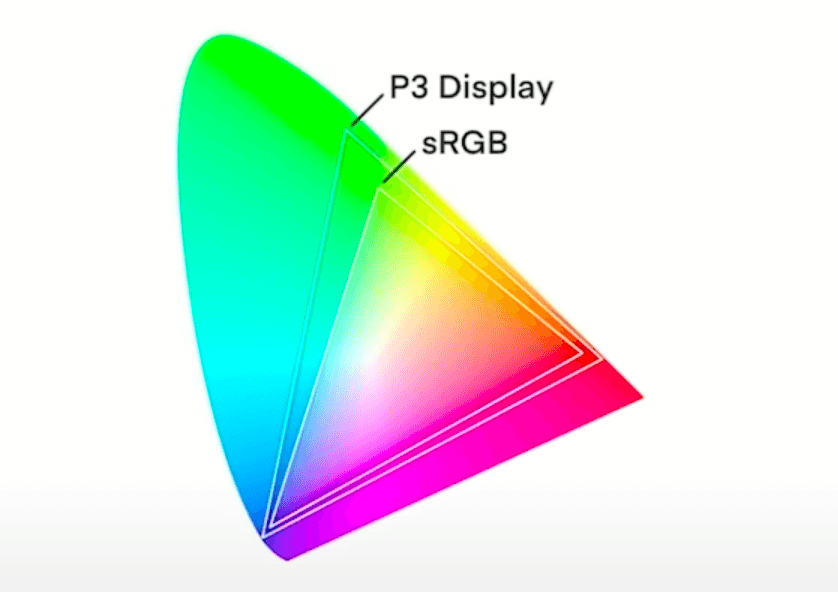

浏览器支持:

- Safari *

### color-mix()

color-mix() 函数接受两个 <color> 值，并在给定的颜色空间中以指定的混合度返回它们混合的结果

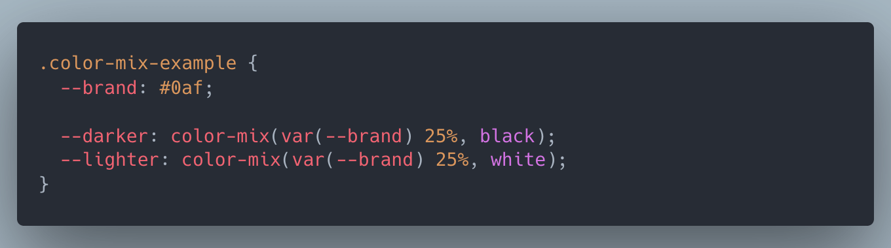

浏览器支持:

- Safari */Firefox *

- color-contrast()

从颜色列表中，输出与第一个参数相比对比度最高的颜色

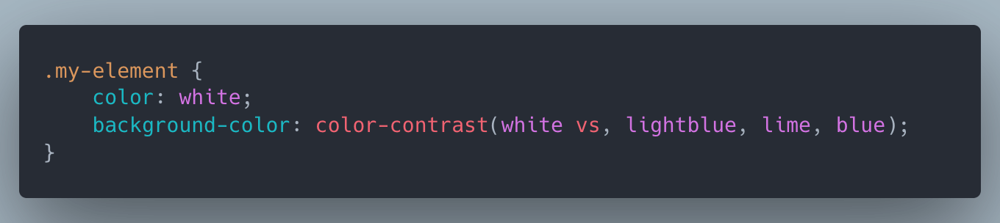

浏览器支持:

- Safari *

### Relative color

Relative color 相当于对色彩通道的解构，并且能够修改通道的值，形成一个新的颜色

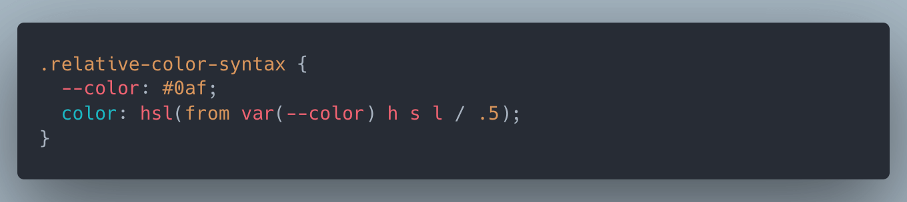

浏览器支持:

- Safari 15

### accent-color

accent-color 可以用来修改内置组件的颜色,并且浏览器能够根据系统的颜色方案(黑白模式)，智能的匹配对比色 目前支持修改的内置组件包括

```html
  - <input type="checkbox">
  - <input type="radio">
  - <input type="range">
  - <progress>
```

它的使用语法如下

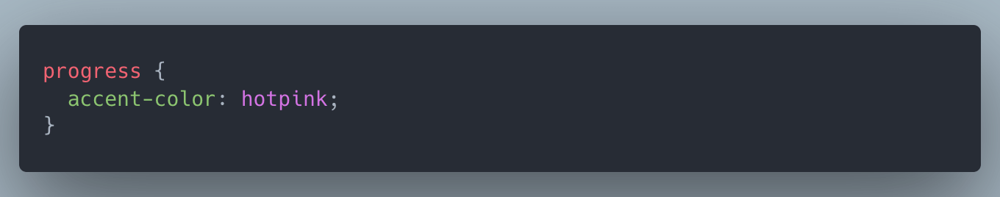

最终的结果：

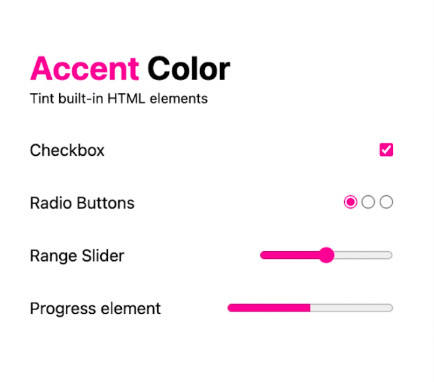

浏览器支持:

- Chrome 93/ Firefox 92/ Edge 93 /Safari 15.4

### 新的颜色定义语法

原本的 rgb() 、hsl() 以及 #rrggbb 等颜色值定义语法规则也做出调整。比如，原本我们使用","分割不同的颜色通道的值，现在可以使用空格

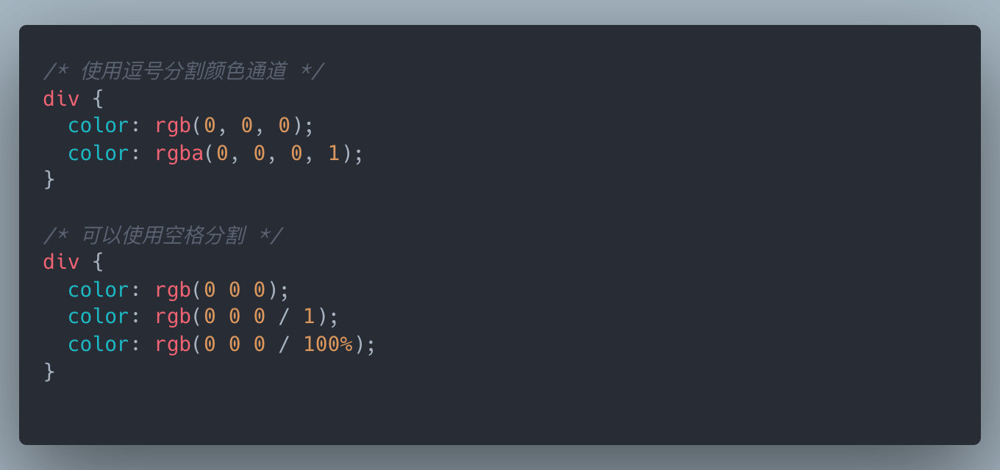

## CSS 语法

### inert

inert是指可以使某些元素变得不可交互，它的效果类似于使用alert()函数后的页面，页面的其他部分都将被冻结，用户只能在指定的部分交互,这个特性在弹框、菜单等交互上可以发挥作用

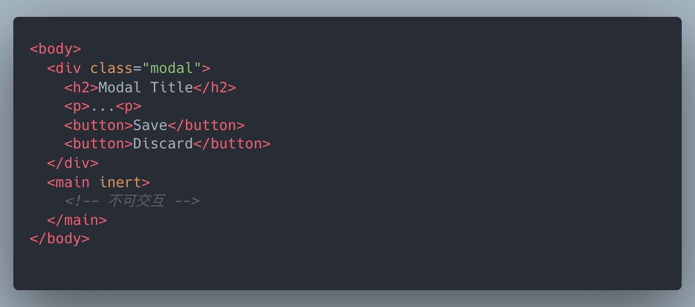

浏览器支持：

- Chrome 102/ Firefox */ Edge 102 /Safari 15.5

### @layer

@layer是2022最受瞩目的css新特性，在@layer之前，加载样式表的顺序非常重要，因为最后加载的样式会覆盖之前加载的样式，这导致了开发人员需要对入口样式表的做细致的管理，而@layer 级联层提供了一种结构化的方式来组织和平衡单一来源中的CSS规则，并最终决定采用谁的规则。

使用@layer,开发者可以在样式文件中，预先定义规则的层级顺序从而去控制不同样式之间的优先级，它的语法如下

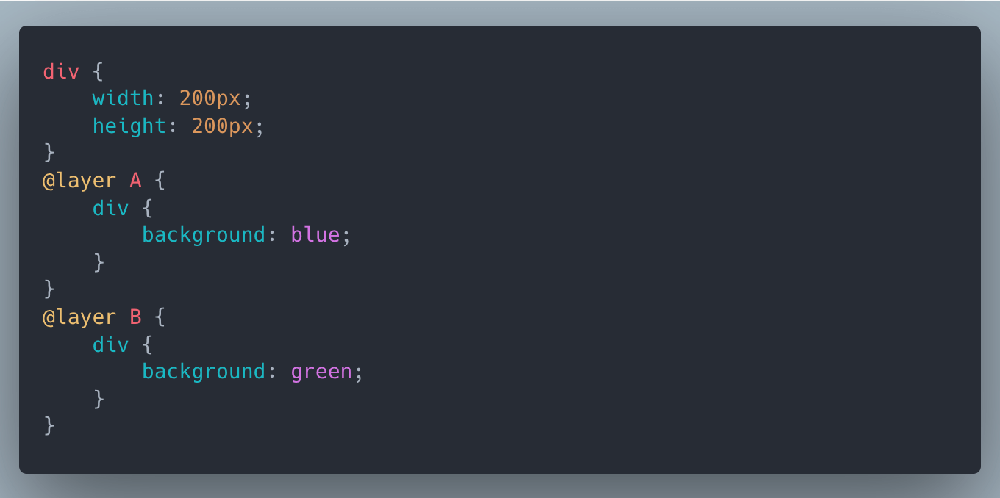

由于 @layer B 的顺序排在 @layer A 之后，所以 @layer B 内的所有样式优先级都会比 @layer A 高，即B>A，所以最终 div 的颜色为 green： @layer 也支持同时命名多个@layer 层,此时它的优先级以命名时的顺序为准，即A > C > B,最终div的颜色为blue

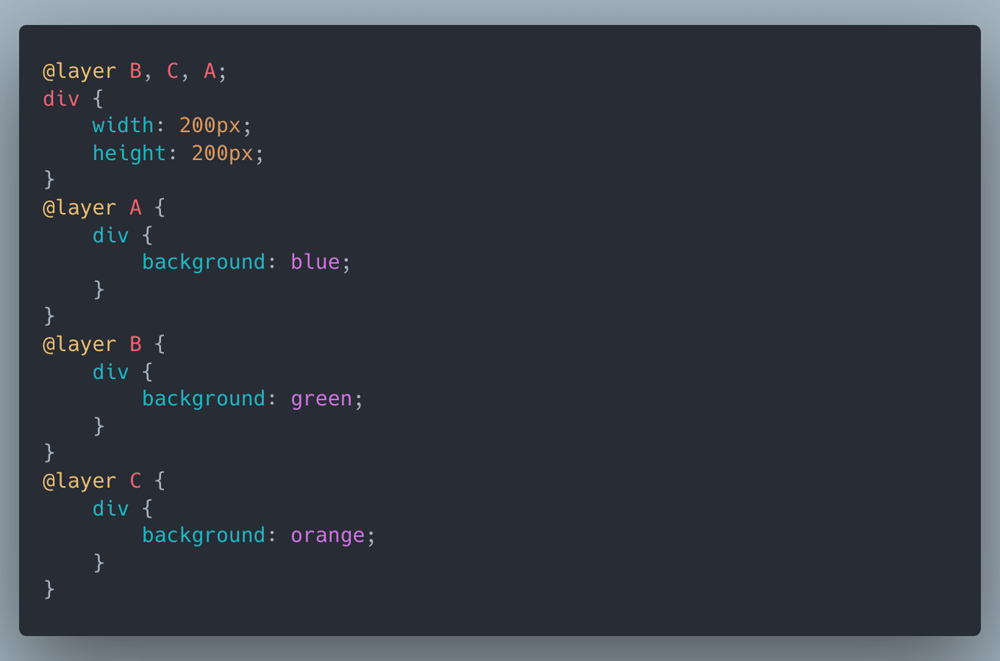

利用@layer特性，我们可以把样式组织在不同的层级中，利用先后顺序，控制全局样式的优先级

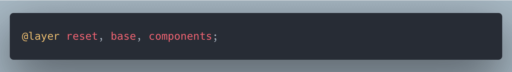

浏览器支持:

- Chrome 99/ Firefox 97/ Edge 99 /Safari 15.4

### @container

在响应式布局中，经常使用媒体查询（Media Queries）检测视窗的宽高，实现元素样式的自动调整。而容器查询使我们能够根据其父元素的大小设置元素的样式，它类似于 @media查询，不同之处在于它根据容器的大小而不是视口的大小进行判断。

它的语法如下:

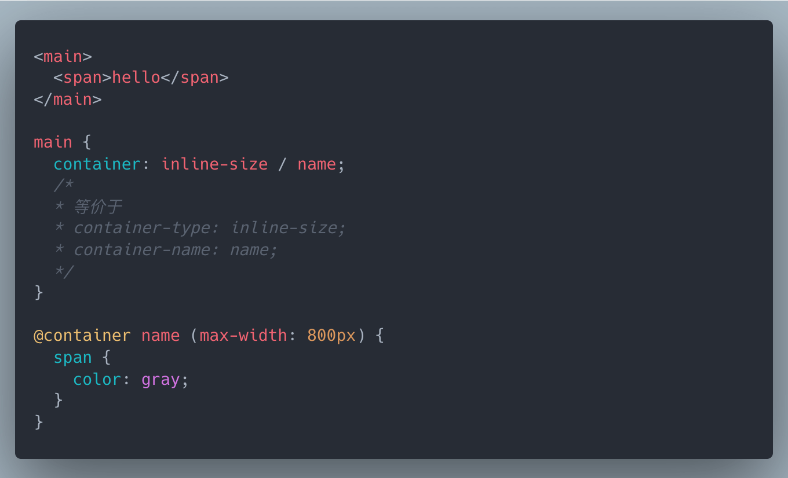

要使用容器查询，需要使用 container 属性（它是 container-type 和 container-name 的缩写）指定一个元素作为容器。container-type 可以是width、height、inline-size、block-size。inline-size 和 block-size 等逻辑属性

### @media

以往在 @media 规则中写判断条件时使用 min-width 和 max-width 较多，但是这种写法不太直观,有一些理解的成本，现在可以使用更熟悉的数学表达式，也就是使用 > 、>= 、< 或 <= 等数学表达式

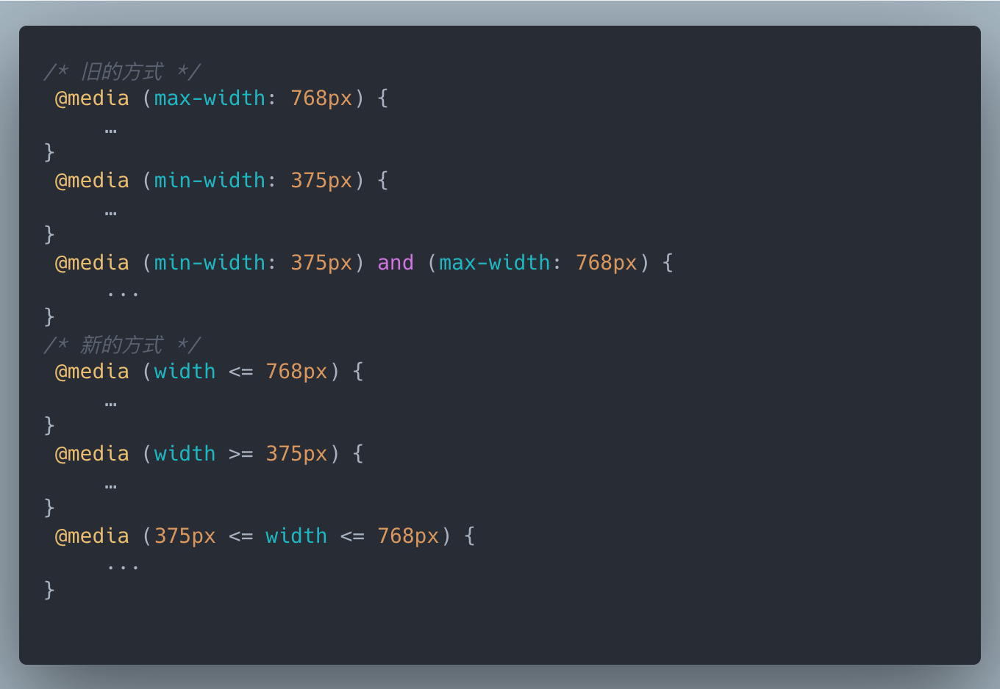

浏览器支持：

- Chrome 104 / Edge 104 / Firefox 63

### @scope

可以使用@scope 将样式限制在指定的上下文中，它的语法如下

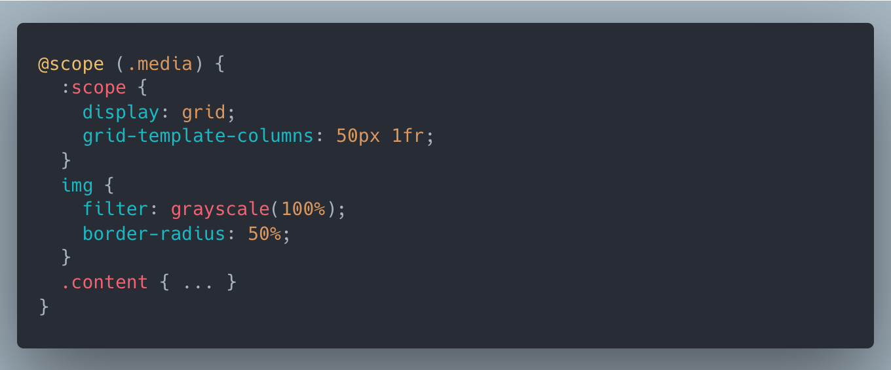

它等同于

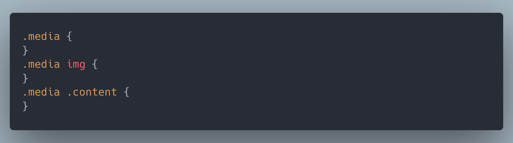

但相对于使用父选择器限定范围的方法，@scope有一个特别的特性是它支持作用域划分 我们可以使用 to 关键词指定@scope的作用域的范围

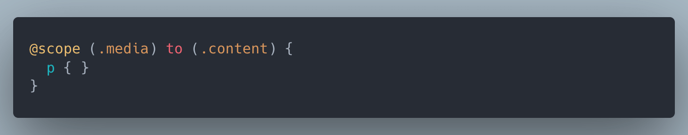

这样，p的样式就只会被应用在.media和.content之间

### @nest

类似sass或者less等预处理器中的嵌套

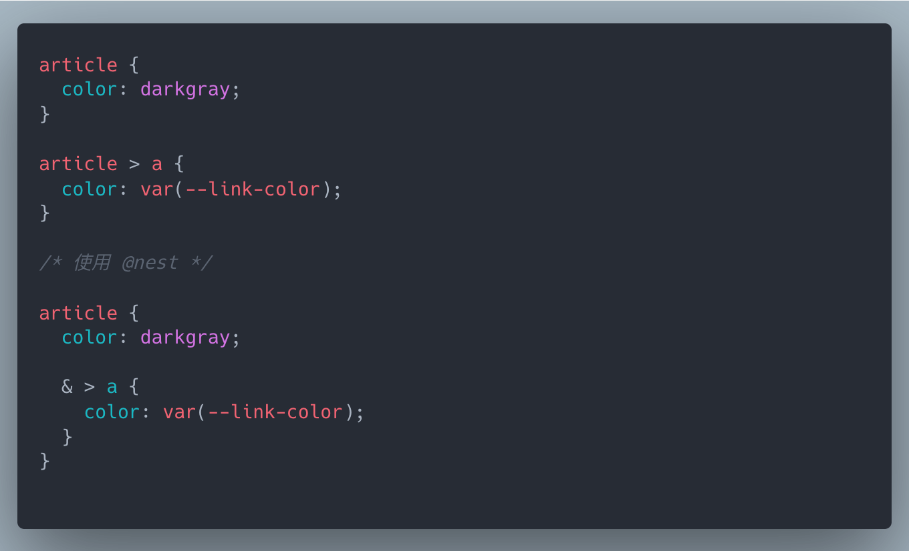

目前还没有浏览器提供支持，但是可以通过Postcss 的插件来提前使用嵌套语法

### @property

在目前的css中，css变量已经大量使用，比如

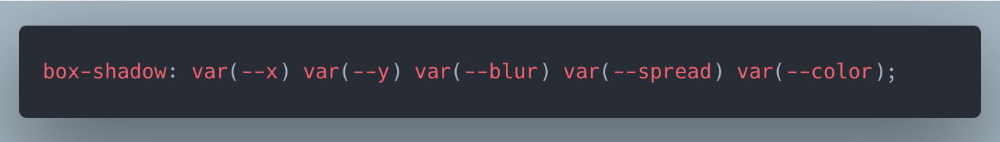

但如果指定的css变量的值是非法的，比如指定：--xx:red，此时会导致样式失效，@property提供了类似于其他编程语言中的类型定义和默认值，它的用法如下:

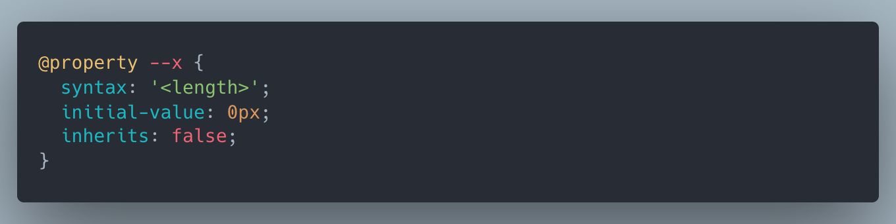

这里指定了 变量--x的类型和默认值，此时如果我们设置了--x:red,浏览器会自动使用它的默认值:0px,确保样式是有效的 浏览器支持：

- Chrome 85/ Edge 85

### @when/@else

@when/@else 是CSS中的条件规则，类似于其他编程语言中的if/else 逻辑。它可以使编写复杂的媒体查询更加符合逻辑。

它的语法如下：

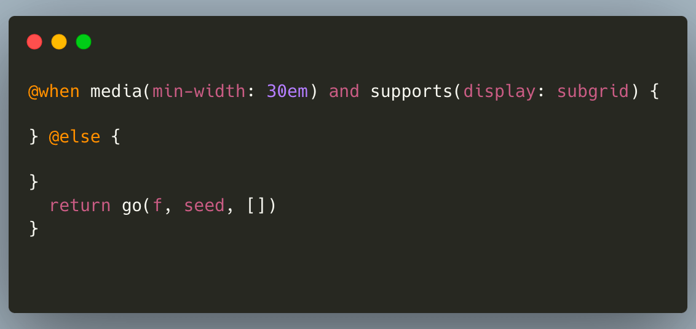

## CSS 单位

### lh和rlh

lh 和 rlh 与 em 和 rem 非常的相似，只不过他们相对的是 line-height 的值计算:

- lh 相对于元素自己的 line-height 计算
- rlh 相对于文档根元素（<html> ）的 line-height 计算

### viewport units

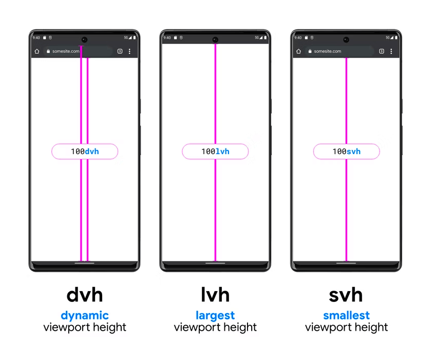

## 滚动

### Overscroll Behavior

目前我们在构建弹框的时候，弹框内容过高会出现滚动条，如果body本身也有滚动条，就会有两个滚动条出现，一个是弹框的，一个是body的,默认情况下，里面的滚动条滚到到底部边缘然后再继续滚动的时候，父滚动条会继续跟着滚动,这种默认行为的用户体验会很差

目前我们会采用一些hack的写法，比如

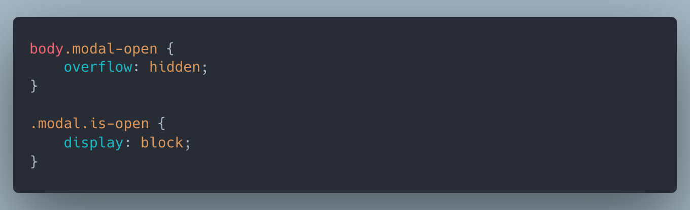

但这会不同的设备上表现不太一致,现在我们可以使用 overscroll-behavior 来指定滚动的行为模式

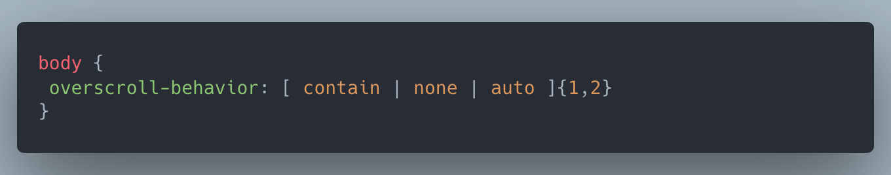

各个关键字词的含义如下：

- auto：默认值。就是我们默认看到的滚动行为表现，滚动到边缘后继续滚动外部的可滚动容器。
- contain：默认的滚动溢出行为只会表现在当前元素的内部（例如“反弹”效果或刷新），不会对相邻的滚动区域进行滚动。例如创建了一个浮层，浮层滚动（带弹性效果），但是底层元素不会滚动。
- none：相邻的滚动区域不会发生滚动，并且会阻止默认的滚动溢出行为。 当弹窗打开时，在body上添加overscroll-behavior:none，就可以禁用掉body的滚动行为

浏览器支持

- Chrome 65/ Edge 79 / Safari 16 / Firefox 52

### Scrollbar-gutter

在上面提到的打开弹框场景下，如果body本身有滚动条，此时我们给body增加 overflow:hidden ,然后关闭弹框后再取消掉overflow:hidden ，这样就会导致我们的页面出现抖动，因为滚动条会影响页面内容区的宽度。目前我们一般的解决方案是：计算出当前浏览器的滚动条的宽度，然后再打开弹框时，给body一个padding-right 值，这个时候页面就不会出现抖动

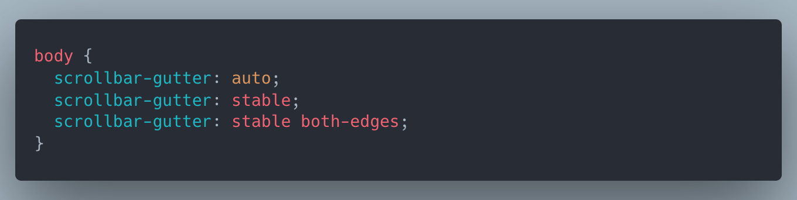

其中：

- auto：就是默认的表现。没有滚动条的时候，内容尽可能占据宽度，有了滚动条，可用宽度减小。
- stable：如果 overflow 属性计算值不是 visible，则提前预留好空白区域，这样滚动条出现的时候，整个结构和布局都是稳定的。
- both-edges：这个是让左右两侧同时预留好空白区域，目的是让局部绝对居中对称。

浏览器支持

- Chrome 94/ Edge 94 / Firefox 97

### Scrollbar Style

现在我们如果想修改滚动条样式只能通过浏览器的私有属性来定制,现在已经发布了新的规范，我们可以通过 scrollbar-color 和scrollbar-width 来设定滚动条的宽度和颜色，它们的语法如下:

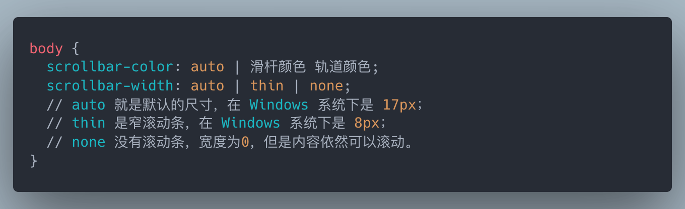

浏览器支持

- Firefox 64

## transform

过去我们一般使用transform来控制CSS 变换，这个属性接受一个或者多个变换函数

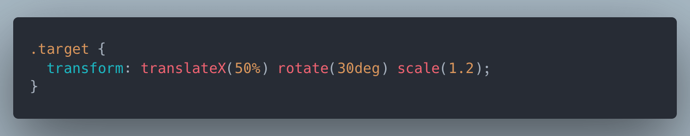

现在，我们可以直接使用单独的变换函数

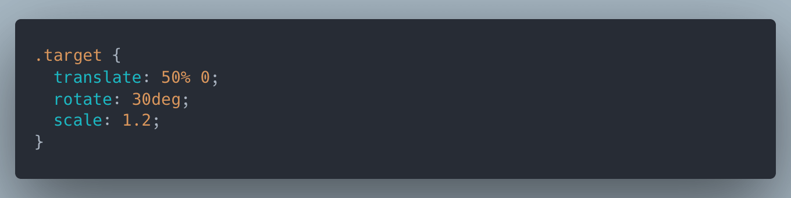

浏览器支持

- Chrome 104 / Firefox 72 / Edge 104 / Safari 14.1

## CSS 生态

CSS 经历了 20 多年的发展，从 PC 端到移动端，在前端工程化不断进步的今天，随着CSS的规范不断的完善升级，前端业务复杂度越来越高，带来的工程也越来越庞大，在 CSS 工程化方案上也有了更多的探索。

### 预处理器

- Sass、Less 从前面的CSS新特性可以发现，预处理器中的许多特性正在逐渐被移植到原生CSS中，正如当年的JQuery和现在的JavaScript

### 框架

- TailwindCSS

Tailwind CSS是一个CSS原子样式库，它提供了丰富的原子类，以及完善的自定义机制，我们完全可以使用Tailwind 配置出一套符合我们的设计体系的原子类库，强烈推荐使用。

### CSS-In-JS

- Styled Components、Emotion CSS

CSS-In-JS 与React项目可以很好地结合，可以帮我们解决CSS类名的命名问题和状态样式修改的问题，缺点是它有一定的运行时性能损失

- zero-runtime

2022年逐渐有一些零运行时的CSS-In-JS 框架出现，这些框架可以让我们使用CSS-In-JS 的语法写样式，但最终生成的还是CSS文件，比如：Linaria、Astroturf、Reshadow’

## 总结

CSS 经历了 20 多年的发展，从早期的只能修改字体、背景，到现在我们可以充分发挥CSS的各种特性，为用户创造丰富多彩、交互体验优秀的Web应用，CSS可以说取得了很大的成功。同时，CSS自身也还在不断的完善，CSS 将来发展会怎么样，又会加入哪些新的特性，又或者会不会有新的模型代替它，我们拭目以待！谢谢！

## 常见考点

### 1. **CSS Variables（CSS 自定义属性）**

- **定义与应用**：什么是 CSS 变量？如何定义和使用 CSS 变量？
- **动态样式**：如何使用 CSS 变量实现动态主题切换？
- **嵌套与作用域**：CSS 变量如何在不同作用域中继承和覆盖？
- **优点**：与预处理器变量（如 SASS 变量）相比，CSS 变量有哪些优势？

### 2. **CSS Grid 布局**

- **基础概念**：如何使用 CSS Grid 创建二维布局？与 Flexbox 有何不同？
- **常用属性**：`grid-template-rows`、`grid-template-columns`、`grid-gap` 等常见属性的作用是什么？
- **响应式设计**：如何使用 `grid-template-areas` 实现响应式布局？
- **实用技巧**：用 `grid` 实现复杂的布局，如网格系统、卡片排列等场景。

### 3. **Subgrid**

- **作用**：什么是 `subgrid`？在什么场景下使用它？
- **子网格布局**：如何让子元素继承父网格的行或列定义，保持一致的网格排列？

### 4. **CSS Container Queries（容器查询）**

- **定义与应用场景**：什么是容器查询？如何帮助实现更灵活的响应式布局？
- **语法与用法**：如何使用 `@container`、`container-type` 等属性来定义容器查询？
- **实际案例**：给出示例，如何实现根据容器宽度而非视口宽度调整布局的效果？

### 5. **:has() 选择器**

- **定义与用途**：`:has()` 选择器的作用是什么？如何通过父元素选择包含某个子元素的元素？
- **动态样式**：如何利用 `:has()` 实现交互样式，如在父级有某子元素时改变其他元素的样式？
- **兼容性问题**：`:has()` 的支持情况如何？是否需要降级方案？

### 6. **新的伪类和伪元素**

- **`:is()` 和 `:where()`**：这两个伪类的作用是什么？如何简化复杂选择器？
- **`:nth-child(An+B of S)`**：如何用 `nth-child` 新功能直接选择特定类型的元素？
- **::marker 和 ::part**：`::marker` 和 `::part` 伪元素的用途是什么？如何分别控制列表标记和 Web 组件的样式？

### 7. **CSS 动画与过渡的改进**

- **@keyframes 动画改进**：如何结合 CSS 变量与 `@keyframes` 实现动态动画？
- **`scroll-timeline`**：如何创建基于滚动的动画？比如图片滚动到一定位置时才显示或变化。
- **更流畅的过渡效果**：使用 `animation-timing-function` 中的新值如 `ease-in-out-sine` 提升动画自然效果。

### 8. **新媒体查询功能**

- **视口单位 vh、vw 的改进**：如何使用 `svh`、`lvh`、`dvh` 等视口单位解决移动端 100vh 的问题？
- **新环境媒体查询**：如何使用 `prefers-color-scheme` 检测系统的深色模式并应用适配样式？
- **交互模式检测**：如何利用 `hover`、`pointer` 检测设备的交互能力，并优化移动端的样式？

### 9. **自适应字体尺寸（Clamp）**

- **`clamp()` 函数**：如何使用 `clamp()` 实现字体大小随视口变化而自适应？
- **优点**：相比于 `vw`、`vh`，`clamp()` 如何提供更细致的控制？如何在响应式布局中应用？

### 10. **CSS 框架和工具的变化**

- **CSS in JS 的趋势**：如何评价 CSS-in-JS 的应用？它有哪些优缺点？
- **CSS 框架的革新**：Tailwind CSS、UnoCSS 等原子化 CSS 框架的优点？与传统框架如 Bootstrap 有何不同？

### 11. **CSS 性能优化**

- **新的 `contain` 属性**：如何使用 `contain` 提升 CSS 渲染性能？
- **CSS `will-change`**：如何优化常用动画效果的性能？`will-change` 的正确使用方法是什么？

### 12. **CSS Houdini**

- **定义与用途**：什么是 CSS Houdini？如何帮助开发者扩展 CSS 的功能？
- **自定义属性和绘制 API**：举例说明如何使用 Houdini 实现自定义样式或动画效果。
- **实际案例**：Houdini 在什么场景中提供了传统 CSS 无法实现的灵活效果？
