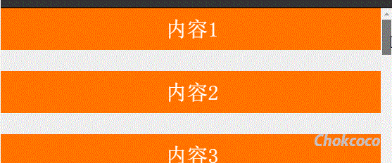
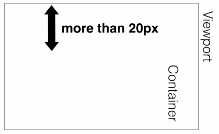
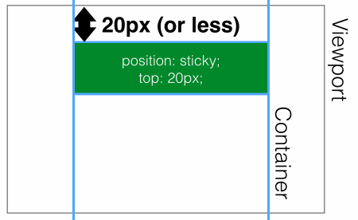
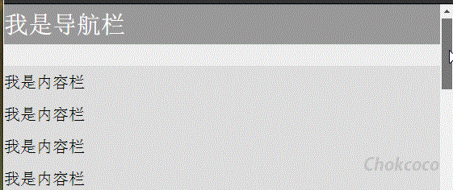

+++
title = "position: sticky"
date = '2024-11-09T00:00:00+08:00'
lastmod = '2024-11-10T00:00:00+08:00'
draft = false
weight = 8
tags = ["面试", "前端", "CSS", "position: sticky", "ecool"]
categories = ["前端开发", "面试"]
source = "https://fe.ecool.fun/knowledge-learn"
+++
如果问，CSS 中 position 属性的取值有几个？大部分人的回答大概是 `static`、`relative`、`absolute`、`fixed`，实际上MDN上还有一个 `sticky`。

今天我们就来给大家介绍这个容易被忽视的position属性值 `sticky`。

先来看看MDN上对于 `sticky` 的介绍：

> 粘性定位元素（stickily positioned element）是计算后位置属性为 sticky 的元素。

> 粘性定位可以被认为是相对定位和固定定位的混合。

什么是结合两种定位功能于一体呢？

> 元素在跨越特定阈值前为相对定位，之后为固定定位。

也就是元素先按照普通文档流定位，然后相对于该元素在流中的 `flow root（BFC）`和 `containing block`（最近的块级祖先元素）定位。

元素定位表现为在跨越特定阈值前为相对定位，之后为固定定位。

这个特定阈值指的是 top、right、bottom 或 left 之一，换言之，指定 top、right、bottom 或 left 四个阈值其中之一，才可使粘性定位生效。否则其行为与相对定位相同。

## 示例

上面的文字描述估计还是很难理解，看看下面这张 GIF 图，想想要实现的话，使用 `JS + CSS` 的方式该如何做：



按照常规做法，大概是监听页面 `scroll` 事件，判断每一区块距离视口顶部距离，超过了则设定该区块 `position:fixed`，反之去掉。

而使用 `position:sticky` ，则可以非常方便的实现：

```html
<div class="container">
    <div class="sticky-box">内容1</div>
    <div class="sticky-box">内容2</div>
    <div class="sticky-box">内容3</div>
    <div class="sticky-box">内容4</div>
</div>
```

```css
.container {
    background: #eee;
    width: 600px;
    height: 1000px;
    margin: 0 auto;
}

.sticky-box {
    position: sticky;
    height: 60px;
    margin-bottom: 30px;
    background: #ff7300;
    top: 0px;
}

div {
    font-size: 30px;
    text-align: center;
    color: #fff;
    line-height: 60px;
}
```

看看上面的 CSS 代码，只是给每个内容区块加上

```css
{
    position: -webkit-sticky;
    position: sticky;
    top: 0;
}
```

就可以轻松实现了。

简单描述下生效过程，因为设定的阈值是 `top:0` ，这个值表示当元素距离页面视口（Viewport，也就是fixed定位的参照）顶部距离大于 0px 时，元素以 relative 定位表现，而当元素距离页面视口小于 0px 时，元素表现为 fixed 定位，也就会固定在顶部。

不理解可以再看看下面这两张示意图（top:20px 的情况）：

距离页面顶部大于20px，表现为 `position:relative;`



距离页面顶部小于20px，表现为 `position:fixed;`



### 运用 position:sticky 实现头部导航栏固定

运用 position:sticky 实现导航栏固定，也是最常见的用法：



```html
<div class="container">
    <nav>我是导航栏</nav>
    <div class="content">
        <p>我是内容栏</p>
        <p>我是内容栏</p>
        <p>我是内容栏</p>
        <p>我是内容栏</p>
        <p>我是内容栏</p>
        <p>我是内容栏</p>
        <p>我是内容栏</p>
        <p>我是内容栏</p>
    </div>
</div>
```

```css
.container {
    background: #eee;
    width: 600px;
    height: 1000px;
    margin: 0 auto;
}

nav {
    position: -webkit-sticky;
    position: sticky;
    top:0;

}

nav {
    height: 50px;
    background: #999;
    color: #fff;
    font-size: 30px;
    line-height: 50px;
}

.content {
    margin-top: 30px;
    background: #ddd;
}

p {
    line-height: 40px;
    font-size: 20px;
}
```

同理，也可以实现侧边导航栏的超出固定。

## 生效规则

`position:sticky` 的生效是有一定的限制的，总结如下：

- 须指定 `top, right, bottom 或 left` 四个阈值其中之一，才可使粘性定位生效。否则其行为与相对定位相同。
- top 和 bottom 同时设置时，top 生效的优先级高，left 和 right 同时设置时，left 的优先级高。
- 设定为 `position:sticky` 元素的任意父节点的 `overflow` 属性必须是 `visible`，否则 `position:sticky` 不会生效。这里需要解释一下：<br>
  - 如果 `position:sticky` 元素的任意父节点定位设置为 overflow:hidden，则父容器无法进行滚动，所以 `position:sticky` 元素也不会有滚动然后固定的情况。
  - 如果 `position:sticky` 元素的任意父节点定位设置为 `position:relative | absolute | fixed`，则元素相对父元素进行定位，而不会相对 `viewprot` 定位。
- 达到设定的阀值。这个还算好理解，也就是设定了 `position:sticky` 的元素表现为 relative 还是 fixed 是根据元素是否达到设定了的阈值决定的。

## 兼容性


从上面的兼容性可以看到，在主流的浏览器中已经可以正常使用。

## 常见考点

### 1. **`position: sticky` 的基本概念**

- `position: sticky` 是什么？如何解释它的“粘性”效果？
- 它与 `position: relative` 和 `position: fixed` 有什么不同？

### 2. **`position: sticky` 的工作原理**

- `position: sticky` 的工作条件是什么？它如何在滚动容器中保持“相对位置”并在到达指定阈值后变为“固定”？
- **触发条件**：`position: sticky` 生效需要满足的条件是什么（例如父容器不能有 `overflow: hidden`）？

### 3. **粘性定位的阈值**

- 如何使用 `top`、`bottom`、`left`、`right` 等属性设置 `position: sticky` 的粘性阈值？
- 如果一个元素 `position: sticky; top: 20px;`，那么它在什么条件下会固定在距离容器顶部 20px 处？

### 4. **`position: sticky` 的应用场景**

- 在项目中，如何利用 `position: sticky` 实现表头在滚动列表中固定的效果？
- **导航栏**：如何使用 `position: sticky` 创建一个页面滚动时固定在顶部的导航栏？
- **页面内标题**：在长文档中，如何使标题在页面滚动到该位置时保持粘性，提升可读性？

### 5. **代码示例**

- 给定代码示例，考察面试者对 `position: sticky` 的理解和调试能力。
- 示例代码：<br>
```html
<div class="container">
  <h2 class="sticky-header">Sticky Header</h2>
  <p>Some content...</p>
  <p>Some content...</p>
  <p>Some content...</p>
  <p>Some content...</p>
</div>
```
```css
.container {
  height: 500px;
  overflow-y: scroll;
}
.sticky-header {
  position: sticky;
  top: 0;
  background: yellow;
}
```
- 问题：为什么这个标题在滚动时会“粘”在顶部？如何通过 CSS 调整粘性生效的滚动范围？

### 6. **`position: sticky` 的局限性**

- 在什么情况下 `position: sticky` 可能无法生效？<br>
  - 例如：父元素设置了 `overflow: hidden`、元素没有在一个滚动容器内。
- **兼容性**：哪些浏览器对 `position: sticky` 的支持不佳？如何在不支持的浏览器中实现类似效果？

### 7. **`position: sticky` 的性能**

- 使用 `position: sticky` 是否会对页面性能产生影响？在长列表或复杂布局中应如何优化？

### 8. **`position: sticky` 与 JavaScript 的结合**

- 如何结合 JavaScript 监听粘性元素的状态，实现更复杂的交互效果？例如在元素变粘性时触发特定动画。

### 9. **`position: sticky` 在响应式设计中的应用**

- 在不同屏幕宽度下，如何使用媒体查询控制 `position: sticky` 的粘性行为？
