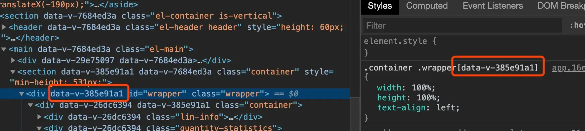

+++
title = "前端组件化开发"
date = '2025-08-07T00:00:00+08:00'
lastmod = '2025-10-23T00:00:00+08:00'
draft = false
weight = 12
tags = ["面试", "前端", "工程化", "前端组件化开发", "ecool"]
categories = ["前端开发", "面试"]
source = "https://fe.ecool.fun/knowledge-learn"
+++
## 背景

不知道你有没有遇到过以下场景:

- 页面逻辑越来越多,代码越来越庞大,写到后面难以 hold 住所有逻辑,很容易牵一发而动全身.
- 你负责的页面好好的突然出现问题,查到最后是别人代码影响.
- 同样的逻辑在多个地方重复书写,每次一改要改一批文件

随着前端项目复杂度的急剧增加, 上面列出的几种场景就是传统开发中会出现的问题. 也是前端组件化出现的原因.

- 项目复杂度增加, 一个页面一个文件需要处理的内容过多.
- 重复性劳动多, 效率低
- 质量差, 不可控

## 组件化初探

正是由于出现了这样的问题, 为了在越来越复杂的前端项目中提高开发效率和保证开发质量, 各路大神们开始通过各种方式来尝试解决问题.

曾经非常火的 jQuery 就基于自己建立了 jQuery 插件机制. 你可以将一些常用逻辑进行封装变成 jQuery 插件, 还可以将插件开源进行共享. 比如纯手写会吐血的日期时间选择器,轮播, 多级菜单等等. 你可以在[这里](https://plugins.jquery.com/)浏览更多jQuery插件.

jQuery 插件的用法通常是:

```js
$(".select").pluginName(config)
```

除了 jQuery 插件模式, 还有一种常见模式是对象模式. 这种模式现在仍然有很多优秀的库在被我们直接或者间接使用. 比如: [swiper](https://swiperjs.com/)

对象模式的写法:

```html
<!-- Slider main container -->
<div class="swiper-container">
    <!-- Additional required wrapper -->
    <div class="swiper-wrapper">
        <!-- Slides -->
        <div class="swiper-slide">Slide 1</div>
        <div class="swiper-slide">Slide 2</div>
        <div class="swiper-slide">Slide 3</div>
        ...
    </div>
</div>

<script src="path/to/swiper.min.js"></script>
<script>
  var mySwiper = new Swiper ('.swiper-container', {
    direction: 'vertical',
    loop: true,
  })
  </script>
```

对象模式通过配置创建对象, 通常创建对象的参数中有一项是元素/元素选择器, 通过js代码将逻辑与这个元素紧密绑定.

除了各路大神提出这这些封装代码的模式, 前端标准也在探索组件化模式, webComponent 是 W3C 提出的一种自定义标签模式, 但是其实现繁琐, 目前支持度并不是很好, 这里就不详细说明. 详细的实现示例参看[这里](https://github.com/mdn/web-components-examples)

## 现代组件结构

经过前端工程师不断的探索, 目前组件化的思想已经在前端项目开发中获得广泛的使用, 最流行的前端框架 Vue React 已经是组件化的集大成者 (虽然二者内涵的东西不止是组件化). 我们先来看一下我们希望组件是一个怎样的存在.

首先, 组件必须是高内聚低耦合的. 当我们开始用组件的思想看待页面时, 页面便不再是 dom 元素的组合, 而是不同组件的组合. 但是由于前端基础技术栈的原因, html css js 运行在一个页面上时是没有隔离的, 也就是说 js 可以根据选择器获取到任意的 dom 节点, 一条 css 规则也会应用在文档中所以满足规则的节点, js 代码中可以随意的创建和使用全局变量. 所以解决隔离是组件的基础要求.

其次, 组件是具有一定意义的功能集合体. 通常组件可以有自己的名字, 比如, 轮播组件, 表格组件, 分页组件, 导航组件. 有名字代表我们把它看成一个个体, 能完成这个个体需要完成的功能. 当然这个个体是可以有层次的, 比如, 表格组件里面可能是表头组件和表主题组件的组合. 这就类似学生, 老师, 学校但是不会有把学生的一半跟老师一半加在一起的东西. 学生是可以完成独立功能的, 这样的抽象就有意义. 看到这里, 你可能发现这跟面向对象有一定的相似性. 我认为二者在思想上确实是相似的.

了解前端组件需要做到怎样的要求, 现在我们具体看下一个组件的结构:

### UI

前端的工作是不可能与 UI 分开的, 绝大部分的组件是带着 UI 的. 当然也有一部分容器类组件并不需要 UI. 我们把 UI 主要分成两个部分, 内容和样式. 这样似乎与 HTML 和 CSS 分别对应上了, 那与传统的开发有什么区别呢? 区别就在于我们在上文提到的隔离. 受限于前端基础技术栈的原因, 并不能做到完全的隔离, (web component 是打算从基础的部分解决这个问题) 但是使用各种方式, 比如在 webpack 中做一些额外的处理, 帮助我们做到隔离, 通常按照标准的写法是不会对外部产生不可控的影响的.

举例来说: vue 的单文件组件, template 和 style 部分就对应了内容和样式, 当然描述为渲染和样式更为准确. template 限制了只能书写组件的内容, style 加上 scoped 配置. 如下图, 在渲染成具体的 dom 的时候, vue 会给对应元素加上唯一标志, 并在选择器中带上这个标志. 以这种方式来保证组件间样式的隔离.



### attribute, property, status, method

这四个部分便于组件的功能逻辑紧密相关. 对于学习过面向对象设计的同学应该会很熟悉几个内容, attribute 与 property 是初始化时的配置部分, status 是运行时的内部状态变量, method 是提供的方法.

组件配置: 为什么会有 attribute 与 property 两个部分用来描述配置呢? 首先组件是对 HTML 元素的扩展, attribute 便是承接与 HTML 元素的设计. HTML 的元素在书写的时候可以添加 attribute, 但是受限于形式 attribute 仅是字符串格式, 因为我们是写在 html 文件中的. 但是我们都应该有经验, 对一个组件的配置不可能只有字符串的, 比如, 我们在使用 swiper 轮播组件时, 我们可以配置轮播动画的时长, 是否自动轮播等. 这时候我们往往会使用 js 的形式, 并传一个对象进去. 这种通过 js 来配置组件时传的值, 叫做 property. attribute 与 property 通常是有对应关系的, 我的建议是不需要太关心他们的区别, 比如, 我们现在使用的 vue 和 react 实际就抹平了二者的差别, 你可以说都是 property. 比如 vue 的模板语法中, `:attr="object"` 加了冒号的属性内容就可以被自动解析. jsx 语法中 `attr={js}` 也是不再限于字符串.

内部状态 status: 内部状态就是组件运行时, 不需要暴露给外部但是内部需要的变量. 这一定程度上可以看成我们写代码中的局部变量.

方法 method: 顾名思义方法就是组件提供的功能. 比如, 对于一个轮播组件会有的方法有: 停止/开始自动轮播, 轮播到某项等.

### 生命周期

生命周期通常有, 创建, 挂载, 销毁前等, vue 和 react 设计了更细粒度的生命周期.

为什么要有生命周期, 因为我们在设计好一个组件已经组件的功能时, 我们需要在一些特定的时候执行一些代码, 比如初始化动作, 获取数据动作等. 我们把做这些动作的时机整理后发现, 我们往往需要在创建的时候需要做一些动作, 在构建好组件的 dom 挂载到页面的时候需要做一些动作, 在销毁前需要做一些动作比如内存释放等. 因此这些时机也在现代框架中得到了标准的支持.

## 组件化对当前前端工作的影响

上面内容我们讨论了前端为什么会进行组件化, 已经现代的组件抽象模型是什么. 那学习和理解组件化对我们工作有什么影响呢?

首先, 组件化成为工作必备技能之一, 现代的前端开发工作是必须要求你会一种框架的, 三大框架之一. 而三大框架都深深的蕴含了组件化的思想.

其次, 理解组件化对于可以帮助我们更好的使用框架进行工作内容的拆分和维护. 如果你是团队的 leader, 如何更好的拆分项目的工作如何让团队成员更好的合作, 组件化能力是必须的.

## 常见考点

## 一、组件化的认知与本质

**考察重点：**

- 是否理解组件化的核心目标：**复用、解耦、可维护、可组合**
- 能否解释“组件”与“模块”的区别（UI + 状态 + 逻辑 vs 单纯逻辑或数据单元）
- 是否了解组件化发展脉络： 模板拼接时代 → Vue/React 的声明式组件 → 现代函数式组件设计

**典型提问：**

- 你如何理解前端组件化？
- 组件化开发解决了哪些传统前端开发痛点？
- 模块化（如 ES Module）与组件化有什么区别？

---

## 二、组件设计原则

**考察重点：**

- **单一职责原则（SRP）**：一个组件只负责一件事
- **高内聚低耦合**：组件内部逻辑完整，外部依赖最小化
- **可复用性与可组合性**
- **状态提升与数据下传**
- **通用组件 vs 业务组件 vs 页面组件** 的分层设计

**典型提问：**

- 设计组件时，你如何判断逻辑是否应该拆分？
- 如何避免组件间过度耦合？
- 你在项目中如何区分通用组件与业务组件？

---

## 三、组件通信机制

**考察重点：**

- **父子通信**：props / emit / callback / ref
- **兄弟通信**：事件总线 / 状态提升 / context / store
- **跨层通信**：context、依赖注入（Vue provide/inject）
- **全局状态管理**：Redux / Zustand / Pinia / Vuex

**典型提问：**

- 组件之间有哪些通信方式？
- React 中如何避免过深的 props 传递？
- Vue 中 provide/inject 的原理是什么？

---

## 四、组件状态与数据流

**考察重点：**

- **受控组件与非受控组件**（React）
- **单向数据流思想**
- **局部状态 vs 全局状态的划分**
- **状态同步、缓存、懒加载、数据提升**

**典型提问：**

- React 组件中，受控与非受控组件的区别是什么？
- 组件状态应该存在哪里？
- 如何在多个组件间共享状态而不引起频繁重渲染？

---

## 五、组件复用与抽象

**考察重点：**

- **高阶组件（HOC）**
- **Render Props**
- **自定义 Hooks / Composition API**
- **Slot / children / 动态插槽**
- **通用组件库设计（Button、Form、Table）**
- 是否具备抽象复杂逻辑为可复用单元的能力

**典型提问：**

- 你在项目中是否写过自定义 Hook？
- HOC 与自定义 Hook 的区别是什么？
- 在 Vue3 中如何通过组合式 API 抽象逻辑？

---

## 六、组件性能与渲染优化

**考察重点：**

- React：memo、useMemo、useCallback、虚拟化渲染、懒加载
- Vue：v-once、keep-alive、计算属性缓存、异步组件
- Diff 算法与重渲染机制理解
- key 的作用与渲染性能影响
- 大组件拆分、异步加载与按需渲染策略

**典型提问：**

- React 组件频繁重渲染的原因有哪些？
- 你如何设计高性能的长列表组件？
- Vue 的虚拟 DOM 如何帮助组件更新性能？

---

## 七、组件工程化与生态建设

**考察重点：**

- **组件库搭建与打包（rollup、vite、storybook）**
- **按需引入与 Tree-shaking**
- **样式隔离与命名规范（CSS Module、Scoped、BEM、Tailwind）**
- **组件测试（Jest、Testing Library、Cypress）**
- **版本管理与发布（npm publish、Monorepo 管理）**

**典型提问：**

- 你有没有参与过组件库开发？
- 组件样式冲突如何处理？
- 如何让组件支持按需加载与主题定制？

---

## 八、可维护性与可扩展性

**考察重点：**

- 是否关注组件的 **接口设计（props）清晰度**
- 是否考虑 **可测试性、可扩展性**
- 是否遵循一致的命名规范与目录结构
- 是否关注团队协作下的组件复用体系（组件资产化）

**典型提问：**

- 如何设计一个长期可维护的组件？
- 组件 Props 过多时该如何优化？
- 如何让一个组件支持多主题或动态配置？
