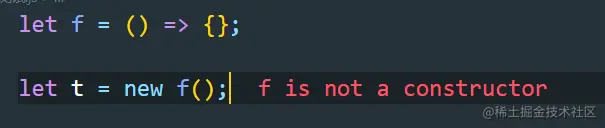
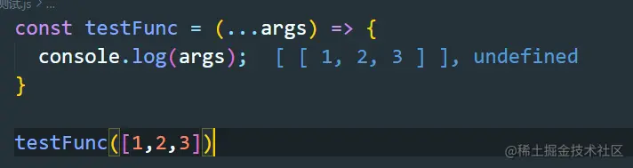

+++
title = "箭头函数"
date = '2024-10-02T00:00:00+08:00'
lastmod = '2024-12-17T00:00:00+08:00'
draft = false
weight = 4
tags = ["面试", "前端", "ES6", "JavaScript", "箭头函数", "ecool"]
categories = ["前端开发", "面试"]
source = "https://fe.ecool.fun/knowledge-learn"
+++
## 一、箭头函数的特点

### 1. 相比普通函数，箭头函数有更加简洁的语法。

> 普通函数

```
function add(num) {
  return num + 10
}
```

> 箭头函数

```
const add = num => num + 10;
```

### 2. 箭头函数不绑定this，会捕获其所在上下文的this，作为自己的this。

> 这句话需要注意的是，箭头函数的外层如果有普通函数，那么箭头函数的this就是这个外层的普通函数的this，箭头函数的外层如果没有普通函数，那么箭头函数的this就是全局变量。

> 下面这个例子是箭头函数的外层有普通函数。

```
let obj = {
  fn:function(){
      console.log('我是普通函数',this === obj)   // true
      return ()=>{
          console.log('我是箭头函数',this === obj) // true
      }
  }
}
console.log(obj.fn()())
```

> 下面这个例子是箭头函数的外层没有普通函数。

```
let obj = {
    fn:()=>{
        console.log(this === window);
    }
}
console.log(obj.fn())
// true
```

### 3. 箭头函数是匿名函数，不能作为构造函数，不可以使用new命令，否则后抛出错误。



### 4. 箭头函数不绑定arguments，取而代之用rest参数解决，同时没有super和new.target。

> 箭头函数没有arguments、super、new.target的绑定，这些值由外围最近一层非箭头函数决定。

> 下面的这个函数会报错，在浏览器环境下。

```
let f = ()=>console.log(arguments);

//报错
f(); // arguments is not defined
```

> 下面的箭头函数不会报错，因为arguments是外围函数的。

```
function fn(){
  let f = ()=> {
    console.log(arguments)
  }
  f();
}
fn(1,2,3) // [1,2,3]
```

> 箭头函数可以通过拓展运算符获取传入的参数。



### 5. 使用call,apply,bind并不会改变箭头函数中的this指向。

- 当对箭头函数使用call或apply方法时，只会传入参数并调用函数，并不会改变箭头函数中this的指向。
- 当对箭头函数使用bind方法时，只会返回一个预设参数的新函数，并不会改变这个新函数的this指向。

> 请看下面的代码

```
window.name = "window_name";

let f1 = function () {
return this.name;
};
let f2 = () => this.name;

let obj = { name: "obj_name" };

console.log(f1.call(obj));  //obj_name
console.log(f2.call(obj));  // window_name
console.log(f1.apply(obj)); // obj_name
console.log(f2.apply(obj)); // window_name
console.log(f1.bind(obj)());  // obj_name
console.log(f2.bind(obj)());  // window_name
```

### 6. 箭头函数没有原型对象prototype这个属性

> 由于不可以通过new关键字调用，所以没有构建原型的需求，所以箭头函数没有prototype这个属性。

```
let F = ()=>{};
console.log(F.prototype) // undefined
```

### 7. 不能使用yield关键字，不能用作Generator函数

## 二、arguments辨析

> 既然上文我们提到了arguments，那么下面我们就仔细讲讲这个arguments。

### arguments有什么用？

> arguments对象是所有非箭头函数中都可用的局部变量，可以使用arguments对象在函数中引用函数的参数，此对象包含传递给函数的每一个参数，第一个参数在索引0的位置。

### 如何将arguments对象转换为数组

1. 通过slice
2. 通过拓展运算符
3. 通过Array.from

```
var args = Array.prototype.slice.call(arguments);
var args = [].slice.call(arguments);

const args = Array.from(arguments);
const args = [...arguments];
```

### arguments函数如何调用自身函数？

> 我们先看看下面这个函数，这个是可以正常运行的。

```
function factorial (n) {
    return !(n > 1) ? 1 : factorial(n - 1) * n;
}

[1,2,3,4,5].map(factorial);
```

> 但是作为匿名函数则不行。

```
[1,2,3,4,5].map(function (n) {
    return !(n > 1) ? 1 : /* what goes here? */ (n - 1) * n;
});
```

> 因此arguments.callee诞生了。

```
[1,2,3,4,5].map(function (n) {
    return !(n > 1) ? 1 : arguments.callee(n - 1) * n;
});
```

> 所以arguments要想调用自身的匿名函数，可以通过arguments.callee来调用。

## 常见考点

1.  **定义与语法**：<br>
  - 了解箭头函数的基本定义和语法结构。
  - 掌握参数列表、箭头符号和函数体的省略规则。
2.  **特性**：<br>
  - 箭头函数没有自己的`this`，继承外层作用域的`this`。
  - 不能作为构造函数使用（`new`关键字无效）。
  - 没有`arguments`对象，但可以使用`rest`参数。
  - `this`指向固定，不能通过`call`、`apply`或`bind`改变。
  - 不支持`new.target`和`super`。
3.  **应用场景**：<br>
  - 回调函数：简化代码结构。
  - 数组方法：如`map`、`filter`、`reduce`等。
  - 事件监听：避免`this`指向问题。
  - 函数式编程：高阶函数、闭包等。
4.  **注意事项**：<br>
  - 避免滥用，特别是在需要明确`this`指向或`arguments`对象时。
  - 嵌套箭头函数可能导致`this`指向混乱。
  - 与异步操作结合时，注意执行顺序和结果处理。
