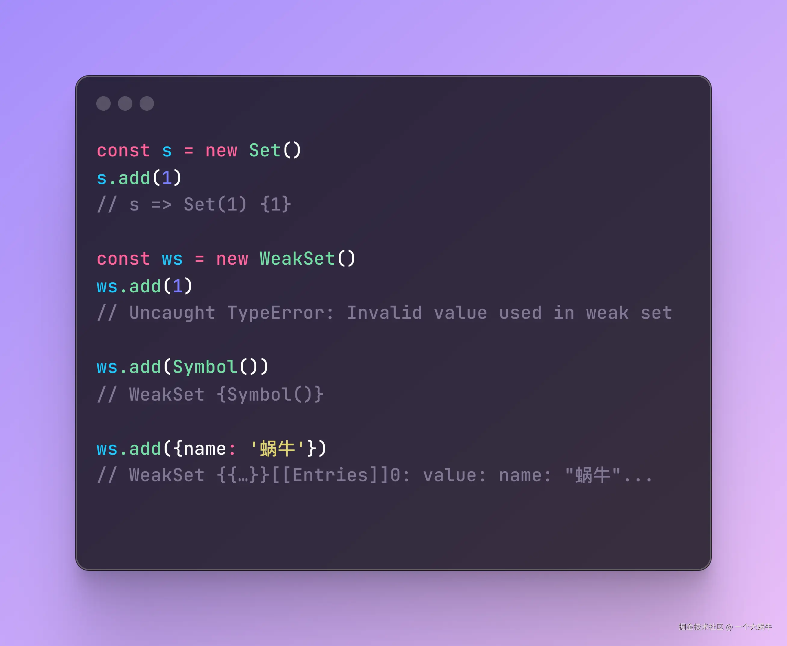
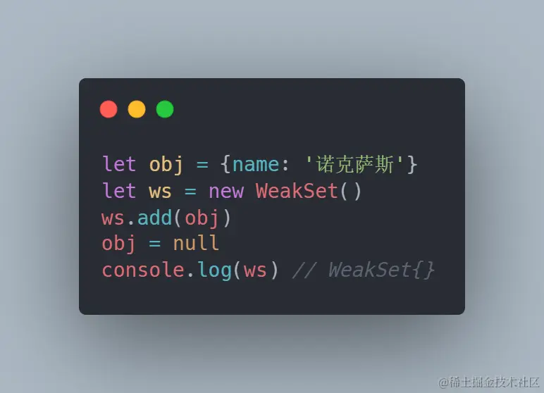
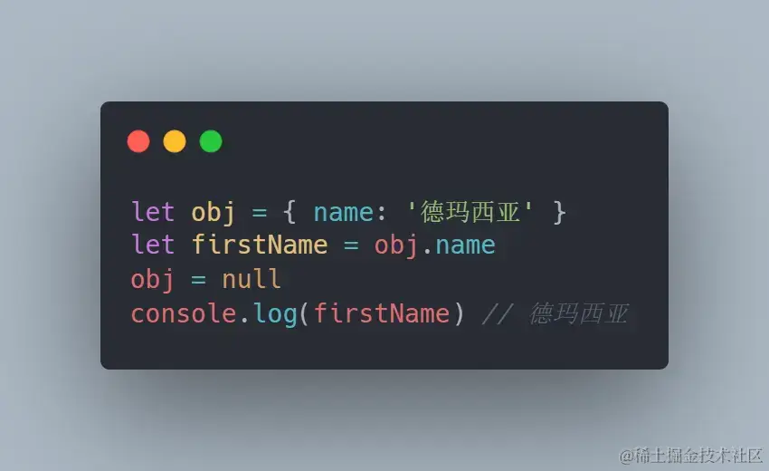
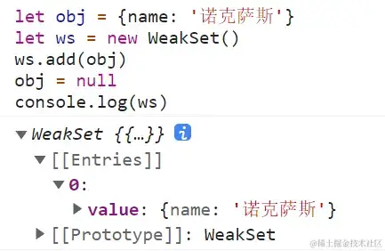
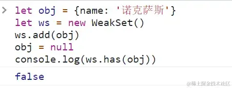
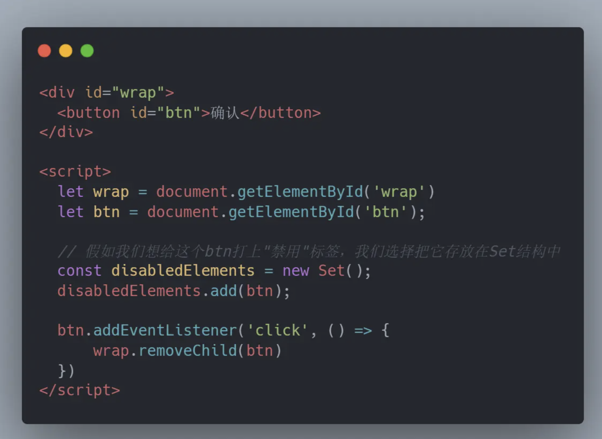
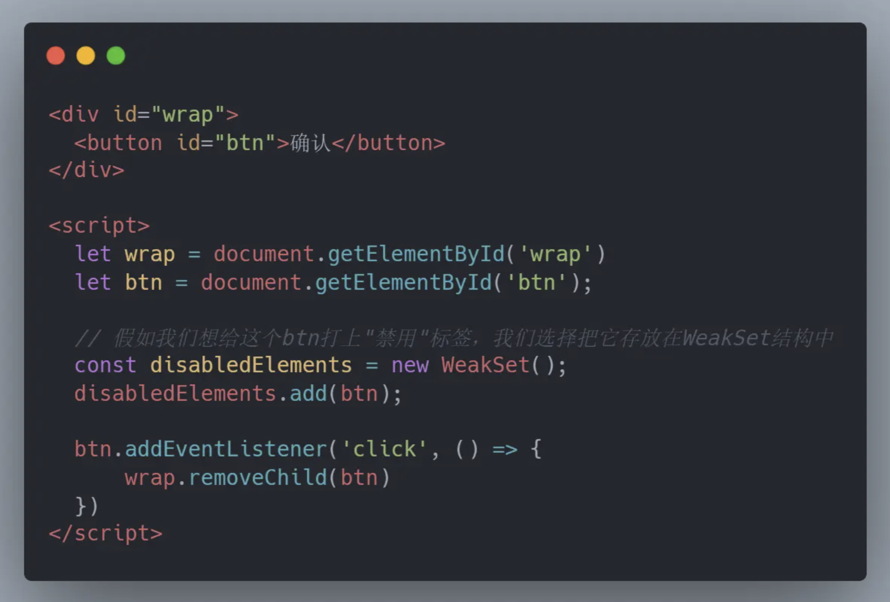

+++
title = "WeakMap 和 WeakSet"
date = '2024-10-02T00:00:00+08:00'
lastmod = '2025-07-17T00:00:00+08:00'
draft = false
weight = 13
tags = ["面试", "前端", "ES6", "JavaScript", "WeakMap 和 WeakSet", "ecool"]
categories = ["前端开发", "面试"]
source = "https://fe.ecool.fun/knowledge-learn"
+++
## 1. 什么是 WeakSet

WeakSet 结构与 Set 类似，也是不重复的值的集合，具备

- **WeakSet.prototype.add(value)** ：向 WeakSet 实例添加一个新成员。
- **WeakSet.prototype.delete(value)** ：清除 WeakSet 实例的指定成员。
- **WeakSet.prototype.has(value)** ：返回一个布尔值，表示某个值是否在 WeakSet 实例之中。 这三个方法。但是，它与 Set 有两个区别。

###### 区别一：WeakSet 的成员只能是对象和Symbol类型，而不能是其他类型的值，我们用代码演示一下



从代码中可以看到，想像Set一样直接往 WeakSet 中添加原始类型化会报错，只能添加对象和Symbol

###### 区别二`(这是核心)`： WeakSet 中的对象都是弱引用，即垃圾回收机制不考虑 WeakSet 对该对象的引用，也就是说，如果其他对象都不再引用该对象，那么垃圾回收机制会自动回收该对象所占用的内存，不考虑该对象还存在于 WeakSet 之中。

（这句解释来自`ECMAScript 6 入门`,第一眼看到这句话这话会觉得有点晦涩，我们来解释一下）

- **弱引用**：垃圾回收机制有一套自己的回收算法，我们都知道一个函数执行完成后该函数在调用栈中创建的执行上下文会被销毁，这里说的销毁，其实指的就是执行上下文中环境变量、词法变量中的数据存储所占据的内存空间被垃圾回收机制所回收，那么`垃圾回收机制不考虑 WeakSet 对该对象的引用`是不是就意味着垃圾回收机制不会回收 WeakSet 对象里面的数据所占据的内存呢？不！不是的！代码是最好的解释



我们用 ws 中存放一个对象，然后再将该对象置为null，（这里要说明一下，一个变量被置为null，就意味着这个变量的内存可以被回收了）看着这个打印结果有没有突然明白了点什么，对！没错！只要 WeakSet 结构中的对象不再需要被引用，那么 WeakSet 就直接为空了，这不就意味着WeakSet中的数据所占据的内存被释放了吗。好的，你或许还会有疑问，难道不用 WeakSet 存储数据，结果就不是这样的吗，来打消你的疑虑

 不使用 WeakSet 存放数据，当变量obj为null时，fistName依旧是有值的，对比这段代码，我们可以清晰的看出, WeakSet中 - `垃圾回收机制会自动回收该对象所占用的内存`

## 2. 这里有'BUG'

可能已经有小伙伴拔出了他40米长的大剑了，上图二中的代码其实有问题，真实的打印应该是



各位手中的长剑收一收，先别急，其实我们前面聊的没有问题，为什么这里真是打印能出来结果呢？这个问题在国外某技术论坛上也是一度出现在 WeakSet 话题榜首位，**解释为：因为浏览器的垃圾回收机制是不受我们控制的，我们无法知道垃圾回收机制什么时候执行，之所以打印能出现内容，其实是因为打印的时候垃圾回收机制没有启动。所以我们可以认为，上图二中的打印在垃圾回收启动之后，它就是空的**

我们可以这样来证明它:



如果这样你觉得依旧不够睡服你自己的话，我们把这段代码搬到node中：

需要知道的是

> global.gc() // 强制节点运行垃圾回收

> process.memoryUsage() // Nodejs 的内存占用情况

> 返回结果：{ rss: 22036480, heapTotal: 5300224, heapUsed: 2984464, external: 201153, arrayBuffers: 10422 }

> 其中 `heapUsed: 2984464` 这就是当前node.js中内存被占用的的值 ≈ 3M,

测试我们的代码：

```javascript
global.gc();
process.memoryUsage()  // heapUsed ≈ 3M

let obj = { name: '诺克萨斯', age: new Array(5 * 1024 * 1024) } // 为了差距明显一点，这里多加一个值让整个对象占据内存更大
let ws = new WeakSet();
ws.add(obj);

global.gc();
console.log(process.memoryUsage())

// heapUsed: 45172336 ≈ 4.5M
```

现在node中内存被占据约 4.5M，再取消对obj的外部引用：

```ini
global.gc(); // 强制节点运行垃圾回收

let obj = { name: '诺克萨斯', age: new Array(5 * 1024 * 1024) }
let ws = new WeakSet();
ws.add(obj);
global.gc();

obj = null;
global.gc();
console.log(process.memoryUsage());

// heapUsed: 2974448 ≈ 3M
```

所以我们说如果其他对象都不再引用该对象，那么垃圾回收机制会自动回收该对象所占用的内存，nice！明白了这个问题点之后，你应该已经对 WeakSet 有了一个很深刻的认识了， 那么es6新增一个 WeakSet 有什么应用场景呢？

## 3. WeakSet 应用场景

一个很典型的应用场景： **储存 DOM 节点，而不用担心这些节点从文档移除时，会引发内存泄漏**。 友好一点来解释的话不如上代码

 假设我们需要给记录页面上的禁用标签，那么一个Set对象存放就可以了，这样写功能上没有问题，但如果写成这样，当点击事件发生后，button 的dom被移除，那么整份js中 disabledElements 这个对象因为是强引用，其中的值依然存在于内存中的，那么内存泄漏就造成了，于是我们可以换成 WeakSet 来存放



效果是一样的，这里当 button 被移除，disabledElements 中的内容会因为是弱引用而直接变成空，也就是disabledElements被垃圾回收掉了其中的内存，避免了一个小小的内存泄漏的产生

## 4. WeakMap

和map结构类似，也是用于生成键值对的集合，key 只能是对象等等... 这些特性读者完全可以在 `[ECMAScript 6 入门]`上了解，我们这里只探讨这本书上没有深入解释的部分。

知道了`WeakSet`，`WeakMap`的弱引用，垃圾回收机制不将该引用考虑在内，这些特点也是相同的意思了

## 总结

WeakSet 实例的用处其实没有那么大。不过，弱集合在给对象打标签时还是很有价值的，它在很多项目的源码当中被使用到，了解 WeakSet 的特性在阅读源码的时候会有一定的帮助，WeakMap 应用场景会稍微广泛一些，需要注意的事，因为WeakSet 和 WeakMap 随时都可能被垃圾回收掉，所以他们都不支持被遍历

## 常见考点

在 ES6 中，`WeakMap` 和 `WeakSet` 是专为**弱引用存储**设计的数据结构，主要用于内存敏感、对象生命周期管理等场景。在面试中，考察重点通常包括它们的**使用限制、区别、用途、与垃圾回收的关系等方面**。

## 一、基础概念

### 1. WeakMap

- 是一种**键只能是对象**的 `Map`。
- **键是弱引用**，不影响对象的垃圾回收。
- **不可遍历**，无 `.size`、`.keys()`、`forEach()` 等方法。

### 2. WeakSet

- 是一种**只能存对象的 Set**。
- 每个对象最多只出现一次，值是弱引用。
- 也**不可遍历**，无 `.size`、`forEach()`。

## 二、常见 API（都很少）

### WeakMap

```js
const wm = new WeakMap();
const obj = {};
wm.set(obj, 'data');
wm.get(obj);       // 'data'
wm.has(obj);       // true
wm.delete(obj);    // true
```

### WeakSet

```js
const ws = new WeakSet();
const obj = {};
ws.add(obj);
ws.has(obj);       // true
ws.delete(obj);    // true
```

## 三、核心特性与限制

| 特性 | WeakMap / WeakSet 说明 |
| --- | --- |
| 键或值必须是对象 | 原始值（如字符串、数字）会抛错 |
| 弱引用 | 被引用对象如果无其他引用，会被 GC 回收 |
| 不可遍历 | 无法使用 `for...of`、`.keys()`、`.size`，以防内存泄漏 |
| 无序集合 | 不能获取顺序，也不能遍历 |
| 无 clear 方法 | 无法批量清空（也是为避免意外保留对象引用） |

## 四、适用场景考察点

### 1. **DOM 节点私有数据缓存**

- 避免因引用 DOM 节点造成内存泄漏：

```js
const elementData = new WeakMap();
const el = document.querySelector('#app');
elementData.set(el, { clickCount: 0 });

// 当 el 被移除 DOM 且无其他引用时，自动被 GC 清理
```

### 2. **对象实例私有属性封装**

```js
const _private = new WeakMap();

class Person {
  constructor(name) {
    _private.set(this, { name });
  }

  getName() {
    return _private.get(this).name;
  }
}
```

### 3. **缓存敏感数据**

- 如用户权限、缓存响应内容等，且希望对象不再使用时自动释放内存。

---

## 五、与 Map / Set 的对比

| 特性 | Map / Set | WeakMap / WeakSet |
| --- | --- | --- |
| 键/值类型限制 | 任意类型 | 只能是对象 |
| 是否可遍历 | 是 | 否（不可遍历） |
| 是否有 `.size` | 有 | 无 |
| 是否强引用 | 是 | 否（弱引用） |
| 是否影响 GC | 是 | 否 |
| 典型应用场景 | 显性缓存、通用集合 | 隐式缓存、私有数据、不影响 GC |

---

## 六、常见面试题示例

1. **WeakMap 和 Map 有哪些区别？为什么 WeakMap 没有 size 属性？**
2. **为什么 WeakMap 的键不能是基本类型？**
3. **如何使用 WeakMap 封装私有属性？**
4. **WeakMap 如何避免内存泄漏？**
5. **什么是弱引用？JavaScript 中有哪些弱引用结构？**

---

## 七、补充说明：WeakRef 与 FinalizationRegistry（新特性）

-  ES2021 提供了 `WeakRef` 和 `FinalizationRegistry`：<br>
  - `WeakRef`：显式持有对象的弱引用。
  - `FinalizationRegistry`：对象被垃圾回收时执行回调。

---

## 总结

| 项目 | WeakMap | WeakSet |
| --- | --- | --- |
| 键/值 | 键为对象 / 值任意 | 值为对象 |
| 用途 | 关联私有数据、缓存 | 存储唯一对象引用 |
| 是否可遍历 | 否 | 否 |
| 是否弱引用 | 是 | 是 |
| 是否影响 GC | 否 | 否 |

掌握 `WeakMap` 和 `WeakSet` 的使用，体现的是你对**JS 内存管理、数据结构选择和封装能力**的理解，尤其适用于中高级前端面试中。
