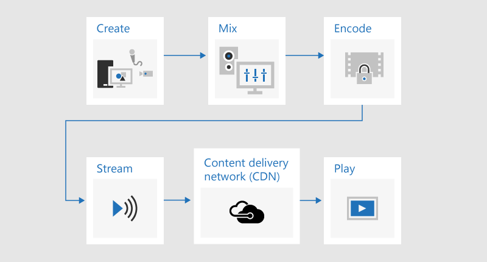
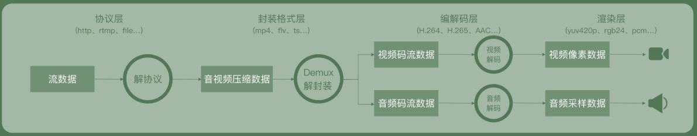
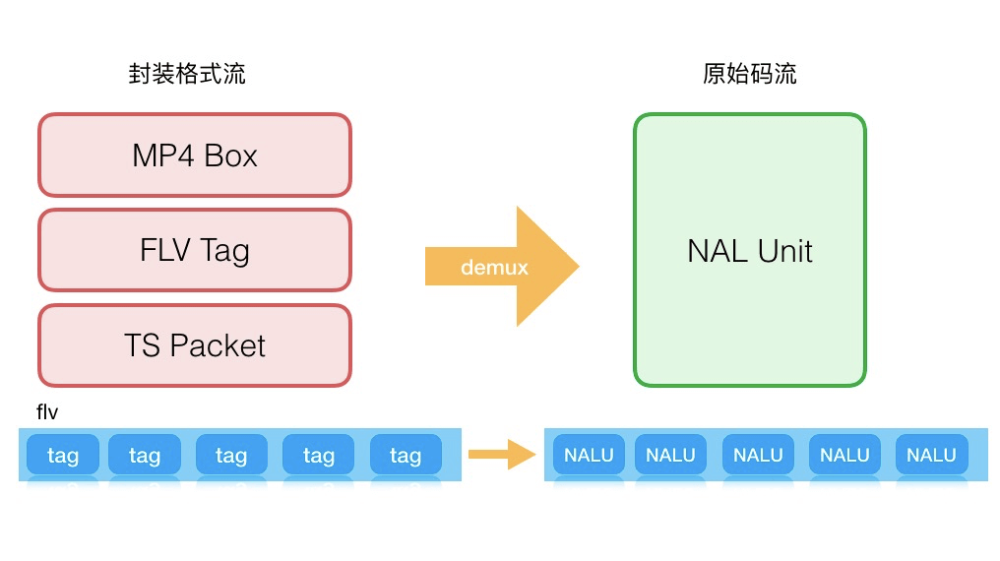
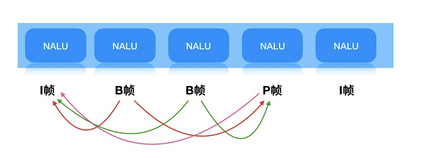
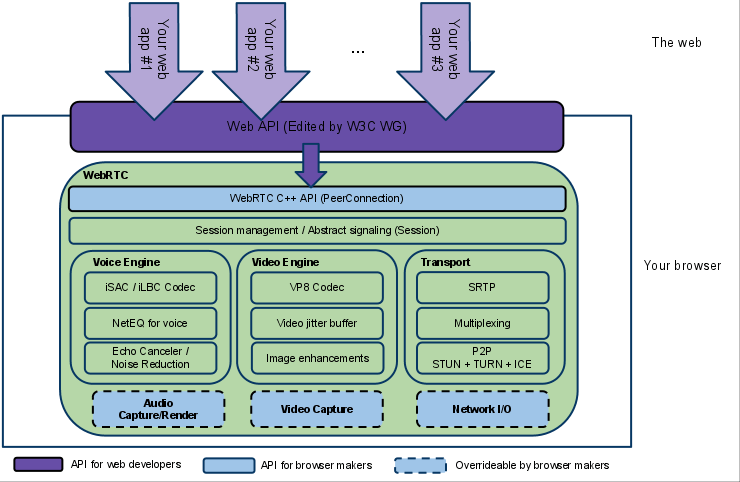
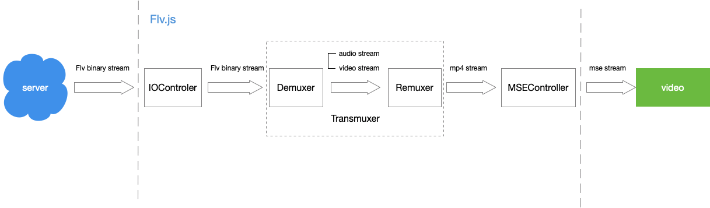
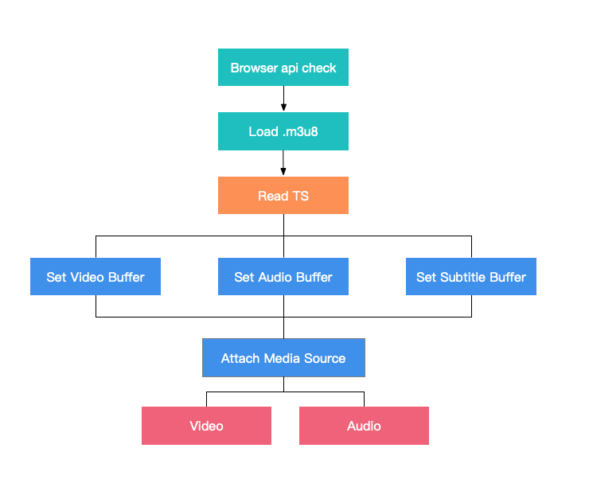

+++
title = "多媒体技术"
date = '2024-09-27T00:00:00+08:00'
lastmod = '2024-11-06T00:00:00+08:00'
draft = false
weight = 9
tags = ["面试", "前端", "HTML", "多媒体技术", "ecool"]
categories = ["前端开发", "面试"]
source = "https://fe.ecool.fun/knowledge-learn"
+++
对于大多数前端工程师来说，音视频技术是一个比较少涉足的领域，

本知识点主要介绍流媒体技术中的**文本**、**图形**、**图像**、**音频**和**视频**多种理论知识，涉及到播放器、web媒体技术、主流框架等内容。

### 一、音视频基础

#### 1.1 视频

##### 1.1.1 基础概念

| **码率** | 单位时间内取样率越大，精度就越高，处理出来的文件就越接近原始文件。 |
| --- | --- |
| **帧率** | 对视频来说，帧率对应这观看卡顿。帧率越高，流畅度越高，低帧率会造成视觉卡顿。 |
| **压缩率** | 经过压缩后文件的大小 / 原始文件的大小 * 100% = 压缩率。编码压缩越小越好，但压得越小，解压时间 |
| **分辨率** | 用于度量图像内数据量多少的一个参数，和视频清晰度息息相关。 |

##### 1.1.2 视频容器格式

容器格式相信大家经常见到：<br>
 MP4、AVI、FLV、TS/M3U8、WebM、OGV、MOV...

##### 1.1.2 视频编码格式

| **H.264** | 目前最流行的编码格式。 |
| --- | --- |
| **H.265** | 新型的编码格式，高效的视频编码。用来以替代H.264/AVC编码标准。 |
| **VP9** | VP9是WebM Project开发的下一代视频编码格式 。VP9支持从低比特率压缩到高质量超高清的所有Web和移动用例，并额外支持10/12位编码和HDR |
| **AV1** | AOM（Alliance for Open Media，开放媒体联盟）制定的一个开源、免版权费的视频编码格式。AV1是google制定的VP9标准的继任者，也是H265强有力的竞争者。 |

#### 1.2 音频

##### 1.2.1 基础概念

| **采样率** | 音频采样率是指录音设备在一秒钟内对声音信号的采样次数，采样频率越高声音的还原就越真实越自然。 |
| --- | --- |
| **采样大小** | 一秒钟所采的样本数为比特率，每个样本中信息的比特数就是位深，即采样精度，单位为Bit。 |
| **比特率** | 指每秒传送的比特(bit)数，又称数据信号速率。单位为比特/秒、千比特/秒或兆比特/秒。比特率越高，表示单位时间传送的数据就越多。 |
| **压缩率** | 原始音频数据与通过PCM等压缩编码技术压缩后的数据大小的比率 |

##### 1.2.2 音频容器格式

音频格式也比较常见：WAV、AIFF、AMR、MP3、Ogg...

##### 1.2.3 音频编码格式

| **PCM** | 脉冲编码调制(Pulse Code Modulation,PCM)，PCM是数字通信的编码方式之一。 |
| --- | --- |
| **AAC-LC(MPEG AAC Low Complexity)** | 低复杂度编码解码器（AAC-LC — 低复杂度高级音频编码）是低比特率、优质音频 的高性能音频编码解码器。 |
| **AAC-LD** | （又名AAC低延迟或MPEG-4低延迟音频编码器），为电话会议和OTT服务量身打造的低延迟音频编解码器 |
| **LAC（Free Lossless Audio Codec）** | 免费无损音频编解码器。是一套著名的自由音频压缩编码，其特点是无损压缩。 2012年以来它已被很多软件及硬件音频产品（如CD等）所支持。 |

#### 1.3 常见标签

##### 1.3.1 `<audio>` 元素

###### 1.3.1.1 基本用途

`<audio>` 元素用于在网页中嵌入音频内容。它可以播放音乐、播客、音效等。

###### 1.3.1.2 结构

```html
<audio controls>
    <source src="audio-file.mp3" type="audio/mpeg">
    <source src="audio-file.ogg" type="audio/ogg">
    Your browser does not support the audio element.
</audio>
```

###### 1.3.1.3 主要属性

- **controls**：显示音频控制界面（播放、暂停、音量等）。
- **autoplay**：页面加载时自动播放音频。
- **loop**：音频播放结束后重新开始。
- **muted**：默认静音播放。
- **preload**：设置音频加载的方式（如 `none`、`metadata`、`auto`）。

##### 1.3.2 `<video>` 元素

###### 1.3.2.1 基本用途

`<video>` 元素用于在网页中嵌入视频内容。它可以播放电影、教程、演示等。

###### 1.3.2.2 结构

```html
<video controls width="600">
    <source src="video-file.mp4" type="video/mp4">
    <source src="video-file.webm" type="video/webm">
    Your browser does not support the video element.
</video>
```

###### 1.3.2.3 主要属性

- **controls**：显示视频控制界面（播放、暂停、音量等）。
- **autoplay**：页面加载时自动播放视频。
- **loop**：视频播放结束后重新开始。
- **muted**：默认静音播放。
- **poster**：在视频加载前显示的占位图片。
- **preload**：设置视频加载的方式（如 `none`、`metadata`、`auto`）。
- **width** 和 **height**：设置视频显示的宽度和高度。

### 二、直播技术

首先看一张直观的示意图，这是一张从主播推流到用户拉流的直播流程。<br>
 

#### 流媒体协议

每一个你在网络上观看的视频或音频媒体都是依靠特定的网络协议进行数据传输，基本分布在会话层（Session Layer）、表示层（Presentation Layer）、应用层（Application Layer）。

常用协议：RTMP、RTP/RTCP/RTSP、HTTP-FLV、HLS、DASH。各个协议都有自己优势与劣势。

#### 推拉流过程

主播在设备上开启直播，采集设备将主播声音及画面采集后通过对应协议推流到「流媒体服务器」上。此时观看端(即拉流端)通过拉流协议即可从「流媒体服务器」上拉取到流数据进行播放。

### 三、播放器

本节主要讲述播放器相关技术，在本节中会简要讲述播放器在拿到相关流之后如何运作。<br>
 

#### 4.1 拉流

第一步是拉流，在播放之前率先需要拿到视频流才可能执行播放。<br>
 举个例子，flv格式的视频流数据，我们可以通过浏览器提供的：Fetch API、Stream API 进行拉流。

#### 4.2 解封装

拿到流数据之后，紧接着需要执行解封装操作。在开始播放的之前，需要把图像、声音、字幕(可能不存在)等从拉取的流数据中分离出来，这个分离的行为和过程就是解封装(demux)。<br>
 <br>
 在解封装之后获得图像、声音、字幕等基本流，而后基本流可以通过解码器进行解码。

#### 4.3 demux(解码)

从上层解封装中，我们了解到，在解封装之后，需要对分离出来的原始码流进行解码，生成音、视频播放器可播放的数据。<br>
 在解码过程中，我们会得到各式各样的数据，我们挑选几个重要的来讲：

##### 4.3.1 SPS 和 PPS

这俩哥们儿决定了最大视频分辨率、帧率等以及还有一系列视频播放当中的参数。PPS通常与SPS一起，保存在码流的起始位置。

- SPS、PPS中保存了一组编码视频序列的全局参数，如果丢掉，解码过程很可能GG。

##### 4.3.2IBP帧



- I帧，关键帧。I帧进行帧内预测，可以单独解码本帧的数据，I帧通常是每个GOP（MPEG所使用的一种视频压缩技术）的第一帧，经过适度地压缩，作为随机访问的参考点可以当成静态图像。
- B帧，向前预编码帧。它要使用一个前面的I帧或P帧和一个后面的I帧或P帧进行预测。不仅要取得之前的缓存画面，还要解码之后的画面，通过前后画面的与本帧数据的叠加取得最终的画面。
- P帧，前向预测编码在帧(predictive-frame),通过将图像序列中前面已编码帧的时间冗余信息去充分去除压缩传输数据量的编码图像，也成为预测帧。

##### 4.3.3 SEI(补充增强信息)

- 视频编码器在输出视频码流的时候，可以没有SEI。举个简单例子，之前特别火的直播答题，通过SEI传递较多和答题业务相关的信息，并通过SEI承载的信息，优化题目显示和观众音视频观看的同步性。

##### 4.3.4 PTS和DTS

-  DTS（Decoding Time Stamp）：即解码时间戳，这个时间戳的意义在于告诉播放器该在什么时候解码这一帧的数据。
-  PTS（Presentation Time Stamp）：即显示时间戳，这个时间戳用来告诉播放器该在什么时候显示这一帧的数据。<br>
 简而言之，这俩哥们儿很可能直接决定了你音视频播放是不是同步的。

解码还会生成各式各样的产物，这里就不展开介绍了，有兴趣的同学可以在本篇最后查看。

#### 4.4 remux(复用)

有demux，自然就有remux。把基本的音频ES、视频ES、字幕ES等组合成一个完整的多媒体就是Remux(复用)。<br>
 对一个视频来说，改变封装格式，改变视频编码，需要remux和demux的配合。这里不展开叙述。

#### 4.5 渲染

渲染，指的是将解码后的数据，在 pc 硬件上（显示器、扬声器）进行播放。负责渲染的模块我们称之为渲染器(Render)，视频渲染器主流有EVR（Enhanced Video Render）以及 madVR (madshi Video Render)，Web 播放器一般使用 video 标签来嵌入。

自定义渲染：以我们的H.265播放器为例，利用浏览器提供的接口来实现一个模拟的 video 标签，通过 canvas 和 audio 来实现渲染。

### 四、web媒体技术

#### 4.1 webRTC

网页即时通信（英语：Web Real-Time Communication），它允许网络应用或者站点，在不借助中间媒介的情况下，建立浏览器之间点对点（Peer-to-Peer）的连接，实现视频流和（或）音频流或者其他任意数据的**快速传输**。

组成形式：<br>
 视频引擎（VideoEngine）、音效引擎（VoiceEngine）、会议管理（Session Management）、iSAC(音效压缩)、VP8（Google自家的WebM项目的视频编解码器）、APIs（Native C++ API, Web API）



#### 4.2 MSE

用过播放器的同学对于MSE肯定不会陌生。媒体源扩展 API（MSE） 提供了实现无插件且基于 Web 的流媒体的功能。使用 MSE，媒体串流能够通过 JavaScript 创建，并且能通过使用 audio 和 video 元素进行播放。<br>
 MSE 大大地扩展了浏览器的媒体播放功能，提供允许 JavaScript 生成媒体流。这可以用于自适应流（adaptive streaming）及随时间变化的视频直播流（live streaming）等应用场景。

这里不展开叙述MSE的使用，感兴趣的同学可以去搜索一下MSE，相信能帮助到你们。

#### 4.3 WebXR

XR 是 Extended Reality (扩展现实) 的简写，包括了 VR (虚拟现实)，AR (增强现实)，MR (Mixed reality，混合现实)，WebXR 支持各种 XX 现实的设备。WebXR 允许开发人员创建在所有VR/AR设备都可运行的沉浸式内容，以实现基于 Web 的 VR/AR 体验。

#### 4.4 WebGL

WebGL（全写 Web Graphics Library）是一种 3D 绘图标准，并允许用户与之交互。这种绘图技术标准允许把 JavaScript 和 OpenGL ES 2.0 结合在一起，通过增加 OpenGL ES 2.0 的一个 JavaScript 绑定，WebGL 可以为 HTML5 Canvas 提供硬件 3D 加速渲染，这样 Web 开发人员就可以借助系统显卡来在浏览器里更流畅地展示 3D 场景和模型了，还能创建复杂的导航和数据视觉化。

WebGL 基于 canvas 画布来进行渲染。在「播放器」章节，我们了解到播放器可以通过canvas实现播放器图像渲染，通过WebGL，播放器播放流畅性能等能力得到增强。

#### 4.4 WebAssembly

WebAssembly 或者 wasm 是一个可移植、体积小、加载快并且兼容 Web 的全新格式，是由主流浏览器厂商组成的 W3C 社区团体制定的一个新的规范。

感兴趣的同学可以去[webassembly.org/](https://webassembly.org/) 了解学习。

基于wasm，播放器可以与FFmpeg结合，对目前浏览器器不能够识别的H.265视频进行解码。

### 五、使用的开源产品和框架

市面上目前流行着许多开源产品和框架，列举一些优秀的框架。

#### 5.1 flv.js

flv.js是Bilibili网站开源的HTML5 flv播放器，基于HTTP-FLV流媒体协议，通过纯js实现FLV转封装，使flv格式文件能在web上进行播放。<br>
 

官方GitHub：[github.com/bilibili/fl…](https://github.com/bilibili/flv.js)

#### 5.2 hls.js

hls.js是基于Http Live Stream协议开发，利用Media Source Extension，用于实现HLS在web上播放的一款js播放库。<br>
 值得一提的是由于HLS协议由苹果提出，并且在移动端设备上广泛支持，因此可以被广泛应用与直播场景。<br>
 

官方GitHub：[github.com/video-dev/h…](https://github.com/video-dev/hls.js/)

#### 5.3 video.js

video.js是一款基于html5的播放器，同时支持h5和flash播放，并且拥有超过100个插件可进行使用，可满足hls、dash格式播放，支持定制主题，字幕扩展等不同层次的诉求，在世界范围拥有大量的应用场景。

官方GitHub：[github.com/videojs/vid…](https://github.com/videojs/video.js)

官方文档：[videojs.com/](https://videojs.com/)

#### 5.4 FFmpeg

FFmpeg是一套领先的多媒体框架，是一套开源且跨平台的多媒体解决方案，提供了音视频的编码、解码、转码、封装、解封装、流媒体、滤镜、播放等功能。

官网地址：[ffmpeg.org/](http://ffmpeg.org/)

对于前端来说FFmpeg可以用来：

- JS播放器：可以基于FFmpeg和WebAssembly实现浏览器端的JS播放器，或扩展浏览器端其他的音视频能力。
- Node模块 fluent-ffmpeg：node.js中非常实用的模块，该模块简化了ffmpeg复杂的命令操作，且配合文件上传以及视频流的处理等非常实用，更多详情可参考 fluent-ffmpeg

#### 5.5 OBS

OBS（Open Broadcaster Software）是一个用于录制和进行网络直播的自由开源软件包。OBS使用C和C++语音编写，提供实时源和设备捕获、场景组成、编码、录制和广播。数据传输主要通过实时消息协议（RTMP）完成，可以发送到任何支持RTMP的目的地，包括YouTube、Twitch.tv、Instagram和Facebook等流媒体网站。

在视频编码方面，OBS可以使用X264自由软件程序库、Intel Quick Sync Video、Nvidia NVENC和AMD视频编码引擎将视频流编码为H.264/MPEG-4 AVC和H.265/HEVC格式。音频可以使用MP3或AAC编解码器进行编码。进阶用户可以选择使用Libavcodec/libavformat中的任何编解码器和容器，也可以将流输出到自定义FFmpeg URL。

#### 5.6 MLT

MLT是一个够用于多种类型app非线性视频编辑器引擎，且不局限于桌面领域(同样适用于Android、iOS等平台，功能十分强大。

官网地址：[www.mltframework.org/](https://www.mltframework.org/)

github：[github.com/mltframewor…](https://github.com/mltframework/mlt/)

## 常见考点

1.  **多媒体元素的定义**：<br>
  - 理解 `<audio>` 和 `<video>` 元素的基本用途及其结构。
2.  **常用属性**：<br>
  - 掌握常用属性，如 `controls`、`autoplay`、`loop`、`muted`、`preload` 等，及其功能。
3.  **格式支持**：<br>
  - 了解常见的音频和视频格式（如 MP3、OGG、MP4、WebM）及其浏览器兼容性。
4.  **嵌入多媒体**：<br>
  - 讨论如何在网页中嵌入音频和视频，包括流媒体的使用。
5.  **字幕和文本轨道**：<br>
  - 理解如何使用 `<track>` 标签为视频添加字幕和文本轨道，提升可访问性。
6.  **JavaScript 控制**：<br>
  - 掌握如何使用 JavaScript 操作音频和视频元素，比如播放、暂停、调整音量等。
7.  **响应式设计**：<br>
  - 讨论如何使多媒体元素在不同设备和屏幕尺寸下自适应显示。
8.  **性能优化**：<br>
  - 了解音视频文件的优化技巧，如压缩、格式选择，以提高加载性能和用户体验。
