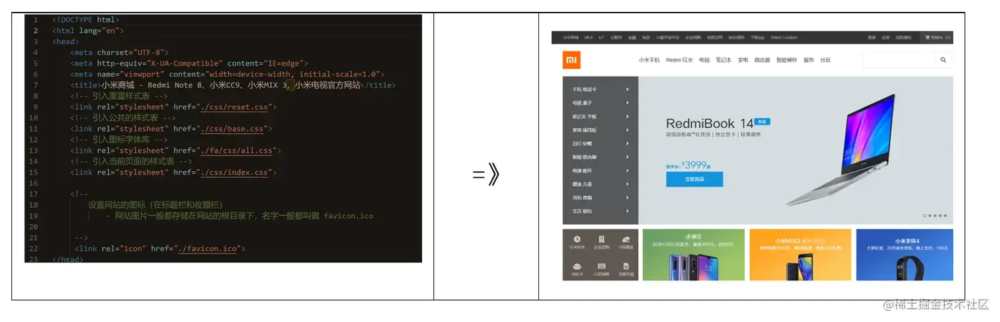
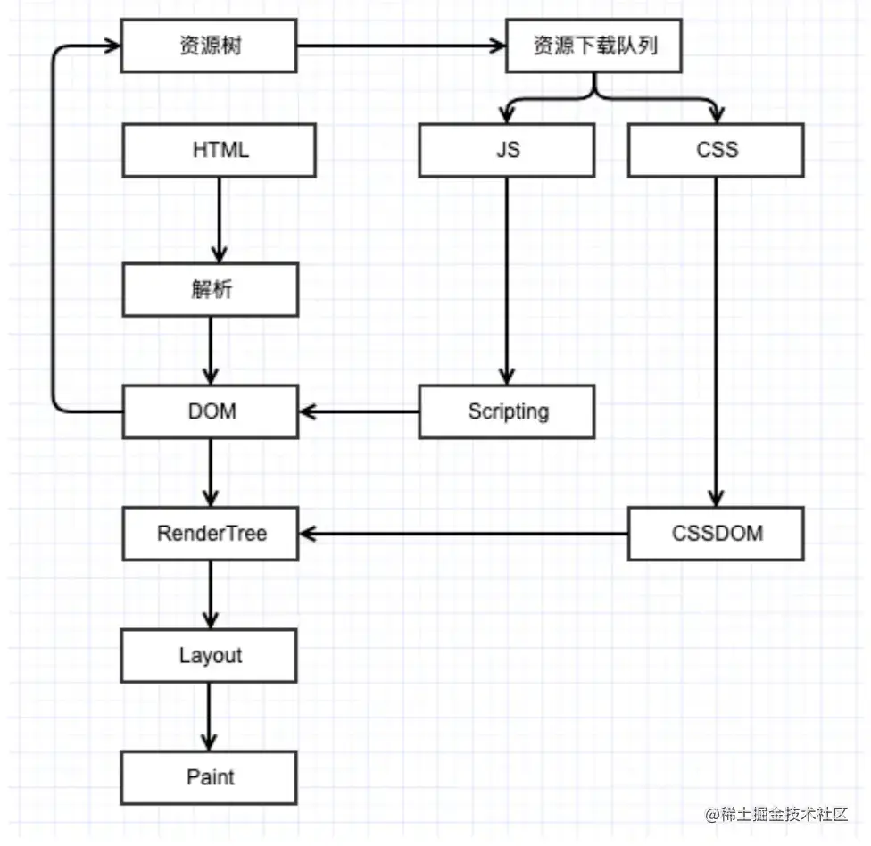
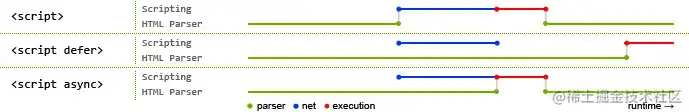

+++
title = "浏览器解析 HTML 文件"
date = '2024-11-05T00:00:00+08:00'
lastmod = '2024-11-06T00:00:00+08:00'
draft = false
weight = 23
tags = ["面试", "前端", "HTML", "浏览器解析 HTML 文件", "ecool"]
categories = ["前端开发", "面试"]
source = "https://fe.ecool.fun/knowledge-learn"
+++
## 1. 什么是浏览器解析和渲染HTML

> 一句话概括：将html代码转换成页面上显示的内容。



**表1：形象展示将HTML转换成页面上显示的内容**

## 2. 浏览器解析和渲染HTML过程？

那么浏览器拿到HTML代码后是如何把其转换成页面上显示的内容的？

### 2.1 宏观描述执行过程

#### 2.1.1 解析和渲染

首先我们来看两个概念，解析和渲染，确切来说是DOM解析和DOM渲染。

**DOM解析：** 生成DOM tree的过程。就是把你所写的各种html标签，生成一个DOM tree，可以认为就是生成了一个最原始的页面，一点样式都没有，毫无CSS修饰。

**DOM渲染：** 将DOM tree与css样式结合，生成Render tree，并将其呈现在浏览器页面上。浏览器会把本身默认的样式+用户自己写得样式整合到一起，形成一个CSS tree，而DOM渲染就是指DOM tree 和CSS tree 结合到一起，生成一个Render tree，呈现出一个带有样式的页面。

这里需要注意，**DOM解析和DOM渲染由两个不同的线程来完成的，简单说就是二者可以并行进行。**

DOM解析通常是由浏览器的主线程来完成的。DOM渲染是由浏览器的渲染线程来完成的。

分离解析和渲染的这种设计使得浏览器能够在解析 HTML 文档的同时将页面渲染到屏幕上，这样用户就能够更快地看到完整的页面了。

#### 2.1.2 宏观描述执行过程

补充了解析和渲染的概念，我们来看看浏览器具体是如何把其转换成页面上显示的内容的。其过程大致分为下图的四步。



**图1：浏览器解析和渲染HTML的过程**

**第一步**：将载入的HTML文件解析成DOM树（DOM tree），并且将各个标记标识解析成DOM树的各个节点；在解析HTML的同时会将CSS样式解析成CSS规则（CSS rules）。

**第二步**：将解析成的DOM树和CSS规则进行关联生成渲染树（Render tree）。

**第三步**：进入布局阶段，为DOM树的每个节点分配在屏幕上出现的确切坐标（这一阶段还是渲染树）

**第四步**：进入绘制阶段，在这里渲染引擎的工作就结束了，接下来就给用户界面后端（UI Backend）对渲染树的每个节点进行绘制，呈现出页面效果。

### 2.2 细化执行过程

#### 2.2.1 顺序执行

dom解析过程是从上向下，顺序执行的。顺序执行的意思是一行一行的执行，上一行执行完再执行下一行。

```xml
<h1>1<h1>
<h1>2<h1>
<h1>3<h1>
<script></script>
<style></style>
<!-- 先1，再2，再3，按顺序解析。 -->
```

#### 2.2.2 渐进式

浏览器是渐进式渲染，即边解析边渲染。通俗的说就是，这一行代码解析完，就可以在浏览器的页面渲染展示出来。因为浏览器的解析和渲染由两个不同线程来完成，所以可以实现边解析边渲染。

```xml
<h1>1</h1>
<script>debugger</script>
<h1>2</h1>
<script>debugger</script>
<h1>3</h1>
<!-- 先解析渲染出1，再debugger;再解析渲染出2，再debugger;最后解析渲染出3 -->
```

### 2.3 问题：css、js会阻塞解析和渲染吗？

这部分内容可参考这篇掘金内容，内含测试代码：[关于 JS 与 CSS 是否阻塞 DOM 的渲染和解析 - 掘金](https://juejin.cn/post/6973949865130885157#heading-0)

下述内容为该文章的一些结论整理。

#### 2.3.1 js会阻塞解析和渲染吗？

> JS会阻塞解析；JS会触发页面渲染；可以使用async和defer让它不阻塞

-  JS会阻塞解析。<br>
  -  关于JS阻塞DOM解析，比较合理的解释是，首先浏览器无法知晓JS的具体内容，倘若先解析DOM，万一JS内部全部删除掉DOM，那么浏览器就白忙活了，所以就干脆暂停解析DOM，等到JS执行完成再继续解析。
-  JS会触发页面渲染。<br>
  -  浏览器无法预先知道脚本的具体内容，因此在碰到< script>标签时，只好先渲染一次页面，确保脚本内能获取到DOM的最新的样式。倘若在决定渲染页面时，还有尚未加载完成的CSS样式，也只能等待其加载完成再去渲染页面，**这里也是后面css阻塞JS运行的真正原因。**
-  可以使用async和defer让它不阻塞。



**图2：defer,async对HTML解析的影响**

上图为defer,async的大致描述。其中蓝色代表js脚本网络加载时间，红色代表js脚本执行时间，绿色代表html解析。

#### 2.3.2 css会阻塞解析和渲染吗？

> head里的css不会阻塞解析，但会阻塞渲染；head和body中的css都会阻塞js的执行，进而阻塞解析；body里的css是否阻塞解析因浏览器而异。

- head里的css不会阻塞解析，但会阻塞渲染。

DOM Tree的解析和CSSOM Tree的解析是互不影响的，两者是并行的。因此CSS不会阻塞页面DOM的解析，但是由于render tree的生成是依赖DOM Tree和CSSOM Tree的，因此CSS必然会阻塞DOM的渲染。更为严谨一点的说，**CSS会阻塞render tree的生成，进而会阻塞DOM的渲染**。

- head和body中的css会阻塞js的执行，进而阻塞解析。

JS脚本中的内容是获取DOM元素的CSS样式属性，如果JS想要获取到DOM最新的正确的样式，势必需要所有的CSS加载完成，否则获取的样式可能是错误或者不是最新的。因此要等到JS脚本前面的CSS加载完成，JS才能再执行，并且不管JS脚本中是否获取DOM元素的样式，浏览器都要这样做。

- body里的css因浏览器而异，存在浏览器样式闪烁（FOUC，Flash of Unstyled Content）的现象。

由于浏览器引擎的架构方式不一致，在浏览器解析到Body内的CSS的时候，浏览器引擎是可以做出选择的。 一种选择是它可以在请求CSS的时候暂停后续DOM的解析，在CSS加载完成后再继续往后解析，此情况就会造成CSS阻塞DOM的解析，导致页面DOM解析及其样式渲染推迟，而此表现形式就与JS的情况相似。 另一种选择是它也可以在请求CSS的时候继续往后解析，此时CSS的加载与DOM的解析就是并行的，如果DOM 解析提前完成了，就会先渲染一次。等到CSS加载完成后再更新样式，此情况下部分DOM样式就会从默认样式立即跳转到有样式状态，形成样式闪烁。

#### 2.3.3 其他标签

> 会阻塞解析，因为顺序执行

image、iframe等，会阻塞dom的解析，因为顺序执行。

## 3. 实践经验

-  < script>标签根据需求场景合理使用async,defer。目的是根据需求克服JS阻塞DOM解析的问题。
-  写原生html代码，通常css放前面，js放后边。原因有两条：一是在加载html生成DOM tree的时候，可以同时对DOM tree进行渲染，用户体验感更好；二是JS会阻塞DOM解析，影响后续内容解析和渲染速度。
-  css尽可能写在head里。目的是避免因浏览器样式闪烁（FOUC)带来的差异。

## 常见考点

1. **浏览器解析 HTML 的基本过程**
2. **DOM 树与渲染树的构建过程**
3. **`DOCTYPE` 的作用与对浏览器渲染模式的影响**
4. **HTML 解析中的阻塞问题（如 CSS 和 JavaScript 阻塞）**
5. **Reflow（重排）与 Repaint（重绘）的区别与性能优化**
6. **如何优化首屏加载时间**
7. **浏览器如何处理外部资源（如图片、字体、CSS、JS）**
8. **资源的加载顺序及其对页面渲染的影响**
9. **CSSOM（CSS 样式对象模型）与 DOM 的结合如何影响渲染**
10. **浏览器缓存与性能优化**（如如何使用缓存策略、合并文件等）
11. **浏览器多线程与并发加载机制**
12. **HTML 渲染过程中可能的性能瓶颈及解决方法**
13. **如何避免或减少重排与重绘的次数**
14. **如何使用异步加载或懒加载优化页面性能**
