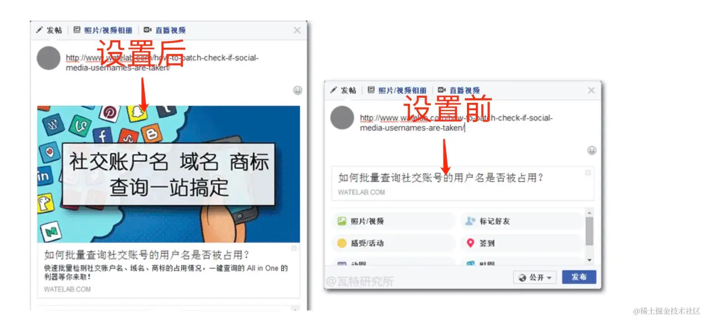
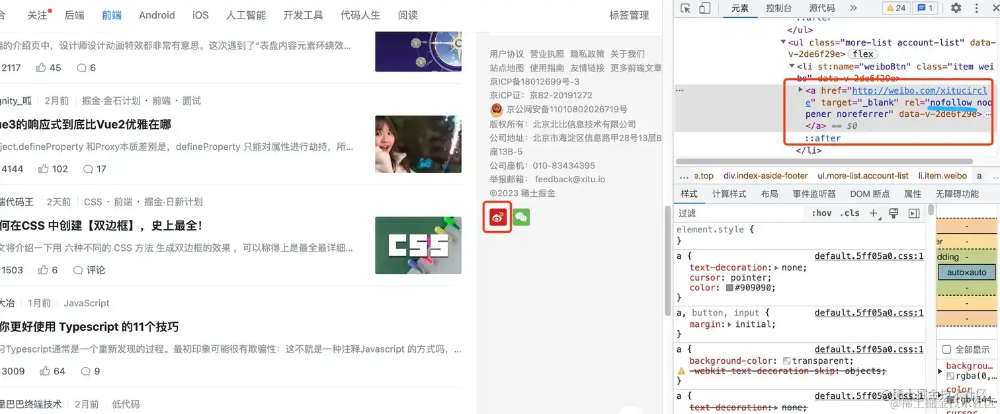
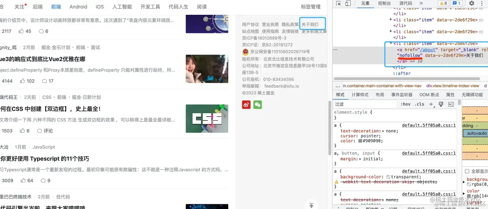
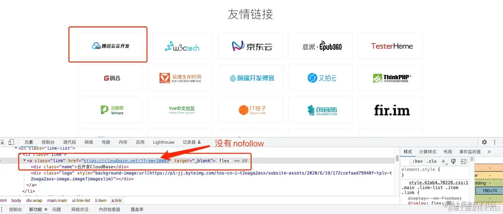
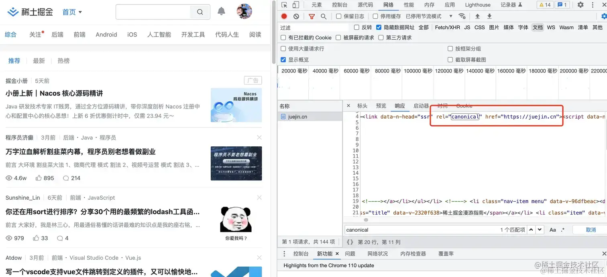
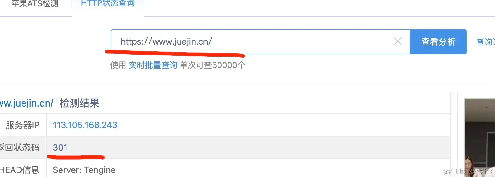

+++
title = "SEO"
date = '2024-11-05T00:00:00+08:00'
lastmod = '2024-11-06T00:00:00+08:00'
draft = false
weight = 21
tags = ["面试", "前端", "HTML", "SEO", "ecool"]
categories = ["前端开发", "面试"]
source = "https://fe.ecool.fun/knowledge-learn"
+++
## 🌻 前言

SEO 代表搜寻引擎最佳化/搜寻引擎优化(英文全名Search Engine Optimization，简称SEO)，是指通过了解搜寻引擎的自然排名的算法逻辑，以提高目标网站在有关搜寻引擎内排名的方式。

网站的 SEO 至关重要，它可以让你的网站获得更好的排名和流量，从而提高网站知名度。对于一些盈利的网站，做好seo，还可以以低成本提高投资回报率。

> 本文将为你带来非常全面的SEO方案🔥🔥🔥，当然了，网站SEO是长线工作，在做好一些基础的配置之后，更重要的是后期的维护，比如定期更新网站动态文章，不断寻找优质外链资源等🤌。

本文将以三个层面展开：

1. TDK优化
2. 网站质量
3. SEO手段（10种手段）

## ❄️ 一、TDK优化

TDK是Title(页面标题)、Meta Description（页面描述）和Meta Keywords（页面关键词）的缩写，对网站的这三个信息的提炼是网站SEO的重要环节。

但是由于一些原因，各大主流搜索引擎基本都已经**大大降低甚至移除了 `<keywords>` 对排名的影响**。例如：

- 百度：几乎放弃了对<keyword>标签的参考价值。参考：百度官方称：keywords这个meta标签已经被丢进历史垃圾堆了；
- 谷歌：目前几乎已经不考虑这个标签对于SEO的作用了，它可能更侧重于内容的相关性以及反向链接的考量。参考[：# Google 不会将关键字元标记用于网页排名](https://developers.google.com/search/blog/2009/09/google-does-not-use-keywords-meta-tag?hl=zh-cn)
- 必应：目前 keywords 标签仍然对排名有一定影响；

## （一）title标签-网站名片

title标签相当于网站的名片，他会直接显示在搜索结果中。一个好的标题势必可以为网站带来流量，从而提升网站排名。<br>
 注意：网站标题避免冗长

```js
例如：<title>掘金</title>
```

## （二）META标签-网站信息

META标签是网页head区的辅助性标签，它的作用是经过配置一些参数用以描述页面属性。**目前几乎所有搜索引擎都使用网上机器人自动查找meta值来给网页分类。**

### 2.1 meta标签如何使用

meta标签的`属性`有两种：`name`和`http- equiv`。

🍀 **"name"属性有以下配置项：**

- Keywords(关键词，现在不再重要了)：逗号分隔的关键词列表（告诉搜索引擎页面是与什么相关的）；
- description(网站内容描述，很重要)：页面描述。搜索引擎会把这个描述显示在搜索结果中；
- format-detection：格式检测，比如禁止识别电话，邮箱等；
- author：作者的名字；
- Robots：用来告诉搜索机器人哪些页面需要索引，哪些页面不需要索引；
- theme-color：网站主题色；

```js
<meta name="keywords" content="掘金,稀土,Vue.js,前端面试题,Kotlin,ReactNative,Python">

<meta name="description" content="掘金是面向全球中文开发者的技术内容分享与交流平台。我们通过技术文章、沸点、课程、直播等产品和服务，打造一个激发开发者创作灵感，激励开发者沉淀分享，陪伴开发者成长的综合类技术社区。">

<meta name="format-detection" content="telephone=no">

<meta name="author" content="cece">

<Meta name="Robots" Content="Nofollow">
/**
all：文件将被检索，且页面上的链接可以被查询；
none：文件将不被检索，且页面上的链接不可以被查询；(和 "noindex, no follow" 起相同作用)
index：文件将被检索；（让robot/spider登录）
follow：页面上的链接可以被查询；
noindex：文件将不被检索，但页面上的链接可以被查询；(不让robot/spider登录)
nofollow：文件将不被检索，页面上的链接可以被查询。(不让robot/spider顺着此页的连接往下探找)
*/

<meta name="theme-color" content="#4285f4" />
```

🍀 **"http- equiv"属性有以下配置项：**

http-equiv顾名思义，相当于http的文件头作用，它可以向浏览器传回一些有用的信息，以帮助正确和精确地显示网页内容。

```js
<meta http-equiv="参数"content="参数变量值">；
```

- refresh(期限)：定义文档自动刷新的时间间隔（下面content中的2是指停留2秒钟后自动刷新到URL网址）。这个属性值慎重使用，因为它会使得页面不受用户控制；
- set-cookie：如果网页过期，那么存盘的cookie将被删除；

```js
<meta http-equiv="refresh" content="2;URL=http://www.baidu.com">

<meta http-equiv="Set-Cookie"content="cookie value=xxx;expires=Friday,12-Jan-200118:18:18GMT；path=/">
```

### 2.2 Open Graph 协议标签

Open Graph 协议标签通过 OG Tags （OG 标签）实现的，它属于 Meta 标签的一种，可以用来标识网页类型和元素，让分享到社交网络的内容可以被有效的抓取，还可以控制分享的网站卡片呈现我们想要显示的内容。

只要看到以 `og:` 为前缀的 Meta 标签就可以判断该网页支持 OG 标签了，如下：

```ini
<meta property="og:title" content="设置Open Graph 标签！社交营销优化！">
<meta property="og:site_name" content="前端阿彬">
<meta property="og:type" content="article">
<meta property="og:description" content="Open Graph Protocol（开放图谱协议），简称 OG 协议或 OGP。">
```

设置og协议前后的网站分享卡片对比：



### 2.3 关于网站关键词

上面我们也提到了，现在 `keywords` 关键词已经被各大搜索引擎降低了权重，所以可以设置也可以不设置，但我认为它仍然有他存在的价值。

如果你决定配置网站关键词，需要注意以下几点：

- keywords 关键词数量控制在1-4个左右，避免关键词堆砌；
- 合理选择长尾关键词（长尾关键词一般是2-3个词组成。例如，目标关键词是服装，其长尾关键词可以是男士服装、冬装等），长尾关键词虽然相对核心关键词的搜索量小很多，但是它带来的流量精准度非常高，后期的转化效果更好；
- 避免使用过于专业的词汇。过于专业的词汇的搜索量较低；
- 减少使用热门关键词，要选择合适的关键词（搜索量大、转化率高、定位精准）。

### 2.3 关于网站描述

- Description（页面描述）的长度最好控制在120~200个字符；
- Description要让用户知道将从页面中获得什么；
- 在Description中合理使用行动号召（CTA）用语（例如“了解更多”、“立即获取”、“免费试用”等等……）；
- Description应该包含页面的核心关键字；
- 为每个页面创建独一无二的Description；

## 🌈 二、网站质量

## （一）确保页面性能

网站性能是会影响到网站的SEO排名的，原因可想而知：

- 网站卡顿势必会大大降低网站的用户留存率；
- 如果网站加载缓慢，搜索引擎就会认为该网站对用户不友好，从而将其排名下降；
- 影响搜索引擎蜘蛛的爬取频率；<br>
 等

参考文章 [谷歌将网页加载速度快慢作为影响排名重要因素。](https://www.xingbell.com/db/news-n42.html)

## （二）HTML语义化

语义化是指内容的结构化（内容语义化），选择合适的标签（代码语义化）。<br>
 杜绝通篇div，HTML语义化不仅便于开发者阅读，还有利于浏览器爬虫的解析，对seo优化很有帮助。<br>
 所以我们在开发时要遵循语义化的开发规范，根据页面内容，选择合适的标签，优化代码，使得网页结构更加清晰。

**下面介绍几种标签的使用：**

**h 标签**<br>
 h标签一种有六个，分别是h1，h2...h6。h1-h6文字由大到小，权重也逐渐降低。相比其他标签而言，h标签在页面中的权重非常高，所以不要滥用h标签。要利用h标签告诉浏览器网页的核心内容！例如：<br>
 h1写主标题，通常与网页title标签一致，可以在页面展示，**一个页面最好只有一个h1标签**。<br>
 h2写次级标题，h3-h6以此类推，细分网页结构。

**strong、em 标签**<br>
 `<b>`和`<strong>`标签都是加粗文字的标签，其二者的区别就在于：`<b>`是为了加粗而加粗的，`<strong>`是为了强调而加粗的。<br>
 同样斜体标签 `<i>` 和 `<em>` 也有着相同的区别，`<em>`有强调效果。<br>
 推荐使用`<strong> <em>`，而不是 `<b> <i>` 等，单纯修改加粗等样式可以用css实现。

**ul ol li 标签**<br>
 这三个都是列表标签，ul表示无序列表（unordered list），ol表示有序列表(oredr list), li 表示列表项（list item）。从网站优化的角度来说，在罗列多个词条的时候，最好使用列表标签，例如 使用ul li布局网站导航条对搜索引擎蜘蛛更加友好，也是影响搜索引擎排名的因素之一。

**img 标签**<br>
 img图片标签的 `alt` 属性是图片的替换文字。<br>
 alt属性可以帮助蜘蛛快速理解图片的具体内容，并且在网络故障时，仍然能够爬取到图片的内容信息。

**其他标签**

- **nav** 标签定义导航链接的部分；
- **aside** 标签定义侧边栏内容、引述内容；
- **header** 标签定义网站头部，介绍信息。它通常是一组介绍性描述 (搜索框 / logo / …)，网络爬虫知道诸如与之类的部分后可以非常简单的跳过它们，更好的定位网页内容；
- **article** 标签定义网站的内容部分。搜索引擎通过这个标签可以正确知道页面中哪些是正文内容；
- **section** 标签定义文档中的节（section、区段）。比如章节、页眉、页脚或文档中的其他部分；
- **footer** 标签定义文档或节的页脚。它对网站首页的排名将会增加，而对于内页来说搜索引擎将有可能会视而不见。不建议每个web的footer信息都是独立的，这或许意味着新的黑帽手段将会出现。

## （三）其他注意点

- SEO的禁忌之一就是用JS输出重要的内容。爬虫不会读取JS格式的内容，所以重要的内容必须是HTML格式，这也就是为什么现在流行的spa框架都不利于seo的原因之一；
- 尽量不使用iFrame。因为搜索引擎不会抓取iframe内的内容，所以重要内容绝对不能放在iframe中；
- 如果需要截取文字，尽量用css实现，保证文字可以完整呈现给搜索引擎。

## 🔧 三、SEO手段

## （一）各搜索引擎提交站点收录

在各个搜索引擎的站点平台提交网站收录可以缩短爬虫发现网站链接时间，加快爬虫抓取速度。

- 百度站长资源平台<br>
 [ziyuan.baidu.com/?castk=LTE%…](https://ziyuan.baidu.com/?castk=LTE%3D)
- 谷歌网站管理员工具<br>
 [www.google.cn/webmasters/](http://www.google.cn/webmasters/)
- 搜狗站长平台<br>
 [zhanzhang.sogou.com/](https://zhanzhang.sogou.com/)
- 360站长平台<br>
 [zhanzhang.so.com/]([https://zhanzhang.so.com/](https://zhanzhang.so.com/)
- 头条搜索站长平台<br>
 [zhanzhang.toutiao.com/](https://zhanzhang.toutiao.com/)
- 必应网站管理员工具<br>
 [www.bing.com/webmaster/i…](https://www.bing.com/webmaster/info/missinginfo)

## （二）sitemap站点地图

Sitemap，即站点地图，它是一个网站的全部URL列表，同时可以列出每个网址的其他元数据（上次更新的时间、更改的频率以及相对于网站上其他网址的重要程度为何等）。它可以为搜索引擎的蜘蛛进行导航，更快的找到全站中的所有链接，更全面的获取网站信息。为了保证链接的全面性和准确性，应该自动不定期更新sitemap站点地图。

一般网站的sitemap文件都会有以下两种格式：

sitemap.xml，这是大部分搜索引擎所使用的用于提交网站网址的XML文件；<br>
 sitemap.html，这是可直接放在网站上用于用户访问或搜索引擎快速找到全站链接的页面（每页最多500条，自动分页）；

sitemap.xml 文件内容格式大致如下：

```js
    <?xml version="1.0" encoding="UTF-8"?>
    <urlset
        xmlns="http://www.sitemaps.org/schemas/sitemap/0.9"
        xmlns:xsi="http://www.w3.org/2001/XMLSchema-instance"
        xsi:schemaLocation="http://www.sitemaps.org/schemas/sitemap/0.9
           http://www.sitemaps.org/schemas/sitemap/0.9/sitemap.xsd"
    >

    <url>
     <loc>https://www.cece.com/</loc>
     <priority>0.3</priority>
     <lastmod>2023-05-17</lastmod>
     <changefreq>weekly</changefreq>
    </url>

    </urlset>
```

网上有很多生成sitemap文件的站长工具，例如：<br>
 [sitemap.zhetao.com/](https://sitemap.zhetao.com/)<br>
 [tools.bugscaner.com/sitemapspid…](http://tools.bugscaner.com/sitemapspider)

生成的sitemap文件一般放在项目根目录下，然后可以在各个搜索引擎的站点平台提交sitemap.xml文件。

## （三）robots文件

蜘蛛在访问一个网站时，会首先会检查该网站的根域下是否有一个叫做 robots.txt的纯文本文件，这个文件用于指定spider在您网站上的抓取范围。

如果你有哪些页面不想被蜘蛛访问，则可以通过robots文件告诉蜘蛛不想被搜索引擎收录的部分或者指定搜索引擎只收录特定的部分。

robots文件内容语法：<br>
 此文件主要由两种键值对组成：

1. **User-agent:** 该项的值用于描述搜索引擎蜘蛛的名字。如果该项的值设为*，则该协议对任何机器人均有效。
2. **Disallow:** 该项的值用于描述不希望被访问到的一个URL，一个目录或者整个网站。以Disallow 开头的URL 均不会被搜索引擎蜘蛛访问到。任何一条Disallow 记录为空，说明该网站的所有部分都允许被访问。

参考： [掘金的robots文件：https://juejin.cn/robots.txt](https://juejin.cn/robots.txt)

```js
*网站目录下所有文件均能被所有搜索引擎蜘蛛访问*
User-agent: *
Disallow:

*禁止所有搜索引擎蜘蛛访问网站的任何部分*
User-agent: *
Disallow: /

*禁止所有的搜索引擎蜘蛛访问网站的几个目录*
User-agent: *
Disallow: /a/
Disallow: /b/

*只允许某个搜索引擎蜘蛛访问*
User-agent: Googlebot
Disallow:
```

使用场景举例：

- 将一些不重要的页面配置在robots 文件中，集中蜘蛛爬取的权重；
- 虽然 robots 文件是用于通知蜘蛛忽略哪些文件的爬取的，但是每当用户试图访问某个不存在的URL时，服务器都会在日志中记录404错误（无法找到文件）。每当搜索蜘蛛来寻找并不存在的robots.txt文件时，服务器也将在日志中记录一条404错误，所以建议还是添加一个robots.txt。
- 避免服务器上的一些文件被蜘蛛访问，例如后台管理文件、程序脚本、附件、数据库文件、编码文件、样式表文件、模板文件、导航图片和背景图片等等，例如设置`Disallow: /data/ 数据库文件`；
- 避免访问时出错，例如不能让用户直接进入购物车页面，否则会报错，所以要用 robots 文件告诉蜘蛛，阻止这个页面被搜索引擎收录；
- 如果你的网站是动态网页，并且你为这些动态网页创建了静态副本，以供搜索蜘蛛更容易抓取。那么你需要在robots.txt文件里设置避免动态网页被蜘蛛索引，以保证这些网页不会被视为含重复内容。
- 将sitemap站点地图配置在robots文件中允许蜘蛛访问。这样站长就不需要在每个搜索引擎的站长平台去提交网站的sitemap 文件，搜索引擎的蜘蛛自己就会抓取robots.txt文件，读取其中的sitemap路径，接着抓取其中链接的网页。但是目前国内的搜索引擎基本都不支持此配置。

**robots 文件使用方法：**<br>
 使用方法非常简单，只需要将 `robots.txt` 文件上传到网站根目录就行了，注意文件名一定要全小写。当成功上传后，通常在浏览器中访问域名/robots.txt就可以查看到文件。

## （四）内链｜外链

在搜索引擎优化领域，有着**内链为王、外链为皇**的说法，它们都能对提升网站排名有所帮助，尤其是外链的建设。 先来区分下网站内链和外链：

> **内链**：从自己网站的一个页面指向另外一个页面。通过内链让网站内部形成网状结构，让蜘蛛的广度和深度达到最大化。
>
> **外链**：在别的网站导入自己网站的链接。通过外链提升网站权重，提高网站流量。外链有以下几个好处：
>
> - 提升网站权重
> - 能够吸引蜘蛛来抓取网站
> - 提升关键词排名
> - 提升网址或品牌的曝光度
> - 给网站带来流量

外链能够为我们的网站带来流量，所以外链数量越多越好是必然的。但是，**一定要注意外链的质量**，例如对方网站没有被搜索引擎收录，对方网站性能过差，死链等，这些低质量的外链反而会影响到本站的排名。

另外，在添加内链外链的过程中，要注意在 a 标签中对 `nofollow` 和·`external` 属性的使用。

> `<a>` 标签的 rel 属性用于指定当前文档与被链接文档的关系。

**`rel=nofollow`使用说明 >>>**

```js
<a rel="nofollow" href="http://www.baidu.com/">百度</a>
```

带有`rel=nofollow` 属性的链接会告诉搜索引擎忽略这个链接。阻止搜索引擎对该页面进行追踪。从而避免权重分散。这个属性只对搜索引擎有效，这是一个纯粹的SEO优化标签。

使用场景：

- 屏蔽一些垃圾链接，比如网站上面评论里面的站外链接，论坛里面用户留下的链接等；
- 外链的内容与本站无关时，建议使用nofollow；



- 外链站点不稳定，性能较差时，建议使用nofollow；
- 友链一般作为网站交换链接，互惠互利，是不会设置nofollow的，所以在交换友链之前，一定要对对方的网站质量进行审核；
- 内部链接密度过大，页面重要性不高时，可以使用nofoolw，例如很多网站常有的“关于我们”页面，比如掘金的：



6. 并不是内容无关的外链都要加nofollow。**适当的添加高质量的外链**，对于SEO是没有坏处的，还会产生正向影响，所以关键就在于外链的质量和数量上。例如掘金的友链：



**`rel=external`使用说明 >>>**

```js
<a rel="external" href="http://www.baidu.com/">百度</a>
```

external字面意思是“外部的”，a 标签加上这个属性代表这个链接是外部链接，非本站链接，点击时会在新窗口中打开，它和`target="_blank"`效果一样。external 可以告诉搜索引擎这是一个外部链接，非本站的链接。

## （五）Canonical URL（网址规范化）

什么是网址规范化？简单举个例子：<br>
 [juejin.cn](https://juejin.cn/)<br>
 [www.juejin.cn](https://www.juejin.cn/)<br>
 [www.juejin.cn/index.html](https://www.juejin.cn/index.html)<br>
 这几个网址虽然url不同，搜索引擎也确实把他当作不同的网址，但是其实这些网址返回的都是同一个页面，这就是不规范网址。

**网页规范化的两个好处：**

- 解决网站由于网站url链接不一样，但网页内容是一样而造成搜索引擎重复收录的问题；
- 有利于URL权重集中。

**解决方法：**<br>
 在页面的`head` 标签中，加入以下canonical标签，指定规范化网址。

```bash
<head>
  <link rel="canonical" href="href="https://juejin.cn"/>
</head>
```

例如掘金的规范化网址：



## （六）网站301重定向

301/302重定向是 SEO优化中一种重要的自动转向技术。301重定向是当搜索引擎向网站服务器发出访问请求时，服务返回的HTTP数据流中头信息(header)部分状态码的一种，表示本网址永久性转移到另一个地址。302重定向则表示暂时转移。

301重定向与上一点所说的网址规范化有着类似的作用，与此同时，它还具有以下作用：

- 集中域名权重，301 网址跳转其实是对域名权重进行转移，比如 `www.juejin.cn` 重定向到 `juejin.cn`，其实是把 `www.juejin.cn` 的权重转移到了 `juejin.cn`，从而增加 `juejin.cn` 域名的权重；
- 避免重复收录；
- 网页PR（PageRank-网页级别）是用来评估一个网站页面相对于网站其他页面重要性的一个算法，301定向跳转有利于网站PR的传递；
- 优化用户体验，网址规范化可以让用户更好地记住我们的网站，可以将域名统一重定向到某一个域名，增加网站的记忆度，获取更好的用户体验。

虽然`canonical标签`可以规范化网址，但是以下四种情况必须配置301重定向：

1. 网站替换域名后，通过301永久重定向旧域名重定向到新域名，弥补流量损失和SEO;
2. 如果删除掉网站中的一些页面，但是这个页面有一定的流量和权重，可以利用301重定向到合适的页面避免流量流失；
3. 网站改版或因为其他原因导致页面地址发生变化，为避免出现死链接，可以通过 301 重定向来解决；
4. 如果您有多个空闲的域名需要指向相同的站点，则可以使用301永久重定向；

**如何验证301重定向是否生效：**<br>
 可以使用站长工具`[HTTP状态查询](https://tool.chinaz.com/pagestatus/)` 查看返回的状态码是否为301。



## （七）网站设置伪静态页面

> 伪静态页面是指动态网页通过重写URL的方法实现去掉动态网页的参数,但在实际的网页目录中并没有必要实现存在重写的页面。

动态页面通常是php或者asp等语言结合数据库，通过代码调用数据来实现页面展示。

伪静态化就是将动态页面的url转换成以 .html 等结尾的静态页面url，以增强搜索引擎的友好性（符合搜索引擎的抓取规则），同时方便用户输入和记忆。

举个例子： 比如有个asp动态页面：[http://127.0.0.1/test.asp?id=1234](http://127.0.0.1/test.asp?id=1234)<br>
 在伪静态化后，就可以通过类似的url访问这个页面： [http://127.0.0.1/test_1234.html](http://127.0.0.1/test_1234.html)

一般实现手段是在 nginx/apache 等服务器配置rewrite重写规则，将动态url转变为静态url。

## （八）使用HTTPS

谷歌曾发公告表示，使用安全加密协议（HTTPS），是搜索引擎排名的一项参考因素。<br>
 所以，在域名相同情况下，HTTPS站点比HTTP站点，能获得更好的排名。

## （九）SSR服务端渲染（ Server-Side Rendering）

当下SPA应用盛行，虽然它有用户体验好，服务器压力小等优点，但是同时也暴露出很多问题。例如首屏加载较慢，不利于SEO等（因为这些spa应用内容是由js动态更新的，蜘蛛无法爬取网页内容）。

而ssr的出现，很好的解决了seo的问题。因为服务端渲染是指指客户端向服务器发出请求，然后运行时动态生成 html 内容并返回给客户端。所以客户端可以获取到完整的页面内容。

目前流行的 Vue/React 前端框架，都有SSR的解决方案：<br>
 [Vue的nuxt.js](https://www.nuxtjs.cn/)<br>
 [React的next.js](https://www.nextjs.cn/)

对于 Vue/React 来说，对于它们的 SSR/SSG 框架出现的原因就是主要就是 SEO 和首屏加载速度。

## （十）预渲染prerender-spa-plugin

如果你只想改善部分页面的SEO，可以不采用 SSR 的解决方案，毕竟无论是next.js，还是nuxt.js，都是有一定学习成本的。那么你可以使用 `prerender-spa-plugin` 等插件来实现预渲染页面，在构建时就针对特定的路有生成静态的 html 文件。

## 常见考点

### 1. **页面结构与语义化 HTML**

- **语义化 HTML 标签**：使用正确的 HTML 标签（如 `<header>`, `<footer>`, `<article>`, `<section>`, `<nav>`, `<main>` 等）有助于搜索引擎理解页面内容的结构。
- **重要性**：搜索引擎会根据页面的结构来判断页面的主题和重要性，使用语义化的标签有助于 SEO。
- **考察点**：<br>
  - 什么是语义化 HTML？
  - 为什么语义化标签对 SEO 重要？
  - 常见的语义化 HTML 标签及其作用。

### 2. **页面标题（`<title>`）**

- **定义**：页面的 `<title>` 标签是搜索引擎和用户浏览器中最重要的内容之一。
- **最佳实践**：页面标题应简洁、描述性强，并包含目标关键字。
- **考察点**：<br>
  - `<title>` 标签的最佳实践。
  - 如何优化页面标题以提高 SEO。
  - 页面标题与 SEO 排名的关系。

### 3. **Meta 描述（`<meta name="description">`）**

- **定义**：`<meta name="description">` 提供了页面的简短描述，通常在搜索引擎的结果页面（SERP）中显示。
- **最佳实践**：保持描述简洁（150-160 字符），并包含相关的关键字和吸引点击的内容。
- **考察点**：<br>
  - Meta 描述如何影响搜索结果。
  - 为什么 Meta 描述对用户体验和 SEO 都很重要。
  - 编写有效的 Meta 描述的方法。

### 4. **关键词优化（Keyword Optimization）**

- **定义**：在页面内容中合理使用关键词，以提高该页面在相关搜索中的排名。
- **最佳实践**：避免关键词堆砌，确保内容自然流畅，同时合理使用关键词。
- **考察点**：<br>
  - 如何选择目标关键词？
  - 关键词在页面中的正确位置和密度。
  - 关键词堆砌（Keyword Stuffing）的危害。

### 5. **URL 结构**

- **定义**：URL 结构对 SEO 很重要。简洁、描述性强且包含关键词的 URL 有助于提升页面的可读性和搜索引擎的排名。
- **最佳实践**：使用短小且富有描述性的 URL，避免使用过长的参数或乱码。
- **考察点**：<br>
  - 什么样的 URL 结构有利于 SEO？
  - 静态 URL 与动态 URL 对 SEO 的影响。
  - 如何优化 URL 以提高排名。

### 6. **H1、H2 等标题标签**

- **定义**：标题标签（`<h1>`, `<h2>`, `<h3>` 等）帮助搜索引擎理解页面的结构和内容的层次。
- **最佳实践**：确保每个页面有且只有一个 `<h1>`，并且将重要的关键字放在 `<h1>` 标签中。使用 `<h2>`, `<h3>` 等标签来划分页面的子内容。
- **考察点**：<br>
  - 为什么 `<h1>` 标签对 SEO 很重要？
  - 使用 `<h2>`, `<h3>` 等标签的正确方法。
  - 如何使用标题标签提高页面的可访问性和 SEO。

### 7. **图片优化（Image Optimization）**

- **定义**：优化图片大小、格式和 `alt` 属性，能够提高页面的加载速度，提升用户体验，同时也有助于 SEO。
- **最佳实践**：使用压缩的图片格式（如 WebP），确保图片有清晰的 `alt` 文本，图片大小适中。
- **考察点**：<br>
  - 如何优化图片文件大小以提升 SEO？
  - `alt` 属性在图片 SEO 中的作用。
  - 使用响应式图片（`<picture>` 标签）提高图片加载速度和 SEO。

### 8. **内部链接结构（Internal Linking）**

- **定义**：内部链接是网站页面之间的链接，它们帮助搜索引擎抓取网站内容并理解页面之间的关系。
- **最佳实践**：创建良好的内部链接结构，确保重要页面容易访问，同时避免链接过度堆砌。
- **考察点**：<br>
  - 为什么内部链接对 SEO 很重要？
  - 如何有效管理内部链接？
  - 内部链接与页面排名的关系。

### 9. **外部链接和反向链接（Backlinks）**

- **定义**：反向链接指的是其他网站指向你的网站的链接。搜索引擎将反向链接视为网站的“信誉”或“权威”的证明。
- **最佳实践**：获取高质量的反向链接，提高网站的可信度。
- **考察点**：<br>
  - 什么是反向链接？为什么它对 SEO 很重要？
  - 如何获得高质量的反向链接？
  - 低质量反向链接的影响（如垃圾链接、过度优化的链接等）。

### 10. **网站速度优化**

- **定义**：页面加载速度是 SEO 排名的一个重要因素，尤其是对移动端用户来说。
- **最佳实践**：优化图片、使用懒加载、压缩 JavaScript 和 CSS 文件、启用浏览器缓存等。
- **考察点**：<br>
  - 为什么网站速度对 SEO 重要？
  - 如何使用工具（如 Google PageSpeed Insights）评估网站速度？
  - 优化网站速度的常见技术。

### 11. **响应式设计与移动端优化**

- **定义**：移动优先（Mobile-first）和响应式设计（Responsive Design）是 SEO 的关键因素，因为 Google 等搜索引擎越来越倾向于为移动端优化排名。
- **最佳实践**：确保网站在所有设备上都能良好显示，使用适当的 `meta` 标签（如 `viewport`）。
- **考察点**：<br>
  - 响应式设计与 SEO 排名的关系。
  - 如何通过 `meta viewport` 标签优化移动端体验？
  - 如何测试和优化移动端友好性？

### 12. **结构化数据（Structured Data）**

- **定义**：结构化数据是向搜索引擎提供标准化信息的方式，通常使用 JSON-LD、Microdata 或 RDFa 格式。
- **最佳实践**：通过结构化数据（如 Schema.org 标记）提供清晰的页面内容描述，帮助搜索引擎更好地理解页面的内容和功能。
- **考察点**：<br>
  - 什么是结构化数据？如何使用它提升 SEO？
  - 使用结构化数据（如产品、评论、FAQ）来增加富媒体片段（rich snippets）。
  - 结构化数据的常见实现方法和规范。

### 13. **SEO 工具和技术**

- **定义**：通过工具分析网站的 SEO 性能，找出潜在问题并进行优化。
- **常见工具**：<br>
  - Google Search Console：用于检查网站的索引情况和性能。
  - Google Analytics：监控网站的流量来源和用户行为。
  - SEMrush、Ahrefs：分析关键词排名、反向链接等。
- **考察点**：<br>
  - 如何使用 Google Search Console 来提高 SEO？
  - 介绍常用的 SEO 分析工具及其作用。
  - 使用分析工具优化页面的关键词排名和流量。

### 14. **SEO 中的用户体验（UX）**

- **定义**：用户体验在 SEO 中起着越来越重要的作用。良好的用户体验能提高页面的停留时间、降低跳出率，并影响排名。
- **考察点**：<br>
  - 用户体验如何影响 SEO 排名？
  - 如何通过改进导航、内容和布局优化用户体验？
