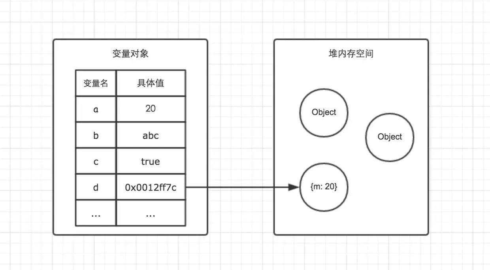
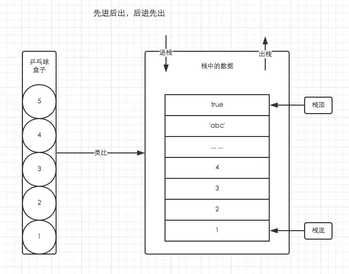
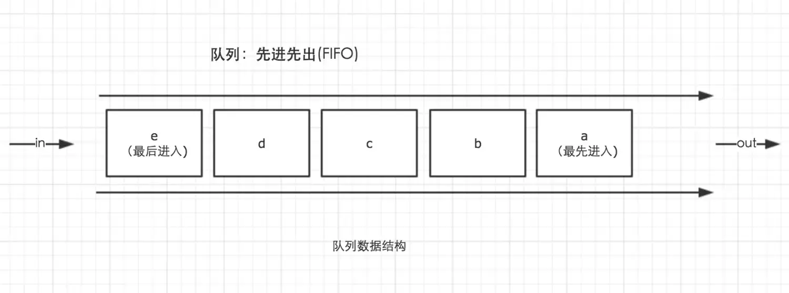
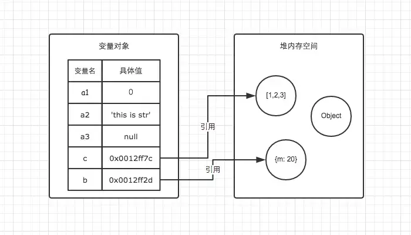
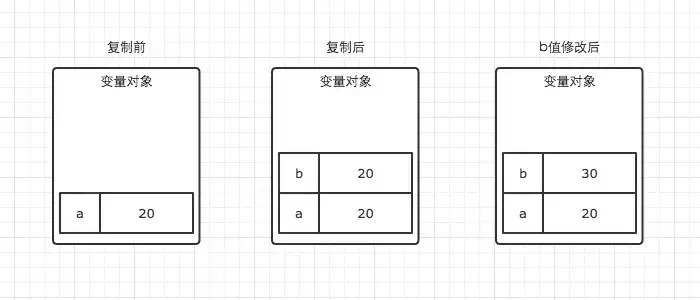
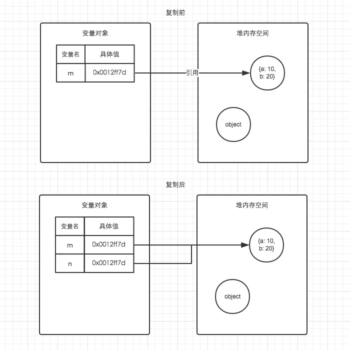

+++
title = "内存空间"
date = '2024-11-06T00:00:00+08:00'
lastmod = '2024-11-08T00:00:00+08:00'
draft = false
weight = 4
tags = ["面试", "前端", "JavaScript", "内存空间", "ecool"]
categories = ["前端开发", "面试"]
source = "https://fe.ecool.fun/knowledge-learn"
+++


```javascript
var a = 20;
var b = 'abc';
var c = true;
var d = { m: 20 }
```

因为JavaScript具有自动垃圾回收机制，所以对于前端开发来说，内存空间并不是一个经常被提及的概念，很容易被大家忽视。特别是很多不是计算机专业的朋友在进入到前端之后，会对内存空间的认知比较模糊，甚至有些人干脆就是一无所知。

当然也包括我自己。在很长一段时间里认为内存空间的概念在JS的学习中并不是那么重要。可是后我当我回过头来重新整理JS基础时，发现由于对它们的模糊认知，导致了很多东西我都理解得并不明白。比如最基本的引用数据类型和引用传递到底是怎么回事儿？比如浅复制与深复制有什么不同？还有闭包，原型等等。

因此后来我才渐渐明白，想要对JS的理解更加深刻，就必须对内存空间有一个清晰的认知。

在学习内存空间之前，我们需要对三种数据结构有一个直观的认知。他们分别是**堆(heap)，栈(stack)与队列(queue)**。

##### 一、栈数据结构

与C/C++不同，JavaScript中并没有严格意义上区分栈内存与堆内存。因此我们可以简单粗暴的理解为JavaScript的所有数据都保存在堆内存中。但是在某些场景，我们仍然需要基于堆栈数据结构的思维来实现一些功能，比如JavaScript的执行上下文（关于执行上下文我会在下一篇文章中总结）。执行上下文的执行顺序借用了栈数据结构的存取方式。(也就是后面我们会经常提到的函数调用栈)。因此理解栈数据结构的原理与特点十分重要。

要简单理解栈的存取方式，我们可以通过类比乒乓球盒子来分析。如下图左侧。



这种乒乓球的存放方式与栈中存取数据的方式如出一辙。处于盒子中最顶层的乒乓球5，它一定是最后被放进去，但可以最先被使用。而我们想要使用底层的乒乓球1，就必须将上面的4个乒乓球取出来，让乒乓球1处于盒子顶层。这就是栈空间**先进后出，后进先出**的特点。图中已经详细的表明了栈空间的存储原理。

##### 二、堆数据结构

堆数据结构是一种树状结构。它的存取数据的方式，则与书架与书非常相似。

书虽然也整齐的存放在书架上，但是我们只要知道书的名字，我们就可以很方便的取出我们想要的书，而不用像从乒乓球盒子里取乒乓一样，非得将上面的所有乒乓球拿出来才能取到中间的某一个乒乓球。好比在JSON格式的数据中，我们存储的`key-value`是可以无序的，因为顺序的不同并不影响我们的使用，我们只需要关心书的名字。

#### 三、队列

在JavaScript中，理解队列数据结构的目的主要是为了清晰的明白事件循环（Event Loop）的机制到底是怎么回事。在后续的章节中我会详细分析事件循环机制。

队列是一种先进先出（FIFO）的数据结构。正如排队过安检一样，排在队伍前面的人一定是最先过检的人。用以下的图示可以清楚的理解队列的原理。



##### 四、变量对象与基础数据类型

JavaScript的执行上下文生成之后，会创建一个叫做变量对象的特殊对象（具体会在下一篇文章与执行上下文一起总结），JavaScript的基础数据类型往往都会保存在变量对象中。

> 严格意义上来说，变量对象也是存放于堆内存中，但是由于变量对象的特殊职能，我们在理解时仍然需要将其于堆内存区分开来。

基础数据类型都是一些简单的数据段，JavaScript中有5中基础数据类型，分别是`Undefined、Null、Boolean、Number、String`。基础数据类型都是按值访问，因为我们可以直接操作保存在变量中的实际的值。

> ES6中新加了一种基础数据类型Symbol，可以先不用考虑他

##### 五、引用数据类型与堆内存

与其他语言不同，JS的引用数据类型，比如数组Array，它们值的大小是不固定的。引用数据类型的值是保存在堆内存中的对象。JavaScript不允许直接访问堆内存中的位置，因此我们不能直接操作对象的堆内存空间。在操作对象时，实际上是在操作对象的引用而不是实际的对象。因此，引用类型的值都是按引用访问的。这里的引用，我们可以理解为保存在变量对象中的一个地址，该地址与堆内存的实际值相关联。

为了更好的搞懂变量对象与堆内存，我们可以结合以下例子与图解进行理解。

```javascript
var a1 = 0;   // 变量对象
var a2 = 'this is string'; // 变量对象
var a3 = null; // 变量对象

var b = { m: 20 }; // 变量b存在于变量对象中，{m: 20} 作为对象存在于堆内存中
var c = [1, 2, 3]; // 变量c存在于变量对象中，[1, 2, 3] 作为对象存在于堆内存中
```



因此当我们要访问堆内存中的引用数据类型时，实际上我们首先是从变量对象中获取了该对象的地址引用（或者地址指针），然后再从堆内存中取得我们需要的数据。

理解了JS的内存空间，我们就可以借助内存空间的特性来验证一下引用类型的一些特点了。

在前端面试中我们常常会遇到这样一个类似的题目

```javascript
// demo01.js
var a = 20;
var b = a;
b = 30;

// 这时a的值是多少？
```

```javascript
// demo02.js
var m = { a: 10, b: 20 }
var n = m;
n.a = 15;

// 这时m.a的值是多少
```

在变量对象中的数据发生复制行为时，系统会自动为新的变量分配一个新值。`var b = a`执行之后，a与b虽然值都等于20，但是他们其实已经是相互独立互不影响的值了。具体如图。所以我们修改了b的值以后，a的值并不会发生变化。



在demo02中，我们通过`var n = m`执行一次复制引用类型的操作。引用类型的复制同样也会为新的变量自动分配一个新的值保存在变量对象中，但不同的是，这个新的值，仅仅只是引用类型的一个地址指针。当地址指针相同时，尽管他们相互独立，但是在变量对象中访问到的具体对象实际上是同一个。如图所示。

因此当我改变n时，m也发生了变化。这就是引用类型的特性。



通过内存的角度来理解，是不是感觉要轻松很多？除此之外，我们还可以以此为基础，一步一步的理解JavaScript的执行上下文，作用域链，闭包，原型链等重要概念。其他的我会在以后的文章慢慢总结，敬请期待。

##### 六、内存空间管理

因为JavaScript具有自动垃圾收集机制，所以我们在开发时好像不用关心内存的使用问题，内存的分配与回收都完全实现了自动管理。但是根据我自己的开发经验，了解内存机制有助于自己清晰的认识到自己写的代码在执行过程中发生过什么，从而写出性能更加优秀的代码。因此关心内存是一件非常重要的事情。

JavaScript的内存生命周期

```javascript
1. 分配你所需要的内存
2. 使用分配到的内存（读、写）
3. 不需要时将其释放、归还
```

为了便于理解，我们使用一个简单的例子来解释这个周期。

```javascript
var a = 20;  // 在内存中给数值变量分配空间
alert(a + 100);  // 使用内存
a = null; // 使用完毕之后，释放内存空间
```

第一步和第二步我们都很好理解，JavaScript在定义变量时就完成了内存分配。第三步释放内存空间则是我们需要重点理解的一个点。

JavaScript有自动垃圾收集机制，那么这个自动垃圾收集机制的原理是什么呢？其实很简单，就是找出那些不再继续使用的值，然后释放其占用的内存。垃圾收集器会每隔固定的时间段就执行一次释放操作。

在JavaScript中，最常用的是通过**标记清除**的算法来找到哪些对象是不再继续使用的，因此`a = null`其实仅仅只是做了一个释放引用的操作，让 a 原本对应的值失去引用，脱离执行环境，这个值会在下一次垃圾收集器执行操作时被找到并释放。而在适当的时候解除引用，是为页面获得更好性能的一个重要方式。

> - 在局部作用域中，当函数执行完毕，局部变量也就没有存在的必要了，因此垃圾收集器很容易做出判断并回收。但是全局变量什么时候需要自动释放内存空间则很难判断，因此在我们的开发中，需要尽量避免使用全局变量。
> - 要详细了解垃圾收集机制，建议阅读《JavaScript高级编程》中的4.3节

## 常见考点

1.  **内存分配与回收**<br>
  - JavaScript 中的内存分配是如何进行的？有哪些常见的内存区域（如堆和栈）？
  - 当一个函数执行完毕后，JavaScript 是如何处理该函数中占用的内存的？
2.  **垃圾回收机制**<br>
  - 请解释 JavaScript 中常见的垃圾回收机制，特别是标记-清除算法。
  - 在什么情况下会导致内存无法回收？有哪些常见的内存泄漏场景？
3.  **闭包与内存管理**<br>
  - 闭包会导致什么样的内存问题？如何在使用闭包时尽量避免内存泄漏？
  - 如何在需要时清除闭包中不再需要的引用，以减少内存占用？
4.  **内存泄漏的原因与防范**<br>
  - 举例说明几种常见的内存泄漏场景（例如，意外的全局变量、未清除的定时器或事件监听器、DOM 引用等）。
  - 你如何在项目中监控和排查内存泄漏问题？
5.  **优化内存使用**<br>
  - 谈谈你在项目中如何管理和优化内存，确保页面性能。
  - 你如何确保定时器、事件监听器等在使用完毕后被清理，以避免占用内存？
6.  **工具和方法**<br>
  - 使用过哪些工具或方法来检测和分析内存使用？比如浏览器开发者工具中的性能分析。
  - 在调试内存问题时，你的常用流程是什么？
