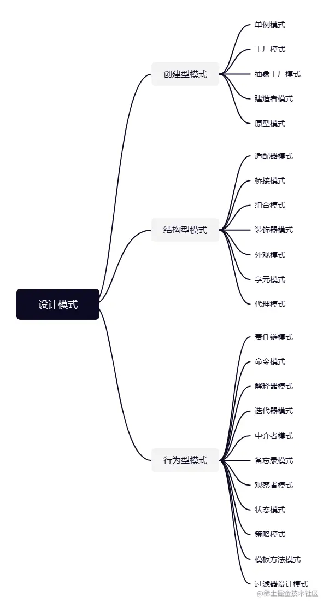
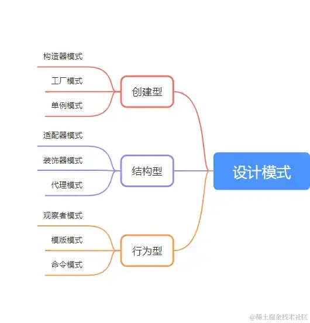

+++
title = "设计模式"
date = '2024-10-01T00:00:00+08:00'
lastmod = '2025-11-05T00:00:00+08:00'
draft = false
weight = 29
tags = ["面试", "前端", "JavaScript", "设计模式", "ecool"]
categories = ["前端开发", "面试"]
source = "https://fe.ecool.fun/knowledge-learn"
+++
说到设计模式，大家想到的就是六大原则，23种模式。这么多模式，并非都要记住，但作为前端开发，对于前端出现率高的设计模式还是有必要了解并掌握的，浅浅掌握9种模式后，整理了这份文章。

那么，我们先了解六大原则

## 六大原则：

- 依赖倒置原则(Dependence Inversion Principle)：高层(业务层)不应该直接调用底层(基础层)模块
- 开闭原则(Open Close Principle)：单模块对拓展开放、对修改关闭
- 单一原则(Single Responsibility Principle)：单模块负责的职责必须是单一的
- 迪米特法则(Law of Demeter)：对外暴露接口应该简单
- 接口隔离原则(Interface Segregation Principle)：单个接口(类)都应该按业务隔离开
- 里氏替换原则(Liskov Substitution Principle)：子类可以替换父类

> 六大原则也可以用六个字替换：高内聚低耦合。
>
> - **高**层不直接依赖底层：依赖倒置原则
> - **内**部修改关闭，外部开放扩展：开闭原则
> - **聚**合单一功能：单一原则
> - **低**知识接口，对外接口简单：迪米特法则
> - **耦**合多个接口，不如隔离拆分：接口隔离原则
> - **合**并复用，子类可以替换父类：里氏替换原则

我们采用模式编写时，要尽可能遵守这六大原则

## 23 种设计模式分为“创建型”、“行为型”和“结构型”



## 前端九种设计模式



## 一、创建型

创建型从功能上来说就是创建元素，目标是规范元素创建步骤

### 1.构造器模式：抽象了对象实例的变与不变(变的是属性值，不变的是属性名)

```js
// 需求：给公司员工创建线上基本信息
// 单个员工创建，可以直接使用创建
const obj = {
    name:'张三',
    age:'20',
    department:'人力资源部门'
}
// 可员工的数量过于多的时候，一个个创建不可行，那么就可以使用构造器模式
class Person {
    constructor(obj){
        this.name = obj.name
        this.age = obj.age
        this.department = obj.department
    }
}
const person1 = new Person(obj)
```

### 2. 工厂模式：为创建一组相关或相互依赖的对象提供一个接口，且无须指定它们的具体类

即隐藏创建过程、暴露共同接口。

```js
// 需求：公司员工创建完信息后需要为每一个员工创建一个信息名片
class setPerson {
    constructor(obj) {
        this.pesonObj = obj
    }
    creatCard() {
        //创建信息名片
    }
    otherFynction(){

    }
}
class Person {
    constructor(obj) {
        return new setPerson(obj)
    }
}
const person = new Person()
const card = person.creatCard({
    name:'张三',
    age:'20',
    department:'人力资源部门'
})
```

### 3. 单例模式：全局只有一个实例，避免重复创建对象，优化性能

```js
// 需求：判断一款应用的开闭状态，根据不同状态给出不同提示
class applicationStation {
    constructor() {
        this.state = 'off'
    }
    play() {
        if (this.state === 'on') {
            console.log('已打开')
            return
        }
        this.state = 'on'
    }
    shutdown() {
        if (this.state === 'off') {
            console.log('已关闭')
            return
        }
        this.state = 'off'
    }
}
window.applicationStation = new applicationStation()
// applicationStation.instance = undefined
// applicationStation.getInstance = function() {
//    return function() {
//        if (!applicationStation.instance) {  // 如果全局没有实例再创建
//            applicationStation.instance = new applicationStation()
//        }
//        return applicationStation.instance
//    }()
// }
// application1和application2拥有同一个applicationStation对象
const application1 = window.applicationStation
const application2 = window.applicationStation

```

## 二、结构型

结构型从功能上来说就是给元素添加行为的，目标是优化结构的实现方式

### 1. 适配器模式:适配独立模块，保证模块间的独立解耦且连接兼容

```js
// 需求：一个港行PS，需要适配插座国标
class HKDevice {
    getPlug() {
        return '港行双圆柱插头'
    }
}

class Target {
    constructor() {
        this.plug = new HKDevice()
    }
    getPlug() {
        return this.plug.getPlug() + '+港行双圆柱转换器'
    }
}

const target = new Target()
target.getPlug()
```

### 2. 装饰器模式：动态将责任附加到对象之上

```js
// 说回我们之前说的为公司员工创建名片需求，现在追加需求，要给不同工龄的员工，创建不同的类型名片样式
//由于的工厂函数还有其他各种方法，不好直接改动原工厂函数，这时候我们可以使用装饰器模式实现
class setPerson {
    constructor(obj) {
        this.pesonObj = obj
    }
    creatCard() {
        //创建信息名片
    }
    otherFynction(){

    }
}
// 追加
class updatePerson {
    constructor(obj) {
        this.pesonObj = obj
    }
    creatCard() {
        this.pesonObj.creatCard()
        if(this.pesonObj.seniorityNum<1){
               this.update(this.pesonObj)
        }
    }
    update(pesonObj) {
        //追加处理
    }
}

const person = new setPerson()
const newPerson = new updatePerson(person)
newDevice.creatCard()
```

### 3. 代理模式：使用代理人来替代原始对象处理更专业的事情

```js
// 需求：在单例模式中，我们实现了应用状态的判断，现在，我们需要控制这个应用要在登录注册的情况下才能使用,可以通过代理模式，讲这个需求代理给专门拦截的对象进行判断
class applicationStation {
    init() {
        return 'hello'
    }
}

class User {
    constructor(loginStatus) {
        this.loginStatus = loginStatus
    }
}

class applicationStationProxy {
    constructor(user) {
        this.user = user
    }
    init() {
        return this.user.loginStatus ? new applicationStation().init() : please Login
    }
}

const user = new User(true)
const userProcy = new applicationStationProxy(user)
userProcy.init()
```

## 三、行为型

不同对象之间责任的划分和算法的抽象化

### 1. 观察者模式:当一个属性发生变化时，观察者会连续引发所有的相关状态变更

```js
// 需求：通过智能家居中心一键控制系统
class MediaCenter {
    constructor() {
        this.state = ''
        this.observers = []
    }
    attach(observers) {
        this.observers.push(observers)
    }
    getState() {
        return this.state
    }
    setState(state) {
        this.state = state
        this.notifyAllobservers()
    }
    notifyAllobservers() {
        this.observers.forEach(ob => {
            ob.update()
        })
    }
}

class observers {
    constructor(name, center) {
        this.name = name
        this.center = center
        this.center.attach(this)
    }
    update() {
        // 更新状态
        this.center.getState()
    }
}
```

### 2. 模版模式：在模版中，定义好每个方法的执行步骤。方法本身关注于自己的事情

```js
// 需求：新员工入职，按照规定流程，进行相关培训和办理好员工相关资料
class EntryPath {
    constructor(obj) {
       // some code
    }
    init() {
        // 初始化员工信息
    }
    creatCard() {
        // 创建员工名片
    }
    inductionTraining() {
        // 入职培训
    }
    trainingExamination() {
        // 训后测试
    }
    personEntry() {
        this.init()
        this.creatCard()
        this.inductionTraining()
        this.trainingExamination()
    }
}
```

### 3. 命令模式:请求以指令的形式包裹在对象中，并传给调用对象

```js
// 需求:游戏角色的控制
// 接受者
class Receiver {
    execute() {
        // 奔跑
    }
}
// 操控者
class Operator {
    constructor(command) {
        this.command = command
    }
    run() {
        this.command.execute()
    }
}
// 指令器
class command {
    constructor(receiver) {
        this.receiver = receiver
    }
    execute() {
        // 逻辑
        this.receiver.execute()
    }
}
const soldier = new Receiver()
const order = new command(soldier)
const player = new Operator(order)
player.run()
```

## 常见考点

### 1. **设计模式的基本概念**

- 什么是设计模式？为什么在软件开发中使用设计模式很重要？
- 设计模式有哪些分类？请简要说明三种常见分类：创建型模式、结构型模式和行为型模式。

### 2. **单例模式（Singleton Pattern）**

- 请解释单例模式的概念。为什么我们在某些场景下会使用单例模式？
- 在 JavaScript 中，如何实现一个单例模式？有哪些方法可以确保对象实例唯一性？

### 3. **工厂模式（Factory Pattern）**

- 工厂模式的作用是什么？它解决了什么问题？
- 请用 JavaScript 举例说明如何实现工厂模式，尤其是在处理不同类型对象的创建时。

### 4. **观察者模式（Observer Pattern）**

- 什么是观察者模式？它的主要思想是什么？
- 在前端开发中，观察者模式有哪些应用场景？比如发布-订阅系统、事件监听机制等。

### 5. **策略模式（Strategy Pattern）**

- 策略模式的概念是什么？如何使用策略模式来简化多条件判断逻辑？
- 你能举例说明如何在项目中使用策略模式吗？例如，为不同的用户角色设计不同的权限策略。

### 6. **装饰器模式（Decorator Pattern）**

- 什么是装饰器模式？它如何增强对象的功能？
- 在 JavaScript 中，如何使用装饰器模式动态地为对象添加新的行为或属性？

### 7. **代理模式（Proxy Pattern）**

- 什么是代理模式？它在什么情况下比较适用？
- 请举例说明如何在 JavaScript 中使用代理模式，例如利用 `Proxy` 进行数据访问控制。

### 8. **适配器模式（Adapter Pattern）**

- 适配器模式的作用是什么？它解决了什么问题？
- 在前端开发中，适配器模式的应用场景有哪些？比如接口适配、数据格式转换等。

### 9. **组合模式（Composite Pattern）**

- 组合模式是什么？它适用于什么样的结构？
- 在处理树形结构数据（如文件系统、DOM 树）时，如何使用组合模式简化操作？

### 10. **中介者模式（Mediator Pattern）**

- 什么是中介者模式？它如何简化对象之间的复杂通信？
- 在组件间通信中，如何利用中介者模式实现去中心化管理？

### 11. **命令模式（Command Pattern）**

- 命令模式是什么？它如何将请求封装为独立的对象？
- 在有撤销、重做功能的应用中，如何使用命令模式来管理用户的操作？

### 12. **职责链模式（Chain of Responsibility Pattern）**

- 职责链模式的原理是什么？在什么情况下适合使用它？
- 请举例说明如何在处理表单校验、多步请求流程中应用职责链模式。

### 13. **迭代器模式（Iterator Pattern）**

- 什么是迭代器模式？它的核心概念是什么？
- 在 JavaScript 中，如何使用 `Iterator` 和 `Generator` 来遍历复杂数据结构？

### 14. **原型模式（Prototype Pattern）**

- 原型模式是什么？如何通过原型来共享对象的属性和方法？
- JavaScript 的原型继承与原型模式有哪些联系和区别？

### 15. **实际应用中的设计模式**

- 在实际项目中，你是否使用过某种设计模式来优化代码结构？请分享一个具体的例子。
- 在项目中，如何平衡代码的简单性和设计模式带来的灵活性？在什么情况下不适合使用设计模式？

### 16. **设计模式的组合应用**

- 你是否遇到过将多种设计模式结合使用的场景？例如工厂模式与单例模式的结合。
- 在复杂项目中，你如何合理选择和组合使用不同的设计模式来达到代码复用、可维护性的目的？
