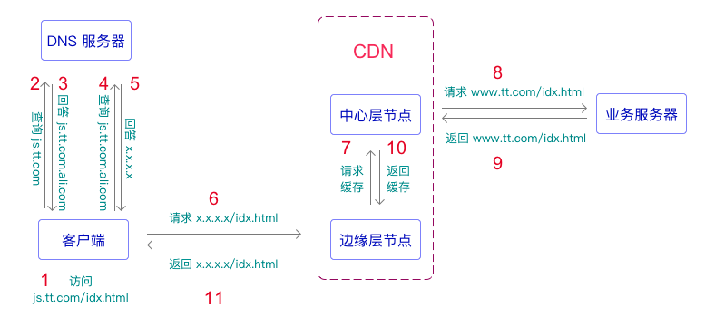
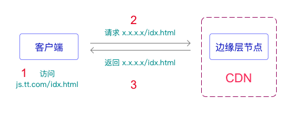
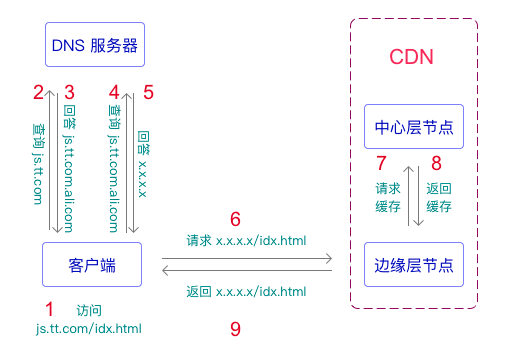

+++
title = "CDN原理"
date = '2025-07-28T00:00:00+08:00'
lastmod = '2025-08-04T00:00:00+08:00'
draft = false
weight = 12
tags = ["面试", "前端", "计算机网络", "CDN原理", "ecool"]
categories = ["计算机基础", "面试"]
source = "https://fe.ecool.fun/knowledge-learn"
+++
### CDN

CDN 即内容分发网络（Content Delivery Network）的简称，是建立在承载网基础上的虚拟分布式网络，能够将源站内容（包括各类动静态资源）智能缓存到全球各节点服务器上。这样不仅方便了用户就近获取内容，提高了资源的访问速度，也分担了源站压力。

### CNAME、A 记录、NS 记录

DNS ( Domain Name System，域名系统)提供了将域名转换为 IP 地址的服务。为了完成这个转化工作，DNS 的数据库中需要维护相关的数据，这些数据被叫做 RR（Resource Record，资源记录）。资源记录有很多种类型，比如 A、NS、SOA、CNAME 和 PTR 记录。

大家接触最多的就是 A（Address）记录。A 记录是一条从域名到 IP 地址的映射记录。而 CNAME（Canonical Name）记录是一条从域名到域名的映射记录。它在 CDN 技术中有举足轻重的作用，很好地实现了业务域名与 CDN 系统域名的解耦。简单理解，如果一个域名配置了 A 记录，DNS 就会把它解析成 A 记录指定的 IP 地址；如果一个域名配置了 CNAME 记录，DNS 就会把它解析成 CNAME 记录指定的另外一个域名；A 记录和 CNAME 记录是互斥的，不能同时存在。

NS （Name Server）记录是和 DNS 服务器相关的一条记录，它指定该域名应该由哪一台 DNS 服务器进行解析。一般把通过 NS 记录指定的 DNS 服务器叫做该域名的权威 DNS 服务器。

### 加速域名

加速域名指需要使用 CDN 加速的域名。加速域名也是一个域名。加速域名一般配置 CNAME 记录，指向 CDN 网络节点。普通域名一般配置 A 记录，指向提供服务的业务服务器。

### 源站

提供原始资源（使用 CDN 加速的资源）的业务服务器，可以指定为域名或 IP 地址。

### 回溯

CDN 节点未缓存资源，或者缓存资源已过期时，回到源站获取资源，返回给客户端。

## 工作原理

假设我建立了一个网站，域名为 `www.tt.com`，用户访问的主页链接为 `www.tt.com/idx.html`。为了缓解服务端压力和加快访问速度，决定使用阿里云 `CDN` 服务。 为了更好地理解工作原理，先了解一下 CDN 的接入流程。

### 接入流程

主要接入步骤如下：

1. 到某域名供应商处申请一个加速域名：`js.tt.com`。
2. 到阿里云 CDN 平台添加加速域名 `js.tt.com`，同时设置其源站域名为 `www.tt.com`。
3. 阿里云 CDN 平台自动分配一个 `CNAME` 域名：`js.tt.com.ali.com`。
4. 到域名供应商处给加速域名 `js.tt.com` 添加 `CNAME` 记录，其值为上一步得到的 `CNAME` 域名：`js.tt.com.ali.com`。

对以上步骤做进一步说明：

- 为了使用 CDN，必需另外再申请一个加速域名，作为使用 CDN 的入口。
- 加速域名配置的是 `CNAME` 记录，值为 CDN 平台提供的 `CNAME` 域名，该 `CNAME` 域名指向 CDN 系统节点。
- 添加加速域名时需要配置源站域名，据此，CDN 平台保存了加速域名与源站域名的映射关系。
- CNAME 域名的格式一般是：<加速域名> + <供应商主域名>。

### CDN 系统架构

从功能上看，典型的 CDN 系统由**分发服务系统**、**负载均衡系统**和**运营管理系统**组成。分发服务系统主要负责资源的响应、缓存和同步。负载均衡系统主要负责对用户请求进行调度。运营管理系统则负责运营需求管理和网络系统管理。

从节点分布上看，CDN 系统主要分为 **边缘层** 和 **中心层**。边缘层分布在 CDN 网络的边缘位置，给用户提供就近访问服务。中心层则负责完成资源同步和运营管理等功能。中心层保存了加速域名的相关配置信息，比如源站域名，也缓存了加速域名下的各种资源。在边缘层节点未命中缓存时，需要向中心层节点发起请求；而中心层节点未能命中缓存时，需要查找对应的源站域名，并向该源站域名发起请求。然后再逐层返回并缓存用户请求的资源。

### 访问流程

用户 A 的第一次访问流程如下图所示：

- 第 1 步访问的是加速域名，而不是源站域名。
- 第 3 步返回 CNAME 域名。
- 第 5 步返回 CNAME 域名对应的 IP 地址，指向 CDN 边缘层节点。
- 第 6 步请求的 URL （或者说 Referer ）仍为 `js.tt.com/idx.html`。
- 第 7 步请求中心层节点时，会带上第 6 步的 URL 作为参数。
- 第 8 步通过查询配置数据得到源站域名，进而向源站发起请求。这里的业务服务器即为 CDN 的源站。简单起见，省略了从 DNS 服务器查询 A 记录的过程。
- 在整个过程中，URL 的域名会变化，但是 URL 的路径不会变化。

用户 A 第二次访问流程如图 2 所示：

需要进一步说明的是：

- 由于本地 DNS 客户端拥有了加速域名的解析缓存，就不需要再查询 DNS 服务器了。
- 由于 CDN 边缘层节点有了对应资源的缓存，就不需要再向上请求资源了。

用户 B 第一次访问流程如图 3 所示：

需要进一步说明的是：

- 由于用户 A 和用户 B 地域相差比较远，使用不同的边缘层节点，所以边缘层节点没有对应资源的缓存，需要向中心层节点请求资源。
- 中心层节点拥有该资源的缓存，所以就不需要回源了。

### 就近访问原理

CDN 系统是如何实现就近访问的呢？

`CNAME` 域名是 CDN 供应商提供的，CDN 供应商拥有对 `CNAME` 域名的配置权。CDN 供应商会把 `CNAME` 域名的 NS 记录设置为自己搭建的 `DNS` 服务器。这样一来，解析 `CNAME` 域名的时候就会请求 `CDN` 供应商搭建的 `DNS` 服务器。而 `CDN` 供应商在 `DNS` 服务器中实现了负载均衡，会返回离用户较近的边缘层节点的 IP 地址。如此便实现了就近访问。 在图 1 中，第 4 步是向阿里云 `DNS` 服务器查询的，该 `DNS` 服务器会根据地理位置和健康状态等信息返回多个较近的可用的 `CDN` 边缘节点的 IP 地址。`DNS` 客户端会选择其中一个 `IP` 地址作为解析结果，一般是第一个。

## 常见考点

面试中考察 CDN 通常不仅涉及“是什么”，更关注**为什么用、怎么用、如何影响缓存、安全与可用性**等综合能力。

## 一、CDN 的核心原理

- **节点分发**：将静态资源缓存至多个地理分布的 CDN 节点（边缘节点），用户请求资源时，调度系统将其路由到最近的节点。
- **缓存机制**：首次请求资源由源站响应，CDN 缓存资源；后续请求由边缘节点直接响应。
- **调度算法**：根据 IP 地理位置、网络延迟、健康状态等因素将用户请求分配到最优节点。
- **内容回源**：CDN 节点没有资源时会从源站拉取资源并缓存。

## 二、面试常见考察方向

### 1. **CDN 的基本作用**

- 降低延迟（就近访问）
- 减轻源站压力（缓存命中）
- 提高并发能力（分布式架构）
- 提升可用性和抗 DDoS 攻击能力

### 2. **CDN 缓存机制**

- CDN 节点缓存是如何更新的？
- 如何设置资源缓存策略？（HTTP 头：`Cache-Control`, `Expires`, `ETag`, `Last-Modified`）
- 如何避免缓存过期或强制刷新资源？
- 如何区分“热资源”和“冷资源”的缓存策略？

### 3. **缓存穿透与缓存击穿**

- 缓存穿透：不存在的资源频繁访问如何处理？
- 缓存击穿：高并发访问一个刚过期的资源时如何缓解？

### 4. **CDN 与源站关系**

- 如何配置 CDN 的回源策略？
- 如何保证 CDN 与源站内容一致性？
- 回源带宽控制、防盗链设置？

### 5. **CDN 加速的对象和范围**

- 哪些资源适合走 CDN？（图片、CSS、JS、视频等静态资源）
- 动态资源能否走 CDN？（边缘计算、动态内容缓存）

### 6. **CDN 安全**

- HTTPS 配置：CDN 是否支持 HTTPS？如何配置证书？
- 防盗链、防刷、防热链
- 白名单/黑名单机制

### 7. **CDN 与版本控制**

- 静态资源版本号（hash）对 CDN 缓存策略的影响
- CDN 缓存失效的最佳实践（文件名变更 vs 控制头失效）

### 8. **CDN 常见问题排查**

- 页面更新但用户看到旧数据？
- 某地区资源加载异常？可能是 DNS/调度问题？
- 缓存不生效？如何确认？

## 三、CDN 相关 HTTP 响应头考点

| 响应头 | 含义 |
| --- | --- |
| `Cache-Control` | 控制缓存行为（如 `max-age=3600`） |
| `ETag` / `If-None-Match` | 协商缓存机制，判断资源是否更新 |
| `CDN-Cache-Status` | 判断资源是否命中 CDN 缓存（如 HIT / MISS） |
| `X-Cache` | 一些 CDN 会注入此头用于调试缓存命中情况 |

## 四、面试常见问题

1. CDN 的原理是什么？它解决了哪些问题？
2. 浏览器请求 CDN 资源时如何定位到最近的节点？
3. CDN 缓存失效策略有哪些？如何手动刷新？
4. 如何让资源文件在更新后立即生效？
5. 使用 CDN 的时候，如何配置静态资源的缓存策略？
6. CDN 是否可以缓存动态接口？如果要缓存，有哪些方式？
7. CDN 如何支持 HTTPS？
8. CDN 缓存命中率下降的可能原因有哪些？
9. CDN 如何处理多个用户同时请求一个不存在的资源？
