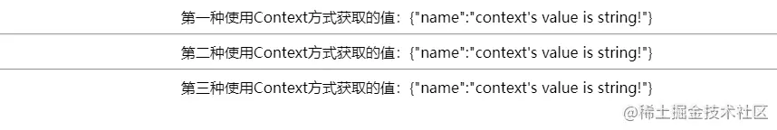
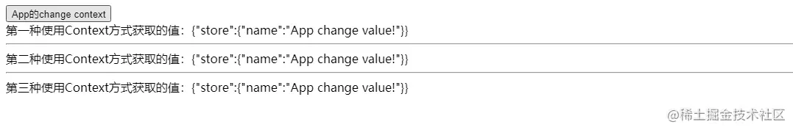
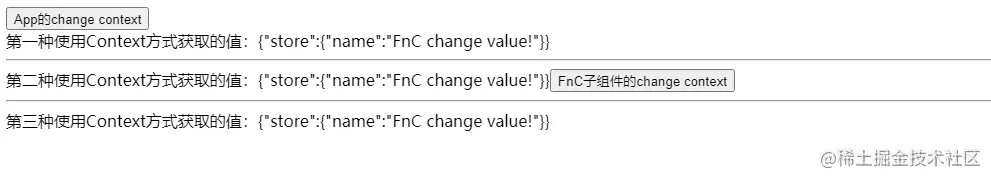

+++
title = "Context API"
date = '2024-12-17T00:00:00+08:00'
lastmod = '2025-02-08T00:00:00+08:00'
draft = false
weight = 6
tags = ["面试", "前端", "React", "Context API", "ecool"]
categories = ["前端开发", "面试"]
source = "https://fe.ecool.fun/knowledge-learn"
+++
## 先看看React官网对于Context的介绍

> Context 提供了一个无需为每层组件手动添加 props，就能在组件树间进行数据传递的方法。在一个典型的 React 应用中，数据是通过 props 属性自上而下（由父及子）进行传递的，但这种做法对于某些类型的属性而言是极其繁琐的（例如：地区偏好，UI 主题），这些属性是应用程序中许多组件都需要的。Context 提供了一种在组件之间共享此类值的方式，而不必显式地通过组件树的逐层传递 props。

个人理解转成大白话：`Context`提供了一个**局部的全局作用域**，使用Context则无需再手动的逐层传递`props`。

本文主要介绍3种`Context`的使用方式：

1. `React.createContext`提供的`Provider`和`Consumer`
2. 函数组件：`React.createContext`提供的`Provider`和`useContext`钩子
3. Class组件：`React.createContext`提供的`Provider`和`class`的`contextType`属性

### 第一种：React.createContext提供的Provider和Consumer

先写好使用`Context`的基础环境条件，后续的代码都是基于此环境

```javascript
//创建一个文件，暂且命名为context.js，导出createContext()的返回值
import { createContext } from "react";

export default createContext();
```

在根组件`App.jsx`中，导入上面写的`context`，并使用`context`提供的`Provider`组件进行包裹，圈定**局部的全局作用域**，传值后可以提供给子组件进行消费

> 当 Provider 的 value 值发生变化时，它内部的所有消费组件都会重新渲染。Provider 及其内部 consumer 组件都不受制于 shouldComponentUpdate 函数，因此当 consumer 组件在其祖先组件退出更新的情况下也能更新。

```javascript
import React, { createContext } from "react";
import MyContext from "./context";

import GeneralC from "./GeneralC";
import FnC from "./FnC";
import ClassC from "./ClassC";

export default function App() {
  return (
    //Provider组件接收一个value属性，此处传入一个带有name属性的对象
    <MyContext.Provider value={{ name: `context's value is string!` }}>
      {/*这里写后面要进行包裹的子组件,此处先行导入后续需要消费context的3个组件*/}
      <GeneralC/>
      <hr/>
      <FnC/>
      <hr/>
      <ClassC/>
    </MyContext.Provider>
  );
}
```

在`GeneralC`组件中,导入`context`,使用其提供的`Consumer`组件来订阅`Context`的变更,需要一个函数作为子元素,函数的第一个形参便是`Provider`组件提供的`value`值

```javascript
import React, { useReducer } from "react";
import MyContext from "./context";

const GeneralC = () => {
  return (
    //
    <MyContext.Consumer>
      {(value) => {
        return (
          <div>
            第一种使用Context方式获取的值：{JSON.stringify(value)}
          </div>
        );
      }}
    </MyContext.Consumer>
  );
};

export default GeneralC;
```

此时页面中应该出现json格式的value值


### 第二种：函数组件：React.createContext提供的Provider和useContext钩子

导入`useContext`钩子函数,该函数接收`createContext()`的返回值,返回的结果为该`context`的当前值,当前的 `context` 值由上层组件中距离当前组件最近的 `<MyContext.Provider>` 的 `value prop` 决定。

```javascript
import React, { useContext } from "react";
import MyContext from "./context";

const FnC = () => {
  const context = useContext(MyContext);
  return <div>第二种使用Context方式获取的值：{JSON.stringify(context)}</div>;
};

export default FnC;
```

此时页面中应该出现两条json格式的value值


### 第三种：Class组件：React.createContext提供的Provider和class的contextType属性

> 挂载在 class 上的 contextType 属性会被重赋值为一个由 React.createContext() 创建的 Context 对象。这能让你使用 this.context 来消费最近 Context 上的那个值。你可以在任何生命周期中访问到它，包括 render 函数中。 使用`static`关键字添加静态属性，和直接在`class`添加属性效果一致,最终都会添加到类上，而不是类的实例上

```javascript
import React, { Component } from "react";
import context from "./context";

class ClassC extends Component {
  static contextType = context;
  render() {
    const value = this.context;
    return <div>第三种使用Context方式获取的值：{JSON.stringify(value)}</div>;
  }
}

// ClassC.contextType = context; //此处与写static关键字作用一致
export default ClassC;
```

此时页面中应该出现三条json格式的value值 

### 既然能读Context，也自然能写Context，改写下代码(部分代码省略)

在`App.js`组件中更改`context`，只是调用组件自身的`setStore`函数

```javascript
import React, { useState } from "react";
//导入useState钩子
...

const value = {
  name: `context's value is string!`
};

export default function App() {
  const [store, setStore] = useState(value);
  //Provider的value不再传入一个简单结构的对象，而是将useState的返回值作为新对象的key/value,子组件便能调用App的setStore函数进行更新
  return (
    <MyContext.Provider value={{ store, setStore }}>
       {/* 在父组件更改Context */}
      <button
        onClick={() => {
          setStore({
            name: "App change value!"
          });
        }}
      >
        App的change context
      </button>
       {/* 此处为组件引入,省略... */}
    </MyContext.Provider>
  );
}
```

此时页面中应该出现一个按钮，点击`App的...`按钮时，`store`更新为`App change value!`，订阅了`context`的子组件都能更新到最新的值 

再来改写子组件，在子组件中更新`context`，这里选择`FnC`组件来更新，原代码不需要更改，新增一个按钮，用来调用`context`传入的`setStore`函数

```javascript
import React, { useContext } from "react";
import MyContext from "./context";

const Component = () => {
  const context = useContext(MyContext);
  return (
    <div>
      第二种使用Context方式获取的值：{JSON.stringify(context)}
      <button
        onClick={() => {
          context.setStore({
            name: "FnC change value!"
          });
        }}
      >
        FnC子组件的change context
      </button>
    </div>
  );
};

export default Component;
```

此时页面中应该再出现一个按钮，点击`FnC的...`按钮时，`store`更新为`FnC change value!`，效果和在`App`组件中修改一致，这样子组件便也有了更新`context`的能力 

## 常见考点

## **1. React Context 基础概念**

### **考察点：**

- 什么是 `Context`？它解决了什么问题？
- 为什么 `Context` 可以避免 **prop drilling（属性层层传递）**？
- `Context` 的基本 API：`createContext`、`Provider`、`Consumer`、`useContext`
- `useContext` 和 `Consumer` 的区别？

### **示例问题：**

- 为什么 React 需要 `Context`？
- `Context` 的数据如何在组件树中传播？
- `Context` 提供的值如何更新？

### **示例代码（创建 Theme Context 并使用 Provider）：**

```jsx
const ThemeContext = React.createContext('light');

function App() {
  return (
    <ThemeContext.Provider value="dark">
      <Child />
    </ThemeContext.Provider>
  );
}

function Child() {
  const theme = useContext(ThemeContext);
  return <div>当前主题：{theme}</div>;
}
```

---

## **2. Context API 及其使用**

### **(1) `createContext`**

- 用于创建一个 Context 实例，通常 `Provider` 和 `Consumer` 都基于这个实例。

### **(2) `Provider`**

- `Provider` 组件提供 `value`，整个子组件树都可以访问这个值。
- 只要 `value` 发生变化，**所有使用该 Context 的组件都会重新渲染**。

### **(3) `Consumer`**

- `Consumer` 方式可以访问 Context 值，但相比 `useContext` 代码更冗长。
- **推荐使用 `useContext`，避免嵌套 JSX**。

```jsx
<ThemeContext.Consumer>
  {value => <div>当前主题：{value}</div>}
</ThemeContext.Consumer>
```

### **(4) `useContext`**

- `useContext` 允许函数组件直接访问 `Context` 值，而不需要 `Consumer` 组件。

```jsx
const theme = useContext(ThemeContext);
```

---

## **3. Context 相关的常见问题**

### **(1) Context 何时会触发组件重新渲染？**

- 任何 `Provider` 的 `value` 发生变化时，所有使用该 Context 的组件都会 **重新渲染**。
- 需要注意 `value` 传递的是对象时，避免不必要的重新渲染。

### **(2) `useContext` 为什么会导致性能问题？**

- `useContext` 直接依赖 `Provider` 的 `value`，一旦 `value` 发生变化，所有 `useContext` 使用的组件都会 **重新渲染**。
- **即使组件不使用 Context 里的数据，也会重新渲染**。

**示例代码（错误示例）：**

```jsx
const CountContext = React.createContext({ count: 0 });

function App() {
  const [count, setCount] = useState(0);

  return (
    <CountContext.Provider value={{ count }}>
      <Child />
      <button onClick={() => setCount(count + 1)}>+1</button>
    </CountContext.Provider>
  );
}
```

⚠ **问题：**<br>
 即使 `Child` 组件不使用 `count`，它仍然会重新渲染。因为 `{ count }` 是一个新对象，每次 `setCount` 触发 `App` 重新渲染时，`value={{ count }}` 也会变成新对象，导致 `Provider` 重新传递值，从而触发所有 `useContext(CountContext)` 的组件更新。

### **(3) 如何优化 Context 重新渲染？**

#### **✅ 解决方案 1：使用 `useMemo` 缓存 `value`**

```jsx
const memoizedValue = useMemo(() => ({ count }), [count]);

<CountContext.Provider value={memoizedValue}>
  <Child />
</CountContext.Provider>
```

#### **✅ 解决方案 2：拆分 Context**

- 避免一个 Context 里存放多个状态，拆分成多个 Context，每个 `Provider` 只管理一部分状态。

---

## **4. Context 与 Redux、MobX、Zustand 的对比**

### **(1) Context vs Redux**

| **特性** | **React Context** | **Redux** |
| --- | --- | --- |
| **适用场景** | 轻量级全局状态 | 复杂状态管理 |
| **数据流** | 组件树内部流转 | 全局 store，独立于组件 |
| **性能优化** | 可能导致过度渲染 | 使用 `useSelector` 选择性订阅 |
| **异步操作** | 手动处理 `useEffect` | `redux-thunk` / `redux-saga` |

### **(2) Context vs Zustand**

- Context **适合存储不经常变化的数据**，如主题、语言。
- Zustand **更适合全局状态管理**，提供更好的性能优化。

**Zustand 示例（避免 Context 过度渲染）：**

```jsx
const useStore = create(set => ({
  count: 0,
  increase: () => set(state => ({ count: state.count + 1 }))
}));

const Counter = () => {
  const { count, increase } = useStore();
  return <button onClick={increase}>{count}</button>;
};
```

---

## **5. 使用 Context 进行状态管理**

### **考察点：**

- 何时应该使用 Context？
- 如何搭配 `useReducer` 实现全局状态管理？

**示例代码（使用 `useReducer` 搭配 Context 管理全局状态）：**

```jsx
const CountContext = createContext();

function countReducer(state, action) {
  switch (action.type) {
    case 'increment': return { count: state.count + 1 };
    default: return state;
  }
}

const CountProvider = ({ children }) => {
  const [state, dispatch] = useReducer(countReducer, { count: 0 });

  return (
    <CountContext.Provider value={{ state, dispatch }}>
      {children}
    </CountContext.Provider>
  );
};

const Counter = () => {
  const { state, dispatch } = useContext(CountContext);
  return (
    <button onClick={() => dispatch({ type: 'increment' })}>
      {state.count}
    </button>
  );
};

export default function App() {
  return (
    <CountProvider>
      <Counter />
    </CountProvider>
  );
}
```

---

## **6. Context 的高级使用**

### **(1) 动态 `Context`**

- `Context` 值可以是动态的，如用户身份、主题切换等。

```jsx
const ThemeContext = createContext({ theme: 'light', toggleTheme: () => {} });

const App = () => {
  const [theme, setTheme] = useState('light');
  const toggleTheme = () => setTheme(theme === 'light' ? 'dark' : 'light');

  return (
    <ThemeContext.Provider value={{ theme, toggleTheme }}>
      <Page />
    </ThemeContext.Provider>
  );
};
```

### **(2) 多个 Context 组合**

- 使用多个 `Context` 解决性能问题，例如 `ThemeContext` 和 `AuthContext` 分开管理。

---

## **7. Context 相关的陷阱**

### **考察点：**

- 过度使用 Context，导致组件重新渲染
- `useContext` 依赖 `Provider`，导致所有组件都重新渲染
- 不能跨 `Context` Provider 访问数据
