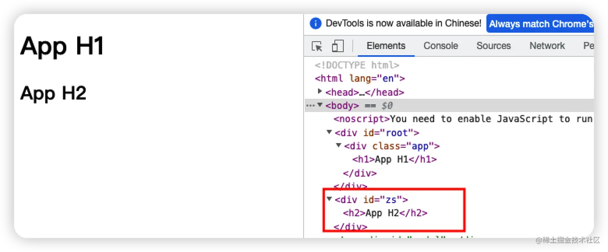
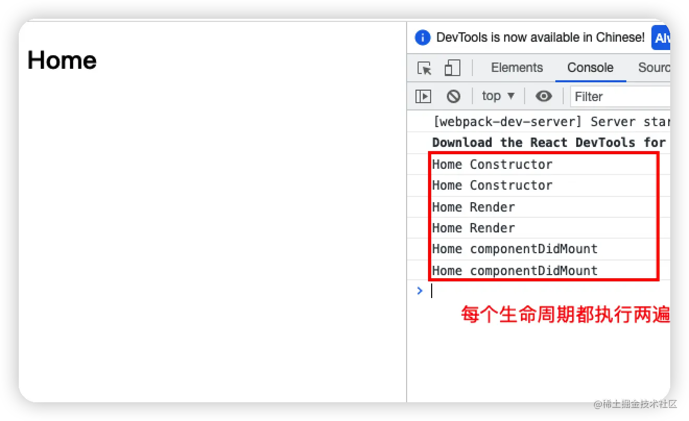

+++
title = "Fragment 和 Portals"
date = '2024-12-17T00:00:00+08:00'
lastmod = '2025-03-14T00:00:00+08:00'
draft = false
weight = 12
tags = ["面试", "前端", "React", "Fragment 和 Portals", "ecool"]
categories = ["前端开发", "面试"]
source = "https://fe.ecool.fun/knowledge-learn"
+++
## 一、Portals

某些情况下，我们希望渲染的内容独立于父组件，甚至独立于当前挂在的DOM元素（默认都是挂载到id为root的DOM元素上的）

Portal提供了一种将子节点渲染到存在于**父组件以外的DOM节点**的优秀的方案：

```scss
ReactDOM.createPortal(child, container)
```

第一个参数：是任何可渲染的React子元素，例如**一个元素、字符串或fragment** 第二个参数：是一个DOM元素

通常来讲，当你从组件的 render 方法返回一个元素时，该元素将被挂载到 DOM 节点中离其最近的父节点：

```javascript
render() {
  // React 挂载了一个新的 div，并且把子元素渲染其中
  return (
    <div>
      {this.props.children}
    </div>
  );
}
```

然而，有时候将子元素插入到 DOM 节点中的不同位置也是有好处的：

```javascript
render() {
  // React 并没有创建一个新的 div。它只是把子元素渲染到 `domNode` 中。
  // `domNode` 是一个可以在任何位置的有效 DOM 节点。
  return ReactDOM.createPortal(
    this.props.children,
    domNode
  );
}
```

一个 portal 的典型用例是当父组件有 overflow: hidden 或 z-index 样式时，但你需要子组件能够在视觉上“跳出”其容器。**例如，对话框、悬浮卡以及提示框**

### 案例

比如将h2挂在到id为zs的节点下

**index.html**

```xml
<!DOCTYPE html>
<html lang="en">
  <head>
    <meta charset="utf-8" />
    <link rel="icon" href="%PUBLIC_URL%/favicon.ico" />
    <meta name="viewport" content="width=device-width, initial-scale=1" />
    <meta name="theme-color" content="#000000" />
    <meta
      name="description"
      content="Web site created using create-react-app"
    />
    <link rel="apple-touch-icon" href="%PUBLIC_URL%/logo192.png" />
    <link rel="manifest" href="%PUBLIC_URL%/manifest.json" />
    <title>React App</title>
  </head>
  <body>
    <noscript>You need to enable JavaScript to run this app.</noscript>
    <div id="root"></div>
    <div id="zs"></div>
  </body>
</html>
```

**App.jsx**

```javascript
import React, { PureComponent } from 'react'
import { createPortal } from "react-dom"

export class App extends PureComponent {
  render() {
    return (
      <div className='app'>
        <h1>App H1</h1>
        {
          createPortal(<h2>App H2</h2>, document.querySelector("#zs"))
        }
      </div>
    )
  }
}

export default App
```



### 使用场景

比如，开发一个Modal组件，它可以将它的子组件渲染到屏幕的中间位置

1. 为index.html添加新的节点（用于挂在Modal组件）
2. 为挂载节点添加样式

```xml
<!DOCTYPE html>
<html lang="en">
  <head>
    <meta charset="utf-8" />
    <link rel="icon" href="%PUBLIC_URL%/favicon.ico" />
    <meta name="viewport" content="width=device-width, initial-scale=1" />
    <meta name="theme-color" content="#000000" />
    <meta
      name="description"
      content="Web site created using create-react-app"
    />
    <link rel="apple-touch-icon" href="%PUBLIC_URL%/logo192.png" />
    <link rel="manifest" href="%PUBLIC_URL%/manifest.json" />
    <title>React App</title>
    <style>
      #modal {
        position: fixed;
        left: 50%;
        top: 50%;
        transform: translate(-50%, -50%);
      }
    </style>
  </head>
  <body>
    <noscript>You need to enable JavaScript to run this app.</noscript>
    <div id="root"></div>
    <div id="modal"></div>
  </body>
</html>
```

3. 编写组件代码并将组件挂在至新节点上

**Modal.jsx**

```scala
import { PureComponent } from 'react'
import { createPortal } from "react-dom"

export class Modal extends PureComponent {
  render() {
    return createPortal(this.props.children, document.querySelector("#modal"))
  }
}

export default Modal
```

**App.jsx**

```javascript
import React, { PureComponent } from 'react'
import { createPortal } from "react-dom"
import Modal from './Modal'

export class App extends PureComponent {
  render() {
    return (
      <div className='app'>
        {/* Modal组件 */}
        <Modal>
          <h2>我是标题</h2>
          <p>我是内容, 哈哈哈</p>
        </Modal>
      </div>
    )
  }
}

export default App
```

## 二、Fragment

在之前开发中，总是要在一个组件返回的内容外包裹一个div元素，如果我们又要保持内容外包裹一个根元素，但又不希望渲染出来一个div，怎么操作呢？

此时要使用Fragment

- Fragment允许你将子列表进行分组，而无需向DOM添加额外节点
- React中还提供了Fragment的短语法： **<></>**
- **需要注意的是，如果想在Fragment上添加key，就不能使用短语法<></>**

### 基本使用方法

```javascript
import React, { PureComponent, Fragment } from 'react'

export class App extends PureComponent {
  constructor() {
    super()

    this.state = {
      sections: [
        { title: "1", content: "我是内容1" },
        { title: "2", content: "我是内容2" },
        { title: "3", content: "我是内容3" },
        { title: "4", content: "我是内容4" },
      ]
    }
  }

  render() {
    const { sections } = this.state

    return (
      <>
        <h2>我是App的标题</h2>
        <p>我是App的内容, 哈哈哈哈</p>
        <hr />

        {
          sections.map(item => {
            return (
              // 添加key，必须使用Fragment
              <Fragment key={item.title}>
                <h2>{item.title}</h2>
                <p>{item.content}</p>
              </Fragment>
            )
          })
        }
      </>
    )
  }
}

export default App
```

## 三、StrictMode

**StrictMode 是一个用来突出显示应用程序中潜在问题的工具:**

- 与 Fragment 一样，StrictMode 不会渲染任何可见的 UI
- 它为其后代元素触发额外的检查和警告
- 严格模式检查仅在开发模式下运行、它们不会影响生产构建;

### 严格模式检查的是什么？

1. 识别不安全的生命周期
2. 校验是否使用过时的ref API

> 比如，是否通过this.refs.xx的方式来使用ref
>
> 如何在React18中正确使用ref，详见文章[React18中如何正确使用ref](https://juejin.cn/post/7153831816296660999)

3. 检查意外的副作用

> 这个组件的constructor会被调用两次
>
> 这是严格模式下故意进行的操作，让你来查看在这里写的一些逻辑代码被调用多次时，是否会产生一些副作用，在生产环境中，是不会被调用两次的

4. 是否使用废弃的findDOMNode方法

> 在之前的React API中，可以通过findDOMNode来获取DOM，不过已经不推荐使用了

5. 检测是否使用过时的context API

> 早期的Context是通过static属性声明Context对象属性，通过getChildContext返回Context对象等方式来使用Context的

**Home.jsx**

```javascript
import React, { PureComponent } from 'react'

export class Home extends PureComponent {
  constructor(props) {
    super(props)

    console.log("Home Constructor")
  }

  componentDidMount() {
    console.log("Home componentDidMount")
  }

  render() {
    console.log("Home Render")

    return (
      <div>
        <h2>Home</h2>
      </div>
    )
  }
}

export default Home
```

**App.jsx**

```javascript
import React, { PureComponent, StrictMode } from 'react'
import Home from './pages/Home'
import Profile from './pages/Profile'

export class App extends PureComponent {
  render() {
    return (
      <div>
        <StrictMode>
          <Home/>
        </StrictMode>
      </div>
    )
  }
}

export default App
```



## 常见考点

### React Fragment

1.  **Fragment的基本概念**：<br>
  - 请解释什么是React Fragment，以及它解决了什么问题。
  - Fragment与普通的div包裹元素相比，有何优势？
2.  **Fragment的使用场景**：<br>
  - 在哪些情况下，你会选择使用React Fragment？
  - 能否给出一个使用Fragment来避免不必要的DOM层级的示例？
3.  **Fragment的语法**：<br>
  - 请展示如何使用短语法和长语法来定义一个Fragment。
  - 在Fragment内部，如何传递props给子组件？

### React Portals

1.  **Portals的基本概念**：<br>
  - 请解释什么是React Portals，以及它的主要用途是什么。
  - Portals如何帮助我们将子组件渲染到父组件DOM层次结构之外？
2.  **Portals的使用场景**：<br>
  - 在哪些情况下，你会选择使用React Portals？
  - 能否给出一个使用Portals来渲染模态框或工具提示的示例？
3.  **Portals的实现细节**：<br>
  - 请描述如何创建一个Portal，并将其附加到DOM中的特定节点。
  - 在使用Portals时，如何管理事件和生命周期方法？
