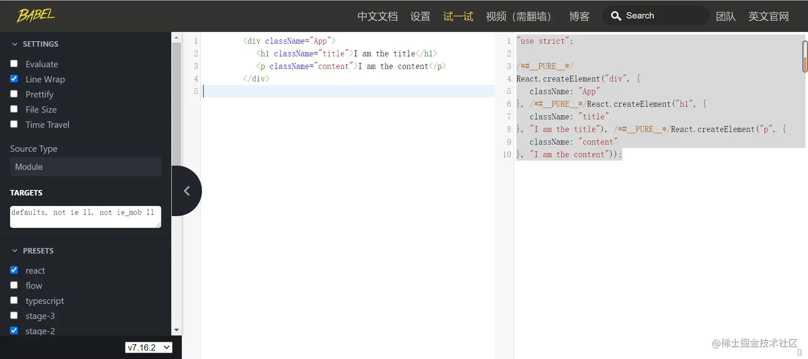
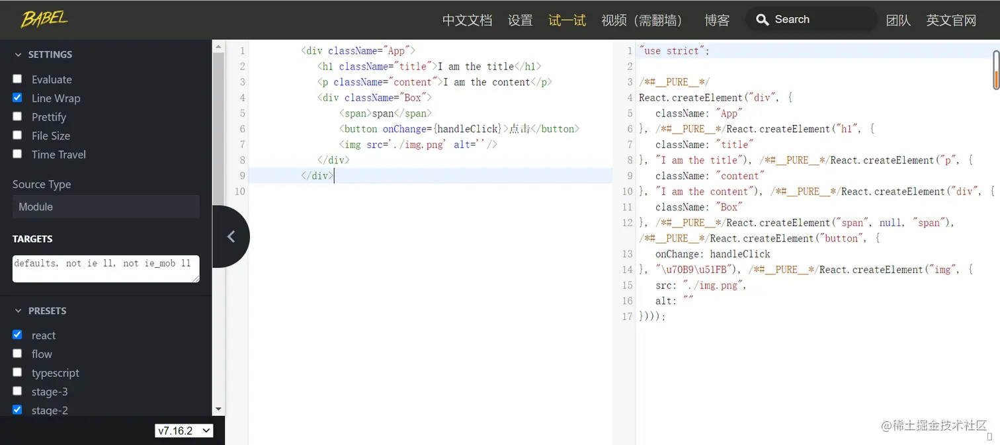
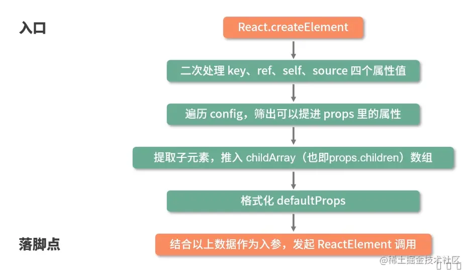
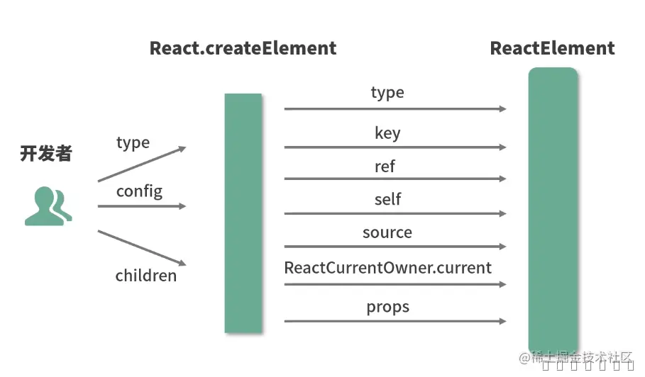
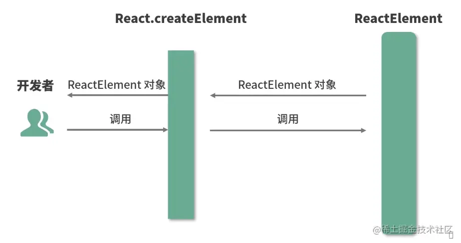
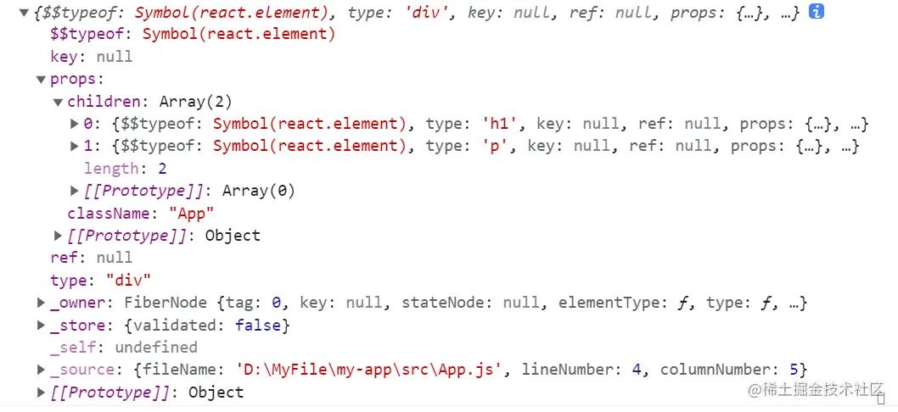

+++
title = "JSX"
date = '2024-12-17T00:00:00+08:00'
lastmod = '2024-12-26T00:00:00+08:00'
draft = false
weight = 1
tags = ["面试", "前端", "React", "JSX", "ecool"]
categories = ["前端开发", "面试"]
source = "https://fe.ecool.fun/knowledge-learn"
+++
时下虽然接入 `JSX` 语法的框架越来越多，但与之缘分最深的毫无疑问仍然是 `React`。

2013 年，当 `React` 带着 `JSX` 横空出世时，社区曾对 `JSX` 有过不少的争议，但如今，越来越多的人面对 `JSX` 都要说上一句“真香”！我们就来一起认识下这个“真香”的 `JSX`，聊一聊“`JSX` 代码是如何‘摇身一变’成为 `DOM` 的”。

开始之前请先思考几个问题：

1. `JSX` 的本质是什么，它和 JS 之间到底是什么关系？
2. 为什么要用 `JSX`？不用会有什么后果？
3. `JSX` 背后的功能模块是什么，这个功能模块都做了哪些事情？

 面对以上问题，如果无法形成清晰且系统的思路，那么很可能是把 `JSX` 想得过于简单了。大多数人只是简单地把它理解为模板语法的一种，但事实上，`JSX` 作为 `React` 框架的一大特色，它与 `React` 本身的运作机制之间存在着千丝万缕的联系，上述 3 个问题的答案，就恰恰隐藏在这层“联系”中。

## JSX 的本质：JavaScript 的语法扩展

 JSX 到底是什么?看看 React 官网给出的一段定义：

> `JSX` 是 `JavaScript` 的一种语法扩展，它和模板语言很接近，但是它充分具备 `JavaScript` 的能力。

 “语法扩展”这一点在理解上几乎不会产生歧义，不过“它充分具备 `JavaScript` 的能力”这句，却总让人摸不着头脑，`JSX` 和 `JS` 怎么看也不像是“一路人”啊？这就引出了“`JSX` 语法是如何在 `JavaScript` 中生效的”这个问题。

### JSX 语法是如何在 JavaScript 中生效的：认识 Babel

 `Facebook` 公司给 `JSX` 的定位是 `JavaScript` 的“扩展”，而非 `JavaScript` 的“某个版本”，这就直接决定了浏览器并不会像天然支持 `JavaScript` 一样地支持 `JSX`。那么，`JSX` 的语法是如何在 `JavaScript` 中生效的呢？`React` 官网其实早已给过我们线索：

> `JSX` 会被编译为 `React.createElement()`， `React.createElement()` 将返回一个叫作“`React Element`”的 `JS` 对象。

 这里提到，`JSX` 在被编译后，会变成一个针对 `React.createElement` 的调用，此时你大可不必急于关注 `React.createElement` 这个 `API` 到底做了什么。咱们先来说说这个“编译”是怎么回事：“编译”这个动作，是由 `Babel` 来完成的。

### 什么是 Babel 呢？

> Babel 是一个工具链，主要用于将 `ECMAScript 2015+` 版本的代码转换为向后兼容的 `JavaScript` 语法，以便能够运行在当前和旧版本的浏览器或其他环境中。 —— Babel 官网

 比如说，`ES2015+` 版本推出了一种名为“模板字符串”的新语法，这种语法在一些低版本的浏览器里并不兼容。下面是一段模板字符串的示例代码：

```js
const name = "Guy Fieri";
const place = "Flavortown";
`Hello ${name}, ready for ${place}?`;
```

 `Babel` 就可以帮我们把这段代码转换为大部分低版本浏览器也能够识别的 `ES5` 代码：

```js
const name = "Guy Fieri";
const place = "Flavortown";
"Hello ".concat(name, ", ready for ").concat(place, "?");
```

 类似的，**Babel 也具备将 `JSX` 语法转换为 `JavaScript` 代码的能力**。

 那么 `Babel` 具体会将 `JSX` 处理成什么样子呢？我们不如直接打开 `Babel` 的 `playground` 来看一看。代码如下：

```js
<div className="App">
    <h1 className="title">I am the title</h1>
    <p className="content">I am the content</p>
</div>
```

处理后：

```js
"use strict";

/*#__PURE__*/
React.createElement("div", {
  className: "App"
}, /*#__PURE__*/React.createElement("h1", {
  className: "title"
}, "I am the title"), /*#__PURE__*/React.createElement("p", {
  className: "content"
}, "I am the content"));
```



 所有的 `JSX` 标签都被转化成了 `React.createElement` 调用，这也就意味着，我们写的 `JSX` 其实写的就是 `React.createElement`，虽然它看起来有点像 `HTML`，但也只是“看起来像”而已。**JSX 的本质是**`React.createElement`**这个 JavaScript 调用的语法糖**，这也就完美地呼应上了 `React` 官方给出的“**JSX 充分具备 JavaScript 的能力**”这句话。

## React 选用 JSX 语法的动机

 换个角度想想，既然 `JSX` 等价于一次 `React.createElement` 调用，那么 `React` 官方为什么不直接引导我们用 `React.createElement` 来创建元素呢？

 原因非常简单，我们来看一个相对复杂一些的组件的 `JSX` 代码和 `React.createElement` 调用之间的对比。它们各自的形态如下图所示，图中左侧是 `JSX` 代码，右侧是 `React.createElement` 调用：



 在实际功能效果一致的前提下，`JSX` 代码层次分明、嵌套关系清晰；而 `React.createElement` 代码则给人一种非常混乱的“杂糅感”，这样的代码不仅读起来不友好，写起来也费劲。

**JSX 语法糖允许前端开发者使用我们最为熟悉的类 HTML 标签语法来创建虚拟 DOM，在降低学习成本的同时，也提升了研发效率与研发体验。**

## JSX 是如何映射为 DOM 的：起底 createElement 源码

 在开始之前，可以先尝试阅读追加进源码中的逐行代码解析，大致理解 createElement 中每一行代码的作用：

```js
export const createElement = (type, config, children) => {
  // propName 变量用于储存后面需要用到的元素属性
  let propName;
  // props 变量用于储存元素属性的键值对集合
  const props = {};
  // key、ref、self、source 均为 React 元素的属性，此处不必深究
  let key = null;
  let ref = null;
  let self = null;
  let source = null;

  // config 对象中存储的是元素的属性
  if (config != null) {
    // 进来之后做的第一件事，是依次对 ref、key、self 和 source 属性赋值
    if (hasValidRef(config)) {
      ref = config.ref;
    }
    // 此处将 key 值字符串化
    if (hasValidKey(config)) {
      key = "" + config.key;
    }
    self = config.__self === undefined ? null : config.__self;
    source = config.__source === undefined ? null : config.__source;
    // 接着就是要把 config 里面的属性都一个一个挪到 props 这个之前声明好的对象里面
    for (propName in config) {
      if (
        // 筛选出可以提进 props 对象里的属性
        hasOwnProperty.call(config, propName) &&
        !RESERVED_PROPS.hasOwnProperty(propName)
      ) {
        props[propName] = config[propName];
      }
    }
    // childrenLength 指的是当前元素的子元素的个数，减去的 2 是 type 和 config 两个参数占用的长度
    const childrenLength = arguments.length - 2;
    // 如果抛去type和config，就只剩下一个参数，一般意味着文本节点出现了
    if (childrenLength === 1) {
      // 直接把这个参数的值赋给props.children
      props.children = children;
    } else if (childrenLength > 1) {
      // 声明一个子元素数组
      const childArray = Array(childrenLength);
      // 把子元素推进数组里
      for (let i = 0; i < childrenLength; i++) {
        childArray[i] = arguments[i + 2];
      }
      // 最后把这个数组赋值给props.children
      props.children = childArray;
    }
    // 处理 defaultProps
    if (type && type.defaultProps) {
      const defaultProps = type.defaultProps;
      for (propName in defaultProps) {
        if (props[propName] === undefined) {
          props[propName] = defaultProps[propName];
        }
      }
    }
    // 最后返回一个调用ReactElement执行方法，并传入刚才处理过的参数
    return ReactElement(
      type,
      key,
      ref,
      self,
      source,
      ReactCurrentOwner.current,
      props
    );
  }
};
```

### 入参解读：创造一个元素需要知道哪些信息

 先来看看方法的入参：

> export function createElement(type, config, children)

`createElement` 有 3 个入参，这 3 个入参囊括了 `React` 创建一个元素所需要知道的全部信息。

- `type`：用于标识节点的类型。它可以是类似“h1”“div”这样的标准 HTML 标签字符串，也可以是 React 组件类型或 `React fragment` 类型
- `config`：以对象形式传入，组件所有的属性都会以键值对的形式存储在 `config` 对象中
- `children`：以对象形式传入，它记录的是组件标签之间嵌套的内容，也就是所谓的“子节点”“子元素”

 如果文字描述使你觉得抽象，下面这个调用示例可以帮你增进对概念的理解：

```js
React.createElement("ul", {
  // 传入属性键值对
  className: "list"
   // 从第三个入参开始往后，传入的参数都是 children
}, React.createElement("li", {
  key: "1"
}, "1"), React.createElement("li", {
  key: "2"
}, "2"));
```

DOM结构如下：

```html
<ul className="list">
    <li key="1">1</li>
    <li key="2">2</li>
</ul>
```

#### createElement 函数体拆解

 前面已经阅读过 `createElement` 源码细化到每一行的解读，这里探讨的是 `createElement`**在逻辑层面的任务流转**。针对这个过程，总结了下面这张流程图：



 `createElement` 中并没有十分复杂的涉及算法或真实 `DOM` 的逻辑，它的**每一个步骤几乎都是在格式化数据**。

 说得更直白点，`createElement` 就像是开发者和 `ReactElement` 调用之间的一个“**转换器**”、一个**数据处理层**。它可以从开发者处接受相对简单的参数，然后将这些参数按照 `ReactElement` 的预期做一层格式化，最终通过调用 `ReactElement` 来实现元素的创建。整个过程如下图所示：



现在看来，`createElement` 原来只是个“参数中介”。

### 出参解读：初识虚拟 DOM

 `createElement` 执行到最后会 `return` 一个针对 `ReactElement` 的调用。这里关于 `ReactElement`，先给出源码 + 注释形式的解析：

```js
const ReactElement = function (type, key, ref, self, source, owner, props) {
  const element = {
    // REACT_ELEMENT_TYPE是一个常量，用来标识该对象是一个ReactElement
    $$typeof: REACT_ELEMENT_TYPE,

    // 内置属性赋值
    type: type,
    key: key,
    ref: ref,
    props: props,
    // 记录创造该元素的组件
    _owner: owner,
  };
  //
  if (__DEV__) {
    // 这里是一些针对 __DEV__ 环境下的处理，对于大家理解主要逻辑意义不大，此处我直接省略掉，以免混淆视听
  }
  return element;
};
```

 从逻辑上我们可以看出，`ReactElement` 其实只做了一件事情，那就是“**创建**”，说得更精确一点，是“**组装**”：`ReactElement` 把传入的参数按照一定的规范，“组装”进了 `element` 对象里，并把它返回给了 `React.createElement`，最终 `React.createElement` 又把它交回到了开发者手中。整个过程如下图所示：



如果想要验证这一点，可以尝试输出示例中 `App` 组件的 `JSX` 部分：

```js
const AppJSX = (<div className="App">
  <h1 className="title">I am the title</h1>
  <p className="content">I am the content</p>
</div>)
console.log(AppJSX)
```

 你会发现它确实是一个标准的 `ReactElement` 对象实例，如下图（生产环境下的输出结果）所示：你会发现它确实是一个标准的 `ReactElement` 对象实例，如下图（生产环境下的输出结果）所示：



 这个 `ReactElement` 对象实例，本质上是**以 `JavaScript` 对象形式存在的对 `DOM` 的描述**，也就是老生常谈的“虚拟 `DOM`”（**准确地说，是虚拟 `DOM` 中的一个节点**)。

 既然是“虚拟 DOM”，那就意味着和渲染到页面上的真实 DOM 之间还有一些距离，这个“距离”，就是由大家喜闻乐见的**ReactDOM.render**方法来填补的。

 在每一个 `React` 项目的入口文件中，都少不了对 `React.render` 函数的调用。下面我简单介绍下 `ReactDOM.render` 方法的入参规则：

```js
ReactDOM.render(
    // 需要渲染的元素（ReactElement）
    element,
    // 元素挂载的目标容器（一个真实DOM）
    container,
    // 回调函数，可选参数，可以用来处理渲染结束后的逻辑
    [callback]
)
```

 `ReactDOM.render` 方法可以接收 3 个参数，其中**第二个参数就是一个真实的 DOM 节点**，**这个真实的 DOM 节点充当“容器”的角色**，`React` 元素最终会被渲染到这个“容器”里面去。比如，示例中的 `App` 组件，它对应的 `render` 调用是这样的：

```js
const rootElement = document.getElementById("root");
ReactDOM.render(<App />, rootElement);
```

 注意，这个真实 `DOM` 一定是确实存在的。比如，在 `App` 组件对应的 `index.html` 中，已经提前预置 了 `id` 为 `root` 的根节点：

## 总结

1.  `JSX` 是 `JavaScript` 的一种语法扩展，它和模板语言很接近，但是它充分具备 `JavaScript` 的能力。**JSX 的本质是**`React.createElement`**这个 JavaScript 调用的语法糖**
2.  `JSX` 语法糖允许前端开发者使用我们最为熟悉的类 `HTML` 标签语法来创建虚拟 `DOM`，在降低学习成本的同时，也提升了研发效率与研发体验。
3.  `JSX`被`React.createElement`转化为`ReactElement` ,`React.render`将`ReactElement`虚拟节点变成真实节点挂载在HTML上；

## 常见考点

### **1. JSX 的基本概念**

-  **JSX 是什么？**<br>
 JSX 是一种 JavaScript 语法扩展，用于在 JavaScript 代码中嵌入类似 HTML 的结构。它最终会被转译成 React.createElement 调用，生成虚拟 DOM。<br>
  - **考察点**：候选人是否理解 JSX 只是语法糖，底层是 React.createElement。
  - **示例问题**：JSX 是什么？它和 HTML 有什么不同？

### **2. JSX 语法**

-  **嵌套和标签闭合**：JSX 中所有标签必须闭合，包括自闭合标签。<br>
  - **考察点**：候选人是否知道在 JSX 中，所有标签必须闭合，不能像 HTML 一样省略闭合标签。
  - **示例问题**：JSX 中标签必须闭合的原因是什么？`` 标签需要如何书写？
-  **属性传递**：在 JSX 中，属性的书写与 HTML 类似，但需要使用驼峰命名（例如：`className`、`htmlFor`）。<br>
  - **考察点**：候选人是否了解 JSX 中如何使用 DOM 属性以及 React 特有的属性（如 `className`、`htmlFor`）。
  - **示例问题**：在 JSX 中如何传递 class、for 属性？为什么不能使用 `class` 和 `for`？
-  **表达式嵌入**：JSX 中可以嵌入 JavaScript 表达式，表达式需要放在 `{}` 中。<br>
  - **考察点**：候选人是否知道如何在 JSX 中插入 JavaScript 表达式以及如何处理表达式的返回值。
  - **示例问题**：在 JSX 中嵌入 JavaScript 表达式时如何书写？举个例子说明。

### **3. JSX 和 JavaScript 的结合**

-  **JavaScript 表达式的返回值**：JSX 只能包含有效的 JavaScript 表达式，不能包含语句。<br>
  - **考察点**：候选人是否知道 JSX 只能放置返回值的表达式，不能直接放置像 `if` 或 `for` 这样的语句。
  - **示例问题**：在 JSX 中能写 `if` 和 `for` 语句吗？为什么不能？
-  **条件渲染**：使用条件语句（如三元运算符）在 JSX 中实现条件渲染。<br>
  - **考察点**：候选人是否知道如何在 JSX 中实现条件渲染，常用的技术是三元运算符。
  - **示例问题**：如何在 JSX 中根据条件渲染不同的内容？你可以给出一个三元运算符的示例吗？
-  **循环渲染**：通过 `map` 函数渲染列表，生成一组 JSX 元素。<br>
  - **考察点**：候选人是否了解如何通过 `map` 函数遍历数组，并返回一组 JSX 元素。
  - **示例问题**：如何使用 `map` 在 JSX 中渲染一个列表？

### **4. JSX 事件处理**

-  **事件处理机制**：JSX 中的事件处理与 DOM 事件类似，但有一些不同之处，尤其是事件名称的写法（如 `onClick`、`onChange`）。<br>
  - **考察点**：候选人是否了解 React 的事件系统，以及如何在 JSX 中处理事件。
  - **示例问题**：如何在 JSX 中处理用户点击事件？如何给按钮绑定 `onClick` 事件？
-  **事件处理函数的绑定**：在类组件中，事件处理函数常常需要绑定 `this`，而在函数组件中，不需要绑定。<br>
  - **考察点**：候选人是否理解函数式组件与类组件事件绑定的区别。
  - **示例问题**：在类组件中如何绑定事件处理函数的 `this`？

### **5. JSX 中的类与样式**

- **类名与样式**：在 JSX 中，`class` 被替换为 `className`，并且样式可以通过内联样式对象或类名的方式来应用。<br>
  - **考察点**：候选人是否了解在 JSX 中如何设置元素的类和样式。
  - **示例问题**：在 JSX 中如何给元素添加 `class`？如何在 JSX 中设置内联样式？

### **6. JSX 中的 key 属性**

- **`key` 的使用**：在渲染列表时，React 需要 `key` 属性来标识每个元素，这样可以有效地更新虚拟 DOM。<br>
  - **考察点**：候选人是否理解为什么在渲染列表时需要 `key` 属性，并知道如何使用。
  - **示例问题**：为什么在渲染列表时需要给每个元素添加 `key` 属性？如果没有添加 `key` 会怎样？

### **7. JSX 中的 Fragment 和返回多个元素**

- **Fragment**：JSX 不允许返回多个根元素，因此使用 `Fragment` 或 `div` 包裹多个元素。<br>
  - **考察点**：候选人是否知道如何返回多个元素，避免 JSX 只能返回一个根节点的问题。
  - **示例问题**：如果需要在 JSX 中返回多个元素，如何处理？

### **8. JSX 性能优化**

- **JSX 性能考虑**：React 的虚拟 DOM 会通过 diff 算法优化更新，但不合理的 JSX 写法仍然可能影响性能。<br>
  - **考察点**：候选人是否能理解 JSX 可能导致的性能问题，并知道如何优化（例如避免不必要的 re-render、使用 `key` 属性优化列表渲染）。
  - **示例问题**：如何优化大量元素渲染时的性能？

### **9. JSX 与组件的结合**

- **组件中使用 JSX**：在组件中，JSX 作为组件的返回值，在组件内部需要返回 JSX 元素来渲染。<br>
  - **考察点**：候选人是否能理解 JSX 在组件中的应用，以及如何正确地使用 JSX 返回渲染内容。
  - **示例问题**：在 React 组件中，如何使用 JSX 返回多个元素？

### **10. JSX 转换和编译**

- **JSX 转换**：JSX 需要通过 Babel 或其他编译工具转译成 JavaScript 代码，最终生成 `React.createElement` 调用。<br>
  - **考察点**：候选人是否了解 JSX 的编译过程，以及它如何转译成 React.createElement。
  - **示例问题**：React 中的 JSX 是如何转换成 JavaScript 代码的？
