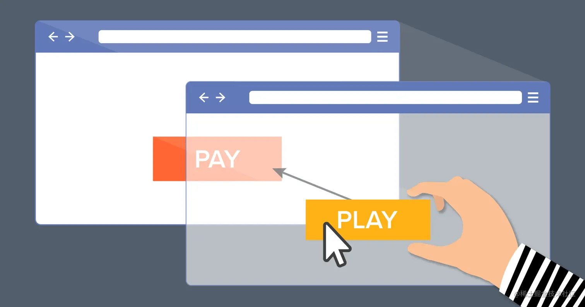
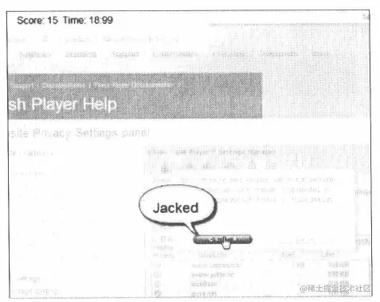
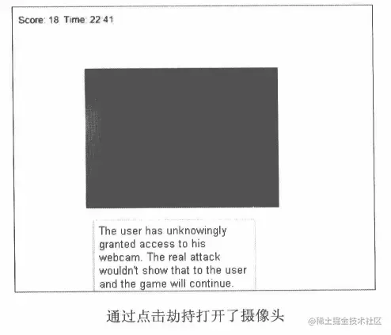

+++
title = "点击劫持"
date = '2024-10-02T00:00:00+08:00'
lastmod = '2024-12-04T00:00:00+08:00'
draft = false
weight = 8
tags = ["面试", "前端", "前端安全", "点击劫持", "ecool"]
categories = ["前端开发", "面试"]
source = "https://fe.ecool.fun/knowledge-learn"
+++
## 一、简介

点击劫持是一种视觉上的欺骗手段。攻击者使用一个透明的、不可见的iframe,覆盖在一个网页上，然后诱使用户在该网页上进行操作，此时用户在不知情的情况下点击透明的iframe页面。通过调整iframe页面的位置，可以诱使用户恰好点击在iframe页面的一些功能性按钮上。



虽然受害者点击的是他所看到的网页，但其实他所点击的是被**黑客精心构建的另一个置于原网页上面的透明页面**

Clickjacking 是仅此于 XSS 和 CSRF 的前端漏洞，因为需要诱使用户交互，攻击成本高，所以不被重视，但危害不容小觑。

**点击劫持的步骤**

1. 黑客创建一个网页利用 iframe 包含目标网站；
2. 隐藏目标网站，使用户无法无法察觉到目标网站存在；
3. 构造网页，诱变用户点击特点按钮；
4. 用户在不知情的情况下点击按钮，触发执行恶意网页的命令；

## 二、劫持类型

### 2.1 Flash点击劫持

攻击者通过flash构造了点击劫持，在完成一系列复杂的动作后，最终控制了用户的摄像头。

攻击者制作了一个Flash游戏，这个游戏就是让用户去点击“CLICK”按钮，每次点击后这个按钮的位置都会发生变化。在Flash上面隐藏了一个看不见的iframe，游戏中某些点击时是有意义的，有些点击是无效的。 攻击通过诱导用户鼠标点击就能完成较复杂的动作。最终通过这一步步操作，打开了用户的摄像头。

 

### 2.2 图片覆盖攻击

点击劫持是一种视觉上的欺骗手段。那么图片覆盖也可以起到类似的作用。简称XSIO（Cross Site Image Overlaying）

*原理：* 利用的是图片的style,或者能够控制CSS。如果应用没有限制style的position为absolute的话，图片可以覆盖到页面上的任意位置。

```css

```

用户点击图片，就会链接到其他网站。

图片还可以伪装得像一个正常的链接、按钮；或者在图片中构造一些文字，覆盖在关键的位置，就有可能完全改变页面中想表达的意思。这种情况下，不需要用户点击，也能达到欺骗的目的。

由于img标签在很多系统中是对用户开放的，因此在现实生活中有非常多的站点存在在XSIO攻击的可能。在防御XSIO时，需要检查用户提交的HTML代码中，img标签的style属性是否可能导致浮出。

### 2.3 拖拽劫持与数据窃取

目前，许多浏览器都开始支持Drag和Drop的API。对于用户来说，拖拽使他们的操作更加简单。浏览器中的拖拽对象可以是一个链接，也可以是一段文字，还可以从一个窗口拖拽到另一个窗口，因此拖拽是_不受同源策略限制_的。

拖拽劫持的思路是诱使用户从隐藏不可见iframe中拖拽出攻击者希望得到的数据，然后放到攻击者能控制的另外一个页面，从而窃取数据。在JavaScript的支持下，这个攻击过程会变得非常隐蔽，因为它突破了传统ClickJacking一些先天的局限，所以这种新型的拖拽劫持能够造成更大的破坏。

### 2.4 ClickJacking3.0：触屏劫持

智能手机的 *触屏劫持* 攻击被斯坦福的[安全研究者公布](http://seclab.stanford.edu/websec/framebusting/tapjacking.pdf)，这意味着ClickJacking的攻击方式更进一步，斯坦福安全研究者的将其称为TapJacking。

从手机角度来看，触屏实际上就是一个事件，手机捕捉这些事件，并执行相应的动作。 常见的几个事件：

```makefile
touchstart: 手指触摸屏幕时发生
touchend: 手指离开屏幕时发生
touchmove: 手指滑动时发生
touchcancel: 系统可取消touch事件
```

将一个不可见的iframe覆盖到当前网页上，就可以劫持用户的触屏操作。

在未来，随着移动设备中浏览器功能的丰富，我们会看到更多的TapJacking

## 三、防御

### 3.1 防御ClickJacking

#### 3.1.1 frame busting

通过可以写一段JavaScript代码，以禁止iframe的嵌套。这种方法叫作frame busting。比如

```js
if (top.location != location) {
  top.location = self.location;
}
```

当然，还要很多很多frame busting的写法，这里就不做赘述了。

*缺点*：js编写的，防御效果不好，可绕过

#### 3.1.2 X-Frame-Options

使用HTTP头:`X-Frame-Options`

`X-Frame-Options`可以说是为了解决ClickJacking而生的，且浏览器支持较好。它有三个可选的值：

```css
DENY 拒绝当前页面加载任何frame页面
SAMEORIGIN  frame页面的地址只能为同源域名下的页面
ALLOW-FROM origin 定义允许frame加载的页面地址
```

例如：

- 京东：X-Frame-Options: SAMEORIGIN
- Facebook：x-frame-options: DENY
- Twitter：x-frame-options: DENY

*配置 X-FRAME-OPTIONS*：

-  使用 meta标签来设置 `X-Frame-Options` 是无效的！例如 `<meta http-equiv="X-Frame-Options" content="deny">` 没有任何效果
-  配置 Apache<br>
  - 把下面这行添加到 'site' 的配置中：
  - `Header always set X-Frame-Options "SAMEORIGIN"`
-  配置nginx<br>
  - 把下面这行添加到 'http', 'server' 或者 'location'，配置中
  - `add_header X-Frame-Options SAMEORIGIN;`
-  其余配置可自行百度。

除了`X-Frame-Options`之外，Firefox的`Content Security Policy`以及Firefox的`NoScript`扩展也能有效防御ClickJacking。这些方案为我们提供了更多的选择。

### 3.2 其他方式

#### 3.2.1 阻止顶级导航

我们可以阻止因更改 beforeunload 事件处理程序中的 top.location 而引起的过渡（transition）。

顶级页面（从属于黑客）在 beforeunload 上设置了一个用于阻止的处理程序，像这样：

```javascript
window.onbeforeunload = function() {
  return false;
};
```

当 `iframe` 试图更改 `top.location` 时，访问者会收到一条消息，询问他们是否要离开页面。

在大多数情况下，访问者会做出否定的回答，因为他们并不知道还有这么一个 `iframe`，他们所看到的只有顶级页面，他们没有理由离开。所以 `top.location` 不会变化！

#### 3.2.2 显示禁用的功能

`X-Frame-Options` 有一个副作用。其他的网站即使有充分的理由也无法在 iframe 中显示我们的页面。

因此，还有其他解决方案。例如，我们可以用一个样式为 `height: 100%; width: 100%;` 的 `<div>` “覆盖”页面，这样它就能拦截所有点击。如果 `window == top` 或者我们确定不需要保护时，再将该 `<div>` 移除。

```xml
<style>
  #protector {
    height: 100%;
    width: 100%;
    position: absolute;
    left: 0;
    top: 0;
    z-index: 99999999;
  }
</style>
​
<div id="protector">
  <a href="/" target="_blank">前往网站</a>
</div>
​
<script>
  // 如果顶级窗口来自其他源，这里则会出现一个 error
  // 但是在本例中没有问题
  if (top.document.domain == document.domain) {
    protector.remove();
  }
</script>
```

## 四、总结

点击劫持是一种“诱骗”用户在不知情的情况下点击恶意网站的方式。如果是重要的点击操作，这是非常危险的。

黑客可以通过信息发布指向他的恶意页面的链接，或者通过某些手段引诱访问者访问他的页面。当然还有很多其他变体。

一方面 —— 这种攻击方式是“浅层”的：黑客所做的只是拦截一次点击。但另一方面，如果黑客知道在点击之后将出现另一个控件，则他们可能还会使用狡猾的消息来迫使用户也点击它们。

这种攻击相当危险，因为在设计交互界面时，我们通常不会考虑到可能会有黑客代表用户点击界面。所以，在许多意想不到的地方可能发现攻击漏洞。

- 建议在那些不希望被在 iframe 中查看的页面上（或整个网站上）使用 `X-Frame-Options: SAMEORIGIN`。
- 如果我们希望允许在 iframe 中显示我们的页面，那我们使用一个 `<div>` 对整个页面进行遮盖，这样也是安全的。

## 常见考点

### **1. 点击劫持的基本概念**

#### **问题**：

- 什么是点击劫持（Clickjacking）？
- 点击劫持通常利用了哪些前端特性或漏洞？
- 点击劫持可能带来的危害有哪些？

**关键点**：

- 点击劫持是一种通过隐藏的 iframe 或伪装界面诱导用户点击的攻击方式。
- 主要危害包括未经用户授权的操作，例如点赞、分享、提交敏感信息或执行交易。

---

### **2. 点击劫持的攻击原理**

#### **问题**：

- 点击劫持是如何实现的？它的基本流程是什么？
- iframe 在点击劫持中扮演了什么角色？
- 如何通过 CSS 或 JavaScript 伪装页面元素诱导用户点击？

**关键点**：

- 攻击者使用一个透明或不可见的 iframe，将目标网站嵌入到恶意页面中。
- 用户以为在操作恶意页面的 UI，实际上是在操作目标网站。

---

### **3. 防御点击劫持的技术措施**

#### **问题**：

- 什么是 `X-Frame-Options`？它如何防御点击劫持？
- `Content-Security-Policy` 中的 `frame-ancestors` 指令有什么作用？如何配置？
- 如何使用 JavaScript 检测页面是否被嵌入到 iframe 中？
- 除了技术手段，还可以通过哪些设计策略防御点击劫持？

**关键点**：

- **`X-Frame-Options`**：<br>
  - `DENY`：不允许页面被嵌套。
  - `SAMEORIGIN`：仅允许相同源嵌套。
- **`Content-Security-Policy`**：<br>
  - `frame-ancestors 'none';` 可完全禁止嵌套。
- **JavaScript 检测**：<br>
  - 判断 `window.top === window.self`，若不相等，则页面被嵌套。

---

### **4. 点击劫持的常见场景**

#### **问题**：

- 在以下场景中，点击劫持可能如何发生？如何防御？<br>
  1. 一个支付页面被恶意嵌入到第三方网站。
  2. 一个用户点赞功能的按钮被伪装成无害的广告。
  3. 在线表单提交功能被恶意页面诱导填写。

**关键点**：

- 对敏感操作进行额外验证（如 CAPTCHA 或二次确认）。
- 在用户重要操作前显示明确的提示，确保用户知情。

---

### **5. 点击劫持的检测与排查**

#### **问题**：

- 如何检测你的页面是否被嵌入到其他网站的 iframe 中？
- 如果发现某些功能无法正常使用，可能与点击劫持相关，如何排查？

**关键点**：

- 检测并阻止嵌套行为：<br>
```javascript
if (window.top !== window.self) {
    window.top.location = window.self.location;
}
```
- 使用浏览器调试工具检查页面是否被嵌套。

---

### **6. 实践经验与场景化问题**

#### **问题**：

- 如果你的页面有嵌套需求（如嵌入支付或第三方服务），如何兼顾功能需求和安全性？
- 如何配置防御点击劫持的策略，同时保证嵌入的广告或合作内容正常显示？
- 在实际项目中，你是否遇到过类似攻击？如何应对？

**关键点**：

- 为合作伙伴提供明确的域名白名单。
- 配置灵活的 `Content-Security-Policy` 策略，例如：<br>
```http
Content-Security-Policy: frame-ancestors 'self' https://trusted-partner.com;
```

---

### **7. 点击劫持与用户体验**

#### **问题**：

- 点击劫持防御措施（如 `X-Frame-Options`）是否可能影响正常功能？如何权衡安全性和用户体验？
- 如何避免过度防御（如完全禁用 iframe）对业务场景造成影响？

---

### **8. 项目实践经验**

#### **问题**：

- 你是否配置过 `X-Frame-Options` 或 `Content-Security-Policy`？配置过程中遇到过哪些问题？
- 在某些需要嵌套 iframe 的业务场景中（如 OAuth 登录流程），如何确保嵌套的安全性？
- 你是否遇到过用户反馈因点击劫持防御策略导致功能异常的问题？如何解决？

---

### **9. 点击劫持与其他攻击的关系**

#### **问题**：

- 点击劫持与 CSRF 有什么关系？两者如何结合进行攻击？
- 点击劫持与视觉欺骗（UI Redressing）有什么相似之处？

**关键点**：

- 点击劫持可能通过 CSRF 伪造请求，进一步加剧危害。
- 两者均利用用户的误操作或视觉误导。
