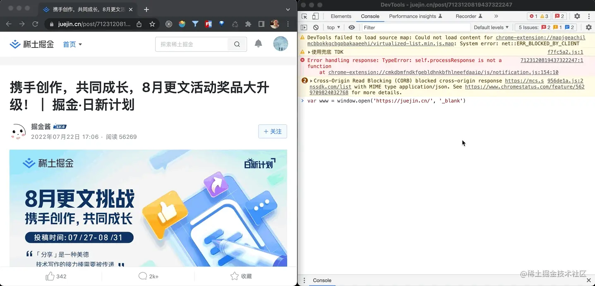
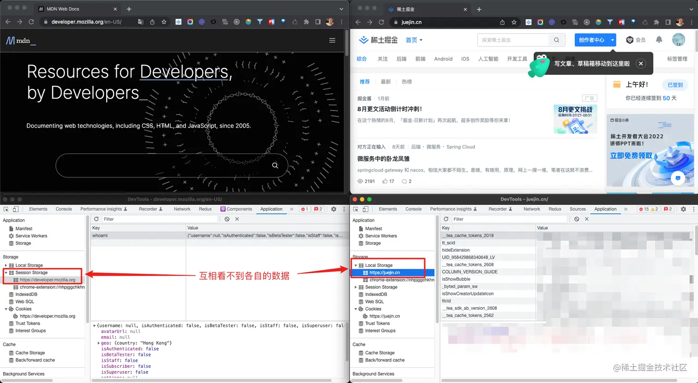
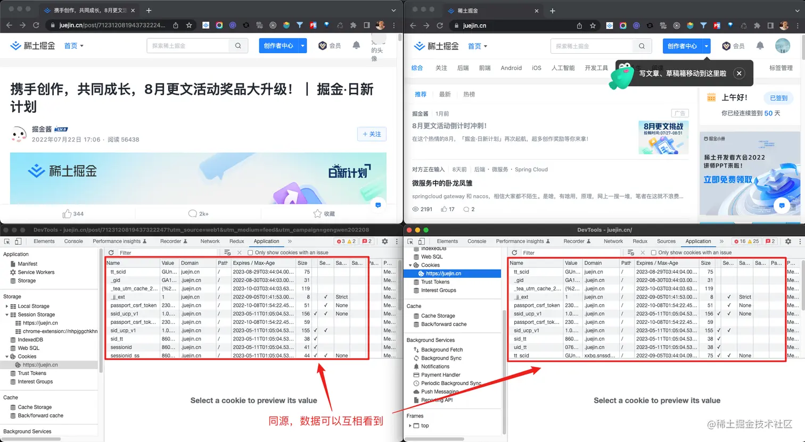
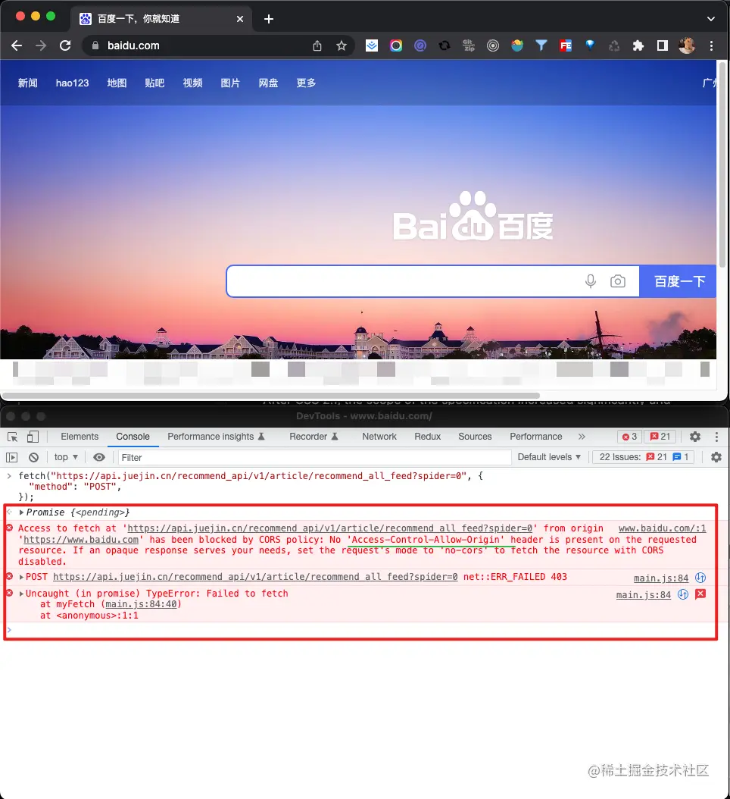

+++
title = "浏览器的同源策略"
date = '2024-12-17T00:00:00+08:00'
lastmod = '2025-07-17T00:00:00+08:00'
draft = false
weight = 10
tags = ["面试", "前端", "前端安全", "浏览器的同源策略", "ecool"]
categories = ["前端开发", "面试"]
source = "https://fe.ecool.fun/knowledge-learn"
+++
## 概述

本文从以下三个问题，循序渐进，一步步拆解，何为浏览器的同源策略和跨域问题：

1. 什么是同源策略和跨域问题？
2. 怎样才算同源？
3. 同源策略下会有什么限制？

## 什么是同源策略和跨域问题？

同源政策是 1995 年由 Netscape 公司（就是创造了 JS 的那家网景公司）引入浏览器的一种策略。

想要理解同源策略的话，可以先假设如果没有同源策略会发生什么事情。接下来我们通过一则恐怖故事代入理解一下没有同源策略的世界：

在某个深夜，小明独自一人在家浏览网页，无意间打开了一些特殊网站，而恰巧的是，小明之前刚好打开过某些重要支付平台的网站且还没关闭，这时特殊网站里面可能有一些特殊 JS 脚本，在偷偷获取小明支付平台上的信息，并且偷偷利用了这些信息再结合某些手段，成功把小明支付平台上的钱转走了，小明上完厕所回来后，突然收到支付平台转账成功的短信，然后然后然后瘫坐在地上，泣不成声，仰天长啸，大喊一声：“还我攒了半年的 9.99~”

恐怖故事听完了，我们来先上个概念，什么是同源策略？

[借用 MDN 上的描述](https://developer.mozilla.org/zh-CN/docs/Web/Security/Same-origin_policy)：

> **同源策略**是一个重要的安全策略，它用于限制一个origin的文档或者它加载的脚本如何能与另一个源的资源进行交互。它能帮助阻隔恶意文档，减少可能被攻击的媒介。

怎么理解这个概念呢？举个栗子，随着汽车数量的上升，现在很多城市都有各种限行政策，就拿广州来说，如果不是 `粤A` 的车牌进入城区的话会有开四停四的限行限制。

同源策略跟汽车限行政策有一点点像，同源策略规定在“同源”下的脚本、文档等资源访问不受限（有点像 `粤A` 牌的汽车在广州内行驶不会被限行），如果不是“同源”则无法互相访问脚本、文档等资源（非 `粤A` 牌的汽车在广州市区内受开四停四政策限制）

理解了同源策略后，对于跨域就很好理解了，同源策略是好，我们也需要同源策略，但有些时候我们确实需要不同源的两个网页互相读取信息，这是就产生了跨域问题。

**额外补充**，同源策略是浏览器的行为，是浏览器的行为，是浏览器的行为（对于这点的解析可以参考：[同源策略下，服务器会收到浏览器的请求吗？](https://blog.csdn.net/l_z_jay/article/details/121431204)）

## 怎样才算同源？

所谓“同源”，就是以下三者必须**都相同**：

1. 协议相同<br>
  - 协议**相同**的两个域名：（都是 `https` 协议）<br>
    - `https://juejin.cn`
    - `https://juejin.cn`
  - 协议**不同**的两个域名：（一个是 `http` 协议，一个是 `https` 协议）<br>
    - `http://juejin.cn`
    - `https://juejin.cn`
2. 域名相同<br>
  - 域名**相同**的两个域名：<br>
    - `https://juejin.cn`
    - `https://juejin.cn`
  - 域名**不同**的两个域名：（一个是[二级域名](https://help.aliyun.com/document_detail/155782.html#h2-u4EC0u4E48u53EBu5B50u57DFu540D1)，一个是[三级域名](https://help.aliyun.com/document_detail/155782.html#h2-u4EC0u4E48u53EBu5B50u57DFu540D1)）（可能这个是最容易记错的）<br>
    - `https://juejin.cn`
    - `https://www.juejin.cn`
3. 端口相同<br>
  - 端口**相同**的两个域名：<br>
    - `https://juejin.cn`
    - `https://juejin.cn`
  - 端口**不同**的两个域名：<br>
    - `https://juejin.cn`
    - `https://juejin.cn:8081`

再重复一遍，

同协议、同域名、同端口，才算同源

同协议、同域名、同端口，才算同源

同协议、同域名、同端口，才算同源

## 同源策略下会有什么限制？

在同源策略下，如果**非同源**，会有以下三个方面的行为受到限制：

1. DOM<br>
  - 如果非同源，其 JS 脚本，不能互相对 DOM 进行读写操作
2. 数据<br>
  - 如果非同源，不能互相读写 Cookies、LocalStorage、SessionStorage 和 IndexedDB
3. 网络请求<br>
  - 如果非同源，不能通过 AJAX 的方式互相发送、接收数据

为了方便理解，接下来我们展开说说这三条规则 ↓↓↓

### 同源下，JS 可以操作 DOM



如上图，我们在谷歌浏览器上打开 `https://juejin.cn/post/7123120819437322247` 然后打开开发者工具，执行以下 JS 脚本

```
// 在另外一个窗口上打开 https://juejin.cn/ 并且返回打开的新窗口对象的引用
var www = window.open('https://juejin.cn/', '_blank');

// 然后等 https://juejin.cn/ 窗口打开后，还是在上一步的开发者工具中执行：(执行完后会发现，刚通过 window.open 打开的 https://juejin.cn/ 窗口，DOM 中的 body 标签里面的内容直接被隐藏了)
www.document.body.style.display = 'none';

// 想要让其重新展示，再执行下面脚本即可：
www.document.body.style.display = 'block';
```

上述例子中，虽然分别打开了 `https://juejin.cn/post/7123120819437322247`、`https://juejin.cn/` 两个窗口，但因为他们是同源的，所以 `https://juejin.cn/post/7123120819437322247` 中的 JS 脚本可以操作 `https://juejin.cn/` 中的 DOM。

PS：上述例子都是建立在通过 [window.open()](https://developer.mozilla.org/zh-CN/docs/Web/API/Window/open) 获取到 `https://juejin.cn/` 窗口对象的引用（[window.opener](https://developer.mozilla.org/zh-CN/docs/Web/API/Window/opener)）的前提下进行的。如果只是单纯直接打开两个窗口，没有 window.opener 的话，也是不可以跨窗口操作 DOM 滴 `￣ω￣=`

### 同源下，才能读写 Cookies、LocalStorage、SessionStorage 和 IndexedDB



这里先举个反例吧，如上图，随便打开 [developer.mozilla.org/en-US/](https://developer.mozilla.org/en-US/)、[juejin.cn/](https://juejin.cn/) 两个网页，在各自的开发工具 Application 中就可以看出，如果非同源，是看不到各自的数据的。

相反，如下图，如果是同源的话，就可以互相看到数据



### 同源下，可以通过 AJAX 的方式互相发送、接收数据

这里还是举个反例吧，比如，在掘金上爬的这个获取今日推荐的接口（仅作为演示，无恶意调用，各位也不需要恶意调用喔）

```
fetch("https://api.juejin.cn/recommend_api/v1/article/recommend_all_feed?spider=0", {
  "method": "POST",
});
```

随便打开百度网页，打开谷歌开发者工具，执行上述 JS 脚本，就能看到熟悉的报错：



```
has been blocked by CORS policy: No 'Access-Control-Allow-Origin' header is present on the requested resource.
```

这个可能是我们经常会遇到的报错信息吧~

由此看出，如果非同源，不能通过 AJAX 的方式互相发送、接收数据；相反，如果同源，则可以通过 AJAX 的方式互相发送、接收数据。

## 常见考点

浏览器的同源策略（Same-Origin Policy，SOP）是 Web 安全的基石之一，面试中关于同源策略的考察点非常丰富，涉及原理、限制、跨域解决方案等多个方面。下面是常见的考点整理：

## 一、同源策略的基本概念

-  **什么是同源？** 两个 URL 的协议（protocol）、域名（host）、端口（port）三者都相同，才算同源。
-  **同源策略的目的是什么？** 防止恶意脚本窃取或篡改另一个网站的数据，保护用户隐私和安全。

## 二、同源策略具体限制的内容

-  **DOM 访问限制** 脚本无法访问跨源页面的 DOM，如 `iframe` 中的跨源文档。
-  **Cookie、LocalStorage、IndexedDB 等存储限制** 跨源时无法访问对方的存储空间。
-  **AJAX（XHR、fetch）请求限制** 只能请求同源资源，否则会被浏览器阻止。
-  **WebSocket 限制** 建立连接时也受同源限制。

## 三、哪些属于“不同源”？

- 协议不同：`http://` 和 `https://`
- 域名不同：`example.com` 和 `api.example.com`
- 端口不同：`http://example.com:80` 和 `http://example.com:8080`

## 四、跨域场景与解决方案

### 1. **JSONP**

- 利用 `<script>` 标签不受跨域限制的特点实现跨域请求（仅支持 GET）。
- 需后端配合返回回调函数。

### 2. **CORS（跨域资源共享）**

- 服务器设置响应头 `Access-Control-Allow-Origin` 等，允许浏览器跨域访问。
- 预检请求（OPTIONS）机制，复杂请求需要先发预检。
- 支持带 Cookie 的跨域需设置 `Access-Control-Allow-Credentials`。

### 3. **代理服务器**

- 通过同源的服务器代理请求，实现跨域访问。

### 4. **PostMessage**

- 跨窗口通信（如跨域 iframe），通过 `window.postMessage` 安全传递数据。

### 5. **WebSocket**

- 建立长连接，协议允许跨域，但握手时仍有安全限制。

### 6. **document.domain**

- 设置相同的 `document.domain` 来放宽子域间限制（仅限一级域名相同）。

## 五、同源策略与浏览器安全机制

- **浏览器默认阻止跨域访问**
- **跨域请求携带 Cookie 限制**
- **浏览器对跨域资源的预检机制**
- **跨域脚本注入风险防范**

## 六、面试常见问题示例

1. 什么是同源策略？同源的判断条件是什么？
2. 同源策略限制了哪些操作？
3. 如何实现跨域请求？请列举几种常见方案，并说明原理。
4. CORS 中预检请求的作用是什么？哪些请求会触发预检？
5. JSONP 是什么？它的优缺点有哪些？
6. 如何使用 `postMessage` 实现跨域通信？
7. 什么情况下可以使用 `document.domain` 来实现跨域？
8. 跨域请求携带 Cookie 需要注意什么？
9. 如何配置服务器支持带凭证的跨域请求？
10. WebSocket 是否受同源策略限制？为什么？
