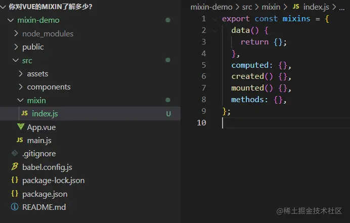
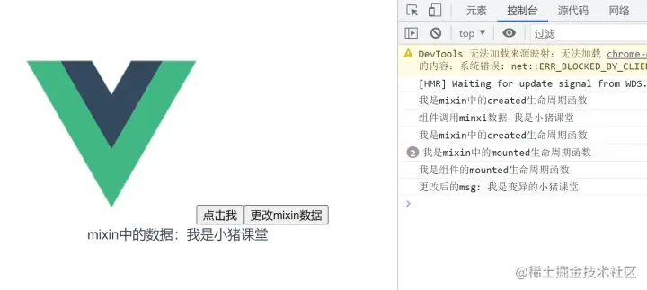
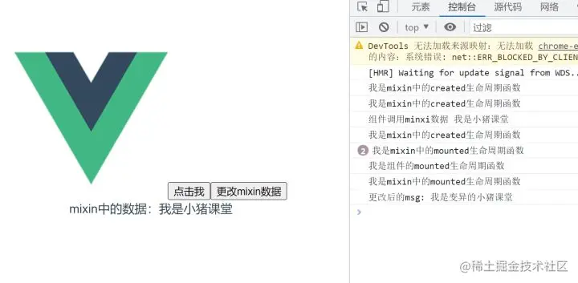
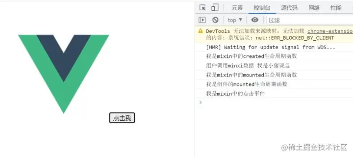

+++
title = "mixin-混入"
date = '2024-10-05T00:00:00+08:00'
lastmod = '2024-12-15T00:00:00+08:00'
draft = false
weight = 14
tags = ["面试", "前端", "Vue", "mixin-混入", "ecool"]
categories = ["前端开发", "面试"]
source = "https://fe.ecool.fun/knowledge-learn"
+++
## 1. 什么是Mixin？

想要使用一个事物或者工具，我们首要先了解它是什么，这样我们才好对症下药。

其实Mixin不是Vue专属的，可以说它是一种思想，也可以说它就是混入的意思，在很多开发框架中都实现了Mixin(混入)，我们这里主要讲解的是Vue中的Mixin。

老规矩，先看官方文档。

**官方解释：**

> 混入 (mixin) 提供了一种非常灵活的方式，来分发 Vue 组件中的可复用功能。一个混入对象可以包含任意组件选项。当组件使用混入对象时，所有混入对象的选项将被“混合”进入该组件本身的选项。

官方的解释通常都是晦涩难懂的，因为要专业和准确嘛！

我们可以用我们自己容易理解的话来说说Vue中的Mixin是什么。

**民间解释：**

将组件的公共逻辑或者配置提取出来，哪个组件需要用到时，直接将提取的这部分混入到组件内部即可。这样既可以减少代码冗余度，也可以让后期维护起来更加容易。

这里需要注意的是：提取的是逻辑或配置，而不是HTML代码和CSS代码。其实大家也可以换一种想法，mixin就是组件中的组件，Vue组件化让我们的代码复用性更高，那么组件与组件之间还有重复部分，我们使用Mixin在抽离一遍。

## 2. Mixin和Vuex的区别？

上面一点说Mixin就是一个抽离公共部分的作用。在Vue中，Vuex状态管理似乎也是做的这一件事，它也是将组件之间可能共享的数据抽离出来。两者看似一样，实则还是有细微的区别，区别如下：

- Vuex公共状态管理，如果在一个组件中更改了Vuex中的某个数据，那么其它所有引用了Vuex中该数据的组件也会跟着变化。
- Mixin中的数据和方法都是独立的，组件之间使用后是互相不影响的。

## 3. 如何使用？

我们了解了Mixin的概念，那么如何使用它呢？这才是我们的重点。

### 3.1 准备工作

接下来我们的mixin就放在Vue2.x的脚手架项目中演示。

利用Vue-cli初始化一个最简单的项目：


### 3.1 mixin定义

定义mixin也非常简单，它就是一个对象而已，只不过这个对象里面可以包含Vue组件中的一些常见配置，如data、methods、created等等。

在我们的项目src目录下新建mixin文件夹，然后新建index.js文件，该文件存放我们的mixin代码。

**代码如下：**

```javascript
// src/mixin/index.js
export const mixins = {
  data() {
    return {};
  },
  computed: {},
  created() {},
  mounted() {},
  methods: {},
};
```



可以看到我们的mixin非常的简单，主要包含了一个Vue组件的常见的逻辑结构。

接下来让我们在mixin中简单的写点东西，**代码如下：**

```javascript
export const mixins = {
  data() {
    return {
      msg: "我是小猪课堂",
    };
  },
  computed: {},
  created() {
    console.log("我是mixin中的created生命周期函数");
  },
  mounted() {
    console.log("我是mixin中的mounted生命周期函数");
  },
  methods: {
    clickMe() {
      console.log("我是mixin中的点击事件");
    },
  },
};
```

### 3.2 局部混入

我们的公共mixin定义好后，最重要就是如何使用它。根据不同的业务场景，我们可以分为两种：局部混入和全局混入。顾名思义，局部混入和组件的按需加载有点类似，就是需要用到mixin中的代码时，我们再在组件章引入它。全局混入的话，则代表我在项目的任何组件中都可以使用mixin。

组件中引入mixin也非常简单，我们稍微改造下App.vue组件。

**代码如下：**

```javascript
// src/App.vue
<template>
  <div id="app">
    
    <button @click="clickMe">点击我</button>
  </div>
</template>

<script>
import { mixins } from "./mixin/index";
export default {
  name: "App",
  mixins: [mixins],
  components: {},
  created(){
    console.log("组件调用minxi数据",this.msg);
  },
  mounted(){
    console.log("我是组件的mounted生命周期函数")
  }
};
</script>
```

**效果如下：**


上段代码中引入mixin的方法也非常简单，直接使用vue提供给我们的mixins属性：mixins:[mixins]。

通过上面的代码和效果我们可以得出以下几点：

- mixin中的生命周期函数会和组件的生命周期函数一起合并执行。
- mixin中的data数据在组件中也可以使用。
- mixin中的方法在组件内部可以直接调用。
- 生命周期函数合并后执行顺序：先执行mixin中的，后执行组件的。

**问题提出：**

这里我们就提出了一个问题：**一个组件中改动了mixin中的数据，另一个引用了mixin的组件会受影响吗？**

**答案是不会的！**

我们可以尝试一下：

在src下的components文件夹下新建demo组件，代码如下：

```javascript
// src/components/demo.vue
<template>
  <div>mixin中的数据：{{ msg }}</div>
</template>
<script>
import { mixins } from "../mixin/index";
export default {
  mixins: [mixins],
};
</script>
```

然后在App.vue组件中引入demo组件，代码如下：

```javascript
<template>
  <div id="app">
    
    <button @click="clickMe">点击我</button>
    <button @click="changeMsg">更改mixin数据</button>
    <demo></demo>
  </div>
</template>

<script>
import { mixins } from "./mixin/index";
import demo from "./components/demo.vue";
export default {
  name: "App",
  mixins: [mixins],
  components: { demo },
  created() {
    console.log("组件调用minxi数据", this.msg);
  },
  mounted() {
    console.log("我是组件的mounted生命周期函数");
  },
  methods: {
    changeMsg() {
      this.msg = "我是变异的小猪课堂";
      console.log("更改后的msg:", this.msg);
    },
  },
};
</script>
```

**代码解释：**

- 我们在demo组件中引入了mixin，且使用了mixin中的msg数据。
- 在App.vue中同样引入了mixin，且设置了点击事件更改msg
- 点击按钮，更改msg，查看demo组件中显示是否有变化。

效果如下：



可以看到我们在App.vue组件中更改了msg后，demo组件显示没有任何变化，所以这里我们得出结论：不**同组件中的mixin是相互独立的！**

### 3.3 全局混入

上一点我们使用mixin是在需要的组件中引入它，我们也可以在全局先把它注册好，这样我们就可以在任何组件中直接使用了。

修改main.js，代码如下：

```javascript
import Vue from "vue";
import App from "./App.vue";
import { mixins } from "./mixin/index";
Vue.mixin(mixins);

Vue.config.productionTip = false;

new Vue({
  render: (h) => h(App),
}).$mount("#app");
```

然后把App.vue中引入mixin的代码注释掉，代码如下：

```javascript
<template>
  <div id="app">
    
    <button @click="clickMe">点击我</button>
    <button @click="changeMsg">更改mixin数据</button>
    <demo></demo>
  </div>
</template>

<script>
// import { mixins } from "./mixin/index";
import demo from "./components/demo.vue";
export default {
  name: "App",
  // mixins: [mixins],
  components: { demo },
  created() {
    console.log("组件调用minxi数据", this.msg);
  },
  mounted() {
    console.log("我是组件的mounted生命周期函数");
  },
  methods: {
    changeMsg() {
      this.msg = "我是变异的小猪课堂";
      console.log("更改后的msg:", this.msg);
    },
  },
};
</script>
```

**效果如下：**



可以发现效果上和局部混入没有任何区别，这就是全局混入的特点。

虽然这样做很方便，但是我们不推荐，来看看官方的一段话：

> 请谨慎使用全局混入，因为它会影响每个单独创建的 Vue 实例 (包括第三方组件)。大多数情况下，只应当应用于自定义选项，就像上面示例一样。推荐将其作为插件发布，以避免重复应用混入。

### 3.4 选项合并

上面的列子中我们仔细看会发现一个问题：mixin中定义的属性或方法的名称与组件中定义的名称没有冲突！

那么我们不禁会想，如果命名有冲突了怎么办？

我们使用git合并代码的时候经常会有冲突，有冲突了不要怕，我们合并就好了。这里的冲突主要分为以下几种情况：

**（1）生命周期函数**

确切来说，这种不算冲突，因为生命周期函数的名称都是固定的，默认的合并策略如下：

- 先执行mixin中生命周期函数中的代码，然后在执行组件内部的代码，上面的例子其实就很好的证明了。



**（2）data数据冲突**

当mixin中的data数据与组件中的data数据冲突时，组件中的data数据会覆盖mixin中数据，借用官方的一段代码：

```javascript
var mixin = {
  data: function () {
    return {
      message: 'hello',
      foo: 'abc'
    }
  }
}

new Vue({
  mixins: [mixin],
  data: function () {
    return {
      message: 'goodbye',
      bar: 'def'
    }
  },
  created: function () {
    console.log(this.$data)
    // => { message: "goodbye", foo: "abc", bar: "def" }
  }
})
```

可以看到最终打印的message是组件中message的值，其它没有冲突的数据自然合并了。

**（3）方法冲突**

这种冲突很容易遇到，毕竟大家命名方法的名字很容易一样，这里同样借用官方的一段代码：

```javascript
var mixin = {
  methods: {
    foo: function () {
      console.log('foo')
    },
    conflicting: function () {
      console.log('from mixin')
    }
  }
}

var vm = new Vue({
  mixins: [mixin],
  methods: {
    bar: function () {
      console.log('bar')
    },
    conflicting: function () {
      console.log('from self')
    }
  }
})

vm.foo() // => "foo"
vm.bar() // => "bar"
vm.conflicting() // => "from self"
```

上段代码中mixin和组件中都有conficting方法，但是最终在组件中调用时，实际调用的是组件中的conflicting方法。

当然，如果你要自定义合并规则也不是不可以，但是我觉得没有必要，项目中无需做这么复杂。

## 4. mixin的优缺点

从上面的例子看来，使用mixin的好处多多，但是凡是都有两面性，这里总结几点优缺点供大家参考：

### 4.1 优点

- 提高代码复用性
- 无需传递状态
- 维护方便，只需要修改一个地方即可

### 4.2 缺点

- 命名冲突
- 滥用的话后期很难维护
- 不好追溯源，排查问题稍显麻烦
- 不能轻易的重复代码

## 常见考点

### **1. Mixin 的基本概念**

#### **问题：**

1. 什么是 Mixin？它如何工作？
2. Mixin 如何在 Vue 组件中使用？

#### **考察点：**

-  **定义 Mixin**： Mixin 是一个包含组件选项的对象，可以包含 `data`、`methods`、`computed`、`watch` 等选项，它们会被合并到组件的选项中。<br>
```javascript
const myMixin = {
  data() {
    return {
      mixinData: 'This is from mixin'
    };
  },
  methods: {
    mixinMethod() {
      console.log('This is a method from mixin');
    }
  }
};
```
-  **使用 Mixin**： Mixin 可以通过 `mixins` 选项在组件中使用：  当 `mixins` 选项被添加到组件中时，Mixin 的数据、方法等都会被合并到该组件中。
```javascript
import myMixin from './myMixin';

export default {
  mixins: [myMixin],
  created() {
    console.log(this.mixinData);  // "This is from mixin"
    this.mixinMethod();  // "This is a method from mixin"
  }
};
```

---

### **2. Mixin 的合并机制**

#### **问题：**

1. Mixin 中的数据、方法等是如何与组件中的选项合并的？
2. 当组件和 Mixin 中存在同名的钩子函数或方法时，会发生什么？

#### **考察点：**

-  **合并数据**： Mixin 中的 `data` 会与组件的 `data` 合并。如果它们有相同的属性，组件中的属性会覆盖 Mixin 中的属性。  最终，`myComponent` 中的 `sharedData` 值为 `'component data'`，因为组件的数据会覆盖 Mixin 的数据。
```javascript
const myMixin = {
  data() {
    return {
      sharedData: 'mixin data'
    };
  }
};
const myComponent = {
  data() {
    return {
      sharedData: 'component data'
    };
  },
  mixins: [myMixin]
};
```
-  **合并方法**： 当组件和 Mixin 中都有同名的方法时，组件中的方法会覆盖 Mixin 中的方法。若方法需要同时调用 Mixin 和组件中的方法，可以在方法中调用 `this.$super` 或显式调用 Mixin 中的方法。
-  **生命周期钩子函数合并**： Vue 会将 Mixin 和组件的生命周期钩子函数合并。如果同名钩子函数都存在，它们会按顺序执行（Mixin 的钩子在组件的钩子之前执行）。  输出：<br>
```javascript
const myMixin = {
  created() {
    console.log('Mixin created');
  }
};

const myComponent = {
  created() {
    console.log('Component created');
  },
  mixins: [myMixin]
};
```
```
Mixin created
Component created
```

---

### **3. 使用 Mixin 的场景**

#### **问题：**

1. 在什么场景下使用 Mixin 会比较合适？
2. 使用 Mixin 时，有哪些需要注意的潜在问题？

#### **考察点：**

-  **适用场景**：<br>
  - **功能复用**：如果多个组件之间需要共享相同的逻辑（如同一组方法、生命周期钩子、事件处理等），Mixin 是一个方便的选择。例如，多个组件需要执行相同的请求处理、事件监听、或者处理相同的状态。
  - **跨组件共享逻辑**：当业务逻辑跨越多个组件时，使用 Mixin 可以避免重复代码。
-  **潜在问题**：<br>
  - **命名冲突**：如果 Mixin 和组件中有相同的属性或方法，可能会引发命名冲突。
  - **可维护性差**：当项目中使用大量 Mixin 时，可能会导致项目代码难以维护和调试，因为难以追踪哪些功能来源于 Mixin，哪些来自组件本身。
  - **过度依赖 Mixin**：过度使用 Mixin 会导致代码高度耦合，尤其是在大型项目中，使用过多的 Mixin 会使得组件之间的关系复杂化，降低组件的独立性和可重用性。

---

### **4. Mixin 与 Composition API 的比较**

#### **问题：**

1. 在 Vue 3 中，为什么 Composition API 相比于 Mixin 更被推荐？
2. 你会如何在 Vue 3 中使用 Composition API 来替代 Mixin？

#### **考察点：**

-  **Composition API** 提供了一种新的逻辑复用方式，它通过 `setup()` 函数和组合式函数让代码更加清晰和可维护。  示例：<br>
  - **解耦**：Composition API 允许将相关逻辑封装为独立的函数，这比 Mixin 更具灵活性和可读性。
  - **避免命名冲突**：因为 Composition API 使用的是函数而不是对象，所以避免了 Mixin 中可能出现的命名冲突。
  - **类型推导**：使用 Composition API 时，可以更方便地进行类型推导，尤其在 TypeScript 中，能够减少潜在的类型错误。
```javascript
// 使用 Composition API 替代 Mixin
import { ref, onMounted } from 'vue';

export default {
  setup() {
    const sharedData = ref('component data');

    const mixinMethod = () => {
      console.log('This is a method from Composition API');
    };

    onMounted(() => {
      console.log(sharedData.value);
    });

    return {
      sharedData,
      mixinMethod
    };
  }
};
```
-  **优缺点对比**：<br>
  - **Mixin**：适用于简单的逻辑复用，但存在命名冲突、难以维护等问题。
  - **Composition API**：提供更清晰的逻辑组织方式，避免命名冲突，适合更复杂的逻辑复用。

---

### **5. Mixin 的高级用法**

#### **问题：**

1. 如何通过 Mixin 实现一个全局的行为，比如全局日志记录、权限控制等？
2. Mixin 如何与 Vuex 结合使用，共享状态和方法？

#### **考察点：**

-  **全局行为**：你可以将全局的逻辑（如日志记录、权限校验等）封装到 Mixin 中，以便在多个组件中复用：<br>
```javascript
const logMixin = {
  created() {
    console.log(`Component ${this.$options.name} created`);
  }
};
```
-  **与 Vuex 结合使用**：你可以通过 Mixin 与 Vuex 结合，提供全局状态或方法：<br>
```javascript
const storeMixin = {
  computed: {
    ...Vuex.mapState(['user']),
  },
  methods: {
    ...Vuex.mapActions(['fetchData']),
  }
};
```

---

### **总结**

Vue 中的 Mixin 是一个强大的功能，能够有效地实现组件间的逻辑复用。面试中，考察点通常会包括 Mixin 的基本用法、合并机制、使用场景、潜在问题以及与 Composition API 的比较。面试者需要理解如何使用 Mixin 来复用逻辑，并且能明确在何时应该选择 Mixin 以及何时应该使用其他方法（如 Composition API）来替代 Mixin。
