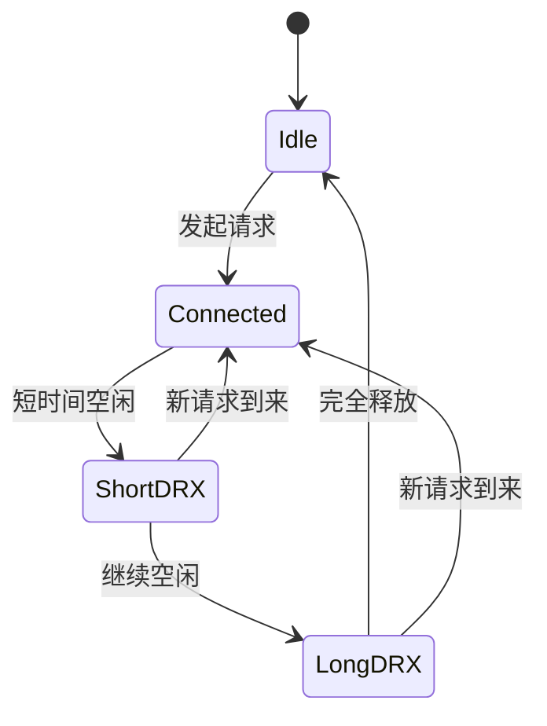

+++
title = "面试专题"
date = '2026-07-06T19:10:32+08:00'
draft = false
weight = -100
tags = ["面试", "iOS", "AI"]
categories = ["面试"]
+++

系统化的iOS和AI面试知识库，涵盖基础到进阶的完整知识体系！


## iOS 相关面试题

### App 启动与优化

<details>
<summary><b>Q: APP启动的详细流程是什么？</b></summary>

iOS 应用启动分为冷启动、热启动和预热启动三种类型。冷启动是最完整的流程，分为 **Pre-main 阶段** 和 **main 阶段**。

**Pre-main 阶段**：

Pre-main 阶段由 dyld（动态链接器）负责，从用户点击 App 图标到 `main()` 执行之前。**主线程在内核 `fork()` 创建进程时同时创建**，后续所有 Pre-main 工作都在主线程上执行。

1. **加载可执行文件**：内核创建进程，使用 `mmap()` 将 Mach-O 文件映射到虚拟内存（惰性加载，只有实际访问的页才加载到物理内存）。解析 Mach-O Header（验证 Magic Number、CPU 架构匹配、文件类型识别）和 Load Commands（`LC_SEGMENT_64` 映射内存并设置权限、`LC_LOAD_DYLIB` 记录动态库依赖、`LC_MAIN` 计算入口地址等），最后验证代码签名。

2. **加载动态库（dyld）**：dyld 从主程序 Mach-O 的 `LC_LOAD_DYLIB` 中读取依赖的动态库路径，按搜索规则查找动态库实际位置（优先从共享缓存中查找），使用 `mmap()` 映射到进程虚拟地址空间，验证代码签名，然后使用**深度优先搜索**递归加载每个动态库的依赖（每个库只加载一次）。最终按依赖关系构建初始化顺序——被依赖的库先于依赖方（如 Foundation 在 UIKit 之前）。如果 App 使用 Swift，此阶段还会加载 Swift 标准库（iOS 12.2+ 位于系统共享缓存，无需嵌入 App）。

3. **Rebase & Bind**：由于 ASLR（地址空间布局随机化），App 每次启动的加载地址不同，需要修正指针。Rebase（重定位）修正指向 Mach-O **内部**的指针，将编译时地址加上 ASLR 偏移量（slide）；Bind（绑定）修正指向 Mach-O **外部**的指针，查找符号表绑定到正确的外部符号地址（如 `_objc_msgSend`）。

4. **ObjC Runtime 初始化**：dyld 通过 `_dyld_objc_notify_register` 回调通知 Runtime，触发 `_objc_init`（`map_images` 回调）。从 Mach-O 的 `__DATA` 系列段（`__DATA`、`__DATA_CONST`、`__DATA_DIRTY`）读取类列表（`__objc_classlist`）、Category 列表（`__objc_catlist`）、协议列表等元数据；遍历 `__objc_classlist` 将**所有类**注册到全局类表（`gdb_objc_realized_classes`）；然后对非懒加载类（实现了 `+load` 方法的类）**立即 realize**——调用 `realizeClassWithoutSwift` 创建可读写的 `class_rw_t` 结构（编译期的 `class_ro_t` 是只读的），建立继承链（`cls->superclass`）和元类关系（`cls->isa`），初始化方法缓存 `cache_t`；懒加载类则**延迟到首次收到消息时**才 realize（`objc_msgSend` → `lookUpImpOrForward` 触发），执行相同的初始化流程。遍历 `__objc_catlist` 处理 Category：若对应类已 realize，立即将 Category 的方法、属性、协议附加到其 `class_rw_t` 上（方法插入到列表**前面**，实现"覆盖"效果）；若对应类尚未 realize，则暂存到 `unattachedCategories` 表，待类 realize 时再附加。

5. **Swift Runtime 元数据注册**：ObjC Runtime 完成后，dyld 触发 Swift Runtime 之前通过 `_dyld_register_func_for_add_image` 注册的回调，遍历所有已加载镜像中的 Swift section，将元数据记录的**位置指针注册**到 Runtime 的全局缓存中：`__swift5_types`（类型元数据）、`__swift5_proto`（协议遵循表）、`__swift5_fieldmd`（字段描述符）等。此阶段只做轻量的指针注册，并不解析和实例化元数据；真正的解析延迟到首次使用时（如首次 `as?` 触发协议遵循查找、首次 `Mirror(reflecting:)` 触发字段描述符解析、泛型类型首次实例化时创建完整的 type metadata）。

6. **调用 +load 方法**：dyld 调用 Runtime 的 `load_images` 回调，通过**函数指针直接调用**（不经过 `objc_msgSend`），因此 Category 的 `+load` 不会覆盖主类的 `+load`，两者都会执行。调用顺序：父类优先于子类 → 类优先于 Category → 同一镜像内按编译顺序（Build Phases → Compile Sources）→ 不同镜像按依赖顺序（被依赖的库先执行）。所有 `+load` 在主线程串行调用，直接阻塞启动。

7. **执行 Initializers**：dyld 遍历所有已加载镜像的 `__DATA,__mod_init_func` section 中的函数指针并调用。来源包括 C++ 静态构造函数（如 `static std::string s = "hello"`）和 `__attribute__((constructor))` 标记的函数。执行顺序：按镜像依赖顺序（被依赖的库优先），同一镜像内按 带优先级的 constructor（数字小的先执行）→ C++ 构造函数 → 不带优先级的 constructor。

**main 阶段**：

1. **main 函数**：OC 中 `main()` 调用 `UIApplicationMain`（需手动创建 `@autoreleasepool`，因为此时 RunLoop 尚未启动）；Swift 中 `@main` 属性让编译器自动生成入口。

2. **UIApplicationMain**：创建 `UIApplication` 单例 → 创建 `AppDelegate` → 加载 Info.plist → **设置并启动主 RunLoop**（调用 `CFRunLoopRun()` 进入主事件循环，通常长期运行、不主动返回）。注意：**主 RunLoop 采用懒加载机制**，首次调用 `[NSRunLoop mainRunLoop]` 时创建，在 `UIApplicationMain` 内部启动。

3. **AppDelegate 回调**（RunLoop 事件循环中）：加载 Main Storyboard → `willFinishLaunchingWithOptions:` → 状态恢复 → `didFinishLaunchingWithOptions:`

4. **首帧渲染**（RunLoop 事件循环中）：创建 Window → 设置 rootViewController → viewDidLoad → viewWillAppear → layoutSubviews → drawRect → Core Animation 提交图层树 → Render Server 渲染 → GPU 合成 → 显示首帧

**预热启动（iOS 15+）**：

系统预测用户可能启动 App，提前在后台执行部分启动流程：

| 对比项 | 冷启动 | 预热启动 |
|-------|-------|---------|
| 触发时机 | 用户点击 App 图标 | 系统预测后自动在后台执行 |
| Pre-main 工作 | 全部在用户点击后执行 | 大部分已在后台完成 |
| 用户感知启动时间 | 包含完整 Pre-main | 只包含 +load 之后的时间 |

**预热阶段已完成**：加载可执行文件、加载动态库、Rebase & Bind、ObjC 类注册和 Category 处理、Swift Runtime 元数据注册

**预热阶段未执行**：+load 方法、Initializers（C++ 构造函数、`__attribute__((constructor))`）、main 阶段全部内容

可通过 `ProcessInfo.processInfo.environment["ActivePrewarm"] == "1"` 检测是否为预热启动，避免将后台预热时间计入用户感知的启动耗时。

→ [App启动流程]()
</details>

<details>
<summary><b>Q: 如何测量和监控 iOS 应用的启动时间？</b></summary>


**测量方案对比**：

| 方案 | 适用场景 | 优点 | 缺点 |
|-----|---------|------|------|
| dyld 环境变量 | 开发调试 | 无需代码，快速查看加载信息 | 只能定性分析，无耗时数据 |
| Instruments App Launch | 深度分析 | 函数级耗时分析，最详细 | 只能线下使用，无法覆盖线上用户 |
| 代码埋点 | 开发调试 + 线上监控 | 可自定义粒度，支持线上采集 | 需要开发和维护埋点代码 |
| MetricKit | 线上监控 | 系统级数据，提供分位数分布 | iOS 13+，数据延迟（每日回调），粒度较粗 |

实际工程中，通常结合使用：开发阶段用 Instruments 深度分析；线上用代码埋点 + MetricKit 双保险。

**代码埋点方案**：冷启动分为 Pre-main 和 main 两个阶段，需要在关键节点插入埋点：

**Pre-main 阶段埋点**：

| 埋点时机 | 实现方式 | 统计内容 |
|---------|---------|---------|
| 进程创建时间 | `sysctl` 获取 `p_starttime` | 启动起点 |
| +load 方法 | ObjC `+load` 方法 | dylib 加载 + Rebase/Bind + Runtime 初始化完成的时间点 |
| 高优先级 constructor | `__attribute__((constructor(101)))` | +load 执行完成的时间点 |
| 低优先级 constructor | `__attribute__((constructor(65535)))` | 大部分 Initializers 执行完成的时间点 |

**main 阶段埋点**：

| 埋点时机 | 实现方式 | 统计内容 |
|---------|---------|---------|
| main 函数 | main.swift 顶部 | Pre-main 结束，main 开始 |
| willFinishLaunching | AppDelegate 回调 | main 到 willFinish 的耗时 |
| didFinishLaunching 开始/结束 | AppDelegate 回调，return 前标记 | didFinish 执行耗时 |
| 首帧渲染 | viewDidAppear + DispatchQueue.main.async | didFinish 到首帧的耗时 |

为确保埋点的 `+load` 方法最先执行，推荐将埋点代码打包成**动态 xcframework**，在 Link Binary With Libraries 中排到最前面。动态库的 `+load` 天然先于静态库和主工程执行。

**iOS 15+ 预热启动对统计的影响**：预热启动时系统会提前创建进程并执行部分启动流程（dylib 加载、Rebase/Bind、Runtime 初始化），然后挂起等待用户点击。此时 `sysctl` 获取的 `p_starttime` 是预热时的时间，可能比用户实际点击早几小时，导致统计的启动时间异常偏大。处理方案：

1. **检测预热启动**：在 `+load` 中检查环境变量 `[NSProcessInfo.processInfo.environment[@"ActivePrewarm"] isEqualToString:@"1"]`
2. **调整起点时间**：预热启动时，以 `+load` 执行时间作为启动起点，而非进程创建时间
3. **分开统计**：区分预热启动和正常启动的数据，避免数据污染

→ [启动优化-观测]()

</details>

<details>
<summary><b>Q: 启动优化有哪些方案？</b></summary>

一、Pre-main 阶段优化

Pre-main 阶段的优化核心思想是**减少 dyld 需要处理的工作量**。

**1. 减少动态库数量**

动态库每增加一个，dyld 就需要多执行一次 mmap 映射、代码签名验证、Rebase/Bind 和初始化。优化方案：

| 方案 | 说明 |
|-----|------|
| 合并动态库 | 将多个功能相近的动态库合并为一个，减少总数 |
| 动态库改静态库 | 静态库在编译时合并到主程序，不增加 dyld 加载开销 |
| 使用 SPM 静态链接 | SPM 默认使用静态链接，不产生额外动态库 |
| 移除未使用的动态库 | 定期审查依赖，移除不再使用的库 |

**2. 优化 Rebase/Bind**

Rebase 修正指向 Mach-O 内部的指针，Bind 修正指向外部的符号引用。两者的工作量与 Mach-O 中需要修正的指针数量成正比。优化方案：

| 方案 | 原理 |
|-----|------|
| 减少 ObjC 类数量 | 每个 ObjC 类都有大量元数据指针需要修正（isa、superclass、方法列表、属性列表等） |
| 减少 Category | Category 的方法、属性、协议指针都需要 Rebase/Bind |
| 减少 C++ 虚函数 | 虚函数表中的每个函数指针都需要修正 |
| 用 Swift 结构体替代类 | 结构体是值类型，不产生堆上的指针需要修正 |
| 清理无用代码 | 无用的类、方法、全局变量都会增加需要修正的指针 |

**3. 优化 +load 方法**

所有 `+load` 在主线程串行调用，直接阻塞启动。优化方案：

| 方案 | 说明 |
|-----|------|
| 用 `+initialize` 替代 | `+initialize` 是懒加载的，只在类第一次收到消息时调用，不阻塞启动 |
| 延迟到启动后执行 | 将初始化逻辑移到 `didFinishLaunching` 或首帧后 |
| 用静态注册替代动态注册 | 避免在 `+load` 中通过 Runtime 动态注册类或方法 |
| 用 Swift 替代 ObjC | 纯 Swift 类没有 `+load` 机制 |

**4. 优化 Initializers**

C++ 静态构造函数和 `__attribute__((constructor))` 也在主线程同步执行。优化方案：

| 方案 | 说明 |
|-----|------|
| 延迟初始化 | 将非必要的全局初始化延迟到首次使用时 |
| 用 Swift 懒加载 | Swift 的 `lazy` 属性和全局变量天然支持懒加载 |
| 移除不必要的 constructor | 审查项目中的 `__attribute__((constructor))`，移除非必要的 |
| 用基本类型替代复杂类型 | 基本类型（int、const char*）的全局变量不需要构造函数 |

**5. 二进制重排**

App 的 Mach-O 会先通过 `mmap()` 映射到进程的虚拟地址空间，这一步不代表所有代码页都已经进入物理内存。启动过程中真正执行到某个函数时，如果该函数所在的代码页还没有驻留在物理内存中，就会触发 Page Fault（缺页中断），内核再从 App 二进制文件中读取该页内容并填充到物理页。

如果启动阶段调用的函数分散在不同的代码页中，冷启动时就可能产生较多 Page Fault。二进制重排将启动阶段调用的函数集中排列到相邻的代码页中，减少需要按需调入物理内存的离散代码页数量。

实现步骤：
1. **插桩收集**：使用 Clang SanitizerCoverage（`-fsanitize-coverage=func,trace-pc-guard`）在每个函数入口插入回调
2. **生成 Order File**：运行 App 收集启动阶段的函数调用顺序，生成函数排列文件
3. **链接器重排**：通过 Xcode 的 `Order File` 配置项指定文件路径，链接器按照指定顺序排列函数
4. **验证效果**：通过 Instruments 的 System Trace 观察 Page Fault 数量的变化

二、main 阶段优化

main 阶段从 `main()` 函数开始到首帧渲染完成，是开发者最能直接控制的阶段，通常也是优化的重点。

**1. 启动任务分级管理**

将 `didFinishLaunching` 中的初始化任务按优先级分级，而非全部同步执行：

| 级别 | 执行时机 | 包含任务 |
|-----|---------|---------|
| P0 - 关键 | didFinishLaunching 同步执行 | 崩溃监控、日志系统、网络库配置、首屏数据请求 |
| P1 - 重要 | didFinishLaunching 异步执行 | 推送注册、数据库初始化、非首屏 SDK |
| P2 - 可延迟 | 首帧后或 RunLoop 空闲时 | 统计 SDK、分享 SDK、广告 SDK、预加载缓存 |

**2. 并行初始化**

利用 GCD 并发队列将无依赖关系的初始化任务并行执行，充分利用多核 CPU。但需注意：涉及 UI 操作的初始化必须在主线程执行。

**3. 利用 RunLoop 空闲时机**

在 `kCFRunLoopBeforeWaiting` 时注册 Observer，将低优先级任务拆分为多个小任务，在 RunLoop 每次空闲时执行一批。这样既不阻塞启动，也不影响用户交互。

**4. 延迟加载**

| 方案 | 说明 |
|-----|------|
| 首屏无关的 SDK 延迟初始化 | 分享、支付、地图等 SDK 在用户首次使用相关功能时再初始化 |
| 非必要视图懒加载 | TabBar 中非首页的 ViewController 延迟到切换时再创建 |
| 首屏数据预加载 | 在后台提前加载首屏数据，避免白屏等待 |

→ [启动优化]()

</details>

### 生命周期

<details>
<summary><b>Q: +load和+initialize的主要区别是什么？</b></summary>


**1. 调用时机**
- `+load`：在main函数执行之前，由dyld在加载Mach-O镜像时自动调用。只要类被编译进项目，无论是否被使用，`+load`都会被执行。
- `+initialize`：在类第一次收到消息时调用（懒加载）。如果一个类从未被使用过，它的`+initialize`永远不会被执行。

**2. 调用方式**
- `+load`：Runtime通过函数指针直接调用，不经过`objc_msgSend`消息发送机制。这意味着不会触发消息转发流程。
- `+initialize`：通过`objc_msgSend`调用，遵循完整的消息发送机制，包括方法查找、消息转发等。

**3. Category行为**
- `+load`：主类和所有Category的`+load`方法都会被执行，互不覆盖。
- `+initialize`：如果Category实现了`+initialize`，会覆盖主类的实现，只有Category的版本会被调用。

**4. 继承行为**
- `+load`：不会因继承关系而调用父类实现。如果子类没有实现`+load`，就不会调用任何`+load`。
- `+initialize`：如果子类没有实现，会调用父类的`+initialize`，这可能导致父类的实现被多次调用。

**5. 对启动性能的影响**
- `+load`：会阻塞App启动，过多的`+load`方法会显著增加启动时间。
- `+initialize`：延迟执行，不影响启动性能。

→ [+load与+initialize的区别]()

</details>

<details>
<summary><b>Q: +load方法的执行顺序是怎样的？</b></summary>


`+load`方法的执行顺序遵循以下规则：

**1. 父类优先于子类**
- 如果存在继承关系，父类的`+load`一定先于子类执行
- Runtime会确保在调用子类的`+load`之前，其所有父类的`+load`都已执行完毕

**2. 类优先于Category**
- 所有类的`+load`方法执行完毕后，才会执行Category的`+load`
- 主类和Category的`+load`都会被调用，不会相互覆盖

**3. 同级别按编译顺序**
- 没有继承关系的类之间，按照编译顺序（Compile Sources中的顺序）执行
- 多个Category之间也是按编译顺序执行

**4. 不同镜像按依赖关系**
- 如果项目依赖多个动态库，会按照镜像的依赖关系顺序调用
- 被依赖的镜像中的`+load`先执行

→ [+load与+initialize的区别]()

</details>

<details>
<summary><b>Q: +initialize可能被调用多次吗？</b></summary>


是的。如果子类没有实现`+initialize`，当子类首次收到消息时，会调用父类的`+initialize`实现。因此父类的`+initialize`可能因为不同子类的初始化而被多次调用，需要使用`dispatch_once`或类型检查来保护。

→ [+load与+initialize的区别]()

</details>

<details>
<summary><b>Q: Method Swizzling应该在+load还是+initialize中执行？为什么？</b></summary>


应该在`+load`中执行。原因有三点：

1. **`+load`天然只执行一次**：Runtime保证每个类的`+load`只调用一次，且在串行加锁环境下执行，不需要`dispatch_once`保护。而`+initialize`可能因子类继承被多次调用，多次`method_exchangeImplementations`会导致swizzle失效，必须使用`dispatch_once`。

2. **线程安全**：swizzling操作（`class_addMethod` + `method_exchangeImplementations`）不是原子的。`+load`在`loadMethodLock`保护下串行执行，天然避免竞争；`+initialize`可能在多线程环境下被调用，即使`dispatch_once`保护了入口，内部多步操作之间仍存在竞争窗口。

3. **调用顺序有保证**：`+load`保证父类先于子类执行，对于继承链上的swizzle顺序非常重要。`+initialize`的调用顺序取决于哪个类先收到消息，不可控。

→ [+load与+initialize的区别]()

</details>

<details>
<summary><b>Q: UIApplicationMain 后面的代码会执行吗？为什么？</b></summary>

**不会执行**。

```swift
// main.swift（手动管理入口时）
UIApplicationMain(
    CommandLine.argc,
    CommandLine.unsafeArgv,
    nil,
    NSStringFromClass(AppDelegate.self)
)

// 这行代码永远不会执行
print("This will never print")
```

**原因**：
- `UIApplicationMain` 创建 `UIApplication` 单例和 `AppDelegate`
- 内部调用 `CFRunLoopRun()` 启动主 RunLoop
- 主 RunLoop 进入无限循环，持续监听和处理事件（触摸、Timer、Source 等）
- 只有当 App 被系统终止时，RunLoop 才会退出，但此时进程已结束

→ [App启动流程]()

</details>

<details>
<summary><b>Q: loadView的作用是什么？什么时候需要重写它？</b></summary>


`loadView`负责创建视图控制器的`view`属性。系统在访问`self.view`时，如果`view`为nil，会自动调用`loadView`。

默认行为：
- 如果有对应的Storyboard/XIB，从中加载视图
- 如果没有，创建一个空的`UIView`

需要重写的场景：当你想用自定义视图完全替换默认的`self.view`时：

```swift
override func loadView() {
    // 不要调用 super.loadView()
    let customView = MyCustomView()
    self.view = customView
}
```

注意：重写`loadView`时**不要调用`super.loadView()`**，否则会白白创建一个默认的UIView然后被丢弃。

→ [生命周期]()

</details>

<details>
<summary><b>Q: iOS 13之后为什么Present默认不再触发viewWillDisappear？</b></summary>


iOS 13之前，`modalPresentationStyle`默认是`.fullScreen`，新页面完全覆盖旧页面，旧VC会从视图层级中移除，因此触发`viewWillDisappear`和`viewDidDisappear`。

iOS 13之后，默认值变为`.automatic`（通常表现为`.pageSheet`），新页面以卡片式呈现，底部仍可见旧页面的一部分，旧VC并未从视图层级移除，所以**不会触发Disappear回调**。

这会导致的实际问题：如果你在`viewWillAppear`/`viewWillDisappear`中做了成对的操作（如注册/注销通知、开始/停止定位），在iOS 13+上可能出现逻辑异常。

解决方案：
- 显式设置 `vc.modalPresentationStyle = .fullScreen`
- 或使用dismiss的completion回调来替代Disappear中的逻辑

→ [生命周期]()

</details>

<details>
<summary><b>Q: UIView的layoutSubviews在什么时机被调用？</b></summary>


`layoutSubviews`会在视图需要重新布局子视图时被系统调用。它不是立即调用的方法，而是在视图被标记为需要布局后，在后续布局周期中触发。

常见调用时机：

1. **视图第一次显示时**：视图加入窗口并参与布局，系统会进行一次布局计算。
2. **当前视图的尺寸发生变化时**：例如`bounds`变化，或`frame.size`变化。
3. **添加或移除子视图时**：例如调用`addSubview`、`removeFromSuperview`后，父视图的子视图结构变化，父视图通常会重新布局。
4. **修改约束时**：Auto Layout重新计算布局后，相关视图可能触发`layoutSubviews`。
5. **调用`setNeedsLayout`时**：标记当前视图需要重新布局，在下一个布局周期调用。
6. **调用`layoutIfNeeded`时**：如果当前视图或其子树存在待更新布局，会立即触发布局。
7. **设备旋转、窗口大小变化、Safe Area变化时**：外层尺寸变化会导致视图层级重新布局。
8. **`UIScrollView`滚动时**：滚动会改变`bounds.origin`，因此`UIScrollView`可能频繁触发`layoutSubviews`。

需要注意的是，`layoutSubviews`的含义是"当前视图布局自己的子视图"。因此，当执行：

```swift
parentView.addSubview(childView)
```

更直接触发的是`parentView`的布局，因为父视图的子视图集合发生了变化；`childView`的`layoutSubviews`是否调用，取决于它自身是否也需要重新布局，例如它的`bounds`变化、内部还有子视图需要布局，或被显式调用了`setNeedsLayout`。

重要注意点：
- 不要直接调用`layoutSubviews`，应该调用`setNeedsLayout`（异步）或`layoutIfNeeded`（同步）
- `layoutSubviews`可能被调用多次，其中的操作要保证幂等性
- 在`layoutSubviews`中可以获取到准确的frame值，适合做依赖frame的布局计算

→ [生命周期]()

</details>

### RunLoop

<details>
<summary><b>Q: RunLoop 的作用</b></summary>

RunLoop 是 iOS/macOS 中用于管理线程的事件循环机制。它的核心作用是让线程在有任务时处理任务，没有任务时进入休眠状态，从而避免线程退出并节省 CPU 资源。

→ [RunLoop]()

</details>

<details>
<summary><b>Q: RunLoop 和线程的关系？</b></summary>


- 每个线程都有唯一对应的 RunLoop 对象
- 主线程和子线程的 RunLoop 都采用懒加载机制，在第一次获取时才创建
- 主线程的 RunLoop 由 `UIApplicationMain` 内部首次获取并启动（调用链：`UIApplicationMain` → `GSEventRunModal` → `CFRunLoopRunSpecific`）
- RunLoop 与线程是一一对应的，存储在一个全局字典（`__CFRunLoops`）中
- RunLoop 在第一次获取时创建，在线程结束时销毁

→ [RunLoop]()

</details>

<details>
<summary><b>Q: RunLoop 的 Mode 有什么作用？</b></summary>


**核心作用：实现事件源的隔离与优先级管理。**

RunLoop 的 Mode 是一种事件分组机制，每个 Mode 内部包含独立的 Source0、Source1、Timer 和 Observer 集合。RunLoop 同一时刻只能运行在一个 Mode 下，只处理当前 Mode 中注册的事件源，其他 Mode 中的事件源不会被处理。

**常见的 Mode：**

- `kCFRunLoopDefaultMode`（NSDefaultRunLoopMode）：默认模式，App 正常运行时使用，处理 Timer、网络回调等常规任务。
- `UITrackingRunLoopMode`：界面追踪模式，当 UIScrollView 及其子类（UITableView、UICollectionView 等）滑动时，RunLoop 自动切换到此模式，专注处理 UI 追踪事件，保证滑动流畅。
- `kCFRunLoopCommonModes`（NSRunLoopCommonModes）：并不是真正的 Mode，而是一个标记集合，默认包含 DefaultMode 和 TrackingMode。将事件源添加到 CommonModes，等价于同时添加到所有被标记为 Common 的 Mode 中。
- `UIInitializationRunLoopMode`：App 启动时使用的模式，启动完成后不再使用。
- `GSEventReceiveRunLoopMode`：接收系统事件的内部模式（未公开模式，可能随系统版本变化），开发者一般不直接使用。

**Mode 切换机制：**

切换 Mode 时，RunLoop 需要先退出当前 Mode 的循环，再以新 Mode 重新进入。最典型的场景是 ScrollView 滑动：用户开始滑动时 RunLoop 从 DefaultMode 切换到 TrackingMode，停止滑动后切换回 DefaultMode。

→ [RunLoop]()

</details>

<details>
<summary><b>Q: RunLoop 的运作流程是怎样的？</b></summary>


严格来说，RunLoop 的运行可以分成**外层启动循环**和**内层事件循环**两层：

```
启动 API（外层）                     内层一次运行
────────────────────────────────────────────────────────
runMode:beforeDate:       ──调用一次──> CFRunLoopRunSpecific
CFRunLoopRun()            ──do-while──> CFRunLoopRunSpecific
[NSRunLoop run]           ──while(1)──> CFRunLoopRunSpecific
[NSRunLoop runUntilDate:] ──while未超时──> CFRunLoopRunSpecific
```

外层循环由具体启动 API 决定：`runMode:beforeDate:` 只运行一次；`CFRunLoopRun()` 会反复调用 `CFRunLoopRunSpecific`，但外层会检查返回值，所以可以被 `CFRunLoopStop()` 停止；`[NSRunLoop run]` 则是无条件 `while(1)` 反复运行，因此对 `[NSRunLoop run]` 来说，单纯调用 `CFRunLoopStop()` 只能停止当前这一轮内层运行，随后外层还会再次进入。

下面的流程图描述的是**一次 `CFRunLoopRunSpecific` 调用内部**的事件循环，也就是常说的内层循环：

```
┌─ CFRunLoopRunSpecific 入口 ──────────────────────────────
│  1. 通知 Observer：即将进入 RunLoop (kCFRunLoopEntry)
│
│  ┌─ __CFRunLoopRun do-while 循环 ─────────────────────
│  │  2. 通知 Observer：即将处理 Timer (kCFRunLoopBeforeTimers)
│  │  3. 通知 Observer：即将处理 Source0 (kCFRunLoopBeforeSources)
│  │  4. 处理 Blocks + 处理 Source0 事件（+ 如果有 Source0 被处理，再执行一次 Blocks）
│  │  5. 如果有 GCD 主队列消息就绪，跳转到步骤 9
│  │  6. 通知 Observer：即将进入休眠 (kCFRunLoopBeforeWaiting)
│  │  7. 线程休眠（mach_msg），等待被唤醒：
│  │     - Source1 (port-based)
│  │     - Timer 到时
│  │     - RunLoop 超时
│  │     - 被外部手动唤醒
│  │  8. 通知 Observer：从休眠中唤醒 (kCFRunLoopAfterWaiting)
│  │  9. 处理唤醒时收到的消息：
│  │      - 如果是 Timer 到时，处理 Timer
│  │      - 如果是 dispatch_async 到主队列，执行 block
│  │      - 如果是 Source1，处理 Source1
│  │  10. 处理 Blocks（步骤 9 中的回调可能通过 CFRunLoopPerformBlock 提交了新 block）
│  │  11. 根据条件判断：继续循环 → 回到步骤 2 / 退出循环 → 步骤 12
│  └──────────────────────────────────────────────────────
│
│  12. 通知 Observer：即将退出 RunLoop (kCFRunLoopExit)
└──────────────────────────────────────────────────────────
```

**步骤 1：进入 RunLoop**

`CFRunLoopRunSpecific` 函数首先通知 Observer `kCFRunLoopEntry`，表示 RunLoop 即将开始运行。AutoreleasePool 就是在这个时机创建的。随后进入 `__CFRunLoopRun` 的 do-while 循环。

**步骤 2-3：循环开始，通知 Observer**

每次循环开始时，依次通知 Observer `kCFRunLoopBeforeTimers` 和 `kCFRunLoopBeforeSources`，给外部一个在事件处理前做准备工作的机会。

**步骤 4-5：处理 Blocks、Source0 与就绪检查**

步骤 4 包含三个子步骤：先调用 `__CFRunLoopDoBlocks` 处理通过 `CFRunLoopPerformBlock` 提交的 block，然后调用 `__CFRunLoopDoSources0` 处理被标记为待处理的 Source0 事件，如果处理了 Source0 则再次调用 `__CFRunLoopDoBlocks`（因为 Source0 回调中可能又提交了新 block）。

步骤 5 中，RunLoop 快速探测 GCD 主队列的 mach port（`dispatchPort`）上是否有已到达但尚未处理的消息（超时为 0 的非阻塞检查）。如果有，跳过休眠直接跳到步骤 9 处理。

**步骤 6-7：休眠阶段**

在真正休眠之前，RunLoop 先通知 Observer `kCFRunLoopBeforeWaiting`。系统在这个时机做了三件重要的事：

1. **手势识别的回调**：触摸事件被 Source1 接收后，`UIGestureRecognizer` 不会立即执行 action，而是等到 `kCFRunLoopBeforeWaiting` 时，由系统 Observer 统一触发 `_UIGestureRecognizerUpdate`，批量处理所有手势识别器的状态更新和 action 回调。

2. **UIView/CALayer 的界面更新**：`setNeedsLayout`、`setNeedsDisplay` 等只是标记"需要更新"。在 `kCFRunLoopBeforeWaiting` 时，Core Animation 的 Observer 统一执行布局（`layoutSubviews`）、绘制（`drawRect:`）和约束更新，通过 `CATransaction` 提交渲染事务给 Render Server。

3. **AutoreleasePool 的释放与重建**：释放旧池并创建新池，释放本轮循环中产生的 autorelease 对象。

随后，RunLoop 调用 `mach_msg()` 让线程进入内核态休眠，等待 Source1/Timer/超时/手动唤醒。

**步骤 8-10：唤醒处理阶段**

线程被唤醒后，先通知 Observer `kCFRunLoopAfterWaiting`，然后根据唤醒原因处理对应的事件：

- **Timer**：调用 `__CFRunLoopDoTimers()` 执行到期的 Timer 回调
- **GCD 主队列**：调用 `__CFRUNLOOP_IS_SERVICING_THE_MAIN_DISPATCH_QUEUE__()` 执行 block
- **Source1**：调用 `__CFRunLoopDoSource1()` 处理（如触摸事件由 Source1 接收 IOKit 事件后分发）

步骤 10 再次调用 `__CFRunLoopDoBlocks` 处理步骤 9 中可能新提交的 block。

**步骤 11-12：循环判断与退出**

RunLoop 检查以下退出条件：
- 当前 Mode 是否为空（没有 Source/Timer/Observer）
- 是否超过了指定的运行时间
- 是否被 `CFRunLoopStop()` 停止
- `stopAfterHandle` 是否为 true 且已处理了事件（`runMode:beforeDate:` 模式）

不满足退出条件则回到步骤 2；满足则跳出 do-while，由 `CFRunLoopRunSpecific` 通知 Observer `kCFRunLoopExit` 后结束。

→ [RunLoop]()

</details>

<details>
<summary><b>Q: RunLoop 在实际开发中有哪些应用？</b></summary>


**1. NSTimer 在滑动时失效问题**

当 ScrollView 滑动时，RunLoop 从 `NSDefaultRunLoopMode` 切换到 `UITrackingRunLoopMode`，导致添加在 DefaultMode 下的 Timer 不被触发。有两种解决方案：

- 将 Timer 添加到 `NSRunLoopCommonModes`，使其同时在 DefaultMode 和 TrackingMode 下生效
- 使用 GCD Timer（`dispatch_source_t`），它不依赖 RunLoop Mode，不受模式切换影响

**2. 子线程保活**

子线程默认执行完任务就退出。通过给子线程的 RunLoop 添加事件源（如 Port）并启动 RunLoop，可以让线程持续存活等待任务。关键点：

- 必须向 RunLoop 添加 Source（如 `NSPort`），否则 `CFRunLoopRunSpecific` 入口的 `__CFRunLoopModeIsEmpty` 检查会直接返回，RunLoop 根本不会启动
- 不要使用 `[NSRunLoop run]`，它的外层 while(1) 无条件循环，无法被 `CFRunLoopStop()` 停止
- `CFRunLoopRun()` 也可以保活，并且能被 `CFRunLoopStop()` 停止，但它默认运行 DefaultMode，外层退出条件不如自定义循环灵活
- 应使用 `while + runMode:beforeDate:` 的可控循环方式，配合标志位来控制退出（Apple 官方文档推荐做法）

```objc
__weak typeof(self) weakSelf = self;
_thread = [[NSThread alloc] initWithBlock:^{
    [[NSRunLoop currentRunLoop] addPort:[[NSPort alloc] init] forMode:NSDefaultRunLoopMode];
    while (weakSelf && !weakSelf->_stopped) {
        [[NSRunLoop currentRunLoop] runMode:NSDefaultRunLoopMode beforeDate:[NSDate distantFuture]];
    }
}];
[_thread start];
```

**3. 卡顿监控**

利用 RunLoop Observer 监控主线程的运行状态。原理是：在子线程中用信号量等待主线程 RunLoop 的状态变化通知，如果等待超时（比如超过 50ms），且主线程处于 `kCFRunLoopBeforeSources` 或 `kCFRunLoopAfterWaiting` 状态，说明主线程在处理事件或刚唤醒后被阻塞，此时可以抓取堆栈进行分析。需要注意简单方案存在 `kCFRunLoopBeforeWaiting` 阶段的监控盲区，详见 [卡顿-检测]()。

```objc
// 创建 Observer 监听所有状态变化
CFRunLoopObserverRef observer = CFRunLoopObserverCreate(
    kCFAllocatorDefault, kCFRunLoopAllActivities, YES, 0, &runLoopObserverCallback, &context);
CFRunLoopAddObserver(CFRunLoopGetMain(), observer, kCFRunLoopCommonModes);

// Observer 回调中记录状态并发送信号
static void runLoopObserverCallback(CFRunLoopObserverRef observer, CFRunLoopActivity activity, void *info) {
    monitor->_activity = activity;
    dispatch_semaphore_signal(monitor->_semaphore);
}

// 子线程中等待信号量，超时即判定为卡顿
dispatch_async(dispatch_get_global_queue(0, 0), ^{
    while (YES) {
        long result = dispatch_semaphore_wait(semaphore, dispatch_time(DISPATCH_TIME_NOW, 50 * NSEC_PER_MSEC));
        if (result != 0) {
            if (activity == kCFRunLoopBeforeSources || activity == kCFRunLoopAfterWaiting) {
                // 检测到卡顿，记录堆栈
            }
        }
    }
});
```

**4. 利用 RunLoop 空闲时执行低优先级任务**

在 RunLoop 即将进入休眠时（`kCFRunLoopBeforeWaiting`），注册 Observer 来执行不紧急的任务，如图片预加载、数据预处理、日志上报、缓存清理等。这样做的优势是不影响用户交互（只在空闲时执行），可以通过控制每次执行的任务数量来平衡性能。

```objc
CFRunLoopObserverRef observer = CFRunLoopObserverCreateWithHandler(
    kCFAllocatorDefault, kCFRunLoopBeforeWaiting, YES, 0,
    ^(CFRunLoopObserverRef observer, CFRunLoopActivity activity) {
        // 每次 RunLoop 空闲时，从任务队列取出有限数量的任务执行
        NSUInteger count = MIN(maxTasksPerRound, tasks.count);
        for (NSUInteger i = 0; i < count; i++) {
            void(^task)(void) = tasks.firstObject;
            [tasks removeObjectAtIndex:0];
            task();
        }
    });
CFRunLoopAddObserver(CFRunLoopGetMain(), observer, kCFRunLoopCommonModes);
```

→ [RunLoop]()

</details>

<details>
<summary><b>Q: Timer 的使用注意事项有哪些？</b></summary>


1. **循环引用**：NSTimer/CADisplayLink 使用 target-action 模式会强引用 target，如果 target 又持有 timer 就形成循环引用，导致双方都无法释放。解决方案有三种：使用 Block API（iOS 10+）配合 weak-strong dance；使用 NSProxy 中间层弱引用 target 来打破引用环；或者改用基于 block 的 GCD Timer

2. **RunLoop Mode 切换**：NSTimer/CADisplayLink 依赖 RunLoop 驱动。当 ScrollView 滑动时，主线程 RunLoop 会从 `kCFRunLoopDefaultMode` 切换到 `UITrackingRunLoopMode`，添加在 DefaultMode 下的定时器就不会触发。解决方案是将 Timer 添加到 `NSRunLoopCommonModes`（同时覆盖 Default 和 Tracking 两个 Mode），或使用不依赖 RunLoop 的 GCD Timer

3. **子线程 RunLoop**：子线程的 RunLoop 默认不启动，直接在子线程创建 NSTimer 不会触发。需要先把 Timer/Port 等事件源加入当前线程 RunLoop，再启动 RunLoop。`CFRunLoopRun()` 可以保活并能被 `CFRunLoopStop()` 停止，但默认运行 DefaultMode；更推荐使用 `runMode:beforeDate:` 配合条件判断来实现可控退出。不要直接使用 `[[NSRunLoop currentRunLoop] run]` 做可停止的保活方案，因为它的外层循环几乎无法退出。GCD Timer 不依赖 RunLoop，无此问题

4. **精度**：NSTimer/CADisplayLink 的精度受 RunLoop 繁忙程度影响，主线程有耗时任务时回调会被延迟。NSTimer 支持设置 `tolerance` 属性，系统会据此合并多个 Timer 的触发时机以节省电量。GCD Timer 不依赖 RunLoop，精度最高，可以通过 leeway 参数精确控制允许的误差

5. **正确销毁**：Timer 被添加到 RunLoop 后，RunLoop 会强引用 Timer，即使使用 Block API 打破了 timer 对 self 的强引用，timer 本身仍被 RunLoop 持有不会释放，Block API 的真正优势是让 self 能正常 dealloc，从而有机会在 `dealloc` 中调用 `invalidate` 来停止 timer。NSTimer/CADisplayLink 必须调用 `invalidate` 才能从 RunLoop 中移除并释放，且必须在 timer 所注册的 RunLoop 所在线程调用。GCD Timer 使用 `dispatch_source_cancel` 取消，但需注意不能对 suspended 状态的 `dispatch_source_t` 直接释放，否则会触发 EXC_BAD_INSTRUCTION 崩溃，需先 resume 再 cancel

→ [Timer的注意事项]()

</details>

### 底层原理

<details>
<summary><b>Q: KVC（Key-Value Coding）的底层原理是什么？</b></summary>


KVC（Key-Value Coding）是 Apple 通过 `NSKeyValueCoding` 协议提供的一种机制，允许通过字符串 key 间接访问对象属性，而不需要在编译期知道属性名。`NSObject` 默认遵循该协议，底层依赖 ObjC Runtime 的方法查找和实例变量访问能力。

**`setValue:forKey:` 的查找流程：**

以 `[obj setValue:@"Tom" forKey:@"name"]` 为例：

1. **查找 setter 方法**：Runtime 按 `setName:` → `_setName:` 顺序查找 setter 方法，找到任意一个就通过 `objc_msgSend` 调用并结束
2. **检查是否允许直接访问实例变量**：若没有找到 setter，调用类方法 `+accessInstanceVariablesDirectly`，默认返回 YES。若重写为 NO，直接进入步骤 4
3. **查找实例变量**：按 `_name` → `_isName` → `name` → `isName` 顺序查找实例变量，找到则通过 `object_setIvar` 直接赋值
4. **异常处理**：若以上步骤都未找到，调用 `setValue:forUndefinedKey:`，默认实现抛出 `NSUndefinedKeyException`

额外说明：对基本类型（int、float、BOOL 等）属性调用 `setValue:nil forKey:` 时，会触发 `setNilValueForKey:`，默认抛出 `NSInvalidArgumentException`。可以重写此方法设置默认值来避免崩溃。

**`valueForKey:` 的查找流程：**

以 `[obj valueForKey:@"name"]` 为例：

1. **查找 getter 方法**：按 `getName` → `name` → `isName` → `_name` 顺序查找 getter 方法，找到则通过 `objc_msgSend` 调用。如果返回值是基本类型，会自动包装为 `NSNumber` 或 `NSValue`
2. **查找集合类代理方法**：若没有找到 getter，检查是否实现了集合类代理方法。NSArray 模式需要同时实现 `countOfName` + `objectInNameAtIndex:`；NSSet 模式需要同时实现 `countOfName` + `enumeratorOfName` + `memberOfName:`。满足条件则返回对应的集合代理对象（`NSKeyValueArray` 或 `NSKeyValueSet`）
3. **检查是否允许直接访问实例变量**：调用 `+accessInstanceVariablesDirectly`，若返回 NO 则直接进入步骤 5
4. **查找实例变量**：按 `_name` → `_isName` → `name` → `isName` 顺序查找实例变量，找到则返回其值
5. **异常处理**：若以上步骤都未找到，调用 `valueForUndefinedKey:`，默认实现抛出 `NSUndefinedKeyException`

**Swift 中的差异：**

Swift 中继承 `NSObject` 且属性标记为 `@objc dynamic` 的走同样的 ObjC Runtime 流程。而 Swift 原生的 KeyPath（如 `\Person.name`）是完全不同的机制——编译期类型安全，通过编译器生成的偏移量直接读写内存，不经过字符串解析和方法查找，性能更好但失去了运行时动态性。

→ [KVC底层原理]()

</details>

<details>
<summary><b>Q: KVO（Key-Value Observing）的底层实现原理是什么？</b></summary>


KVO 的底层实现基于 **isa-swizzling** 机制。

**1. 动态创建子类**

当对某个对象调用 `addObserver:forKeyPath:options:context:` 时，Runtime 会检查是否已存在 `NSKVONotifying_ClassName` 子类，不存在则通过 `objc_allocateClassPair` 动态创建，并通过 `objc_registerClassPair` 注册。随后将对象的 **isa 指针**指向这个新的子类。

```plaintext
添加观察前：instance.isa → ClassName
添加观察后：instance.isa → NSKVONotifying_ClassName → ClassName（superclass）
```

**2. 重写 setter 方法**

动态子类会重写被观察属性的 setter 方法，将 setter 的 IMP 替换为 Foundation 内部的 `_NSSetXXXValueAndNotify` 系列函数。Foundation 根据属性类型选择对应的函数，例如对象类型用 `_NSSetObjectValueAndNotify`，int 用 `_NSSetIntValueAndNotify` 等。重写后的 setter 执行逻辑如下：

```objc
- (void)setName:(NSString *)name {
    [self willChangeValueForKey:@"name"];
    [super setName:name];  // 调用原始 setter
    [self didChangeValueForKey:@"name"];
}
```

**3. 观察者的存储与通知**

观察者信息存储在被观察对象的 `observationInfo` 属性中（声明在 `NSObject` 上）。它指向 Foundation 内部的 `NSKeyValueObservationInfo` 对象，其中维护了一组 `NSKeyValueObservance` 记录，每条记录包含 observer、keyPath、options、context。每次 `addObserver:` 时添加记录，`removeObserver:` 时移除记录。当 `didChangeValueForKey:` 被调用时，从 `observationInfo` 中找到该 keyPath 的所有观察记录，逐一调用观察者的 `observeValueForKeyPath:ofObject:change:context:` 完成通知。

**4. 重写辅助方法**

- **重写 `class` 方法**：返回原始父类而非 `NSKVONotifying_` 前缀的子类，对外隐藏 KVO 实现细节。因此 `[person class]` 返回 `Person`，但 `object_getClass(person)` 能获取到真实的 `NSKVONotifying_Person`
- **重写 `dealloc`**：在对象销毁时执行 KVO 相关的清理工作
- **重写 `_isKVOA`**：返回 YES，供 Runtime 内部判断这是 KVO 动态生成的类

**补充要点：**

- 直接修改实例变量（`person->_name = @"Tom"`）**不会**触发 KVO，因为绕过了 setter。但通过 KVC 的 `setValue:forKey:` 修改即使没有 setter 也会触发，因为 KVC 内部会自动调用 `willChangeValueForKey:` 和 `didChangeValueForKey:`
- 可以通过重写 `automaticallyNotifiesObserversForKey:` 返回 NO 来关闭自动 KVO，改为手动调用 `willChangeValueForKey:` / `didChangeValueForKey:` 控制通知时机，典型场景如合并多次变更为一次通知、添加条件判断只在值真正变化时才通知
- 集合类型属性（NSArray、NSSet 等）直接操作不会触发 KVO，需要通过NSObject上声明的 `mutableArrayValueForKey:` 等代理方法操作，代理方法会自动包裹 `willChange:valuesAtIndexes:forKey:` 和 `didChange:valuesAtIndexes:forKey:` 来触发通知

→ [KVO底层原理]()

</details>

<details>
<summary><b>Q: Objective-C 中的 Block 是函数指针还是对象？底层是怎么实现的？</b></summary>


Block **本质是 OC 对象，不是普通函数指针**。更准确地说，Block 是一个带有 `isa` 的 C 结构体对象，结构体内部保存了一个函数指针 `FuncPtr`，同时还保存了捕获的上下文变量。也就是说，Block 是"对象形式包装的函数指针 + 上下文"。

**底层结构：**

Block 在编译期会被转换成两个层次：

```c
// 所有 Block 共有的对象头
struct __block_impl {
    void *isa;         // 指向具体 Block 类，说明 Block 是 OC 对象
    int Flags;
    int Reserved;
    void *FuncPtr;     // 指向 Block 代码体对应的 C 函数
};

// 某一个具体 Block 表达式生成的完整结构体
struct __main_block_impl_0 {
    struct __block_impl impl;         // 通用对象头
    struct __main_block_desc_0 *Desc; // Block 大小、copy/dispose 等描述信息
    int a;                            // 当前 Block 捕获的变量
};
```

例如：

```objc
int a = 10;
void (^block)(void) = ^{
    NSLog(@"%d", a);
};
```

编译后大致会变成：

```c
static void __main_block_func_0(struct __main_block_impl_0 *__cself) {
    int a = __cself->a;
    NSLog(@"%d", a);
}
```

调用 `block()` 时，实际是取出结构体中的 `FuncPtr` 并调用，同时把 Block 自身作为第一个参数传进去，所以函数内部可以通过 `__cself` 访问捕获变量。

Block 作为对象的继承链大致为：

```text
__NSGlobalBlock__ / __NSStackBlock__ / __NSMallocBlock__
    → __NSGlobalBlock / __NSStackBlock / __NSMallocBlock
    → NSBlock
    → NSObject
```

因此 Block 可以响应 `copy`、`class`、`description` 等对象消息。

**三种 Block 类型：**

| 类型 | isa 指向 | 存储位置 | 典型场景 | copy 行为 |
|------|---------|---------|---------|----------|
| `__NSGlobalBlock__` | `_NSConcreteGlobalBlock` | 数据区 | 不捕获局部自动变量，或只访问全局变量 / static 变量 | 什么也不做，返回自身 |
| `__NSStackBlock__` | `_NSConcreteStackBlock` | 栈 | 捕获了局部自动变量，但还没有被 copy | 拷贝到堆上，变成 Malloc Block |
| `__NSMallocBlock__` | `_NSConcreteMallocBlock` | 堆 | Stack Block 执行 copy 后；ARC 下赋值给强引用变量、作为返回值、传给 GCD 等常见场景 | 引用计数 +1 |

示例：

```objc
// 1. Global Block：不捕获局部自动变量
void (^b1)(void) = ^{
    NSLog(@"global");
}; // __NSGlobalBlock__

// 访问全局变量或 static 变量仍然通常是 Global Block
static int s = 10;
void (^b2)(void) = ^{
    NSLog(@"%d", s);
}; // __NSGlobalBlock__

// 2. Stack Block：捕获局部自动变量且未 copy
int a = 10;
NSLog(@"%@", [^{ NSLog(@"%d", a); } class]); // MRC 下常见为 __NSStackBlock__

// 3. Malloc Block：Stack Block 被 copy 到堆上
void (^b3)(void) = ^{
    NSLog(@"%d", a);
}; // ARC 下通常自动 copy 为 __NSMallocBlock__
```

在 ARC 下，Stack Block 很少直接暴露出来，因为编译器会在很多场景自动插入 copy，例如赋值给 `__strong` Block 变量或 `copy` 属性、Block 作为返回值、传给 GCD API、传给 Cocoa 中 `usingBlock` 风格的 API 等。Block 属性通常声明为 `copy`，本质目的就是把可能位于栈上的 Block 移到堆上，延长生命周期。

**变量捕获规则：**

| 变量类型 | 是否捕获 | 捕获方式 | Block 内能否修改 | 原因 |
|---------|---------|---------|-----------------|------|
| 局部自动变量 `auto` | 捕获 | 值拷贝 | 不能修改变量本身 | Block 结构体中保存的是创建时的副本 |
| `static` 局部变量 | 捕获 | 指针拷贝 | 可以修改 | static 变量在数据区，生命周期足够长 |
| 全局变量 / 静态全局变量 | 不需要捕获 | 直接访问全局地址 | 可以修改 | 地址编译期可确定 |
| `__block` 局部变量 | 捕获 | 包装成 byref 结构体，捕获指针 | 可以修改 | 通过 `__forwarding` 间接访问同一份变量 |
| 对象类型局部变量 | 捕获 | 指针值拷贝 + 引用管理 | 可以修改对象内容，不能改指针指向 | copy 到堆时通过 `_Block_object_assign` 管理引用 |

局部自动变量是值拷贝：

```objc
int a = 10;
void (^block)(void) = ^{
    NSLog(@"%d", a);
};
a = 20;
block(); // 输出 10
```

因为 `a` 被拷贝进了 Block 结构体，之后外部 `a` 再变化，不会影响 Block 内部保存的副本。Block 内部也不能直接写 `a = 30`，因为修改副本对外部变量没有意义，编译器直接禁止这种语义。

`static` 局部变量捕获的是地址：

```objc
static int count = 0;
void (^block)(void) = ^{
    count++;
};
```

底层相当于 Block 结构体里保存 `int *count`，执行时通过指针修改同一份数据。

全局变量和静态全局变量通常不作为成员捕获，因为它们的地址本来就是全局可访问的，Block 执行函数里直接访问即可。

**对象变量捕获：**

对象类型变量捕获的是"对象指针的值"，但 Block copy 到堆上时还要处理引用关系：

```objc
NSMutableArray *array = [NSMutableArray array];
void (^block)(void) = ^{
    [array addObject:@"hello"]; // 可以修改对象内容
    // array = nil;             // 不能修改指针指向，除非 array 用 __block 修饰
};
```

如果捕获的是默认 `__strong` 对象，堆 Block 会强持有该对象；如果捕获的是 `__weak` 对象，Block 内部保存弱引用；如果是 `__unsafe_unretained`，则只保存裸指针。编译器会在 Block 描述信息中生成 `copy` / `dispose` 辅助函数，在 copy 时调用 `_Block_object_assign`，释放时调用 `_Block_object_dispose`。

**`__block` 的底层原理：**

`__block` 不是简单地让变量"按引用捕获"，而是把变量包装成一个 `__Block_byref` 结构体：

```c
struct __Block_byref_a_0 {
    void *__isa;
    struct __Block_byref_a_0 *__forwarding;
    int __flags;
    int __size;
    int a;
};
```

初始时，`__forwarding` 指向栈上的自己：

```text
栈上 byref 结构体
┌──────────────────────┐
│ __forwarding ──┐     │
│ a = 10         │     │
└────────────────┼─────┘
                 └──→ 自己
```

当捕获它的 Block 从栈 copy 到堆时，`__block` 变量对应的 byref 结构体也会被 copy 到堆上，并发生转发：

```text
栈上 byref                         堆上 byref
┌──────────────────────┐          ┌──────────────────────┐
│ __forwarding ─────────────────→ │ __forwarding ──┐     │
│ a = 10（旧）          │          │ a = 10         │     │
└──────────────────────┘          └────────────────┼─────┘
                                                   └──→ 自己
```

之后无论在 Block 内部还是外部访问 `a`，都会被编译器转换为通过 `a.__forwarding->a` 访问。这样即使 Block 已经从栈移动到堆，所有访问仍然会落到堆上的同一份变量，保证读写一致。

```objc
__block int a = 10;
void (^block)(void) = ^{
    a = 20;
};
block();
NSLog(@"%d", a); // 20
```

如果 `__block` 修饰的是对象变量，ARC 下它默认仍然是强引用；`__block` 只解决"能否修改变量指针指向"的问题。

→ [Block底层原理]()

</details>

<details>
<summary><b>Q: Mach-O文件由哪几部分组成？</b></summary>


Mach-O文件由三部分组成：

```plaintext
┌──────────────────────────┐
│           Header         │  ← 文件的"身份证"
├──────────────────────────┤
│       Load Commands      │  ← 文件的"目录"
├──────────────────────────┤
│            Data          │  ← 实际的代码和数据
└──────────────────────────┘
```

- **Header（头部）**：描述文件的基本信息，包括魔数（标识文件格式）、CPU类型、文件类型（可执行文件、动态库等）、Load Commands的数量等

- **Load Commands（加载命令）**：描述文件的布局和依赖关系，常见的Load Commands包括：
  - `LC_SEGMENT_64`：定义Segment的位置、大小和权限（如`__TEXT`、`__DATA`）
  - `LC_LOAD_DYLIB`：声明依赖的动态库（如Foundation、UIKit）
  - `LC_SYMTAB`：符号表的位置和大小
  - `LC_DYSYMTAB`：动态符号表信息
  - `LC_MAIN`：程序入口点（main函数地址）
  - `LC_CODE_SIGNATURE`：代码签名信息的位置

- **Data（数据区）**：实际存储代码和数据，按Segment和Section两级结构组织：
  - **Segment（段）**：内存映射的基本单位，定义内存保护属性（可读/可写/可执行）
  - **Section（节）**：数据组织的逻辑单位，同一Segment内的多个Section共享内存属性

  常见的Segment及其包含的Section：
  
  | Segment | 权限 | 包含的Section |
  |---------|------|--------------|
  | `__PAGEZERO` | 不可访问 | 无（位于地址0x0起始的保护区域，任何对NULL指针的解引用都会访问到此区域，立即触发EXC_BAD_ACCESS崩溃） |
  | `__TEXT` | 可读、可执行 | `__text`（机器码）、`__stubs`（桩代码）、`__cstring`（C字符串）、`__const`（常量数据）、`__objc_methname`（ObjC方法名）、`__swift5_typeref`（Swift类型引用） |
  | `__DATA_CONST` | 可读写→只读 | `__got`（非延迟绑定指针）、`__const`（运行时常量）、`__objc_classlist`（ObjC类列表）、`__swift5_proto`（Swift协议描述符） |
  | `__DATA` | 可读、可写 | `__data`（已初始化全局变量）、`__bss`（未初始化全局变量）、`__swift5_types`（Swift类型元数据）、`__la_symbol_ptr`（延迟绑定指针） |
  | `__DATA_DIRTY` | 可读、可写 | 运行时一定会修改的数据（单独分页以优化COW） |
  | `__LINKEDIT` | 可读 | 符号表、字符串表、代码签名等链接信息 |
  
  注：`__DATA_CONST`和`__DATA_DIRTY`是iOS 13+对`__DATA`的细分优化，`__DATA_CONST`在启动完成后变为只读，可被多进程共享。

→ [Mach-O的链接、装载与库]()

</details>

<details>
<summary><b>Q: Segment和Section是什么关系？</b></summary>


Segment（段）和Section（节）是Mach-O中组织数据的**两级结构**：

**关系说明：**
- **Segment是Section的容器**：一个Segment可以包含多个Section
- **Segment是内存映射的基本单位**：定义内存保护属性（可读/可写/可执行），页对齐（通常16KB）
- **Section是数据组织的逻辑单位**：同一Segment内的多个Section共享内存属性，存放特定类型的数据

```plaintext
示例：__TEXT Segment（可读、可执行）
├── __text Section      ← 编译后的机器码
├── __stubs Section     ← 动态库调用桩
├── __cstring Section   ← C字符串常量
└── __const Section     ← 常量数据

所有这些Section都继承__TEXT的权限：可读、可执行、不可写
```

→ [Mach-O的链接、装载与库]()

</details>

<details>
<summary><b>Q: 为什么iOS App不能使用dlopen加载任意动态库？</b></summary>


iOS的代码签名机制要求所有可执行代码必须经过签名验证。App只能加载：
- 系统动态库（已由Apple签名）
- 嵌入App Bundle中的动态库（与App一起签名）

→ [Mach-O的链接、装载与库]()

</details>

<details>
<summary><b>Q: Rebase和Bind哪个开销更大？</b></summary>


通常**Bind开销更大**：
- Rebase只需简单的加法运算（地址 + slide）
- Bind需要查找符号表，进行字符串比较

→ [Mach-O的链接、装载与库]()

</details>

<details>
<summary><b>Q: ObjC和Swift的符号名有什么区别？</b></summary>


ObjC和Swift使用不同的符号命名规则（Name Mangling），主要区别如下：

| 特性 | Objective-C | Swift |
|-----|-------------|-------|
| **命名规则** | 简单直接，类名/方法名作为符号的一部分 | 复杂的mangling方案，编码模块、类型、函数签名等完整信息 |
| **模块信息** | 不包含模块名 | 包含模块名 |
| **类名冲突** | 全局命名空间，整个App不能有同名类 | 不同模块可以有同名类型 |
| **解决冲突方式** | 依赖类名前缀约定（如NS、UI、AF） | 通过模块名自动区分 |

**符号示例对比：**

```plaintext
Objective-C:
  +[MyClass doSomething]  →  +[MyClass doSomething]
  -[MyClass doSomething]  →  -[MyClass doSomething]
  类符号                   →  _OBJC_CLASS_$_MyClass

Swift:
  func foo()              →  $s4Main3fooyyF
  MyModule.MyClass        →  $s8MyModule7MyClassC...
```

**ObjC的类名冲突问题：**

由于ObjC符号不包含模块信息，不同库中的同名类会产生符号冲突：
- **静态链接时**：链接器报错 `duplicate symbol '_OBJC_CLASS_$_MyClass'`
- **运行时**（动态库）：ObjC Runtime注册类时发现同名，行为未定义

这就是为什么ObjC社区有类名前缀约定（NSObject、UIView、AFHTTPClient等）。

**Swift符号的解析：**

可以使用`swift-demangle`工具解析Swift符号：

```bash
$ swift demangle '$s4Main3fooyyF'
$s4Main3fooyyF ---> Main.foo() -> ()

$ swift demangle '$s4Main6PersonC4name3ageSSSi_tcfc'
... ---> Main.Person.init(name: String, age: Int)
```

→ [Mach-O的链接、装载与库]()

</details>

<details>
<summary><b>Q: XCFramework解决了什么问题？</b></summary>


XCFramework是Apple在Xcode 11引入的新格式，主要解决了传统Fat Framework的以下问题：

| 问题 | Fat Framework | XCFramework |
|-----|---------------|-------------|
| **架构冲突** | iOS真机和模拟器都可能包含arm64架构（Apple Silicon Mac的模拟器），无法区分 | 不同变体分目录存放，可以共存 |
| **提交App Store** | 包含模拟器架构会被拒绝，需要手动strip | 自动选择正确架构，无需手动处理 |
| **多平台支持** | 无法同时包含iOS和macOS版本 | 支持iOS/macOS/watchOS/tvOS等多平台 |
| **Swift版本兼容** | 需要相同Swift版本编译 | 支持Module Stability，可跨Swift版本使用 |

**XCFramework的目录结构示例：**

```plaintext
MyFramework.xcframework/
├── Info.plist                          # 描述所有变体的元信息
├── ios-arm64/                          # iOS真机
│   └── MyFramework.framework/
├── ios-arm64_x86_64-simulator/         # iOS模拟器（支持Intel和Apple Silicon Mac）
│   └── MyFramework.framework/
└── macos-arm64_x86_64/                 # macOS
    └── MyFramework.framework/
```

→ [Mach-O的链接、装载与库]()

</details>

<details>
<summary><b>Q: CocoaPods有哪些库的链接方式？各有什么优缺点？</b></summary>


CocoaPods支持多种链接配置，主要通过Podfile中的选项控制：

| 配置方式 | 产物类型 | 链接方式 | 优点 | 缺点 |
|---------|---------|---------|------|------|
| 默认（无选项） | `.a`静态库 | 静态链接 | 体积小、启动快 | 不支持Module，Swift Pod不可用 |
| `use_frameworks!` | `.framework`动态库 | 动态链接 | 支持Swift、自带Module、资源打包方便 | 启动慢、可能触发动态库数量限制 |
| `use_frameworks! :linkage => :static` | `.framework`静态库 | 静态链接 | 启动快、支持Swift、自带Module、兼容性好 | 体积略大于纯`.a` |
| `use_modular_headers!` | `.a` + `module.modulemap` | 静态链接 | 体积最小、启动快、支持Module | 部分Pod不兼容、资源处理需额外配置 |

→ [Mach-O的链接、装载与库]()

</details>

<details>
<summary><b>Q: 静态链接和动态链接有什么区别？</b></summary>


| 对比维度 | 静态链接 | 动态链接 |
|---------|---------|---------|
| **链接时机** | 编译期完成 | 运行时由dyld完成 |
| **符号解析** | 链接器直接执行重定位，将地址写入可执行文件 | 记录符号引用信息，运行时通过Bind操作填入实际地址 |
| **代码位置** | 库代码被复制到可执行文件中 | 库代码保留在独立的.dylib/.framework文件中 |
| **App体积** | 系统库无需打包；第三方库代码合并到可执行文件 | 系统库无需打包；第三方动态库需打包到ipa，体积相近甚至略大（含额外元数据） |
| **内存占用** | 每个进程各有一份库代码 | 系统动态库可跨进程共享物理内存（通过dyld shared cache）；App内嵌的动态库仍是每个进程各一份 |
| **启动速度** | 较快（无需运行时符号解析） | 较慢（需要执行Rebase和Bind） |

→ [Mach-O的链接、装载与库]()

</details>

<details>
<summary><b>Q: mmap有哪些优势？适用于哪些场景？</b></summary>


**mmap的核心优势：**

1. **零拷贝（Zero-Copy）**
   - 传统IO：磁盘 → 内核缓冲区 → 用户缓冲区（2次拷贝）
   - mmap：磁盘 ↔ 映射区域（直接访问，0次拷贝）
   - 减少CPU开销和内存占用

2. **按需加载（Lazy Loading）**
   - 映射时不会立即加载整个文件
   - 只有访问到的页面才触发缺页中断，从磁盘加载
   - 适合处理大文件，内存占用与访问量成正比

3. **简化编程模型**
   - 像操作内存一样操作文件
   - 无需管理缓冲区、处理分块读取
   - 随机访问无需seek

4. **多进程共享**
   - MAP_SHARED映射的内存可被多个进程共享
   - iOS中主要用于App与Extension（Widget、Share Extension等）之间的数据共享

5. **崩溃上下文恢复**
   - 预映射 ring buffer 适合记录崩溃前的 breadcrumbs、页面路径、网络摘要等轻量现场
   - 进程崩溃后，已写入映射页通常比用户态缓冲区更容易恢复
   - 但 mmap 不保证绝对持久化，完整 Crash Report 仍建议写独立文件

**适用场景：**

| 场景 | 说明 |
|-----|------|
| APM现场缓存 | 崩溃前写入预映射 ring buffer，记录 breadcrumbs、页面、网络摘要 |
| 高性能KV存储 | 如MMKV，减少序列化和频繁文件IO，性能远超NSUserDefaults |
| 大文件处理 | 如日志分析、视频处理，无需一次性加载到内存 |
| 离线资源包 | WebView离线包、游戏资源包的快速加载 |
| 数据库实现 | SQLite等数据库使用mmap加速文件访问 |
| 进程间共享 | App与Extension共享数据，如MMKV支持App Group共享 |

**不适用场景：**

| 场景 | 原因 |
|-----|------|
| 小文件频繁创建/删除 | mmap有创建开销，小文件不划算 |
| 需要追加写入的文件 | mmap需要预先指定大小 |

→ [mmap详解]()

</details>

<details>
<summary><b>Q: mmap可以映射比物理内存大的文件吗？</b></summary>


可以。mmap只是建立虚拟地址映射，物理内存按需分配。只有访问到的页面才会加载到物理内存，系统会自动换出不常用的页面。

→ [mmap详解]()

</details>

<details>
<summary><b>Q: mmap映射的文件被删除会怎样？</b></summary>


映射仍然有效。文件被删除后，映射区域仍可访问，数据保存在内存中，munmap后数据丢失，这是Unix文件系统的特性（引用计数）。

→ [mmap详解]()

</details>

<details>
<summary><b>Q: NSObject中的isa是什么？</b></summary>


`isa`是`NSObject`底层结构体`objc_object`的第一个成员，是每个Objective-C对象与其类之间的连接。它指向对象所属的类对象（Class），类对象中包含了对象的元数据（方法列表、属性列表、协议列表等）。类对象同样有isa，类对象的isa则指向其对应的**元类对象**（Meta-Class），用于查找类方法。

`isa`是Objective-C动态消息派发的基石——当调用一个方法（如`[obj doSomething]`）时，运行时并不是直接跳转到函数地址，而是先通过对象的`isa`找到其所属的类对象，再在类对象的方法列表中查找对应的方法实现；找不到则沿`superclass`继承链向上回溯。没有`isa`，运行时就无从知道对象属于哪个类，也就无法完成任何方法查找，因此它是整个动态派发体系的起点和基础。

在传统的32位系统中，`isa`是一个普通的`Class`指针，直接指向对象所属的类对象。在64位系统上，苹果引入了**Non-Pointer isa**优化方案，将`isa`从一个单纯的指针改为联合体`isa_t`，利用位域技术将64位空间划分为多个字段，在存储类对象指针（`shiftcls`，33位）的同时，还额外存储了引用计数（`extra_rc`，19位）、是否有关联对象（`has_assoc`）、是否被弱引用（`weakly_referenced`）等元信息。通过这种优化，将原本需要约22~26字节存储的信息压缩到了8字节，对于运行时大量对象的场景，内存节省非常显著。

→ [Objective-C底层原理-NSObject]()

</details>

<details>
<summary><b>Q: 实例对象、类对象、元类对象之间的isa和继承关系是怎样的？</b></summary>


**isa链：**
- 实例对象的isa指向类对象（查找实例方法）
- 类对象的isa指向元类对象（查找类方法）
- 元类对象的isa指向根元类（NSObject的元类）
- 根元类的isa指向自身，形成闭环

**superclass继承链：**
- 类对象继承链：`SubClass → SuperClass → ... → NSObject → nil`
- 元类继承链：`SubClass元类 → SuperClass元类 → ... → 根元类 → NSObject类对象 → nil`

注意：根元类的superclass指向NSObject类对象而非nil，这使得NSObject的实例方法可以作为类方法调用的兜底。例如调用`[NSObject description]`时，如果根元类中找不到`+description`，会沿superclass回溯到NSObject类对象，找到并执行`-description`。

→ [Objective-C底层原理-NSObject]()

</details>

<details>
<summary><b>Q: 什么是Tagged Pointer？和Non-Pointer isa有什么区别？</b></summary>


**Tagged Pointer** 和 **Non-Pointer isa** 都是苹果在64位系统上针对指针空间的优化，但优化的对象和层次不同：

**Non-Pointer isa** 优化的是**已存在于堆上的对象的 isa 指针**。对象仍然通过`malloc`分配在堆上，只是把 isa 的64位空间拆分为位域，在存储类指针的同时附带引用计数、关联对象标志等元信息。

**Tagged Pointer** 优化的是**小值对象本身**。对于`NSNumber`、短`NSString`、`NSDate`等值足够小的对象，直接将类型标签和数据值编码在"指针"的64位空间中，**根本不在堆上分配对象**。这个"指针"不指向任何内存，它本身就是数据（指针本身在栈上或寄存器中）。

| 对比维度 | Non-Pointer isa | Tagged Pointer |
|---------|----------------|----------------|
| 优化目标 | 堆对象的 isa 指针中的空闲位 | 小值对象的指针本身 |
| 是否有堆分配 | 有 | 无 |
| 引用计数 | 需要维护（内嵌在 isa 或侧表中） | 不需要 |
| 适用对象 | 所有 ObjC 对象 | `NSNumber`、短`NSString`、`NSDate`等小值对象 |
| 判断方式 | isa 中的 `nonpointer` 位 | 指针最高位（arm64）或最低位（x86_64） |

Tagged Pointer 带来的性能收益比 Non-Pointer isa 更显著，因为它完全跳过了堆分配、引用计数管理和释放的全部流程。

**Swift 中的对应：** Swift 的值类型（`Int`、`Double`等）天然是栈分配的，不需要 Tagged Pointer。但在桥接为 OC 对象（如`NSNumber`）时仍会复用 Tagged Pointer 机制。此外，Swift 的`String`有自己的小字符串内联优化（15字节以内直接存储在结构体中），思路与 Tagged Pointer 一脉相承。

→ [Objective-C底层原理-NSObject]()

</details>

<details>
<summary><b>Q: Tagged Pointer对象能否被弱引用？对retain/release有什么影响？</b></summary>


**弱引用：不支持。** Tagged Pointer 不是真正的堆对象，没有侧表（SideTable），也永远不会被释放，因此无法在`weak_table`中注册弱引用关系。运行时在创建弱引用时会通过`isTaggedPointerOrNil()`检查，如果是 Tagged Pointer 则直接返回原值，不做任何弱引用注册。

**retain/release：空操作。** Tagged Pointer 没有引用计数的概念，运行时在执行`retain`和`release`时会先判断是否为 Tagged Pointer，如果是则直接返回，不做任何操作。`dealloc`也永远不会被调用。

这些特判是 Tagged Pointer 性能优势的重要来源——省去了引用计数的原子操作和侧表查找的开销。

→ [Objective-C底层原理-NSObject]()

</details>

<details>
<summary><b>Q: 实例对象和类对象在底层有什么区别？它们的内存结构分别是怎样的？</b></summary>


两者的底层结构体不同，但都以`isa`开头，这是Objective-C"万物皆对象"的基础。

**实例对象**的底层结构体是`objc_object`，内存从低地址到高地址依次是：

1. **isa指针**（8字节）：指向类对象，用于查找实例方法
2. **父类实例变量**：按继承链从上到下依次排列
3. **本类实例变量**：本类定义的成员变量
4. **内存对齐填充**：编译器插入的padding字节，确保整体大小为指针大小的倍数

实例对象存储的是具体的数据值，同一个类可以创建无数个实例对象。

**类对象**的底层结构体是`objc_class`（继承自`objc_object`），内存结构为：

1. **isa指针**（8字节）：指向元类对象，用于查找类方法
2. **superclass指针**（8字节）：指向父类，建立继承链
3. **cache**：方法缓存，存储最近调用过的方法以提高调用效率
4. **bits**：指向类的元数据（`class_rw_t` → `class_ro_t`），包含方法列表、属性列表、协议列表、实例变量描述等

类对象存储的是类的描述信息，每个类在内存中只有唯一一份类对象。

→ [Objective-C底层原理-NSObject]()

</details>

<details>
<summary><b>Q: 纯Swift类和继承自NSObject的Swift类在底层有什么区别？</b></summary>

1. **实例头部不同**：继承自NSObject的类头部是isa指针（兼容ObjC运行时），引用计数存储在isa的extra_rc位域和SideTable中；纯Swift类头部是HeapMetadata指针 + 8字节的InlineRefCountBits（bit 0-31 unowned计数，bit 32 isDeiniting，bit 33-62 strong计数，bit 63 UseSlowRC标志），默认内联存储无需查找外部结构，缓存更友好。当对象被weak引用时，bit 63置1，这8字节切换为指向`HeapObjectSideTableEntry`的指针，此后所有引用计数（strong、unowned、weak）由SideTable统一管理，该切换不可逆
2. **类型元数据结构不同**：继承自NSObject的类的类对象是ObjC与Swift的混合结构——前半部分是标准的`objc_class`布局（isa/superclass/cache_t/class_data_bits_t → class_rw_t，包含ObjC可见的方法列表、属性列表、协议列表），后半部分追加了Swift的vtable（包含Swift可重写方法槽位，包括实例方法和可重写的`class func`）、typeDescriptor、协议一致性记录等，ObjC运行时只访问前半部分，Swift运行时访问后半部分，两者互不干扰；纯Swift类的ClassMetadata是纯Swift结构（kind/superclass/flags/instanceSize/vtable等），没有ObjC的cache_t和class_rw_t，vtable直接内嵌且同样可以包含实例方法和可重写的`class func`，整体更紧凑
3. **有无ObjC元类参与派发**：继承自NSObject的类有ObjC元类（标准`objc_class`结构），`@objc`/`dynamic`类方法通过元类方法列表供`objc_msgSend`查找；普通Swift `class func`可在Swift vtable中派发。纯Swift类的Swift方法派发不依赖ObjC元类方法列表，可重写`class func`和实例方法统一放在vtable中
4. **方法派发**：两者都支持vtable派发、静态派发和见证表派发。区别在于：继承自NSObject的类天然接入ObjC运行时，可使用`@objc dynamic`强制消息派发来支持Selector、method swizzling、KVO等能力；纯Swift类的Swift-only成员默认不走`objc_msgSend`，但ObjC可表示成员也可以显式`@objc`/`dynamic`桥接到消息派发，只是不会因此自动获得完整的NSObject/KVO语义

→ [Swift底层原理-结构体、类和协议]()

</details>

<details>
<summary><b>Q: Swift有哪些方法派发方式？</b></summary>


**1. 静态派发（Static Dispatch）**：编译时确定调用地址，性能最优，可内联优化。适用于结构体/枚举的所有方法、final类和final方法、private方法、`static func`。函数地址在编译期直接嵌入调用指令中，不依赖任何派发表。

**2. 虚函数表派发（V-Table Dispatch）**：通过类元数据中的vtable查找函数指针。适用于类的实例方法（默认），以及可被子类override的`class func`；这点对纯Swift类和继承自NSObject的Swift类都成立。虚函数表内嵌在类的元数据结构中（继承自NSObject的类追加在`objc_class`布局之后，纯Swift类直接内嵌在ClassMetadata中），存储Swift可重写方法的函数指针，支持继承和方法重写。

**3. 消息派发（Message Dispatch）**：通过Objective-C的`objc_msgSend`进行动态查找。适用于Objective-C方法，以及Swift中显式`@objc dynamic`且ObjC可表示的成员；继承自NSObject的Swift类是最常见场景，因为它天然接入Selector、KVO、method swizzling等ObjC运行时能力。消息派发依赖ObjC运行时的方法缓存和方法列表，支持运行时替换实现。

**4. 见证表派发（Witness Table Dispatch）**：通过协议见证表查找函数指针。见证表属于协议一致性关系（类型-协议的组合），不存储在类型元数据内部，而是作为独立的全局符号写入Mach-O中——见证表本身（函数指针数组）在`__DATA,__const`段，协议一致性记录在`__TEXT,__swift5_proto`段。每个类型对每个协议都有独立的见证表，支持多协议组合。这样设计是因为一个类型可以遵循多个协议，如果都塞进类型元数据会导致结构不固定；独立存储后，类型元数据保持固定布局，见证表通过一致性记录间接关联。

**协议方法的派发取决于调用上下文：**

| 调用上下文 | 派发方式 | 原因 |
|-----------|---------|------|
| 具体类型调用（`let c = Circle(); c.draw()`） | 静态派发 | 编译器在编译期确定具体类型 |
| 协议类型调用（`let d: Drawable = Circle(); d.draw()`） | 见证表派发 | 编译器不知道运行时具体类型，通过存在容器中的见证表指针间接调用 |
| 泛型约束 + 特化成功（同模块+开优化，或`@inlinable`跨模块） | 静态派发 | 编译器为具体类型生成特化版本，消除间接调用 |
| 泛型约束 + 未特化（跨模块无`@inlinable`、Debug模式） | 见证表派发 | 编译器生成通用版本（类型擦除），见证表作为隐藏参数传入 |

其中 **泛型特化（Generic Specialization）** 是Swift编译器的一项重要优化：当编译器能在编译期确定泛型参数的具体类型时，直接为该类型生成一个专用版本的函数，将泛型参数替换为具体类型，从而消除类型擦除和见证表查找的运行时开销。未特化时，编译器生成通用版本，使用类型擦除（将具体类型擦除为不透明指针），通过TypeMetadata和见证表在运行时间接操作，每次方法调用都要经过见证表间接跳转；特化后，等价于静态派发，可以内联，零运行时开销。

```swift
protocol Drawable {
    func draw()
}
struct Circle: Drawable {
    func draw() { print("Circle") }
}

// 泛型函数
func render<T: Drawable>(_ shape: T) {
    shape.draw()
}
// 调用处传入具体类型Circle
render(Circle())
// 编译器特化后，等价于直接生成了：
// func render_Circle(_ shape: Circle) {
//     shape.draw()  // 直接调用Circle.draw()，静态派发，可内联
// }
```

特化成功的条件：同模块内调用 + 开启编译优化（`-O`）可以特化；跨模块调用默认无法特化，除非函数标记了`@inlinable`；Debug模式（`-Onone`）不执行特化。

**协议要求方法 vs 协议扩展方法的派发陷阱：**

上述讨论的都是**协议要求方法**（在`protocol`声明体中定义的方法），它们会被编译器加入见证表，通过协议类型调用时使用见证表动态派发，能正确找到具体类型的实现。

**协议扩展方法**（在`extension`中定义但不在协议要求中的方法）不在任何派发表中，编译后只是Mach-O中的普通函数符号，所有调用都由编译器在编译期根据变量的**声明类型**静态绑定，属于静态派发。

→ [Swift底层原理-结构体、类和协议]()

</details>

<details>
<summary><b>Q: 纯Swift类的编译器有哪些性能优化手段？</b></summary>


1. **栈提升（Stack Promotion）**：当类实例满足条件（大小较小、不逃逸作用域、不包含内部堆引用）时，编译器将堆分配优化为栈分配，实现零ARC开销
2. **引用计数消除（RC Elimination）**：通过数据流分析识别并删除成对的retain/release操作，比如短暂引用、不逃逸的函数参数等场景下消除冗余的ARC操作
3. **生命周期合并（Lifetime Merging）**：追踪变量的词法作用域，当两个变量的生命周期不重叠时复用内存槽位，减少内存分配和释放次数

相比Objective-C，Swift编译器能进行更激进的ARC优化。ObjC的ARC优化相对保守，每次赋值和传递都会严格执行retain/release；而Swift编译器通过追踪RC Identity、数据流分析等手段，在保证正确性的前提下尽可能消除冗余的引用计数操作。

→ [Swift底层原理-结构体、类和协议]()

</details>

<details>
<summary><b>Q: 为什么把协议类型作为函数参数传递时，性能会比泛型约束差？底层的区别是什么？</b></summary>


```swift
// 方式一：协议类型参数
func drawA(_ shape: Shape) { shape.draw() }
// 方式二：泛型约束参数
func drawB<T: Shape>(_ shape: T) { shape.draw() }
```

两者的核心区别在于参数的底层表示不同。

方式一中，`shape`参数的类型是协议类型（存在类型），编译器会将传入的具体值包装进一个**存在容器**（Existential Container）。存在容器是一种固定大小的结构，布局为：24字节内联缓冲区（inlineBuffer[3]）+ 8字节类型元数据指针 + 8字节见证表指针，单协议时总大小40字节。如果具体类型大小 <= 24字节，值直接存在inlineBuffer中；超过24字节则堆分配，inlineBuffer[0]存堆指针。调用`shape.draw()`时，运行时从容器中取出见证表，通过函数指针间接跳转——这是见证表派发，无法内联优化。

方式二中，编译器可以进行泛型特化——当调用处的具体类型已知时，直接为该类型生成专用版本的函数，参数就是具体类型本身，没有存在容器的包装开销，`shape.draw()`变成静态派发，可以内联。

性能差异来自三个方面：存在容器的构造和拷贝开销（大值类型还涉及堆分配）、见证表的间接跳转开销、以及无法内联导致编译器丧失进一步优化的机会。

补充：当协议有类约束（`AnyObject`）时，使用更紧凑的类存在容器（8字节对象引用 + 见证表指针），不需要inlineBuffer。特殊情况下，`Any`类型是零协议约束的存在容器（共32字节），`AnyObject`是零协议约束的类存在容器（仅8字节）。

→ [Swift底层原理-结构体、类和协议]()

</details>

<details>
<summary><b>Q: 用`as?`把一个值转换为某个协议类型时，Swift运行时是怎么判断这个类型是否遵循该协议的？</b></summary>


这涉及到Swift的**协议一致性**（Protocol Conformance）查找机制。编译器会为每一对（类型, 协议）关系生成一条**协议一致性记录**，存储在Mach-O的`__TEXT,__swift5_proto`段中，记录该类型对该协议的见证表位置。

运行时通过`swift_conformsToProtocol`函数执行查找，流程分为四步：

1. **查缓存**：首先检查全局一致性缓存（哈希表，key是(类型, 协议)对），命中则直接返回见证表地址
2. **扫描一致性记录**：缓存未命中时，遍历所有已加载Mach-O镜像的`__TEXT,__swift5_proto`段，逐条匹配目标类型和协议
3. **处理条件一致性**：如果记录标记为条件一致性（如`extension Array: Equatable where Element: Equatable`），递归检查泛型参数是否满足条件
4. **写入缓存**：匹配成功后缓存结果，后续相同查询直接命中，开销接近O(1)

一致性记录使用RelativePointer（相对指针）而非绝对指针，存储偏移量而非绝对地址，无需dyld重定位，因此可以放在只读的`__TEXT`段中，只读页可在多进程间共享，节省内存。

这个机制不仅用于`as?`/`as!`转换，也用于泛型约束检查、协议类型赋值等所有需要确认"类型是否遵循协议"的场景。

→ [Swift底层原理-结构体、类和协议]()

</details>

<details>
<summary><b>Q: 以下代码中`sayGoodbye()`的输出是什么？为什么？</b></summary>


```swift
protocol Greeting {
    func sayHello()
}
extension Greeting {
    func sayHello() { print("Hello from protocol") }
    func sayGoodbye() { print("Goodbye from protocol") }
}
struct Person: Greeting {
    func sayHello() { print("Hello from Person") }
    func sayGoodbye() { print("Goodbye from Person") }
}

let greeter: Greeting = Person()
greeter.sayHello()     // ?
greeter.sayGoodbye()   // ?
```

`greeter.sayHello()`输出 "Hello from Person"，`greeter.sayGoodbye()`输出 "Goodbye from protocol"。

两个方法的行为不同，根本原因在于**函数地址存储在哪里**：

`sayHello`是**协议要求方法**（在`protocol`声明体中定义），编译器会在见证表中为它分配槽位。通过协议类型调用时，运行时从存在容器中取出见证表指针，找到`Person.sayHello()`的函数指针并跳转——这是动态派发，能正确找到具体类型的实现。

`sayGoodbye`是**协议扩展方法**（仅在`extension`中定义，不在协议要求中），它不在任何派发表中（不在见证表、不在虚函数表），编译后只是Mach-O `__TEXT,__text`段中的普通函数符号。编译器在编译期根据变量的声明类型`Greeting`直接绑定到扩展版本的函数地址，运行时没有任何机会"发现"`Person`还有自己的`sayGoodbye()`。

因此，如果希望具体类型的实现在通过协议类型调用时生效，必须将方法声明为协议要求（写在`protocol`声明体中），而不能仅在扩展中定义。

→ [Swift底层原理-结构体、类和协议]()

</details>

<details>
<summary><b>Q: 一个类型遵循了多个协议，这些协议的方法信息是怎么组织的？为什么不像虚函数表那样都放在类型元数据里？</b></summary>


Swift为每个（类型, 协议）组合生成独立的**见证表**（Witness Table），而不是把所有协议方法都塞进类型元数据中。对比两者的组织方式：

|  | 虚函数表（VTable） | 见证表（Witness Table） |
|--|-------------------|----------------------|
| 归属 | 属于类 | 属于协议一致性关系（类型-协议的组合） |
| 存储位置 | 内嵌在类的元数据结构中 | 独立于类型元数据之外，作为全局符号写入`__DATA,__const`段 |
| 关联方式 | 通过实例头部的isa/HeapMetadata*直接到达 | 通过`__TEXT,__swift5_proto`段中的协议一致性记录间接关联 |
| 数量关系 | 每个类一张 | 每个类型对每个协议各一张 |

之所以不像虚函数表那样内嵌在类型元数据中，是因为一个类型可以遵循任意多个协议，每个协议一张见证表。如果都塞进类型元数据，元数据的大小就会随着遵循的协议数量变化，导致结构不固定——运行时无法用固定偏移量访问vtable等其他字段。独立存储后，类型元数据保持固定布局，见证表通过一致性记录间接关联即可。

→ [Swift底层原理-结构体、类和协议]()

</details>

<details>
<summary><b>Q: Swift 的完整编译流程是怎样的？各阶段分别做了什么？</b></summary>


1. **词法分析（Lexer）**：逐字符扫描源文件，将其切分为 Token 流（关键字、标识符、运算符、字面量等），剥离注释和空白但保留位置信息用于诊断
2. **语法分析（Parser）**：将 Token 流组织为 AST（抽象语法树），每个节点对应一个语法结构（函数声明、if 语句、表达式等），此时类型信息尚未确定
3. **语义分析（Sema）**：编译前端中最复杂的阶段，在 AST 上执行类型推断（基于约束求解器）、类型检查、重载决议、协议一致性检查、访问控制检查，产出类型标注 AST
4. **SILGen**：将类型标注 AST 降低为 Raw SIL——控制流结构转换为基本块和分支指令组成的 CFG，表达式转换为 SSA 形式的指令序列，保守插入所有必要的 retain/release
5. **SIL 优化**：分为两个阶段——Guaranteed Passes（无论优化级别都执行，负责诊断检查如确定初始化、排他性检查、所有权验证）和 General Passes（`-O` 下执行，负责 ARC 优化、泛型特化、去虚拟化、内联等性能优化），产出 Canonical SIL
6. **IRGen**：将 Canonical SIL 降低为 LLVM IR，SIL 类型映射为 LLVM 类型，堆分配指令转换为运行时函数调用（如 `swift_allocObject`），VTable/Witness Table 转换为全局常量数组
7. **LLVM 优化与代码生成**：LLVM 执行自身优化 Pass（指令合并、循环优化、向量化、寄存器分配等），生成目标平台机器码，最终由链接器链接为可执行文件或动态库

→ [SIL]()

</details>

<details>
<summary><b>Q: 什么是 SIL？SIL 存在的意义？</b></summary>


SIL（Swift Intermediate Language）是 Swift 编译器的中间表示，位于 AST 和 LLVM IR 之间。LLVM IR 是面向 C/C++ 等语言设计的通用低级中间表示，无法直接表达 Swift 的高级语义（如 ARC、值语义、泛型、协议见证表等）。SIL 保留了这些高级信息，使编译器能够在生成 LLVM IR 之前执行 Swift 特有的优化和安全检查。具体而言，SIL 解决了六个核心问题：

1. **ARC 的 retain/release 冗余消除**：SILGen 阶段会保守插入大量 retain/release，SIL 层通过数据流分析识别并消除配对的、不影响对象生命周期的冗余操作（LLVM IR 层面无法做到，因为 retain/release 在 LLVM IR 中只是普通函数调用）
2. **泛型性能开销消除**：泛型默认通过值见证表间接操作，SIL 层的泛型特化 Pass 在编译期确定具体类型后，生成去泛型的特化版本，直接操作具体类型，避免间接调用
3. **协议动态派发优化**：协议方法默认通过 Witness Table 间接派发，SIL 层的去虚拟化 Pass 在能确定具体类型时，将 `witness_method`（虚函数表派发） 间接调用替换为 `function_ref` 直接调用（静态派发），还可能触发内联等级联优化
4. **编译期诊断与错误检测**：基于 SIL 完整的 CFG 和数据流信息，执行确定初始化检查（Definite Initialization）、不可达代码检测、switch 穷举检查等静态分析
5. **内存访问安全检查（Exclusivity Enforcement）**：通过 `begin_access` / `end_access` 指令标记内存访问区间，在编译期检测重叠的排他性访问冲突，对编译期无法确定的情况插入运行时检查代码
6. **函数签名优化**：分析参数和返回值的使用方式，执行死参数消除、Owned-to-Guaranteed 转换（省去不必要的 retain/release）、未使用返回值消除等精简

→ [SIL]()

</details>

<details>
<summary><b>Q: SIL 中的 OSSA 是什么？有什么作用？</b></summary>


SSA（Static Single Assignment，静态单赋值）是一种 IR 设计范式，要求每个变量只被赋值一次，这使得编译器能高效地进行数据流分析和优化。OSSA（Ownership SSA）是从 Swift 5.1 开始在 SSA 基础上进一步引入的所有权模型，核心思想是每个非平凡的 SIL 值都有且仅有一个明确的"所有者"，所有权在编译期被静态验证。OSSA 定义了四种所有权类别：@owned（持有所有权，必须负责销毁或转移）、@guaranteed（借用语义，调用者保证存活，被调用者不得销毁）、@unowned（无主引用，不保证生命周期）、trivial（Int 等平凡类型，无需管理）。

在 OSSA 中，传统的 `strong_retain` / `strong_release` 被替换为语义更明确的 `copy_value` / `destroy_value`，并通过 `begin_borrow` / `end_borrow` 显式标记借用作用域。这使得编译器能够精确消除冗余的引用计数操作、实现更精确的生命周期管理（将销毁提前到最后一次使用之后），同时也是 `consuming` / `borrowing` 参数和 `~Copyable` 类型等语言特性的底层基础。

→ [SIL]()

</details>

<details>
<summary><b>Q: 开发者可以利用 SIL 做什么？</b></summary>


虽然 SIL 是编译器内部表示，但开发者可以通过 `swiftc -emit-silgen`（Raw SIL）、`-emit-sil`（Canonical SIL）、`-emit-sil -O`（优化后 SIL）来查看生成结果，从而辅助多种实际场景：

- **分析内存分配方式**：通过观察 `alloc_stack`（栈）、`alloc_ref`（堆）、`alloc_box`（闭包捕获提升到堆）等指令，判断值的实际分配位置
- **分析方法派发机制**：观察 `function_ref`（静态派发）、`class_method`（vtable 派发）、`witness_method`（协议见证表派发）来确认方法的派发方式
- **验证编译器优化效果**：对比优化前后的 SIL，确认 ARC 优化是否消除了冗余 retain/release、泛型是否被特化、虚函数调用是否被去虚拟化
- **指导性能调优**：根据 SIL 中实际生成的指令，有针对性地使用 `final`/`private`（促进去虚拟化）、值类型（减少 ARC 开销）、`@inlinable`（跨模块内联）、Whole Module Optimization（跨文件优化）等手段
- **理解 Swift 语言行为**：通过 SIL 观察 Optional 的枚举本质（`switch_enum`）、闭包捕获的 box 提升机制（`alloc_box` + `partial_apply`）、struct 与 class 的内存模型差异等底层实现细节

→ [SIL]()

</details>

<details>
<summary><b>Q: Swift二进制兼容带来的好处是什么？</b></summary>


**1. App体积显著减小**

ABI稳定之前，每个Swift App都需要嵌入完整的Swift标准库（约10-15MB）。ABI稳定后（iOS 12.2+），Swift运行时内置于操作系统中，App不再需要打包这部分二进制，体积直接减小。

**2. App启动速度提升**

系统级Swift运行时被纳入dyld shared cache，多个App共享同一份物理内存页，无需每个App单独加载自己嵌入的运行时库，减少了启动时的动态库加载开销。

**3. 预编译二进制框架的分发成为可能**

这是三个机制协同作用的结果：
- ABI稳定保证了不同Swift版本编译的二进制可以正确链接
- 模块稳定性通过`.swiftinterface`让不同版本的编译器都能导入模块
- Library Evolution保证库可以独立于客户端更新而不破坏兼容性

在此之前，第三方框架只能以源码形式分发（如CocoaPods、SPM源码依赖），或者为每个Swift版本单独编译。现在可以直接分发`.xcframework`二进制产物，用户无需关心框架的编译环境。

**4. 系统框架可以用Swift编写**

Apple自身也受益于二进制兼容性。iOS系统更新时，系统框架的Swift代码可以独立升级，而不会破坏用户设备上已安装的App。这使得Apple可以逐步将系统框架从Objective-C迁移到Swift（如SwiftUI、Observation框架等）。

**5. 跨团队协作效率提升**

大型项目中不同团队可以独立编译各自的模块，产出预编译的二进制产物供其他团队使用，而不要求所有团队锁定同一个Xcode/Swift版本。这降低了CI/CD复杂度和Xcode升级的协调成本。

→ [Swift二进制兼容性]()

</details>

<details>
<summary><b>Q: 什么是编译插桩？在 iOS 中有哪些应用场景？</b></summary>


编译插桩是编译器在生成代码时自动注入额外指令的技术，这些指令不改变程序逻辑，但能在运行时收集执行信息。插桩发生在 LLVM IR 层，通过 Instrumentation Pass 实现，对源码透明。

iOS 中的主要应用场景：

1. **Sanitizer 运行时检测**：ASan 在每次内存访问前插入边界检查（通过 Shadow Memory 追踪合法区域）；TSan 在内存访问和同步操作处插入记录指令检测数据竞争；UBSan 在可能触发未定义行为的操作前插入检查
2. **二进制重排**：通过 SanitizerCoverage（`-fsanitize-coverage=func,trace-pc-guard`）在每个函数入口插入回调，收集启动阶段的函数调用顺序，生成 Order File 指导链接器将启动代码集中排列，减少 Page Fault
3. **代码覆盖率**：`-fprofile-instr-generate` 在基本块边界插入计数器记录执行次数，`-fcoverage-mapping` 嵌入映射表关联计数器与源码位置，用于测试覆盖率统计
4. **PGO（Profile-Guided Optimization）**：先用插桩版本收集运行时热路径数据，再用 Profile 数据指导重新编译，优化分支预测、函数内联和基本块排布

插桩会带来运行时开销（ASan 约 2x、TSan 约 5-15x），因此通常仅在 Debug/测试环境使用。PGO 是例外——最终 Release 产物不包含插桩。

→ [iOS编译原理]()

</details>

<details>
<summary><b>Q: 什么是类型擦除？为什么Swift需要类型擦除？</b></summary>


类型擦除（Type Erasure）是一种在运行时隐藏具体类型信息的技术，使得不同类型可以通过统一接口操作。

Swift 需要类型擦除的直接原因是 **PAT（Protocol with Associated Types）协议的限制**：当协议带有关联类型或 Self 约束时，它无法直接作为类型使用，因为编译器不知道关联类型的具体绑定，无法确定内存布局和方法签名：

```swift
protocol Container {
    associatedtype Item
    func add(_ item: Item)
    func get(at index: Int) -> Item
}

// 编译错误：Protocol 'Container' can only be used as a generic constraint
// because it has Self or associated type requirements
let containers: [Container] = []
```

编译器不知道 `Item` 到底是 `String` 还是 `Int`，就无法决定 `add` 方法接受什么参数、`get` 方法返回什么类型，也无法为容器中的值分配正确大小的内存。

类型擦除通过两种策略绕开这一限制：

1. **存在类型（`any`）**：编译器为值创建存在容器，在运行时通过见证表间接派发，不需要在编译时知道具体类型
2. **手动包装器（`AnyXxx<T>`）**：将协议层面的关联类型转化为泛型参数，`AnyContainer<String>` 是一个完整的具体类型，编译器能处理

→ [类型擦除]()

</details>

<details>
<summary><b>Q: Swift 中的存在类型和不透明类型有什么区别？</b></summary>


两者都是协议在类型层面的使用方式，核心区别在于**谁知道具体类型**以及**何时确定**。

**存在类型（`any P`）**：来自类型论的存在量词 ∃，表示"存在某个遵循协议 P 的类型，但不关心具体是哪个"。具体类型在运行时才确定，同一变量可以在不同时刻持有不同具体类型。底层通过存在容器（Existential Container）存储值，方法调用走协议见证表间接派发，有运行时开销：

```swift
// 存在类型：animals 数组中每个元素的具体类型可以不同
// 编译器不知道每个元素到底是 Dog 还是 Cat，运行时通过见证表派发
var animals: [any Animal] = [Dog(), Cat()]

// 同一变量可以在不同时刻持有不同类型
var pet: any Animal = Dog()
pet = Cat()  // 合法
```

**不透明类型（`some P`）**：来自全称量词 ∀，表示"有一个确定的具体类型遵循协议 P，但不告诉调用者是哪个"。具体类型在编译时就已确定，编译器可以静态派发和内联优化，零额外开销。但同一位置必须始终是同一种具体类型：

```swift
// 不透明类型：编译器知道返回的就是 Dog，但调用者只看到 "some Animal"
func makePet() -> some Animal {
    return Dog()
}

// 编译错误：所有返回路径必须返回相同的具体类型
func makeRandomPet() -> some Animal {
    if Bool.random() {
        return Dog()   // 返回 Dog
    } else {
        return Cat()   // 返回 Cat —— 类型不一致，编译失败
    }
}
```

Swift 5.6 引入 `any` 关键字使存在类型变为显式声明。在此之前，`let x: Animal` 就是存在类型，但语法上没有任何标记提醒开发者"这里有运行时开销"。`any` 的引入迫使开发者有意识地做选择：是用零开销的 `some`/泛型，还是用有开销但更灵活的 `any`。Swift 5.7 起，对于带有关联类型的协议，必须使用 `any` 才能作为存在类型。

→ [类型擦除]()

</details>

<details>
<summary><b>Q: any 和 some 分别在什么场景下使用？</b></summary>


**用 `some`（不透明类型）**：当函数返回类型或属性类型需要隐藏具体实现，但始终返回同一种具体类型时。编译器知道具体类型，可以做静态派发和优化。典型例子是 SwiftUI 中的 `var body: some View`——编译器知道 body 每次返回的都是同一种 View 树结构：

```swift
struct ContentView: View {
    // some View：编译器知道 body 的具体类型是 VStack<TupleView<(Text, Button<Text>)>>
    // 但开发者不需要写出这个复杂类型，也不需要在每次修改 UI 时更新返回类型
    var body: some View {
        VStack {
            Text("Hello")
            Button("Tap") { }
        }
    }
}
```

**用 `any`（存在类型）**：当需要在同一容器中混合不同具体类型（异构集合），或者函数在不同条件下需要返回不同具体类型时：

```swift
protocol Shape {
    func area() -> Double
}

// 异构集合：Circle 和 Square 可以共存于同一数组
let shapes: [any Shape] = [Circle(radius: 5), Square(side: 3)]

// 动态返回不同类型
func randomShape() -> any Shape {
    Bool.random() ? Circle(radius: 1) : Square(side: 1)
}
```

**用泛型约束 `<T: P>`**：当集合中所有元素类型相同（同构集合），且需要最大化性能时。编译器可以进行泛型特化，为具体类型生成专用的函数副本，实现静态派发甚至内联：

```swift
// 泛型约束：所有元素必须是同一具体类型
// 调用 process([Circle(), Circle()]) 时，编译器为 Circle 生成专用版本
func process<T: Shape>(_ items: [T]) {
    for item in items {
        print(item.area())  // 特化后变为直接调用 Circle.area()，可内联
    }
}

// 这样调用会编译错误，因为 Circle 和 Square 不是同一类型
// process([Circle(radius: 5), Square(side: 3)])  // 错误
```

**选择决策：** `some` / 泛型约束 → 编译时确定，零开销，优先选择；`any` → 运行时确定，有开销，仅在需要异构能力时使用。

→ [类型擦除]()

</details>

<details>
<summary><b>Q: Swift 标准库中 AnySequence 等类型擦除包装器的内部原理是什么？</b></summary>


Swift 标准库的 `AnySequence`、`AnyCollection`、`AnyIterator` 等类型擦除包装器内部采用的是 **Box 模式**——通过抽象基类 + 具体 Box 子类 + 公开包装器的三层结构。以 `AnySequence` 为例，简化后的内部结构如下：

```swift
// 第一层：抽象基类，泛型参数只有 Element，没有具体的序列类型 S
internal class _AnySequenceBox<Element> {
    func makeIterator() -> AnyIterator<Element> { fatalError() }
    // Sequence 协议的其他方法要求...
}

// 第二层：具体 Box 子类，持有具体序列类型 S
internal final class _SequenceBox<S: Sequence>: _AnySequenceBox<S.Element> {
    let _base: S
    
    init(_ base: S) { self._base = base }
    
    override func makeIterator() -> AnyIterator<S.Element> {
        return AnyIterator(_base.makeIterator())
    }
}

// 第三层：公开的类型擦除包装器
public struct AnySequence<Element>: Sequence {
    internal let _box: _AnySequenceBox<Element>
    
    public init<S: Sequence>(_ base: S) where S.Element == Element {
        // 擦除发生在这里：_SequenceBox<Array<Int>> 向上转型为 _AnySequenceBox<Int>
        // 具体类型 Array<Int> 从类型签名中消失
        self._box = _SequenceBox(base)
    }
    
    public func makeIterator() -> AnyIterator<Element> {
        return _box.makeIterator()  // vtable 派发到子类的 override 实现
    }
}
```

**类型擦除的发生过程：**

1. `_SequenceBox<Array<Int>>` 持有具体的 `Array<Int>`，它继承自 `_AnySequenceBox<Int>`
2. 在 `AnySequence.init` 中，`_SequenceBox<Array<Int>>` 被赋给类型为 `_AnySequenceBox<Int>` 的 `_box` 属性——此时发生**向上转型**，泛型参数 `Array<Int>` 从类型签名中消失，只剩下 `Element`（即 `Int`）
3. 之后调用 `_box.makeIterator()` 时，通过 class 的虚方法表（vtable）派发到子类 `_SequenceBox<Array<Int>>` 重写的实现，该实现内部调用了 `Array<Int>.makeIterator()`

**本质**：利用面向对象的子类型多态——父类引用可以指向子类实例，具体类型信息藏在子类里，但父类的类型签名中只保留了泛型参数 `Element`，具体的序列类型 `S` 被继承层级"吞掉"了。

→ [类型擦除]()

</details>

<details>
<summary><b>Q: 存在类型的底层是怎么实现的？为什么有性能开销？</b></summary>


存在类型在底层通过**存在容器（Existential Container）** 实现。当声明 `any Animal` 时，Swift 为每个值创建如下结构：

```c
struct ExistentialContainer {
    void* valueBuffer[3];       // 值缓冲区（24字节）
    TypeMetadata* type;         // 类型元数据指针
    WitnessTable* witnessTable; // 协议见证表指针
};
```

三个组成部分各司其职：

1. **值缓冲区（Value Buffer，24字节）**：如果具体类型的大小 ≤ 24 字节（如简单 struct），值直接内联存储在这里；如果超过 24 字节，则在堆上分配内存，缓冲区退化为存储堆指针。这是为什么小类型的存在类型性能比大类型好。

2. **类型元数据（Type Metadata）**：指向具体类型的元数据，运行时通过它来执行内存分配、拷贝、销毁等操作。这让存在容器能够正确管理它"不认识"的具体类型的值。

3. **协议见证表（Protocol Witness Table）**：类似 C++ 的虚表（vtable），存放协议中每个方法要求对应的函数指针。当你对 `any Animal` 调用 `makeSound()` 时，运行时通过见证表找到具体类型实现的那个函数，再进行间接调用。

性能开销来自三方面：

- **间接方法调用**：每次方法调用都要通过见证表查函数指针再跳转，编译器无法内联
- **堆分配**：大值类型（> 24 字节）会触发 `malloc`，带来分配和释放开销
- **多协议组合**：当遵循多个协议时（如 `any Hashable & Comparable`），容器中包含多个见证表指针，开销随之增加

相比之下，`some` 和泛型约束在编译时确定具体类型，不需要存在容器，方法调用是静态派发可以内联，没有这些额外开销。

→ [类型擦除]()

</details>

<details>
<summary><b>Q: 泛型约束比存在类型更高效的原因是什么？</b></summary>


泛型约束 `<T: P>` 在编译时就确定了 `T` 的具体类型，编译器在开启优化（`-O`）时会进行**泛型特化（Generic Specialization）**。以一个具体例子说明：

```swift
func process<T: Shape>(_ items: [T]) {
    for item in items {
        item.area()
    }
}

process([Circle(radius: 5), Circle(radius: 3)])  // 调用点：T = Circle
```

编译器看到 `T = Circle`，会生成等价于以下的特化版本：

```swift
// 编译器自动生成（等价逻辑，非真实代码）
func process_Circle(_ items: [Circle]) {
    for item in items {
        item.area()  // 直接调用 Circle.area()，静态派发
    }
}
```

特化后的优化链路：

1. **内存布局已知**：`Circle` 的大小在编译时确定，直接按值操作，不需要值见证表
2. **方法地址已知**：`Circle.area()` 的函数地址在编译时确定，直接 `call` 指令跳转，不需要查协议见证表
3. **可以内联**：如果 `Circle.area()` 实现足够短，编译器将其函数体直接展开到循环内部，连函数调用开销都省了

而 `any Shape` 数组中每个元素的具体类型可能不同，编译器不可能为某一个类型特化，每次 `item.area()` 都必须查见证表间接跳转，也无法内联。

| 阶段 | 泛型 `<T: Shape>` | 存在类型 `any Shape` |
|------|-------------------|---------------------|
| 类型信息 | 编译时已知（特化后） | 运行时才知道 |
| 方法派发 | 静态派发 / 直接调用 | 见证表间接派发 |
| 内联 | 可以 | 不可能 |
| 内存操作 | 按已知大小直接操作 | 通过值见证表间接操作 |
| 函数副本 | 每个具体类型一份（空间换时间） | 只有一份通用版本 |

需要注意，泛型特化依赖编译器优化，Debug 模式（`-Onone`）下泛型同样走见证表派发，性能与 `any` 接近。关键区别在于泛型**有能力**被特化，而 `any` 在语义上就排除了这种可能。

→ [类型擦除]()

</details>

<details>
<summary><b>Q: Codable 的底层原理是什么？</b></summary>

`Codable` 的底层不是运行时反射，也不是像很多 Objective-C 字典转模型框架那样在运行时遍历属性、拼字符串、做 KVC 赋值。它的核心机制是**编译器合成 + 标准库协议抽象 + 具体 Encoder/Decoder 实现**。`Codable` 本身只是 `Encodable & Decodable` 的协议组合，真正重要的是：类型声明遵循 `Codable` 后，只要它的存储属性也满足编解码条件，Swift 编译器就会在编译期自动生成 `CodingKeys`、`encode(to:)` 和 `init(from:)`。

编译器合成的代码本质上就是一份强类型的手写编解码逻辑。编码时，`encode(to:)` 会先通过 `Encoder` 获取合适的容器，比如对象结构用 keyed container，数组结构用 unkeyed container，单个值用 single value container，然后按照 `CodingKey` 把每个属性写进去；解码时，`init(from:)` 会通过 `Decoder` 获取对应容器，再根据属性类型读取数据。普通非可选属性会走 `decode`，字段缺失或类型不匹配会抛错；可选属性会走 `decodeIfPresent`，字段不存在或值为 `null` 时通常得到 `nil`。这也是为什么 `Codable` 的字段名和类型检查比纯字符串字典转换更安全。

`Encoder` / `Decoder` 只是标准库定义的抽象协议，它们不关心最终格式是 JSON、Plist 还是自定义二进制格式。真正负责格式转换的是 `JSONEncoder`、`JSONDecoder`、`PropertyListEncoder` 这类具体实现。以 JSON 为例，`JSONEncoder` 会创建内部 encoder，递归调用模型和子模型的 `encode(to:)`，把每一层写入内部的字典、数组或标量结构中，并通过类似 `storage` 栈的结构维护当前嵌套层级，最后再序列化成 `Data`。`JSONDecoder` 的方向相反：先把 `Data` 解析成 JSON 中间结构，再创建内部 decoder，递归调用目标类型及其子类型的 `init(from:)`，逐层恢复 Swift 对象。

所以，`Codable` 的本质是一套静态、类型安全、可组合的序列化机制。它把大部分机械性的字段映射代码交给编译器生成，把数据形态抽象成容器协议，再把具体格式交给不同的 Encoder/Decoder 实现。相比 Runtime 反射方案，它的优势是编译期约束更强、性能更可控、错误路径更清晰；解码失败时还能通过 `DecodingError` 和 `codingPath` 精确知道是哪个字段、哪一层嵌套出了问题。不过它也没那么"动态"，复杂字段映射、默认值、条件编码、扁平化或嵌套转换等场景，通常需要手写 `CodingKeys`、`init(from:)` 或 `encode(to:)` 来定制。

→ [Codable底层原理]()

</details>

### UI 与渲染

<details>
<summary><b>Q: UIView和CALayer的区别是什么？</b></summary>

UIView 属于 UIKit，继承自 UIResponder，负责事件处理（触摸、手势）、响应链和 Auto Layout；CALayer 属于 Core Animation，继承自 NSObject，负责视觉内容的渲染（位图管理、圆角、阴影、边框、动画等）。每个 UIView 内部持有一个 CALayer，UIView 是这个 layer 的 delegate。两者分离的核心原因是职责分离：CALayer 可以在 iOS（UIKit）和 macOS（AppKit）间共享，平台特有的交互逻辑由各自的 View 层封装。

→ [布局方法详解]()

</details>

<details>
<summary><b>Q: CALayer 的隐式动画是什么？为什么 UIView 的 layer 没有隐式动画？</b></summary>

独立创建的 CALayer 修改可动画属性（backgroundColor、position、opacity 等）时会自动产生 0.25s 的过渡动画，这就是隐式动画。UIView 的 backing layer 之所以没有隐式动画，是因为 UIView 作为 layer 的 delegate，在 `action(for:forKey:)` 方法中返回了 `NSNull`，阻止了默认的动画行为。要为 UIView 添加动画，需要使用 `UIView.animate` 系列方法或显式的 `CAAnimation`。

→ [布局方法详解]()

</details>

<details>
<summary><b>Q: Auto Layout的工作原理是什么？</b></summary>

Auto Layout 的核心是 Cassowary 约束求解算法。每个约束被转化为线性等式或不等式（`view1.attr = m × view2.attr + c`），所有约束组成线性方程组，每个视图有 x、y、width、height 四个未知数。Cassowary 使用单纯形法进行增量求解——修改一个约束不需要从头计算，只在已有解基础上增量更新。约束有优先级（1-1000），Required 必须满足，Optional 尽量满足，冲突时低优先级约束被打破。

→ [布局方法详解]()

</details>

<details>
<summary><b>Q: setNeedsLayout 和 layoutIfNeeded 的区别是什么？</b></summary>


`setNeedsLayout` 是异步标记方法，仅设置标志位，在下一个 RunLoop 周期才执行 `layoutSubviews`；`layoutIfNeeded` 是同步执行方法，如果存在待处理的布局标记，会立即触发 `layoutSubviews`。两者经常配合使用，比如约束动画中先修改约束（系统自动标记），再在动画 block 中调用 `layoutIfNeeded` 让布局变化被动画系统捕获。

→ [布局方法详解]()

</details>

<details>
<summary><b>Q: layoutSubviews 在什么时候会被调用？</b></summary>

- 视图首次被添加到视图层级并显示时
- 视图的 `bounds` 发生变化时（包括 `frame.size` 改变）
- 添加或移除子视图时
- `UIScrollView` 滚动时（`contentOffset` 变化导致 `bounds.origin` 变化）
- 设备旋转导致父视图大小变化时
- 调用 `setNeedsLayout` 后的下一个布局周期
- 调用 `layoutIfNeeded` 时（如果有待处理的布局标记）

其中添加子视图时，更直接触发的是父视图的布局；子视图自己的 `layoutSubviews` 是否调用，取决于它自身是否也需要重新布局。

→ [布局方法详解]()

</details>

<details>
<summary><b>Q: 为什么约束动画要在动画 block 中调用 layoutIfNeeded，而不是修改约束？</b></summary>


```swift
// 正确写法
someConstraint.constant = 100
UIView.animate(withDuration: 0.3) {
    self.view.layoutIfNeeded()
}

// 错误写法
UIView.animate(withDuration: 0.3) {
    someConstraint.constant = 100
}
```

修改约束只是更新约束对象的值并标记视图需要布局，并不会产生可动画的属性变化。真正改变 `frame` 的是 `layoutSubviews`（由 `layoutIfNeeded` 触发）。动画系统只能捕获 block 内发生的可动画属性（如 frame）变化，所以必须在 block 内调用 `layoutIfNeeded` 来让 frame 变化发生在动画上下文中。

→ [布局方法详解]()

</details>

<details>
<summary><b>Q: 为什么不能在 layoutSubviews 中修改约束？</b></summary>


在 `layoutSubviews` 中修改约束会导致系统重新标记视图需要布局，从而再次触发 `layoutSubviews`，形成**无限循环**。约束的更新应放在 `updateConstraints` 中，通过 `setNeedsUpdateConstraints` 标记触发，这样约束更新在布局之前完成，不会产生循环依赖。

→ [布局方法详解]()

</details>

<details>
<summary><b>Q: setNeedsDisplay 和 setNeedsLayout 的区别是什么？</b></summary>


| 对比维度 | setNeedsDisplay | setNeedsLayout |
|---------|----------------|----------------|
| 触发回调 | `draw(_:)` | `layoutSubviews` |
| 所属阶段 | 绘制阶段 | 布局阶段 |
| 用途 | 重新绘制视图内容（颜色、形状等） | 重新计算子视图的位置和大小 |
| 是否互相触发 | 否，两者独立 | 否，两者独立 |

它们属于不同的更新阶段，互不影响。如果同时需要重新布局和重绘，需要分别调用两个方法。

→ [布局方法详解]()

</details>

<details>
<summary><b>Q: 三个阶段（约束、布局、绘制）的执行顺序和方向分别是什么？</b></summary>


- **约束阶段**：从叶子节点到根节点（由内到外），先计算子视图的约束，再计算父视图
- **布局阶段**：从根节点到叶子节点（由外到内），先布局父视图，再布局子视图
- **绘制阶段**：从根节点到叶子节点（由外到内），先绘制父视图，再绘制子视图

约束阶段由内到外是因为父视图的布局可能依赖子视图的固有尺寸（intrinsicContentSize）；布局和绘制阶段由外到内是因为子视图的位置和大小依赖父视图的 bounds。

→ [布局方法详解]()

</details>

<details>
<summary><b>Q: 如何在添加约束后立即获取视图的 frame？</b></summary>


```swift
let label = UILabel()
label.translatesAutoresizingMaskIntoConstraints = false
view.addSubview(label)
NSLayoutConstraint.activate([...])

// 此时 label.frame 为 .zero，因为布局尚未执行
print(label.frame)  // (0, 0, 0, 0)

// 调用 layoutIfNeeded 强制立即执行布局
view.layoutIfNeeded()
print(label.frame)  // 正确的值
```

添加约束后系统只是标记了视图需要布局，要在下一个 RunLoop 周期才会执行。调用 `layoutIfNeeded` 可以同步触发布局计算，之后就能获取到正确的 frame。

→ [布局方法详解]()

</details>

<details>
<summary><b>Q: 连续调用多次 setNeedsLayout 会触发多次 layoutSubviews 吗？</b></summary>


不会。`setNeedsLayout` 只是设置一个布尔标志位，多次调用和调用一次效果相同。系统在下一个 RunLoop 周期检查该标志位，只要为 YES 就调用一次 `layoutSubviews`，调用后标志位清零。这是 iOS 视图更新的**合并机制**，避免了不必要的重复计算。

→ [布局方法详解]()

</details>

<details>
<summary><b>Q: 描述一下 iOS 触摸事件从产生到响应的完整流程？</b></summary>


**硬件与系统层：**

1. 触摸屏硬件检测到电容变化（电容式触摸屏通过感应手指的电荷变化来定位触摸点），IOKit.framework 接收硬件中断并生成 IOHIDEvent（Human Interface Device 事件）
2. SpringBoard（iOS 桌面管理程序，负责管理主屏幕、App 启动等）接收事件，根据当前前台 App 的信息判断事件应该转发给哪个进程
3. 通过 mach port（内核级进程间通信机制，比用户态的通知更高效）将 IOHIDEvent 转发给目标 App 进程
4. App 主线程 RunLoop 被唤醒。事件先由 Source1（基于 port，负责接收系统内核和其他进程的消息）回调接收，然后包装后交由 Source0（基于回调，处理 App 内部事件）进一步处理
5. 事件被封装为 `UIEvent` 对象，内部包含一个或多个 `UITouch`。每个 UITouch 对应一根手指，记录了触摸的位置、阶段（began/moved/ended）、时间戳等信息

**Hit-Testing 阶段（自上而下）：**

6. `UIApplication` 调用 `sendEvent:` 将事件交给 `UIWindow`
7. `UIWindow` 调用 `hitTest:withEvent:` 开始 Hit-Testing：从自身出发，对每个子视图先调用 `pointInside:withEvent:` 判断触摸点是否在 bounds 内，再**逆序**递归子视图的 `hitTest:withEvent:`（逆序是因为后添加的子视图在视觉上更靠前，应该优先响应），最终确定层级最深的可交互视图作为 Hit-Test View
8. Hit-Testing 过程中会跳过三类视图：`hidden = YES`、`alpha <= 0.01`、`userInteractionEnabled = NO`
9. Hit-Testing 只在 touch began 阶段执行一次，后续同一触摸序列的 moved/ended 直接发给已确定的 Hit-Test View，不会因为手指移动到其他视图区域而重新寻址

**事件分发阶段（手势识别器优先）：**

10. `UIWindow` 的 `sendEvent:` 在同一次 RunLoop 迭代中，**先**将触摸发送给 Hit-Test View 自身及其父视图链上所有关联的手势识别器
11. **然后**再将触摸发送给 Hit-Test View 的 `touchesBegan:` 等方法。如果手势识别器设置了 `delaysTouchesBegan = YES`，系统会暂扣 began 及后续 moved 事件，等手势结果确定后再决定补发还是丢弃
12. 手势识别器的识别过程可能跨越多次 RunLoop 迭代，因为很多手势需要多个触摸事件才能判定（如 tap 需等到手指抬起，long press 需等待一段时间，swipe 需判断移动方向和速度）

**手势识别结果：**

13. 手势识别成功且 `cancelsTouchesInView = YES`（默认）：系统对 View 发送 `touchesCancelled:`，View 不再收到后续触摸事件，手势识别器的 action 被触发
14. 手势识别失败：View 继续正常接收后续触摸事件，手势识别器不产生任何 action

**UIControl 特殊处理：**

15. 如果 Hit-Test View 是系统内置控件（UIButton 等），父视图链上的手势识别器尝试从 Possible 状态转换时，系统会在 **Hit-Test View** 上调用 `gestureRecognizerShouldBegin:`（非手势代理方法）。内置控件对与自身交互冲突的父视图手势返回 NO（如 UIButton 阻止单击 tap，UISlider 阻止 swipe），手势识别器直接进入 Failed 状态，控件的 target-action 正常触发
16. UIControl 基类和自定义 UIControl 子类没有重写 `gestureRecognizerShouldBegin:` 实现，父视图链上的手势识别器正常识别成功后，cancel 掉控件的触摸，导致 target-action 无法触发

**响应者链传递（自下而上）：**

17. 以上所有能接收触摸事件的对象（UIView、UIViewController、UIWindow、UIApplication）都继承自 `UIResponder`，`touchesBegan:withEvent:` 等触摸回调方法正是 `UIResponder` 定义的。如果 Hit-Test View 不处理事件（触摸回调中调用了 super），事件通过 `UIResponder` 的 `nextResponder` 属性沿响应者链向上传递：Hit-Test View → 父 View → ... → UIViewController → UIViewController 的父 VC（如有）→ UIWindow → UIApplication → UIApplicationDelegate
18. 链上任意响应者重写了触摸回调且未调用 super，传递终止。如果到达链末端仍无人处理，事件被丢弃

→ [响应者链与事件处理机制]()

</details>

<details>
<summary><b>Q: 父视图添加了 UITapGestureRecognizer，点击子视图 UIButton 或自定义 UIControl，分别会发生什么？</b></summary>


**UIButton：只触发按钮的 action，手势不会触发。** UIButton 重写了 `gestureRecognizerShouldBegin:`，对非自身视图上的单指单击 UITapGestureRecognizer 返回 NO，手势识别器直接进入 Failed 状态，按钮的 target-action 正常触发。

**自定义 UIControl：手势会触发，控件的 action 不会触发。** UIControl 基类没有重写 `gestureRecognizerShouldBegin:`，父视图链上的手势识别器正常识别成功后，cancel 掉控件的触摸，导致 target-action 无法触发。解决方法是在自定义控件中重写 `gestureRecognizerShouldBegin:` 对冲突手势返回 NO。

→ [响应者链与事件处理机制]()

</details>

<details>
<summary><b>Q: UIButton 上添加了一个 UIView，点击该 UIView，UIButton 的 action 会触发吗？</b></summary>


**不会触发。** 虽然 UIControl 重写了 `touchesBegan:`，但其内部实现会检查 `touch.view` 是否是自身——UITouch 的 `view` 属性在 Hit-Testing 阶段就已确定，指向 Hit-Test View。覆盖在上面的 UIView（默认 `userInteractionEnabled = YES`）会成为 Hit-Test View，即使 UIView 不处理事件、事件通过响应者链传回 UIButton 的 `touchesBegan:`，此时 `touch.view` 指向的是覆盖的 UIView，UIButton 不会启动 tracking 流程，action 无法触发。

解决方法是将覆盖视图的 `isUserInteractionEnabled` 设为 `false`，使其在 Hit-Testing 中被跳过，Hit-Test View 重新落到 UIButton 上。

→ [响应者链与事件处理机制]()

</details>

<details>
<summary><b>Q: 有哪些常见的应用场景需要利用响应者链和 Hit-Testing 机制？</b></summary>


**扩大按钮的点击区域**：按钮太小不好点击时，重写 `pointInside:withEvent:`，将判定范围扩大到 bounds 之外（例如四周各扩大 10pt），不需要改变按钮的实际 frame。

**子视图超出父视图 bounds 仍可点击**：默认情况下父视图的 `pointInside:` 返回 NO 会导致 Hit-Testing 提前终止，子视图即使可见也无法响应。重写父视图的 `hitTest:withEvent:`，跳过 `pointInside:` 的限制，直接对子视图坐标转换后递归检查。

**穿透遮罩层让下层响应**：全屏半透明遮罩层覆盖在内容上，希望空白区域的点击穿透到下方。重写遮罩层的 `hitTest:withEvent:`，当命中的是自身时返回 nil（穿透），命中子视图时正常返回（遮罩上的关闭按钮等仍可交互）。

**利用响应者链实现跨层级通信**：`UIApplication` 的 `sendAction:to:from:forEvent:` 中 target 为 nil 时，action 会沿响应者链向上查找第一个能响应该 selector 的对象。可以用来实现深层嵌套 Cell 中的按钮事件传递给 ViewController，无需逐层 delegate 或闭包回调。

**手势与控件冲突处理**：父视图有拖动手势导致子按钮无法响应时，可以通过手势代理的 `gestureRecognizer:shouldReceiveTouch:` 排除 UIControl 区域，或设置 `cancelsTouchesInView = NO` 让手势和控件同时响应。

**全局点击收起键盘**：在根视图或 Window 上添加 UITapGestureRecognizer 并设置 `cancelsTouchesInView = NO`，点击空白区域时调用 `endEditing:` 收起键盘，同时不影响其他控件的正常交互。

→ [响应者链与事件处理机制]()

</details>

<details>
<summary><b>Q: iOS中卡顿的本质是什么？如何产生的？</b></summary>

卡顿的本质是**掉帧**。iOS屏幕以固定频率刷新（60Hz设备为16.67ms一帧），每次VSync信号到来时，系统从帧缓冲区取出一帧画面显示。如果这一帧的渲染工作没有按时完成，屏幕只能重复显示上一帧，用户就会感知到不流畅。

从渲染管线的角度看，一帧画面的生成横跨三个执行阶段、两个VSync周期。先介绍下Core Animation维护的三棵并行图层树，渲染管线的数据就在它们之间流转：

- **Model Tree（模型树）**：开发者直接操作的图层属性（`layer.position = ...`），修改立即生效但不会立刻触发渲染。
- **Presentation Tree（呈现树）**：存在于App进程中，反映当前屏幕上实际显示的属性值。非动画时与Model Tree同步；动画过程中Model Tree已经是终点值，而Presentation Tree在`layer.presentation()`被调用时根据本地持有的动画描述信息实时计算当前插值（非Render Server回传）。命中测试（hit testing）应基于Presentation Tree而非Model Tree。
- **Render Tree（渲染树）**：存在于Render Server进程中的私有副本，是GPU实际渲染所依据的数据源。每次Commit Transaction时，Model Tree的变更通过IPC同步到Render Tree。Render Server在Render Tree上独立计算动画插值，与Presentation Tree各自独立但结果一致。

**阶段一：App进程（CPU侧，主线程）**

主线程在Handle Events阶段处理触摸事件、手势回调、Timer等，这些回调中的UI修改会立即写入**Model Tree**并将图层标记为dirty。随后RunLoop在即将休眠时（BeforeWaiting）触发`CA::Transaction::commit()`，进入Commit Transaction，依次经过四个子阶段：

- **Layout**：遍历Model Tree中dirty的图层，调用`layoutSubviews()`求解Auto Layout约束，将frame写回Model Tree。约束复杂度非线性增长，视图层级过深时Layout耗时急剧上升。
- **Display**：对需要重绘的图层调用`draw(_:)`，通过Core Graphics在CPU上生成位图（backing store），设置为Model Tree中图层的`contents`。重写`draw(_:)`会额外分配大块内存。
- **Prepare**：处理图片的延迟解码（PNG/JPEG → 位图）和格式转换。未提前在后台线程解码的大图会在这里阻塞主线程。
- **Commit**：**Model Tree → Render Tree的同步点**，同时也是**Presentation Tree的更新时机**。将dirty属性序列化，通过Mach Port（IPC）发送给Render Server更新Render Tree。非动画场景下Presentation Tree在此刻与Model Tree同步；动画场景下动画描述信息保留在App进程本地，后续`layer.presentation()`据此实时计算插值。图层数量越多，序列化开销越大。

**阶段二：Render Server（独立进程）**

Render Server（`backboardd`）接收图层树快照后，将变更合并到**Render Tree**。对于进行中的动画，直接在Render Tree上按动画曲线计算插值——从插值到渲染指令生成再到GPU提交的整个链路都由Render Server独立驱动，不依赖App进程主线程，这就是Core Animation动画不受主线程卡顿影响的原因。App进程侧的**Presentation Tree**也能反映动画实时状态，但并非Render Server回传，而是调用`layer.presentation()`时在App进程内根据相同的动画参数和时间基准本地计算的。动画过程中做命中测试必须使用`layer.presentation()`而非`layer`本身（Model Tree早已是终点值）。然后遍历Render Tree，处理图层排序（painter's algorithm）、可见性剔除、离屏渲染判定，将合成操作翻译为Metal渲染指令（Draw Calls）提交给GPU。

离屏渲染是此阶段的关键性能杀手：`cornerRadius + masksToBounds`、无shadowPath的shadow、mask、groupOpacity等属性组合会触发离屏渲染，GPU需要分配额外的离屏缓冲区，产生上下文切换和额外的内存带宽开销。

**阶段三：GPU渲染**

GPU按图形管线依次执行：顶点处理（将CALayer的顶点从模型坐标系变换到屏幕坐标系）→ 图元装配（将顶点组装成三角形图元，一个矩形CALayer被拆成两个三角形，GPU原生只处理三角形）→ 光栅化（将三角形图元转换为离散的片段Fragment，每个Fragment对应一个像素位置并携带插值的纹理坐标）→ 片段着色（根据纹理坐标从纹理中采样颜色，即纹理映射；圆角裁剪、高斯模糊等效果需要更复杂的计算）→ 混合（半透明图层按`Result = Source.RGB * Source.A + Dest.RGB * (1 - Source.A)`公式叠加，不透明图层可跳过此步直接覆写）。结果写入帧缓冲区。GPU瓶颈主要来自过度绘制（多层半透明重叠导致像素被反复处理）、离屏Pass切换、大纹理上传占用总线带宽。

**最终显示**

VSync信号到来，前后缓冲区交换（双缓冲机制），屏幕显示新帧。

**为什么掉帧？**

三个阶段的时间预算是串行叠加的——CPU多消耗1ms，留给GPU的时间就少1ms。在60Hz设备上，CPU + Render Server + GPU的总耗时必须在一个VSync周期（16.67ms）内完成当前帧的准备工作。一旦任何环节超时，帧缓冲区在VSync到来时没有新数据，屏幕重复显示上一帧，即为掉帧。

常见的掉帧原因按瓶颈分类：**CPU瓶颈**（复杂布局计算、主线程同步IO、大量文本绘制、图片主线程解码）、**GPU瓶颈**（离屏渲染、过度绘制、超大纹理）、**带宽瓶颈**（高分辨率图片频繁上传GPU显存）。实际排查时，可通过Instruments的Time Profiler定位CPU热点，GPU Report / Core Animation工具检测GPU负载和离屏渲染，Metal System Trace分析带宽瓶颈。

→ [卡顿原理]()

</details>

<details>
<summary><b>Q: 如何检测iOS应用的卡顿？有哪些检测方案？</b></summary>

卡顿检测方案可以从开发调试和线上监控两个维度来划分，共有6种主要方案，每种方案的原理、适用场景和局限性各不相同。

**一、CADisplayLink帧率监控**

CADisplayLink是一个与屏幕刷新率同步的定时器。其检测逻辑是：记录每次回调的时间戳，每累计1秒计算一次FPS。FPS低于预期（如低于55）说明存在掉帧。

**局限性**：
- 只能告诉你"掉帧了"，无法告诉你"哪段代码导致的"
- 主线程阻塞时CADisplayLink的回调本身也会被延迟

适用于开发阶段在悬浮窗实时展示帧率。

**二、RunLoop Observer监控**

RunLoop在每次循环中经历多个状态：`BeforeTimers → BeforeSources → 处理Source0 → BeforeWaiting → 休眠 → AfterWaiting → 处理事件`。如果主线程在 `BeforeSources` 或 `AfterWaiting` 状态停留过久，说明正在执行耗时任务。

检测方式是在子线程用信号量等待RunLoop状态变化，如果超过阈值（如100ms）仍未收到信号，则判定为卡顿，并通过向主线程发送`SIGURG`信号触发`backtrace`来采集主线程的真实堆栈。

需要注意的是，简单方案（单个 Observer，order=0）存在 `kCFRunLoopBeforeWaiting` 阶段的监控盲区——UI 布局/绘制、手势回调等系统 Observer 在该阶段执行的耗时无法被捕获。微信 Matrix 通过注册两个 Observer（order 分别为 `LONG_MIN` 和 `LONG_MAX`）来包裹所有系统 Observer，解决了这个问题。

适用于开发调试和线上监控。

**三、子线程Ping方案**

子线程每隔一段时间（如1秒）通过`DispatchQueue.main.async`向主线程派发一个任务，任务内容是将一个标志位设为`true`。子线程等待超时时间（如2秒）后检查标志位，如果主线程未能在超时时间内执行这个简单任务，说明主线程被阻塞了。

这种方案实现简单，但精度受限于超时阈值的设置，且需要额外实现堆栈采集。适用于线上监控。

**四、Instruments系统工具**

Instruments提供了三个与卡顿分析相关的核心工具：
- **Time Profiler**：CPU采样分析，通过调用树（Call Tree）定位耗时函数。关键技巧是开启"Invert Call Tree"（从叶子节点看起）和"Hide System Libraries"（隐藏系统库）
- **Core Animation**：检测GPU渲染问题，包括FPS、离屏渲染次数等
- **System Trace**：分析线程调度、锁竞争、I/O等系统级问题

Instruments只能在开发阶段使用，无法部署到线上。

**五、MetricKit（iOS 13+）**

MetricKit是苹果提供的系统级性能收集框架，特点是零额外开销（数据由系统底层收集）。iOS 13支持每日回调性能指标（如卡顿时间分布直方图），iOS 14+增加了诊断数据回调，可以获取卡顿堆栈（`MXCallStackTree`）和滚动卡顿率（`scrollHitchTimeRatio`）。

MetricKit的数据来自真实用户设备，具有很高的参考价值，但不是实时的（每日回调一次），适合用于长期趋势监控而非实时问题定位。

**六、Sentry ANR V2（帧延迟分析）**

Sentry ANR V2 是一种基于**帧延迟（Frame Delay）**分析的卡顿检测方案，其核心创新是能够区分**完全阻塞**和**非完全阻塞**两种卡顿类型，从而标注堆栈的可信度。

**检测架构**：

Sentry 的检测由三个组件协作完成：

1. **SentryFramesTracker**：通过 CADisplayLink 回调，持续记录每一帧的实际渲染耗时。当帧耗时超过慢帧阈值（60Hz 下约 16.67ms）时，将该帧标记为延迟帧，并记录其延迟时长和时间戳。
2. **SentryDelayedFramesTracker**：存储所有延迟帧的信息，提供按时间区间查询帧延迟的能力。核心 API `getFramesDelay(startTimestamp, endTimestamp)` 返回两个关键值：
   - `delayDuration`：时间区间内所有延迟帧的超时部分累加（即每帧实际耗时减去期望耗时的总和）
   - `framesContributingToDelayCount`：贡献了延迟的帧数量
3. **SentryANRTrackerV2**：Watchdog 线程，将超时时间（默认2秒）分成5份，每份检查一次帧延迟。根据帧延迟数据判定卡顿类型。

**判定逻辑**：

```plaintext
Watchdog 线程每 0.4秒（2秒/5）检查一次：

1. 调用 getFramesDelay 获取最近一个检测周期内的帧延迟数据
2. 判定规则：
   - framesContributingToDelayCount == 1 且 delayDuration >= 2秒
     → Fully Blocking（完全阻塞）
   - framesContributingToDelayCount > 1 且 delayDuration > 2秒 × 99%
     → Non-Fully Blocking（非完全阻塞）
   - 其他情况 → 正常，继续监控
```

**两种卡顿类型的区别**：

```plaintext
Fully Blocking（完全阻塞）:
0s                                    2s
|-------------------------------------|
|     一个函数A一直占据主线程            |
|     CADisplayLink回调无法触发          |
|     整个周期只产生了1帧延迟            |
                                      └── 采集堆栈 → 指向函数A → 可信

Non-Fully Blocking（非完全阻塞）:
0s        0.5s    0.8s   1.2s   1.5s   2s
|---------|-------|------|------|-------|
|  函数A   |函数B  |函数C  |函数D  |函数E  |
|  慢帧    |慢帧   |慢帧   |慢帧   |慢帧   |
|  5帧都贡献了延迟，累加超过99%阈值       |
                                       └── 采集堆栈 → 指向函数E → 不可信
```

**99%阈值的设计考量**：即使应用卡顿0.5秒，中间渲染了约5帧，再卡顿0.5秒，用户仍然有机会响应输入（如点击返回）。此时帧延迟约为97%。只有帧延迟超过99%时，应用才真正"看起来卡住了"。

**Sentry的核心价值**：它并没有解决堆栈采集时机问题（所有基于超时采集的方案都无法完美解决），而是通过 `framesContributingToDelayCount` 这个指标让开发者知道：
- 值为1 → Fully Blocking → 堆栈可信，可以直接定位问题
- 值大于1 → Non-Fully Blocking → 堆栈仅供参考，需要结合周期性采样或火焰图进一步分析

**七、堆栈采集时机问题与优化**

所有基于"超时采集堆栈"的方案（RunLoop Observer、子线程Ping、Sentry ANR等）都面临一个共性问题：**超时那一刻采集的堆栈不一定是真正的卡顿元凶**。

```plaintext
问题场景（阈值2秒）：

0s                   1.9s  2.0s  2.1s
|---------------------|-----|-----|
|      函数A (1.9s)    |函数B|
                            ↑
                      超时触发采集 → 堆栈指向函数B

但真正的"元凶"是函数A（占了1.9秒）
```

检测机制是"定时检查"而非"持续监控"，只能在超时那一刻拍一张堆栈快照，无法回溯之前的执行情况。针对这个问题，有以下优化策略：

**策略1：周期性采样**

不再只在超时时采集一次堆栈，而是在整个检测期间持续高频采集。例如每100ms采集一次主线程堆栈，保留最近N个样本（如50个，覆盖5秒窗口）。当检测到卡顿时，分析这些样本中出现频率最高的调用路径，频率越高越可能是真正的卡顿原因。适用于灰度/测试环境，由于需要持续高频采集堆栈（通过SIGURG信号+backtrace），CPU开销较大，不适合线上全量开启。

**策略2：堆栈聚合分析**

周期性采样会产生大量堆栈数据，直接上报既浪费带宽又难以阅读。堆栈聚合是对采样数据的二次处理：将多个堆栈样本按调用路径去重，统计每条路径的出现次数，按频率降序排列。聚合后的数据量大大减少，可以直接上报服务端，也可以进一步生成火焰图进行可视化分析。

**策略3：退火算法**

退火算法解决的是另一个问题：**降低检测本身带来的性能损耗**。当主线程持续卡顿时（如死锁或超长计算），子线程的检测循环会不断触发堆栈采集，而每次采集的堆栈都是相同的，这些重复采集毫无价值，反而会加剧性能问题。

退火算法的核心思想：当连续检测到相同堆栈时，按**斐波那契数列**递增检测间隔（1→1→2→3→5→8→13...）；当堆栈发生变化时，重置间隔为1。

退火算法的三个核心优势：
- **避免重复写入**：同一个卡顿问题只记录一次，减少存储和上报开销
- **降低CPU负担**：主线程已经卡死的情况下，子线程不再频繁采集堆栈，避免雪上加霜
- **线上友好**：配合周期性采样使用，可以在保持检测精度的同时将性能开销控制在可接受范围内

**策略4：火焰图可视化**

火焰图是聚合数据的可视化形式。横轴表示时间占比（或采样次数占比），纵轴表示调用栈深度。函数在横轴上越宽，说明它的采样频率越高，也就越可能是性能瓶颈。火焰图本身不产生运行时开销，它只是对已有采样数据的后处理。通常在服务端将上报的聚合堆栈数据转换为火焰图格式，供开发者在Web平台上查看。

**策略5：区分堆栈可信度（Sentry思路）**

通过帧延迟分析中的 `framesContributingToDelayCount` 指标，将卡顿报告标记为"堆栈可信"或"堆栈仅供参考"：

- **Fully Blocking**（贡献延迟帧数 = 1）：整个检测周期只有一帧没完成渲染，堆栈采集时主线程大概率还在执行同一个函数，堆栈准确
- **Non-Fully Blocking**（贡献延迟帧数 > 1）：多个函数累积导致的卡顿，超时时刻采集的堆栈只是其中一个，不一定是最耗时的

这种策略的好处是不增加额外的采样开销（基于已有的 CADisplayLink 帧回调数据），同时让开发者对每份卡顿报告有一个预期：Fully Blocking 类型可以直接根据堆栈修复问题，Non-Fully Blocking 类型需要结合周期性采样、火焰图等手段做进一步分析。

→ [卡顿检测]()
</details>

<details>
<summary><b>Q: 卡顿的常见原因和解决方案有哪些？</b></summary>

卡顿的原因可以从 **CPU瓶颈** 和 **GPU瓶颈** 两个维度来分析，对应的优化方案也围绕这两个方向展开。

**一、CPU瓶颈导致的卡顿**

CPU阶段的工作集中在App进程的主线程上，包括事件处理、布局计算、文本渲染、图片解码和图层树提交。任何一个环节耗时过长，都会推迟Core Animation在RunLoop BeforeWaiting阶段的渲染事务提交，导致掉帧。

**1. 主线程阻塞**

主线程承担着事件处理、UI更新、动画执行、系统回调等职责，原则上只应做UI相关的轻量级工作。但实际开发中，以下操作经常阻塞主线程：

- **耗时计算**：复杂数据处理、算法运算直接在主线程执行
- **文件I/O**：主线程同步读写文件（如 `Data(contentsOf:)`）
- **数据库操作**：主线程执行数据库查询或写入
- **同步网络请求**：主线程发起同步HTTP请求

**解决方案——任务异步化**：将耗时操作移到后台线程，完成后回主线程更新UI。可以使用GCD的不同QoS队列（`userInitiated`用于计算密集型、`utility`用于I/O操作、`background`用于低优先级任务），也可以使用Swift Concurrency的`async/await`和`TaskGroup`实现并行处理。

**解决方案——任务拆分与调度**：当某些工作必须在主线程执行时（比如大量Cell更新），可以将大任务拆分成小块，每处理一批后通过`DispatchQueue.main.async`让出主线程，在下一个RunLoop周期继续执行。也可以利用RunLoop Observer在BeforeWaiting阶段以最低优先级执行预加载等延迟任务。对于高频触发的操作（如`scrollViewDidScroll`），使用CADisplayLink节流，将多次请求合并为每帧最多执行一次。

**解决方案——去重与条件更新**：使用Debounce合并短时间内的多次更新请求（如搜索输入框）；使用条件判断跳过值未变化的更新；检查视图可见性，只对屏幕上可见的视图执行更新。

**2. 锁竞争**

后台线程持有锁执行耗时操作时，主线程请求同一把锁会被阻塞，直到后台线程释放锁才能继续。

**解决方案——使用读写锁**：用`pthread_rwlock_t`或GCD并发队列+barrier实现读写分离，允许多个读操作并发执行，写操作独占。推荐使用GCD barrier方式，代码更简洁且不易出错。

**解决方案——减少锁粒度**：将一把粗粒度的大锁拆分为多把细粒度锁，让操作不同数据的线程不互相阻塞。对于简单的计数器等场景，使用`os_unfair_lock`这种轻量级锁。

**解决方案——使用串行队列替代锁**：用串行DispatchQueue保证数据访问的线程安全，避免手动管理锁。

**3. 复杂布局计算**

大量Auto Layout约束、频繁的`layoutSubviews`调用、深层的视图嵌套都会导致布局计算耗时。Auto Layout的时间复杂度随约束数量增长，在复杂页面中可能成为瓶颈。

**解决方案——预计算与缓存**：在后台线程预先计算布局信息（如文本高度、Cell高度），将结果缓存起来供主线程直接使用。对于TableView/CollectionView，预计算并缓存每个Cell的高度，避免滚动时重复计算。

**解决方案——手动布局替代Auto Layout**：在性能敏感的场景（如高频滚动的Cell），使用手动frame计算替代Auto Layout约束。

**解决方案——使用第三方布局库**：Texture（AsyncDisplayKit）的Flexbox布局在后台线程执行，性能优于Auto Layout；IGListKit的自动Diff算法只更新变化的Cell。

**4. 图片解码**

图片文件（PNG/JPEG）是压缩格式，GPU需要位图（Bitmap）才能渲染。默认情况下，UIImage加载图片时不会立即解码，而是在Core Animation Commit Transaction的Prepare阶段才在主线程进行解码。一张1000x1000的RGBA图片解码后占4MB内存，大图的解码开销显著。

**解决方案——异步解码**：在后台线程提前进行图片解码。可以通过创建CGContext并绘制图片来强制触发解码，也可以使用ImageIO的`kCGImageSourceShouldCacheImmediately`选项立即解码，或使用`UIGraphicsImageRenderer`进行解码。

**解决方案——图片降采样**：当显示尺寸远小于原图尺寸时（如4000x4000的图显示在100x100的视图上），使用ImageIO的`CGImageSourceCreateThumbnailAtIndex`按目标尺寸加载，避免解码和存储完整原图。一张4000x4000的图片原本需要64MB内存，降采样到100x100后只需40KB。

**解决方案——多级缓存**：建立内存缓存（NSCache，快速访问但容量有限）→ 磁盘缓存（文件系统，持久化但需要解码）→ 网络请求的三级缓存架构。内存缓存应设置`countLimit`和`totalCostLimit`，并监听内存警告及时清理。

**解决方案——使用成熟的图片库**：SDWebImage、Kingfisher、Nuke等第三方库已经集成了异步解码、降采样、多级缓存、渐进式加载、预取等所有优化策略，推荐直接使用。

**5. 文本渲染**

复杂富文本、大量文本的排版和渲染在CPU端开销较大，包括字体查找、字形排版、行断行计算等。

**解决方案——文本缓存**：使用NSCache缓存计算好的NSAttributedString，避免重复创建。

**解决方案——异步文本计算**：使用TextKit在后台线程进行文本排版（NSTextStorage + NSLayoutManager + NSTextContainer），计算完成后回主线程显示。YYText等第三方库提供了成熟的异步文本布局和渲染方案。

**二、GPU瓶颈导致的卡顿**

Render Server将图层树翻译为Metal渲染指令后提交给GPU，由GPU执行实际的像素渲染并将结果写入帧缓冲区。GPU瓶颈主要来自离屏渲染和过度绘制。

**1. 离屏渲染**

离屏渲染是GPU无法一次性完成渲染时，需要先渲染到离屏缓冲区再合成到帧缓冲区的过程。额外的缓冲区创建、上下文切换、合成操作以及对GPU渲染流水线的打断，都带来了性能开销。

常见触发条件：`cornerRadius` + `masksToBounds`（圆角裁剪）、未指定`shadowPath`的阴影、`layer.mask`遮罩、`allowsGroupOpacity`组透明度、`UIBlurEffect`毛玻璃效果。

**圆角优化方案**：

- 只设置`cornerRadius`不设置`masksToBounds`——圆角仅作用于backgroundColor和border，不裁剪contents和子图层，不触发离屏渲染。适用于纯色背景的控件。
- 使用云服务裁剪——让服务端或CDN在URL参数中处理圆角（如阿里云OSS的`?x-oss-process=image/rounded-corners,r_20`），客户端直接显示已处理的图片，零GPU开销。
- CPU预处理圆角——在后台线程使用UIBezierPath + UIGraphicsImageRenderer裁剪出圆角图片，然后直接显示。把GPU的裁剪操作提前到CPU阶段，代价是增加CPU开销和额外内存。
- 封装RoundedImageView组件——将上述逻辑封装为自定义ImageView，自动在后台处理圆角，对外提供简单接口。

**阴影优化方案**：

- 指定`shadowPath`——明确告诉系统阴影的形状（如`UIBezierPath(rect:)`或`UIBezierPath(roundedRect:cornerRadius:)`），避免系统遍历像素计算轮廓。需要在`layoutSubviews`中同步更新。
- 使用预制的阴影图片——用设计好的9-patch阴影图片代替实时计算的阴影，GPU直接渲染静态图片。

**遮罩优化方案**：

- 使用预渲染图片——在后台线程用Core Graphics将遮罩效果预先应用到图片中，生成一张已裁剪的位图。不适合遮罩形状动态变化的场景。
- 使用blend mode——在`draw(_:)`方法中通过Core Graphics混合模式实现遮罩效果，避免使用`layer.mask`。

**透明度优化**：

- 关闭`allowsGroupOpacity`，让子视图独立计算透明度。
- 将透明度应用到`backgroundColor`（如`UIColor.white.withAlphaComponent(0.5)`），而非视图的`alpha`属性。

**毛玻璃优化**：

- 使用云服务处理——网络图片的模糊效果让CDN处理（如OSS的`?x-oss-process=image/blur,r_50,s_50`）。
- 使用静态模糊图片——背景不变时，在后台用CIGaussianBlur生成模糊图片代替实时模糊。
- 降低模糊区域分辨率——先缩小截图再模糊后放大，减少计算量。
- 控制UIVisualEffectView的大小和数量——尽量在小区域使用。

**2. shouldRasterize光栅化**

`shouldRasterize`是主动触发离屏渲染的优化手段：将复杂图层渲染为位图缓存，后续帧直接使用缓存。适用于内容不频繁变化的复杂视图（如带阴影和圆角的卡片），本质是空间换时间。需要设置`rasterizationScale = UIScreen.main.scale`避免Retina屏幕模糊。如果内容频繁变化，缓存会不断失效重建，反而更慢。

**三、TableView/CollectionView列表场景优化**

列表滚动是用户最敏感的交互场景，每帧16.67ms内需要完成可见Cell计算、复用/创建、内容配置和渲染提交。

**Cell复用**：正确注册Cell并使用`dequeueReusableCell(withIdentifier:for:)`，在`prepareForReuse`中重置状态并取消进行中的异步任务（如图片加载）。

**高度缓存**：预计算所有Cell高度并缓存到字典中，避免滚动时重复计算。也可以设置`estimatedRowHeight`配合`automaticDimension`，在`willDisplay`中缓存实际高度供后续使用。如果所有Cell高度相同，直接设置固定`rowHeight`性能最好。

**异步渲染**：将Cell的文本、图形等复杂内容在后台线程绘制到位图（使用UIGraphicsImageRenderer），回主线程后直接赋值给`layer.contents`。每次配置新Item时取消上一次的渲染任务，避免复用Cell显示错乱。

**预加载**：实现`UITableViewDataSourcePrefetching`协议，在`prefetchRowsAt`中预加载即将显示的Cell的图片等资源，在`cancelPrefetchingForRowsAt`中取消已不需要的预加载。也可以自定义预加载范围（如可见区域前后各10个Cell）。

**减少视图层级**：过多的子视图会增加布局和渲染开销。可以将多个子视图合并绘制到单个CALayer上（异步绘制为位图），减少GPU的图层合成压力。

**Diff更新**：使用`UITableViewDiffableDataSource`或IGListKit的Diff算法，只更新实际变化的Cell，避免`reloadData`导致全量刷新。

**快速滚动优化**：检测滚动状态，快速滚动时只显示占位内容，停止滚动后再渲染完整内容。

**分页加载**：监听滚动位置，在接近底部时异步加载下一页数据，使用`insertRows`增量更新而非全量刷新。

卡顿检测方案（CADisplayLink、RunLoop Observer、子线程Ping、Instruments、MetricKit、Sentry ANR V2）以及堆栈采集时机问题的优化策略，详见上方「Q: 如何检测iOS应用的卡顿？有哪些检测方案？」。

→ [卡顿原理]() · [卡顿检测]() · [主线程优化]() · [图片优化]() · [离屏渲染]() · [TableView优化]()

</details>

### 内存管理

<details>
<summary><b>Q: iOS有哪些内存区域和内存分类？</b></summary>


**从程序内存布局的角度**，iOS应用的内存分为以下区域：

- **栈区（Stack）**：存储局部变量、函数参数和返回地址，由系统自动管理，先进后出
- **堆区（Heap）**：存储动态分配的对象实例，通过引用计数管理
- **全局/静态区（BSS/Data）**：存储全局变量和静态变量，程序启动时分配
- **常量区（Rodata）**：存储字符串常量等只读数据
- **代码区（Text）**：存储编译后的机器码

**从系统内存管理的角度**，iOS将内存分为三类：

| 类型 | 说明 | 特点 |
|------|------|------|
| Clean Memory | 可重新加载的内存（代码段、mmap映射文件、未写入的内存页） | 可被系统随时回收 |
| Dirty Memory | 被写入过的内存（堆对象、解码后的图片、缓存数据） | 无法被系统自动回收 |
| Compressed Memory | 被压缩的Dirty Memory | 访问时自动解压 |

**Memory Footprint = Dirty Memory + Compressed Memory**

这是iOS衡量应用内存使用的核心指标。Clean Memory不计入footprint，因为系统可以随时回收。当footprint超过系统限制时，应用会被终止。优化内存主要关注减少Dirty Memory。

→ [iOS中的内存管理]()

</details>

<details>
<summary><b>Q: Swift和Objective-C在内存管理上有什么区别？</b></summary>


**内存分配差异**：

| 对比项 | Swift | Objective-C |
|--------|-------|-------------|
| 值类型使用 | 大量使用struct/enum，优先栈分配 | 主要使用对象，几乎全部堆分配 |
| 引用类型 | class始终在堆区 | 对象始终在堆区 |
| 复制行为 | 值类型深拷贝，引用类型浅拷贝 | 对象浅拷贝，需显式copy |

**值类型的逃逸**：当值类型需要在创建它的函数作用域之外存活时，编译器会将其分配到堆上。常见场景包括：被逃逸闭包捕获、被存储到堆上的属性中、通过函数返回值逃逸。

**协议类型变量的隐式堆分配**：Swift中将值类型赋值给协议类型变量时（如`let shape: Shape = Circle()`），会通过存在容器（Existential Container）包装。存在容器内有24字节的内联缓冲区，小于等于24字节的值直接内联存储，超过则触发堆分配。这意味着即使是值类型，通过协议类型持有时也可能产生堆分配开销——这是Objective-C中不存在的场景（ObjC的协议类型本质上只是id指针）。

**写时拷贝（Copy-on-Write）**：Swift对Array、Dictionary、Set等集合类型实现了写时拷贝优化。赋值时多个变量共享同一份底层存储，只有在修改时才触发真正的拷贝，兼顾了值语义的安全性和性能。

**ARC实现差异**：

| 对比项 | Swift | Objective-C |
|--------|-------|-------------|
| 引用计数存储 | 纯Swift类在对象头部 | 非指针isa或SideTable |
| ARC优化 | 更激进（栈提升、RC消除） | 较保守 |
| 逃逸分析 | 编译器自动进行，可将堆分配优化为栈分配 | 不支持 |

**Swift编译器的ARC优化**：

1. **栈提升（Stack Promotion）**：通过逃逸分析，当编译器证明对象不会逃逸出当前函数时，将堆分配优化为栈分配，完全消除ARC开销

2. **引用计数消除（RC Elimination）**：编译器分析引用的生命周期，消除不必要的retain/release配对。例如函数内部的临时引用、连续赋值等场景

3. **内联引用计数**：纯Swift类的引用计数直接存储在对象头部，无需查找SideTable，原子操作更高效

→ [iOS中的内存管理]()
→ [值类型和引用类型的区别]()

</details>

<details>
<summary><b>Q: 什么是引用计数？它是如何工作的？</b></summary>


引用计数是iOS管理堆内存的核心机制：

- 每个对象维护一个引用计数器
- 当有新的强引用指向对象时，计数+1
- 当强引用被移除时，计数-1
- 当计数变为0时，对象被销毁并释放内存

**Objective-C对象的引用计数**采用两级存储策略：

**1. isa内嵌存储（小引用计数）：** 在Non-Pointer isa模式下，`extra_rc`字段直接存储引用计数减1后的值。arm64架构下为19位，最多可表示524288的引用计数。

**2. 侧表存储（大引用计数）：** 当`extra_rc`溢出时，`has_sidetable_rc`标记为1，引用计数转存到`SideTable`结构体中的`RefcountMap`哈希表中，支持任意大小的引用计数。对于传统指针isa（32位系统），引用计数也存储在侧表中。

**纯Swift类**的引用计数直接存储在对象头部的RefCount字段中，无需SideTable，访问更高效。

→ [iOS中的内存管理]()
→ [Objective-C底层原理-NSObject]()
→ [Swift底层原理-结构体、类和协议]()

</details>

<details>
<summary><b>Q: weak和assign有什么区别？什么时候用weak？</b></summary>


| 对比项 | weak | assign/unsafe_unretained |
|--------|------|--------------------------|
| 对象释放后 | 自动置为nil | 不会置nil，成为野指针 |
| 安全性 | 安全，访问nil不会崩溃 | 不安全，可能崩溃 |
| 性能开销 | 稍高（维护弱引用表） | 较低 |
| 适用类型 | 对象类型 | 基本数据类型或特殊场景 |

**使用weak的场景**：
- delegate属性，避免循环引用
- IBOutlet连接的UI控件（已被父视图强引用）
- Block中引用self时，配合strong-weak dance

→ [iOS中的内存管理]()

</details>

<details>
<summary><b>Q: 什么是循环引用？如何解决？</b></summary>


**循环引用**：两个或多个对象相互强引用，导致引用计数永远无法归零，造成内存泄漏。

**常见场景**：
1. 两个对象互相持有对方
2. Block捕获self，而self又持有Block
3. delegate使用strong修饰
4. NSTimer被target强引用

**解决方案**：
1. 使用`weak`或`unowned`打破循环
2. Block中使用`__weak`/`[weak self]`
3. 在适当时机手动断开引用（如viewDidDisappear中invalidate timer）

→ [iOS中的内存管理]()

</details>

<details>
<summary><b>Q: weak的实现原理是什么？</b></summary>


A: weak通过Runtime的**SideTable + weak_table + weak_entry**三层结构实现。

**数据结构层面**：系统维护一个固定大小的`SideTable`数组（`StripedMap`），通过对象地址哈希取模定位到其中一个`SideTable`。由于对象数量远大于`SideTable`数量，多个对象会映射到同一个`SideTable`——这样设计的核心目的是**分散锁竞争**，每个`SideTable`拥有独立的`os_unfair_lock`，不同`SideTable`上的操作可以并行执行。每个`SideTable`内含一个`weak_table_t`——这是一个以对象地址为key的开放寻址哈希表（线性探测，用`mask`做快速取模，用`max_hash_displacement`限制探测范围）。表中每个`weak_entry_t`对应一个被弱引用的对象，记录了指向该对象的所有弱引用指针地址（≤4个时内联存储，超过则切换为动态哈希表）。

**创建 weak 引用**：编译器将`__weak id weakPtr = obj`转换为`objc_initWeak(&weakPtr, obj)`，内部调用`storeWeak`。`storeWeak`通过对象地址哈希定位`SideTable`并加锁，然后调用`weak_register_no_lock`在`weak_table`中查找或创建该对象的`weak_entry`，将`&weakPtr`添加到entry的referrers中，并设置对象isa中的`weakly_referenced`标志位。

**读取 weak 引用**：编译器将`id obj = weakPtr`转换为`objc_loadWeakRetained(&weakPtr)`，内部通过无锁的do-while重试循环读取指针并尝试`rootTryRetain()`，成功则返回对象（调用方稍后release），失败且`*location`已被置nil则返回nil。

**对象析构时清理**：`dealloc` → `rootDealloc`（检查isa标志位）→ 慢速路径 → `clearDeallocating_slow` → `weak_clear_no_lock`。该函数查找对象的`weak_entry`，遍历所有弱引用指针执行`*referrer = nil`，最后移除该entry。

→ [weak详解]()

</details>

<details>
<summary><b>Q: Block中直接使用weakSelf和转成strongSelf有什么区别？</b></summary>

典型代码如下：

```objc
__weak typeof(self) weakSelf = self;
view.action = ^{
    [weakSelf action];
};
```

和：

```objc
__weak typeof(self) weakSelf = self;
view.action = ^{
    __strong typeof(weakSelf) strongSelf = weakSelf;
    [strongSelf action];
};
```

两者都能避免Block强持有`self`导致的循环引用。区别在于：**直接使用`weakSelf`是每次使用时读取弱引用；转成`strongSelf`是先从弱引用中取出对象并强持有，在当前作用域内复用这个稳定对象。**

底层上，`[weakSelf action]`并不是直接对裸指针发消息。ARC通常会把一次weak读取转换为类似逻辑：

```objc
id tmp = objc_loadWeakRetained(&weakSelf);
objc_msgSend(tmp, @selector(action));
objc_release(tmp);
```

`objc_loadWeakRetained`会从weak引用位置读取对象，并尝试retain成功后返回，保证这一次消息发送期间对象不会释放。如果对象已经在释放或weak引用已被清零，则返回`nil`。

而strongSelf写法大致是：

```objc
id strongSelf = objc_loadWeakRetained(&weakSelf);
objc_msgSend(strongSelf, @selector(action));
objc_release(strongSelf); // 作用域结束时由ARC插入
```

如果Block里只有一次`weakSelf`访问，两种写法底层差异很小，通常都会读取一次weak引用。strongSelf版本只是把这次读取结果保存为局部强引用，保活范围更明确。

如果Block里多次访问：

```objc
[weakSelf step1];
[weakSelf step2];
[weakSelf step3];
```

通常会发生多次weak读取，每次都可能调用类似`objc_loadWeakRetained`的逻辑。

```objc
id tmp1 = objc_loadWeakRetained(&weakSelf);
objc_msgSend(tmp1, @selector(step1));
objc_release(tmp1);

id tmp2 = objc_loadWeakRetained(&weakSelf);
objc_msgSend(tmp2, @selector(step2));
objc_release(tmp2);

id tmp3 = objc_loadWeakRetained(&weakSelf);
objc_msgSend(tmp3, @selector(step3));
objc_release(tmp3);
```

strongSelf写法则只读取一次weak引用：

```objc
id strongSelf = objc_loadWeakRetained(&weakSelf);

objc_msgSend(strongSelf, @selector(step1));
objc_msgSend(strongSelf, @selector(step2));
objc_msgSend(strongSelf, @selector(step3));

objc_release(strongSelf);
```

→ [weak详解]()

</details>

<details>
<summary><b>Q: weak变量在对象释放后为什么能自动变成nil？</b></summary>


A: 这依赖于对象析构时Runtime的主动清理机制，完整调用链如下：

```
-[NSObject dealloc]
  → _objc_rootDealloc → rootDealloc()
    ├── 快速路径：isa标志位全为false（无弱引用/关联对象/SideTable引用计数）→ 直接free
    └── 慢速路径：object_dispose → objc_destructInstance
          → clearDeallocating() → clearDeallocating_slow()
                ├── weak_clear_no_lock()  // 清理弱引用
                └── refcnts.erase()       // 清理SideTable引用计数
```

关键在于`rootDealloc()`中的**快速路径判断**：通过检查isa中的`weakly_referenced`标志位，只有该标志为true时才会走慢速路径进入`weak_clear_no_lock`。

`weak_clear_no_lock`的具体操作：
1. 以对象地址为key，在`weak_table`中通过哈希查找对应的`weak_entry`
2. 根据entry的`out_of_line_ness`标志判断使用内联数组还是动态数组
3. 遍历所有弱引用指针地址，校验`*referrer == referent`后执行`*referrer = nil`
4. 从`weak_table`中移除该entry

整个清理过程在`SideTable`锁的保护下进行，保证了与其他线程的`storeWeak`、`objc_loadWeakRetained`等操作的线程安全。

→ [weak详解]()

</details>

<details>
<summary><b>Q: weak和unowned的区别是什么？分别适用于什么场景？</b></summary>


A: 两者都不增加引用计数，核心区别在于：
- **weak**：对象释放后自动置nil，必须声明为Optional，有注册/清理的额外开销。适用于对象可能随时被释放的场景（如delegate）。
- **unowned**：对象释放后不置nil，不需要Optional。默认的`unowned(safe)`在访问已释放对象时触发确定性崩溃（而非野指针），依赖Swift对象头中的unowned引用计数实现"僵尸状态"检测。适用于确定被引用对象生命周期 >= 当前对象的场景。

→ [weak详解]()

</details>

<details>
<summary><b>Q: Swift纯Swift类的weak实现和OC有什么不同？</b></summary>


A: 两者在对象布局、弱引用存储方式和置nil时机上都有显著差异。

**对象布局不同**：OC对象以`isa`开头，引用计数溢出时才存入SideTable；纯Swift类以`HeapObject`为基础，包含`metadata`（等效isa）和`InlineRefCounts`（8字节，内联编码strong/unowned引用计数）。

**弱引用存储路径不同**：
- OC：对象地址 → `StripedMap`哈希 → `SideTable` → `weak_table` → `weak_entry`，weak指针直接指向对象
- Swift：首次创建weak引用时，Runtime分配`HeapObjectSideTableEntry`（包含完整引用计数和对象指针），将对象的`InlineRefCounts`替换为指向该entry的指针。weak变量存储的是entry指针而非对象指针，读取时需通过entry间接获取对象

**置nil时机不同**：
- OC：对象`dealloc`时**同步**遍历`weak_entry`将所有弱引用指针置nil
- Swift：**延迟置nil**——`dealloc`时不主动清理，而是在下一次读取weak变量时检查strong count是否为0，如果已释放则返回nil

**native vs non-native**：编译器根据类的继承关系在编译期决定路径——纯Swift类走上述`HeapObject`路径，继承自NSObject或OC类的Swift类则退回到OC的SideTable + weak_table路径，行为与OC weak完全一致。

→ [weak详解]()

</details>

<details>
<summary><b>Q: 请详细介绍Autorelease Pool的工作机制和底层实现</b></summary>


Autorelease Pool（自动释放池）是iOS内存管理中的一种**延迟释放机制**。当对象被标记为autorelease时，它不会立即释放，而是被注册到当前的autoreleasepool中，等到池销毁时统一调用`release`。

释放机制：

| 释放方式 | 创建方式 | 释放时机 | 是否依赖RunLoop |
|---------|---------|---------|----------------|
| 立即释放 | `alloc/init`、`new`、`copy` | 引用计数归零时立即dealloc | 否 |
| 延迟释放 | 便利构造方法如`stringWithFormat:` | autoreleasepool销毁时 | 主线程依赖 |

```objc
// 立即释放 - 方法结束时释放，不经过autoreleasepool
NSObject *obj = [[NSObject alloc] init];

// 延迟释放 - 等待autoreleasepool销毁
NSString *str = [NSString stringWithFormat:@"hello"];
```

在现代ARC代码中，编译器会进行"autorelease elision"优化，进一步减少autorelease对象的数量，因此**大部分对象都是立即释放的**。

`@autoreleasepool {}`的底层是通过`AutoreleasePoolPage`类实现的：

**数据结构特点**：
- 每个page大小为4096字节（一个虚拟内存页），约可存储505个对象指针
- 多个page通过`parent`/`child`指针形成**双向链表**
- page内部是一个**栈结构**，`next`指针指向栈顶
- 每个线程有独立的autoreleasepool（通过TLS存储hotPage）

**POOL_BOUNDARY（哨兵对象）**：
- 值为`nil`，是一个特殊标记
- 每次进入`@autoreleasepool {`时，push一个POOL_BOUNDARY
- 退出`}`时，从栈顶开始对每个对象调用`release`，直到遇到对应的POOL_BOUNDARY
- 这种设计支持autoreleasepool的**嵌套**使用

```objc
@autoreleasepool {        // push POOL_BOUNDARY_1
    NSString *a = ...;    // push a
    @autoreleasepool {    // push POOL_BOUNDARY_2
        NSString *b = ...; // push b
    }                      // pop到POOL_BOUNDARY_2，释放b
}                          // pop到POOL_BOUNDARY_1，释放a
```

autorelease操作流程：

1. **调用autorelease**：对象调用`autorelease`方法，实际执行`objc_autorelease()`
2. **获取当前page**：通过TLS获取当前线程的`hotPage`
3. **添加对象**：
   - **快速路径**：page有空间，直接存入`next`位置，`next++`
   - **慢速路径**：page已满，创建新page作为child节点
4. **释放时机**：作用域结束时调用`objc_autoreleasePoolPop()`，逐个release直到遇到POOL_BOUNDARY

主线程的autoreleasepool由RunLoop自动管理：
- `kCFRunLoopEntry`：创建pool
- `kCFRunLoopBeforeWaiting`：释放旧池、创建新池（autorelease对象在此释放）
- `kCFRunLoopExit`：释放pool

→ [iOS中的内存管理]()

</details>

<details>
<summary><b>Q: 收到内存警告时应该注意什么？</b></summary>


当应用收到`didReceiveMemoryWarning`内存警告时，开发者通常会尝试清理缓存来释放内存。但需要注意**避免"先解压再释放"的陷阱**。

iOS的内存压缩机制会将长时间未访问的Dirty Memory压缩。如果你在收到内存警告时遍历并释放这些已压缩的数据，系统必须先将其解压才能释放。这意味着清理操作会先**临时增加**内存使用（解压后的数据比压缩的更大），然后才能释放——可能适得其反地加剧内存压力，同时CPU使用率急剧上升可能造成卡顿。

推荐使用`NSCache`替代手动缓存管理。`NSCache`是Apple推荐的缓存方案，它内部实现了对内存压力的智能响应——系统内存紧张时自动清理部分内容，且优先清理未压缩的、访问频率低的数据，避免了手动管理可能带来的问题。

→ [iOS中的内存管理]()

</details>

<details>
<summary><b>Q: 如何检测和定位内存泄漏？</b></summary>


**检测工具**：

1. **Instruments - Leaks**：检测循环引用导致的内存泄漏
2. **Instruments - Allocations**：分析内存分配情况，查找内存增长点
3. **Memory Graph Debugger**：Xcode内置，可视化查看对象引用关系
4. **MLeaksFinder**（第三方）：运行时自动检测UIViewController泄漏

**排查步骤**：

1. 使用Memory Graph查看对象引用关系，找到循环引用
2. 检查delegate是否使用了weak
3. 检查Block中是否正确处理了self
4. 检查Timer、NotificationCenter是否正确移除
5. 使用Instruments的Allocations追踪内存增长

→ [iOS中的内存管理]()

</details>

### 多线程与并发

<details>
<summary><b>Q: 死锁的条件是什么？如何破坏？</b></summary>

Coffman 死锁四个必要条件是：互斥、持有并等待、不可抢占、循环等待。破坏任一即可：

- **破互斥**：用读写锁、无锁结构、值类型
- **破持有并等待**：一次性申请所有资源，或 `tryLock` + 回退
- **破不可抢占**：加锁超时、可取消任务
- **破循环等待**：全局加锁顺序（最常用，如按地址排序）

→ [死锁]()

</details>

<details>
<summary><b>Q: `DispatchQueue.main.sync` 为什么会死锁？什么时候不会？</b></summary>

`sync` 把 block 排到队列尾部，阻塞当前线程等它完成。主队列是串行的，如果**调用方当前就在主线程**，主线程就会卡在 `sync`，而主队列需要等当前任务完成才能调度这个 block，形成循环等待。

**不死锁的情况**：在**子线程**调用 `main.sync`（当前线程不是主队列的执行线程，可以阻塞等待）。

→ [死锁]()

</details>

<details>
<summary><b>Q: iOS 中死锁的常见场景有哪些？</b></summary>

1. **GCD 串行队列对自身 `sync`**

   这是最经典的场景。比如主线程调用 `DispatchQueue.main.sync {}`，或者某个自定义串行队列正在执行任务时又调用同一个队列的 `queue.sync {}`。因为串行队列一次只能执行一个任务，当前任务不结束，后面的 sync block 就无法执行；而当前任务又在等待 sync block 完成，于是形成死锁。

   ```swift
   // 主线程执行时会死锁
   DispatchQueue.main.sync {
       updateUI()
   }

   let queue = DispatchQueue(label: "cache.queue")
   queue.async {
       queue.sync {     // 同一个串行队列 sync 自己
           saveCache()
       }
   }
   ```

2. **锁的循环等待**

   线程 A 持有 `lockA` 后等待 `lockB`，线程 B 持有 `lockB` 后等待 `lockA`。这同时满足"持有并等待"和"循环等待"两个条件，是最标准的死锁模型。多把锁没有统一加锁顺序时尤其容易出现。

   ```swift
   let lockA = NSLock()
   let lockB = NSLock()

   DispatchQueue.global().async {
       lockA.lock()
       lockB.lock()     // 等线程 B 释放 lockB
   }

   DispatchQueue.global().async {
       lockB.lock()
       lockA.lock()     // 等线程 A 释放 lockA
   }
   ```

3. **非递归锁的同线程重入**

   `NSLock`、默认 `pthread_mutex_t`、`os_unfair_lock` 都不是递归锁。同一线程已经持有锁后，如果调用链再次进入同一把锁，就会卡住。例如 public 方法加锁后调用另一个也会加同一把锁的 public 方法。修复时通常把公共逻辑抽到不加锁的 private 方法，或者在确实需要递归语义时使用 `NSRecursiveLock`。

   ```swift
   final class Store {
       private let lock = NSLock()

       func update() {
           lock.lock()
           defer { lock.unlock() }
           reload()       // reload 内部再次 lock
       }

       func reload() {
           lock.lock()    // 同一线程重入 NSLock，死锁
           defer { lock.unlock() }
       }
   }
   ```

4. **用 `DispatchSemaphore.wait()` 把异步接口同步化**

   常见于把网络请求、Core Bluetooth、WKWebView `evaluateJavaScript`、delegate 回调等异步接口包装成同步返回。如果调用方所在队列正在 `wait()`，而 `signal()` 又必须回到同一条串行队列执行，就会永远等不到信号。现代 Swift 代码应优先用 async/await 或 continuation 做桥接。

   ```swift
   func syncFetch() -> Data? {
       let sem = DispatchSemaphore(value: 0)
       var result: Data?

       asyncFetch { data in
           DispatchQueue.main.async {
               result = data
               sem.signal()
           }
       }

       sem.wait()        // 如果在主线程调用，main.async 无法执行
       return result
   }
   ```

5. **FMDB / Core Data 嵌套队列**

   FMDB 的 `inDatabase:` / `inTransaction:` 和 Core Data 的 `performAndWait:` 本质上都可能依赖串行队列同步执行。如果在同一个数据库队列或同一个 `NSManagedObjectContext` 的 `performAndWait:` 内部再次调用同步 API，就等价于串行队列 sync 自身。

   ```swift
   context.performAndWait {
       updateObject()

       context.performAndWait {   // 同一个 context 嵌套同步执行
           saveObject()
       }
   }
   ```

6. **持锁时调用外部回调、发通知或派发同步任务**

   锁内执行用户闭包、通知回调、delegate、KVO 等不可控代码非常危险。外部代码可能反向调用当前对象，也可能申请另一把锁，从而形成重入死锁或跨线程循环等待。正确做法是锁内只读写共享状态、生成快照，锁外再执行回调。

   ```swift
   final class EventCenter {
       private let lock = NSLock()
       private var observers: [() -> Void] = []

       func notify() {
           lock.lock()
           observers.forEach { $0() }  // 回调里可能再次调用 add/notify
           lock.unlock()
       }

       func add(_ observer: @escaping () -> Void) {
           lock.lock()
           observers.append(observer)
           lock.unlock()
       }
   }
   ```

7. **`+initialize`、`+load` 或初始化路径中的跨类依赖**

   Objective-C runtime 在执行 `+initialize` 时有内部锁保护。如果类 A 初始化时触发类 B，类 B 初始化又反向依赖类 A，在多线程同时触发时可能形成死锁。初始化逻辑应保持简单，只初始化自己，跨模块依赖挪到首次使用或显式启动流程中。

   ```objc
   @implementation ClassA
   + (void)initialize {
       [ClassB warmup];   // A 初始化依赖 B
   }
   @end

   @implementation ClassB
   + (void)initialize {
       [ClassA warmup];   // B 初始化又反向依赖 A
   }
   @end
   ```

8. **主线程等待后台线程持有的锁，最终触发 watchdog**

   这种情况未必是经典 Coffman 死锁，但用户感知等价：主线程卡在 `os_unfair_lock_lock`、`pthread_mutex_lock`、`semaphore_wait` 等位置，后台线程持锁执行长耗时任务，导致界面长时间无响应，最终被系统 watchdog 强杀。

   ```swift
   let lock = NSLock()

   DispatchQueue.global().async {
       lock.lock()
       Thread.sleep(forTimeInterval: 10)   // 持锁做长耗时任务
       lock.unlock()
   }

   DispatchQueue.main.async {
       lock.lock()                         // 主线程长时间等待
       lock.unlock()
   }
   ```

9. **异常处理或 signal handler 中再次申请锁**

   崩溃采集、signal handler、异常处理路径如果调用 `malloc`、`NSLog`、Objective-C runtime、dyld 等非 async-signal-safe API，可能在所有线程被挂起或原线程已持锁时再次申请同一把锁，造成采集链路自身死锁。

   ```c
   void handleSignal(int sig) {
       // 错误示例：NSLog / malloc / Objective-C runtime 都不是 signal-safe
       NSLog(@"crash signal: %d", sig);
   }
   ```

10. **Swift Concurrency 误用**

    actor 的可重入设计能减少传统锁死锁，但不代表不会卡死。常见风险包括：在 actor 中用信号量同步等待异步任务、Task 之间互相等待、把传统锁和 actor 隔离混用、在 `MainActor` 上等待需要回到主线程完成的任务。新并发代码要避免"同步等异步"，并保持锁、actor、队列的边界清晰。

    ```swift
    @MainActor
    func loadSync() {
        let sem = DispatchSemaphore(value: 0)

        Task { @MainActor in
            updateUI()
            sem.signal()
        }

        sem.wait()   // MainActor 被阻塞，Task 无法继续执行
    }
    ```

→ [死锁]()

</details>

<details>
<summary><b>Q: 死锁如何治理？</b></summary>

死锁治理不是简单写几条编码规范，而是一套闭环：**事前降低引入概率，事中及时发现并保留现场，事后完成归因、修复和防劣化**。规范、Lint、Code Review 属于事前准入；线上监控、抓栈、分型、灰度验证和规则回灌，才构成完整治理。

**事前：预防与准入**

1. **选择更安全的并发模型**

   新 Swift 代码优先使用 `actor`、async/await、`@MainActor`、值类型、copy-on-write 或串行队列封装状态，减少共享可变状态和显式锁的暴露面。锁越少，形成循环等待的机会越少。

2. **统一加锁顺序，破坏循环等待**

   如果一段代码可能同时拿多把锁，必须定义全局顺序，比如按模块层级、资源 id、对象地址排序。所有代码都按同一顺序加锁、反向释放，避免线程 A 拿 A 等 B、线程 B 拿 B 等 A。

3. **缩短临界区，避免持有并等待**

   临界区只做共享状态读写，不做 I/O、网络、数据库大事务、图片解码、复杂计算，也不在持锁时等待另一个锁、队列、信号量或异步任务。能先准备数据再加锁提交，就不要锁住整个流程。

4. **锁内不调用外部代码**

   不在锁内调用用户闭包、delegate、通知、KVO、block 回调或可被子类重写的方法。锁内复制快照，锁外再回调。这样可以避免外部代码重入当前对象，也避免把当前锁和调用方内部锁串成不可控依赖。

5. **避免同步等待异步结果**

   不把异步 API 包成 `sem.wait()` 或 `DispatchGroup.wait()` 的同步 API，尤其不能在主线程或回调所在串行队列上等待。需要桥接旧接口时优先用 `withCheckedContinuation`，让调用方通过 `await` 挂起，而不是阻塞线程。

6. **建立团队红线和 Code Review 清单**

   明确禁止主线程 `semaphore.wait()`、禁止串行队列 sync 自身、禁止 `performAndWait` 嵌套、禁止持锁发通知、禁止 `+initialize` 跨类依赖。凡是引入多把锁、信号量、条件变量、`performAndWait` 的改动，都应作为并发风险重点审查，并通过 SwiftLint、pre-commit、TSan CI、Swift 严格并发检查等工具落地。

**事中：检测、保护与现场保留**

1. **建立主线程卡死监控**

   通过 RunLoop observer、主线程 ping、MetricKit、Sentry App Hangs 或自研卡死监控判断主线程是否长时间无响应。卡死发生时要抓全线程堆栈、线程状态、队列 label、CPU 使用情况和关键寄存器。

2. **等待必须有超时和失败路径**

   对信号量、条件变量、跨线程等待尽量设置超时；能用 `tryLock` 的地方，用失败回退代替无限等待。超时不是为了吞掉问题，而是为了避免主线程永久阻塞，并记录锁等待耗时、线程 id、队列 label、业务上下文。

3. **主线程路径特殊保护**

   主线程不应该等待后台长任务或不可控锁。必须回主线程的同步封装要先判断是否已经在主线程；UI 状态用 `@MainActor` 约束，避免后台线程拿 UI 锁或主线程等待后台锁。

4. **高风险封装加断言和埋点**

   数据库队列、缓存锁、同步桥接层可以记录当前队列 label、线程 id、锁等待耗时，并在 Debug 下断言"不能从同一队列同步进入"。线上则控制采样，避免监控本身引入性能问题。

5. **监控链路自身要安全**

   卡死和崩溃采集路径不能调用 `malloc`、`NSLog`、Objective-C runtime、dyld 等非 async-signal-safe API，避免在所有线程被挂起时引入二次死锁。

**事后：归因、修复与防劣化**

1. **先区分死锁、死循环和单纯耗时**

   死锁通常表现为相关线程 CPU 接近 0，线程状态处于 `WAITING/BLOCKED`，栈顶常见 `__psynch_mutexwait`、`semaphore_wait_trap`、`dispatch_sync_wait`、`os_unfair_lock_lock`。死循环通常 CPU 高，线程处于 running；单纯耗时则可能有 I/O、计算或主线程大任务堆栈。

2. **做全线程堆栈聚合和死锁图分析**

   只看主线程不够，必须找到"主线程在等谁、那个线程又在等谁"。能拿到锁 owner 时，可以建立"线程等待锁、锁被线程持有"的有向图，判定是否存在环路。不能自动判环时，也要通过队列 label、锁函数、业务栈聚合定位高频调用链。

3. **按根因修复并补测试**

   修复不应只是在某处加超时。要回到根因：统一锁顺序、拆掉同步等待、缩短临界区、把锁内回调挪到锁外、把嵌套 `performAndWait` 改成异步或分层 API。能复现的死锁要补单元测试、并发压力测试或 TSan 测试任务。

4. **灰度验证和指标回看**

   修复后通过灰度观察卡死率、watchdog 崩溃率、App Hang 数量、受影响页面和版本分布。死锁类问题要看趋势而不是单点，因为它通常依赖时序，低频但影响严重。

5. **把事故复盘回灌到准入体系**

   把事故复盘变成工程规则：SwiftLint / pre-commit 禁止危险 API，用 CI 跑 TSan Job，把高风险并发 API 列入 Code Review checklist，并在基础库中提供安全封装，减少业务层直接操作锁、信号量和同步队列的机会。

→ [死锁]()

</details>

<details>
<summary><b>Q: OSSpinLock 为什么被废弃？什么是优先级反转？</b></summary>


**自旋锁（Spin Lock）**在等待锁时不会让线程休眠，而是持续忙等（busy-wait），不断检查锁是否可用。优点是没有线程切换开销，临界区极短时性能好；缺点是等待期间持续占用 CPU。

`OSSpinLock` 被废弃是因为在 iOS 的线程调度机制下会触发**优先级反转（Priority Inversion）**：

1. **低优先级**线程获取了自旋锁，开始执行临界区
2. **高优先级**线程需要同一把锁，开始自旋等待（忙等，持续占用 CPU）
3. **中优先级**线程抢占了低优先级线程的 CPU 时间（中 > 低），导致低优先级线程迟迟无法执行完释放锁
4. 结果：高优先级线程空转浪费 CPU，低优先级线程分不到时间片无法释放锁，形成**类似死锁的活锁**

这个问题的关键在于：自旋锁的忙等让高优先级线程霸占了 CPU，而调度器因为高优先级线程"正在运行"而不会调度低优先级线程，锁就永远释放不了。

**替代方案**：
- **`os_unfair_lock`**（推荐）：等待时线程会被内核挂起而非忙等，且系统会进行优先级继承
- **`pthread_mutex`**：支持**优先级继承（Priority Inheritance）**——当高优先级线程等待锁时，系统临时提升持锁的低优先级线程的优先级，让它尽快完成并释放锁
- **`NSLock`**：底层基于 `pthread_mutex`，同样支持优先级继承
- **Actor**：Swift Concurrency 运行时自动处理优先级问题

→ [多线程]()

</details>

<details>
<summary><b>Q: 如何实现读写锁？</b></summary>


读写锁（Readers-Writer Lock）的核心需求是：**允许多个线程同时读取，但写操作必须独占访问**。使用自定义并发队列 + `dispatch_barrier_async`是最常见的实现方式：

- 读操作通过`dispatch_sync`提交到并发队列，多个读操作可以并发执行
- 写操作通过`dispatch_barrier_async`提交，barrier会等待前面所有任务完成后独占执行，完成后后续任务才能继续

```swift
class ReadWriteStore {
    private let queue = DispatchQueue(label: "com.example.rwlock", attributes: .concurrent)
    private var _data: Any?

    func readData() -> Any? {
        queue.sync {
            _data
        }
    }

    func writeData(_ data: Any?) {
        queue.async(flags: .barrier) {
            self._data = data
        }
    }
}
```

→ [多线程]()

</details>

<details>
<summary><b>Q: 不同队列和执行方式的组合会怎样？</b></summary>


| 组合 | 串行队列 | 并发队列 | 主队列 |
|------|----------|----------|--------|
| sync | 不开新线程，串行执行 | 不开新线程，串行执行 | 在主线程调用会死锁 |
| async | 开1条新线程，串行执行 | 开多条新线程，并发执行 | 不开新线程，串行执行 |

逐一分析：

- **串行队列 + sync**：任务在当前线程执行（sync 不开新线程），一个执行完才执行下一个
- **串行队列 + async**：开启一条新线程，任务在该线程上按顺序执行。注意只开一条，因为串行队列同一时间只执行一个任务
- **并发队列 + sync**：任务在当前线程执行（sync 不开新线程），虽然是并发队列但因为 sync 会阻塞等待，效果等同于串行执行
- **并发队列 + async**：开启多条新线程并发执行，这是最常用的并发场景
- **主队列 + sync**：如果在主线程调用会死锁；如果在子线程调用则不会死锁，任务在主线程执行
- **主队列 + async**：任务在主线程上串行执行，常用于回到主线程更新 UI

→ [多线程]()

</details>

<details>
<summary><b>Q: 如何保证线程安全？</b></summary>


| 方案 | 适用场景 | 示例 |
|------|----------|------|
| **锁**（NSLock、pthread_mutex、os_unfair_lock） | 保护临界区代码，适用于短暂的共享数据访问 | 保护属性读写、保护计数器递增 |
| **@synchronized** | 对性能要求不高的简单场景 | 单例初始化（OC）、简单的临界区 |
| **dispatch_semaphore** | 控制最大并发数、资源池访问 | 限制同时下载数、数据库连接池 |
| **串行队列** | 将所有对共享资源的操作集中到一个队列 | 日志写入、数据库操作队列 |
| **并发队列 + barrier** | 多读单写场景 | 缓存读写、配置管理 |
| **atomic 属性** | 仅保护单个属性的 getter/setter | 简单标志位（但复合操作仍不安全） |
| **Actor**（Swift 5.5+） | Swift 中推荐的线程安全方案，编译器保证 | ViewModel 状态管理、共享数据存储 |

→ [多线程]()

</details>

<details>
<summary><b>Q: Actor 的优势是什么？结构化并发解决了什么问题？</b></summary>


**Actor 的优势：**

传统多线程中，开发者需要手动选择锁、管理加锁/解锁时机，一旦遗漏就会产生数据竞争，而且这类 bug 往往难以复现和调试。Actor 从语言层面解决了这个问题：

- **编译时安全**：从 actor 外部访问其可变状态必须使用 `await`，忘记了编译器直接报错，而不是等到运行时崩溃才发现
- **无需手动加锁**：actor 内部的状态自动受到隔离保护，不需要开发者编写任何锁相关代码，消除了忘记解锁、死锁等人为错误
- **消除数据竞争**：Swift 6 的严格并发检查 + Actor + Sendable 三者配合，可以在编译期消除数据竞争（Data Race Safety）
- **比锁更高层次的抽象**：锁保护的是"代码段"，开发者需要记住哪些代码需要加锁；Actor 保护的是"数据"，只要数据在 actor 内部，就自动是安全的
- **可组合性好**：多个 actor 之间通过 `await` 交互，不会出现传统锁的嵌套死锁问题（得益于 actor 的可重入设计）

**结构化并发的优势：**

在 GCD 时代，异步任务一旦通过 `dispatch_async` 派发出去，就与创建它的上下文完全脱离了关系，这带来了几个问题：

1. **任务泄漏**：派发出去的任务没有所有者，无法确保它一定会完成或被取消，容易产生资源泄漏
2. **取消困难**：需要手动持有 `DispatchWorkItem` 引用并调用 `cancel()`，而且子任务不会自动取消
3. **错误处理分散**：每个闭包回调都需要独立处理错误，错误无法自动向上传播
4. **生命周期不可控**：闭包捕获了 `self` 等引用，异步任务的生命周期可能超过预期

结构化并发（`async let`、`TaskGroup`）通过将任务的生命周期绑定到作用域来解决这些问题。

→ [多线程]()

</details>

### 运行时机制

<details>
<summary><b>Q: objc_msgSend 的执行流程？</b></summary>


1. 检查 receiver 是否为 nil，如果是则直接返回
2. 通过 isa 找到 receiver 的类对象
3. 在类对象的方法缓存（cache_t）中查找方法
4. 如果缓存命中，直接调用方法实现（IMP）
5. 如果缓存未命中，在类对象的方法列表中查找
6. 如果找到，缓存方法并调用
7. 如果未找到，沿着 superclass 链向上查找
8. 如果最终未找到，进入消息转发流程

→ [runtime]()

</details>

<details>
<summary><b>Q: 消息转发的三个阶段？</b></summary>


**第一阶段：动态方法解析（Dynamic Method Resolution）**

Runtime 调用类方法 `+resolveInstanceMethod:`（实例方法缺失时）或 `+resolveClassMethod:`（类方法缺失时），开发者可以在方法内部通过 `class_addMethod` 动态添加方法实现。如果返回 YES 且成功添加了方法，Runtime 会重新发送消息。

**第二阶段：快速转发（Fast Forwarding）**

如果动态方法解析未处理，Runtime 调用实例方法 `-forwardingTargetForSelector:`，开发者返回一个备用对象来接收该消息。Runtime 会直接对备用对象执行 `objc_msgSend`，不涉及 `NSInvocation` 的创建，因此效率很高。但限制是无法修改消息的参数、返回值，也无法将消息转发给多个对象。

**第三阶段：完整转发（Normal Forwarding）**

如果快速转发返回 nil，Runtime 先调用 `-methodSignatureForSelector:` 获取方法签名（返回 nil 则直接崩溃），再调用 `-forwardInvocation:`，传入封装了完整调用信息的 `NSInvocation` 对象。开发者可以自由修改参数、更换 target、转发给多个对象、保存调用信息以供后续使用。性能开销最大，但灵活性最高。

三个阶段都未处理时，Runtime 调用 `doesNotRecognizeSelector:` 抛出 `unrecognized selector` 异常。

→ [runtime]()

</details>

<details>
<summary><b>Q: Method Swizzling 的注意事项？</b></summary>


- 在 `+load` 中执行
- 若放在 `+load` 中，通常天然只执行一次，`dispatch_once` 主要用于防御性编程；
- 先尝试 `class_addMethod`，避免交换父类方法
- swizzled 方法中用 swizzled 方法名调用原实现

→ [runtime]()

</details>

<details>
<summary><b>Q: Runtime 有哪些实际应用？</b></summary>


**1. 字典转模型**

利用 `class_copyIvarList` 获取类的所有成员变量，结合 KVC 自动完成字典到模型的映射。这是 MJExtension、YYModel 等框架的核心思路。

**2. 防止数组越界崩溃**

通过 Method Swizzling hook `NSArray` 类簇的私有子类（`__NSArrayI`）的 `objectAtIndex:` 方法，在调用前增加边界检查，越界时返回 nil 而非崩溃。建议仅在 Release 环境下启用保护，Debug 环境仍抛出异常以便尽早发现问题。

**3. 无侵入埋点统计（AOP）**

通过 Method Swizzling hook `UIViewController` 的 `viewDidAppear:` 等生命周期方法，在不修改业务代码的情况下自动为所有页面添加 PV 统计，实现 AOP 风格的埋点。埋点逻辑集中在一个 Category 中，与业务代码完全解耦。

**4. 多播代理**

利用消息转发（完整转发阶段）实现一对多的消息分发，让多个对象同时监听同一个事件源。可基于 `NSProxy`（透明代理）或 `NSObject` 子类（更灵活）实现。

→ [runtime]()

</details>

<details>
<summary><b>Q: NSProxy 和 NSObject 的区别？</b></summary>


`NSProxy` 和 `NSObject` 都是 Objective-C 的根类，但设计目的不同：`NSObject` 是绝大多数 OC 类的根类，提供了完整的对象生命周期管理和消息处理机制；`NSProxy` 是专门为消息转发设计的抽象基类，子类必须重写 `methodSignatureForSelector:` 和 `forwardInvocation:`。

| | NSObject | NSProxy |
|---|----------|---------|
| 转发流程 | 三个阶段（动态解析 → 快速转发 → 完整转发） | 跳过前两个阶段，直接进入完整转发 |
| 基础方法 | 实现了大量方法（`retain`、`release`、`isKindOfClass:`、`respondsToSelector:` 等） | 几乎不实现任何方法 |
| 代理伪装能力 | 弱 — 内省方法被自身消费，不会转发 | 强 — 几乎所有消息都会转发给真实对象 |

**消息转发流程差异：**

- **NSObject**：收到未知消息后，依次经历三个阶段——动态方法解析（`resolveInstanceMethod:`）→ 快速转发（`forwardingTargetForSelector:`）→ 完整转发（`methodSignatureForSelector:` + `forwardInvocation:`）。只有三个阶段都未处理，才会抛出 `unrecognized selector` 异常
- **NSProxy**：收到消息后跳过动态解析和快速转发，直接进入完整转发阶段（`methodSignatureForSelector:` → `forwardInvocation:`）。这也是为什么 `NSProxy` 子类只需要重写这两个方法就能完成代理

**内省方法表现差异：**

`NSObject` 自身实现了 `isKindOfClass:`、`respondsToSelector:` 等方法，当外界对代理对象调用这些方法时会直接处理并返回结果，消息不会转发给真实对象，外界可以识别出它只是一个代理。而 `NSProxy` 几乎没有实现任何方法，包括 `isKindOfClass:` 在内的消息都会进入转发流程，最终由真实对象来回答，外界无法区分代理和真实对象。

```objc
// --- NSObject 子类做代理 ---
DogProxyA *proxyA = ...;  // 继承自 NSObject，内部持有一个 Dog 实例

[proxyA bark];                               // ✅ bark 未实现，触发转发 → Dog 处理
[proxyA isKindOfClass:[Dog class]];          // ❌ 返回 NO — NSObject 自身实现了该方法，直接返回，不会转发
[proxyA respondsToSelector:@selector(bark)]; // ❌ 返回 NO — 同上

// --- NSProxy 子类做代理 ---
DogProxyB *proxyB = ...;  // 继承自 NSProxy，内部持有一个 Dog 实例

[proxyB bark];                               // ✅ 转发 → Dog 处理
[proxyB isKindOfClass:[Dog class]];          // ✅ 转发 → Dog 回答 YES
[proxyB respondsToSelector:@selector(bark)]; // ✅ 转发 → Dog 回答 YES
```

→ [runtime]()

</details>

<details>
<summary><b>Q: Category可以添加实例变量、实例方法、类方法吗？</b></summary>


**实例方法和类方法：可以添加。** Category中定义的方法会在运行时被合并到类对象的`class_rw_t`方法列表中（类方法则合并到元类的`class_rw_t`中）。需要注意的是，Category的方法会被插入到方法列表的**前面**，如果定义了与类本身同名的方法，运行时会先找到Category的方法并执行，表现上像是"覆盖"了原方法，但原方法仍然存在于列表中，并没有被真正替换或删除。

**实例变量：不能添加。** 这要从类对象的元数据存储结构说起。Objective-C运行时采用三层架构来组织类对象的元数据：`objc_class` → `class_rw_t` → `class_ro_t`。其中`class_rw_t`是运行时可读可写的数据层，存储了方法列表、属性列表、协议列表等运行时可动态修改的信息；而`class_ro_t`是编译时生成的只读数据层，存储了类的实例变量列表（`ivars`）和实例大小（`instanceSize`）等在编译期就已固化的信息。

| 对比维度 | class_rw_t | class_ro_t |
|---------|-----------|-----------|
| 读写性 | 运行时可读可写 | 编译时确定，只读 |
| 创建时机 | 运行时对类进行realize时创建 | 编译期生成 |
| 方法列表 | 合并后的完整方法列表（类本身 + 分类添加的方法） | 只包含类本身编译时定义的基础方法（baseMethodList） |
| 实例变量 | 不包含 | 包含ivars列表，决定实例内存布局 |

关键在于：实例变量信息存储在只读的`class_ro_t`中，编译后无法修改。而Category是在运行时加载的，如果允许它修改实例变量布局，就会改变`instanceSize`和`ivars`，导致所有已创建对象的内存结构失效，引发内存安全问题。因此Category只能添加行为（方法），不能修改结构（实例变量）。不过可以通过Runtime提供的关联对象（Associated Objects）机制间接实现存储功能。

→ [Objective-C底层原理-NSObject]()

</details>

<details>
<summary><b>Q: 如何给分类（Category）添加成员变量？</b></summary>


分类在编译期的结构体 `category_t` 中没有 `ivar_list`，因此无法直接添加实例变量。但可以通过 **关联对象（Associated Objects）** 间接实现：

```objc
#import <objc/runtime.h>

static const void *kNameKey = &kNameKey;

@implementation UIView (Extension)

- (void)setName:(NSString *)name {
    objc_setAssociatedObject(self, kNameKey, name, OBJC_ASSOCIATION_COPY_NONATOMIC);
}

- (NSString *)name {
    return objc_getAssociatedObject(self, kNameKey);
}

@end
```

**关联对象的存储结构：**

关联对象并不存储在对象本身的内存中，而是由 Runtime 维护的一个全局哈希表（`AssociationsManager` → `AssociationsHashMap`）管理。其结构为：

```
AssociationsHashMap: { 对象指针 → ObjectAssociationMap }
ObjectAssociationMap: { key → ObjcAssociation(policy, value) }
```

- `objc_setAssociatedObject`：以对象指针为 key 在全局哈希表中找到（或创建）对应的 `ObjectAssociationMap`，再以传入的 key 存储 value 和内存管理策略
- `objc_getAssociatedObject`：按相同路径取出 value
- `objc_removeAssociatedObjects`：移除该对象的所有关联对象
- 当对象 `dealloc` 时，Runtime 会自动检查并清理其所有关联对象，不会造成内存泄漏

→ [runtime]()

</details>

<details>
<summary><b>Q: iOS 中有哪些反射机制？OC 和 Swift 的反射有什么区别？</b></summary>

iOS 中有两套反射机制：

**Objective-C Runtime 反射**：提供完整的动态反射能力。通过 Runtime API 可以在运行时获取类的属性列表、方法列表、成员变量列表、协议列表等元数据，还可以动态创建类、添加方法、修改方法实现（Method Swizzling）、通过字符串创建对象（`NSClassFromString`）等。元数据存储在类对象的 `class_rw_t` / `class_ro_t` 结构中。只支持 ObjC 类（继承自 NSObject 的对象）。

**Swift Mirror 反射**：提供有限的只读内省能力。通过 `Mirror(reflecting:)` 可以在运行时获取任意 Swift 值的类型名称、存储属性名和值、displayStyle（struct/class/enum/optional 等），还可以通过 `superclassMirror` 遍历类的继承链。底层依赖编译器在 Mach-O 中生成的元数据（`__swift5_fieldmd`、`__swift5_reflstr` 等）。支持所有 Swift 类型（struct、class、enum、tuple），但不能修改属性、不能获取方法列表、不能动态调用方法。

核心区别：OC 反射追求最大灵活性（可读可写可改），Swift 反射追求编译时安全（只读内省）。对于继承自 `NSObject` 的 Swift 类，两套系统可以共存，但 OC Runtime 只能看到 `@objc` 标记的属性和方法。

→ [iOS反射]()

</details>

<details>
<summary><b>Q: Swift 的 Mirror 底层是怎么实现的？</b></summary>

Mirror 的底层依赖 Swift 编译器在 Mach-O 中生成的反射元数据。主要涉及以下几个 Section：

- `__swift5_fieldmd`（Field Descriptor）：存储每个类型的字段描述信息，包括字段数量和每个字段的名称引用、类型引用
- `__swift5_reflstr`（Reflection Strings）：存储字段名称的字符串常量
- `__swift5_types`（Type Descriptor）：存储类型的描述信息，包括类型名称、泛型参数、字段数量、Field Descriptor 的相对偏移
- `__swift5_typeref`（Type References）：存储字段类型的 Mangled Name 引用

创建 `Mirror(reflecting: value)` 时，Swift Runtime 首先通过值的类型元数据指针找到 Type Descriptor，再通过其中的 Field Descriptor 引用定位到字段描述信息。然后逐一读取字段名称（从 `__swift5_reflstr`）和字段偏移量（从元数据中的 Field Offset Vector），最终从值的内存地址加上偏移量处读取字段值，构建出 `Mirror.Child` 数组。

如果值的类型遵循了 `CustomReflectable` 协议，Mirror 会优先调用 `customMirror` 属性获取自定义的反射结果，跳过默认的元数据反射流程。

→ [iOS反射]()

</details>

<details>
<summary><b>Q: OC 的字典转模型是怎么通过反射实现的？</b></summary>

核心思路是利用 Runtime API 获取模型类的所有属性（或成员变量），然后遍历这些属性，从字典中取出对应 key 的值，通过 KVC 赋值给模型对象。

基本实现步骤：
1. 调用 `class_copyPropertyList`（或 `class_copyIvarList`）获取类的属性列表
2. 遍历属性列表，通过 `property_getName` 获取属性名
3. 以属性名为 key 从字典中取值
4. 通过 `setValue:forKey:`（KVC）将值设置到模型对象上
5. 调用 `free` 释放属性列表的内存

实际的 JSON 转模型框架（如 MJExtension、YYModel）还需要额外处理：类型转换（如字符串转数字）、嵌套模型递归转换、数组中的模型类型识别（通过约定的类方法返回数组元素类型）、属性名与 JSON key 的映射关系、`NSNull` 处理等。YYModel 为了追求性能，还使用了 `objc_msgSend` 直接调用 setter 而非 KVC，并且缓存了属性的类型信息避免重复解析。

→ [iOS反射]()

</details>

<details>
<summary><b>Q: NSClassFromString 在什么场景下使用？有什么注意事项？</b></summary>

`NSClassFromString` 将字符串转换为 Class 对象，常用于以下场景：

1. **路由系统**：组件化架构中，模块间通过 URL → 类名字符串 → `NSClassFromString` → 创建对象的方式实现解耦
2. **动态加载**：根据配置或服务端下发的类名，动态创建不同的视图控制器或策略对象
3. **避免硬依赖**：当需要使用某个类但不想直接 import 它的头文件时（如可选依赖的 SDK）

注意事项：

- 如果类不存在，返回 `nil`，不会崩溃，因此必须做非空判断
- **Swift 类的命名空间**：Swift 类在 Runtime 中的名称包含模块名前缀（如 `MyApp.MyViewController`），使用 `NSClassFromString` 时必须传入完整的 `"模块名.类名"` 格式，否则返回 nil。如果 Swift 类标记了 `@objc(CustomName)`，则使用括号中的名称
- 不要在性能敏感的路径中频繁调用，因为涉及全局类表的哈希查找

→ [iOS反射]()

</details>

### 语言特性

#### Objective-C

<details>
<summary><b>Q: #include、#import ""、#import <>、@import的区别？</b></summary>

- `#include`：C/C++的文本包含，可能重复包含，需要自己写 include guard 或 `#pragma once`
- `#import`：Objective-C的文本包含，会自动防止同一个头文件被重复包含
- `#import "..."`：优先找当前引用者所在目录和用户头文件路径，常用于项目内部头文件
- `#import <...>`：不找当前引用者目录和 Quoted 路径，常用于系统库、第三方库、Framework
- `@import`：导入 Clang Module，不是简单复制头文件，支持模块缓存、宏隔离和自动链接 Framework

| 写法 | 本质 | 主要搜索范围 | 是否防重复 | 是否自动链接Framework |
|-----|------|-------------|-----------|----------------------|
| `#include "A.h"` / `#include <A.h>` | C预处理器文本包含 | 取决于双引号或尖括号 | 否 | 否 |
| `#import "A.h"` | Objective-C文本包含 | Includer目录 + Quoted + Angled + System；如果是`Framework/Header.h`还会查`-F` | 是 | 否 |
| `#import <A.h>` | Objective-C文本包含 | Angled + System；如果是`Framework/Header.h`还会查`-F` | 是 | 否 |
| `@import UIKit;` | Clang Module导入 | Module Map + Framework Search Paths + 编译器内置Module | 是 | 是 |

→ [Objective-C中import详解]()

</details>

<details>
<summary><b>Q: Clang Module只能通过@import使用吗？</b></summary>


**不是的**。`#import <Framework/Header.h>`在启用Modules后会自动转换为Module引用，`#import "FrameworkHeader.h"`通过Header Map映射后也可能触发Module引用。

→ [Objective-C中import详解]()

</details>

<details>
<summary><b>Q: Clang Module的作用是什么？解决了什么问题？</b></summary>


**Clang Module的作用**：

Clang Module是一种现代化的代码组织和引用机制，将头文件预编译成高效的二进制格式（`.pcm`文件），编译器可以直接加载使用，而不需要每次重新解析文本形式的头文件。

**解决的核心问题**：

1. **编译效率问题**：传统`#include`/`#import`每次编译都需要重新解析头文件。Module只需编译一次，结果被缓存为`.pcm`文件，可被多个源文件复用。

2. **宏污染问题**：传统方式中，头文件A定义的宏会影响后续引入的头文件B。Module提供了**隔离性**，内部的宏不会泄露到外部，反之亦然。

3. **编译顺序依赖**：传统方式下，头文件的引入顺序可能影响编译结果。Module是独立的编译单元，不受引入顺序影响。

4. **手动链接问题**：使用`@import`时会自动链接对应的Framework，无需在Build Phases中手动添加。

5. **PCH文件的局限性**：
   - PCH只能有一个，Module支持多个独立缓存
   - PCH只支持线性依赖，Module支持DAG形式的依赖
   - PCH修改任何头文件需要全部重新生成，Module的增量编译更高效

→ [Objective-C中import详解]()

</details>

<details>
<summary><b>Q: 为什么修改 PCH 后编译很慢？</b></summary>


PCH 是一个单一的预编译文件，包含了所有放入其中的头文件的完整 AST。当 PCH 中的任何头文件发生修改时：

1. 整个 PCH 需要重新生成
2. 所有依赖这个 PCH 的源文件都需要重新编译

这就是 PCH 的主要缺点之一。解决方案：
- 只将**几乎不会修改**的头文件放入 PCH
- 项目自己的头文件不要放入 PCH
- 考虑迁移到 Clang Modules，它的增量编译更加高效

→ [Objective-C中import详解]()

</details>

<details>
<summary><b>Q: CocoaPods 是如何支持 Clang Module 的？</b></summary>


CocoaPods 默认不会为静态库 Pod 生成 modulemap。启用方式：

```ruby
use_modular_headers!                          # 全局启用
pod 'AFNetworking', :modular_headers => true  # 特定 Pod 启用
use_frameworks!                               # 构建为 Framework，自动支持
```

**实现机制**：

- **use_frameworks!**：将 Pod 构建为 Framework，Framework 本身就支持 Module（设置 `DEFINES_MODULE = YES`，modulemap 在 Framework 目录结构中）
- **use_modular_headers!**：Pod 仍然是静态库（`.a`），CocoaPods 会生成 `module.modulemap` 和 Umbrella Header，然后在使用方的 xcconfig 中添加 `-fmodule-map-file` 编译器标志指向该 modulemap。这样 Pod 自身的 `DEFINES_MODULE` 保持为 NO，但使用方仍能以 Module 方式引用

→ [Objective-C中import详解]()

</details>

<details>
<summary><b>Q: 为什么 #import "" 也能引用到 Pod 库里的 Objective-C 文件？</b></summary>


CocoaPods 在执行 `pod install` 时会：
1. 在 `Pods/Headers/Public/` 目录下为每个 Pod 的公开头文件创建**符号链接**
2. 在生成的 xcconfig 文件中添加 `HEADER_SEARCH_PATHS`，将 `${PODS_ROOT}/Headers/Public` 等路径加入搜索范围

```text
HEADER_SEARCH_PATHS = $(inherited) "${PODS_ROOT}/Headers/Public" "${PODS_ROOT}/Headers/Public/AFNetworking"
```

当你写 `#import "AFNetworking.h"` 时：
1. Clang 首先在 includer 所在目录查找，找不到
2. 然后遍历 SearchDirs 数组，在 `${PODS_ROOT}/Headers/Public/AFNetworking/` 目录中找到符号链接
3. 通过符号链接定位到实际的头文件

→ [Objective-C中import详解]()

</details>

<details>
<summary><b>Q: Objective-C 中 `nil`、`Nil`、`NULL`、`NSNull` 有什么区别？</b></summary>

| 符号 | 类型 | 含义 | 使用场景 |
|------|------|------|----------|
| `nil` | `id` | 指向空对象的指针 | Objective-C 对象为空 |
| `Nil` | `Class` | 指向空类的指针 | 类对象为空 |
| `NULL` | `void *` | 空指针（C 风格） | 任意 C 指针为空 |
| `NSNull` | `NSNull *` | 单例对象，表示"空值" | 放入集合类中表示空位 |

```objc
id obj = nil;           // 对象为空
Class cls = Nil;        // 类为空
void *ptr = NULL;       // C 指针为空

// nil 的特殊之处：向 nil 发送消息是安全的，不会崩溃
[nil doSomething];      // 什么都不发生，返回 0/nil/NO

// NSNull 用于集合中占位
NSArray *arr = @[@"a", [NSNull null], @"c"];  // 中间位置表示"空"
```

向 `nil` 发消息不会崩溃是 Objective-C 的一个重要特性，但这也意味着某些 bug 会"静默失败"而不暴露。

</details>

<details>
<summary><b>Q: `@synthesize` 和 `@dynamic` 分别是什么？</b></summary>

| 关键字 | 含义 |
|--------|------|
| `@synthesize` | 让编译器**自动生成** getter/setter 实现 |
| `@dynamic` | 告诉编译器**不要生成** getter/setter，开发者自己提供（或在运行时提供） |

```objc
@implementation MyClass

// @synthesize：自动生成（现代 OC 默认行为，通常不需要显式写）
@synthesize name = _name;  // 指定成员变量名为 _name

// @dynamic：不自动生成，常用于 Core Data 的 NSManagedObject 子类
@dynamic createdAt;

@end
```

现代 Objective-C（Xcode 4.4+）中，`@property` 会自动合成 getter/setter 和带下划线的成员变量，一般不需要显式写 `@synthesize`。

</details>

<details>
<summary><b>Q: `[self class]` 和 `[super class]` 结果一样吗？</b></summary>

**通常结果一样。** 关键原因是 `[super class]` 的消息接收者仍然是 `self`（当前对象），只是方法查找从父类开始。

```objc
// B 继承自 A
@implementation B
- (void)test {
    NSLog(@"%@", [self class]);   // B
    NSLog(@"%@", [super class]);  // B（不是 A！）
}
@end
```

`super` 的本质是：消息接收者仍然是 `self`，但告诉编译器从父类的方法列表开始查找。`NSObject` 的 `-class` 方法执行时拿到的 `self` 仍然是当前对象，所以可以根据这个对象的 `isa` 获取真实类型，返回结果自然还是 `B`。

如果当前类重写了 `-class`，`[self class]` 和 `[super class]` 就可能不同，因为 `[super class]` 会跳过当前类的方法实现。

</details>

<details>
<summary><b>Q: `NSString` 用 `==` 比较和 `isEqualToString:` 有什么区别？</b></summary>

```objc
NSString *a = @"hello";
NSString *b = [NSString stringWithFormat:@"hello"];

a == b;                      // ❌ 可能为 NO（比较指针地址）
[a isEqualToString:b];       // ✅ YES（比较字符串内容）
```

`==` 比较的是**指针地址**，`isEqualToString:` 比较的是**字符串内容**。对于常量字符串，编译器可能会做字符串驻留（string interning），使 `==` 偶尔返回 `YES`，但这是不可靠的实现细节，不能依赖。

</details>

<details>
<summary><b>Q: `NSArray` 和 `NSMutableArray` 的 `copy` 和 `mutableCopy` 有什么区别？</b></summary>

| 操作 | 源类型 | 结果类型 | 是否可变 |
|------|--------|----------|----------|
| `copy` | 任意 | `NSArray`（不可变） | ❌ |
| `mutableCopy` | 任意 | `NSMutableArray`（可变） | ✅ |

```objc
NSMutableArray *mutable = [@[@1, @2, @3] mutableCopy];
NSArray *immutable = [mutable copy];  // 不可变副本
NSMutableArray *mutableCopy = [mutable mutableCopy];  // 可变副本
```

对于不可变对象调用 `copy`，实际上是**浅拷贝**（返回自身，不产生新对象，因为不可变对象本身就是安全的）。对于可变对象调用 `copy`，则是**深拷贝**（产生不可变副本）。

</details>

<details>
<summary><b>Q: `self.xxx` 和 `_xxx` 有什么区别？</b></summary>

```objc
self.name = @"Tom";   // 调用 setter 方法，走属性修饰符逻辑（如 copy）
_name = @"Tom";       // 直接访问成员变量，不走 setter
```

| 对比项 | `self.xxx` | `_xxx` |
|--------|-----------|--------|
| 本质 | 调用 getter/setter 方法 | 直接访问成员变量 |
| KVO 通知 | ✅ 会触发 | ❌ 不会触发 |
| 属性修饰符 | ✅ 生效（如 copy） | ❌ 不生效 |
| 懒加载 | ✅ 会触发 | ❌ 不会触发 |
| 性能 | 略慢（方法调用） | 略快（直接访问） |

**原则：**
- 外部访问 → 必须用 `self.xxx`
- 初始化方法（`init`）中 → 用 `_xxx`（避免触发子类重写的 setter）
- `dealloc` 中 → 用 `_xxx`
- 其他内部方法 → 一般用 `self.xxx`（保证 KVO 和懒加载正常工作）

</details>

<details>
<summary><b>Q: static 局部变量和普通局部变量有什么区别？</b></summary>


| 对比项 | 普通局部变量 | static 局部变量 |
|--------|------------|----------------|
| 存储位置 | 栈 | 数据段（.data/.bss） |
| 初始化次数 | 每次函数调用 | 仅一次（程序启动时） |
| 生命周期 | 函数调用期间 | 整个进程 |
| 默认初始值 | 不确定（垃圾值） | 0 / nil / NULL |
| 作用域 | 函数内 | 函数内（不变） |

在 Block 捕获场景下：

| 对比项 | 普通局部变量 | static 局部变量 |
|--------|------------|----------------|
| 捕获方式 | 值拷贝（const copy） | 指针捕获 |
| Block 内可修改 | 不可以（需 `__block`） | 可以 |
| 原因 | 值已拷贝到 Block 结构体 | 地址固定在数据段，直接通过指针访问 |

→ [static关键字详解]()

</details>

<details>
<summary><b>Q: 不同 .m 文件中定义了同名的 static 全局变量会冲突吗？</b></summary>


不会。核心原因在于 `static` 改变了变量的**链接属性（Linkage）**：

- **不加 `static`**：全局变量默认具有 **external linkage**，符号被导出到全局符号表。如果两个 `.m` 文件定义了同名全局变量，链接器在合并所有 `.o` 文件时会发现重复符号，报 `duplicate symbol` 错误。
- **加了 `static`**：链接属性变为 **internal linkage**，编译器将其标记为**本地符号（Local Symbol）**，不会导出到全局符号表。每个文件中的同名变量在符号表中是各自独立的条目，链接器不会尝试合并它们，在内存中也是各自独立的存储空间。

→ [static关键字详解]()

</details>

#### Swift

<details>
<summary><b>Q: 为什么同一 Target 下的 Swift 文件不需要 import？</b></summary>


**根本原因**：Swift 以**模块**（而非源文件）作为基本的编译和可见性单元。

在 Xcode 中，每个 Build Target（App 或 Framework）就是一个模块。同一模块内的所有 `.swift` 文件共享统一的命名空间，编译器会将它们作为一个整体进行分析。

Swift 的默认访问级别是 `internal`，其定义就是"模块内可见"。因此：
- 你在 `FileA.swift` 中定义的 `class MyClass`（未标注访问级别）
- 在同模块的 `FileB.swift` 中可以直接使用，无需 import

→ [Swift中import详解]()

</details>

<details>
<summary><b>Q: Swift import 和 OC @import 有什么区别？</b></summary>


**核心区别只有两点**：

1. **可导入的模块类型不同**
   - `@import`：只能导入 Clang Module（需要 `module.modulemap` 定义）
   - `import`：既能导入 Swift 模块（`.swiftmodule`），也能通过 ClangImporter 导入 Clang 模块

2. **Swift 支持声明级别导入**
   ```swift
   // Swift 可以只导入特定类型，用于解决命名冲突
   import class UIKit.UIViewController
   import struct Darwin.size_t
   ```
   `@import` 只能导入整个模块或子模块，无法精确到单个类型。

**相同点**：
- 都在语义分析阶段处理（不是预处理器）
- 都支持自动链接
- 都支持子模块导入
- 都享受模块缓存带来的编译加速

→ [Swift中import详解]()

</details>

<details>
<summary><b>Q: Swift Module 和 Clang Module 有什么区别？</b></summary>


1. **模块定义方式**
   - Clang Module：需要手写 `module.modulemap` 文件定义模块结构
   - Swift Module：编译器自动将公开 API 序列化，无需额外配置

2. **模块文件格式**
   - Clang Module：`.pcm`（Precompiled Module），只包含 AST 和类型信息
   - Swift Module：`.swiftmodule`，除 AST 外还包含 SIL 和内联函数体，支持跨模块优化

3. **ABI 稳定性**
   - Clang Module：`.pcm` 是二进制格式，强依赖编译器版本，无法跨版本共享
   - Swift Module：额外提供 `.swiftinterface` 文本格式，支持 Library Evolution，可跨编译器版本使用

4. **互操作性**
   - Swift 通过 ClangImporter 可以直接解析 Clang Module（`.pcm` 和 `module.modulemap`）
   - Clang 无法直接解析 `.swiftmodule` 格式。OC 导入 Swift Framework 时，实际是通过 Xcode 自动生成的 `module.modulemap`（引用 `-Swift.h` 头文件）来实现，本质上 Clang 读取的仍是 OC 头文件

→ [Swift中import详解]()

</details>

<details>
<summary><b>Q: Swift 中 Copy-on-Write 的底层原理是什么？</b></summary>


Copy-on-Write（写时拷贝，COW）是 Swift 为了在**值语义**和**性能**之间取得平衡而采用的重要优化。按照值语义，`Array`、`Dictionary`、`Set` 这类值类型在赋值后应该彼此独立；但如果每次赋值都立刻深拷贝整份数据，大数组、大字典的成本会非常高。COW 的思路是：**赋值时先共享底层存储，真正发生修改时再拷贝**。

以数组为例：

```swift
var array1 = [1, 2, 3, 4, 5]
var array2 = array1      // 此时不深拷贝，array1 和 array2 共享底层存储

array2.append(6)         // 修改 array2 时才触发拷贝
```

表面上 `array1` 和 `array2` 都是值类型变量，但标准库集合通常不是把所有元素都直接塞进栈上的变量本身。更接近真实情况的是：外层的 `Array` 是一个很小的结构体，里面保存指向堆上 buffer/storage 的引用，以及元素数量、容量等元信息。赋值时复制的是这个小结构体，因此两个数组变量暂时指向同一块堆存储。

当执行 `append`、`remove`、下标赋值等修改操作时，集合会先检查底层存储是否被多个变量共享。简化实现类似：

```swift
struct MyArray<Element> {
    private var storage: ArrayStorage<Element>

    mutating func append(_ element: Element) {
        if !isKnownUniquelyReferenced(&storage) {
            storage = storage.copy()
        }

        storage.append(element)
    }
}
```

`isKnownUniquelyReferenced(&storage)`：它用来判断某个 class 实例形式的底层存储是否只有当前这一个强引用。如果是唯一引用，说明没有其他值共享这块 buffer，可以直接原地修改；如果不是唯一引用，说明还有其他变量也看着同一份数据，必须先复制一份新的 storage，再在新 storage 上执行修改。

所以 COW 的执行过程可以概括为四步：

1. **创建变量**：`array1` 持有一块堆上的底层 buffer。
2. **赋值复制**：`array2 = array1` 只复制外层结构体，底层 buffer 仍然共享。
3. **修改前检查**：`array2.append` 进入 `mutating` 方法，检查 storage 是否唯一引用。
4. **必要时拷贝**：如果 storage 被共享，先复制 buffer；如果 storage 唯一，直接原地修改。

→ [值类型和引用类型的区别]()

</details>

<details>
<summary><b>Q: Swift 宏解决的核心问题是什么？为什么说它是 Swift 元编程能力的一次补齐？</b></summary>

Swift 宏解决的是**编译期代码生成**问题：让开发者可以在源码层面声明一段"会生成 Swift 代码的代码"，由编译器在类型检查前展开成真正的 Swift 源码，再继续走正常的类型检查、SIL 生成和优化流程。

在 Swift 宏出现之前，Swift 虽然已经有不少元编程工具，但它们各自都有明显边界：

- `@propertyWrapper` 只能包住属性，适合给单个属性增加读写行为，比如 `@State`、`@Published`，但它不能给类型生成新方法、不能让类型自动遵循协议，也不能批量改写其他成员。
- `@resultBuilder` 主要用于把闭包里的表达式收集成 DSL，例如 SwiftUI 的 `ViewBuilder`，但它只作用在闭包内部，无法改造一个类型声明。
- `Mirror` 和 KeyPath 属于运行时反射或半反射能力，性能、类型安全和可维护性都不适合大量生成样板代码。
- `Codable` 这类自动合成能力以前属于编译器魔法，只有 Swift 编译器内部能实现，普通开发者无法写出同等能力。
- Sourcery、SwiftGen 这类工具虽然能生成代码，但它们在编译器之外运行，往往只能做文本级处理，缺少 Swift 语法树上下文，和 IDE、增量编译、诊断系统结合也不够自然。

Swift 宏的价值就在于：它把"编译器才能做的源码变换"开放给了开发者，同时仍然保留 Swift 的强类型、作用域、诊断和 IDE 展开体验。它不是运行时反射，也不是字符串模板，而是**基于 SwiftSyntax 的语法树变换**。

→ [Swift 宏]()

</details>

<details>
<summary><b>Q: Swift 宏和 Objective-C 的 `#define` 有什么本质区别？</b></summary>

两者都叫"宏"，但本质完全不同。

Objective-C 的 `#define` 是 C 预处理器能力，本质是**纯文本替换**。它发生在编译器真正理解代码之前，输入和输出都是 token 或字符串片段。预处理器并不知道 Swift/Objective-C 类型系统，不理解作用域，也不关心替换后的代码有没有副作用。

Swift 宏发生在 Swift 编译流程内部，源码先被解析成语法结构，编译器遇到宏调用后，把相关语法节点交给宏插件，宏插件返回新的 Swift 语法片段，再由编译器继续做类型检查。因此 Swift 宏的输入输出是**语法树到语法树**，不是字符串到字符串。

几个关键差异：

- **执行阶段不同**：`#define` 是预处理阶段；Swift 宏是在编译中、类型检查前展开。
- **操作对象不同**：`#define` 操作文本；Swift 宏操作 SwiftSyntax 语法节点。
- **类型安全不同**：`#define` 替换时完全不知道类型；Swift 宏的声明签名会参与 Swift 类型检查，展开结果也必须是合法 Swift 代码。
- **卫生性不同**：`#define` 没有卫生性，容易变量名冲突、重复求值；Swift 宏有部分卫生机制，可以通过 `context.makeUniqueName` 生成唯一名字，并要求附加宏通过 `names:` 声明生成的外部名字。
- **调试体验不同**：`#define` 展开结果对 IDE 和调试器不友好；Swift 宏可以通过 Xcode 的 `Expand Macro` 查看展开后的代码，也可以用诊断系统定位错误。
- **运行模型不同**：`#define` 属于预处理器；Swift 第三方宏以独立编译器插件进程运行，通过 JSON-RPC 与 `swiftc` 通信。

→ [Swift 宏]()

</details>

<details>
<summary><b>Q: Swift 宏分为哪两大类？附加宏有哪些常见 role？</b></summary>

Swift 宏从语法形式上主要分为两类：**独立宏（Freestanding Macro）**和**附加宏（Attached Macro）**。

独立宏以 `#` 开头，不依附在某个已有声明上。它又可以分为表达式宏和声明宏：

- 表达式宏用于生成一个表达式，例如 `#stringify(1 + 2)` 可以展开成 `(1 + 2, "1 + 2")`。
- 声明宏用于生成声明，例如 SwiftUI 的 `#Preview` 可以展开成预览所需的类型声明。

附加宏以 `@` 开头，附着在一个已有声明上，根据 role 决定它能生成或改写什么：

- `peer`：在被标注声明的同级位置生成新声明。比如给 completionHandler 风格方法生成一个 `async` 重载。
- `member`：给类型内部新增成员。比如 `@Observable` 生成 `_$observationRegistrar`、`access`、`withMutation` 等辅助成员。
- `accessor`：给属性生成访问器。比如 `@ObservationTracked` 改写属性的 getter/setter，用于依赖收集和变更通知。
- `memberAttribute`：给类型里的成员批量添加属性。比如 `@Observable` 给存储属性加 `@ObservationTracked`。
- `extension`：生成扩展，通常用于让类型自动遵循协议。Swift 5.10 之后，协议遵循相关能力合并到 `extension` role。
- `body`：生成或替换函数体。Swift Testing 的 `@Test`、追踪日志类宏都可能使用这类能力。
- `preamble`：在函数体开头插入代码，适合做轻量日志、埋点、权限检查等前置逻辑。

一个宏可以同时拥有多个 role。`@Observable` 就是典型例子：它不是一个单一动作，而是同时使用 `member`、`memberAttribute`、`extension` 等能力，把普通 class 改造成可观察对象。

→ [Swift 宏]()

</details>

<details>
<summary><b>Q: Swift 宏的执行流程是什么？为什么宏不能直接拿到完整类型信息？</b></summary>

Swift 宏的大致执行流程是：

1. 编译器读取源文件，把源码解析成 Swift 语法结构。
2. 编译器在类型检查前遇到宏调用，例如 `#stringify` 或 `@Observable`。
3. `swiftc` 启动或复用对应的宏插件进程。
4. 编译器通过 JSON-RPC 把宏调用节点、被标注声明节点等语法信息发送给插件。
5. 宏插件使用 SwiftSyntax 分析输入语法，构造新的 `ExprSyntax`、`DeclSyntax` 等结果。
6. 插件把展开后的 Swift 代码片段返回给编译器。
7. 编译器把结果拼回源码对应位置，再继续类型检查、生成 SIL、优化和产物。

这里最重要的点是：**宏在类型检查前展开**。因此宏实现里看到的是语法，不是已经解析完成的类型语义。

例如宏可以看到某个属性写成：

```swift
var name: String
var createdAt: Date
var items: [Item]
```

但它拿到的主要是 `VariableDeclSyntax`、`TypeSyntax` 这类语法节点。它知道源码里写了 `String`、`Date`、`[Item]` 这些字面语法，但不能像编译器类型检查器那样可靠判断：

- `Item` 到底是哪一个模块里的类型；
- `T` 最终会被推导成什么具体类型；
- 某个类型是否真的遵循 `Codable`、`Sendable` 或自定义协议；
- 某个表达式重载解析后会调用哪个函数。

所以，宏适合基于**声明形状**生成代码，比如"这个 struct 有哪些属性"、"这个函数最后一个参数是不是叫 completion"、"这个属性有没有显式类型标注"。但它不适合做复杂的类型系统推理，例如"如果属性类型遵循某协议就生成 A，否则生成 B"。

工程上常见做法是：宏负责生成样板代码，真正依赖类型系统的行为交给泛型约束、协议扩展、运行时值或编译器后续类型检查处理。换句话说，**宏负责把代码写出来，类型系统负责证明这些代码是否合法。**

→ [Swift 宏]()

</details>

<details>
<summary><b>Q: 为什么第三方宏要跑在独立进程里？这对工程有什么影响？</b></summary>

第三方宏不是直接嵌在 `swiftc` 进程里运行，而是以独立的编译器插件进程运行。这样设计主要有三个原因。

第一是安全。宏本质上是编译期可执行代码，第三方宏包完全可以包含任意 Swift 逻辑。如果直接运行在编译器进程里，风险非常大。独立进程配合沙盒机制，可以限制宏插件的文件、网络等能力。Xcode 首次使用第三方宏时出现 `Trust & Enable`，就是在提醒开发者：你正在允许这个包在编译期执行代码。

第二是崩溃隔离。宏作者写错代码、触发崩溃、死循环，都不应该把整个 `swiftc` 进程直接带崩。独立进程可以把故障限制在插件侧，编译器可以给出更明确的失败信息。

第三是演进和复用。宏插件可以作为 Swift Package 的一个 `.macro` target 独立编译和分发，业务 target 只依赖暴露宏声明的普通 library target，不需要直接接触 SwiftSyntax 细节。

但这个模型也带来工程代价：

- 编译器需要启动插件进程，并通过 JSON-RPC 通信，宏用得多会增加编译耗时。
- 第三方宏通常依赖 `swift-syntax`，而 `swift-syntax` 主版本要和 Swift 编译器版本匹配，升级 Xcode 时容易牵一发动全身。
- 企业 CI 上必须管理宏的信任和供应链安全，锁定 `Package.resolved`，谨慎使用 `--skip-macro-validation`。
- 宏插件本身不进入 App 运行时产物，但它会影响编译期行为，因此 code review 不能只看业务代码，也要看宏实现。

→ [Swift 宏]()

</details>

<details>
<summary><b>Q: `@Observable` 大致做了什么？为什么说它体现了宏的组合能力？</b></summary>

`@Observable` 是理解 Swift 宏非常好的系统案例。开发者只写：

```swift
@Observable
class UserViewModel {
    var name: String = ""
    var age: Int = 0
}
```

宏展开后，类会被改造成一个可被 Observation 框架追踪的对象。简化来看，它做了几类事情。

第一，生成观察所需的隐藏成员。比如添加 `_$observationRegistrar`，以及 `access(keyPath:)`、`withMutation(keyPath:_:)` 这类辅助方法，用于记录读取和包裹写入。

第二，给存储属性加追踪能力。`@Observable` 会通过 `memberAttribute` 给属性加上类似 `@ObservationTracked` 的标注，而 `@ObservationTracked` 本身又是 accessor 宏，会把普通存储属性改写成带 getter/setter 的形式。

第三，让类型遵循框架协议。宏会生成扩展，让类型遵循 `Observable`，使它能进入 SwiftUI/Observation 的依赖追踪体系。

简化展开类似：

```swift
class UserViewModel {
    @ObservationIgnored
    private let _$observationRegistrar = ObservationRegistrar()

    @ObservationTracked
    var name: String = "" {
        get {
            access(keyPath: \.name)
            return _name
        }
        set {
            withMutation(keyPath: \.name) {
                _name = newValue
            }
        }
    }

    private var _name: String
}

extension UserViewModel: Observable {}
```

这个例子体现了宏的组合能力：`@Observable` 不是简单生成一段代码，而是同时使用了 `member`、`memberAttribute`、`extension` 等 role，并配合另一个 accessor 宏改写属性访问。它把过去可能依赖 runtime、KVO、属性包装器和手写样板代码的机制，迁移到了编译期生成的强类型 Swift 代码。

→ [Swift 宏]()

</details>

<details>
<summary><b>Q: 使用 Swift 宏会带来哪些工程风险？什么时候不应该写宏？</b></summary>

Swift 宏能力很强，但不应该把它当成普通函数、协议或泛型的替代品。主要风险有四类。

第一是编译性能。第三方宏需要编译宏插件、启动插件进程、和编译器通信，还要解析和生成 SwiftSyntax。少量宏问题不大，但如果在大型项目里大量使用复杂宏，clean build 和增量编译都会受到影响。

第二是版本耦合。`swift-syntax` 的版本必须和 Swift 编译器版本匹配。Xcode 升级后，宏包依赖的 `swift-syntax` 如果还停留在旧主版本，可能直接编译失败。团队需要把 Xcode、Swift tools version、swift-syntax、宏库版本一起管理。

第三是可读性和调试成本。宏会让源文件中"看见的代码"少于"实际参与编译的代码"。如果宏生成很多复杂逻辑，后续排查问题时必须频繁查看展开结果。宏 API 设计不好时，调用端会显得简洁，维护端却非常痛苦。

第四是安全与供应链风险。宏是编译期执行代码，第三方宏包本身需要被信任。企业项目里要锁定依赖版本，对宏实现做 code review，避免随意跳过宏校验。

不适合写宏的场景包括：

- 普通函数、泛型、协议扩展就能清楚表达的逻辑。
- 只是为了少写几行代码，但会显著降低可读性的场景。
- 需要大量类型语义推理的场景，例如依赖"某个泛型实参最终是否遵循某协议"来决定生成不同代码。
- 生成代码过于复杂，且调用方很难通过 `Expand Macro` 理解实际行为的场景。
- 性能敏感的大型工程中，高频、复杂、无法明确 `names:` 的宏。

适合写宏的场景通常有共同特征：**样板代码重复、生成规则稳定、输入可以从语法结构判断、展开结果容易解释，并且生成代码能显著改善调用端 API。** 例如模型代码、测试断言、依赖注入样板、Mock/Spy 生成、预览声明、属性访问追踪等。

→ [Swift 宏]()

</details>

#### OC 与 Swift 对比

<details>
<summary><b>Q: Objective-C与Swift有什么主要区别？</b></summary>

→ [Objective-C与Swift区别]()

</details>

### 数据持久化

<details>
<summary><b>Q: SQLite的WAL模式是什么？为什么推荐使用？</b></summary>

WAL（Write-Ahead Logging）是SQLite的一种日志模式。与默认的回滚日志模式不同，WAL将修改先写入WAL文件而不是直接修改数据库文件。核心优势是读写可以并发执行——读取者看到的是最近一次提交前的一致性快照，写入者的操作不会阻塞读取。iOS上推荐使用WAL模式以获得更好的并发性能。

→ [iOS中的数据库]()

</details>

<details>
<summary><b>Q: Core Data的NSManagedObjectContext为什么不能跨线程使用？</b></summary>

`NSManagedObjectContext`内部维护了注册对象的缓存、变更追踪等状态，这些状态不是线程安全的。跨线程访问会导致数据竞争（data race），引发崩溃或数据损坏。Core Data提供了`mainQueueConcurrencyType`和`privateQueueConcurrencyType`两种并发模式，并通过`perform(_:)`方法确保操作在正确的队列上执行。

→ [iOS中的数据库]()

</details>

<details>
<summary><b>Q: 数据库索引为什么能加速查询？什么时候不该建索引？</b></summary>

没有索引时，数据库只能从第一行开始逐行扫描直到最后一行（全表扫描，O(N)）。索引本质是一棵独立的B-Tree，将被索引列的值按顺序组织成树形结构。由于B-Tree每个节点可容纳数百个Key，树高度极低（百万级数据通常只有3~4层），查找任意值只需3~4次节点比较即可定位，时间复杂度O(log N)。例如100万行数据，全表扫描最坏需要100万次比较，B-Tree查找只需约20次。不该建索引的情况：低选择性的列（如`is_deleted`只有0和1，索引无法有效缩小范围）、数据量很小的表（全表扫描本身就很快）、写多读少的表（每次写入都要维护索引B-Tree）、频繁更新的列（每次UPDATE都触发索引重排）、以及查询条件中对列使用了函数的情况（如`WHERE LOWER(name) = 'test'`，索引存的是原始值无法命中）。

→ [iOS中的数据库]()

</details>

<details>
<summary><b>Q: Realm的零拷贝是怎么实现的？</b></summary>

Realm使用mmap将数据文件映射到进程的虚拟地址空间。Realm对象的属性访问实际上是通过计算属性直接读取mmap区域中对应偏移量的数据，不需要将数据从磁盘复制到中间缓冲区再复制到对象属性中。这消除了传统ORM的"读取行 → 解析 → 创建对象 → 赋值属性"的多次内存拷贝过程。

→ [iOS中的数据库]()

</details>

<details>
<summary><b>Q: MMKV相比UserDefaults的性能优势在哪里？</b></summary>

UserDefaults每次写入都需要将整个plist字典重新序列化并写入磁盘，时间复杂度与总数据量成正比。MMKV基于mmap内存映射和protobuf序列化，使用增量追加写入策略——新数据直接追加到文件末尾，单次写入时间与写入数据量成正比，与总数据量无关。同时mmap减少了频繁文件IO和用户态拷贝，已写入映射页的数据由内核管理，进程崩溃后通常比普通用户态缓冲更容易恢复；但它不等于强持久化，关键数据仍需要校验、重放或合适的同步策略。

→ [iOS中的数据库]()

</details>

### 计算机网络

<details>
<summary><b>Q: OSI七层模型与TCP/IP四层模型的对应关系是什么？各层的作用？</b></summary>

OSI七层模型从下到上依次为：物理层、数据链路层、网络层、传输层、会话层、表示层、应用层。TCP/IP四层模型将其简化为：网络接口层（对应物理层+数据链路层）、网络层、传输层、应用层（对应会话层+表示层+应用层）。

各层核心作用：
- **物理层**：比特流的物理传输，定义电气特性、传输介质（光纤、双绞线）
- **数据链路层**：帧的封装与MAC寻址，负责相邻节点间的可靠传输（Ethernet、Wi-Fi）
- **网络层**：路由选择与IP寻址，负责跨网络的端到端数据包传输（IP、ICMP、ARP）
- **传输层**：端到端的可靠数据传输，提供进程级通信（TCP、UDP）
- **应用层**：为应用程序提供网络服务（HTTP、DNS、FTP）

→ [计算机网络]()

</details>

<details>
<summary><b>Q: 数据从发送方到接收方经历了怎样的封装与解封装过程？</b></summary>

以一次HTTP请求为例，发送方封装过程：

1. **应用层**：构造HTTP请求报文（请求行 + 请求头 + 请求体），作为原始数据交给传输层
2. **传输层**：在应用层数据前添加TCP首部（源端口、目的端口、序列号、确认号等），封装为TCP段（Segment）。如果数据超过MSS（通常1460字节），会进行分段
3. **网络层**：在TCP段前添加IP首部（源IP、目的IP、TTL、协议类型等），封装为IP数据包（Packet）。如果超过MTU（通常1500字节），会进行分片
4. **数据链路层**：在IP数据包前后添加帧头（源MAC、目的MAC、类型）和帧尾（FCS校验序列），封装为帧（Frame）
5. **物理层**：将帧转换为比特流（电信号或电磁波）通过物理介质传输

接收方执行完全相反的解封装过程：物理层还原为帧 → 数据链路层校验FCS并剥离帧头帧尾 → 网络层校验并剥离IP首部 → 传输层校验并剥离TCP首部、重组数据 → 应用层解析HTTP报文。

这种分层机制的核心价值在于**各层独立演进**：应用层可以换协议（HTTP→gRPC），传输层可以换协议（TCP→UDP），只要接口契约不变，其他层不受影响。

→ [计算机网络]()

</details>

<details>
<summary><b>Q: TCP三次握手的过程是怎样的？为什么需要三次而不是两次？</b></summary>

三次握手过程：
1. **第一次**：客户端发送SYN报文（SYN=1, seq=x），进入SYN_SENT状态
2. **第二次**：服务端收到SYN后，发送SYN+ACK报文（SYN=1, ACK=1, seq=y, ack=x+1），进入SYN_RCVD状态
3. **第三次**：客户端收到SYN+ACK后，发送ACK报文（ACK=1, seq=x+1, ack=y+1），双方进入ESTABLISHED状态

三次握手的目的是**同步双方的序列号和确认号，并交换TCP窗口大小信息**。

为什么不是两次？假设客户端发送的一个SYN报文在网络中滞留，客户端超时后重发SYN并成功建立连接、传输数据、关闭连接。此后，滞留的SYN到达服务端，服务端误以为是新连接请求，返回SYN+ACK。如果只有两次握手，服务端就会直接进入ESTABLISHED状态，分配资源等待数据，但客户端并不会发送数据，造成**资源浪费**。三次握手中，客户端不会对这个过期的SYN+ACK进行确认，服务端收不到ACK就不会建立连接。

→ [计算机网络]()

</details>

<details>
<summary><b>Q: TCP四次挥手的过程是怎样的？为什么需要TIME_WAIT状态？</b></summary>

四次挥手过程：
1. **第一次**：客户端发送FIN报文，表示不再发送数据，进入FIN_WAIT_1
2. **第二次**：服务端收到FIN，回复ACK，进入CLOSE_WAIT。此时服务端可能仍有数据要发送
3. **第三次**：服务端数据发送完毕，发送FIN报文，进入LAST_ACK
4. **第四次**：客户端收到FIN，回复ACK，进入TIME_WAIT状态，等待2MSL后关闭

需要四次挥手的原因是TCP是**全双工**的，每个方向都需要单独关闭。客户端发送FIN只表示自己不发了，服务端可能还有数据要发，所以服务端的ACK和FIN分开发送。

TIME_WAIT等待2MSL的原因：
- **确保最后的ACK到达服务端**：如果ACK丢失，服务端会重发FIN，客户端需要在TIME_WAIT期间内能重新发送ACK
- **让旧连接的报文在网络中消失**：防止旧连接中残留的报文干扰新连接（新连接可能复用相同的四元组）

→ [计算机网络]()

</details>

<details>
<summary><b>Q: TCP如何保证可靠传输？</b></summary>

TCP通过多种机制保证可靠传输：

1. **序列号与确认应答**：每个字节都有唯一的序列号，接收方通过ACK确认已接收到的数据。发送方如果在超时时间内未收到ACK，就会重传数据
2. **滑动窗口**：实现流量控制。窗口大小由接收方通过TCP头部的窗口大小字段通告，发送方根据窗口大小控制发送速率，避免接收方缓冲区溢出
3. **拥塞控制**：包含四个算法：
   - **慢启动**：连接建立初期，cwnd从1个MSS开始，每收到一个ACK翻倍（指数增长）
   - **拥塞避免**：cwnd达到ssthresh后，每个RTT增加1个MSS（线性增长）
   - **快速重传**：收到3个重复ACK时，立即重传丢失的报文段，不用等待超时
   - **快速恢复**：快速重传后，ssthresh=cwnd/2，cwnd=ssthresh+3，直接进入拥塞避免
4. **校验和**：TCP首部包含校验和字段，用于检测传输过程中的数据错误

→ [计算机网络]()

</details>

<details>
<summary><b>Q: TCP与UDP的区别是什么？各自适用什么场景？</b></summary>

| 特性 | TCP | UDP |
|------|-----|-----|
| 连接方式 | 面向连接 | 无连接 |
| 可靠性 | 可靠（确认、重传、排序） | 不可靠 |
| 传输方式 | 字节流 | 数据报 |
| 首部大小 | 20-60字节 | 8字节 |
| 流量控制 | 有（滑动窗口） | 无 |
| 拥塞控制 | 有 | 无 |
| 连接模式 | 一对一 | 一对一、一对多、多对多 |

适用场景：
- **TCP**：文件传输、网页浏览、邮件——需要可靠传输的场景
- **UDP**：视频流、DNS查询、实时游戏——对实时性要求高、能容忍少量丢包的场景

→ [计算机网络]()

</details>

<details>
<summary><b>Q: GET与POST的区别是什么？</b></summary>

| 对比项 | GET | POST |
|--------|-----|------|
| 参数位置 | URL的Query String中 | 请求体中 |
| 参数长度 | 受URL长度限制（浏览器限制，非协议限制） | 无限制 |
| 缓存 | 可被缓存 | 一般不被缓存 |
| 幂等性 | 幂等 | 非幂等 |
| 安全性 | 只读，不修改资源 | 可能修改资源 |
| TCP数据包 | 通常1个（header和data一起发送） | 可能2个（先发header，收到100 Continue后再发data） |

**幂等性**是指同一请求执行多次，效果与执行一次相同。GET是幂等的（多次查询结果一致），POST是非幂等的（多次创建会产生多个资源）。

→ [计算机网络]()

</details>

<details>
<summary><b>Q: HTTP/1.1、HTTP/2、HTTP/3的主要区别和演进是什么？</b></summary>

**HTTP/1.1**：
- 持久连接（Keep-Alive）：默认复用TCP连接
- 管道化（Pipelining）：可连续发送多个请求，但响应必须按顺序返回，存在**队头阻塞**
- 分块传输编码、Host头部支持虚拟主机

**HTTP/2**：
- **二进制分帧层**：将HTTP消息分割为更小的帧
- **多路复用**：一个TCP连接上并行交错发送多个请求和响应，解决了HTTP层的队头阻塞
- **头部压缩（HPACK）**：使用静态表、动态表和Huffman编码压缩请求头
- **服务器推送**：服务端可主动推送资源
- **流优先级**：客户端可指定请求优先级

**HTTP/3**：
- 基于QUIC协议（UDP之上），避免了TCP层的队头阻塞（TCP丢包会阻塞所有流）
- 内置TLS 1.3，加密默认开启
- **0-RTT连接建立**：已知服务器可在第一个数据包中携带应用数据
- **连接迁移**：使用Connection ID而非四元组标识连接，网络切换无需重新建立连接

→ [计算机网络]()

</details>

<details>
<summary><b>Q: HTTP断点续传的原理是什么？</b></summary>

断点续传基于HTTP/1.1的**范围请求（Range Request）**实现。

核心头部：
- `Range: bytes=1024-2047`：请求指定字节范围
- `Content-Range: bytes 1024-2047/10240`：返回内容在整个资源中的位置
- `Accept-Ranges: bytes`：服务端声明支持范围请求
- `If-Range`：携带ETag或Last-Modified，条件性发起范围请求

流程：
1. 首次请求时，服务端返回 `Accept-Ranges: bytes` 和 `ETag`
2. 下载中断后，客户端记录已下载字节数和ETag
3. 恢复时发送 `Range: bytes=已下载-` 和 `If-Range: ETag值`
4. 如果ETag匹配（资源未变），服务端返回 `206 Partial Content`，客户端从断点继续
5. 如果ETag不匹配（资源已变），服务端返回 `200 OK`，客户端重新下载

大文件分片上传同理：将文件切分为固定大小的分片，逐片上传，记录进度，中断后从未完成的分片继续，最后合并。

→ [计算机网络]()

</details>

<details>
<summary><b>Q: HTTPS与HTTP的区别是什么？</b></summary>

**核心区别**：HTTP 是明文的应用层协议；HTTPS 本质上仍然是 HTTP，只是在 HTTP 与 TCP 之间增加了 TLS/SSL 安全层，即 **HTTPS = HTTP + TLS**。因此 HTTPS 传输的是加密后的 HTTP 报文。

| 对比项 | HTTP | HTTPS |
|--------|------|-------|
| 安全性 | 明文传输，容易被窃听、篡改、伪装 | TLS 加密传输，提供加密、身份认证、完整性校验 |
| 协议层次 | HTTP 直接运行在 TCP 之上 | HTTP 运行在 TLS 之上，TLS 再运行在 TCP 之上 |
| 默认端口 | 80 | 443 |
| 连接建立 | TCP 三次握手后即可发送 HTTP 报文 | TCP 三次握手后还要进行 TLS 握手 |
| 性能开销 | 开销较低 | 多了 TLS 握手和加解密开销，但 TLS 1.3、会话恢复、硬件加速已显著降低影响 |
| 证书要求 | 不需要证书 | 需要服务端证书，由 CA 信任链验证身份 |

HTTPS 主要解决 HTTP 的三个安全问题：

1. **机密性**：HTTP 请求头、请求体、响应内容都是明文；HTTPS 使用 AES、ChaCha20 等对称加密算法加密应用数据，即使被抓包也无法直接读取内容。
2. **身份认证**：HTTP 无法确认对端是否是真正的服务器；HTTPS 通过服务端证书链验证域名、有效期、CA 签名和吊销状态，确认客户端访问的确实是目标站点。
3. **完整性**：HTTP 报文可能被中间人篡改；HTTPS 使用哈希、MAC 或 AEAD 认证标签校验数据，篡改会在解密或校验时被发现。

HTTPS 的一次请求流程可以概括为：

1. **DNS 解析**：客户端先解析域名，得到服务器 IP。
2. **TCP 三次握手**：建立可靠的 TCP 连接，这一步与 HTTP 相同。
3. **TLS 握手**：在 TCP 连接之上建立安全通道，核心目标是完成**参数协商、身份认证、密钥交换**。以 TLS 1.3 的 ECDHE 握手为例：
   - **ClientHello**：客户端发送支持的 TLS 版本、密码套件列表、客户端随机数（Client Random），以及 ECDHE 临时公钥等密钥交换参数。
   - **ServerHello**：服务端从客户端支持的能力中选择 TLS 版本和密码套件，返回服务端随机数（Server Random）和服务端 ECDHE 临时公钥。
   - **证书认证**：服务端发送证书链，客户端校验证书是否过期、域名是否匹配、CA 签名是否合法、证书是否被吊销，以确认服务端身份。
   - **密钥生成**：客户端和服务端分别用"自己的 ECDHE 私钥 + 对方的 ECDHE 公钥"计算出相同的 Pre-Master Secret，再结合 Client Random、Server Random 派生出会话密钥。这个会话密钥不会在网络中直接传输。
   - **Finished 校验**：双方用派生出的密钥校验握手消息摘要，确认握手过程未被篡改，并切换到加密通信。
4. **加密传输 HTTP 数据**：握手完成后，后续 HTTP 请求和响应都使用会话密钥进行对称加密传输。

→ [计算机网络]()

</details>

<details>
<summary><b>Q: WebSocket的握手过程是怎样的？帧格式是怎样的？为什么客户端发送的帧必须掩码？</b></summary>

WebSocket连接建立涉及三个层面：TCP连接 → TLS握手（wss场景）→ WebSocket握手。

**WebSocket握手**（HTTP Upgrade）：
1. 客户端发送HTTP GET请求，携带特殊头部：
   - `Upgrade: websocket` / `Connection: Upgrade`：请求协议升级
   - `Sec-WebSocket-Key`：16字节随机值的Base64编码
   - `Sec-WebSocket-Version: 13`
2. 服务端返回 `101 Switching Protocols`，携带 `Sec-WebSocket-Accept`
3. `Sec-WebSocket-Accept` 的计算：SHA1(Sec-WebSocket-Key + "258EAFA5-E914-47DA-95CA-C5AB0DC85B11") 的Base64编码

这个验证机制的目的不是安全性，而是：
- 确认服务端确实理解WebSocket协议
- 防止HTTP缓存代理将握手响应缓存并复放
- 阻止非WebSocket客户端意外建立WebSocket连接

**WebSocket与HTTP的关系**：WebSocket和HTTP是平级的应用层协议。WebSocket仅在握手阶段"借用"了HTTP（通过Upgrade机制），一旦连接建立（收到101），底层TCP连接就不再承载HTTP报文，改为承载WebSocket帧。两者共用80/443端口，这使得WebSocket可以穿透大多数防火墙和代理。

**WebSocket帧格式**：采用紧凑的二进制格式，帧头仅2-14字节（HTTP头部通常几百字节到几KB）：

关键字段：
- **FIN**：1位，标记消息最后一帧
- **Opcode**：4位，帧类型（0x1=文本, 0x2=二进制, 0x8=关闭, 0x9=Ping, 0xA=Pong）
- **MASK**：1位，客户端→服务端必须为1
- **Payload Length**：7位（可扩展至16位或64位）
- **Masking Key**：4字节（MASK=1时存在）

**客户端帧必须掩码的原因**：防止**缓存投毒攻击（Cache Poisoning）**。恶意网页中的JavaScript通过WebSocket向目标服务器发送精心构造的数据，如果中间存在不理解WebSocket协议的HTTP代理，代理可能将WebSocket帧误认为HTTP请求/响应并缓存。掩码使得每次发送的帧在比特层面都不同，让代理无法将其与HTTP流量混淆。掩码算法：`masked_payload[i] = original_payload[i] XOR masking_key[i % 4]`。这不是加密（Masking Key是明文传输的），纯粹是协议层面的安全防护。

→ [计算机网络]()

</details>

<details>
<summary><b>Q: SSE、WebSocket与Streamable HTTP的区别是什么？各自适用什么场景？</b></summary>

这三者都可以用于实时通信或流式传输，但定位不同：

| 对比项 | SSE | WebSocket | Streamable HTTP |
|--------|-----|-----------|-----------------|
| 核心定位 | 服务端单向推送 | 双向实时通信 | HTTP请求/响应 + 按需流式响应 |
| 协议基础 | 标准HTTP | 独立协议，经HTTP Upgrade升级 | 标准HTTP，复杂场景可升级为SSE流 |
| 通信方向 | 服务端 -> 客户端 | 客户端 <-> 服务端 | 客户端请求为主，服务端可流式返回 |
| 连接模型 | 一个持久HTTP连接 | 一个持久TCP连接 | 简单请求可短连接，流式请求才保持连接 |
| 数据格式 | 纯文本（UTF-8） | 文本和二进制 | 普通JSON或 `text/event-stream` |
| 自动重连 | 内置支持（Last-Event-ID） | 需要业务自己实现 | 可按HTTP请求粒度恢复 |
| 代理/负载均衡 | 友好，标准HTTP流量 | 可能需要额外配置 | 最友好，请求可独立路由 |
| 典型场景 | AI流式输出、通知、实时日志 | 即时通讯、协同编辑、实时游戏 | MCP工具调用、Agent流式响应、按需流式API |

**SSE** 适合"服务端持续推送，客户端只接收"的场景。它基于普通HTTP，浏览器原生支持 `EventSource`，并且自带断线重连和事件ID追踪，所以实现简单、代理友好。但它只能服务端到客户端单向传输，且只支持文本数据。

**WebSocket** 适合"双方都要频繁发送消息"的场景。握手阶段通过HTTP Upgrade建立连接，之后就不再传输HTTP报文，而是传输WebSocket帧。它支持全双工通信和二进制数据，实时性强，但自动重连、心跳、鉴权续期、消息确认等通常需要业务自己实现。

**Streamable HTTP** 可以理解为一种渐进式的HTTP流式传输设计，MCP协议用它替代旧的HTTP+SSE传输方案。核心思想是：**简单场景就是普通HTTP请求/响应，复杂场景再按需升级为SSE流式响应**。

Streamable HTTP主要解决旧HTTP+SSE方案的几个问题：

- **部署更简单**：旧方案通常要维护POST请求通道和SSE推送通道，Streamable HTTP可以只暴露一个HTTP端点。
- **简单请求更轻量**：不需要为了一个普通请求先建立SSE长连接，可以直接返回JSON。
- **负载均衡更友好**：请求可以独立路由，不强依赖长连接亲和性。
- **恢复能力更自然**：每个请求都有明确边界，失败后可以按请求粒度重试或恢复。

选择建议：
- **只需要服务端单向推送**：优先选SSE，例如AI流式输出、通知、日志推送。
- **需要双向高频实时交互**：选WebSocket，例如聊天、协同编辑、实时游戏。
- **以HTTP请求/响应为主，部分请求需要流式返回**：选Streamable HTTP，例如MCP工具调用、Agent执行进度、流式模型输出。

→ [计算机网络]()

</details>

<details>
<summary><b>Q: DNS解析的完整流程是怎样的？</b></summary>

当应用程序需要将域名解析为IP地址时：

1. **本地缓存查找**：浏览器DNS缓存 → 操作系统DNS缓存（macOS/iOS使用mDNSResponder）→ hosts文件。任一层命中则直接返回
2. **查询本地DNS服务器**（递归查询）：向LocalDNS发起递归查询请求，LocalDNS自身有缓存则返回
3. **查询根DNS服务器**（迭代查询）：LocalDNS向根服务器查询，根服务器返回TLD服务器地址
4. **查询TLD DNS服务器**：LocalDNS向.com TLD服务器查询，返回权威DNS服务器地址
5. **查询权威DNS服务器**：LocalDNS向权威服务器查询，返回最终的IP地址
6. **返回并缓存**：结果返回给应用程序，同时按TTL缓存

递归查询 vs 迭代查询：
- **递归查询**：客户端只发一次请求，DNS服务器负责追查到底（客户端→LocalDNS）
- **迭代查询**：DNS服务器返回"下一步去找谁"（LocalDNS→根/TLD/权威）

→ [计算机网络]()

</details>

<details>
<summary><b>Q: 什么是DNS劫持？有哪些防御手段？</b></summary>

DNS劫持是指攻击者篡改DNS解析过程，使域名被解析到错误的IP地址。

常见劫持方式：
- **LocalDNS劫持**：运营商篡改解析结果，插入广告或使用缓存服务器
- **DNS欺骗**：攻击者监听DNS查询报文，抢先伪造响应（UDP无身份验证，先到先得）
- **路由器DNS劫持**：入侵路由器修改DNS服务器设置
- **hosts文件篡改**：恶意软件修改本地hosts文件
- **DNS缓存投毒**：向LocalDNS注入伪造记录，影响所有用户

防御手段：
| 防御手段 | 原理 |
|----------|------|
| HTTPDNS | 通过HTTP/HTTPS获取DNS结果，绕过LocalDNS（iOS推荐） |
| DoH（DNS over HTTPS） | DNS查询封装在HTTPS中，加密防篡改 |
| DoT（DNS over TLS） | DNS查询封装在TLS中（端口853） |
| DNSSEC | DNS记录数字签名，验证真实性 |
| 证书校验 | HTTPS证书验证可在应用层发现域名与证书不匹配 |

对于iOS开发，**HTTPDNS + 证书校验**是最实用的组合方案。

→ [计算机网络]()

</details>

<details>
<summary><b>Q: TCP Socket通信的完整流程是怎样的？</b></summary>

Socket 是操作系统提供的网络通信 API，应用程序通过 Socket 间接使用 TCP/IP 协议栈。TCP Socket 使用 `SOCK_STREAM`，特点是**面向连接、可靠、有序、基于字节流**。一个 TCP Socket 连接通常可以用五元组标识：`(协议, 本地IP, 本地端口, 远端IP, 远端端口)`。

**服务端流程**：

1. **`socket()` 创建监听 Socket**：创建一个 TCP 套接字，典型参数是 `socket(AF_INET, SOCK_STREAM, 0)`。返回值是文件描述符，后续的监听、收发、关闭都围绕这个 fd 操作。
2. **`bind()` 绑定地址和端口**：服务端需要绑定固定端口，例如 80、443、8080，客户端才能通过这个地址找到服务端。常见写法是绑定 `INADDR_ANY`，表示监听本机所有网卡。
3. **`listen()` 开始监听**：将 Socket 从主动模式切换为被动模式，开始等待客户端连接。此时内核会维护两个队列：**SYN队列（半连接队列）**保存已收到 SYN、已回复 SYN+ACK、等待客户端 ACK 的连接；**Accept队列（全连接队列）**保存三次握手已完成、等待应用层 `accept()` 取走的连接。
4. **`accept()` 取出已完成连接**：`accept()` 从 Accept 队列中取出一个已完成三次握手的连接，返回一个**新的已连接 Socket**。如果队列为空，默认会阻塞等待。
5. **`send()`/`recv()` 收发数据**：服务端通过 `accept()` 返回的新 Socket 与这个客户端通信，监听 Socket 本身不负责数据传输。
6. **`close()`/`shutdown()` 关闭连接**：`close()` 关闭文件描述符，在没有其他引用时触发 TCP 四次挥手；`shutdown()` 可以只关闭读端或写端，例如 `shutdown(fd, SHUT_WR)` 表示半关闭，自己不再发送数据但仍可接收数据。

**客户端流程**：

1. **`socket()` 创建客户端 Socket**：客户端同样创建一个 TCP Socket。
2. **`connect()` 发起连接**：客户端指定服务端 IP 和端口调用 `connect()`，内核会自动分配临时端口，并触发 TCP 三次握手。
3. **三次握手完成**：握手成功后，客户端的 `connect()` 返回；服务端内核把该连接放入 Accept 队列，等待服务端应用调用 `accept()` 取走。
4. **`send()`/`recv()` 收发数据**：连接建立后，TCP 是全双工的，客户端和服务端可以同时发送和接收数据。
5. **`close()` 关闭连接**：任意一方关闭连接都会触发 TCP 连接释放流程，典型情况下对应四次挥手。

关键点：

- **`accept()` 不负责三次握手**：三次握手由内核在 `connect()` 触发后完成，`accept()` 只是从已完成连接队列中取出连接。
- **监听 Socket 和已连接 Socket 不同**：监听 Socket 继续负责接收新连接；`accept()` 返回的新 Socket 专门负责和某个客户端通信。
- **TCP 是字节流协议**：`send()` 不保证一次把数据全部写完，`recv()` 也不保证一次读到完整消息，可能出现粘包/拆包；应用层需要通过定长、分隔符或长度前缀等方式定义消息边界。
- **高并发服务需要 I/O 多路复用**：一个服务端会有一个监听 Socket 和大量已连接 Socket，通常使用 select/poll/epoll/kqueue 监控多个 fd，而不是为每个连接都创建一个线程。

→ [计算机网络]()

</details>

<details>
<summary><b>Q: 什么是TCP粘包/拆包？如何解决？</b></summary>

TCP是字节流协议，没有消息边界。发送方两次 `send("Hello")` 和 `send("World")`，接收方一次 `recv()` 可能读到 `"HelloWorld"`（粘包），也可能分多次读到 `"Hel"`、`"loWorld"`（拆包）。

产生原因：
- 发送方：Nagle算法将多个小包合并发送
- 接收方：应用程序读取速度与数据到达速度不同步
- MSS/MTU限制：大消息被TCP分成多个段

解决方案：
| 方案 | 原理 | 示例 |
|------|------|------|
| 固定长度 | 每条消息固定N字节，不足补零 | 每条1024字节 |
| 分隔符 | 特殊字符标记消息边界 | HTTP用 `\r\n\r\n` 分隔头部和正文 |
| 长度前缀 | 消息头部携带消息体长度 | 前4字节为长度，后续为消息体（最常用） |
| 自描述协议 | 使用有自描述能力的序列化格式 | Protobuf、JSON |

实践中**长度前缀（TLV格式）**最常用：先读取固定长度的头部解析出消息体长度，再精确读取对应字节数。

→ [计算机网络]()

</details>

<details>
<summary><b>Q: 什么是I/O多路复用？select/poll/epoll的区别是什么？</b></summary>

I/O多路复用允许**一个线程同时监控多个Socket**，当某个Socket有数据可读/可写时再去处理，避免了"一连接一线程"模型的高开销。

三种机制对比：
| 机制 | 最大连接数 | 实现方式 | 性能 |
|------|-----------|----------|------|
| select | 1024（FD_SETSIZE） | 遍历整个fd集合 | O(n) |
| poll | 无限制 | 遍历整个fd数组 | O(n) |
| epoll | 无限制 | 事件驱动（回调） | O(1)就绪事件 |

epoll高效的核心：内核通过回调机制维护**就绪列表**，`epoll_wait()`只返回有事件的Socket，不需要每次遍历全部连接。

epoll两种触发模式：
- **LT（水平触发）**：只要缓冲区有数据，每次 `epoll_wait()` 都通知。编程简单，不容易丢数据
- **ET（边缘触发）**：仅在状态变化时通知一次。高性能但编程复杂，必须一次读完所有数据，配合非阻塞I/O是Nginx等高性能服务器的标准做法

macOS/iOS使用**kqueue**作为高性能I/O多路复用机制，功能与epoll类似。

→ [计算机网络]()

</details>

<details>
<summary><b>Q: REST与RPC的区别是什么？各自适用什么场景？</b></summary>

| 对比项 | REST | RPC |
|--------|------|-----|
| 核心抽象 | **资源**（名词）：对资源做CRUD | **动作**（动词）：调用远程函数 |
| API风格 | `GET /users/123` | `getUser(123)` |
| 协议 | 基于HTTP语义 | 协议无关（HTTP、TCP、UDP） |
| 数据格式 | 通常JSON/XML（文本） | 二进制（Protobuf）或文本（JSON） |
| 耦合度 | 松耦合 | 紧耦合（需知道函数签名） |
| 性能 | 一般 | 高（二进制序列化、长连接复用） |

选择建议：
- **对外公开API**：REST，通用性强，客户端无需特殊SDK
- **内部微服务通信**：RPC，性能高、类型安全、接口定义严格

→ [计算机网络]()

</details>

<details>
<summary><b>Q: gRPC的核心特性是什么？Protobuf为什么比JSON高效？</b></summary>

gRPC核心特性：
- 基于HTTP/2：多路复用、头部压缩、双向流
- Protocol Buffers：高效二进制序列化
- IDL定义接口：`.proto`文件定义服务，自动生成各语言代码
- 四种通信模式：一元RPC、服务端流、客户端流、双向流

Protobuf比JSON高效的原因：
- **字段编号代替字段名**：`name=2`编码时只传数字2而非字符串`"name"`
- **Varint编码**：整数使用变长编码，小整数占更少字节（值为1只占1字节，JSON的`"user_id": 1`占14字节）
- **二进制格式**：直接读取二进制偏移，无需文本解析
- **体积**：通常为JSON的30%~50%

同一份用户数据，JSON约68字节，Protobuf约30字节。加上HTTP/2的头部压缩和连接复用，gRPC在微服务间通信性能通常是REST的2~10倍。

→ [计算机网络]()

</details>

### 架构设计

<details>
<summary><b>Q: 为什么iOS中的MVC容易变成Massive View Controller？如何改进？</b></summary>

Apple的MVC中，View和Model不能直接通信，所有交互都要通过Controller中转。而在UIKit里，`UIViewController`本身又负责生命周期管理、View层级管理、系统交互、导航、弹窗等职责，所以实际开发中Controller很容易同时承担以下工作：

- 接收用户事件，例如按钮点击、列表选择、输入变化；
- 管理UI布局和UI状态；
- 调用网络请求、数据库或缓存；
- 处理业务逻辑和数据校验；
- 处理Model到View的转换；
- 处理页面跳转、弹窗、权限申请；
- 实现`UITableViewDataSource`、`UITableViewDelegate`、各种自定义Delegate。

当这些职责都集中在一个ViewController里时，就会形成Massive View Controller。它的问题主要有四个：代码难读、逻辑难复用、依赖UIKit导致单元测试困难、修改一个功能容易影响其他功能。

MVC改进：

1. **抽离Service层**：网络请求、缓存、数据库访问不要写在ViewController里，而是放到`UserService`、`OrderService`、`Repository`等对象中。
2. **抽离DataSource/Delegate**：复杂列表可以把`UITableViewDataSource`封装成独立对象，ViewController只负责协调。
3. **抽离View**：将复杂UI封装成自定义`UIView`，ViewController只调用`configure`或绑定数据。
4. **抽离数据转换逻辑**：把Model转换成展示文案、颜色、按钮状态等逻辑放到ViewModel或Presenter式的小对象中。
5. **拆分子ViewController**：复杂页面可以拆成多个子模块，由容器ViewController负责组合。
6. **导航交给Router/Coordinator**：减少ViewController之间直接创建和强依赖。

如果页面继续变复杂，可以进一步演进到MVP、MVVM、MVI或VIPER。**MVC本身并不是错误，问题是ViewController缺少约束时容易成为所有逻辑的容器。改进重点是让ViewController回到协调者角色，而不是业务逻辑的承载者。**

→ [iOS架构概述]()

</details>

<details>
<summary><b>Q: MVP和MVVM有什么区别？Presenter和ViewModel分别应该持有哪些对象？</b></summary>

MVP和MVVM都用于解决MVC中ViewController职责过重的问题，但它们的通信方式和依赖关系不同。

在**MVP**中，核心是Presenter。View通常是被动的，只负责UI展示和事件转发；Presenter负责业务逻辑、展示逻辑和调用Model/Service。Presenter会通过协议持有View的弱引用，调用View协议方法更新UI。ViewController作为View实现协议，并强持有Presenter。

典型引用关系是：

- ViewController强持有Presenter；
- Presenter弱持有View协议；
- Presenter强持有Service或Model；
- 如果有导航逻辑，Presenter可以弱持有Router或Coordinator协议。

这样设计的好处是Presenter不依赖具体View实现，只依赖协议，因此可以用Mock View做单元测试。但MVP也有缺点：View协议可能随着页面复杂度变得很臃肿，View和Presenter之间仍然是明确的双向通信，导航逻辑如果不单独抽离也容易混乱。

在**MVVM**中，核心是ViewModel。ViewModel不应该持有View，也不应该依赖UIKit。ViewModel负责状态管理、数据转换、展示逻辑和必要的业务逻辑，并通过可观察属性、闭包、Combine、RxSwift等方式向ViewController输出状态。ViewController负责生命周期管理、持有View和ViewModel、建立数据绑定、转发用户事件。

典型引用关系是：

- ViewController强持有View和ViewModel；
- ViewModel强持有Service或Model；
- ViewModel不持有ViewController或View；
- ViewController通过绑定观察ViewModel输出，并把用户事件转发给ViewModel。

两者核心区别：

| 对比点 | MVP | MVVM |
|------|-----|------|
| 核心对象 | Presenter | ViewModel |
| View更新方式 | Presenter调用View协议方法 | View绑定ViewModel状态 |
| 是否持有View | Presenter弱持有View协议 | ViewModel不持有View |
| View是否被动 | 更强调Passive View | View通过绑定响应状态变化 |
| 测试重点 | 测Presenter是否调用正确View方法 | 测ViewModel输入输出和状态变化 |
| 常见问题 | View协议膨胀、导航归属不清 | 绑定复杂、ViewModel膨胀、内存管理 |

**MVP适合希望明确命令式更新UI、团队不想引入响应式绑定的场景；MVVM适合状态驱动UI、SwiftUI或响应式编程经验较好的团队。**

→ [iOS架构概述]()

</details>

<details>
<summary><b>Q: MVVM相比MVC的优势是什么？</b></summary>

MVVM相比MVC最大的优势，是通过引入ViewModel把ViewController中的展示逻辑、状态管理和数据转换逻辑抽离出来，让ViewController从"什么都管"的中心对象，回到更轻量的页面协调者角色。

在MVC中，尤其是Apple MVC里，View和Model不能直接通信，Controller需要协调View和Model。同时`UIViewController`还天然负责生命周期、View层级、系统交互、导航、弹窗等工作。业务一复杂，网络请求、数据校验、状态判断、Model到UI文案的转换、列表数据源、用户事件处理都容易堆到ViewController里，最终形成Massive View Controller。

MVVM的典型分工是：

- **View/ViewController**：负责UI展示、生命周期、View层级管理、建立绑定、转发用户事件。
- **ViewModel**：负责展示逻辑、状态管理、输入输出转换、调用Model或Service获取数据。
- **Model/Service**：Model表示业务数据结构，Service负责网络请求、缓存、数据库和业务规则。

MVVM相比MVC主要有以下优势：

1. **减轻ViewController职责**
   MVC中ViewController往往既处理UI，又处理业务逻辑，还处理数据转换。MVVM把展示逻辑和状态管理放到ViewModel中，ViewController只负责绑定ViewModel状态、转发用户事件和处理UIKit生命周期，代码更容易阅读和维护。

2. **提高可测试性**
   MVC中的业务和展示逻辑如果写在ViewController里，测试时会依赖UIKit、生命周期和UI环境，单元测试成本高。MVVM中的ViewModel通常不依赖UIKit，可以直接构造Mock Service，测试输入、输出和状态变化。例如登录页可以测试"邮箱和密码合法时登录按钮是否可用"，而不需要启动真实页面。

3. **展示逻辑更容易复用**
   在MVC中，格式化文案、按钮状态、空页面判断、错误提示映射等逻辑常常散落在ViewController中，复用困难。MVVM可以把这些逻辑封装在ViewModel里，同一套ViewModel输出可以被不同View复用，例如UIKit页面、SwiftUI页面或不同样式的业务入口。

4. **更适合状态驱动UI**
   MVVM通常会让ViewModel暴露可观察状态，例如`isLoading`、`users`、`errorMessage`、`isLoginEnabled`。View根据状态变化自动更新，而不是在多个回调里手动到处改UI。这样可以减少"某个分支忘记刷新UI"或"loading和error状态同时出现"的问题。

5. **View和Model解耦更彻底**
   MVC中ViewController经常直接拿Model字段更新UI，页面越复杂，ViewController越了解业务数据细节。MVVM会把Model转换为面向展示的ViewModel输出，View层不需要关心原始Model结构。例如`firstName + lastName`、日期格式化、价格展示、按钮是否可点，都可以由ViewModel统一产出。

6. **更适配响应式编程和SwiftUI**
   MVVM天然适合Combine、RxSwift、KVO、闭包回调等绑定方式，也和SwiftUI的`ObservableObject`、`@Published`、`@Observable`等状态驱动机制更契合。相比MVC命令式地手动更新UI，MVVM更容易形成"状态变化 -> UI刷新"的统一数据流。

但MVVM也不是没有成本。简单页面使用MVVM可能会增加不必要的ViewModel和绑定代码；复杂页面如果把所有业务规则都塞进ViewModel，也会形成Massive ViewModel。因此实践中需要继续拆分：

- 复杂业务规则下沉到Service、UseCase或Domain层；
- 数据访问逻辑放到Repository或API Client；
- 复杂导航交给Coordinator，形成MVVM-C；
- 状态特别复杂时，可以进一步演进到MVI或TCA。

**总结来说，MVVM相比MVC的核心优势是：让ViewController变轻，让展示逻辑可测试、可复用，并通过状态绑定让UI更新更清晰。它解决的是MVC中Controller过重和逻辑难测试的问题，但仍然需要控制ViewModel职责边界，避免把MVC的问题转移到ViewModel中。**

→ [iOS架构概述]()

</details>

<details>
<summary><b>Q: MVI相比MVVM解决了什么问题？Reducer为什么要设计成纯函数？</b></summary>

MVI是一种单向数据流架构，核心流程是：

```
View -> Intent/Action -> Store -> Reducer -> State -> View
```

在MVI中，界面由一个完整的State描述，用户操作、生命周期事件、网络请求结果都被建模成Intent或Action。所有状态变化都进入Reducer，由Reducer根据当前State和Action计算出新的State，View再根据新State重新渲染。

相比MVVM，MVI主要解决三个问题：

1. **状态一致性问题**  
   MVVM中ViewModel通常有多个独立属性，例如`users`、`isLoading`、`error`、`selectedIndex`。这些属性可能在不同方法里被修改，入口多了以后容易漏改某个状态。例如重试时设置了`isLoading = true`，却忘记清空上一次的`error`。MVI把状态集中到一个State对象中，并在Reducer里统一处理状态转换，可以减少这种遗漏。

2. **状态变化难以追踪的问题**  
   MVVM里状态可能从ViewModel的任意方法被修改。MVI要求所有状态变化都通过Action进入Reducer，因此可以记录"哪个Action让State从A变成B"，方便日志、调试和时间旅行调试。

3. **副作用分散的问题**  
   MVVM中网络请求、数据库操作、定时器等副作用可能散落在ViewModel各个方法里。MVI强调Reducer只做状态计算，副作用放在Store或Effect层处理，副作用完成后再发送新的Action回到Reducer。

Reducer设计成纯函数，是MVI可预测和可测试的关键。纯函数意味着：

- 输入相同的`State + Action`，输出一定相同；
- 不发网络请求；
- 不读写数据库；
- 不修改全局变量；
- 不直接操作UI；
- 不依赖当前时间、随机数等外部状态。

这样Reducer测试非常简单，不需要Mock网络或UIKit，只要构造旧State和Action，断言新State是否符合预期。

在Swift里，MVI通常使用`struct State`配合值语义。Reducer中可以写：

```swift
var newState = state
newState.isLoading = true
return newState
```

虽然属性是`var`，但由于`struct`是值类型，语义上仍然是"旧State生成新State"，不会修改外部持有的旧State。需要避免用`class`做State，或者用`inout`直接修改外部状态，否则会破坏可追溯性。

MVI的代价是样板代码更多，State、Action、Reducer都需要显式定义。对于简单页面可能过度设计，但对于复杂状态、多入口、多异步副作用的页面，收益非常明显。

→ [iOS架构概述]()

</details>

<details>
<summary><b>Q: TCA和普通MVI有什么关系？TCA的State、Action、Reducer、Effect、Dependency、Scope分别是什么？</b></summary>

TCA（The Composable Architecture）可以理解为Swift生态中对MVI/Redux/Elm思想的一套成熟实现。它同样基于单向数据流，但提供了更完整的工程化能力，包括Effect系统、依赖注入、Feature组合、导航状态管理和TestStore测试工具。

TCA中的核心概念如下：

- **State**：描述某个Feature当前所需的全部状态，通常是值类型结构体。State应该尽量最小化，只保留渲染UI和驱动业务逻辑必要的数据。
- **Action**：枚举，描述Feature中可能发生的所有事件，包括用户点击、输入变化、生命周期事件、异步请求结果等。TCA推荐Action命名描述"发生了什么"，例如`loginButtonTapped`、`userResponse`。
- **Reducer**：接收State和Action，同步更新State，并返回Effect。Reducer是业务逻辑的核心位置。
- **Store**：持有State，接收View发送的Action，驱动Reducer执行，并把State变化通知View。
- **Effect**：封装异步操作或副作用，例如网络请求、定时器、文件读写。Effect完成后可以继续发送Action回到Reducer。
- **Dependency**：TCA内置的依赖注入系统，用于把网络、数据库、UUID、日期等外部依赖替换成生产实现、测试实现或预览实现。
- **Scope**：把父Feature中的一部分State和Action映射成子Feature需要的Store，实现Feature组合。

一次典型TCA数据流是：

1. View调用`store.send(.buttonTapped)`；
2. Store把Action交给Reducer；
3. Reducer同步修改State；
4. State变化驱动View重新渲染；
5. Reducer如果返回Effect，Store执行Effect；
6. Effect完成后发送新的Action，再次进入Reducer。

TCA相比手写MVI的优势主要有：

1. **组合能力强**：可以通过`Scope`组合固定子Feature，通过`forEach`组合列表项Feature，通过`ifLet`组合可选子Feature。
2. **副作用标准化**：Effect支持异步、合并、串联、取消，适合处理搜索防抖、轮询、长连接等场景。
3. **依赖注入完善**：通过`@Dependency`替换外部依赖，测试时可以显式注入Mock。
4. **测试能力强**：TestStore可以断言发送Action后State如何变化、Effect会回传什么Action，适合做穷尽式测试。
5. **SwiftUI/UIKit都可用**：Reducer层与UI框架无关，同一个Feature可以对应SwiftUI View，也可以对应UIKit ViewController。

TCA的缺点也很明确：学习曲线更高，代码风格和普通UIKit/MVVM差异较大，简单页面会显得重，团队需要统一理解State、Action、Effect和依赖注入的写法。**TCA不是简单的MVVM替代品，而是一套强约束的状态管理和模块组合框架，适合状态复杂、测试要求高、Feature需要组合的大中型项目。**

→ [iOS架构概述]()

</details>

<details>
<summary><b>Q: VIPER每一层的职责是什么？它适合什么场景，缺点是什么？</b></summary>

VIPER把一个模块拆成View、Interactor、Presenter、Entity、Router五层，核心目标是单一职责和高可测试性。

各层职责如下：

- **View**：负责UI展示，接收用户输入并转发给Presenter。通常由`UIViewController`实现View协议。
- **Presenter**：负责展示逻辑，接收View事件，调用Interactor执行业务逻辑，把Entity转换为ViewModel，并调用View协议更新UI。
- **Interactor**：负责业务逻辑和数据获取，不知道UI存在。网络请求、数据库访问通常通过Service或Repository由Interactor调用。
- **Entity**：纯数据模型，表示业务数据，不包含UI逻辑。
- **Router**：负责模块组装和页面导航，例如创建VIPER模块、push到详情页、present弹窗。

一次典型数据流是：

1. View触发`viewDidLoad`或用户点击；
2. View把事件交给Presenter；
3. Presenter调用Interactor；
4. Interactor通过Service获取数据，结果回调给Presenter；
5. Presenter把Entity转换成ViewModel；
6. Presenter调用View协议更新UI；
7. 如果需要跳转，Presenter调用Router。

VIPER适合以下场景：

- 金融、交易、医疗等业务复杂且对测试要求高的模块；
- 团队规模较大，需要多人并行开发同一个业务模块的不同层；
- 模块生命周期较长，后续维护和扩展成本比初始开发速度更重要；
- 页面逻辑、业务逻辑、导航逻辑都很复杂，需要清晰边界。

VIPER的主要缺点是代码量大。一个简单页面也要创建多个协议和类，样板代码明显增加；模块之间通信也需要通过Router、Delegate或闭包设计清楚，否则会变得繁琐。对简单页面使用VIPER通常是过度设计。

**VIPER通过极细粒度拆分换来了职责清晰和高可测试性，但代价是复杂度和代码量。它适合复杂、长期维护、测试要求高的模块，不适合所有页面一刀切。**

→ [iOS架构概述]()

</details>

<details>
<summary><b>Q: iOS组件化中常见的组件通信方案有哪些？</b></summary>

组件化的核心目标是让业务组件之间不直接依赖。比如首页组件不应该直接`import UserModule`再创建`UserProfileViewController`，否则用户组件改动会影响首页组件编译，模块边界也会被破坏。组件间通信通常通过中间层完成，常见方案有四类。

**1. URL Router**

通过URL注册和打开页面或服务，例如`user://profile?id=123`。优点是简单、直观、支持跨App跳转，也适合服务端下发动态路由。缺点是参数依赖字符串，类型不安全，复杂对象传递不优雅，URL维护成本较高。

实现原理是维护一张**路由表**，Key通常是URL Pattern，例如`user://profile`，Value是一个Handler闭包或目标页面工厂。业务组件启动时向Router注册自己能处理的URL；调用方只需要把URL交给Router，Router负责解析scheme、host、path和query参数，匹配对应Pattern，然后执行Handler创建页面或调用服务。调用方只依赖Router，不依赖目标组件的具体类。

适合：页面跳转、H5和Native统一路由、动态化跳转场景。

**2. Target-Action**

通过Runtime根据字符串找到目标类和方法，例如CTMediator。调用方不直接依赖目标组件，Mediator通过`Target_User`和`Action_profileWithParams`创建目标页面。优点是无需启动时注册，编译期无直接依赖；缺点是依赖字符串和Runtime，Swift纯项目需要额外处理，运行时才发现错误。

实现原理是约定目标组件暴露一个固定命名的Target类和Action方法，例如用户组件提供`Target_User`类，并实现`Action_profileWithParams:`方法。调用方通过Mediator传入`target = "User"`、`action = "profile"`和参数字典，Mediator内部拼接类名和方法名，再通过`NSClassFromString`、`NSSelectorFromString`、`perform`等Runtime能力动态创建对象并调用方法。为了改善调用体验，通常会给Mediator写Category或扩展，把字符串调用包装成有明确方法名的API。

适合：希望减少注册成本、接受Runtime动态调用、以Objective-C兼容为基础的项目。

**3. Protocol-Class**

定义独立的协议层，业务组件实现协议并注册到容器，调用方只依赖协议，通过容器获取服务。例如首页依赖`UserRouterProtocol`，而不是依赖`UserModule`。优点是类型安全、接口清晰、便于Mock测试；缺点是需要维护独立Protocol组件，服务需要显式注册，协议变更会影响多个组件。

实现原理是引入一个**协议层**和一个**服务容器**。协议层只放对外接口，例如`UserRouterProtocol`、`UserServiceProtocol`，调用方依赖这些协议；用户组件内部提供实现类，例如`UserRouterImpl`，并在启动时把`UserRouterProtocol -> UserRouterImpl`注册到容器。调用方需要能力时，通过`getService(UserRouterProtocol.self)`从容器取出协议实例，再调用协议方法。这样编译期依赖的是抽象协议，不是具体业务组件。

适合：中大型项目、重视类型安全和测试、希望通过接口稳定组件边界的场景。

**4. DI（依赖注入）**

DI可以看作Protocol-Class的增强版。它不仅能按协议解析实现，还能自动构建依赖树，并管理生命周期，例如单例、瞬态、作用域。优点是依赖关系更清晰，测试替换Mock方便，复杂依赖链更好维护；缺点是学习和配置成本更高，过度使用会让依赖来源变得不直观。

实现原理是把对象创建权交给DI容器。各模块先向容器注册"协议对应哪个实现、如何构造、生命周期是什么"。当某个对象需要`UserServiceProtocol`时，不自己创建`UserServiceImpl`，而是由容器解析并注入。如果`UserServiceImpl`又依赖`UserRepositoryProtocol`，`UserRepositoryImpl`又依赖`NetworkServiceProtocol`，容器会递归解析这条依赖链并完成构造。相比Protocol-Class，DI更强调构造器注入、依赖树自动解析和生命周期管理。

适合：依赖关系复杂、需要生命周期管理、测试体系成熟的大型项目。

→ [iOS架构概述]()

</details>

<details>
<summary><b>Q: 如何从 0 到 1 实现 APM 系统？</b></summary>

从产品维度讲，APM需要区分C端和B端。C端负责采集用户现场，B端负责分析和处理。
明确产品形态：C 端 iOS SDK 负责低开销采集真实用户现场，服务端数据平台负责接入、清洗、聚合、存储、符号化、告警和配置下发，B 端平台负责让研发、测试、架构、产品、客服围绕 Issue 完成发现、定位、分发、修复、验证和发布防劣化。

第一步是定义指标体系。APM 的核心指标不应该只看平均值，而要按 P50 / P90 / P99、版本、机型、OS、网络、地域、渠道、页面、业务模块切分。稳定性看 Crash Rate、Watchdog Rate、FOOM Rate 和总异常退出率；流畅性看 FPS、掉帧率、卡顿率、Freeze 率；启动看冷启动、温启动、热启动、首屏和 TTI；网络看 DNS、TCP、TLS、TTFB、总耗时、错误率、慢请求率和流量；页面体验看页面加载 P90、秒开率、首屏、白屏率；资源看内存峰值、CPU、磁盘 IO、电量和热状态。

第二步是设计 C 端 SDK。SDK 是数据质量的入口，但它和业务 App 共进程，所以原则是低开销、可控制、可降级、可追责、可合规。架构上要插件化：

```swift
protocol APMPlugin {
    var name: String { get }
    var defaultEnabled: Bool { get }

    func start(context: APMContext, config: APMPluginConfig)
    func stop()
    func update(config: APMPluginConfig)
}
```

SDK Core 负责初始化、生命周期、远程配置、插件调度、自监控；Context Manager 负责 app_id、release、build、device_id、user_id、session_id、view_id、action_id、resource_id、trace_id、span_id、event_id 等上下文；Event Processor 负责标准化、脱敏、采样、去重和优先级；Local Store 负责分级落盘；Uploader 负责批量、压缩、加密、重试、幂等和熔断。

初始化要拆成极早期和延后阶段。Crash handler、上次运行状态、最小上下文、本地配置可以尽早启动；FPS、网络 hook、历史包扫描、批量上报、MemoryGraph 这类有开销的能力要放到首帧后或空闲时启动。SDK 本身也要被监控，例如初始化耗时、队列大小、丢弃数、上报失败率、禁用插件列表、SDK 自身 Crash 率。

第三步是落地核心采集能力。Crash 要同时覆盖 Mach Exception、Unix Signal、NSException / C++ terminate。崩溃现场环境不安全，只能做 async-signal-safe 的最小写入，不能 malloc、不能 Objective-C / Swift 调用、不能网络请求、不能符号化，下次启动再转换成标准事件上报。Mach 端口注册时要保存旧 handler 并转发，避免破坏 Bugly、Sentry 等其它 SDK。

Watchdog 和卡死不能只抓一次堆栈。推荐用 RunLoop Observer + 子线程 Ping 检测主线程长时间停留在 beforeSources 或 afterWaiting，触发后每 500ms 多次采样主线程栈，并记录线程状态、CPU 占用、最近页面、最近操作、网络和磁盘现场。服务端再聚合多次采样，找出现频率最高或阻塞时间最长的关键栈帧。死锁场景可以扫描等待锁的线程，解析锁拥有者 tid，构建"等待 -> 持有"的有向图并找环。

FOOM 没有系统回调，要用排除法。每次启动保存上次运行状态，包括版本、OS、机型、是否前台、是否 Crash、是否正常退出、电量、内存水位、时间戳。下次启动时，如果上次没有 Crash、没有正常退出、不是升级、不是系统重启、不是电量耗尽，并且上次处于前台，就判定疑似 FOOM。FOOM 详情没有崩溃栈，所以必须保存内存水位、页面路径、大对象 TopN、机型内存档位和 MetricKit memory diagnostics。

```swift
struct LastState: Codable {
    var appVersion: String
    var osVersion: String
    var deviceModel: String
    var isForeground: Bool
    var didCrash: Bool
    var didExitNormally: Bool
    var batteryLevel: Float
    var memoryPressure: Int
    var timestamp: TimeInterval
}

func suspectedFOOM(last: LastState, current: LastState) -> Bool {
    if last.didCrash || last.didExitNormally { return false }
    if last.appVersion != current.appVersion { return false }
    if last.osVersion != current.osVersion { return false }
    if last.batteryLevel < 0.02 { return false }
    return last.isForeground
}
```

卡顿和 FPS 用 CADisplayLink、RunLoop Observer、主线程堆栈采样实现。ProMotion 机型要注意自适应刷新率，静止页面低 FPS 不一定是卡顿，应区分 FPS、掉帧、单帧耗时和滚动场景。启动采集要拆 Pre-main、main -> didFinishLaunching、首屏、可交互，最终面向用户更应看首屏和 TTI。网络采集优先用 URLSessionTaskMetrics 拿 DNS、TCP、TLS、TTFB、download、total 分段耗时；如果要拦截内容可用 NSURLProtocol，但要防重复拦截；WKWebView 走 WebContent 进程，需要注入 JS SDK 采集 Navigation Timing、Resource Timing、Paint 和 Long Task。MetricKit 必接，作为低开销系统基线，但它缺少业务上下文，不能替代实时 SDK。

第四步是统一 RUM 数据模型和上报协议。不要让 Crash、网络、页面、卡顿各自孤立上报，而要用 RUM 把用户链路串起来：

```text
Application
  Release / Build / Environment
    User / Anonymous Device
      Session
        View
          Action
          Resource
          Error
          LongTask / Freeze
          Custom Event
```

所有事件外层都用统一 envelope，payload 按事件类型扩展。event_id 用于幂等去重，重试时不能变化；event_time 是端侧时间，服务端写入 receive_time；schema_version 用来支撑长期演进。

```json
{
  "schema_version": "1.0",
  "event_id": "01HZY2...",
  "event_type": "resource",
  "event_time": 1715000000123,
  "app": {
    "app_id": "com.example.app",
    "env": "prod",
    "release": "3.2.1",
    "build": "3020100",
    "sdk_version": "2.5.0"
  },
  "device": {
    "model": "iPhone15,2",
    "os_version": "17.5",
    "network_type": "wifi",
    "region": "CN-SH"
  },
  "identity": {
    "device_id": "anon_xxx",
    "user_id": "hash_xxx"
  },
  "rum": {
    "session_id": "s_123",
    "view_id": "v_456",
    "action_id": "a_789",
    "resource_id": "r_001",
    "trace_id": "t_abc",
    "span_id": "sp_def"
  },
  "payload": {
    "method": "POST",
    "url_template": "/api/order",
    "status_code": 500,
    "duration_ms": 3200,
    "ttfb_ms": 2100
  }
}
```

上报链路要先落盘再上传，按数据价值分 Critical、Important、Sampled、Debug。Crash、Watchdog、FOOM 尽量全量并可靠落盘；网络错误、慢请求、核心页面性能较高采样；普通 FPS、CPU、资源请求低采样；MemoryGraph、Coredump、Zombie 只灰度或触发式开启。稳定采样要按设备或用户 hash，而不是每条事件随机，否则一个用户的页面、网络、错误会被切碎。

```swift
func sampled(deviceId: String, key: String, rate: Double, day: String) -> Bool {
    let seed = "\(deviceId)-\(key)-\(day)"
    let hash = UInt64(seed.hashValue.magnitude)
    return Double(hash % 10_000) / 10_000.0 < rate
}
```

上传协议可以用 protobuf + gzip / zstd + HTTPS，带 App、SDK、Schema、Package、Signature。失败重试用指数退避和 jitter；4xx schema 错误不重试，401 / 403 刷新配置或停传，413 拆包，429 遵守 Retry-After，5xx 重试。APM 自身请求、文件和线程都要打白名单，防止网络、磁盘、CPU 监控产生回环。

第五步是设计服务端数据平台。接入网关只做轻逻辑，包括鉴权、限流、解压解密、Schema 校验、大小限制、租户隔离、时间校正和快速 ACK，然后写 Kafka / Pulsar。清洗层做 decode、PII 脱敏、normalize、维度补全、去重和路由；维度补全包括 IP 到地域运营商、机型到性能档位、版本到 Git commit 和灰度批次、URL 到 path template 和接口 owner、栈帧到模块和团队。

存储不能只靠 MySQL。明细事件和多维聚合适合 ClickHouse / Doris，指标时序适合 TSDB，堆栈和错误文本适合 Elasticsearch / OpenSearch，dSYM、原始包、MemoryGraph、Coredump 适合对象存储，项目配置、权限、Issue 元数据适合 PostgreSQL / MySQL，热点缓存和限流适合 Redis。

符号化服务要由 CI 自动上传 dSYM、BCSymbolMap 和源码版本，按 release + build + UUID 绑定。客户端上报 image UUID、slide、PC address、architecture、OS version，服务端用 atos 或 llvm-symbolizer 符号化，支持 Swift demangle、系统符号库和历史重符号化。没有 dSYM 的 Crash 平台只能统计，不能真正定位。

Issue 聚合是治理的最小单元。平台不应该把每条 Crash 都丢给研发，而要按 fingerprint 聚成 Crash Issue、Watchdog Issue、FOOM Issue、慢页面 Issue、慢接口 Issue、JS Error Issue。Crash fingerprint 可以用异常类型、signal、崩溃线程标记、前几个 in-app frame；Watchdog 可以用多次采样公共栈和阻塞类型；慢接口可以用 host、path template、status / error；FOOM 可以用页面、内存峰值特征、机型档位和模块特征。Issue 还要维护状态、Owner、影响用户、趋势、首现版本、最近版本、样本事件、关联 Session、修复版本和重复 / 噪声标记。

第六步是做 B 端治理平台。B 端不是把数据画成图，而是服务工作流。首页只放能代表用户体验和发布风险的指标，例如 Crash-free users、异常退出率、启动 P90 / P99、页面秒开率、白屏率、卡顿率、网络错误率、慢请求率、新版本劣化项、Top Issue。所有异常项都要一键下钻到 Issue、Session、版本、机型、页面或接口。

Issue 详情页要回答"影响多少人、从什么时候开始、在哪些版本机型页面发生、疑似原因是什么、谁负责、修复后是否恢复"。Session 页要按时间线串起页面、操作、网络、错误和长任务，例如：

```text
10:01:02  Session Start  cold_launch
10:01:03  View Home appear
10:01:04  Resource GET /home 340ms 200
10:01:08  Action tap_product
10:01:09  View ProductDetail appear
10:01:10  Resource GET /product/{id} 1.2s 200
10:01:12  LongTask main 680ms
10:01:15  Action tap_buy
10:01:16  Resource POST /order 3.2s 500
10:01:17  Error EXC_BAD_ACCESS
```

告警要少而准，可行动。规则可以分绝对阈值、环比、变点、TopN、SLO 和灰度拦截，但告警内容必须包含发生了什么、影响多少用户、从什么时候开始、影响哪些版本 / 机型 / 地区、疑似 Top 维度、Owner 和下一步入口。要做同 Issue 合并、静默窗口、升级策略、恢复通知和误报反馈。不可行动的指标只进报表，不进告警。

发布防劣化是 APM 的高价值场景。灰度阶段要用同时间窗口、同机型、同 OS、同网络、同地域、同渠道做新旧版本对照，门禁指标包括 Crash-free users、FOOM rate、Watchdog rate、Launch P90、View slow rate、Network error rate、关键路径成功率。指标显著劣化时暂停放量，通知 Release Owner，给出 Top Issue、Top 指标和疑似 commit。

最后是落地路线。L1 先"能看到"，接入 MetricKit、Crash、启动、基础网络错误和最小质量大盘；L2 "覆盖完整"，补 Watchdog、FOOM、卡顿、页面耗时、业务 Trace 和 RUM ID；L3 "能归因"，建设符号化、Issue 聚类、Session 时间线、共性维度、主线程采样和火焰图；L4 "能闭环"，接入 Owner、工单、IM、告警、修复版本和灰度验证；L5 "能治理"，做 SLO、发布门禁、自动拦截、质量报表和业务结果关联。

这套系统最容易失败的点有四个。第一，指标口径不统一，只采技术点，没有 RUM 关联 ID，导致 B 端无法还原用户故事。第二，SDK 过重，Hook、高频采样、写盘、上报把 App 自己拖慢，所以必须远程配置、灰度、熔断和自监控。第三，服务端只存原始日志，没有实时聚合、符号化、Issue 聚类和多模存储，导致查不快、告不准、无法重放。第四，B 端只有看板，没有 Owner、告警、工单、修复验证和发布门禁，最后没人真正治理。

</details>

### 崩溃治理

<details>
<summary><b>Q: iOS 崩溃从底层到应用层的完整传递链路是什么？</b></summary>

一次典型崩溃通常不是一开始就表现为 Objective-C 异常或信号，而是从更底层开始逐层传递。CPU 首先检测到非法操作，例如访问无效地址、执行非法指令、除零或断点指令，然后陷入内核态；XNU 内核把硬件异常包装成 Mach 异常，例如 `EXC_BAD_ACCESS`、`EXC_BAD_INSTRUCTION`、`EXC_ARITHMETIC`、`EXC_BREAKPOINT`、`EXC_CRASH`。如果进程、线程或系统注册了 Mach Exception Port，内核会按 Thread -> Task -> Host 的顺序把异常消息发给对应端口；如果没有处理，或者处理器返回失败，异常会继续转换成 Unix 信号，例如 `SIGSEGV`、`SIGBUS`、`SIGILL`、`SIGFPE`、`SIGTRAP`、`SIGABRT`。信号层会调用进程注册的 Signal Handler；如果仍然没有被处理，或处理后恢复默认行为，系统最终终止进程并生成崩溃日志。`NSException` 属于应用层异常，未被 `@catch` 捕获时会先调用 `NSSetUncaughtExceptionHandler` 注册的处理函数，随后通常调用 `abort()`，最终表现为 `EXC_CRASH (SIGABRT)`。

→ [崩溃系列知识点]()

</details>

<details>
<summary><b>Q: Mach 异常和 Unix 信号有什么关系？为什么崩溃 SDK 通常两者都捕获？</b></summary>

Mach 异常是 Darwin / iOS 更底层的异常机制，Unix 信号是 BSD 层向进程表达异常或事件的机制。很多崩溃先以 Mach 异常出现，再在未被 Mach 处理器消费时转换成信号：`EXC_BAD_ACCESS` 常对应 `SIGSEGV` 或 `SIGBUS`，`EXC_BAD_INSTRUCTION` 对应 `SIGILL`，`EXC_ARITHMETIC` 对应 `SIGFPE`，`EXC_BREAKPOINT` 对应 `SIGTRAP`，`EXC_CRASH` 常对应 `SIGABRT`。Mach 捕获的优势是时机更早，可以拿到原始异常类型、异常码、线程状态和更多上下文，而且通常由独立异常处理线程接收消息；Signal Handler 的优势是实现相对简单，也能覆盖部分已经转换到 BSD 层的终止。实际 SDK 往往先注册 Mach Exception Handler，再注册 Signal Handler，最后注册 `NSException` Handler：Mach 层负责尽早采集，返回 `KERN_FAILURE` 让异常继续传递；Signal 层作为兜底；`NSException` 层补充异常名、reason 和 `lastExceptionBacktrace` 等应用层信息。这样做的关键是避免重复记录，并正确保存和转发原有处理器。

→ [崩溃系列知识点]()

</details>

<details>
<summary><b>Q: Mach Exception Port 的查找顺序和处理流程是怎样的？</b></summary>

Mach 异常通过端口和消息传递。异常发生后，内核会构造包含异常类型、异常码、触发线程、所属 task 等信息的 Mach 消息，并按照 Thread Exception Port、Task Exception Port、Host Exception Port 的顺序查找处理者。线程级端口粒度最细，较少用于普通业务；任务级端口对应整个进程，是 LLDB 和崩溃采集 SDK 常用的位置；主机级端口通常是系统兜底处理程序。处理器收到消息后可以读取触发线程的寄存器状态，例如 ARM64 下的 `pc`、`lr`、`sp`、`fp`，再采集堆栈、镜像列表、异常码等信息。处理完成后需要向内核发送 reply：如果返回 `KERN_SUCCESS`，理论上表示异常已被处理，线程可恢复执行；崩溃采集场景一般不应该吞掉真实崩溃，而是返回失败或转发给原异常端口，让系统继续走信号或终止流程。多个 SDK 同时接入时，要先用 `task_get_exception_ports` 保存旧端口，处理完后转发或放行，否则后注册者会覆盖先注册者，导致其他 SDK 或系统 CrashReporter 拿不到异常。

→ [崩溃系列知识点]()

</details>

<details>
<summary><b>Q: Signal Handler 为什么要求异步信号安全？哪些操作不能在里面做？</b></summary>

信号可能在任何指令执行期间打断当前线程，例如线程正在 `malloc`、`printf`、Objective-C runtime 或持锁代码中执行时突然收到 `SIGSEGV`。如果 Signal Handler 再调用同一类非重入函数，就可能再次获取已经持有的锁，造成死锁；也可能操作处于半更新状态的数据结构，造成二次崩溃。因此崩溃现场的 Signal Handler 只能做极少量异步信号安全的工作，例如使用预分配缓冲区、写原始地址、调用 `write()`、`open()`、`close()`、`_exit()`、`sigaction()`、`sigprocmask()` 等底层接口。不能调用 `malloc/free/realloc`、`new/delete`、`printf/fprintf/fopen`、`NSLog`、任何 Objective-C 方法、Foundation API、C++ 标准库、异常处理或可能加锁的日志系统。工程上通常在正常运行期预先准备文件路径、固定大小缓冲区，以及用于 breadcrumbs、页面路径、网络摘要的预映射上下文区域；崩溃时 Crash Report 主体只写入信号编号、故障地址、寄存器和原始 PC 地址等最小现场；符号化、JSON 补全、压缩、网络上报和 mmap 上下文合并都放到下次启动或独立安全阶段完成。

→ [崩溃系列知识点]()

</details>

<details>
<summary><b>Q: 为什么 Signal Handler 里推荐使用 `sigaction` 和备用信号栈？</b></summary>

`signal()` 只能拿到信号编号，语义在不同系统上也更弱；`sigaction()` 可以通过 `SA_SIGINFO` 拿到 `siginfo_t`，其中包含 `si_code`、发送者、故障地址 `si_addr` 等关键信息，还可以通过第三个参数拿到 `ucontext_t`，进一步读取崩溃线程的寄存器现场。备用信号栈则用于处理栈溢出类崩溃：如果当前线程因为递归或大栈对象导致原栈空间耗尽，默认情况下 Signal Handler 也需要在同一条栈上执行，可能根本跑不起来；通过 `sigaltstack()` 预先分配备用栈，并在 `sigaction` 中设置 `SA_ONSTACK`，信号处理函数就能在备用栈上执行，提高采集成功率。完整实现还需要保存旧的 `sigaction`，用 `volatile sig_atomic_t` 防止重入，采集完成后恢复原处理器并 `raise(sig)`，让系统继续生成标准崩溃日志。

→ [崩溃系列知识点]()

</details>

<details>
<summary><b>Q: `NSException`、Swift Error 和 Swift 运行时崩溃有什么区别？</b></summary>

`NSException` 是 Objective-C 层面的异常，常见于数组越界、字典插入 `nil`、`unrecognized selector`、KVO 使用错误、枚举时修改集合等；它不是普通业务错误处理机制，未捕获时会调用 Uncaught Exception Handler，然后通常 `abort()`，最终在崩溃日志里表现为 `EXC_CRASH (SIGABRT)`，真正的业务堆栈常在 `lastExceptionBacktrace` 和 `asi` 里。Swift 的 `Error` 是显式、可恢复的错误模型，配合 `throw/try/catch` 使用，本身不会导致进程崩溃。Swift 运行时崩溃则来自不可恢复的运行时检查失败，例如强制解包 `nil`、数组越界、`as!` 转换失败、`fatalError()`、`preconditionFailure()` 等。现代 ARM64 真机上，Swift 这类崩溃多表现为 `EXC_BREAKPOINT (SIGTRAP)`，因为运行时会执行 `brk` 指令；模拟器或旧环境中也可能看到 `EXC_BAD_INSTRUCTION (SIGILL)`。排查 Swift 崩溃时要重点看 `asi` 里的 `Fatal error` 文案、Swift runtime 前几帧和符号化后的业务调用点。

→ [崩溃系列知识点]()

</details>

<details>
<summary><b>Q: 崩溃采集系统应该采集哪些信息？为什么通常下次启动再上报？</b></summary>

一份可用于线上定位的崩溃报告至少要包含四类信息。第一类是崩溃本身：异常类型、信号、异常码、故障地址、触发线程、寄存器状态、所有线程的原始调用栈。第二类是符号化所需信息：所有 dyld image 的名称、UUID、加载基址、大小、架构和 slide，因为没有这些信息就无法把地址映射回 dSYM。第三类是环境信息：App 版本、build、bundle id、设备型号、系统版本、前后台状态、内存水位、启动时长、网络状态等。第四类是业务上下文：用户操作面包屑、页面路由、关键接口、实验分组、功能开关、最近日志等。崩溃时立即网络上报成功率很低，因为进程即将终止，运行时和锁状态可能已经损坏；更可靠的做法是在崩溃现场只用异步安全方式把最小必要现场写入本地 Crash Report 文件；mmap 更适合在崩溃前作为上下文 ring buffer 持续记录 breadcrumbs、页面路由、关键接口和轻量日志。下次启动检测到未上报报告后，再读取 Crash Report 并合并 mmap 上下文，完成解析、压缩、符号化或上传。这样既提高成功率，也避免在崩溃现场做复杂逻辑引发二次崩溃。

→ [崩溃系列知识点]()

</details>

<details>
<summary><b>Q: 堆栈回溯的原理是什么？Frame Pointer 回溯和 DWARF 回溯如何取舍？</b></summary>

函数调用时会形成一串栈帧，ARM64 下 `x29` 通常作为 Frame Pointer，指向当前栈帧中保存的上一帧 FP；`x30` 是 Link Register，保存返回地址。基于 Frame Pointer 的回溯就是从当前 `pc` 开始，读取当前 FP 对应栈帧中的返回地址，再沿着 `frame[0]` 找上一帧 FP，循环得到调用链。它实现简单、开销极低，适合崩溃现场和高频采样，但依赖编译器保留帧指针；Release 优化、叶子函数优化、内联函数、栈损坏都可能导致帧链断裂或缺帧。DWARF 回溯依赖 `__eh_frame` 或 Apple 的 `__unwind_info`，根据当前 PC 找到 FDE / compact unwind 信息，计算 CFA 并恢复上一帧寄存器，不要求 FP 链完整，对优化代码更可靠，但实现复杂、解析成本高。生产级 SDK 常用混合策略：先用 FP 快速回溯；发现帧链异常时切到 DWARF / compact unwind；崩溃现场尽量只记录原始 PC，离线再符号化。

→ [崩溃系列知识点]()

</details>

<details>
<summary><b>Q: 什么是符号化？`dSYM`、UUID、ASLR、Slide 和 Load Address 分别起什么作用？</b></summary>

符号化就是把崩溃日志中的十六进制地址转换成函数名、文件名和行号。Release 包通常会 strip 掉调试符号，符号信息保存在构建产物对应的 dSYM 中；每次构建都会生成新的 Mach-O UUID，崩溃日志里的 `slice_uuid` 或 `usedImages[].uuid` 必须和 dSYM 的 UUID 完全一致，否则无法正确符号化。ASLR 会让每次启动时镜像加载地址随机偏移，Slide 是实际加载地址相对编译时地址的偏移；崩溃日志中旧格式常给出运行时地址和 Binary Images 的 Load Address，新 `.ips` 里 `frames[].imageOffset` 已经是相对镜像基址的偏移。使用 `atos` 时，如果传的是运行时地址，需要 `-l <Load Address>`；如果传的是 `.ips` 的 `imageOffset`，通常可以 `-l 0`。工程上必须在 CI 发版时自动归档 dSYM，按 UUID 建索引，并上传到崩溃平台；dSYM 丢失时只能尝试从 Xcode Organizer、App Store Connect、CI 产物或崩溃平台找回，实在找不回再用相同 commit 近似重构建做函数级推断。

→ [崩溃系列知识点]()

</details>

<details>
<summary><b>Q: iOS 14+ 的 `.ips` 崩溃日志应该如何解析？关键字段有哪些？</b></summary>

iOS 14 以后很多 `.ips` 文件是双段 JSON：第一行是 Header JSON，后续是 Body JSON，不能把整份文件当成一个 JSON 直接解析。解析时首先看 Header 的 `bug_type`，它决定日志类型：`109` 是普通崩溃，`298` 是 JetsamEvent，`309` 常见于 Watchdog，`288` 是 CPU Resource Limit，`385` 是 Hang Report。普通崩溃 Body 中要重点看 `exception`、`termination`、`threads` 和 `usedImages`。`exception.type/signal/subtype/codes` 表示技术层面的异常；`termination.namespace/code/byProc/byPid` 表示最终是谁杀了进程，能区分 App 自身崩溃、系统强杀、Watchdog、用户强杀等；`threads` 里 `triggered` 标识触发线程，`threadState` 包含 `pc`、`lr`、`sp`、`fp`、`far`、`esr` 等寄存器；`usedImages` 提供镜像 UUID、架构、base、size 和 path，是离线符号化的依据。遇到 `EXC_CRASH (SIGABRT)` 时，还要看 `asi` 和 `lastExceptionBacktrace`，因为 Objective-C 未捕获异常的真正业务堆栈往往不在普通线程首帧里。

→ [崩溃系列知识点]()

</details>

<details>
<summary><b>Q: 如何根据 Exception Type 快速判断崩溃类型和排查方向？</b></summary>

`EXC_BAD_ACCESS` 通常表示非法内存访问，`subtype` 为 `KERN_INVALID_ADDRESS` 时多是未映射地址、野指针、对象释放后访问或空地址附近偏移；`KERN_PROTECTION_FAILURE` 表示地址存在但权限不对，例如写只读段或执行不可执行内存；arm64e 上的 `POINTER_AUTHENTICATION_FAILURE` 常提示指针被破坏或 PAC 校验失败。`EXC_CRASH (SIGABRT)` 多数是主动 `abort()`，重点看是否为未捕获 `NSException`、C++ exception、断言失败或业务主动终止。`EXC_BAD_INSTRUCTION (SIGILL)` 和 `EXC_BREAKPOINT (SIGTRAP)` 经常与 Swift 运行时 trap、`fatalError`、`precondition`、强制解包、数组越界有关。`EXC_RESOURCE` 是资源超限，`MEMORY` 子类要联动 Jetsam / OOM，`CPU`、`WAKEUPS`、`IO` 很多时候是性能预警而非传统崩溃。`EXC_GUARD` 表示系统守护对象被非法使用，例如错误关闭 fd、Mach Port 或非持有方解锁。真正排查时不能只看 Exception Type，还要结合 `termination.namespace`、触发线程首帧、`far`、`vmRegionInfo`、`asi` 和业务上下文。

→ [崩溃系列知识点]()

</details>

<details>
<summary><b>Q: 寄存器在崩溃分析中有什么价值？如何用 `pc`、`lr`、`far`、`x0~x7` 定位问题？</b></summary>

触发线程的寄存器是崩溃现场最接近真相的信息。`pc` 是程序计数器，指向崩溃时正在执行的指令，通常对应 `frames[0]`；如果 `pc` 位于 `objc_msgSend`、`objc_release`、`swift_retain` 等 runtime 函数，问题往往不是系统库本身，而是传入的对象或引用计数状态有问题。`lr` 是链接寄存器，保存上一级返回地址，当调用栈缺帧时可以辅助恢复 `frames[1]`。`far` 是 Fault Address Register，`EXC_BAD_ACCESS` 时表示被访问的非法地址；`0x0`、`0x8`、`0x10`、`0x20` 这类接近 0 的地址通常意味着空对象附近的成员偏移或对象布局异常，随机高地址更像野指针，`0x5555...`、`0xAAAA...` 等模式值常指向内存覆盖。ARM64 ABI 中 `x0~x7` 是前 8 个参数；Objective-C 消息发送里 `x0` 是 `self`，`x1` 是 `_cmd`，`x2` 起是方法参数。给 `nil` 发普通 OC 消息本身通常是安全的，所以看到 `objc_msgSend` 崩溃时，需要结合 `x0` 是否为 0、是否为已释放对象地址、`x1` 是否为合理 selector、`far` 和上一级业务帧综合判断。

→ [崩溃系列知识点]()

</details>

<details>
<summary><b>Q: Watchdog 崩溃如何识别和治理？</b></summary>

Watchdog 是 iOS 为保证应用响应性设置的看门狗机制，常见于启动、前后台切换、挂起、终止、后台任务等生命周期阶段超时。日志中常见特征是 `bug_type = 309`，`termination.namespace` 为 `FRONTBOARD`、`RUNNINGBOARD` 或旧系统的 `SPRINGBOARD`，`termination.code` 为 `0x8BADF00D`，有时 `subtype` 会出现 `LAUNCH_HANG`，后台任务超时还可能看到类似 `0xBADA5E47` 的终止码。它不是普通 Mach/Signal 崩溃，很多时候是系统因为主线程长时间不响应而杀进程。治理思路是围绕生命周期关键路径做耗时拆解：启动阶段减少同步 I/O、同步网络、数据库迁移、大量图片解码和主线程初始化；进入后台时及时结束任务、释放系统资源；用 RunLoop 卡顿监控在事故前持续记录主线程堆栈快照；灰度时单独看启动耗时、卡顿率和 Watchdog 数量。Watchdog 还要从 OOM 排除法中单独剥离，否则会把前台卡死误判成 FOOM。

→ [崩溃系列知识点]()

</details>

<details>
<summary><b>Q: OOM 和普通崩溃有什么不同？为什么说 OOM 需要事前监控？</b></summary>

普通崩溃通常有异常类型、信号、触发线程和堆栈，App 还有机会在崩溃处理器中记录部分现场；OOM 是系统的 Jetsam 机制因为进程 `phys_footprint` 超限或整机内存压力过大而直接杀进程，App 在被杀瞬间通常没有执行代码的机会，也不会产生标准线程堆栈。因此 OOM 归因必须依赖事前和事后的证据链。事前要持续记录 `phys_footprint`、`os_proc_available_memory()`、内存压力比例、大内存分配、页面泄漏、图片解码尺寸、缓存规模和关键业务路径；事中在水位达到阈值或收到内存警告时把 Memory Dump 持续落盘；事后下次启动结合未正常退出标记、是否有普通崩溃日志、App/OS 是否升级、是否 Watchdog、是否低电量、上次前后台状态和上次内存水位判断 FOOM / BOOM。iOS 14+ 可以用 MetricKit 辅助获取部分 OOM / 退出原因，研发和客诉场景可以结合 JetsamEvent 原始日志做更精确归因。

→ [崩溃系列知识点]()

</details>

<details>
<summary><b>Q: JetsamEvent 日志怎么看？如何根据它判断 OOM 根因？</b></summary>

JetsamEvent 是系统生成的内存强杀快照，`bug_type = 298`，不是单个 App 的崩溃日志，而是一次整机 Jetsam 事件的内存画像。它没有线程堆栈，但有 `reason`、`pageSize`、`memoryStatus` 和 `processes`。第一步看 `reason`：`per-process-limit` 表示单进程超过自己的 `phys_footprint` 限额，重点查本进程；`vm-pageshortage` 表示整机物理页不足，可能是系统按优先级清理；`fc-thrashing` 指文件缓存颠簸；`vnode-limit` 指 vnode / fd 资源过多；`idle-exit` 属于正常后台空闲退出，不应算 OOM。第二步在 `processes` 里找 `reason` 非空的条目，那个才是被杀进程，`largestProcess` 不一定等于被杀对象。第三步用 `rpages × pageSize / 1024 / 1024` 换算当时 footprint，并结合 `states` 判断 FOOM（`frontmost`）还是 BOOM（`background/suspended`）。第四步看 `coalition`，主 App、WebKit 子进程和 Extension 可能共享 coalition 账本，同组兄弟进程也可能是真正大户。最后看 `memoryStatus.memoryPages.free/compressor/anonymous/fileBacked/wired` 判断是 App 堆内存、文件缓存、压缩池还是内核占用压力。

→ [崩溃系列知识点]()

</details>

<details>
<summary><b>Q: Memory Dump 在 OOM 治理中解决什么问题？实现时有哪些关键点？</b></summary>

排除法、MetricKit 和 JetsamEvent 能告诉你"可能发生了 OOM"和"当时占用了多少内存"，但不能直接告诉你"哪段代码分配的对象还活着"。Memory Dump 的目标是在运行期持续记录存活对象及其分配堆栈，内存触顶、收到 Memory Warning、进入后台或达到水位阈值时，把存活对象表、堆栈表、镜像列表和内存上下文落盘，下次启动上报分析。典型实现会 hook `malloc_logger` 和 `__syscall_logger` 捕获 `malloc/calloc/realloc/free`、`vm_allocate/mmap` 等分配释放事件，记录 `ptr -> size -> stack_id`；回调里不能再次 malloc 或调用 Foundation，所以要用无锁 ring buffer、预分配结构和异步处理线程。为降低开销，堆栈只记录原始 PC，离线符号化；存活对象表避免节点级 malloc；大量相似堆栈可做后缀压缩；核心数据通过预映射文件或 WAL 持续落盘，提高 OOM 后恢复概率，降低用户态缓冲在瞬间被杀时丢失的风险。分析时按类名、对象数、总字节、Top 分配堆栈、Caller1 + Caller2 + Category 聚合，重点找大图、无界缓存、页面泄漏、循环引用和单堆栈大分配。

→ [崩溃系列知识点]()

</details>

<details>
<summary><b>Q: 常见 Objective-C 崩溃如何防护？防崩溃 SDK 的边界在哪里？</b></summary>

常见 OC 崩溃包括数组 / 字符串越界、字典插入 `nil`、`unrecognized selector`、KVO 重复移除或释放前未移除、可变集合多线程读写、野指针、枚举时修改集合等。防护方式可以分为业务修复和运行时兜底：业务层应做边界检查、参数校验、生命周期管理、线程同步和 Swift 可选安全访问；兜底层可以用 Method Swizzling 给 `NSArray`、`NSMutableDictionary`、`NSString` 等类族添加安全方法，对消息转发提供空实现桩对象，对 KVO 做 proxy 封装，记录异常但避免进程退出。边界在于防护不是根因修复：吞掉越界可能隐藏数据错误，消息转发兜底可能让业务状态继续污染，Swizzling 私有类族有系统版本兼容风险，多 SDK swizzle 顺序也可能冲突。因此线上防护要谨慎灰度，所有被拦截的问题必须上报，按影响用户数治理；核心链路宁可失败可见，也不要无声吞错导致资金、数据或状态错误。

→ [崩溃系列知识点]()

</details>

<details>
<summary><b>Q: 线上崩溃治理应该看哪些指标？如何做聚合、报警、灰度和回滚？</b></summary>

稳定性指标优先看崩溃用户率，即发生崩溃的用户数 / 活跃用户数，因为它比崩溃次数率更能反映用户受影响面；同时可以辅助看崩溃次数率、Session 崩溃率、FOOM / BOOM、Watchdog、启动崩溃率、新增崩溃数和版本分布。聚合时不要只按完整堆栈字符串，要提取崩溃类型、信号、异常码、触发线程 top N 帧、相对地址、业务版本和设备维度生成稳定 fingerprint；对 `UserForceQuit`、`idle-exit`、部分系统强杀要过滤或单独归类。报警要区分总崩溃率超过阈值、新版本新增高频崩溃、特定机型 / 系统集中爆发、灰度版本相对基线劣化。修复流程应是：发现 -> 符号化 -> 定位根因 -> 修复和回归 -> 小流量灰度 -> 观察崩溃率、用户反馈和新类型 -> 扩大灰度 -> 全量。iOS 不能依赖传统动态代码热修复，合规手段主要是服务端功能开关、配置降级、接口绕行、关闭实验、紧急发版和 App Store 加急审核。

→ [崩溃系列知识点]()

</details>

<details>
<summary><b>Q: 如果拿到的崩溃日志没有符号或 dSYM 丢失，应该怎么办？</b></summary>

有地址但未符号化时，先从日志 Header、`usedImages` 或 Binary Images 找到 App 二进制 UUID、架构和 Load Address，再用 `dwarfdump --uuid` 校验本地或平台上的 dSYM 是否匹配；匹配后用 `atos`、`symbolicatecrash`、Xcode Organizer 或崩溃平台重新符号化。如果 dSYM 丢失，第一优先级是找回：查 Xcode Archives、CI/CD 构建产物、内部 dSYM 仓库、App Store Connect 下载的 dSYM（尤其历史 Bitcode 版本）、Firebase / Bugly / Sentry 等平台存档。确认找不回时，仍可做兜底分析：用崩溃地址减 Load Address 得到相对偏移，在相同 release tag、相同编译参数下重构建一份近似 dSYM 做函数级定位；符号化系统库帧反推业务入口；结合面包屑、路由日志、接口日志、版本分布和机型分布缩小范围；按崩溃类型 + top 地址指纹聚合高频问题。长期机制是 CI 每次 Archive 后自动上传和归档 dSYM，按 UUID 建索引，发版前校验所有架构和动态库符号是否齐全。

→ [崩溃系列知识点]()

</details>

<details>
<summary><b>Q: 调试器会如何影响崩溃捕获和崩溃表现？</b></summary>

LLDB 本身会在 Task 级别注册 Mach 异常端口，因此调试状态下异常通常先被调试器截获，再由调试器决定是否停止、通知或传递给进程。这会带来几个现象：断点类 `EXC_BREAKPOINT` 在线上是崩溃，在调试器下可能只是停住；Watchdog 在调试时可能被系统放宽或禁用，启动超时不一定复现；调试器、Zombie、Sanitizer 会改变内存布局和释放行为，野指针可能消失或变成更早暴露；LLDB 的信号处理策略也会影响自定义 Signal Handler 是否执行。排查时可以用 `process handle` 查看和修改信号策略，例如让某些信号继续传递给进程。崩溃 SDK 也应检测是否被调试，避免和 LLDB 抢异常端口；本地复现时要区分"调试器下的停顿"和"脱离调试器后的真实线上终止"。

→ [崩溃系列知识点]()

</details>

### 耗电治理

<details>
<summary><b>Q: iOS App 耗电的原理是什么？</b></summary>

1. 能量模型：耗电不是瞬时值，而是功率对时间的积分

电池消耗的是能量，不是某一个瞬间的功率。功耗的基本公式可以简化为：

\[
Energy = Power \times Time
\]

也就是：

- **Power**：某个硬件模块单位时间内的功耗。
- **Time**：这个硬件模块保持活跃的时间。
- **Energy**：这段时间内真正消耗的总能量。

所以耗电优化最终都逃不开三件事：

| 方向 | 本质 | 例子 |
| --- | --- | --- |
| 降低平均功率 | 让硬件用更低功耗档位工作 | 降低定位精度、降低刷新率、降低采样频率、降低视频清晰度 |
| 缩短活跃时间 | 让硬件更快完成任务并休眠 | 任务执行完及时释放 CPU、GPS、相机、音频、后台任务 |
| 减少唤醒次数 | 避免频繁把硬件从低功耗状态拉起来 | 合并 Timer、合并请求、批量上报、延后非关键任务 |

苹果常说的 **Race to Sleep**、**Coalesce Work**、**Defer and Batch**，本质上对应的也是这三类策略。

2. CPU 原理：P-State 决定工作功率，C-State 决定休眠深度

CPU 是 App 最常直接影响的耗电模块。现代 iPhone 的 CPU 会通过 **DVFS（Dynamic Voltage and Frequency Scaling，动态电压频率调整）** 在性能和功耗之间切换。

CPU 工作时有不同的 **P-State（Performance State）**：

| 状态 | 含义 | 特点 |
| --- | --- | --- |
| 高 P-State | 高频率、高电压 | 性能强，瞬时功耗高 |
| 低 P-State | 低频率、低电压 | 性能弱，瞬时功耗低 |

但这并不代表"永远低频慢慢跑"就最省电。因为如果任务拖得很久，CPU 会长时间停留在活跃状态，反而增加总能耗。所以系统经常倾向于：短时间高性能完成任务，然后尽快进入休眠。这就是 **Race to Sleep**。

CPU 空闲时还有 **C-State（Core State）**：

| 状态 | 含义 | 功耗 |
| --- | --- | --- |
| C0 | 正在执行代码 | 最高 |
| C1 | 浅休眠，时钟门控 | 较低 |
| C2 | 更深休眠，部分电源门控 | 很低 |
| C3+ | 深度休眠，核心下电 | 接近 0 |

真正耗电的很多场景，并不是 CPU 一直满载，而是 **频繁唤醒导致 CPU 无法进入深度 C-State**。比如：

- 多个 1s / 500ms 的 `Timer` 分散触发。
- 短间隔轮询状态。
- `CADisplayLink` 页面不可见后仍然回调。
- 后台线程忙等。
- 小任务不断打断系统休眠。

这些问题的共同点是：每次任务都不重，但它们让系统一直睡不深。

3. GPU 与屏幕：渲染负载、刷新率和亮度会持续耗电

GPU 的功耗模型和 CPU 类似，也会根据渲染负载调整频率。复杂图层合成、离屏渲染、大纹理、模糊、透明混合、持续动画，都会让 GPU 保持活跃。

GPU 还有一个特殊点：它和屏幕刷新绑定。

| 刷新率 | 每帧间隔 | 意味着 |
| --- | --- | --- |
| 60Hz | 16.67ms | 每秒最多 60 次渲染机会 |
| 120Hz | 8.33ms | 每秒最多 120 次渲染机会，渲染压力更高 |

如果页面持续动画，或者 `CADisplayLink` 一直跑在高刷新率下，CPU/GPU 都会被周期性唤醒。对于静态内容，应该让系统有机会降到更低刷新率；在 ProMotion 设备上，也可以通过 `preferredFrameRateRange` 给系统降帧提示。

屏幕本身也是持续耗电大户。OLED 设备上深色模式通常更省电。MetricKit 的 `averagePixelLuminance` 就可以间接反映 UI 对屏幕功耗的影响：大面积高亮、纯白背景、长时间常亮页面，都会推高屏幕侧能耗。

4. 网络原理：蜂窝无线电有 Tail Energy，小请求频繁打散很耗电

网络耗电不能只看请求耗时。蜂窝网络真正重要的是无线电状态机，尤其是 **Tail Energy（尾能耗）**。

一次蜂窝请求大致会经历：



关键点是：请求结束后，无线电不会马上回到 Idle，而是会在 Connected / DRX 等状态停留一段时间，可能持续十几秒。这段时间即使没有真正传输数据，也仍然在耗电。

所以：

- 10 个请求分散在 10 秒内发，可能让 Radio 一直保持高功耗状态。
- 10 个请求合并成 1 次发，Radio 只需要被唤醒一次。

长连接心跳也是类似问题。前台实时业务可以维持必要心跳，但后台应该优先依赖 APNs 或系统调度，避免自己用短心跳强行保活。

5. 定位与传感器：精度、频率和生命周期决定耗电

定位是 iOS 上典型的高功耗能力，尤其是高精度 GPS。定位耗电的关键变量有三个：

| 变量 | 影响 |
| --- | --- |
| 精度 | 精度越高，越可能启用 GPS，功耗越高 |
| 持续时间 | 定位持续越久，总能耗越高 |
| 启停成本 | GPS 冷启动搜星成本高，频繁启停也会浪费能量 |

因此定位优化不是简单地"不用定位"，而是：

- 用业务能接受的最低精度。
- 一次性定位优先使用 `requestLocation()`。
- 持续定位要设置 `distanceFilter`、`activityType`、`pausesLocationUpdatesAutomatically`。
- 后台场景优先考虑 Significant Location Change、Region Monitoring、Visits。
- 页面消失或业务结束时及时停止定位。

传感器也是类似逻辑。加速度计、陀螺仪、磁力计、气压计等传感器的功耗与 **采样频率** 强相关。如果页面不可见还在 100Hz 采样，或者能用系统融合能力却自己采原始传感器数据，都会造成明显耗电。

6. iOS 系统策略：低电量、热状态和后台预算都会影响能效

iOS 不会把所有资源无限开放给 App。系统会根据电量、温度、前后台状态、充电状态动态调整策略。

低电量模式（Low Power Mode）开启后，系统会倾向于：

- 限制 CPU 峰值性能。
- 暂停或减少后台刷新。
- 降低部分视觉效果。
- 降低 ProMotion 最高刷新率。
- 延后部分同步任务。

App 可以通过 `ProcessInfo.processInfo.isLowPowerModeEnabled` 检测，并主动关闭预加载、自动播放、非必要后台同步、高精度定位和复杂动画。

热状态（Thermal State）也会影响系统调度：

| 状态 | 含义 | App 策略 |
| --- | --- | --- |
| `.nominal` | 正常 | 正常运行 |
| `.fair` | 略热 | 准备降级 |
| `.serious` | 明显过热 | 降帧、暂停非核心任务、降低采样率 |
| `.critical` | 危险 | 关闭高耗电能力，只保留核心功能 |

后台任务还有额外预算限制。普通 App 进入后台后很快会被挂起，Background App Refresh、BG Processing、Silent Push 都由系统调度。后台任务如果不及时结束，或者滥用后台定位、后台音频、Silent Push，就会造成明显耗电，也可能被系统降低调度优先级。

7. 根因总结：耗电通常来自"高功率、长时间、高频唤醒"

从原理上看，App 耗电问题一般可以归纳为三类：

| 根因 | 解释 | 典型例子 |
| --- | --- | --- |
| 高功率 | 硬件模块工作在高功耗档位 | CPU/GPU 长时间高负载、高精度 GPS、相机、AR、蜂窝传输 |
| 长时间 | 高功耗模块没有及时释放 | 后台任务不结束、定位不停止、音视频/相机长驻 |
| 高频唤醒 | 单次任务不重，但频繁打断系统休眠 | 高频 Timer、轮询、小请求、短心跳、频繁传感器采样 |

→ [耗电]()

</details>

<details>
<summary><b>Q: 如何治理能耗？</b></summary>

耗电治理是在理解功耗模型之后，围绕 **量化 → 归因 → 分层治理 → 收益验证 → 防劣化** 建立的一套质量工程闭环。

1. 量化：先把"耗电高"定义清楚

治理的第一步是量化。没有指标，就只能靠主观体感判断"好像比较耗电"。

线下可以用 Xcode Energy Gauge、Instruments、Time Profiler、Network Instruments 找单机热点；线上通常分两层：

1. **MetricKit 天级大盘**：看 CPU、GPU、后台、网络、定位、屏幕亮度、诊断异常等系统级累计指标。
2. **自建实时采集体系**：补充 MetricKit 的延迟和场景粒度，记录电量窗口、CPU 实时采样、Thermal / Low Power 事件、网络请求、定位生命周期、音视频/相机/传感器生命周期。

MetricKit 适合回答"这个版本整体有没有劣化"，自建采集适合回答"哪个页面、哪个功能、哪个后台任务正在耗电"。

| 层级 | 关键指标 | 作用 |
| --- | --- | --- |
| 系统大盘 | `cumulativeCPUTime`、`cumulativeGPUTime`、`cumulativeBackgroundTime`、蜂窝/WiFi 流量、`cumulativeBestAccuracyTime`、`averagePixelLuminance` | 建立版本、机型、系统维度的耗电基线 |
| 异常诊断 | CPU Exception、Hang、Disk Write Exception、Thermal serious+ | 发现高 CPU、卡死、磁盘写入超限、发热等高风险问题 |
| 电量窗口 | 前台/后台/场景掉电速率，例如 `% / hour` | 衡量用户真实感知的掉电速度 |
| CPU 实时采样 | 1~5 秒采样、窗口平均 CPU、持续高 CPU 事件、触发式堆栈 | 捕获 MetricKit 无法实时发现的 CPU 空转、死循环、后台高 CPU |
| 网络埋点 | 请求数、失败数、重试数、蜂窝/WiFi 流量、接口维度、网络类型 | 判断小请求过多、弱网重试风暴、蜂窝流量异常 |
| 定位埋点 | `start/stop`、精度、前后台、`activityType`、持续时长 | 判断高精度定位、后台定位、生命周期未收敛 |
| 硬件生命周期 | 音视频、相机、传感器、模型推理等能力的开始/结束、参数、耗时 | 识别高功耗能力长驻或参数过高 |

量化时不能只看累计值，要做归一化和分位数：

| 指标 | 推荐口径 |
| --- | --- |
| CPU 强度 | `CPU 秒 / 前台小时`，同时看 P50/P95/P99 |
| 后台强度 | `后台秒 / DAU` 或 `后台秒 / 后台用户` |
| 蜂窝流量强度 | `蜂窝 MB / 前台小时` |
| 高精度定位强度 | `高精度定位秒 / 定位用户` |
| 前台掉电速率 | `电量下降百分比 / 前台小时` |
| 后台掉电速率 | `电量下降百分比 / 后台小时` |
| Thermal 升级率 | `serious/critical 用户数 / DAU` |

自建采集要控制成本，避免监控本身变成耗电来源。一般是：电量普通场景 3~5 分钟采一次，重点场景 60~120 秒；CPU 普通场景 5 秒采一次，高风险场景 1 秒；Thermal 和 Low Power 用系统通知；网络、定位、音视频、相机、传感器用统一封装做 `start/stop` 生命周期埋点；本地 30~60 秒聚合后批量上报。

这一步的目标不是马上修问题，而是把"耗电高"变成可比较、可告警、可下钻的指标体系。

2. 归因：定位到具体场景、模块和代码路径

归因的重点，是把一个笼统的耗电问题拆到具体版本、具体场景、具体硬件模块和具体代码路径。

| 维度 | 排查目的 |
| --- | --- |
| 版本 | 判断是否由某次发布、实验或配置变更引入 |
| 机型 | 判断是否集中在低端机、老设备或特定芯片平台 |
| 系统版本 | 判断是否和 iOS 版本、后台策略、定位策略变化有关 |
| 前后台状态 | 区分前台使用耗电和后台待机耗电 |
| 业务场景 | 定位到首页、Feed、直播、导航、聊天、后台同步等具体场景 |
| 硬件模块 | 拆到 CPU/GPU、Radio、GPS、屏幕、传感器、音视频、相机 |
| 代码路径 | 结合堆栈、埋点、日志、接口统计定位到具体模块或接口 |

归因时可以建立一棵"耗电问题树"：

| 异常现象 | 优先怀疑方向 | 典型证据 |
| --- | --- | --- |
| CPU 时间上涨 | 高频计算、Timer、轮询、死循环、锁竞争 | MetricKit CPU、实时 CPU 采样、触发式堆栈、Time Profiler |
| 后台时长上涨 | 后台任务未结束、后台定位、后台音频、Silent Push | `cumulativeBackgroundTime`、后台任务日志、后台能力生命周期 |
| 蜂窝流量上涨 | 请求过多、重试风暴、心跳过密、预加载过度 | 蜂窝流量、请求密度、重试率、接口 TopN |
| 高精度定位时长上涨 | 定位精度过高、生命周期未收敛、后台持续定位 | `cumulativeBestAccuracyTime`、定位 `start/stop`、精度和前后台字段 |
| Thermal 变差 | CPU/GPU 长时间高负载、相机/音视频/AR/模型推理长驻 | Thermal 事件、CPU/GPU 指标、硬件生命周期、页面场景 |
| 用户反馈后台耗电 | 后台任务、定位、音频、网络同步、蓝牙扫描 | 前后台切换日志、后台掉电窗口、后台能力使用记录 |

比如发现"新版本耗电上涨"，不能停留在 App 整体指标上，要继续追问：

- 是 CPU 时间上涨，还是后台活跃时间上涨？
- 是 WiFi/蜂窝流量上涨，还是最高精度定位时长上涨？
- 是所有用户都上涨，还是某个机型、系统版本、业务场景上涨？
- 是前台页面导致的，还是后台任务、Silent Push、定位、音频导致的？

只有完成归因，后面的治理才不会变成盲目优化。

3. 分层治理：先止血，再根因修复，最后平台化

耗电治理不只是"改几行代码"。成熟做法通常分三层：

| 层级 | 目标 | 典型手段 |
| --- | --- | --- |
| 止血层 | 先控制影响面 | 暂停灰度、回滚版本、关闭开关、下发配置、禁用高耗电功能、降低采样频率 |
| 修复层 | 解决具体根因 | 合并请求、移除轮询、停止后台任务、降低定位精度、暂停离屏动画、修复死循环或锁竞争 |
| 架构层 | 降低重复发生概率 | 统一 Timer 调度、统一网络批量上报、统一定位服务、统一后台任务、统一 EnergyPolicy |

分模块落地时，可以这样展开：

| 模块 | 常见根因 | 治理手段 |
| --- | --- | --- |
| CPU | 高频 Timer、轮询、死循环、QoS 过高、锁竞争 | 事件驱动替代轮询；合并 Timer 并设置 `leeway`；长任务使用 `.utility` / `.background`；避免忙等 |
| 后台 | 后台任务不结束、后台定位/音频滥用、Silent Push 轮询 | 使用 BackgroundTasks；任务完成及时回调；后台能力按业务必要性收敛 |
| 网络 | 小请求频繁打散、心跳过密、弱网重试风暴 | 批量上报；连接复用；指数退避 + 抖动；后台优先使用 APNs；大文件用 `background` session |
| 定位 | 长时间高精度定位、页面消失后未停止、后台持续定位 | 按需选择最低精度；一次性定位用 `requestLocation()`；合理设置 `distanceFilter`、`activityType` 和自动暂停 |
| 屏幕/GPU | 持续动画、ProMotion 满帧、大面积高亮 UI、离屏渲染 | 不可见动画暂停；静态内容降低刷新率；支持深色模式；减少复杂图层合成 |
| 传感器/音视频/相机 | 高频采样、视频软解、相机长驻、不可见视频仍播放 | 降低采样率；优先硬解；不可见立即 pause；相机按需 `startRunning` / `stopRunning` |

这里要特别强调 **运行时降级**。成熟 App 不应该等系统强制降频或杀后台，而应该在低电量、过热、弱网、低数据模式下主动降级：

| 状态 | 推荐策略 |
| --- | --- |
| Low Power Mode | 关闭预加载和自动播放，暂停非必要后台同步，降低定位精度，降低动画和刷新率 |
| Thermal serious | 降帧、减少动画、降低视频清晰度、降低传感器采样率，只保留必要后台任务 |
| Thermal critical | 关闭非核心功能，暂停 AR/相机/复杂渲染，停止非必要定位和后台任务 |
| 蜂窝/低数据模式 | 关闭大流量预加载，埋点合并延后，图片和视频降级，后台同步等待 WiFi |
| 电量低且未充电 | 延后非关键任务，减少心跳和刷新频率，避免大文件下载和高精度定位 |

可以把这些条件收敛到一个统一的能效策略中心，例如：

```swift
func canRunNonCriticalWork() -> Bool {
    if ProcessInfo.processInfo.isLowPowerModeEnabled {
        return false
    }

    switch ProcessInfo.processInfo.thermalState {
    case .serious, .critical:
        return false
    case .nominal, .fair:
        break
    @unknown default:
        return false
    }

    if NetworkMonitor.shared.isConstrained {
        return false
    }

    return true
}
```

预加载、自动播放、后台同步、非必要定位、动画帧率、震动反馈等，都可以统一挂到这个策略后面。

4. 收益验证：治理是否真的有效

耗电治理不能以"代码合入"作为结束，而要看线上指标是否真的改善。

| 验证方式 | 关注点 |
| --- | --- |
| 灰度对比 | 新版本相对上一稳定版本 CPU、后台时长、定位时长、网络流量是否回落 |
| 分群对比 | 低端机、老系统、蜂窝网络、后台用户是否改善 |
| 场景对比 | 高耗电页面、后台同步、定位场景、音视频场景是否恢复到基线 |
| 回归验证 | 是否因为降级引入体验问题，例如消息不及时、定位不准、播放质量下降 |
| 长周期观察 | 是否只在首日改善，还是完整发布周期内趋势稳定 |

这一步很关键，因为有些优化只是在单机测试中看起来有效，线上可能被用户行为、机型差异、弱网、后台调度等因素抵消。修复是否完成，不能看 PR 是否合入，而要看核心指标是否回到基线。

5. 防劣化：把经验固化成机制

大型治理最后一定要落到防劣化，否则就会变成运动式专项。常见沉淀方式如下：

| 机制 | 动作 |
| --- | --- |
| 研发准入 | 新模块必须说明 Timer、网络、定位、传感器、音视频、后台能力和 Low Power 降级策略 |
| 架构约束 | 建统一 Timer 调度器、网络客户端、定位服务、后台任务调度器、EnergyPolicy 中心 |
| Code Review | 检查 Timer 生命周期、QoS、轮询、后台任务成对结束、定位精度、网络批量和退避 |
| 测试卡口 | 用 XCTest 指标做 CPU/耗时基线；真机验证低电量、弱网、过热、长后台等极端场景 |
| 线上监控 | MetricKit + 自建实时采集 + 生命周期埋点，按版本/机型/场景看趋势和 Top 问题 |
| 灰度 SLO | 新版本 CPU、后台时长、定位时长、Thermal、耗电反馈劣化超过阈值就暂停扩量 |
| 常态运营 | 每版本输出耗电报告，定期治理 Top CPU 堆栈、Top 高耗电页面和高风险后台能力 |

→ [耗电]()

</details>

## AI 相关面试题

### Transformer 架构

<details>
<summary><b>Q: Transformer 的核心架构是什么？Self-Attention 是怎么工作的？</b></summary>

Transformer 是 2017 年 Google 提出的深度学习架构，完全基于注意力机制，不使用循环或卷积。其核心架构由 **Encoder** 和 **Decoder** 堆叠而成：

- **Encoder**：N 个相同的层，每层包含 Multi-Head Self-Attention + Feed-Forward Network，都接有残差连接和 Layer Normalization
- **Decoder**：同样 N 层，额外包含 Cross-Attention（对 Encoder 输出的注意力），并使用了因果掩码（Causal Masking）防止看到未来位置

**Self-Attention 计算过程**：

```
Attention(Q, K, V) = softmax(QK^T / √d_k) V
```

1. 输入序列每个 token 通过三个线性变换生成 Q（Query）、K（Key）、V（Value）
2. Q 和 K 做点积，得到注意力分数矩阵（表示每个 token 对其他所有 token 的关注程度）
3. 除以 √d_k（缩放因子，防止点积值过大导致 softmax 梯度消失）
4. softmax 归一化得到注意力权重
5. 权重与 V 加权求和得到输出

**Multi-Head Attention**：将 Q、K、V 拆分到多个头（如 8 个头），每个头在较低维度计算注意力，最后拼接。这让模型能关注不同子空间的信息（如语法关系、语义关联、位置模式等）。

**位置编码（Positional Encoding）**：Transformer 没有循环/卷积结构，无法感知序列顺序。原始方案用正弦/余弦函数为每个位置生成唯一编码：

- PE(pos, 2i) = sin(pos / 10000^(2i/d_model))
- PE(pos, 2i+1) = cos(pos / 10000^(2i/d_model))

现代模型（如 Llama 系列）更多使用 RoPE（旋转位置编码），通过对 Q、K 向量施加旋转来编码相对位置。

**Feed-Forward Network**：两层全连接 + ReLU/GELU 激活，对每个位置独立处理：

```
FFN(x) = W_2 * GELU(W_1 * x + b_1) + b_2
```

SwiGLU 是近年流行的改进：`SwiGLU(x) = (xW_1 * SiLU(xW_g))W_2`，在 Llama 等模型中广泛使用。

**残差连接 + Layer Norm**：每个子层后都有 `LayerNorm(x + Sublayer(x))`。现代架构更常用 Pre-LN（在子层前做 LayerNorm）以提升训练稳定性。

→ [Transformer架构原理]()
</details>

<details>
<summary><b>Q: GPT 系列的 Decoder-Only 架构和 BERT 的 Encoder-Only 架构有什么区别？</b></summary>

| 对比项 | GPT (Decoder-Only) | BERT (Encoder-Only) |
|-------|-------------------|---------------------|
| Attention 掩码 | 因果掩码（Causal）：只能看到当前位置及之前 | 双向注意力：能看到整个序列 |
| 预训练目标 | 自回归语言模型：预测下一个 token | 掩码语言模型（MLM）：预测被 [MASK] 的 token |
| 擅长任务 | 文本生成、对话、创意写作 | 文本理解、分类、命名实体识别、问答 |
| 代表模型 | GPT-3/4、Llama、Claude、Gemini | BERT、RoBERTa、DeBERTa |
| 生成能力 | 天然支持自回归生成 | 不支持，需要额外 Decoder |
| 上下文理解 | 单向，但通过大参数量弥补 | 双向，理解能力更强 |

为什么现代 LLM 倾向 Decoder-Only？
1. **统一生成和理解**：同一个模型既能理解也能生成，架构统一
2. **自回归生成天然流畅**：逐 token 预测的方式与人类写作过程一致
3. **In-Context Learning**：通过 prompt 示例即可完成新任务，无需 fine-tuning
4. **Scaling Law**：Decoder-Only 模型在参数量扩展后表现出了更强的涌现能力

→ [FoundationModels]()
</details>

<details>
<summary><b>Q: LLM 的训练过程是怎样的？预训练、SFT 和 RLHF 分别做了什么？</b></summary>

现代 LLM 通常分三个阶段训练：

**1. 预训练（Pre-training）**

目标：让模型学会语言的统计规律，获得广泛的知识。

- 在海量文本语料上做自回归语言建模（预测下一个 token）
- 使用交叉熵损失：`Loss = -Σ log P(token_i | token_{<i})`
- 数据量：数万亿 token，训练数月，耗费数千 GPU
- 输出：Base Model，能续写文本但不会对话

**2. 监督微调（SFT, Supervised Fine-Tuning）**

目标：让模型学会对话格式，遵循指令。

- 使用高质量的（指令, 回复）对进行微调
- 数据来源：人工标注、现有优质数据集、GPT-4 生成
- 通常 1-3 个 epoch，学习率较低
- 输出：SFT Model，能聊天但回答质量不稳定

**3. 强化学习人类反馈（RLHF, Reinforcement Learning from Human Feedback）**

目标：让模型更符合人类偏好（有帮助性、诚实、无害）。

核心流程：
1. **训练奖励模型（Reward Model）**：收集人类偏好数据（对同一 prompt 的两个回复做比较），训练模型预测人类偏好
2. **PPO 强化学习**：使用奖励模型作为奖励信号，用 PPO 算法优化 SFT 模型
3. **DPO（Direct Preference Optimization）**：RLHF 的简化替代方案，直接在偏好数据上优化，不需要训练奖励模型

→ [FoundationModels]()
</details>

### 提示工程

<details>
<summary><b>Q: 什么是 Prompt Engineering？有哪些核心技巧？</b></summary>

Prompt Engineering 是通过设计输入文本（prompt）来引导 LLM 产出高质量输出的技术。

**核心技巧**：

**1. Zero-shot Prompting 和 Few-shot Prompting**
- **Zero-shot**：直接给指令，不给示例
  ```
  "将以下文本翻译成英文：今天天气真好"
  ```
- **Few-shot**：给 2-5 个示例，模型通过类比学习
  ```
  "苹果 → apple | 香蕉 → banana | 橘子 →"
  ```

**2. Chain of Thought (CoT)**
鼓励模型逐步推理。最简单的做法是加 `"Let's think step by step."`：
  ```
  "小明有 5 个苹果，给了小红 2 个，又买了 3 个。小明现在有几个苹果？
  Let's think step by step."
  ```

**3. 角色扮演（Role Prompting）**
给模型设定专业角色：
  ```
  "你是一位有 10 年经验的 iOS 高级工程师。请 review 以下代码..."
  ```

**4. 结构化输出**
要求特定格式如 JSON、Markdown 表格、XML 标签：
  ```
  "请用 JSON 格式输出，包含 name、age、skills 字段"
  ```

**5. Chain of Thought 变体**
- **Self-Consistency**：多次采样 CoT 结果，取多数（投票）
- **Tree of Thoughts (ToT)**：将问题分解为多个分支，用 BFS/DFS 探索
- **ReAct**：Reasoning + Acting，交替生成推理步骤和行动

**6. System Prompt 设计**
在对话开始前设定行为准则：
  ```
  "你是一个代码审查助手。回复时请（1）指出具体问题（2）给出修复建议（3）解释原因"
  ```

→ [Prompt Engineering]()
</details>

### RAG

<details>
<summary><b>Q: 什么是 RAG？为什么 LLM 需要 RAG？</b></summary>

RAG（Retrieval-Augmented Generation，检索增强生成）是一种将外部知识检索与 LLM 生成相结合的技术。其核心流程是：

1. **检索（Retrieve）**：将用户查询在知识库中检索最相关的文档片段
2. **增强（Augment）**：将检索到的文档注入到 prompt 中作为上下文
3. **生成（Generate）**：LLM 基于增强后的 prompt 生成回答

**为什么需要 RAG？**

| 问题 | RAG 解决方案 |
|------|------------|
| 知识截止日期 | 外部知识库可随时更新，LLM 不需要重新训练 |
| 幻觉（Hallucination） | 基于真实文档生成，减少编造 |
| 事实准确性 | 引用来源可追溯，可验证 |
| 领域专有知识 | 公司内部文档、产品手册等私域数据 |
| Token 成本 | 不需要为每个项目 fine-tune 完整模型 |

**核心组件**：

```
用户查询 → Embedding 模型 → 向量检索 → Top-K 文档 → Prompt 组装 → LLM 生成
```

1. **文档处理**：文档切分（Chunking）→ Embedding → 存入向量数据库
2. **检索**：查询 Embedding → 向量相似度搜索（余弦相似度）→ 返回最相关的 K 个文档块
3. **重排序（Reranking）**：可选，使用更精确的模型对检索结果二次排序
4. **生成**：将检索结果与用户问题组装成 prompt，交给 LLM

**RAG 评估维度**：
- **检索质量**：Recall@K、MRR（Mean Reciprocal Rank）
- **生成质量**：Faithfulness（忠实度）、Answer Relevance（答案相关性）
- **端到端**：Correctness、使用 LLM-as-Judge 打分

→ [RAG]()
</details>

<details>
<summary><b>Q: RAG 中的文档切分（Chunking）策略有哪些？</b></summary>

文档切分是 RAG 的基础，直接影响检索质量：

| 策略 | 原理 | 适用场景 |
|------|------|---------|
| 固定长度 | 按固定字符/token 数切分 | 简单文本，但可能切断语义 |
| 基于分隔符 | 按段落、标题等自然边界切分 | 结构化文档（Markdown、HTML） |
| 语义切分 | 用 Embedding 模型计算相邻句子的语义相似度，在相似度低的地方切开 | 长文、技术文档 |
| 递归切分 | 先尝试大分隔符（段落），不满足再回退到小分隔符（句子） | 通用方案 |
| 父子文档 | Parent Document Retriever：检索小块的 embedding，返回大块的原文 | 需要完整上下文的场景 |
| 滑动窗口 | 相邻 chunk 有部分重叠 | 避免边界切断导致的语义丢失 |

**关键参数**：
- **chunk_size**：每个块的大小（通常 256-1024 tokens）
- **chunk_overlap**：相邻块的重叠大小（通常 10-20%）
- 小块 → 检索精度高，但上下文不足
- 大块 → 上下文丰富，但检索精度下降

→ [RAG]()
</details>

### Function Calling 与 MCP

<details>
<summary><b>Q: 什么是 Function Calling？它和传统 API 调用有什么区别？</b></summary>

Function Calling 是 LLM 的重要能力，允许模型"决定"何时以及如何调用外部工具/函数，而不是直接生成文本回答。

**工作流程**：

```
用户: "北京今天天气怎么样？"
  ↓
LLM 判断 → 需要调用 get_weather(city="北京")
  ↓
应用执行 get_weather，获取结果
  ↓
将结果返回给 LLM
  ↓
LLM: "北京今天晴天，温度 25°C..."
```

**与传统 API 调用的区别**：

| 对比项 | 传统 API | Function Calling |
|-------|---------|-----------------|
| 调用决策 | 开发者写死在代码中 | LLM 根据用户意图动态决定 |
| 参数填充 | 需要开发者手写参数解析逻辑 | LLM 自动从用户输入中提取 |
| 灵活性 | 固定的调用流程 | 可根据上下文选择不同函数 |
| 多轮对话 | 需自行管理状态 | LLM 可结合对话历史做决策 |

**Function Definition 示例**：
```json
{
  "name": "get_weather",
  "description": "获取指定城市的天气信息",
  "parameters": {
    "type": "object",
    "properties": {
      "city": {
        "type": "string",
        "description": "城市名称，如'北京'"
      }
    },
    "required": ["city"]
  }
}
```

→ [Function-Calling与MCP]()
</details>

<details>
<summary><b>Q: MCP（Model Context Protocol）是什么？解决什么问题？</b></summary>

MCP（Model Context Protocol）是 Anthropic 提出的开放协议，旨在标准化 AI 模型与外部工具、数据源之间的交互方式。可以类比为"AI 应用的 USB-C 接口"。

**核心问题**：在 MCP 之前，每个 AI 应用与每个工具的集成都需要定制开发（M × N 组合爆炸）。MCP 提供统一协议后，变成 M + N。

**架构**：

```
┌─────────────────────────────────┐
│         MCP Host                │
│   (如 Claude Desktop、IDE、App)  │
│         │                       │
│    ┌────┴────┐                  │
│    │  Client  │                  │
│    └────┬────┘                  │
└─────────┼───────────────────────┘
          │ JSON-RPC over stdio/SSE
┌─────────┼───────────────────────┐
│    ┌────┴────┐                  │
│    │  Server  │                  │
│    └────┬────┘                  │
│         │                       │
│    Resources   Tools   Prompts  │
│    (数据源)   (操作)  (模板)    │
└─────────────────────────────────┘
```

**核心概念**：
- **Resources**：数据源，模型可以读取（文件、数据库、API 响应）
- **Tools**：可执行的操作（搜索、创建工单、发送消息）
- **Prompts**：预定义的提示模板
- **Transport**：通信方式，支持 stdio（本地进程）和 HTTP+SSE（远程服务）

**优势**：
- 一次开发 MCP Server，所有兼容 MCP 的客户端都能使用
- 安全隔离（工具运行在独立进程中）
- 用户可自主选择授权哪些工具

→ [Function-Calling与MCP]()
</details>

### AI Agent

<details>
<summary><b>Q: AI Agent 的核心架构是什么？Agent 和普通 LLM Chat 有什么区别？</b></summary>

AI Agent 是能够自主感知环境、制定计划、使用工具并执行任务的智能体。与普通 Chat 的核心区别在于：Chat 是"问答"，Agent 是"执行"。

**典型 Agent 架构**：

```
┌──────────────────────────────────────────┐
│                  Agent                    │
│  ┌──────────┐  ┌──────────┐  ┌─────────┐ │
│  │ Planning  │  │ Memory   │  │Tool Use │ │
│  │ 任务规划  │  │ 记忆系统  │  │ 工具调用 │ │
│  └──────────┘  └──────────┘  └─────────┘ │
│         │            │            │      │
│    ┌────┴────────────┴────────────┴──┐   │
│    │         LLM (推理引擎)            │   │
│    └─────────────────────────────────┘   │
└──────────────────────────────────────────┘
```

**核心组件**：

1. **LLM（推理引擎）**：分析任务、制定计划、生成 Action
2. **Planning（规划）**：
   - 任务分解：将复杂任务拆为子任务
   - 反思与修正：执行中根据结果调整计划
3. **Memory（记忆）**：
   - 短期记忆：当前对话的上下文窗口
   - 长期记忆：通过 RAG、向量数据库持久化重要信息
   - 工作记忆：执行过程中的中间状态
4. **Tool Use（工具使用）**：
   - 搜索、计算、代码执行、API 调用
   - 浏览器操作、文件系统操作
   - 通过 MCP 或 Function Calling 接入

**Agent vs Chat 对比**：

| 对比项 | Chat | Agent |
|-------|------|-------|
| 交互模式 | 单轮/多轮问答 | 多步自主执行 |
| 工具使用 | 可选 | 核心能力 |
| 状态管理 | 简单上下文 | 复杂的任务状态 |
| 错误处理 | 重新生成 | 自我修正、重试策略 |
| 输出 | 文本 | 文本 + 行动 + 结果 |

**常见 Agent 模式**：
- **ReAct**：交替进行推理（Thought）和行动（Action）
- **Plan-and-Execute**：先完整规划再逐步执行
- **Multi-Agent**：多个 Agent 协作，各司其职
- **AutoGPT/BabyAGI**：自主设定目标并持续执行

**Agent 的局限性**：
- 可靠性问题：LLM 输出的不确定性导致计划偏差
- Token 成本高：多步执行导致大量 LLM 调用
- 循环/死锁：可能陷入循环无法完成目标
- 安全风险：拥有工具能力的 Agent 可能造成意外后果

→ [AI-Agent]()
</details>

<details>
<summary><b>Q: Claude Code 的架构设计是怎样的？</b></summary>

Claude Code 是 Anthropic 为开发者打造的 AI 编程助手，通过终端运行，能理解整个代码库、执行命令和编辑文件。其架构设计体现了现代 AI 编程工具的最佳实践。

**核心架构**：

```
┌──────────────────────────────────────────┐
│              Claude Code                  │
│  ┌──────────┐  ┌──────────┐  ┌─────────┐ │
│  │   Tools   │  │  Memory  │  │  Hooks  │ │
│  │ 工具系统  │  │ 记忆系统  │  │ 钩子系统 │ │
│  └──────────┘  └──────────┘  └─────────┘ │
│         │            │            │      │
│    ┌────┴────────────┴────────────┴──┐   │
│    │    Agent Loop (ReAct Pattern)   │   │
│    └─────────────────────────────────┘   │
│                    │                     │
│    ┌───────────────┴──────────────────┐  │
│    │      Claude API (大模型)          │  │
│    └──────────────────────────────────┘  │
└──────────────────────────────────────────┘
```

**关键设计**：

1. **Agent Loop**：遵循 ReAct 模式——观察（输入、文件状态）→ 推理（决定做什么）→ 行动（调用工具）→ 观察新状态 → 循环

2. **工具系统**：提供一系列确定性工具来扩展 LLM 能力
   - 文件操作：Read、Write、Edit（精确字符串替换）
   - 代码搜索：Glob（文件匹配）、Grep（内容搜索）
   - 命令执行：Bash（沙箱运行的终端命令）
   - 任务管理：Task、TaskManager 系列工具
   - 子 Agent：Agent 工具可启动子 Agent 并行执行任务

3. **层次化 Agent 系统**：
   - 主 Agent 负责任务规划、分解和协调
   - 子 Agent（如 Explore、Plan）处理特定类型的子任务
   - 支持 background 模式并行执行

4. **记忆与上下文**：
   - 文件级：CODEBUDDY.md / AGENTS.md / CLAUDE.md 存储项目级指令
   - 会话级：自动摘要机制管理长对话
   - Memory 系统：持久化用户偏好、反馈、项目上下文

5. **Hook 系统**：在工具调用前后插入自定义逻辑（如安全审查、格式检查）

6. **权限控制**：工具执行前可请求用户确认，支持"总是允许"模式

**与其他工具的对比**：

| 对比项 | Claude Code | Cursor | GitHub Copilot |
|-------|------------|--------|---------------|
| 交互方式 | CLI 终端 | IDE 插件 | IDE 插件 |
| 自主程度 | 高（多步 Agent） | 中（内嵌 Chat） | 低（补全为主） |
| 代码修改 | 直接编辑文件 | 通过 IDE | 建议并手动接受 |
| 命令执行 | 内置 Bash | 无 | 无 |
| 子 Agent | 支持 | 有限 | 不支持 |

**工程启示**：
- 给 AI 提供**确定性能力**（工具）远比让它自己推断更可靠
- **精确编辑**（Edit）比"重写整个文件"更可控
- Agent Loop 的价值在于让 AI 能够**分步推理、观测结果、重新规划**
- 子 Agent 模式使并行处理大规模任务成为可能

→ [Claude-Code-源码导读]()
</details>

### AI 在 iOS 中的应用

<details>
<summary><b>Q: iOS 平台有哪些 AI/ML 开发方案？各有什么特点？</b></summary>

**1. Core ML（端侧推理）**

Apple 的机器学习推理框架，支持在设备上直接运行 ML 模型。

- 支持模型格式：`.mlmodel`（Core ML 专有）、`.mlpackage`
- 可将 PyTorch、TensorFlow、ONNX 模型转换为 Core ML 格式
- 利用 CPU、GPU 和 Apple Neural Engine（ANE）进行高效推理
- 优势：零网络延迟、用户隐私、离线可用
- 局限：模型大小受设备存储限制，不支持训练

**2. Create ML（端侧训练）**

Apple 的可视化模型训练工具，无需编写训练代码。

- 支持图像分类、目标检测、文本分类、推荐等任务
- 训练在用户设备上完成，数据不出设备
- GUI 操作，适合非机器学习专家
- 局限：不支持复杂模型架构，灵活度有限

**3. Vision 框架**

系统级别的计算机视觉 API，内置多种 ML 模型。

- 人脸检测、文本识别（OCR）、条形码扫描、姿态估计
- 图像分割、图像配准、3D 人体姿态
- 底层可能使用 Core ML，但对开发者透明
- 优势：直接用，无需模型文件

**4. Natural Language 框架**

系统级 NLP 处理能力。

- 语言识别、分词、词性标注、命名实体识别
- 文本嵌入（sentence embedding）—— iOS 17+
- 可结合自定义 Core ML 模型进行文本分类

**5. Cloud-based AI API**

调用云端大模型服务。

- **Apple Intelligence**（iOS 18+）：集成在系统中的 AI 能力，系统级感知、On-device+Private Cloud Compute 混合架构
- **OpenAI API**：通过 HTTP 请求调用 GPT 系列模型
- **Anthropic API**：调用 Claude 系列
- **其他**：Google Gemini、通义千问、文心一言等

**6. MLX（Apple ML 框架）**

Apple 2023 年底开源的机器学习框架，在 Apple Silicon 上高效运行。

- NumPy-like API，PyTorch 风格的模块系统
- 统一内存模型（CPU/GPU 共享内存）
- 支持训练和推理
- 目前主要在 Mac 上使用，iOS 支持有限

**选型建议**：

| 场景 | 推荐方案 |
|------|---------|
| 图片分类/检测 | Core ML + Vision |
| 文本分类/情感分析 | Create ML + Natural Language |
| OCR 文字识别 | Vision（VNRecognizeTextRequest） |
| LLM 对话/生成 | 云端 API（OpenAI、Claude 等）+ 自建流式对话 UI |
| 本地 RAG | Core ML + 本地向量数据库（如 SQLite + 向量扩展） |
| 本地推理小模型 | Core ML（可转换 Llama 等开源小模型） |
| 隐私敏感数据 | Core ML（端侧推理，数据不出设备） |
| AI Chat 功能 | 云端 API + SSE 流式传输 + Markdown 渲染 |

→ [iOS中AI-Chat实战]()
</details>

<details>
<summary><b>Q: 如何在 iOS 中集成 LLM Chat 功能？</b></summary>

在 iOS 中实现 AI Chat 功能通常涉及以下几个关键环节：

**1. 网络层设计**

```swift
// 使用 Server-Sent Events (SSE) 实现流式响应
class ChatAPIClient {
    func streamChat(messages: [ChatMessage]) -> AsyncThrowingStream<String, Error> {
        // 构造 OpenAI/Claude 格式的请求体
        // 使用 URLSession 的 bytes 模式持续接收数据
        // 解析 SSE 格式: "data: {...}\n\n"
        // yield 每个 token/chunk 给调用方
    }
}
```

- 使用 `AsyncThrowingStream` 或 Combine 的 `PassthroughSubject` 传递流式数据
- SSE 格式解析：`data: {"choices":[{"delta":{"content":"Hello"}}]}\n\n`
- 支持断线重连和超时处理

**2. UI 层实现**

- 使用 `UITableView` / `UICollectionView` + DiffableDataSource 实现消息列表
- 消息类型枚举（用户消息、AI 消息、系统消息、错误消息）
- AI 消息气泡需要支持流式更新（最后一个 cell 持续追加文本）
- Markdown 渲染：使用系统 `NSAttributedString` 或第三方库（MarkdownUI）

**3. 状态管理**

```swift
@MainActor
class ChatViewModel: ObservableObject {
    @Published var messages: [ChatMessage] = []
    @Published var isStreaming = false
    @Published var error: ChatError?

    func sendMessage(_ text: String) async {
        // 1. 添加用户消息
        // 2. 创建空的 AI 消息
        // 3. 调用 API，逐 token 更新 AI 消息
        // 4. 处理 finish/error
    }
}
```

**4. 对话管理**

- 维护对话历史（conversation ID、消息数组）
- 管理上下文窗口（token 数量限制，超限时截断/总结早期内容）
- 持久化聊天记录（Core Data / SQLite）
- 支持多会话切换

**5. 性能优化**

- 消息列表使用 Cell 复用 + 预计算高度
- 大量历史消息分页加载
- 图片/文件消息懒加载
- 使用 `@MainActor` 确保 UI 更新在主线程

**6. 安全与权限**

- API Key 不应硬编码在客户端，应通过自己的后端代理转发
- 敏感对话内容本地加密存储
- 遵守隐私政策，告知用户数据传输情况

→ [iOS中AI-Chat实战]()
</details>

### 深度学习基础

<details>
<summary><b>Q: 神经网络的基本原理是什么？反向传播是怎么工作的？</b></summary>

神经网络的基本计算单元是**神经元**，数学表达为：

```
y = f(W·x + b)
```

其中 `x` 是输入向量，`W` 是权重，`b` 是偏置，`f` 是激活函数（如 ReLU、Sigmoid）。

多层神经元堆叠形成深度网络：

```
输入层 → 隐藏层1 → 隐藏层2 → ... → 输出层
```

**损失函数（Loss Function）**衡量模型预测与真实值的差距：
- 回归任务：MSE（均方误差）`Loss = Σ(ŷ - y)² / n`
- 分类任务：Cross-Entropy `Loss = -Σ y_i log(ŷ_i)`

**反向传播（Backpropagation）**：

核心思想是用链式法则计算损失对每个参数的梯度，然后沿梯度方向更新参数。

1. **前向传播**：输入 → 经过各层 → 输出预测值 → 计算损失
2. **反向传播**：损失相对各参数的偏导数，使用链式法则层层回传
3. **参数更新**：`W_new = W_old - η * ∂L/∂W`（η 是学习率）

```python
# 简化示例
# 前向
h = W1 @ x + b1   # 线性变换
a = relu(h)        # 激活
y_pred = W2 @ a + b2
loss = mse(y_pred, y_true)

# 反向（自动微分框架自动完成）
∂L/∂W2 = ∂L/∂y_pred * ∂y_pred/∂W2
∂L/∂W1 = ∂L/∂y_pred * ∂y_pred/∂a * ∂a/∂h * ∂h/∂W1

# 更新
W1 -= lr * ∂L/∂W1
W2 -= lr * ∂L/∂W2
```

现代深度学习框架（PyTorch、TensorFlow、JAX）通过**自动微分（Autograd）**自动计算梯度，开发者只需定义前向计算。

**Transformer 中的反向传播**：

Transformer 的训练使用了大量技巧来稳定大型网络的训练：
- **梯度裁剪（Gradient Clipping）**：限制梯度最大值，防止梯度爆炸
- **学习率预热（Warmup）+ 衰减**：刚开始用较小的学习率，逐步增大再减小
- **混合精度训练（Mixed Precision）**：使用 FP16 加速计算，FP32 累积关键参数
- **Flash Attention**：通过分块计算和重计算策略，大幅减少显存使用

→ [神经网络原理]() · [反向传播算法]()
</details>

<details>
<summary><b>Q: 常用的激活函数有哪些？各自的优缺点是什么？</b></summary>

| 激活函数 | 公式 | 优点 | 缺点 |
|---------|------|------|------|
| Sigmoid | `σ(x) = 1/(1+e^(-x))` | 平滑、输出 0-1 | 梯度消失、输出非零中心、计算指数慢 |
| Tanh | `tanh(x) = (e^x - e^(-x))/(e^x + e^(-x))` | 零中心 | 仍有梯度消失 |
| ReLU | `max(0, x)` | 计算简单、缓解梯度消失 | "Dead ReLU"（负输入永远输出 0） |
| Leaky ReLU | `max(αx, x)`, α=0.01 | 解决 Dead ReLU | 负区梯度固定，超参数需调 |
| GELU | `x * Φ(x)`（x * P(X≤x)） | Transformer 中使用最广 | 计算稍复杂 |
| SiLU/Swish | `x * σ(x)` | Llama 等模型中使用（配合 SwiGLU） | 稍慢于 ReLU |
| Softmax | `e^xi / Σe^xj` | 输出概率分布 | 数值不稳定（需减去最大值防止溢出） |

现代 LLM 最常用的组合：
- **FFN 激活**：SiLU/Swish + Gated（SwiGLU）
- **Attention 输出**：Softmax（用于概率分布）
- **辅助位置**：无需激活函数或使用 ReLU

→ [神经网络原理]()
</details>

<details>
<summary><b>Q: Embedding 是什么？为什么 LLM 使用 Tokenizer + Embedding？</b></summary>

**Embedding** 是将离散的符号（如单词、token）映射到连续的稠密向量空间中的表示。

```
"apple" → [0.12, -0.34, 0.56, ...]  (d_model 维向量)
```

**Tokenization（分词）**：

LLM 的输入处理流程：`文本 → Tokenizer → Token IDs → Embedding → 向量表示`

现代 LLM 常用的 Tokenizer：
- **BPE（Byte Pair Encoding）**：GPT 系列使用，从字节开始逐步合并高频对，形成子词词表
- **SentencePiece**：Llama、T5 使用，直接在原始文本上训练，无需预分词
- **Tiktoken**：OpenAI 的快速 BPE 实现

**为什么 LLM 需要 Tokenizer + Embedding？**

1. **维度压缩**：将巨大的词表（通常 32K-100K+ tokens）映射到固定的 d_model 维度（如 768/4096）
2. **语义表示**：语义相近的词在向量空间中距离更近（如 "king" 和 "queen"）
3. **解决 OOV（未登录词）**：子词级 tokenization 可以组合表示新词
4. **可学习**：Embedding 矩阵在训练过程中与模型一同优化

**Tokenization 的影响**：
- 不同 Tokenizer 的 token 数量可能差异很大（同样的文本，不同模型消耗的 token 数不同）
- 非英语语言（如中文）的 tokenization 效率通常低于英语（每个中文字符通常需要 1-3 个 token）
- 这影响 API 调用成本和上下文窗口利用率

→ [FoundationModels]()
</details>

### 模型评测与推理优化

<details>
<summary><b>Q: LLM 有哪些常见的评测基准？</b></summary>

| 基准 | 评测方向 | 说明 |
|------|---------|------|
| MMLU | 多领域知识 | 57 个学科的多选题，评估知识广度 |
| HumanEval / MBPP | 代码生成 | 从 docstring 生成正确的函数实现 |
| GSM8K | 数学推理 | 小学数学应用题 |
| HellaSwag | 常识推理 | 选择最合理的句子结尾 |
| TruthfulQA | 真实性 | 评估是否生成真实而非错误的信息 |
| AlpacaEval / MT-Bench | 综合对话质量 | 使用 GPT-4 作为评判者（LLM-as-Judge） |
| Arena Elo | 人类偏好 | Chatbot Arena 的成对比较排名 |
| MATH | 竞赛数学 | 高中/大学数学竞赛题目 |

**评测方法**：
- **单次生成**：给定输入，比较输出与标准答案
- **多次采样**：pass@k 指标（生成 k 次，至少有 1 次正确）
- **LLM-as-Judge**：用更强的模型（如 GPT-4）评估输出质量
- **人类评估**：主观质量（有帮助性、安全性、指令遵循）

→ [FoundationModels]()
</details>

<details>
<summary><b>Q: 大模型推理优化有哪些方法？</b></summary>

**1. 量化（Quantization）**

将模型参数从高精度（FP32/FP16）转换为低精度（INT8/INT4），减少显存占用和推理延迟。

| 方法 | 精度 | 显存节省 | 性能损失 |
|------|------|---------|---------|
| FP16/BF16 | 16 位浮点 | ~50% | 极小 |
| INT8 | 8 位整数 | ~75% | 轻微 |
| INT4（如 GPTQ、AWQ） | 4 位整数 | ~90% | 可接受 |
| GGUF（llama.cpp） | 2-8 位可选 | 灵活 | 按位数递减 |

**量化技术**：
- **GPTQ**：基于 Hessian 的权重量化，性能好但需要校准数据
- **AWQ**：激活感知权重量化，不需要反向传播
- **GGUF**：llama.cpp 的格式，支持 CPU/GPU 混合推理

**2. Flash Attention**

通过分块计算和重计算策略优化 Attention 计算：
- 减少 GPU HBM（高带宽显存）读写
- 将 O(n²) 的显存需求降低到 O(n)
- 提速 2-4 倍，支持更长的上下文

**思想图解**：标准 Attention 需要存储完整的 Q×K 矩阵（n×n），Flash Attention 将 Q、K、V 分块，逐块计算 softmax，通过在线归一化（online softmax）保持数值正确性，计算结果不存储中间矩阵。

**3. KV Cache 优化**

自回归生成时缓存已计算的 Key 和 Value：
- 避免每次生成都重新计算完整序列的注意力
- 第一次推理 O(n)，后续每次 O(1)（仅计算新 token 的 K、V）
- 显存随序列长度线性增长

**4. Speculative Decoding（推测解码）**

用小的 draft 模型快速生成多个候选 token，再用大模型一次性验证：
- 小模型一次生成 k 个 token（如 k=5）
- 大模型一次验证这 k 个 token，接受概率最高的前缀
- 在保证输出质量不变的前提下提升推理速度

**5. 其他技术**：
- **批处理**：将多个请求合并成一个 batch 同时推理
- **Continuous Batching**：动态调整 batch 大小，不等所有请求完成
- **PagedAttention**：将 KV Cache 分页管理，减少显存碎片
- **Tensor Parallelism / Pipeline Parallelism**：多 GPU 分布式推理

→ [FoundationModels]()
</details>

### 模型安全与对齐

<details>
<summary><b>Q: LLM 的安全问题和对齐（Alignment）是什么？</b></summary>

**常见安全问题**：

1. **有害内容生成**：仇恨言论、暴力内容、非法指导
2. **幻觉（Hallucination）**：生成看似合理但事实错误的内容
3. **隐私泄露**：训练数据中的个人信息被恢复
4. **越狱（Jailbreak）**：通过精心设计的 prompt 绕过安全限制
5. **Prompt Injection**：在输入中注入指令覆盖系统 prompt
6. **偏见与歧视**：模型从训练数据中学到的社会偏见

**对齐（Alignment）技术**：

| 方法 | 原理 | 代表实现 |
|------|------|---------|
| SFT | 在安全数据上监督微调 | Anthropic 的 HHH（Helpful, Honest, Harmless） |
| RLHF | 人类偏好 + 强化学习 | InstructGPT、Claude |
| Constitutional AI | AI 自我改进 + 宪法约束 | Claude |
| Red Teaming | 人工/自动化攻击测试发现漏洞 | 各家都有专门的 Red Team |
| Safety Filter | 输入/输出内容过滤 | OpenAI 的 Moderation API |

**Constitutional AI**：

1. **监督阶段**：用宪法（原则列表，如"不要生成暴力内容"）让模型自我批评和修正输出，将修正结果作为训练数据
2. **强化学习阶段**：基于修正后的偏好数据训练奖励模型 + PPO

宪法示例：
```
"Please choose the response that is the most helpful, honest, and harmless."
"Which of these responses is less harmful?"
"Choose the response that is more ethical and moral."
```

→ [FoundationModels]()
</details>

## 贡献指南

欢迎提交Issue和Pull Request来完善本项目！
