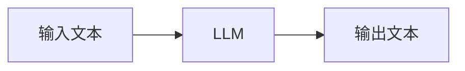
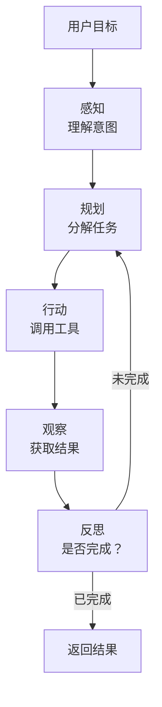
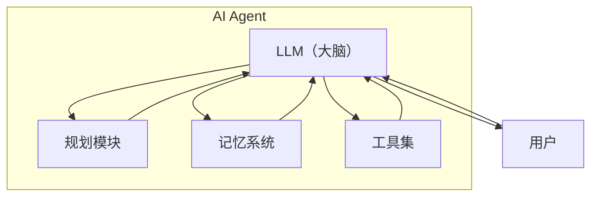
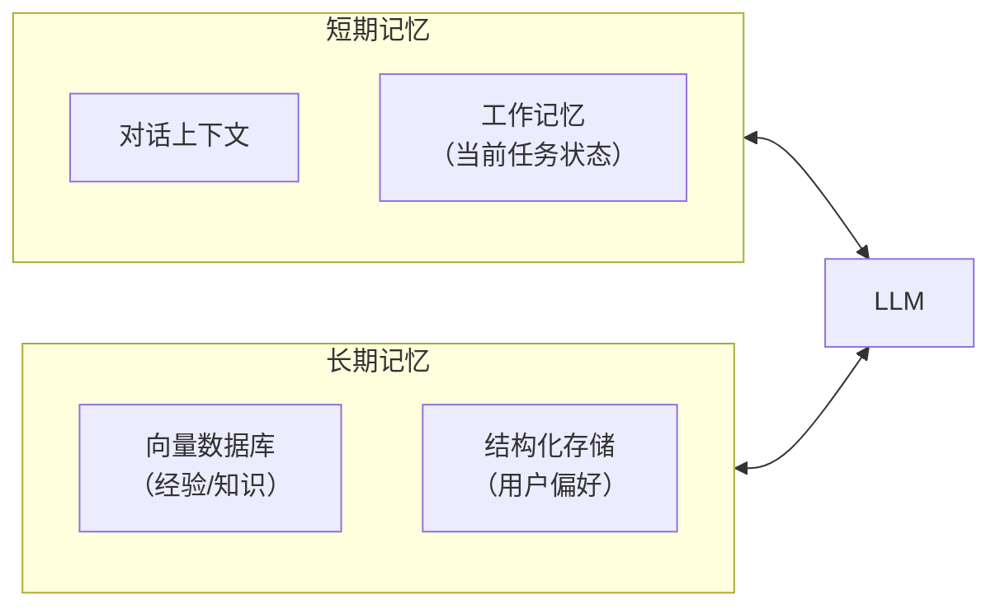
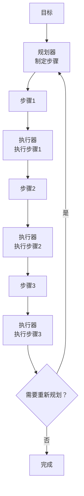
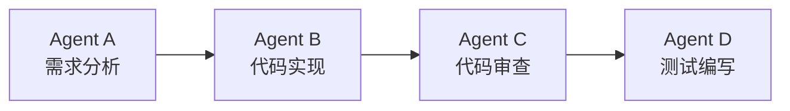
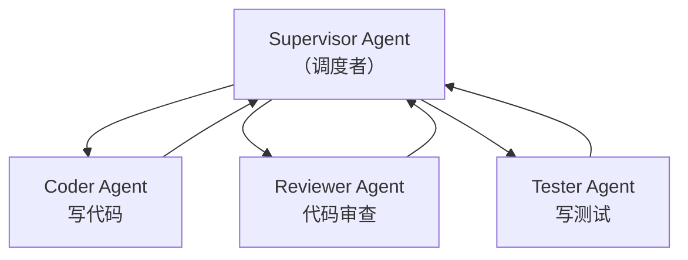
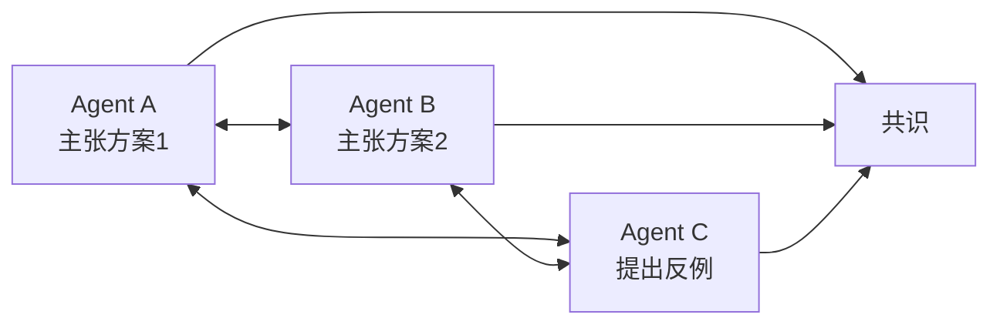
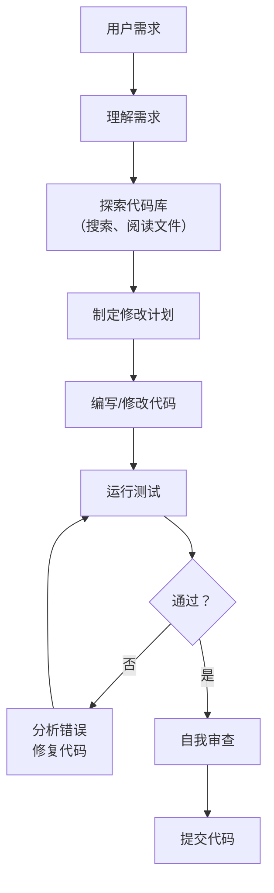
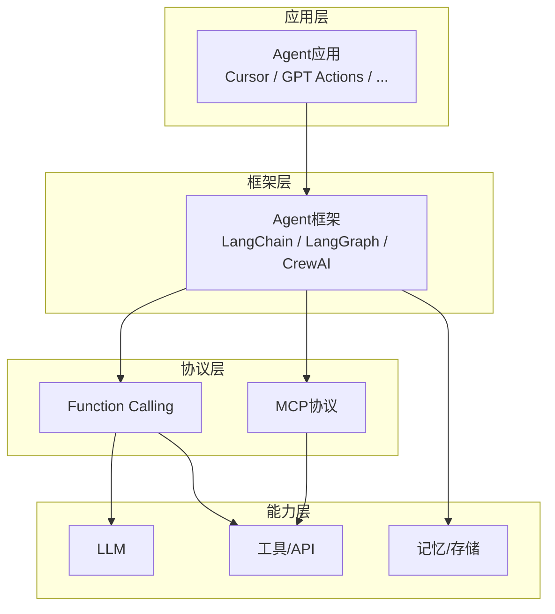

+++
title = "AI Agent"
date = '2026-05-02T22:32:27+08:00'
draft = false
weight = 1
tags = ["AI", "LLM", "面试"]
categories = ["AI", "面试"]
+++
ChatGPT能写文章、能回答问题，但你让它帮你订一张机票，它做不到。它能告诉你"你应该去携程搜一下"，但它没法真的打开网页、输入日期、比价、下单。

**AI Agent（智能体）**就是为了解决这个问题——让LLM不仅能"想"，还能"做"。Agent = LLM + 工具使用 + 自主规划 + 记忆。

## 一、从聊天机器人到智能体

### 1.1 纯LLM的局限

一个纯粹的LLM本质上是一个"无状态的文本生成器"：



它有几个根本性的限制：

| 限制 | 表现 |
|------|------|
| 无法执行动作 | 不能调API、不能操作文件、不能访问数据库 |
| 无持久记忆 | 每次对话结束后就"忘了" |
| 知识过时 | 无法获取训练数据之后的信息 |
| 无法自主规划 | 不能将复杂任务分解并逐步执行 |
| 单轮思考 | 一次生成就结束，不能自我检查和修正 |

### 1.2 Agent的定义

AI Agent是一个以LLM为"大脑"的自主系统，能够：

1. **感知**：理解用户的意图和当前环境状态
2. **规划**：将复杂目标分解为可执行的步骤
3. **行动**：调用外部工具完成具体操作
4. **观察**：获取行动的结果
5. **反思**：根据结果调整策略



## 二、Agent的核心组件

### 2.1 架构总览



### 2.2 LLM：Agent的大脑

LLM负责理解、推理和决策。作为Agent大脑的LLM需要具备：

- **指令遵循能力**：准确理解并执行复杂指令
- **推理能力**：能够进行多步逻辑推理
- **工具使用能力**：知道何时该调用什么工具
- **结构化输出**：能以特定格式（如JSON）输出工具调用参数

并非所有LLM都适合做Agent。目前在Agent场景中表现较好的模型包括GPT-4系列、Claude系列、Gemini系列等。

### 2.3 工具（Tools）

工具是Agent与外部世界交互的接口。每个工具通常定义为：

```json
{
  "name": "search_web",
  "description": "搜索互联网获取最新信息",
  "parameters": {
    "type": "object",
    "properties": {
      "query": {
        "type": "string",
        "description": "搜索关键词"
      }
    },
    "required": ["query"]
  }
}
```

常见的工具类型：

| 类型 | 示例 |
|------|------|
| 信息检索 | 网页搜索、数据库查询、文档检索 |
| 代码执行 | Python解释器、Shell命令 |
| 文件操作 | 读写文件、创建目录 |
| API调用 | 发邮件、创建日历事件、管理项目 |
| 浏览器操作 | 打开网页、点击按钮、填写表单 |

Agent的工作方式：LLM决定要调用哪个工具以及传什么参数 → 系统执行工具调用 → 将结果返回给LLM → LLM根据结果继续推理或调用下一个工具。

### 2.4 记忆系统

Agent需要记忆来维持连贯的行为：

**短期记忆**：当前任务的对话上下文和中间结果。通常就是对话历史本身，受限于LLM的上下文窗口。

**长期记忆**：跨会话持久化的信息。实现方式包括：
- 向量数据库存储过往经验
- 结构化数据库存储用户偏好
- 文件系统存储任务记录



### 2.5 规划模块

面对复杂目标，Agent需要将其分解为可执行的步骤。

**任务分解**：

```
用户目标："帮我调研竞品的启动性能，写一份对比报告"

Agent规划：
1. 确定需要对比的竞品列表
2. 搜索各竞品的公开性能数据
3. 使用Instruments对竞品进行实测
4. 整理数据到表格中
5. 撰写对比分析报告
6. 输出最终文档
```

**规划策略**对比：

| 策略 | 方式 | 优点 | 缺点 |
|------|------|------|------|
| 一次性规划 | 开始时制定完整计划 | 简单直接 | 不能适应执行中的变化 |
| 逐步规划 | 每完成一步再规划下一步 | 灵活 | 可能缺乏全局视角 |
| 动态重规划 | 发现偏差时重新调整计划 | 鲁棒性强 | 可能反复调整 |

## 三、Agent的推理模式

### 3.1 ReAct模式

最经典的Agent推理模式，交替进行**Reasoning（推理）**和**Acting（行动）**：

```
用户：北京到上海的高铁需要多久？最近车票多少钱？

思考(Thought)：我需要查询北京到上海高铁的时刻和票价信息。
行动(Action)：search_web("北京到上海高铁时刻表票价2026")
观察(Observation)：北京南到上海虹桥，G1次，4小时18分，二等座588元...

思考(Thought)：我已经获取到了时刻和票价信息，可以回答用户了。
回答(Answer)：北京到上海的高铁最快约4小时18分，二等座票价588元...
```

### 3.2 Plan-and-Execute模式

先制定完整计划，再逐步执行：



优点是有全局视角，适合多步骤复杂任务。

### 3.3 Reflection模式

Agent完成初始输出后，进行自我反思和改进：

```
第一轮生成 → "这段代码实现了基本功能..."
自我反思   → "等等，我没有处理边界情况，也没有添加错误处理"
第二轮改进 → "补充了nil检查、错误处理和边界情况..."
再次反思   → "现在覆盖了主要场景，可以输出了"
```

这种模式让Agent能够自我纠正，提高输出质量。

## 四、Multi-Agent系统

### 4.1 为什么需要多Agent

就像一个公司不可能只有一个人一样，复杂的任务往往需要多个Agent协作，各自负责不同的专业领域。

### 4.2 协作模式

**顺序管道**：Agent A的输出作为Agent B的输入



**监督者模式**：一个主Agent负责调度，分配子任务给专家Agent



**辩论模式**：多个Agent从不同角度讨论，最终达成共识



### 4.3 主流Multi-Agent框架

| 框架 | 特点 |
|------|------|
| CrewAI | 角色定义清晰，工作流易配置 |
| AutoGen (Microsoft) | 支持灵活的多Agent对话模式 |
| LangGraph | 基于图的Agent编排，状态管理强大 |
| MetaGPT | 模拟软件公司，角色分工明确 |

## 五、Agent的关键挑战

### 5.1 幻觉传播

单次LLM调用的幻觉率可能是5%，但Agent的多步推理中，错误会累积：

```
步骤1（正确率95%）→ 步骤2（95%）→ 步骤3（95%）→ ... → 步骤10
总正确率：0.95^10 ≈ 59.9%
```

10步之后，整体成功率可能只有60%。

应对策略：
- 每步验证：执行后检查结果的合理性
- 自我纠正：发现错误时回退并重试
- 人工介入：关键节点请求人类确认

### 5.2 上下文窗口管理

Agent的对话历史包含所有的推理过程、工具调用和结果，很容易超出上下文窗口：

```
用户问题 → Thought 1 → Action 1 → Observation 1 (可能很长)
         → Thought 2 → Action 2 → Observation 2 (可能很长)
         → ...
         → Thought N → 最终回答
```

管理策略：
- **摘要压缩**：将较早的对话历史压缩为摘要
- **选择性保留**：只保留关键信息，丢弃中间冗余
- **外部化存储**：将详细信息存到外部存储，上下文中只保留索引

### 5.3 成本控制

Agent的每一步推理都消耗Token，多步推理的成本可能是单次调用的数十倍：

| 场景 | 典型LLM调用次数 | Token消耗倍数 |
|------|----------------|-------------|
| 简单问答 | 1次 | 1x |
| RAG问答 | 1~2次 | 2~3x |
| 简单Agent任务 | 3~5次 | 5~10x |
| 复杂Agent任务 | 10~50次 | 20~100x |

优化方向：
- 简单任务不走Agent流程
- 使用更小的模型处理简单子任务
- 缓存常见的工具调用结果
- 设置最大步数限制

### 5.4 安全性

Agent能执行真实操作，安全风险远大于纯聊天机器人：

| 风险 | 示例 |
|------|------|
| 数据泄露 | Agent查询数据库时返回了敏感数据 |
| 误操作 | Agent删错了文件或发送了错误的邮件 |
| 提示注入 | 恶意用户通过Prompt让Agent执行非预期操作 |
| 权限过大 | Agent获得了不必要的系统权限 |

防护措施：
- **最小权限原则**：Agent只获取完成任务必需的最小权限
- **操作确认**：高风险操作需要人类确认
- **沙箱执行**：在隔离环境中执行代码和命令
- **审计日志**：记录Agent的所有操作

## 六、Agent的典型应用场景

### 6.1 编程Agent

最成熟的Agent应用领域之一。典型的编程Agent工作流：



代表产品：Cursor、GitHub Copilot、Windsurf、Devin等。

### 6.2 数据分析Agent

```
用户："分析上个月的用户留存数据，找出流失的主要原因"

Agent：
1. 连接数据库，查询上月用户行为数据
2. 用Python进行数据清洗和分析
3. 生成留存率曲线和流失漏斗图
4. 分析流失用户的共性特征
5. 撰写分析报告并给出建议
```

### 6.3 自动化运维Agent

```
用户："线上告警CPU使用率超过90%，排查一下"

Agent：
1. SSH连接到告警机器
2. 执行top查看高CPU进程
3. 分析进程日志
4. 检查最近部署记录
5. 定位到是某个定时任务导致
6. 给出处理建议（重启 or 回滚 or 优化）
```

## 七、Agent的技术生态

Agent不是孤立存在的，它依赖一系列基础设施：



其中Function Calling和MCP是连接LLM与外部工具的关键协议，我们将在下一篇文章中详细介绍它们的原理和区别。

## 八、总结

AI Agent代表了LLM从"对话工具"到"自主执行系统"的进化。它的核心架构可以概括为：

1. **LLM大脑**：负责理解、推理和决策
2. **工具集**：Agent的"手脚"，执行真实操作
3. **记忆系统**：维持上下文连贯性和长期知识
4. **规划模块**：将复杂目标分解为可执行步骤

Agent的强大之处在于组合——LLM本身无法搜索网页，也无法执行代码，但通过工具调用将这些能力组合起来，就能完成远超LLM单独能力的任务。

然而，Agent仍然面临幻觉累积、成本控制、安全性等挑战。当前Agent更适合作为人类的"助手"而非完全自主的"替代者"——人机协作（Human-in-the-loop）是更务实的路径。
