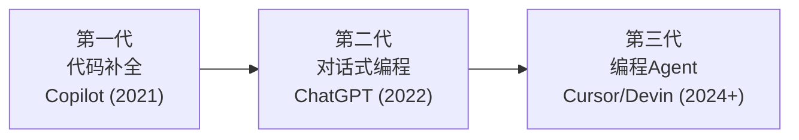
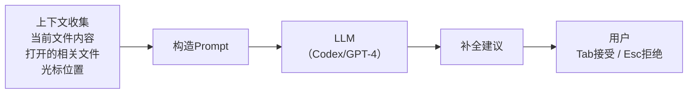
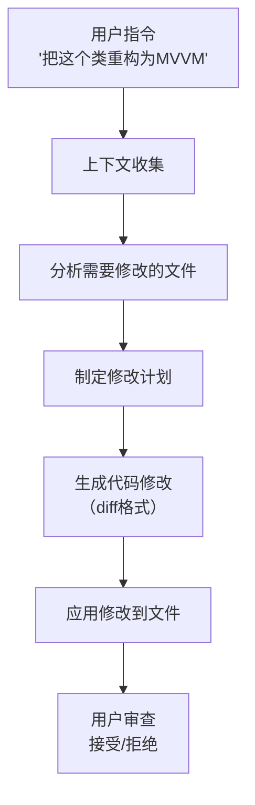
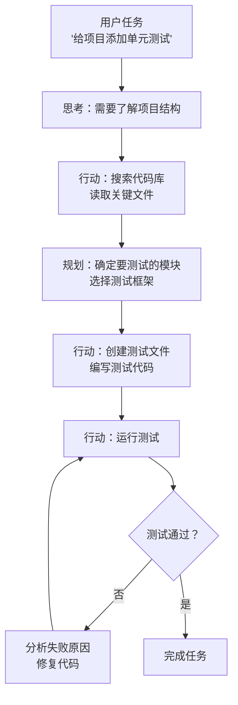
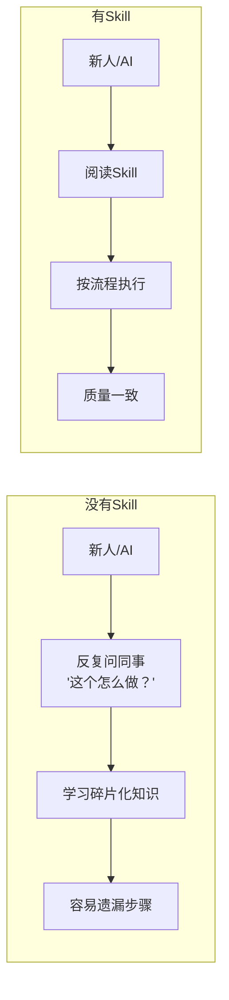
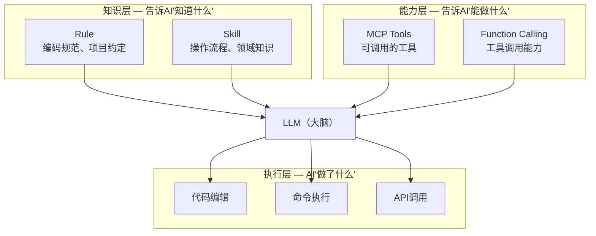
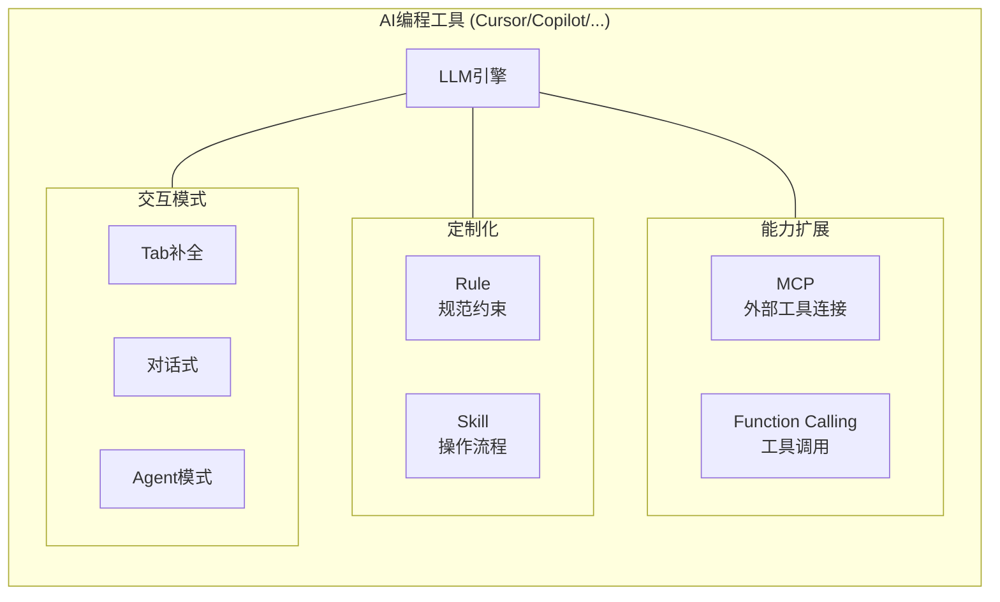

+++
title = "AI编程工具"
date = '2026-05-02T22:32:27+08:00'
draft = false
weight = 2
tags = ["AI", "LLM", "面试"]
categories = ["AI", "面试"]
+++
AI编程工具正在重塑软件开发的工作方式。从简单的代码补全到自主完成复杂任务的编程Agent，这个领域在短短两三年内经历了巨大的变化。本文梳理AI编程工具的核心概念、工作原理和实践方法。

## 一、AI编程工具的演进

### 1.1 三代AI编程工具



| 代际 | 交互方式 | 能力范围 | 代表产品 |
|------|---------|---------|---------|
| 第一代 | 行内补全，按Tab接受 | 单行/单函数级别 | GitHub Copilot |
| 第二代 | 对话框问答 | 代码片段级别 | ChatGPT、Claude |
| 第三代 | Agent模式，自主执行 | 跨文件/跨系统级别 | Cursor、Windsurf、Devin |

### 1.2 当前主流工具对比

| 工具 | 类型 | 核心特点 |
|------|------|---------|
| **GitHub Copilot** | IDE插件 | 最早的AI编程助手，集成在VS Code/JetBrains等主流IDE中 |
| **Cursor** | 独立IDE | 基于VS Code深度定制，Agent模式、多文件编辑 |
| **Windsurf** | 独立IDE | Codeium推出，强调"Flow"模式的流畅体验 |
| **Claude Code** | CLI工具 | 终端中运行的编程Agent，适合命令行工作流 |
| **Devin** | 云端Agent | 全自主编程Agent，自带开发环境 |
| **Amazon Q Developer** | IDE插件 | AWS深度集成，擅长云原生开发 |

## 二、AI编程工具的工作原理

### 2.1 代码补全的原理

代码补全是最基础的能力。以Copilot为例：



上下文收集是关键——模型看到的上下文越好，补全质量越高：

| 上下文来源 | 作用 |
|-----------|------|
| 当前文件光标前后的代码 | 最直接的上下文 |
| 同项目中打开的相关文件 | 理解项目的代码风格和模式 |
| 导入的类型定义 | 理解可用的API |
| 注释和文档字符串 | 理解开发者的意图 |

### 2.2 对话式编程的原理

Cursor的Chat/Composer模式在代码补全之上增加了：



它能理解你的意图，跨多个文件进行修改，并以diff的形式展示变化供你审查。

### 2.3 Agent模式的原理

Agent模式是当前最强大的交互方式。以Cursor的Agent模式为例：



Agent模式的关键能力：
- **代码库探索**：搜索、阅读文件，理解项目结构
- **多文件编辑**：同时修改多个文件
- **命令执行**：运行终端命令（编译、测试、Git操作等）
- **自我修正**：运行出错时分析原因并修复
- **MCP工具调用**：使用MCP Server连接外部服务

## 三、Rules：定制AI的行为准则

### 3.1 什么是Rule

**Rule（规则）**是给AI编程助手设定的持久化指令，让它在项目中始终遵循特定的编码规范、架构约定或工作流程。

不用Rule的问题：每次对话都要重复说"用Swift不要用OC"、"遵循MVVM架构"、"用中文回答"。

用Rule后：这些约束被写入配置文件，自动注入到每次交互中。

### 3.2 Rule的类型

以Cursor为例，Rule分为多个层级：

| 类型 | 作用域 | 存储位置 | 用途 |
|------|--------|---------|------|
| **全局Rule** | 所有项目 | 用户设置 | 通用偏好（语言、风格） |
| **项目Rule** | 当前项目 | `.cursor/rules/` | 项目特定的规范 |

项目Rule可以通过 `.cursor/rules/` 目录下的 `.mdc` 文件定义，支持按文件类型自动激活：

```markdown
---
description: Swift代码规范
globs: ["**/*.swift"]
---

# Swift开发规范

- 使用MVVM架构模式
- 网络请求使用async/await
- UI布局使用SnapKit
- 命名遵循Swift API Design Guidelines
- 每个public方法都要写文档注释
```

当AI在编辑匹配 `**/*.swift` 的文件时，这些规则会自动生效。

### 3.3 Rule的最佳实践

**好的Rule**：
```markdown
# API设计规范
- 所有网络请求返回 Result<T, NetworkError> 类型
- 错误类型统一使用 NetworkError 枚举
- 请求超时设置为30秒
- 必须支持请求取消
```

**差的Rule**：
```markdown
# 规范
- 写好代码（太模糊）
- 不要写bug（废话）
- 用最新的技术（不够具体）
```

编写Rule的原则：
- **具体可执行**：AI能直接按照Rule行动
- **有约束边界**：明确什么该做、什么不该做
- **包含示例**：给出好/坏代码的对比
- **适度精简**：Rule太长会稀释重点

## 四、Skill：可复用的能力模块

### 4.1 什么是Skill

**Skill（技能）**是一种可复用的知识模块，封装了在特定场景下AI应该如何行动的详细指南。

如果说Rule是"你应该遵守的规范"，那Skill是"你应该按这个流程做事"。

### 4.2 Skill vs Rule

| 维度 | Rule | Skill |
|------|------|-------|
| **定位** | 约束和规范 | 操作流程和知识 |
| **触发方式** | 自动生效（全局/按文件类型） | 按需触发（AI判断或手动指定） |
| **内容长度** | 通常较短（几十行） | 通常较长（几百行详细指南） |
| **典型内容** | "用Swift写""遵循MVVM" | "如何创建一个新的网络请求模块"的完整步骤 |
| **复用粒度** | 项目级别 | 可跨项目复用 |

### 4.3 Skill的结构

一个典型的Skill文件（`SKILL.md`）：

```markdown
# iOS组件创建向导

## 触发场景
当用户要求创建新的UI组件、页面模块或功能模块时使用。

## 执行步骤

### 1. 确认需求
- 确认组件的功能定位
- 确认使用的架构模式（MVVM）
- 确认是否需要网络请求

### 2. 创建文件结构
```
ModuleName/
├── View/
│   └── ModuleNameViewController.swift
├── ViewModel/
│   └── ModuleNameViewModel.swift
├── Model/
│   └── ModuleNameModel.swift
└── Service/
    └── ModuleNameService.swift
```

### 3. 文件模板
每个文件的头部使用以下格式：
（提供具体的代码模板...）

### 4. 注册路由
创建完成后，在Router中注册新页面的路由...

### 5. 检查清单
- [ ] 文件命名符合规范
- [ ] ViewModel与View正确绑定
- [ ] 内存管理无循环引用
- [ ] 路由已注册
```

### 4.4 Skill的价值

Skill将团队的"隐性知识"转化为AI可理解、可执行的"显性流程"：



## 五、Rule、Skill、MCP的关系

这三个概念在不同层面增强AI编程助手的能力：



一个具体的例子：

```
你让Cursor："帮我创建一个新的用户信息页面"

1. Rule 告诉AI：
   - 用Swift语言
   - 遵循MVVM架构
   - 用SnapKit做布局

2. Skill 告诉AI：
   - 创建页面的完整流程（哪些文件、什么目录结构）
   - ViewModel与View的绑定方式
   - 创建完成后需要注册路由

3. MCP 让AI能够：
   - 通过GitLab MCP查看相关的设计文档
   - 通过数据库MCP查询已有的字段定义
   
4. AI执行：
   - 按照Skill流程创建文件
   - 文件内容遵循Rule规范
   - 通过MCP获取需要的外部信息
```

## 六、Prompt Engineering在编程工具中的应用

### 6.1 如何高效使用AI编程工具

不同的交互方式适合不同的场景：

| 场景 | 推荐方式 | 原因 |
|------|---------|------|
| 补全当前行/函数 | Tab补全 | 最快，不打断心流 |
| 修改已有代码 | Inline Edit (Cmd+K) | 直接在代码上修改 |
| 实现新功能 | Chat/Agent模式 | 需要理解上下文和多文件编辑 |
| 跨文件重构 | Agent模式 | 需要探索代码库和多文件协调 |
| 调试错误 | 选中报错 + Chat | 需要分析上下文 |

### 6.2 给AI编程工具的好指令

**差的指令**：
```
帮我写个网络请求
```

**好的指令**：
```
在NetworkService中添加一个获取用户信息的方法：
- 使用 GET /api/v1/users/{id} 接口
- 返回类型 Result<UserInfo, NetworkError>
- 使用async/await
- 参考项目中已有的 fetchOrders 方法的风格
```

关键原则：
- **提供参考**：指向项目中已有的类似代码
- **明确约束**：API路径、返回类型、错误处理方式
- **说明上下文**：在哪个文件、哪个类中操作
- **分步骤**：复杂任务拆成多个步骤执行

### 6.3 使用@引用提供精确上下文

大多数AI编程工具支持 `@` 符号引用文件、文件夹或符号：

```
参考 @NetworkService.swift 的请求风格，
在 @UserModule/ 目录下创建用户信息获取功能。
数据模型参考 @UserInfo 结构体的定义。
```

直接引用比描述更精确，减少AI理解偏差。

## 七、AI编程工具的局限与应对

### 7.1 当前的局限

| 局限 | 表现 | 应对策略 |
|------|------|---------|
| 上下文有限 | 大型项目无法完整理解 | 手动提供关键上下文，使用@引用 |
| 幻觉 | 编造不存在的API | 审查生成的代码，运行测试验证 |
| 过时知识 | 使用已废弃的API | Rule中注明当前使用的SDK版本 |
| 架构理解不足 | 打破项目的架构约定 | 通过Rule/Skill固化架构规范 |
| 复杂逻辑错误 | 在边界情况上出错 | 人工审查关键逻辑，补充单元测试 |

### 7.2 有效的人机协作模式

AI编程工具最大的价值不在于"替代程序员"，而在于改变工作的分配方式：

```
传统方式：
  人类：思考设计 → 编写代码 → 调试测试 → 审查优化
  
AI辅助方式：
  人类：思考设计 → [AI:编写代码] → [AI:初步调试] → 人类:审查+优化
       ↑                                              |
       └──────────── 人类始终把控方向 ──────────────────┘
```

**人类负责**：架构决策、需求理解、代码审查、质量把关
**AI负责**：代码生成、重复劳动、搜索探索、初步调试

## 八、总结

AI编程工具的核心概念关系：



| 概念 | 一句话总结 |
|------|----------|
| **Rule** | 给AI设定项目级别的持久规范 |
| **Skill** | 给AI提供可复用的操作流程和领域知识 |
| **MCP** | 让AI通过标准协议连接外部工具 |
| **Function Calling** | 让LLM能够决策和调用工具 |
| **Agent模式** | AI自主规划+执行+反思的完整工作流 |

这些概念共同构成了当代AI编程工具的技术栈。理解它们的原理和关系，能帮助你更高效地利用AI工具，同时也能更清醒地认识到它的边界——AI是强大的助手，但架构设计的判断力和代码质量的最终把关，仍然依赖于工程师自己。
