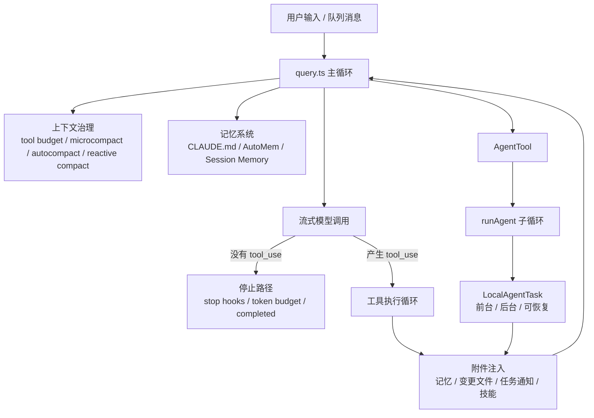
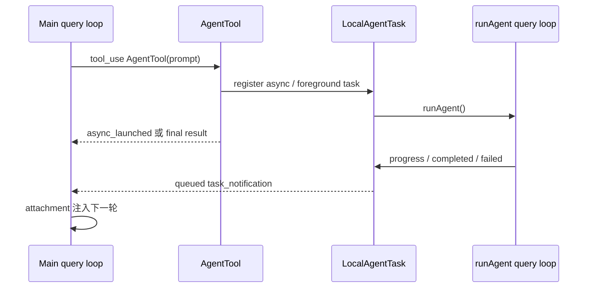

+++
title = "Claude Code 源码导读：Agent 设计详解"
date = '2026-06-21T22:41:52+08:00'
draft = false
weight = 3
tags = ["AI", "LLM", "面试"]
categories = ["AI", "面试"]
+++
> Claude Code 的 agent 到底是怎么被设计成一个能长时间工作、能分派子 agent、能记忆、能压缩上下文、也能可靠停下来的系统的？

Claude Code 最值得研究的地方，不是它“能调用工具”，而是它把模型、工具、记忆、上下文、后台任务、hook 和权限系统编成了一个稳定的 **agent harness**。

一句话概括：Claude Code 的 agent 不是一个模型循环，而是三层循环叠在一起：主 `query` 循环负责推理和工具回灌；工具循环负责受控执行和并发；任务循环负责子 agent、后台 agent、记忆整理和长任务生命周期。



## 一、核心源码地图

先把关键文件放在桌面上：

| 模块 | 关键源码 | 作用 |
|---|---|---|
| 主循环 | `src/query.ts` | agent turn 的 `while(true)` 状态机 |
| 停止 hook | `src/query/stopHooks.ts` | 模型自然停下后的收尾、记忆提取、用户 hook |
| token budget | `src/query/tokenBudget.ts` | 长输出任务的自动续写预算控制 |
| 工具编排 | `src/services/tools/toolOrchestration.ts` | 工具批处理、并发安全分组 |
| 流式工具 | `src/services/tools/StreamingToolExecutor.ts` | 模型边生成工具调用，系统边执行 |
| 单工具执行 | `src/services/tools/toolExecution.ts` | Zod 校验、权限、hooks、调用、结果映射 |
| 子 agent 工具 | `src/tools/AgentTool/AgentTool.tsx` | 创建同步、后台、fork、隔离 worktree agent |
| 子 agent 运行 | `src/tools/AgentTool/runAgent.ts` | 子 agent 如何复用主循环 |
| 后台任务 | `src/tasks/LocalAgentTask/LocalAgentTask.tsx` | agent 的前台/后台状态、进度、通知和终止 |
| CLAUDE.md | `src/utils/claudemd.ts` | 层级指令记忆加载 |
| 自动记忆 | `src/memdir/*`、`src/utils/attachments.ts` | 长期文件记忆、相关记忆召回 |
| 记忆提取 | `src/services/extractMemories/*` | turn 结束后 fork agent 写长期记忆 |
| 会话记忆 | `src/services/SessionMemory/*` | 当前会话 summary，用于后续 compact |
| agent 记忆 | `src/tools/AgentTool/agentMemory.ts` | 每类 subagent 自己的记忆目录 |

这些文件共同说明：Claude Code 的 agent 不是“一个 ReAct loop 加一堆工具”，而是一套多执行体运行时。

## 二、主 Agent 循环：`query.ts`

`src/query.ts` 是 Claude Code 的心脏。它暴露的 `query()` 是一个 `AsyncGenerator`，真正工作发生在内部的 `queryLoop()`。源码在 `src/query.ts:204` 定义了跨轮次状态：

- `messages`：当前模型可见历史。
- `toolUseContext`：工具、权限、abort、MCP、app state、agent id 等运行时上下文。
- `autoCompactTracking`：自动压缩状态。
- `maxOutputTokensRecoveryCount`：输出 token 超限后的恢复次数。
- `hasAttemptedReactiveCompact`：是否已经尝试过应急 compact，防止死循环。
- `pendingToolUseSummary`：上一轮工具结果摘要的后台 promise。
- `stopHookActive`：stop hook 是否正在阻塞模型继续。
- `turnCount`：工具回灌轮数。
- `transition`：上一轮为什么 `continue`，测试和恢复逻辑会用到。

主循环可以抽象成：

```typescript
while (true) {
  // 1. 每一轮都重新构造“本次可发送给模型的上下文”：
  //    包括 compact 边界、工具结果预算、microcompact、autocompact、
  //    system context、相关记忆、任务通知等。
  messagesForQuery = prepareContext(messages)

  // 2. 发起一次流式模型调用。这里不只是拿文本输出，
  //    还会边接收边识别 tool_use block，并可能提前启动工具执行。
  assistantMessages = streamModel(messagesForQuery)

  // 3. 如果这一轮 assistant 没有产生任何 tool_use，
  //    主 agent 进入“自然停止 / 收尾”路径。
  if (modelDidNotRequestTools) {
    // 3.1 处理 prompt_too_long、max_output_tokens 等可恢复错误。
    //     能 compact 或续写就继续，不能恢复才真正结束。
    recoverPromptOrOutputErrorsIfNeeded()

    // 3.2 模型停下后并不立刻返回用户。
    //     这里会跑 stop hooks、post-sampling hooks、记忆提取、
    //     prompt suggestion、后台验证等收尾逻辑。
    runStopHooks()

    // 3.3 长输出任务可能还没写完。
    //     token budget 允许时，系统会注入续写提示，让模型继续输出。
    maybeContinueForTokenBudget()

    // 3.4 只有没有工具、没有 hook 阻塞、没有预算续写、
    //     没有可恢复错误时，这个 agent turn 才算真正完成。
    return completed
  }

  // 4. 如果 assistant 产生了 tool_use，必须为每个 tool_use
  //    补回对应 tool_result，否则下一次 API 请求在协议上不完整。
  //    读工具可并发，写工具和不安全工具会串行。
  toolResults = runToolsOrStreamingExecutor()

  // 5. 工具跑完后，系统会收集本轮产生的运行时附件：
  //    相关记忆、任务完成通知、后台 agent 消息、技能发现结果、
  //    文件变更摘要等。这些会作为下一轮模型输入。
  attachments = collectRuntimeAttachments()

  // 6. 中断、hook stop、maxTurns 等是硬停止条件。
  //    命中后不再把工具结果喂回模型继续推理。
  if (aborted || hookStopped || maxTurnsReached) return

  // 7. 把“本轮上下文 + assistant 工具调用 + 工具结果 + 附件”
  //    拼成新的 messages，进入下一轮。
  //    这就是 ReAct 式 agent 能持续工作的核心闭环。
  messages = messagesForQuery + assistantMessages + toolResults + attachments

  // 8. turnCount 不是用户对话轮数，而是工具回灌轮数。
  //    它用于 maxTurns、测试、恢复和长任务控制。
  turnCount += 1
}
```

真正关键的是：**Claude Code 不信任 API 的 `stop_reason === "tool_use"`。**

在 `src/query.ts:558` 初始化 `needsFollowUp = false`，只有当流里真的出现 `tool_use` block 时，才在 `src/query.ts:834` 把 `needsFollowUp` 置为 `true`。所以主循环是否继续，不由 stop reason 决定，而由“这轮 assistant 消息里有没有工具调用”决定。

这个小设计很重要。LLM API 的 stop reason 是供应商协议字段，可能变化、缺失或和内容不一致；而 `tool_use` block 是下一轮必须补齐 `tool_result` 的协议事实。Claude Code 把 agent 的控制流建立在协议事实上，而不是提示性字段上。

## 三、每轮开始前：上下文先被治理

每轮模型调用前，Claude Code 都会重建一次可发送上下文。粗略顺序是：

```text
getMessagesAfterCompactBoundary
  -> applyToolResultBudget
  -> snipCompactIfNeeded
  -> microcompact
  -> contextCollapse
  -> autocompact
  -> appendSystemContext
```

这意味着上下文治理不是“满了再总结一下”，而是每轮都在做多级预算控制：

- `applyToolResultBudget`：先控制大工具结果，避免一次 `Read` 或 `Bash` 输出吃掉上下文。
- `snip`：裁掉历史里标记为可裁剪的片段。
- `microcompact`：把过长工具结果局部压缩。
- `contextCollapse`：在不完全 summarize 的情况下折叠旧上下文。
- `autocompact`：接近窗口上限时生成完整 summary。
- `reactiveCompact`：已经收到 prompt too long 或媒体过大错误时，做应急 compact 后重试。

这里的设计取向很明确：**能局部裁剪就不全局总结，能保留细粒度上下文就不压成单条摘要。**

Claude Code 还会在每个 user turn 开始时启动相关记忆预取。`src/query.ts:301` 调用 `startRelevantMemoryPrefetch()`，实现位于 `src/utils/attachments.ts:2361`。它用子 abort controller 挂在当前 turn 上，模型流式输出和工具执行时，记忆检索可以在后台跑；轮末如果已经完成，就把相关记忆作为 attachment 塞进下一轮。

## 四、工具循环：工具不是函数，而是受控执行单元

Claude Code 的工具模型不是：

```typescript
type Tool = (input: unknown) => Promise<string>
```

而是一个带运行时语义的对象。`ToolUseContext` 在 `src/Tool.ts:158` 里定义，里面包含当前工具集合、主模型、thinking 配置、MCP 客户端、agent 定义、abort controller、文件读取缓存、app state、agent id、动态技能状态等。

单个工具的执行入口是 `runToolUse()`，在 `src/services/tools/toolExecution.ts:337`。它做的事情包括：

1. 找工具，支持 alias fallback。
2. 用 Zod schema 校验模型参数。
3. 调用工具自己的 `validateInput` 做语义校验。
4. 执行 `PreToolUse` hooks，hook 可以改参数、拒绝权限、阻止后续轮次。
5. 合并 hook 和系统权限决策。
6. 真正调用 `tool.call()`。
7. 执行 `PostToolUse` 或 failure hooks。
8. 把结果映射成协议内的 `tool_result`。

关键点是：**拒绝、报错、中断也都被包装成 `tool_result`。**

只要 assistant 发出了 `tool_use`，下一轮协议就需要相应的 `tool_result`。Claude Code 尽量不让“工具失败”变成“消息协议坏掉”。这也是它能长时间运行的基础。

### 并发策略

工具并发不是模型说了算，而是工具语义说了算。

`runTools()` 位于 `src/services/tools/toolOrchestration.ts:19`。它会用 `partitionToolCalls()` 把工具调用分成两类：

- 连续的并发安全工具合成一批，比如 `Grep`、`Read`。
- 非并发安全工具单独成批，比如写文件、可能有副作用的 Bash。

默认并发上限是 `CLAUDE_CODE_MAX_TOOL_USE_CONCURRENCY`，没配置时是 10。

更进一步，`StreamingToolExecutor` 在 `src/services/tools/StreamingToolExecutor.ts:40`。它允许模型一边流式输出工具调用，系统一边启动已经完整解析出来的工具。这样模型还在生成第二个 `tool_use` 的时候，第一个 `Read` 或 `Grep` 可能已经在跑了。

它还有两个很实用的保护：

- 非并发安全工具会阻塞后续队列，避免写操作乱序。
- Bash 出错时会 abort sibling subprocesses，避免一批并发 shell 命令在错误前提下继续跑。

## 五、子 Agent：`AgentTool` 不是简单 fork

Claude Code 的多 agent 能力集中在 `src/tools/AgentTool/AgentTool.tsx`。`AgentTool` 从 `src/tools/AgentTool/AgentTool.tsx:196` 开始定义，它的输入不只是 `prompt`，还包括：

- `subagent_type`：选择具体 agent 定义。
- `model`：覆盖模型。
- `run_in_background`：是否后台运行。
- `name` / `team_name`：用于 teammate 和 SendMessage 路由。
- `isolation`：worktree 或 remote 隔离。
- `cwd`：特定工作目录。

Claude Code 的子 agent 有两条路径。

### 1. 普通 subagent

普通 subagent 会选择一个 agent definition，构造自己的 system prompt、工具集合、权限模式和 MCP server。内置 agent 包括通用 agent、`Explore`、`Plan` 等；自定义 agent 可以从用户、项目、插件等目录加载。

`runAgent()` 在 `src/tools/AgentTool/runAgent.ts:248`，它最终仍然调用主 `query()`。这说明子 agent 不是另一套运行时，而是：

> 用新的 system prompt、工具面、权限模式、记忆范围和 transcript，重新跑一份 query loop。

子 agent 会有自己的：

- `agentId` 和 transcript。
- `readFileState`，普通 subagent 默认是新缓存。
- permission mode，除非父会话已经是 bypass/acceptEdits/auto。
- MCP server 增量初始化和清理。
- hooks frontmatter 注册。
- skills 预加载。
- `maxTurns` 限制。

### 2. Fork subagent

fork 路径更有意思。`AgentTool` 会把父会话上下文作为 `forkContextMessages` 传给子 agent，`runAgent.ts:370` 会过滤掉不完整的工具调用，再拼上新的 prompt。

fork 模式还会设置 `useExactTools: true`。对应逻辑在 `src/tools/AgentTool/runAgent.ts:500` 之后：fork 子 agent 尽量继承父会话的工具、thinking 配置和非交互配置，使 API 请求前缀尽可能和父会话一致，从而命中 prompt cache。

这说明 fork subagent 的目标不是“开一个干净的新助手”，而是：

> 在不污染主上下文的情况下，让另一个执行体沿用主 agent 已经积累的上下文和 cache。

这也是 Claude Code 长任务能力里的一个核心取舍：复杂理解仍在主上下文里发生，探索、验证、总结等可拆分任务交给 fork 或 subagent。

## 六、前台、后台与可恢复任务

`AgentTool` 在 `src/tools/AgentTool/AgentTool.tsx:567` 计算 `shouldRunAsync`。一个 agent 会进入后台的条件包括：

- 用户显式传 `run_in_background`。
- agent definition 标记 `background`。
- coordinator mode。
- fork subagent 强制异步。
- assistant/Kairos/proactive 场景。
- 后台任务功能未被禁用。

后台 agent 通过 `registerAsyncAgent()` 注册，源码在 `src/tasks/LocalAgentTask/LocalAgentTask.tsx:466`。它有一个重要设计：**后台 agent 的 abort controller 不和父 turn 绑定**。用户按 ESC 中断主会话，不会顺手杀掉后台 agent；后台 agent 要通过显式 kill 路径终止。

前台 agent 也会被注册成 foreground task，入口是 `registerAgentForeground()`，在 `src/tasks/LocalAgentTask/LocalAgentTask.tsx:526`。它可以在运行中被 background，`backgroundAgentTask()` 位于 `src/tasks/LocalAgentTask/LocalAgentTask.tsx:620`。

所以 Claude Code 对 agent 的理解不是“函数调用返回一个字符串”，而是“一个有状态任务”：

| 状态 | 含义 |
|---|---|
| running | 正在执行 |
| completed | 正常完成 |
| failed | 执行失败 |
| killed | 被用户或系统终止 |
| backgrounded | 从当前 turn 脱离，之后用通知回到主会话 |

后台 agent 完成后，会把结果包装成 `<task_notification>` 之类的 queued command。主 `query` 循环下一轮收集 attachments 时，这个通知就重新进入主 agent 的上下文。

这就是 Claude Code 多 agent 的闭环：



## 七、记忆系统：Claude Code 有多种“记忆”

Claude Code 源码里“memory”不是一个东西，而是一组不同生命周期的机制。

### 1. `CLAUDE.md`：稳定指令记忆

`src/utils/claudemd.ts` 顶部注释写清了加载层级：

1. Managed：`/etc/claude-code/CLAUDE.md`，组织级全局指令。
2. User：`~/.claude/CLAUDE.md`，用户全局指令。
3. Project：`CLAUDE.md`、`.claude/CLAUDE.md`、`.claude/rules/*.md`，项目规则。
4. Local：`CLAUDE.local.md`，本地私有规则。

`getMemoryFiles()` 在 `src/utils/claudemd.ts:790`。它会从当前目录向上遍历，加载项目和本地规则，也支持 `@include` 和带 `paths` frontmatter 的条件规则。

这类记忆更像“系统规范”：项目怎么构建、测试怎么跑、代码风格是什么。它会进入 user context，不应该被普通 compact 吃掉。

### 2. Nested memory：按文件触发的规则

当模型读某个文件、用户 at 某个路径，Claude Code 会根据目标路径加载更深层目录里的 `CLAUDE.md` 和 `.claude/rules/*.md`。这让大型仓库可以拥有局部规则：比如 `ios/`、`server/`、`docs/` 各自有不同约定。

为了避免重复注入，`loadedNestedMemoryPaths` 和 `readFileState` 会记录已经加载过的规则。若规则内容被截断或处理过，还会标记为 partial view，避免模型在没有显式 `Read` 的情况下误以为看到了完整文件。

### 3. Auto Memory：长期文件记忆

Auto Memory 由 `src/memdir/*` 管。是否启用由 `isAutoMemoryEnabled()` 判断，位于 `src/memdir/paths.ts:30`。入口 prompt 由 `loadMemoryPrompt()` 构造，位于 `src/memdir/memdir.ts:419`。

它的本质是一个项目级 memory directory：

- `MEMORY.md` 是索引入口。
- 其它 `.md` 文件按主题保存长期事实。
- 记忆被要求分类型，比如偏好、项目知识、工作流、决策等。
- 写入通过普通 `Read` / `Edit` / `Write` 工具完成，但权限被限制在 memory dir 内。

相关记忆召回由 `findRelevantMemories()` 完成，源码在 `src/memdir/findRelevantMemories.ts:39`。它先扫描 memory 文件 frontmatter 和摘要，再用一个 side query 选出少量相关文件。`startRelevantMemoryPrefetch()` 则把这件事挪到主循环后台做，避免阻塞模型流式输出。

### 4. turn 结束后的记忆提取

模型可能没有主动写记忆，所以 Claude Code 在 stop hooks 里安排了后台提取。入口是 `initExtractMemories()`，位于 `src/services/extractMemories/extractMemories.ts:296`。

它有几个防死循环设计：

- 用 `lastMemoryMessageUuid` 作为 cursor，只处理上次之后的新消息。
- 如果主 agent 本轮已经写过 memory 文件，就跳过 fork 提取。
- 如果已有提取在跑，只保留一个 trailing context，避免并发写记忆。
- 记忆提取 agent 使用 `runForkedAgent()`，并设置 `maxTurns: 5`，见 `src/services/extractMemories/extractMemories.ts:415` 和 `src/services/extractMemories/extractMemories.ts:426`。

这说明 Claude Code 把记忆提取当成“后台维护任务”，而不是主 agent 的硬性同步步骤。

### 5. Session Memory：当前会话摘要

Session Memory 和 Auto Memory 不是一回事。

Auto Memory 是长期项目记忆；Session Memory 是当前对话的滚动摘要，用于 compact 后恢复上下文。提取函数 `extractSessionMemory` 在 `src/services/SessionMemory/sessionMemory.ts:272`，它作为 post-sampling hook 注册，只在主 REPL 线程跑。

`trySessionMemoryCompaction()` 在 `src/services/compact/sessionMemoryCompact.ts:514`。当 autocompact 触发时，系统会优先尝试用 session memory 生成 compact 结果：

- 等待正在进行的 session memory 提取结束。
- 读取 summary 文件。
- 找到 `lastSummarizedMessageId`。
- 保留摘要之后的尾部消息。
- 调整边界，避免切断 `tool_use` / `tool_result` 对。
- 如果 compact 后仍超过阈值，则回退到 legacy compact。

这个设计解决的是“长会话压缩后丢失局部目标”的问题。普通 summary 只在压缩时生成；Session Memory 在对话过程中持续更新，压缩时可以拿到更稳定的工作日志。

### 6. Agent Memory：每类子 agent 的私有记忆

自定义 agent 可以声明：

```yaml
memory: user | project | local
```

加载 prompt 的逻辑在 `src/tools/AgentTool/agentMemory.ts:138`。如果 agent 启用了 memory，`loadAgentsDir.ts` 会把相关说明拼到该 agent 的 system prompt 中，并在工具 allowlist 存在时注入 `Read` / `Edit` / `Write` 能力。

这让某些专业 agent 可以积累自己的工作经验。例如 review agent 可以记住项目常见风险，release agent 可以记住发版流程，而不必把这些都塞进主 agent 的全局记忆。

### 7. AutoDream：长期记忆整理

`src/services/autoDream/autoDream.ts` 负责更慢、更重的记忆整理。它不是每轮都跑，而是受时间、session 数、锁文件和配置共同控制。触发后同样通过 fork agent 读历史和 memory dir，做合并、清理、索引更新。

可以把它理解成“记忆系统的垃圾回收和知识整理”。

## 八、长任务为什么能持续跑

Claude Code 的长任务能力来自几个设计叠加。

### 1. 工具调用天然形成多轮循环

只要 assistant 产生 `tool_use`，主循环就必须执行工具，把 `tool_result` 加回消息，再继续下一轮。这是最基础的长任务循环。

```text
assistant(tool_use: Read)
  -> user(tool_result)
  -> assistant(tool_use: Edit)
  -> user(tool_result)
  -> assistant(tool_use: Bash)
  -> user(tool_result)
  -> ...
```

### 2. attachments 让运行时状态回到模型

每轮工具结束后，Claude Code 会收集很多 attachment：

- 队列命令和后台任务通知。
- 文件变更提醒。
- 日期变化提醒。
- nested memory。
- relevant memory。
- skill discovery。
- todo / plan / auto mode reminder。
- agent pending messages。

这让模型不需要“猜”运行时发生了什么。后台 agent 完成、文件被改、记忆召回、技能可用，都会被结构化地放回下一轮上下文。

### 3. 子 agent 可以把长任务拆出去

后台 subagent 不占用主 turn。它们以 LocalAgentTask 的形式运行，完成后再把摘要通知主 agent。主 agent 可以继续和用户交互，也可以等待或读取后台 agent 的输出文件。

### 4. compact 让上下文不会无限增长

上下文治理管线、Auto Memory、Session Memory 和 autocompact 共同保证：长任务不是靠无限上下文，而是靠“该裁剪的裁剪，该总结的总结，该持久化的持久化”。

## 九、长任务如何停下

更难的问题是：如果 agent 可以一直工具调用、一直压缩、一直恢复，它怎么停？

Claude Code 的停止条件是多层的。

### 1. 自然停止：没有 `tool_use`

最常见路径在 `src/query.ts:1062`：如果 `!needsFollowUp`，说明这一轮模型没有要求工具。系统进入停止路径：

1. 处理 prompt too long / media size / max output tokens 等可恢复错误。
2. 如果是 API error，跳过 stop hooks，直接结束。
3. 执行 `handleStopHooks()`，见 `src/query.ts:1267`。
4. 检查 token budget，必要时注入隐藏续写消息。
5. 返回 `{ reason: "completed" }`。

自然停止不是“模型说 done 就完了”。它仍然要经过 hook、记忆提取、清理和预算检查。

### 2. `maxTurns` 硬上限

工具循环每完成一轮，`turnCount + 1`。如果超过 `maxTurns`，`src/query.ts:1705` 会 yield 一个 `max_turns_reached` attachment，然后返回 `{ reason: "max_turns" }`。

子 agent、记忆提取 agent、compact agent 都可以设置自己的 `maxTurns`。例如记忆提取 agent 明确设置 `maxTurns: 5`，避免为了整理记忆陷入长时间探索。

### 3. 用户中断

用户中断分两种：

- streaming 阶段中断：补齐缺失的 `tool_result`，返回 `aborted_streaming`。
- tool 执行阶段中断：消耗或合成剩余工具结果，返回 `aborted_tools`。

补齐 `tool_result` 是关键。否则下一次 API 请求会看到 assistant 有 `tool_use` 但没有对应结果，协议就坏了。

### 4. hook 阻止

Stop hook 可以返回两类结果：

- `preventContinuation`：直接返回 `stop_hook_prevented`。
- `blockingErrors`：把错误作为 hidden/meta user message 加进上下文，让模型再修一轮。

PreToolUse hook 也能阻止继续。如果工具前 hook 返回 `preventContinuation`，主循环会生成 `hook_stopped_continuation` attachment，之后返回 `hook_stopped`。

这给了用户和组织策略一个很强的控制点：不是只能 allow/deny 单个工具，还能决定 agent 是否应该继续。

### 5. prompt too long 恢复失败

如果模型请求因为 prompt too long 或媒体过大失败，Claude Code 会先尝试 context collapse drain，再尝试 reactive compact。`hasAttemptedReactiveCompact` 防止同一错误反复 compact 形成死循环。

恢复失败时返回 `prompt_too_long` 或 `image_error`。源码注释特意说明：这种情况下不要跑 stop hooks，否则可能形成“错误 -> hook blocking -> retry -> 错误”的死亡循环。

### 6. `max_output_tokens` 恢复次数耗尽

`MAX_OUTPUT_TOKENS_RECOVERY_LIMIT = 3`，定义在 `src/query.ts:164`。如果输出被截断，Claude Code 先可能提升输出上限；仍然失败时，最多注入 3 次隐藏恢复消息：

```text
Output token limit hit. Resume directly ...
```

3 次之后才把错误暴露出来。

### 7. token budget 到顶或边际收益太低

`checkTokenBudget()` 在 `src/query/tokenBudget.ts:45`。它用于一种更长输出预算模式：如果当前 turn 还没用到预算的 90%，系统可以注入隐藏 nudge 让模型继续；但如果连续续写后 token 增量过低，会判定边际收益太低而停止。

这是一种很工程化的停止条件：不是只看“有没有达到预算”，也看“继续还有没有产出”。

### 8. 后台任务终止

后台 agent 的停止不直接等同于主循环停止。它有自己的 task status：

- `completed`：完成并通知主会话。
- `failed`：失败并通知。
- `killed`：用户或系统显式杀掉。

主循环通过 queued command / attachment 得知这些状态，再决定是否继续推理。

## 十、Claude Code Agent 设计的核心取舍

读完这些源码，可以看到 Claude Code 的 agent 设计有几个非常稳定的取舍。

### 1. 控制流尽量建立在协议事实上

是否继续看 `tool_use` block，而不是看 `stop_reason`。工具失败也转成 `tool_result`，而不是抛到协议外。中断时也要补齐缺失结果。这样主循环长期运行时不容易因为半条消息坏掉。

### 2. 动态状态用 attachments，不轻易改 system prompt

任务通知、记忆召回、日期变化、文件变更、skill discovery 都倾向于作为 attachment 注入，而不是频繁重写 system prompt。这样既能保留 prompt cache，也让动态信息有明确生命周期。

### 3. 子 agent 复用主循环，而不是另写一套 runtime

`runAgent()` 最终还是调用 `query()`。多 agent 的差异主要通过 system prompt、工具、权限、记忆、上下文和 transcript 参数化。这样子 agent 能继承主循环的 compact、停止、工具协议和错误恢复能力。

### 4. 记忆分层，而不是单一向量库

Claude Code 没把所有记忆都塞进一个检索系统：

- `CLAUDE.md` 存稳定规则。
- nested memory 存路径局部规则。
- Auto Memory 存长期项目经验。
- Session Memory 存当前会话滚动摘要。
- Agent Memory 存某类子 agent 的专业记忆。
- AutoDream 做长期整理。

这套设计牺牲了一点概念简单性，但换来更清晰的生命周期和权限边界。

### 5. 长任务靠“循环 + 上限 + 恢复 + 压缩”共同成立

Claude Code 并不是让模型自由地一直跑。它允许长任务继续，是因为每个继续路径都有对应的停止阀：

| 继续机制 | 停止阀 |
|---|---|
| tool_use 循环 | 无工具调用、`maxTurns`、abort |
| stop hook blocking | `preventContinuation`、prompt too long guard |
| max output recovery | 最多 3 次 |
| token budget continuation | 90% 阈值、边际收益检测 |
| autocompact | 连续失败熔断、reactive compact guard |
| 后台 agent | completed / failed / killed |
| 记忆提取 | mutex、cursor、`maxTurns: 5` |

这就是它不像普通聊天机器人那样“一次回答完”，也不像失控 agent 那样无限自旋的原因。

## 结语

Claude Code 的 agent 设计真正有价值的地方，是它没有把“智能”全部寄托在模型 prompt 上。模型负责判断下一步做什么，但运行时负责保证：

- 工具调用协议完整。
- 权限和 hook 可插入。
- 并发不会破坏副作用顺序。
- 上下文会被持续治理。
- 记忆有不同生命周期。
- 子 agent 是可观测、可后台化、可终止的任务。
- 每一种自动继续都有明确停止条件。

所以 Claude Code 更准确的名字不是“CLI 聊天工具”，而是一个面向软件工程任务的 agent operating loop。模型只是其中一个参与者；真正让它能持续工作的，是这套围绕模型搭起来的 harness。
