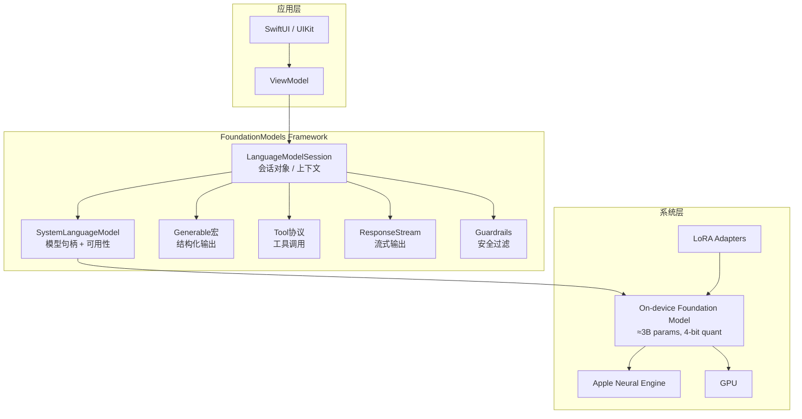
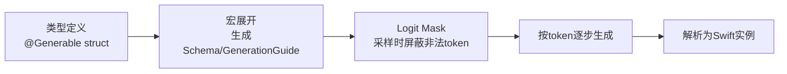
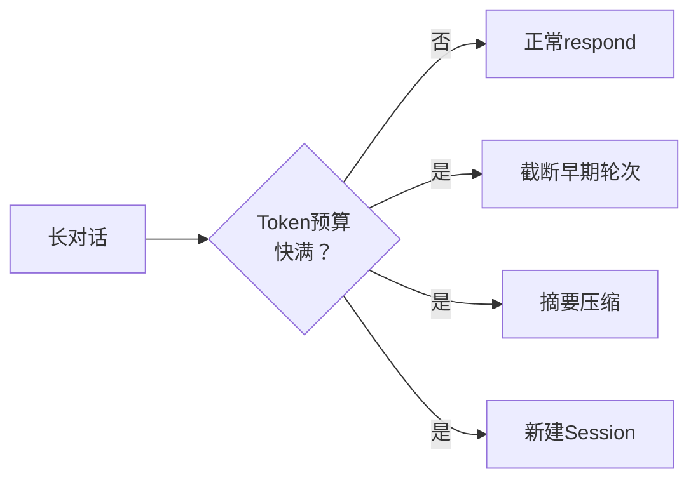
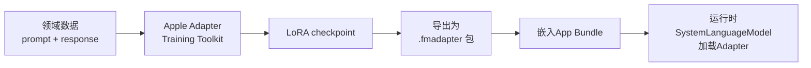
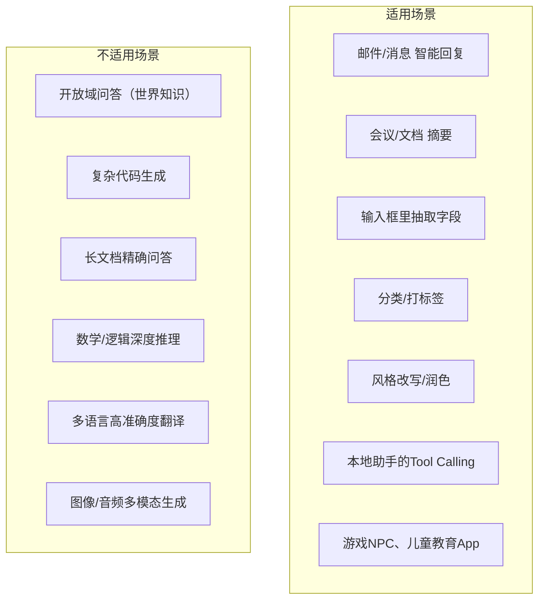
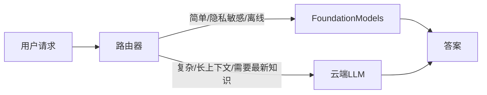
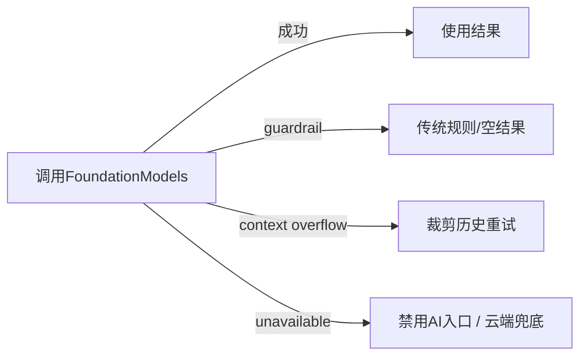
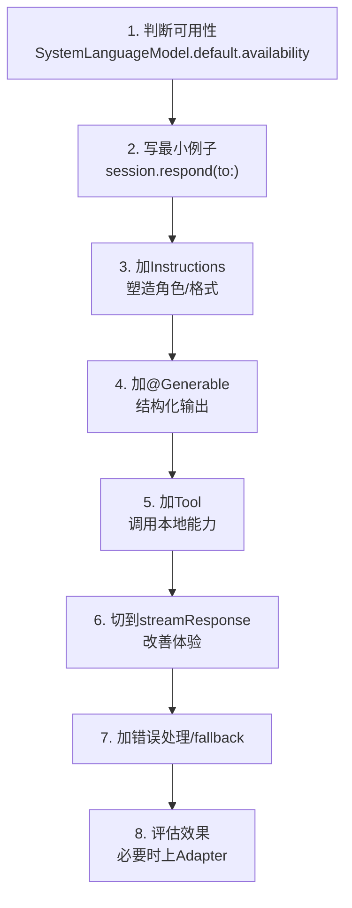

+++
title = "FoundationModels"
date = '2026-05-02T22:32:27+08:00'
draft = false
weight = 4
tags = ["AI", "LLM", "面试"]
categories = ["AI", "面试"]
+++
2025年WWDC上，Apple把Apple Intelligence背后的那个"设备端基础模型"第一次对开发者开放——这就是**FoundationModels**框架。过去要在App里接入LLM，基本只有两条路：调OpenAI/Claude这类云端API，或者自己在端上集成llama.cpp、MLC、Core ML等推理框架。前者有隐私和成本问题，后者有工程门槛和包体积问题。FoundationModels试图提供第三条路：**一个系统级的、免费的、离线可用的、原生Swift的LLM API**。

本文从框架定位开始，一路讲到Guided Generation、Tool Calling、Streaming、Adapter微调等细节，目标是让你在读完后能直接上手用它写出一个生产可用的功能。

## 一、FoundationModels是什么

### 1.1 一句话定义

FoundationModels是iOS 26 / macOS 26及之后的系统框架，提供对**设备端Apple Intelligence语言模型**的编程访问能力。模型本身约3B参数，经过4-bit量化，常驻系统，不计入App包体积，所有推理在设备上完成。

### 1.2 能做什么 / 不能做什么

| 能做 | 不能做 |
|------|--------|
| 文本生成、摘要、分类、抽取、改写、翻译 | 世界知识问答（模型太小，不适合当"百科") |
| 结构化输出（生成指定Swift类型） | 图像生成 / 视频生成 |
| 工具调用（Function Calling） | 嵌入向量生成（Embedding） |
| 短对话、小规模推理 | 长上下文的复杂推理（窗口有限） |
| 完全离线、无需联网 | 替代GPT-4这类前沿大模型 |

定位非常清楚：**它是一个"端侧小而美"的模型，负责那些没必要上云、对延迟/隐私/成本敏感的任务。**

### 1.3 为什么值得iOS开发者关注

- **零成本**：不像调OpenAI API，每token都花钱。
- **零延迟网络层**：首token延迟可以做到100ms级。
- **隐私合规**：输入不出设备，符合医疗、金融、教育场景的合规要求。
- **离线可用**：地铁、飞机、隧道里也能跑。
- **原生Swift DSL**：宏驱动的`@Generable`、`Tool`协议，跟SwiftUI一样"声明式"。
- **与系统深度集成**：可直接访问Apple Intelligence上下文（比如屏幕识别、个人数据等，受权限约束）。

## 二、整体架构



几个关键抽象：

- **SystemLanguageModel**：模型句柄，提供可用性查询与Adapter切换。
- **LanguageModelSession**：一次会话的载体，封装了prompt历史、工具集合、生成选项。
- **Generable**：宏，把Swift类型变成模型可"填空"的schema。
- **Tool**：工具协议，模型可以在对话中调用你的函数。
- **Response / ResponseStream**：同步或流式的返回结果。
- **Guardrails**：系统内置的输入输出安全过滤。

## 三、可用性与设备要求

FoundationModels不是所有iPhone都能用。它依赖Apple Intelligence，所以：

- **设备**：iPhone 15 Pro及以上、搭载M1及以上的iPad、搭载M系列芯片的Mac。
- **系统**：iOS 26 / iPadOS 26 / macOS 26 或更高。
- **区域 & 语言**：需要用户启用Apple Intelligence，支持的语言列表在持续扩展。
- **资源状态**：电量过低、发热严重、存储不足都可能让模型暂时不可用。

因此**代码里一定要先判断可用性，不要假设模型永远在线**：

```swift
import FoundationModels

let model = SystemLanguageModel.default

switch model.availability {
case .available:
    // 可以用
    break
case .unavailable(let reason):
    switch reason {
    case .deviceNotEligible:
        // 设备不支持Apple Intelligence
        break
    case .appleIntelligenceNotEnabled:
        // 用户未启用
        break
    case .modelNotReady:
        // 模型正在下载或准备中
        break
    @unknown default:
        break
    }
}
```

在SwiftUI里常用`@Observable`包一层状态，或者直接在View里通过环境量判断是否渲染"AI入口"。

## 四、最基础的生成：Prompt In, Text Out

最简单的用法只有三行：

```swift
import FoundationModels

let session = LanguageModelSession()
let response = try await session.respond(to: "用一句话介绍Swift")
print(response.content)
```

`LanguageModelSession`默认使用系统模型，不带工具，不带指令。它内部维护着完整的对话历史，可以连续多轮：

```swift
let session = LanguageModelSession()
_ = try await session.respond(to: "你是一个iOS面试官")
let answer = try await session.respond(to: "请出一道关于weak的题")
// 第二轮调用会携带第一轮的上下文
```

### 4.1 Instructions：系统指令

更常见的做法是用`Instructions`设定"系统提示"，类似OpenAI的`system`消息：

```swift
let session = LanguageModelSession(
    instructions: Instructions("""
    你是一个简洁的iOS助手。
    规则：
    - 回答不超过2句话
    - 使用中文
    - 避免冗长的前缀
    """)
)

let answer = try await session.respond(to: "什么是ARC？")
```

`Instructions`在整个会话生命周期内只设置一次，后续的`respond(to:)`只是追加用户消息。

### 4.2 GenerationOptions：采样参数

和云端API一样，可以调整温度、采样策略：

```swift
let options = GenerationOptions(
    temperature: 0.2,         // 低温度→稳定、确定性
    sampling: .topP(0.9),     // nucleus sampling
    maximumResponseTokens: 200
)

let response = try await session.respond(
    to: "列出Swift的值类型",
    options: options
)
```

经验值：

- **抽取/分类/格式化**：`temperature`给 0 ~ 0.3，要确定性。
- **创意写作/改写**：`temperature`给 0.7 ~ 1.0，要多样性。

## 五、Guided Generation：让模型"填Swift类型"

这是FoundationModels最有价值、也最区别于别家的特性。

### 5.1 痛点

写过Function Calling或JSON Mode的人都知道，LLM返回结构化数据的老大难问题是：

- 模型偶尔会返回不合法的JSON
- 字段名拼错、类型不对
- 需要手写一大段JSON Schema
- 需要手写一大段`Decodable`映射

### 5.2 @Generable：一个宏解决所有问题

```swift
import FoundationModels

@Generable
struct Recipe {
    @Guide(description: "菜名")
    let name: String

    @Guide(description: "大致所需分钟数", .range(5...180))
    let minutes: Int

    @Guide(description: "食材清单")
    let ingredients: [Ingredient]

    @Guide(description: "步骤说明，按顺序")
    let steps: [String]
}

@Generable
struct Ingredient {
    let name: String

    @Guide(description: "数量，可为浮点")
    let amount: Double

    @Guide(description: "计量单位", .anyOf(["g", "ml", "个", "勺"]))
    let unit: String
}
```

然后调用：

```swift
let response = try await session.respond(
    to: "给我一个30分钟能做好的番茄意面菜谱",
    generating: Recipe.self
)

let recipe: Recipe = response.content
print(recipe.name)
print(recipe.ingredients.map { $0.name })
```

`response.content`直接就是强类型的`Recipe`，**不需要任何JSON解析**。

### 5.3 背后原理：Constrained Decoding

这里不是"模型生成JSON字符串→框架再解码"，而是**在每一步token采样时施加语法约束**，让模型只能采样出符合类型结构的token。核心机制：



因此Guided Generation具有两个很强的性质：

- **100%合法**：不会出现JSON解析失败。
- **不浪费token**：不需要输出大段的schema描述或"请严格按照JSON格式输出"这样的prompt。

### 5.4 @Guide的能力

`@Guide`宏支持多种约束：

| 约束 | 用途 |
|------|------|
| `description: "..."` | 字段语义说明，会作为prompt的一部分 |
| `.range(a...b)` | 数值范围 |
| `.count(a...b)` | 数组长度 |
| `.anyOf([...])` | 枚举候选值 |
| `.pattern(_:)` | 正则约束字符串 |

组合使用：

```swift
@Generable
enum Priority: String, CaseIterable {
    case low, medium, high
}

@Generable
struct Todo {
    @Guide(description: "事项标题", .pattern("^.{1,50}$"))
    let title: String

    let priority: Priority    // 枚举天然带候选集

    @Guide(description: "截止日期，YYYY-MM-DD")
    let dueDate: String

    @Guide(description: "最多5个tag", .count(0...5))
    let tags: [String]
}
```

### 5.5 嵌套与复合类型

`@Generable`支持嵌套、数组、可选：

```swift
@Generable
struct SearchResult {
    let query: String
    let items: [Item]
    let suggestion: String?
}

@Generable
struct Item {
    let title: String
    let score: Double
}
```

对于特别复杂的schema，建议分多步生成（先生成骨架，再填细节），每一步类型小一点，模型更稳。

## 六、Tool Calling：让模型调用你的代码

### 6.1 Tool协议

```swift
import FoundationModels

struct WeatherTool: Tool {
    let name = "get_weather"
    let description = "获取指定城市的当前天气"

    @Generable
    struct Arguments {
        @Guide(description: "城市名，例如：北京、上海")
        let city: String
    }

    func call(arguments: Arguments) async throws -> ToolOutput {
        let data = try await WeatherAPI.fetch(city: arguments.city)
        return ToolOutput(data.summary) // 也可以返回自定义Generable
    }
}
```

关键点：

- `Arguments`用`@Generable`定义，模型会结构化地生成参数。
- `call`是`async throws`，可以做网络、IO、跨进程通信。
- 返回`ToolOutput`，它可以是字符串，也可以封装另一个`@Generable`结构。

### 6.2 在Session中注册

```swift
let session = LanguageModelSession(
    tools: [WeatherTool(), ClockTool()],
    instructions: Instructions("你是一个本地生活助手，能查天气、报时间。")
)

let answer = try await session.respond(to: "明天北京会下雨吗？")
```

模型在生成过程中会自动：

1. 判断是否需要工具
2. 结构化生成`Arguments`
3. 框架自动调用`tool.call(arguments:)`
4. 把返回值塞回上下文
5. 继续生成最终回答

调用流程更直观地看：

```mermaid
sequenceDiagram
    participant App
    participant Session
    participant Model
    participant Tool

    App->>Session: respond(to: "明天北京下雨吗？")
    Session->>Model: prompt + 工具描述
    Model-->>Session: 决定调用 get_weather(city:"北京")
    Session->>Tool: call(Arguments(city: "北京"))
    Tool-->>Session: ToolOutput("小雨, 15°C")
    Session->>Model: 把ToolOutput加入上下文
    Model-->>Session: "明天北京预计小雨，建议带伞"
    Session-->>App: Response&lt;String&gt;
```

### 6.3 多工具与并行

Session支持注册多个工具。模型可以在**同一次响应里**触发多次工具调用（有的甚至是并行），框架会等待全部返回后再生成文本。

设计原则：

- 工具**粒度适中**，不要做"上帝工具"。
- 名字用**动词短语**，`get_`, `search_`, `create_`。
- 描述写给模型看，而不是给人看。
- 参数尽量是原子值，不要塞复杂嵌套。
- 返回值要**自描述**，包含必要单位和来源。

## 七、流式输出：ResponseStream

对话型UI不能让用户干等，必须边生成边展示。FoundationModels直接提供`AsyncSequence`：

```swift
let stream = session.streamResponse(to: "写一首关于iOS的打油诗")

for try await partial in stream {
    // partial 是当前累积的字符串（每次都是完整的快照，不是增量）
    await MainActor.run {
        self.text = partial
    }
}
```

> 注意：`partial`是**到目前为止的完整累积文本**，不是"delta"。直接赋值即可，不用自己拼。

### 7.1 流式 + Guided Generation

这是FoundationModels相当炫的能力——**流式生成一个结构化对象**：

```swift
let stream = session.streamResponse(
    to: "给我一个番茄意面菜谱",
    generating: Recipe.self
)

for try await partial in stream {
    // partial: Recipe.PartiallyGenerated
    // 此时 name 可能已经有了，steps 可能只有前两步
    if let name = partial.name {
        self.recipeName = name
    }
    self.ingredients = partial.ingredients ?? []
    self.steps = partial.steps ?? []
}
```

`PartiallyGenerated`类型是宏自动生成的"所有字段都变成可选"的伴生类型。随着生成推进，字段逐步被填满，UI可以**字段级地更新**，体验极佳。

### 7.2 在SwiftUI里优雅使用

```swift
@Observable
final class RecipeViewModel {
    var partial: Recipe.PartiallyGenerated?
    var isRunning = false

    private let session = LanguageModelSession()

    func generate(_ prompt: String) async {
        isRunning = true
        defer { isRunning = false }
        do {
            let stream = session.streamResponse(to: prompt, generating: Recipe.self)
            for try await value in stream {
                partial = value
            }
        } catch {
            // 处理错误
        }
    }
}
```

在View里就能直接用`partial?.name`、`partial?.ingredients`这样的渐进式数据来驱动UI。

## 八、会话、上下文与Transcript

### 8.1 Transcript

每一次`respond`都会把用户输入与模型输出、工具调用记录进`session.transcript`。可以读取、序列化、回放：

```swift
for entry in session.transcript {
    switch entry {
    case .instructions(let i):   print("SYS:", i.segments.map(\.text).joined())
    case .prompt(let p):         print("USR:", p.segments.map(\.text).joined())
    case .response(let r):       print("AST:", r.segments.map(\.text).joined())
    case .toolCalls(let c):      print("TOOL call:", c)
    case .toolOutput(let o):     print("TOOL out:", o)
    @unknown default:            break
    }
}
```

### 8.2 上下文窗口

设备端模型的上下文窗口远小于云端大模型（通常几千token量级）。当超过预算时，Session会抛`LanguageModelSession.GenerationError.exceededContextWindowSize`。

应对策略：



常见做法：

- 把"系统指令 + 最近N轮"保留，中间摘要化。
- 或者主动检测错误，fallback成新Session+历史摘要重建。

### 8.3 预热与并发

- `LanguageModelSession`首次使用会触发模型加载，建议应用启动或进入AI页面时**预热**：`session.prewarm()`。
- 同一Session**不是**线程安全的，单个Session的respond应串行。多个独立任务可以创建多个Session。
- Session持有内存/缓存，离开场景时应释放。

## 九、Safety Guardrails：系统级安全

FoundationModels内置了**系统级的安全护栏**，对输入和输出都会做过滤。一旦被拦截，调用会抛错：

```swift
do {
    let answer = try await session.respond(to: userInput)
} catch let error as LanguageModelSession.GenerationError {
    switch error {
    case .guardrailViolation:
        // 被安全策略拦截
        showFallback()
    case .exceededContextWindowSize:
        // 超出上下文
        trimAndRetry()
    case .unsupportedLanguageOrLocale:
        break
    case .assetsUnavailable:
        break
    @unknown default:
        break
    }
}
```

> 这一层你不能关闭，但可以通过Prompt Engineering和输入预处理降低误伤概率；关键是**任何AI功能都要有fallback UI**，别因为guardrail让功能直接挂掉。

## 十、Adapter：LoRA微调小模型

### 10.1 为什么需要Adapter

3B模型擅长通用任务，但在一些**垂直领域**（法律文本抽取、医疗问诊、游戏NPC对话）表现一般。全量微调一个3B模型对大部分团队不现实。Apple提供的方案是**LoRA Adapter**：

- 只训练一小部分低秩矩阵（几十MB）
- 在推理时挂载到主模型上，效果接近全量微调
- 主模型系统内共享，Adapter包进你自己的App

### 10.2 工具链

Apple提供了Python工具链（基于PyTorch/MLX），典型流程：



### 10.3 运行时使用

```swift
let model = try SystemLanguageModel(adapter: .init(name: "LegalQA"))
let session = LanguageModelSession(model: model)
```

这样这个Session只在你的App里生效，不影响系统其他地方的模型行为。

> 如果任务只是稍微定制风格/格式，**优先用Instructions + Few-shot**，微调是最后的手段。

## 十一、性能与资源

### 11.1 首token延迟 & 吞吐

典型数据（官方口径，具体视机型而定）：

- 首token延迟：**~0.6s以内**（有prewarm后更快）
- 吞吐：**30 tokens/s左右**
- 内存占用：系统统一管理，App侧几乎看不到常驻内存增长

### 11.2 发热与功耗

短时调用几乎无感，但**持续流式生成**（比如连续几分钟的对话）会明显吃电与发热。实战建议：

- 给长对话设置**空闲超时**，空闲后主动释放Session。
- 避免用FoundationModels做高频触发的任务（比如边打字边推理）。
- 对大文本任务做**分片**与**早停**（`maximumResponseTokens`）。

### 11.3 预热策略

```swift
// App冷启动后、进入AI功能页面前调用
await session.prewarm()
```

预热本身有一点点开销，适合放在"用户将要用AI"的强信号处，不要在AppDelegate里无脑调。

## 十二、适用场景 vs 不适用场景



简单判断方法：**如果任务对模型参数量的依赖强（需要大量世界知识或深度推理），选云端；如果任务对隐私/成本/延迟敏感且模式相对固定，选FoundationModels。**

## 十三、与云端大模型对比

| 维度 | FoundationModels | 云端GPT-4/Claude |
|------|-------------------|--------------------|
| 参数量 | ~3B | 数百B到T级别 |
| 推理位置 | 本机 ANE / GPU | 远端数据中心 |
| 延迟 | 首token ~100ms | 首token 500ms~3s |
| 成本 | 0 | $/1M tokens |
| 隐私 | 数据不出设备 | 需上传到服务方 |
| 可用性 | 离线可用、受电量限制 | 依赖网络 |
| 上下文窗口 | 有限（几k token） | 数万~百万 |
| 世界知识 | 弱 | 强 |
| 深度推理 | 弱 | 强 |
| 结构化输出 | Guided Generation原生保证 | JSON Schema，需校验 |
| 工具调用 | Tool协议原生 | Function Calling，需开发者封装 |
| 更新节奏 | 随iOS/macOS升级 | 厂商随时可更新 |

很多产品的最终形态是**混合路由**：



## 十四、实战：一个"智能待办"功能

场景：用户在输入框随手写一句话，比如"明天下午3点提醒我去医院，优先级高"，应用要解析成一个`Todo`对象。

```swift
import FoundationModels

@Generable
struct Todo {
    @Guide(description: "简短标题，<= 30字")
    let title: String

    @Guide(description: "优先级")
    let priority: Priority

    @Guide(description: "提醒时间，ISO 8601格式")
    let reminderAt: String?

    @Guide(description: "标签，最多3个", .count(0...3))
    let tags: [String]
}

@Generable
enum Priority: String, CaseIterable {
    case low, medium, high
}

@Observable
final class TodoParser {
    private let session: LanguageModelSession

    init() {
        self.session = LanguageModelSession(
            instructions: Instructions("""
            你是一个待办事项解析器。
            - 从用户的自然语言中抽取Todo字段
            - 当前时间：\(ISO8601DateFormatter().string(from: Date()))
            - 识别"明天""下周一""今晚"等相对时间，并转成绝对时间
            - 如果无法判断优先级，默认为medium
            - 只抽取用户明确表达的标签
            """)
        )
    }

    func parse(_ text: String) async throws -> Todo {
        let response = try await session.respond(
            to: text,
            generating: Todo.self,
            options: GenerationOptions(temperature: 0.1)
        )
        return response.content
    }
}
```

UI调用：

```swift
struct TodoInputView: View {
    @State private var text = ""
    @State private var parsed: Todo?
    @State private var isParsing = false
    private let parser = TodoParser()

    var body: some View {
        VStack(alignment: .leading, spacing: 12) {
            TextField("随手写点什么…", text: $text, axis: .vertical)
                .textFieldStyle(.roundedBorder)

            Button("解析") {
                Task {
                    isParsing = true
                    parsed = try? await parser.parse(text)
                    isParsing = false
                }
            }
            .disabled(text.isEmpty || isParsing)

            if let todo = parsed {
                VStack(alignment: .leading) {
                    Text(todo.title).font(.headline)
                    Text("优先级：\(todo.priority.rawValue)")
                    if let time = todo.reminderAt {
                        Text("提醒：\(time)")
                    }
                    if !todo.tags.isEmpty {
                        Text("标签：\(todo.tags.joined(separator: ", "))")
                    }
                }
            }
        }
        .padding()
    }
}
```

这套代码有几个亮点：

- 不写一行JSON Schema
- 不写一行解析代码
- 不担心模型返回非法数据
- 不上云，不产生API费用
- 离线也能用

## 十五、错误处理与可观测性

### 15.1 可能抛出的错误

```swift
do {
    _ = try await session.respond(to: prompt, generating: Todo.self)
} catch let error as LanguageModelSession.GenerationError {
    switch error {
    case .guardrailViolation:        handleBlocked()
    case .exceededContextWindowSize: handleContextOverflow()
    case .unsupportedLanguageOrLocale: handleLocale()
    case .assetsUnavailable:         handleNotReady()
    case .decodingFailure:           handleDecode()
    @unknown default:                handleUnknown()
    }
} catch {
    // 网络/IO/Tool内部错误等
}
```

### 15.2 日志与埋点建议

- **不要记录完整prompt和输出**到远端日志，避免隐私问题。可以记录**token数、耗时、是否命中Tool、是否fallback**。
- 对每个Tool增加**成功率、平均耗时**指标。
- 对Guardrail违规，增加**匿名化的命中率**。

### 15.3 回退策略



AI功能**绝不能是单点**。哪怕退化成"用户手动填表单"，也要让用户能完成任务。

## 十六、上手路径建议



每一步都可以独立验证，不要一上来就端出"多工具 + 流式 + 微调"的复杂系统。

## 十七、常见踩坑

- **把它当GPT-4用**：会失望。它是3B模型，不适合世界知识问答。
- **不判断可用性**：上线后老机型直接黑屏。
- **不prewarm**：首次调用延迟感人。
- **Tool返回值太大**：模型消化不了，甚至撑爆上下文，要做截断或结构化。
- **忘了Transcript也占token**：长对话要主动裁剪。
- **Guardrail静默失败**：一定要catch，给用户明确提示或降级。
- **滥用流式**：对短结果没必要流式，反而增加实现复杂度。
- **在主线程调用**：虽然API是`async`，但忽略了取消、并发限制、UI状态机可能导致重复调用或Race。

