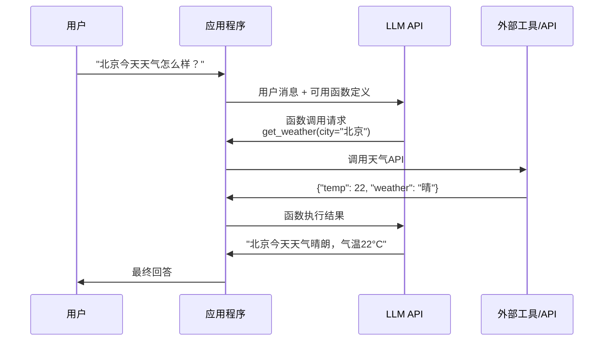
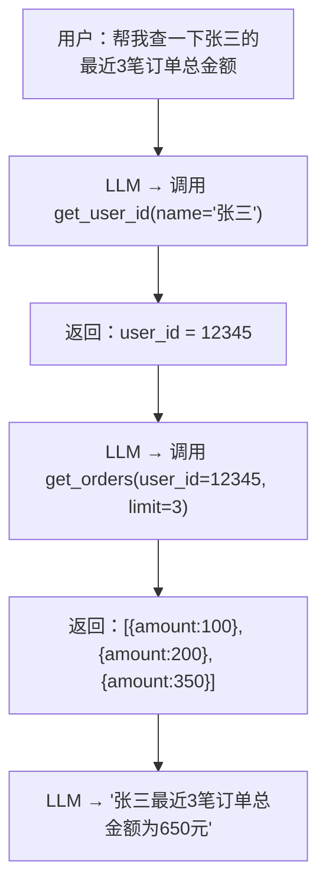
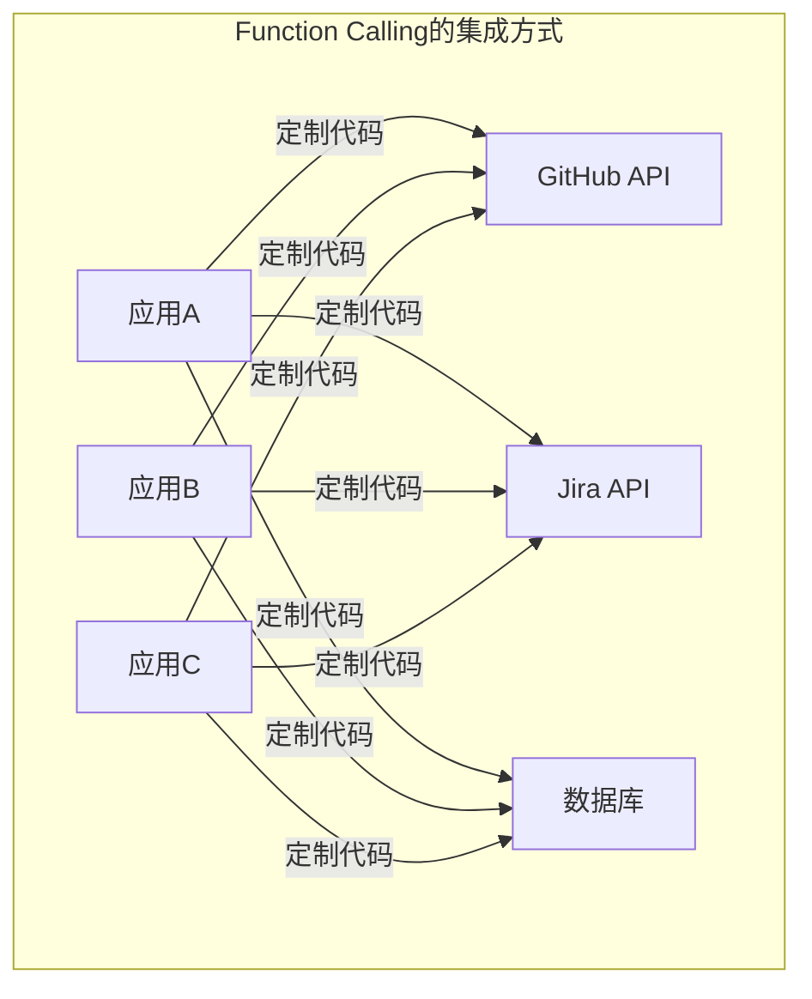
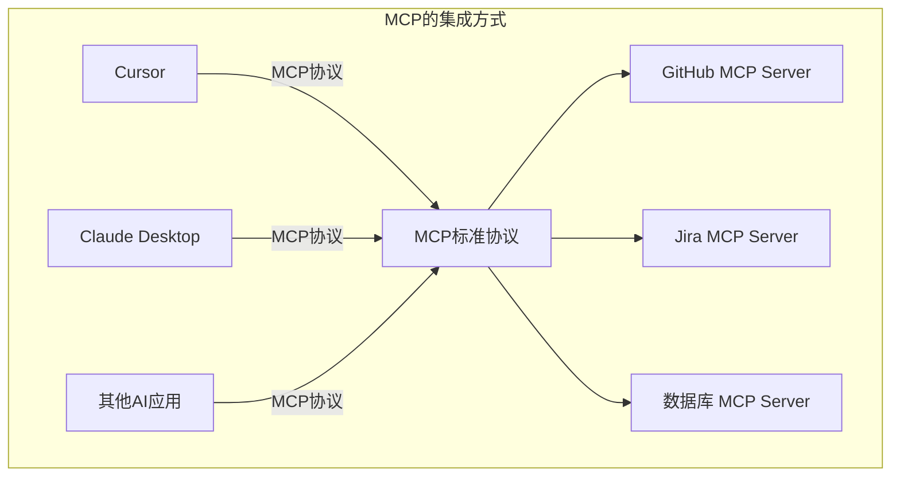
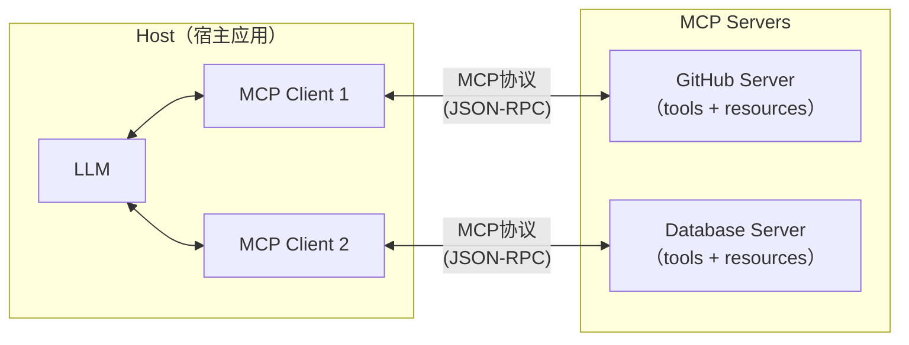
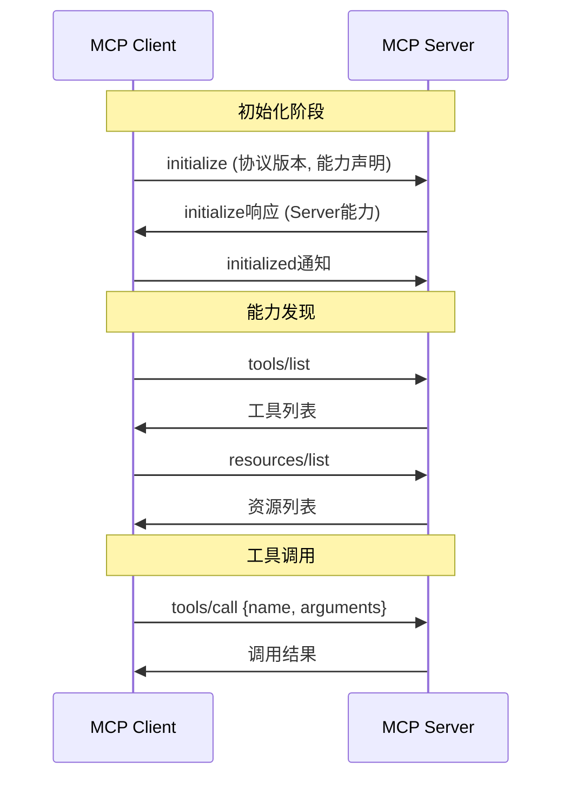
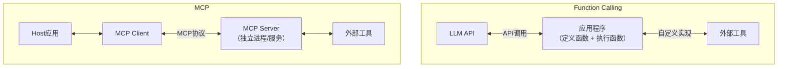
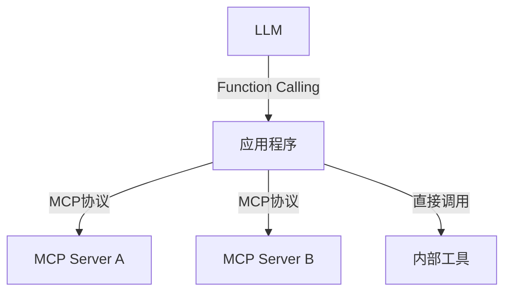
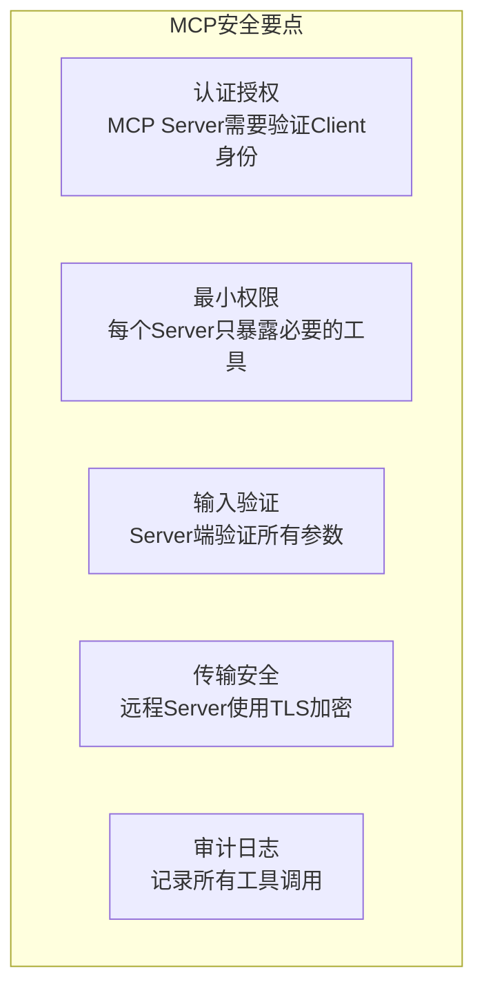

+++
title = "Function Calling与MCP"
date = '2026-05-02T22:32:27+08:00'
draft = false
weight = 5
tags = ["AI", "LLM", "面试"]
categories = ["AI", "面试"]
+++
LLM很聪明，但它被困在一个"文本沙箱"里——它只能接收文本、输出文本。要让LLM调用API、查数据库、操作文件，就需要一个"桥梁"协议来连接LLM与外部世界。

**Function Calling**和**MCP（Model Context Protocol）**就是这样的桥梁。它们的目标相同——让LLM能调用外部工具——但设计理念和使用场景有很大不同。本文将详细对比这两种方案。

## 一、Function Calling：LLM原生的工具调用

### 1.1 基本原理

Function Calling是LLM提供商（OpenAI、Anthropic、Google等）在模型层面支持的工具调用能力。核心思路是：

1. 你告诉LLM有哪些函数可用（函数名、参数定义、功能描述）
2. LLM根据用户的问题判断是否需要调用函数
3. 如果需要，LLM输出一个结构化的函数调用请求（而不是自然语言）
4. 你的代码执行这个函数，把结果返回给LLM
5. LLM基于结果生成最终回答



**关键点：LLM自身并不执行函数，它只是生成"我想调用这个函数"的结构化指令，真正的执行由应用程序完成。**

### 1.2 函数定义

以OpenAI的格式为例，开发者需要用JSON Schema描述每个可用的函数：

```json
{
  "tools": [
    {
      "type": "function",
      "function": {
        "name": "get_weather",
        "description": "获取指定城市的当前天气信息",
        "parameters": {
          "type": "object",
          "properties": {
            "city": {
              "type": "string",
              "description": "城市名称，如'北京'、'上海'"
            },
            "unit": {
              "type": "string",
              "enum": ["celsius", "fahrenheit"],
              "description": "温度单位"
            }
          },
          "required": ["city"]
        }
      }
    }
  ]
}
```

LLM通过阅读这个定义来理解：这个函数叫什么、干什么用、需要什么参数。**description字段的质量直接影响LLM能否正确选择和调用函数。**

### 1.3 LLM的调用决策

LLM收到用户消息和函数定义后，会做出判断：

| 用户消息 | LLM的决策 |
|---------|----------|
| "北京今天天气怎么样？" | 调用 get_weather(city="北京") |
| "你好，你是谁？" | 不调用任何函数，直接回答 |
| "比较北京和上海的天气" | 并行调用 get_weather(city="北京") 和 get_weather(city="上海") |
| "帮我订一张明天去上海的机票" | 如果有booking函数就调用，没有就说"我无法帮你订票" |

LLM也支持**并行调用**——一次返回多个函数调用请求。

### 1.4 多轮工具调用

复杂任务可能需要多轮工具调用：



LLM在每一步根据上一步的结果决定下一步行动，形成一个推理链。

### 1.5 各厂商的差异

| 提供商 | 实现名称 | 特点 |
|--------|---------|------|
| OpenAI | Function Calling / Tools | 最早推出，生态最成熟 |
| Anthropic | Tool Use | 支持长工具描述，XML格式兼容 |
| Google | Function Calling | Gemini系列支持 |
| 本地模型 | 各有实现 | Qwen、LLaMA等通过微调支持 |

不同厂商的函数定义格式略有差异，但核心思路一致。

## 二、MCP：通用的工具连接协议

### 2.1 Function Calling的痛点

Function Calling虽然有效，但存在一个根本问题——**每个工具集成都是定制开发**：



每个应用都需要为每个工具写一套集成代码——工具定义、参数映射、结果处理等。如果有M个应用和N个工具，就需要M x N个集成。

### 2.2 MCP的愿景

**MCP（Model Context Protocol）**由Anthropic在2024年底提出，目标是建立一个通用的开放标准，让任何LLM应用都能通过统一协议连接任何工具。

就像USB-C统一了充电接口一样，MCP要统一AI工具的连接方式：



每个工具只需实现一个MCP Server，就能被所有支持MCP的应用使用。M x N的集成问题变成了M + N。

### 2.3 MCP的架构

MCP采用经典的**Client-Server架构**：



核心角色：

| 角色 | 职责 | 示例 |
|------|------|------|
| **Host** | 宿主应用，管理MCP连接和LLM交互 | Cursor、Claude Desktop |
| **MCP Client** | Host中的协议客户端，与Server通信 | 嵌入在Host中 |
| **MCP Server** | 暴露工具和资源的独立服务 | github-mcp-server、postgres-mcp-server |

### 2.4 MCP Server提供的三种能力

一个MCP Server可以提供三种类型的能力：

#### Tools（工具）

类似于Function Calling中的函数——LLM可以调用的操作：

```json
{
  "name": "create_issue",
  "description": "在GitHub仓库中创建一个新Issue",
  "inputSchema": {
    "type": "object",
    "properties": {
      "repo": { "type": "string", "description": "仓库名，如 owner/repo" },
      "title": { "type": "string", "description": "Issue标题" },
      "body": { "type": "string", "description": "Issue内容" }
    },
    "required": ["repo", "title"]
  }
}
```

#### Resources（资源）

只读的数据源，LLM可以读取但不会产生副作用：

```json
{
  "uri": "github://repos/anthropic/mcp/readme",
  "name": "MCP仓库README",
  "description": "MCP项目的README文件内容",
  "mimeType": "text/markdown"
}
```

#### Prompts（提示词模板）

预定义的Prompt模板，帮助用户快速构造特定类型的请求：

```json
{
  "name": "code_review",
  "description": "生成代码审查Prompt",
  "arguments": [
    { "name": "language", "description": "编程语言", "required": true },
    { "name": "code", "description": "待审查代码", "required": true }
  ]
}
```

### 2.5 MCP的通信机制

MCP使用**JSON-RPC 2.0**作为通信协议，支持两种传输方式：

| 传输方式 | 适用场景 | 特点 |
|---------|---------|------|
| **stdio** | 本地进程 | Host直接启动Server进程，通过标准输入输出通信 |
| **HTTP + SSE** | 远程服务 | Server作为HTTP服务运行，支持服务端推送 |

以stdio方式为例，通信流程：



### 2.6 MCP Server的配置

在支持MCP的应用中，用户通过配置文件声明要使用的MCP Server：

```json
{
  "mcpServers": {
    "github": {
      "command": "npx",
      "args": ["-y", "@modelcontextprotocol/server-github"],
      "env": {
        "GITHUB_TOKEN": "ghp_xxxx"
      }
    },
    "postgres": {
      "command": "npx", 
      "args": ["-y", "@modelcontextprotocol/server-postgres"],
      "env": {
        "DATABASE_URL": "postgresql://localhost:5432/mydb"
      }
    }
  }
}
```

Host启动时会自动启动这些Server进程，建立MCP连接。

## 三、Function Calling vs MCP：深度对比

### 3.1 架构差异



### 3.2 全面对比

| 维度 | Function Calling | MCP |
|------|-----------------|-----|
| **定义方** | LLM提供商（OpenAI/Anthropic/Google） | Anthropic主导的开放标准 |
| **工具在哪里运行** | 在你的应用代码中执行 | 在独立的MCP Server进程中执行 |
| **谁负责执行** | 应用开发者编写执行逻辑 | MCP Server封装好执行逻辑 |
| **标准化程度** | 各家格式不同，需要适配 | 统一协议，一次实现处处可用 |
| **工具发现** | 开发者硬编码工具列表 | 动态发现（tools/list） |
| **可复用性** | 每个应用各自实现 | Server可跨应用复用 |
| **适用场景** | 自定义应用开发 | 生态化工具共享 |
| **灵活性** | 完全自定义 | 需遵循协议规范 |
| **成熟度** | 高，生产环境广泛使用 | 较新，生态快速增长中 |

### 3.3 一个直觉的类比

**Function Calling** 像是自己组装电脑——你挑选CPU、内存、硬盘，然后自己接线装好。每台电脑都是定制的，你对每个部件有完全的控制权，但每台都要重新装一次。

**MCP** 像是USB接口标准——键盘、鼠标、U盘、打印机，只要有USB接口就能即插即用。你不需要知道内部怎么实现的，也不需要为每个设备写驱动。

### 3.4 它们不是对立的

在实际架构中，MCP和Function Calling经常共存：



MCP Server暴露的工具，最终还是通过Function Calling告诉LLM。MCP解决的是**工具的标准化封装和分发**问题，Function Calling解决的是**LLM如何决定调用工具**的问题。

## 四、实践中的选择

### 4.1 什么时候用Function Calling

- 你在开发自己的AI应用
- 工具逻辑是应用内部的（如操作自己的数据库）
- 需要精细控制工具的执行过程
- 对特定LLM提供商的API已经很熟悉

### 4.2 什么时候用MCP

- 你想让多个AI应用共享同一套工具
- 你想使用社区已有的MCP Server（GitHub、Slack、数据库等）
- 你希望工具与应用解耦，独立部署和升级
- 你构建的是一个平台/框架，需要可扩展的工具体系

### 4.3 MCP生态现状

MCP生态正在快速增长。一些代表性的MCP Server：

| 领域 | MCP Server | 功能 |
|------|-----------|------|
| 代码管理 | GitHub MCP | 创建Issue/PR、搜索代码、管理仓库 |
| 项目管理 | GitLab MCP | GitLab的Issue、MR、Pipeline管理 |
| 数据库 | PostgreSQL MCP | SQL查询、Schema查看 |
| 浏览器 | Playwright MCP | 网页自动化、截图、表单填写 |
| 文件系统 | Filesystem MCP | 文件读写、目录操作 |
| 搜索 | Brave Search MCP | 网页搜索 |
| 通信 | Slack MCP | 发送消息、管理频道 |

支持MCP的Host应用：
- **Cursor**：AI编程IDE，深度集成MCP
- **Claude Desktop**：Anthropic的桌面应用
- **Windsurf**：AI编程IDE
- **多种开源框架**：LangChain、LlamaIndex等

## 五、安全考量

### 5.1 Function Calling的安全

开发者完全控制执行逻辑，安全边界比较清晰：

```
用户输入 → LLM判断 → 应用代码验证参数 → 执行函数
                              ↑
                        在这里做安全检查
```

### 5.2 MCP的安全

MCP Server是独立进程/服务，安全模型更复杂：



MCP协议本身正在演进中，安全机制（如OAuth集成、权限作用域等）还在不断完善。

## 六、总结

| 概念 | 核心定位 | 一句话总结 |
|------|---------|----------|
| **Function Calling** | LLM调用工具的能力 | 让LLM知道"我可以调什么函数" |
| **MCP** | 工具的标准化连接协议 | 让工具"即插即用"到任何AI应用 |

它们是不同层次的解决方案：

- Function Calling回答的是：**LLM怎么决定调用工具？**（模型层）
- MCP回答的是：**工具怎么被标准化地发现和使用？**（协议层）

在实际应用中，MCP Server提供标准化的工具描述和执行能力，Host应用通过Function Calling将这些工具呈现给LLM。两者配合，构建出完整的Agent工具链。

理解了这些基础设施后，下一篇文章我们将聚焦于一个更贴近日常的话题——AI编程工具是如何工作的，Cursor/Copilot中的Rule、Skill等概念又是什么。
