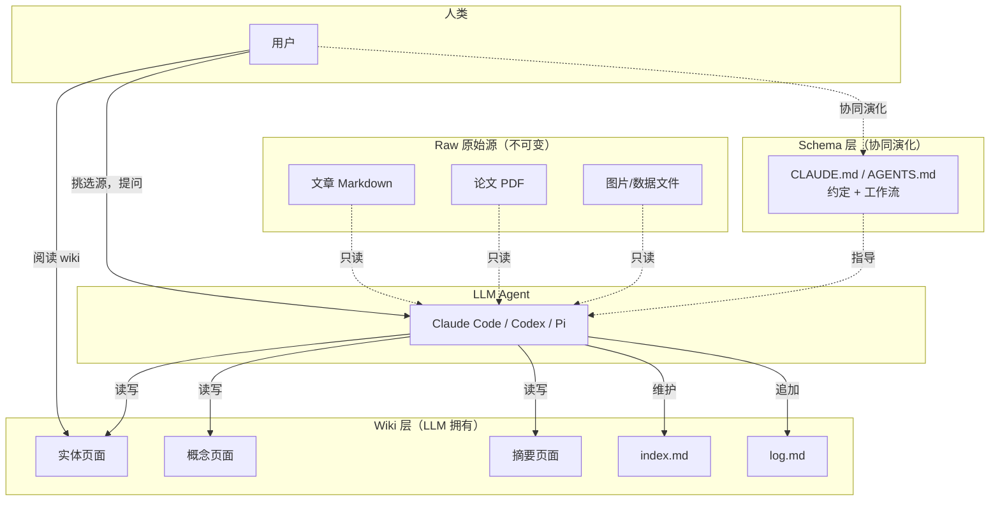
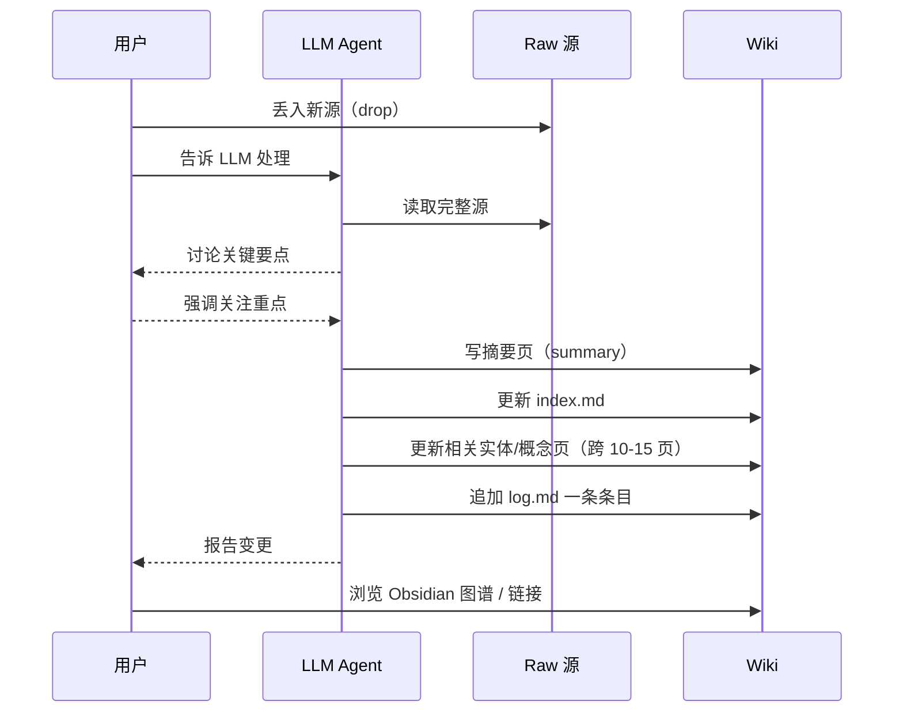

+++
title = "LLM Wiki：Karpathy 提出的\"后 RAG 时代\"个人知识库范式"
date = '2026-05-02T22:32:27+08:00'
draft = false
weight = 7
tags = ["AI", "LLM", "面试"]
categories = ["AI", "面试"]
+++
2026 年 4 月，Andrej Karpathy 在 GitHub Gist 上发布了一份名为 `llm-wiki.md` 的"想法文档"（idea file），短短几天收获了 5000+ 星和 5000+ fork。这篇文档篇幅不长，却被评价为"后 RAG 时代"个人知识管理的一个**分类定义性（category-defining）**框架。

原文地址：[https://gist.github.com/karpathy/442a6bf555914893e9891c11519de94f](https://gist.github.com/karpathy/442a6bf555914893e9891c11519de94f)

Karpathy 写这篇文档的风格非常有意思：它**不是一份实现规范**，而是一份"可以复制粘贴给你自己的 LLM Agent（Claude Code、Codex、OpenCode/Pi 等）"的**模式描述**。它告诉 Agent 模式的核心是什么，剩下的细节（目录结构、schema 约定、页面格式、工具链）交给用户和 Agent 一起协同演化。

本文将详细拆解这份文档的核心思想，并结合社区讨论（scale 极限、Zettelkasten 替代方案、反对派观点等）给出一个完整解读。

## 一、问题起点：RAG 的"每次从零开始"

大多数人今天使用 LLM 处理文档的方式是 [RAG（检索增强生成）](RAG.md)：

1. 把一堆文档上传到系统
2. 查询时 LLM 从原文中检索相关片段
3. 基于片段合成答案

NotebookLM、ChatGPT 文件上传、绝大多数 RAG 系统都是这个模式。

### 1.1 RAG 的根本局限：没有累积

Karpathy 点出了 RAG 的一个关键问题：**LLM 每次都在从零开始重新发现知识**。

- 问一个需要综合 5 篇文档的微妙问题 → LLM 每次都要**重新**找出相关片段，**重新**拼接，**重新**推理
- 上一次你问过的关键问题的答案，下一次再问时不会被保留
- 跨源的矛盾、交叉引用、细微的关联 —— 每次都要重新建立

**什么都没有被"沉淀"下来。** 这就像每次考试都重新读一遍教科书，却从不做笔记、从不整理知识卡片、从不画思维导图。

### 1.2 LLM Wiki 的核心差异

LLM Wiki 提出了一个根本性的反转：

> **Wiki 是一个持久的、复利式累积的产物（a persistent, compounding artifact）。**

不是在查询时才去原文检索，而是在 **ingest（摄入）时就把知识编译（compile）到一个 LLM 生成并维护的结构化 Markdown wiki 中**：

- 当你添加一个新来源，LLM 不只是把它索引起来
- 它会**阅读这个来源 → 提取关键信息 → 整合进已有的 wiki**：
  - 更新实体（entity）页面
  - 修订主题（topic）摘要
  - 标注新数据与旧主张的矛盾
  - 强化或挑战正在演化中的综合（evolving synthesis）
- 知识被**编译一次**，然后**保持更新（kept current）**，而不是在每次查询时重新派生

结果是：

- 交叉引用已经在那里
- 矛盾已经被标注
- 综合已经反映了你读过的所有东西
- **每添加一个源、每问一个问题，wiki 都会变得更丰富**

Karpathy 给出了一个很精妙的比喻：

> Obsidian 是 IDE；LLM 是程序员；wiki 是代码库。

你负责**源头挑选、探索方向、提出正确的问题**；LLM 负责所有**总结、交叉引用、归档、簿记**这些让知识库真正有用但人类会放弃维护的琐事。

## 二、三层架构：Raw / Wiki / Schema

LLM Wiki 的架构清晰且极简：



### 2.1 Raw：原始源（Source of Truth）

- **内容**：你精心挑选的源文档 —— 文章、论文、图片、数据文件
- **属性**：**不可变（immutable）**。LLM 只读，从不修改
- **意义**：真相的源头（source of truth）。当 wiki 出现不确定时，可以回溯到原始证据

### 2.2 Wiki：LLM 生成的 Markdown 层

- **内容**：摘要页、实体页、概念页、对比页、overview、synthesis
- **所有者**：**LLM 完全拥有这一层**。它创建页面、当新源到来时更新、维护交叉引用、保持一致性
- **人类角色**：你读它，但不写它

### 2.3 Schema：让 LLM 成为"纪律严明的 wiki 维护者"

- **内容**：`CLAUDE.md`（for Claude Code）、`AGENTS.md`（for Codex）等配置文件
- **作用**：告诉 LLM
  - wiki 的结构是什么样的
  - 有哪些约定（page 命名、frontmatter、link 语法）
  - ingest/query/lint 的工作流是什么
- **重要性**：**这才是让 LLM 成为"纪律严明的 wiki 维护者"而不是"通用聊天机器人"的关键配置文件**
- **演化**：你和 LLM 一起随着时间协同演化这份 schema

## 三、三大核心操作：Ingest / Query / Lint

### 3.1 Ingest（摄入）：一次可能触达 10-15 个 wiki 页面

一个典型的 ingest 流程（以单源摄入为例）：



**两种工作节奏**：

| 节奏 | 特点 | 适合场景 |
|------|------|----------|
| 一次一源，深度参与 | 读摘要、审查更新、指导 LLM 强调什么 | Karpathy 个人偏好，精度高 |
| 批量摄入，少量监督 | 一次丢一批源，自动处理 | 吞吐量优先 |

> **关键**：你要把自己的工作流固化进 schema，才能在未来会话中保持一致。

### 3.2 Query（查询）：答案可以"回流"进 wiki

查询时：

1. LLM 先读 **index.md** 找到相关页面
2. 下钻进相关 wiki 页读完整上下文
3. 综合答案并标注引用（citations）
4. 答案可以是多种形态：Markdown 页、对比表、幻灯片（Marp）、matplotlib 图、canvas

**最关键的洞察**：

> **好的答案可以作为新页面回流（filed back）到 wiki 中。**

一次对比、一次分析、一次偶然发现的关联 —— 这些都很有价值，**不应该消失在聊天历史里**。通过把它们写回 wiki，你的每一次探索都像新摄入一样"复利增长"。

### 3.3 Lint（体检）：定期健康检查

让 LLM 周期性地"体检"wiki：

- **矛盾（Contradictions）**：不同页面之间相互矛盾的主张
- **过期（Stale claims）**：被新源推翻但还没更新的内容
- **孤儿页（Orphan pages）**：没有任何入链的页面
- **缺失概念**：被多次提及但没有独立页面的重要概念
- **缺失交叉引用**：应该相互链接但没有的页面
- **数据缺口**：可以通过网络搜索补齐的空白

LLM 还擅长**建议新的研究问题和新的源**。

## 四、两个特殊文件：index.md 与 log.md

这两个"元文件"服务于不同目的：

| 文件 | 定位 | 组织方式 | 用途 |
|------|------|----------|------|
| `index.md` | 内容导向（content-oriented） | 按类别（实体/概念/源等）分类，每页一行摘要 | 查询时 LLM 先读 index 定位目标页 |
| `log.md` | 时间导向（chronological） | append-only，按时间顺序追加 | wiki 演化时间线，帮 LLM 理解"最近做了什么" |

### 4.1 index.md：代替向量检索的"免费方案"

> **在中等规模（~100 源、数百页）下，index.md 足够了，不需要 embedding/向量检索基础设施。**

这是一个反直觉但极其重要的发现：对于个人知识库，LLM 的上下文窗口已经大到足以"一次加载 index → 精准跳转目标页"。你不需要 Qdrant、不需要 Chroma、不需要 embedding 流水线。

### 4.2 log.md：机器可解析的变更日志

小技巧：每条 log 条目用一致前缀开头，例如：

```markdown
## [2026-04-02] ingest | Article Title
## [2026-04-03] query | "X 与 Y 的关系"
## [2026-04-05] lint | 发现 3 处矛盾
```

这样 log 就变成可被 Unix 工具解析的：

```bash
grep "^## \[" log.md | tail -5
```

一秒看到最近 5 次操作。

## 五、可选扩展：CLI 工具与规模化

随着 wiki 增长，你可能想给 LLM 配一个更高效的工具。

### 5.1 qmd：本地 Markdown 搜索引擎

Karpathy 推荐了 [qmd](https://github.com/)：

- 本地运行的 Markdown 搜索引擎
- **混合检索**：BM25 + 向量搜索 + LLM 重排
- 完全 on-device
- 同时提供 CLI（LLM 可 shell out）和 MCP 服务器（LLM 可作为原生工具使用）

### 5.2 规模化的"隐形墙"（社区补充）

社区评论者 `@skynet` 指出了 index.md 模式的关键拐点：

> 当 wiki 超过 **~100-200 页** 时，index.md 自身会超出上下文窗口，你需要一个**次级检索层（secondary retrieval）**：BM25 或向量检索。
>
> 大多数人会在预期之前就撞到这堵墙。

另一位实操者 `@kdsz001`（OpenWiki 作者）提供了第一手数据：

> **1602 个捕获源 → 161 wiki 页面**。这个规模下 index.md 方案仍然成立。但大约在 ~150 页时，**Obsidian 的图谱视图（Graph View）悄悄取代了 index.md** 成为主要导航方式 —— 我已经两周没打开过 index 了。

## 六、实践技巧（Tips and Tricks）

### 6.1 Obsidian Web Clipper：快速把网页塞进 raw/

这是一个浏览器扩展，把网页转成 Markdown 丢进你的 raw 集合。

### 6.2 下载图片到本地

LLM 对图片的处理比较特殊：**它们无法在一次 pass 中读包含内联图片的 Markdown**。变通方案：

- 在 Obsidian Settings → Files and links，设置 "Attachment folder path" 为固定目录（如 `raw/assets/`）
- 在 Settings → Hotkeys 找 "Download attachments for current file"，绑定热键（例如 `Ctrl+Shift+D`）
- 剪藏文章后按热键，所有图片下载到本地
- LLM 先读文本，再单独查看相关图片获取额外上下文

### 6.3 Obsidian 图谱视图

看 wiki 形状的最好方式：

- 什么连到什么
- 哪些是"枢纽页"（hub）
- 哪些是"孤儿页"（orphan）

### 6.4 Marp：从 wiki 生成幻灯片

Marp 是基于 Markdown 的幻灯片格式，Obsidian 有插件支持。**你可以直接从 wiki 内容生成演示**。

### 6.5 Dataview：对 frontmatter 运行查询

Obsidian 插件，对 YAML frontmatter（tags、dates、source_count 等）运行查询，生成动态表格。

### 6.6 Git：零成本获得版本控制

wiki 就是一个 markdown 文件的 git 仓库，天然得到：

- 版本历史
- 分支/合并
- 协作能力

## 七、为什么这个模式能工作

Karpathy 给出了一段"灵魂论述"：

> **维护知识库的累人部分从来不是阅读或思考 —— 而是簿记（bookkeeping）**。
>
> 更新交叉引用、保持摘要同步、标注新数据与旧主张的矛盾、在几十个页面上维持一致性。
>
> **人类放弃 wiki 的原因**：维护成本的增长速度快于价值的增长速度。
>
> **LLM 不会感到无聊，不会忘记更新某个交叉引用，并且可以在一次 pass 中触达 15 个文件。**
>
> Wiki 保持被维护，因为**维护的边际成本趋近于零**。

### 7.1 人类与 LLM 的分工

| 角色 | 工作 |
|------|------|
| 人类 | 挑选源、引导分析、提出好问题、思考意义 |
| LLM | 其他一切（总结、交叉引用、归档、簿记、一致性维护） |

### 7.2 与 Vannevar Bush 的 Memex 关联

Karpathy 把这个想法追溯到 **Vannevar Bush 1945 年提出的 Memex**：

- 一个个人的、精心策划的知识存储
- 文档之间有**关联轨迹（associative trails）**
- 私有、主动策划、连接与文档本身同等重要

Bush 的愿景**更接近 LLM Wiki 而不是今天的 Web**。他当年没解决的问题是"**谁来做维护**"。**LLM 解决了这个问题。**

## 八、应用场景

Karpathy 列举了多个适用场景：

| 场景 | 说明 |
|------|------|
| **个人成长** | 跟踪目标、健康、心理、自我提升 —— 归档日记、文章、播客笔记，逐步构建自己的结构化画像 |
| **研究** | 数周/数月深耕一个主题 —— 读论文、文章、报告，构建一个综合 wiki 并演化 thesis |
| **读书** | 每读完一章就归档，为人物、主题、情节线、关联构建页面；最后得到一个**类似 Tolkien Gateway 的个人 fan wiki** |
| **业务/团队** | 内部 wiki 由 LLM 从 Slack、会议纪要、项目文档、客户电话中持续维护，人在 loop 中审核 |
| **其他** | 竞品分析、尽调、行程规划、课程笔记、爱好深潜 —— **一切需要积累知识并保持组织的场景** |

## 九、社区讨论与争议

这份文档在发布后引发了大量讨论，以下是几条最有价值的评论：

### 9.1 @skynet：四大局限

> **一个绝妙的模式 —— 但有四个值得承认的局限：**
>
> 1. **index.md 导航假设在规模化时崩溃**：~100-200 页后 index 自身溢出上下文，需要二级检索层。文档没涵盖这一点。
> 2. **摄入大型文档需要预检索步骤**：400 页的书、大型代码库、几千页的文档库 —— LLM 需要先"找到重要段落"才能蒸馏。这讽刺地正是 RAG 的用武之地 —— 只不过是作为摄入步骤的**脚手架**，而不是主查询接口。
> 3. **过期与矛盾解决规范不足**：lint 方向对，但"哪个源胜出？按日期？按 confidence 字段？"完全留给 schema 作者。对一个持续数月摄入的 wiki，**矛盾策略会成为主要失败模式**。
> 4. **"想法文档"的抽象格式既是优点也是缺点**：不同人会用不兼容的方式各自实现。一个最小参考实现（哪怕 5 页 wiki + 1 次 ingest + 1 次 lint）会极大加速采用。

### 9.2 @SEO-Warlord：Zettelkasten 可能是更好的抽象

这是本文下**最深刻的技术反驳之一**：

> Wiki 风格文档作为原子单位恰恰是该模式开始紧张的地方。社区关于规模和漂移的评论证实了这一点。
>
> **Zettelkasten 结构更自然地处理大多数失败模式**：
>
> - 不是**可变**的 wiki 页面（LLM 在每次 ingest 时重写）
> - 而是**不可变**的原子笔记（atomic notes），**带稳定 ID**
> - LLM **只创建新笔记和新链接，从不修改已有**
> - 涌现出的**知识图谱是显式的、人类可审计的**，而不是隐含在可能已被静默修订三次的散文中

这对应了讨论串中最犀利的批评：**范围选择（scoping）应该是确定性的，推理（reasoning）才应该是概率性的**。Zettelkasten 的 ID 和 link 给你确定性遍历。**"哪些笔记连到 `202504221430`？"是图查询，不是推理任务。**

> LLM 的工作是**创建原子和引用原子的综合笔记**，而不是维护一份谁也不敢完全信任的活文档。
>
> **Memex 的类比其实更接近 Zettelkasten 而不是 wiki**。Bush 的关联轨迹是稳定文档之间的链接，而不是一个自我重写的单一文档。

### 9.3 @Larens94：opt-in 的 wiki 指针

来自 CodeDNA（代码领域的类似实验）的反馈：

> 我们第一次尝试给每个源代码文件生成一个 `.md` —— Obsidian-ready 带 `[[wikilinks]]`。**人类喜欢，agent 零价值**：自动生成页只是对 docstring 的复述。
>
> **奏效的做法**：把 wiki 指针做成 **opt-in 的一个字段**：
>
> ```python
> """cli.py — CodeDNA annotation tool.
> exports:  scan_file(path) | run(target, ...)
> used_by:  tests/test_cli.py → FileInfo
> + wiki:     docs/wiki/cli.md      ← 仅在 curated 时存在
> """
> ```
>
> **稀疏性本身成了信号**。wiki 页面只在有人真正有理由写的时候才存在。

这呼应了 thread 中的："scoping 应该是确定性的，reasoning 应该是概率性的" —— `wiki:` 字段是确定性指针，它指向的 markdown 才是概率性综合。

### 9.4 @gnusupport：反对派（值得认真对待）

讨论串中有一位强硬的反对者，他的核心论点是：

> 一本书的索引（book index）指向**页面**，页面上有真正的内容。它不重写书，不总结书，不声称自己就是书。
>
> **LLM-Wiki 做了这三件事**：生成新页面、总结源、伪装成知识。**那不是索引，那是伪造（forgery）**。
>
> 问题不是"RAG 的另一层"。问题是 LLM-Wiki 用 LLM 生成的散文替换了源文档，然后 LLM 读自己的散文，人类就不知道真相在哪了。

这个反对意见暴露了 LLM Wiki 的一个**哲学风险**：**provenance（出处追溯）、authority（权威性）、freshness policy（新鲜度策略）、permissions（权限）**都需要额外的工程设计，Karpathy 的原文没有涉及这些。

## 十、与 RAG 的对比总结

| 维度 | 传统 RAG | LLM Wiki |
|------|----------|----------|
| **知识编译时机** | 查询时从 raw 检索拼接 | ingest 时编译进 wiki |
| **是否累积** | 否，每次从零 | 是，持续复利增长 |
| **交叉引用** | 查询时临时建立 | 预先建立并维护 |
| **矛盾标注** | 无 | ingest/lint 时标注 |
| **综合（synthesis）** | 一次性，查询完消失 | 作为页面持久保存 |
| **基础设施** | 需要向量库 + embedding 流水线 | 中等规模下只需 Markdown + index.md |
| **规模上限** | 高（embedding 自带规模性） | ~100-500 页后需要加辅助检索 |
| **可审计** | 可追溯到原文片段 | 可追溯到 wiki 页面，但页面可能被静默修订 |
| **维护成本（人类）** | 低 | 近零（LLM 承担） |
| **适合场景** | 问答、大规模语料 | 个人/团队知识库、长期研究 |

**两者关系不是替代，而是互补**：

- RAG 可以作为 **LLM Wiki 大源 ingest 步骤的脚手架**（先用 RAG 找到 400 页书中的重要段落，再让 LLM 蒸馏进 wiki）
- LLM Wiki 用于个人/团队知识的**长期复利**
- 规模超过阈值后，wiki 本身也需要 RAG 式的检索层

## 十一、最小可行实现（对 iOS/客户端工程师）

如果你想立刻尝试这个模式，最简路径：

### 11.1 目录结构

```
my-wiki/
├── raw/                      # 原始源，只读
│   ├── articles/
│   ├── papers/
│   └── assets/               # 图片
├── wiki/                     # LLM 生成
│   ├── entities/             # 人物/公司/项目
│   ├── concepts/             # 概念
│   ├── summaries/            # 摘要
│   ├── index.md              # 目录
│   └── log.md                # 日志
├── CLAUDE.md                 # schema（给 Claude Code）
└── .obsidian/                # 可选，Obsidian 配置
```

### 11.2 CLAUDE.md 最小模板

```markdown
# LLM Wiki Schema

## 目录约定
- raw/ 只读，不要修改
- wiki/ 由你维护

## Ingest 流程
当用户说"ingest X"时：
1. 读 raw/X
2. 与用户确认关键点
3. 在 wiki/summaries/ 写摘要页
4. 更新 wiki/entities/ 和 wiki/concepts/ 中相关页面
5. 更新 wiki/index.md
6. 追加 wiki/log.md：`## [YYYY-MM-DD] ingest | Title`

## Query 流程
1. 先读 wiki/index.md
2. 下钻相关页面
3. 答案带引用
4. 重要答案回流到 wiki/analyses/

## Lint 流程
当用户说"lint"时，检查：
- 矛盾
- 过期主张
- 孤儿页
- 缺失概念
```

### 11.3 Obsidian 搭配

- 打开 Obsidian vault 指向 `my-wiki/`
- 启用 Graph View、Dataview、Marp 插件
- 安装 Obsidian Web Clipper 浏览器扩展
- 一边和 Claude Code 对话，一边在 Obsidian 观察 wiki 变化

### 11.4 对 iOS 工程师的延伸思考

这个模式的思想可以迁移到 **iOS 开发的多个场景**：

| 场景 | 类比 |
|------|------|
| **项目文档维护** | 把 PR 描述、设计文档、会议纪要 ingest 进 `docs/wiki/` |
| **崩溃/性能知识库** | 把每次线上问题 + 解决方案 ingest 成 entity 页，下次查询复用 |
| **三方库导读** | 每读一个库源码，ingest 成 wiki 页，跨库共享的概念自动交叉引用 |
| **面试知识体系** | 本项目（awesome-ios）本身就可以看作一个"人类维护版"的 LLM Wiki |

## 十二、结语：为什么这是"category-defining"

LLM Wiki 的意义不在于它是一个成熟方案（它不是），而在于它**清晰地命名了一个新范式**：

> **知识应该跨会话复利累积（compound across sessions），而不是在每次查询时重新派生（re-derived each time）。**

这个 framing 是**下一代个人 AI 工具的正确起点**。

无论你选择：

- 严格按 Karpathy 的 wiki 模式
- 还是改用 Zettelkasten 原子笔记
- 还是引入 belief graph / confidence score
- 还是做 opt-in wiki pointer

**"让 LLM 持续沉淀知识"这个方向都是对的。** Karpathy 的贡献是用一份短文档+一个 Gist，让社区开始认真讨论这件事。

对工程师而言，这份文档的另一个启发是：**好的架构文档不必是严格的规范，它可以是一份"给 AI 读的想法文档"**。你和 AI 一起，在协同演化中，把它落地成适合你自己场景的实现。

## 参考资料

- **原文**：[Andrej Karpathy - llm-wiki.md (Gist)](https://gist.github.com/karpathy/442a6bf555914893e9891c11519de94f)
- **相关实现**：
  - [kdsz001/OpenWiki](https://github.com/kdsz001/OpenWiki) - Tauri 桌面实现
  - [ChavesLiu/second-brain-skill](https://github.com/ChavesLiu/second-brain-skill) - Claude Code skill 实现
  - [yogirk/sparks](https://github.com/yogirk/sparks) - Go 二进制"管道层"，让 agent 指令收缩到 3 行
  - [cmblir/karpathy-llm-dashboard](https://github.com/cmblir/karpathy-llm-dashboard) - 可视化 dashboard
- **Vannevar Bush 的 Memex**：[As We May Think (1945)](https://www.theatlantic.com/magazine/archive/1945/07/as-we-may-think/303881/)
- **本站相关**：[RAG（检索增强生成）](RAG.md)、[AI Agent](AI%20Agent.md)、[AI编程工具](AI编程工具.md)
