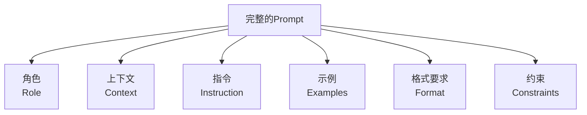
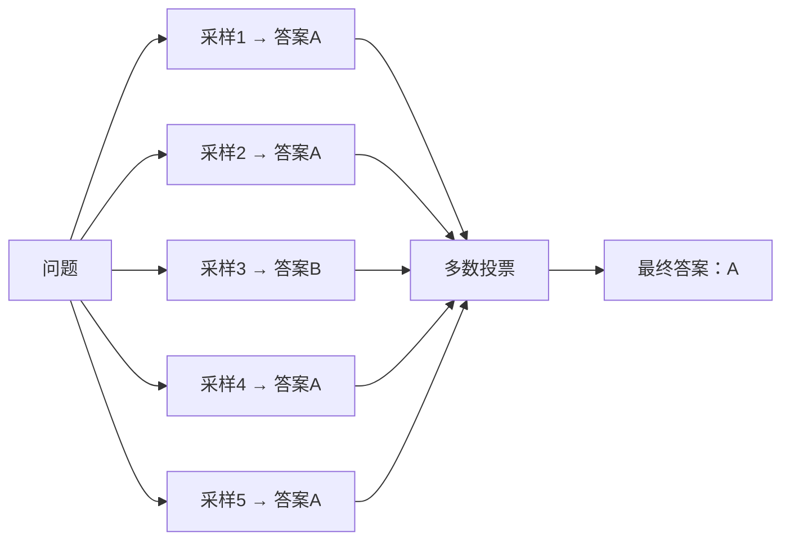
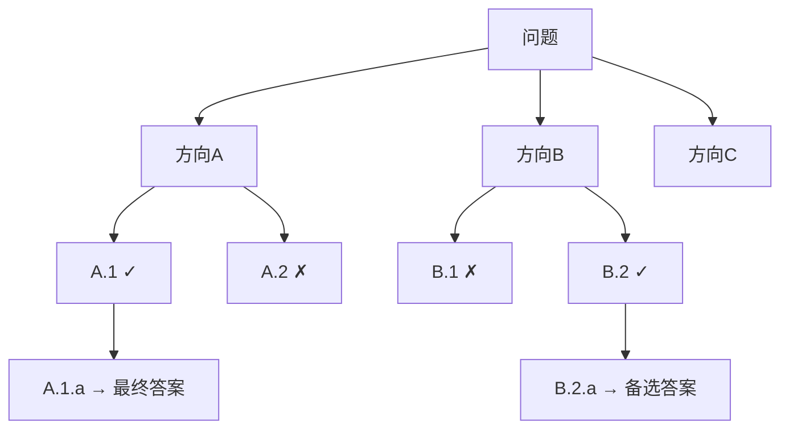
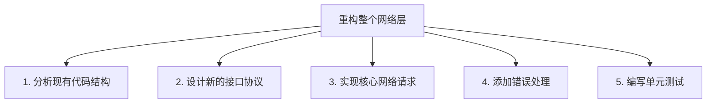
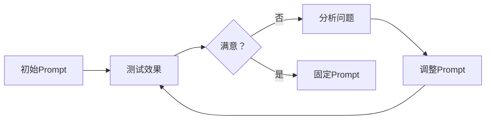

+++
title = "Prompt Engineering"
date = '2026-05-02T22:32:27+08:00'
draft = false
weight = 8
tags = ["AI", "LLM", "面试"]
categories = ["AI", "面试"]
+++
大语言模型（LLM）的能力边界很大程度上取决于你怎么跟它说话。同样的模型，一个精心设计的Prompt可以得到专业级的回答，一个随意的Prompt可能只得到平庸甚至错误的结果。Prompt Engineering就是研究如何有效地与LLM沟通的技术。

## 一、Prompt的基本构成

### 1.1 一个Prompt的解剖

一个高质量的Prompt通常包含以下要素：



| 要素 | 作用 | 示例 |
|------|------|------|
| 角色 | 设定模型的身份和专业背景 | "你是一位有10年经验的iOS架构师" |
| 上下文 | 提供背景信息 | "我们的项目使用MVVM架构，Swift语言" |
| 指令 | 明确说明任务 | "请review以下代码并指出问题" |
| 示例 | 展示期望的输入输出格式 | 给出一个输入-输出样例 |
| 格式要求 | 指定输出的结构 | "以Markdown表格形式输出" |
| 约束 | 限制条件 | "不超过500字""只使用Swift标准库" |

### 1.2 System Prompt vs User Prompt

在API调用中，消息分为不同的角色：

```json
{
  "messages": [
    {
      "role": "system",
      "content": "你是一位资深iOS开发工程师，擅长性能优化。回答时给出具体的代码示例。"
    },
    {
      "role": "user", 
      "content": "如何优化UITableView的滚动性能？"
    }
  ]
}
```

- **System Prompt**：设定模型的整体行为、角色和约束，贯穿整个对话
- **User Prompt**：具体的问题或指令
- **Assistant**：模型的历史回复，提供对话上下文

## 二、核心Prompt技术

### 2.1 Zero-Shot Prompting

直接给指令，不提供任何示例：

```
将以下文本分类为"正面"、"负面"或"中性"：
"这个App启动速度很快，但UI有点丑。"
```

适用于简单任务和能力强的大模型。

### 2.2 Few-Shot Prompting

通过少量示例来"教"模型期望的行为模式：

```
将以下文本分类情感。

文本："这个功能太棒了！"
分类：正面

文本："应用总是崩溃。"
分类：负面

文本："更新后界面有所改变。"
分类：中性

文本："这个App启动速度很快，但UI有点丑。"
分类：
```

Few-Shot的关键：
- 示例要覆盖不同的情况（包括边界案例）
- 示例的格式要与期望的输出一致
- 通常3~5个示例就足够了

### 2.3 Chain of Thought（思维链）

让模型"想一步说一步"，而不是直接给结论：

**没有CoT**：
```
Roger有5个网球。他又买了2罐网球，每罐3个。他现在有多少个网球？
答案：11个
```

**有CoT**：
```
Roger有5个网球。他又买了2罐网球，每罐3个。他现在有多少个网球？
让我们一步步思考：
1. Roger一开始有5个网球
2. 他买了2罐，每罐3个，所以买了 2 × 3 = 6 个
3. 总共有 5 + 6 = 11 个
答案：11个
```

CoT对推理类任务效果显著。简单的触发方式：在Prompt末尾加上 **"Let's think step by step"**。

### 2.4 ReAct（Reasoning + Acting）

结合推理和行动，模型交替进行"思考"和"调用工具"：

```
问题：2024年诺贝尔物理学奖得主的年龄总和是多少？

思考：我需要先查找2024年诺贝尔物理学奖的得主是谁。
行动：搜索 "2024年诺贝尔物理学奖得主"
观察：John Hopfield 和 Geoffrey Hinton

思考：现在我需要查找他们各自的出生年份来计算年龄。
行动：搜索 "John Hopfield 出生年份"
观察：1933年

思考：再查Geoffrey Hinton的出生年份。
行动：搜索 "Geoffrey Hinton 出生年份"
观察：1947年

思考：John Hopfield在2024年是91岁，Geoffrey Hinton是77岁。总和是91+77=168。
答案：168岁
```

ReAct是AI Agent的核心推理模式，后续文章会深入讲解。

### 2.5 Self-Consistency（自一致性）

对同一个问题用相同的CoT Prompt多次采样（用较高的温度），然后对多个答案取**多数投票**：



以数量换质量——多条推理路径更可能收敛到正确答案。

### 2.6 Tree of Thought（思维树）

CoT是一条线性推理链，ToT则将推理扩展为一棵树——每一步考虑多个可能的方向，评估后选择最优的分支继续：



适用于需要探索和回溯的复杂问题（如数学证明、策略规划）。

## 三、高级Prompt模式

### 3.1 结构化输出

强制模型输出特定格式（JSON、XML、表格等）：

```
分析以下代码的问题，以JSON格式输出：

{
  "issues": [
    {
      "severity": "high|medium|low",
      "line": "行号",
      "description": "问题描述",
      "fix": "修复建议"
    }
  ]
}
```

现代模型（GPT-4、Claude等）还支持在API层面强制JSON输出。

### 3.2 角色扮演与多角色辩论

让模型扮演多个角色从不同角度分析问题：

```
请分别从以下三个角色的视角评估"使用SwiftUI重写现有UIKit项目"这个决策：

1. **技术负责人**：关注技术可行性和团队技术栈
2. **产品经理**：关注交付时间和用户体验
3. **QA负责人**：关注测试覆盖和回归风险

每个角色给出明确的"支持/反对/有条件支持"立场和理由。
```

### 3.3 Mega-Prompt（超级提示词）

将多种技术组合成一个详尽的Prompt，适合复杂的持续性任务：

```
# 角色
你是一位资深的iOS架构师和代码审查专家。

# 背景
- 项目语言：Swift 5.9
- 最低支持：iOS 16
- 架构：MVVM + Coordinator
- 依赖管理：SPM

# 任务
对提交的代码进行全面审查。

# 审查维度
1. **架构一致性**：是否符合MVVM模式
2. **性能**：是否存在性能隐患
3. **安全性**：是否有内存泄漏、线程安全问题
4. **可维护性**：代码可读性、命名规范

# 输出格式
对每个问题使用以下格式：
- [严重程度] 文件:行号 - 问题描述
  建议：修复方案

# 约束
- 忽略纯风格问题（如空格、换行）
- 重点关注可能导致线上问题的bug
```

## 四、Prompt Engineering的原则

### 4.1 明确性原则

**差的Prompt**：
```
帮我写段代码。
```

**好的Prompt**：
```
用Swift编写一个URLSession网络请求封装，要求：
1. 支持GET和POST方法
2. 使用async/await
3. 自定义错误类型
4. 支持JSON解码为Codable对象
```

越具体，模型越能理解你的意图。

### 4.2 分治原则

复杂任务拆分为多个子任务，每个子任务用单独的Prompt完成：



而不是一个Prompt让模型完成所有事情。

### 4.3 迭代优化

Prompt Engineering是一个迭代过程：



常见的调整方向：
- 增加/减少约束
- 添加具体示例
- 调整指令的措辞
- 改变输出格式要求

### 4.4 常见的Prompt反模式

| 反模式 | 问题 | 改进 |
|--------|------|------|
| 过于模糊 | "帮我优化代码" | 指明优化的具体方向和约束 |
| 信息过载 | 一次给太多无关上下文 | 只提供与任务相关的信息 |
| 否定指令 | "不要使用第三方库" | 用肯定表述："只使用Swift标准库" |
| 假设模型知道上下文 | "继续上次的工作" | 在Prompt中提供完整上下文 |
| 多任务混杂 | 一个Prompt包含5个不同任务 | 拆分为多个独立的Prompt |

## 五、Prompt在工程中的管理

### 5.1 Prompt模板化

将经过验证的Prompt抽象为可复用的模板：

```python
REVIEW_TEMPLATE = """
你是一位{role}。

请审查以下{language}代码：

```{language}
{code}
```

关注以下方面：
{aspects}

以{format}格式输出审查结果。
"""
```

### 5.2 Prompt版本管理

像管理代码一样管理Prompt：

```
prompts/
├── code-review/
│   ├── v1.0.txt      # 初始版本
│   ├── v1.1.txt      # 增加了安全审查维度
│   └── v2.0.txt      # 重构为结构化输出
├── translation/
│   └── v1.0.txt
└── changelog.md       # 记录每次修改的原因和效果
```

### 5.3 Prompt评估

建立评估数据集，系统地衡量Prompt的效果：

| 指标 | 衡量内容 |
|------|---------|
| 准确率 | 输出是否正确 |
| 一致性 | 多次运行结果是否稳定 |
| 格式符合率 | 输出是否符合指定格式 |
| 延迟 | 由Prompt长度引起的响应时间变化 |
| 成本 | Token消耗量 |

## 六、总结

Prompt Engineering不是"玄学"，而是一套可系统化学习和实践的技术。核心原则可以归纳为：

1. **明确意图**：告诉模型你要什么，而不是让它猜
2. **提供上下文**：模型不知道你的项目背景，需要你提供
3. **给出示例**：一个好的示例胜过千言万语的描述
4. **引导推理**：对复杂问题，引导模型一步步思考
5. **迭代优化**：没有完美的第一版Prompt，持续调整

随着模型能力的增强，Prompt Engineering的重心正在从"如何让模型理解意图"转向"如何让模型高效完成复杂任务"——而这正是AI Agent要解决的问题。
