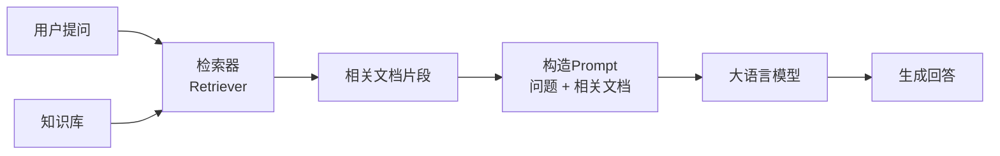
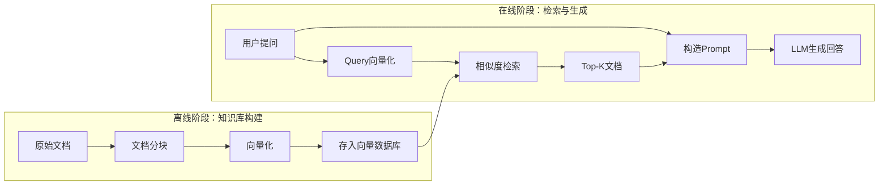
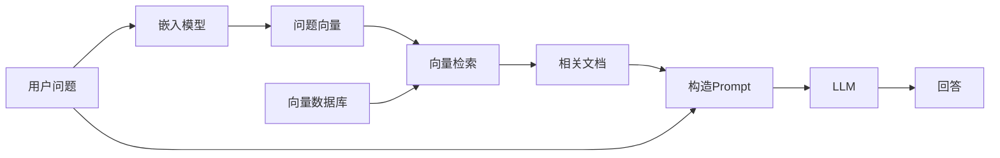
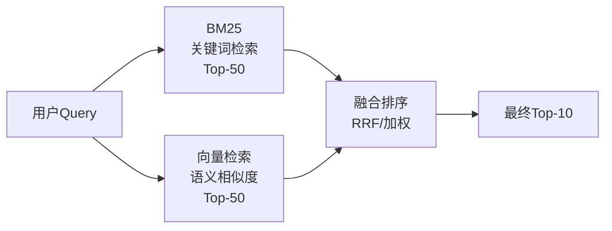
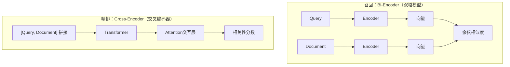
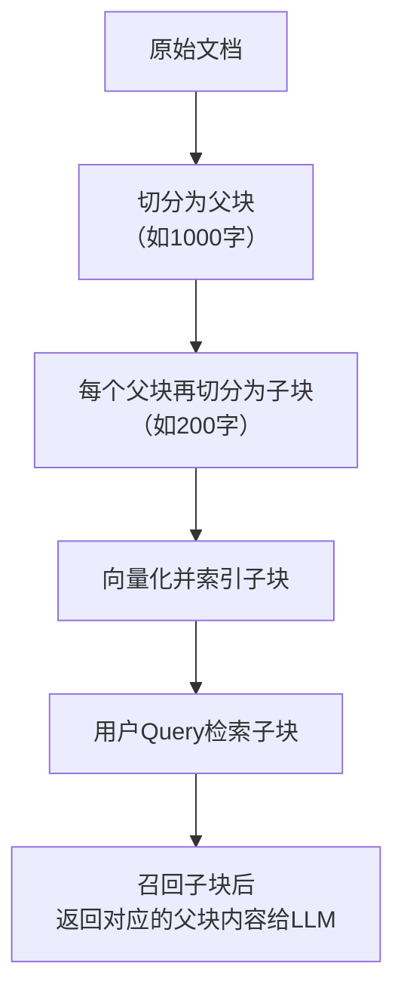
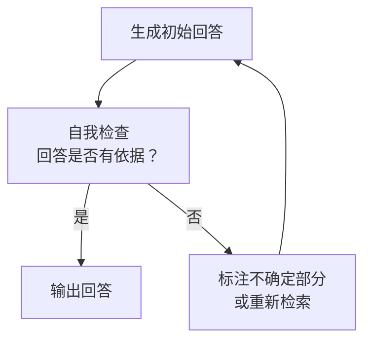
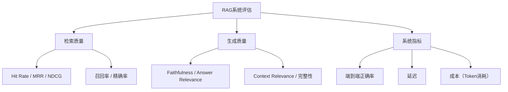
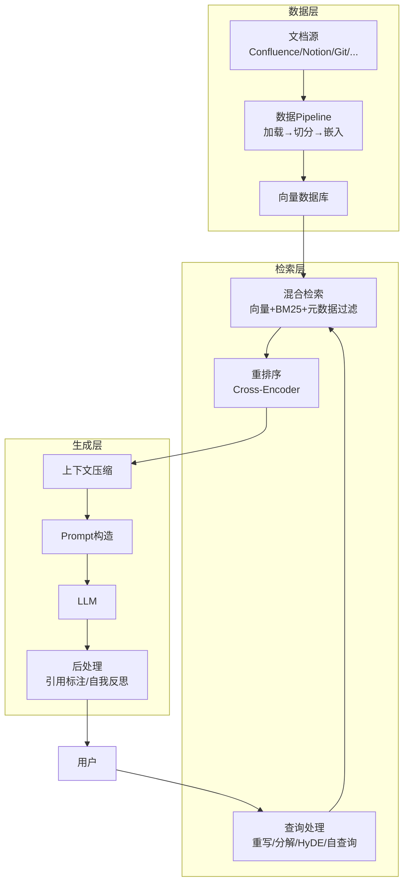
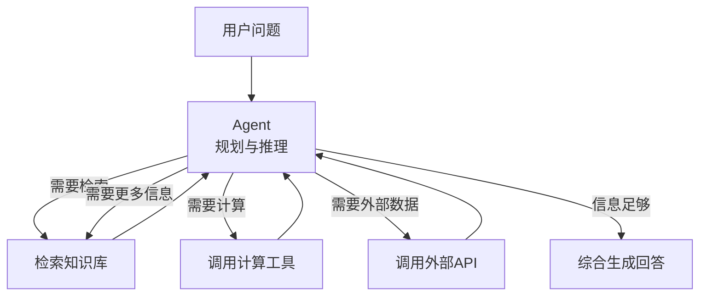

+++
title = "RAG（检索增强生成）"
date = '2026-05-02T22:32:27+08:00'
draft = false
weight = 9
tags = ["AI", "LLM", "面试"]
categories = ["AI", "面试"]
math = true
+++
大语言模型（LLM）能流畅地写文章、回答问题、编写代码，但它有一个根本性的局限：**它的知识被冻结在训练数据截止的那一刻**。问它昨天发生了什么新闻？不知道。问它你公司内部的技术文档？更不知道。

更棘手的是，LLM有时候会"一本正经地胡说八道"——这就是所谓的**幻觉（Hallucination）**问题。模型会自信满满地编造一个不存在的论文引用、一个错误的API参数、甚至一个虚构的历史事件。

**RAG（Retrieval-Augmented Generation，检索增强生成）**正是为解决这些问题而生。它的核心思想简单而有效：**在让LLM回答之前，先从外部知识库中检索相关信息，把这些信息塞到提示词（Prompt）里，让LLM基于真实资料来回答。**

## 一、RAG的核心思想

### 1.1 一个直觉的类比

想象你是一个闭卷考试的学生（这就是纯LLM）——只能靠记忆作答，记不清的地方就只能猜。

现在允许你带一本参考书（这就是RAG）——遇到不确定的问题，先翻书找到相关段落，然后基于书中的内容来组织答案。

显然，开卷考试的准确率会高得多。

### 1.2 RAG的核心价值

| LLM的局限 | RAG的解决方案 |
|-----------|-------------|
| 知识过期，无法获取训练截止后的信息 | 随时更新知识库，实时生效 |
| 幻觉问题，生成不存在的信息 | 基于真实文档生成，可追溯来源 |
| 垂直领域知识不足 | 接入专业知识库，提供领域专业回答 |
| 更新成本高，Fine-tuning代价大 | 只需更新知识库，成本低且灵活 |

### 1.3 RAG的基本流程



三个核心步骤：

1. **检索（Retrieve）**：根据用户的问题，从知识库中找到最相关的文档片段
2. **增强（Augment）**：将检索到的信息与原始问题一起构造成Prompt
3. **生成（Generate）**：LLM基于增强后的Prompt生成回答

## 二、从关键词到语义：检索方式的演进

### 2.1 传统关键词搜索的局限

最简单的检索方式是关键词匹配。比如用户问"如何购买商品？"，搜索引擎会提取关键词"购买"、"商品"，然后去匹配包含这些词的文档。

问题很明显：

- 文档中写的是"下单流程说明"——语义完全一致，但**没有任何关键词重合**
- 无法理解同义词："购买"vs"下单"vs"采购"vs"买"
- 必须精确匹配关键词，用词不同就检索不到

我们需要一种理解语义的检索方式。

### 2.2 文本嵌入（Text Embedding）

**文本嵌入模型**（如OpenAI的text-embedding-3-small、BGE等）将文本转换为高维向量（通常512/768/1024/1536维），使得语义相近的文本在向量空间中距离相近：

```
"如何购买商品？"      → [0.23, -0.15, 0.82, ...]  (768维向量)
"下单流程说明"        → [0.21, -0.12, 0.79, ...]  ← 向量很近，语义匹配!
"今天天气真好"        → [-0.65, 0.43, -0.21, ...] ← 向量很远
```

在高维向量空间中，每个维度代表不同的语义特征（如情感倾向、主题领域、动作类型等）。语义相似的文本会在空间中聚集在一起——"购买"、"下单"、"采购"形成一个语义簇，而"天气预报"则远离这个簇。

#### 与Transformer中Embedding的对比

在[Transformer架构]()中也有Embedding层，两者的目的和特性有显著区别：

| 维度 | Transformer词嵌入 | RAG文本嵌入 |
|------|-------------------|-------------|
| 嵌入粒度 | Token级别：每个token一个向量 | 文本级别：整段文本压缩成一个向量 |
| 核心目的 | 作为模型的输入表示，供后续Attention层处理 | 直接用于语义检索，衡量文本间的相似度 |
| 训练目标 | 预测下一个token（自监督），嵌入在训练中自然学到 | 专门为语义相似度优化（对比学习），使相似文本距离近 |
| 输出维度 | 较大（如GPT-3为12288维），因为要承载丰富的语义信息供后续层使用 | 较小（如text-embedding-3-small为1536维），因为要高效存储和检索 |
| 位置信息 | 需要叠加位置编码，模型需要知道token的顺序 | 不需要位置编码，最终输出是位置无关的整体语义表示 |
| 使用方式 | 中间表示，输入到Attention和FFN层做进一步计算 | 最终产物，直接用于向量相似度计算 |

直觉理解：

```
Transformer Embedding:            RAG Embedding:
"如何购买商品"                     "如何购买商品"
↓ Token化                         ↓ 整句编码
["如何", "购买", "商品"]           整个句子一个向量
↓ 每个Token一个向量                [0.23, -0.45, ..., 0.12]
[v1, v2, v3]                      (直接用于检索匹配)
↓ 送入Attention层继续处理
```

Transformer的Embedding是模型内部的"起点"，token级别的向量还要经过几十层注意力和前馈网络才发挥作用；而RAG的文本嵌入是一个独立的"终点"，整段文本被压缩成一个向量，直接用来做检索匹配。

实际上，许多文本嵌入模型（如BGE、E5）本身就是基于Transformer架构构建的——它们使用Transformer的Encoder来处理输入文本，然后对最后一层所有token的输出做池化（如取`[CLS]`向量或平均池化），得到一个代表整段文本的单一向量。

### 2.3 向量相似度度量

有了向量表示后，如何量化两个向量之间的"距离"？主流有两种方式：

#### 余弦相似度（Cosine Similarity）

$$\text{cos\_sim}(\mathbf{a}, \mathbf{b}) = \frac{\mathbf{a} \cdot \mathbf{b}}{||\mathbf{a}|| \cdot ||\mathbf{b}||}$$

- 计算两个向量的夹角
- 值域为 $[-1, 1]$，越接近1表示越相似
- **只关注方向，不考虑向量长度**——适合文本检索，因为我们关心的是语义方向而非文本长度

#### 欧氏距离（Euclidean Distance）

$$d(\mathbf{a}, \mathbf{b}) = \sqrt{\sum_{i}(a_i - b_i)^2}$$

- 计算两个向量在空间中的直线距离
- 值域为 $[0, +\infty)$，**距离越小越相似**（注意方向与余弦相似度相反）
- 同时考虑方向和长度

实践中，**余弦相似度更常用于文本检索**，因为它更关注语义方向而非文本长度差异。一篇很长的文档和一个简短的问题，只要语义方向一致，余弦相似度就会很高。

### 2.4 向量数据库

当知识库包含数百万个文档片段时，不可能逐一比较。**向量数据库**通过近似最近邻（ANN）算法实现高效检索。

#### 传统数据库 vs 向量数据库

| 对比维度 | 传统数据库 | 向量数据库 |
|---------|-----------|-----------|
| 查询方式 | 精确匹配（WHERE id=123） | 相似度搜索（找最近的K个向量） |
| 索引结构 | B-Tree、Hash | HNSW、IVF |
| 典型场景 | 结构化数据查询 | 语义检索、推荐系统 |

#### 存储结构

向量数据库中的每条记录通常包含向量、原始文本和元数据：

```json
{
  "id": "doc_001",
  "vector": [0.23, -0.45, 0.67, ..., 0.12],
  "text": "购买商品的步骤是...",
  "metadata": {
    "source": "用户手册",
    "category": "购物",
    "timestamp": "2024-01-01"
  }
}
```

元数据在后续的过滤和追溯中非常有用。

#### 主流向量数据库

| 向量数据库 | 特点 |
|-----------|------|
| FAISS | Meta开源，高性能，支持GPU加速 |
| Pinecone | 全托管云服务，开箱即用 |
| Weaviate | 开源，支持混合搜索 |
| Chroma | 轻量级，适合原型开发 |
| Milvus | 开源，面向大规模场景 |
| Qdrant | 开源，Rust实现，高性能 |

#### ANN索引算法

核心挑战是在百万级向量中实现毫秒级检索。常用算法：

- **HNSW（Hierarchical Navigable Small World）**：构建多层跳表式的图结构，从顶层粗粒度搜索逐渐下沉到底层精细搜索。召回率可达95%以上
- **IVF（Inverted File Index）**：先将向量空间聚类，查询时只在最近的几个聚类中搜索，内存友好
- **PQ（Product Quantization）**：将高维向量压缩为短码，大幅减少内存占用

这些算法以亚线性的复杂度完成检索——百万级向量的查询延迟通常在10ms以内。

## 三、RAG的完整Pipeline

RAG的流程分为两个阶段：**离线阶段（向量化）** 和 **在线阶段（检索生成）**。



### 3.1 离线阶段：知识库构建

#### 3.1.1 文档加载

将各种格式的文档转换为纯文本：PDF、Word、HTML、Markdown、数据库记录等。针对不同格式需要专门的解析策略——PDF需要提取表格结构，代码文件按函数分块，Markdown按标题层级切分，以保留格式语义。

#### 3.1.2 文档切分（Chunking）

这是RAG中最关键且最容易被低估的环节。为什么要切分？

- LLM的上下文窗口有限（4K/8K/32K/128K），不能把整篇文档都塞进去
- 嵌入模型对长文本的语义表示质量下降
- 精确检索需要更细粒度的文本单元

常用的切分策略：

| 策略 | 方式 | 优点 | 缺点 |
|------|------|------|------|
| 固定长度切分 | 每N个字符切一刀 | 简单，大小均匀 | 可能切断语义 |
| 按段落/句子切分 | 以自然段落或句子为边界 | 保持语义完整 | 长度不均匀 |
| 递归切分 | 先按大块切，大块太长则递归细分 | 灵活平衡 | 实现稍复杂 |
| 语义切分 | 用嵌入模型判断语义边界 | 语义最完整 | 计算成本高 |
| 滑动窗口切分 | 相邻chunk之间保留Overlap重叠 | 避免边界信息丢失 | 冗余增加 |
| 结构化切分 | 按标题层级、标签切分（Markdown/HTML） | 保留文档结构，语义边界清晰 | 依赖文档格式规范 |

**重叠（Overlap）** 是一个重要的技巧：相邻的chunk之间保留一部分重叠文本，避免关键信息恰好被切断在边界上。

```
原文:  [        Chunk 1        ]
                     [        Chunk 2        ]
                                  [        Chunk 3        ]
       ←──────→ ←──→ ←──────→ ←──→ ←──────→
        独有部分  重叠   独有部分  重叠   独有部分
```

#### 3.1.3 嵌入与存储

对每个chunk调用嵌入模型生成向量，连同原始文本和元数据一起存入向量数据库。

### 3.2 在线阶段：检索与生成



> **关键约束**：Query向量化必须使用与文档向量化**相同的Embedding模型**，否则它们处于不同的向量空间，无法进行有意义的相似度比较。

#### 3.2.1 召回策略

从向量数据库中选择文档有两种主要策略：

**Top-K 召回**：返回相似度排名前K的文档。

```
K = 5，返回相似度最高的5个文档：
[Doc1: 0.92, Doc2: 0.87, Doc3: 0.81, Doc4: 0.76, Doc5: 0.45]
```

- 优点：固定数量，结果可控
- 缺点：可能包含不相关的低分文档（如Doc5只有0.45）

**相似度阈值**：只返回相似度超过阈值的文档。

```
阈值 = 0.7，只返回相似度 > 0.7 的文档：
[Doc1: 0.92, Doc2: 0.87, Doc3: 0.81, Doc4: 0.76]
// Doc5: 0.45 被过滤
```

- 优点：保证质量，过滤不相关文档
- 缺点：结果数量不固定，可能为空

实践中通常**结合使用**：先Top-K召回，再用阈值过滤掉低分文档。

#### 3.2.2 构造Prompt

将检索到的文档与问题组合成Prompt：

```
请根据以下参考资料回答用户的问题。如果参考资料中没有相关信息，请说明你不确定。

参考资料：
[文档片段1]
[文档片段2]
[文档片段3]

用户问题：如何在iOS中实现启动优化？
```

#### 3.2.3 生成

LLM基于带有上下文的Prompt生成回答。因为有真实文档作为依据，幻觉率大幅降低。

## 四、高级RAG技术

基础RAG虽然有效，但在实际应用中会遇到各种挑战。以下是一系列优化技术。

### 4.1 查询优化

用户的原始问题不一定适合直接用于检索。

#### 查询重写（Query Rewriting）

让LLM先改写用户的问题，使其更适合检索：

```
原始问题: "为什么我的App启动这么慢？"
重写后:   "iOS应用冷启动优化方法 启动耗时分析 dyld加载优化"
```

#### 查询分解（Query Decomposition）

将复杂问题拆解为多个子问题，分别检索后综合：

```
原始问题: "对比MVVM和MVC架构在iOS中的优缺点"
子问题1: "iOS中MVVM架构的优点和缺点"
子问题2: "iOS中MVC架构的优点和缺点"
子问题3: "MVVM和MVC的对比分析"
```

#### HyDE（Hypothetical Document Embeddings）

先让LLM生成一个"假设的答案文档"，用这个假设文档（而不是问题本身）去做检索。因为假设文档与真实文档在语义空间中更近：


#### 自查询（Self-Query）

让LLM从自然语言问题中自动提取元数据过滤条件，缩小检索范围：

```
用户问题: "最近3个月关于Python的技术文档"
↓ LLM提取
语义查询: "Python技术文档"
过滤条件: category="技术文档", date > 2024-08, language="Python"
```

### 4.2 检索优化

#### BM25关键词检索

**BM25（Best Matching 25）** 是经典的关键词检索算法，基于TF-IDF的改进版本。它的核心思想是：

$$\text{BM25} = \text{词频(TF)} \times \text{稀有度(IDF)} \times \text{长度归一化}$$

- **词频**：关键词在文档中出现越多，得分越高（但有饱和效应，避免长文档刷分）
- **稀有度**：越罕见的词权重越高（"的"出现在几乎所有文档中，权重很低；"dyld"只出现在特定文档中，权重很高）
- **长度归一化**：避免长文档天然占优

BM25的优势在于对**精确匹配**的能力——专有名词、代码片段、ID编号等不需要语义理解的检索场景。

#### 混合检索（Hybrid Search）

结合稀疏检索（BM25关键词）和稠密检索（向量语义），取两者之长：



| 检索方式 | 优势 | 劣势 |
|---------|------|------|
| BM25关键词检索 | 精确匹配能力强（专有名词、代码、ID） | 无法理解同义词和语义 |
| 向量语义检索 | 语义理解能力强（同义词、改写） | 对精确匹配不如关键词 |
| 混合检索 | 兼顾精确匹配和语义理解 | 实现和调参更复杂 |

**RRF（Reciprocal Rank Fusion）**是常用的融合方法：

$$\text{RRF}(d) = \sum_{r \in R} \frac{1}{k + \text{rank}_r(d)}$$

对于每个检索器 $r$，文档 $d$ 的排名越靠前，得分越高。$k$ 是平滑常数（通常取60）。

实践表明，**混合检索通常比单一检索方式提升15-20%的效果**。

#### 重排序（Re-ranking）

初始检索（召回阶段）追求速度，需要处理百万级文档，用的是较轻量的模型。召回后，用一个更精确（但更慢）的模型对Top-K结果重新排序：

```
向量检索 Top-50 → Rerank精排模型 → 最终 Top-5
```

**为什么需要Rerank？** 向量检索使用的是Bi-Encoder（双塔模型），Query和Document独立编码，无法捕捉它们之间的交互关系。Rerank使用Cross-Encoder（交叉编码器），将Query和Document拼接后联合编码，精度更高。



| 对比维度 | Bi-Encoder（召回） | Cross-Encoder（精排） |
|---------|-------------------|---------------------|
| 编码方式 | Query和Document独立编码 | Query和Document联合编码 |
| 交互程度 | 只在最后做向量相似度计算 | 每个token在Attention层中互相关注 |
| 速度 | 快，文档向量可预先计算，复杂度O(1) | 慢，每对(Query, Document)都要重新计算 |
| 精度 | 较低，无法捕捉细粒度交互 | 较高，能理解Query和Document的深层关系 |
| 适用规模 | 百万级检索 | 百级精排 |

实际案例：

```
Query: "Python异步编程用什么库？"

召回Top1: "Python异步编程是一种并发编程范式"        (0.88)  ← 语义相近但没回答问题
召回Top2: "asyncio是Python标准库的异步IO框架"      (0.85)

Rerank后: "asyncio是Python标准库的异步IO框架"      (0.95) ← 精排后排到第一
```

#### 多路召回融合（Multi-Recall Fusion）

同时使用多个Embedding模型召回，用RRF等算法融合结果。不同模型对不同类型的文本有各自的优势，融合后效果更好。

#### 元数据过滤（Metadata Filtering）

结合结构化过滤条件缩小检索范围，减少噪声：

```
检索条件 = 语义相似度Top-10 + category="技术文档" + date > "2024-01-01"
```

### 4.3 索引优化

#### 父子分块（Parent-Child Chunking）

核心思想：**小块检索，大块使用**——用小粒度提高召回精准度，用大粒度保证上下文完整性。



- 优势：子块语义更聚焦、检索更准确；返回父块避免信息碎片化，LLM获得更充分的背景信息
- 挑战：需要同时存储父块和子块，维护父子关系的索引；返回父块会增加Token消耗

#### 层级索引（Hierarchical Index）

对文档建立多层索引：先检索摘要找到相关文档，再检索具体段落：

```
第一层: 文档摘要索引 → 找到相关文档
第二层: 段落级索引   → 在相关文档中找到具体段落
```

#### 知识图谱增强

将文档中的实体和关系提取为知识图谱，检索时不仅用向量相似度，还利用图结构进行多跳推理：

```
问题: "张三的导师发表过哪些关于Transformer的论文？"

知识图谱:
  张三 --导师--> 李四
  李四 --发表--> "Attention Is All You Need"
  李四 --发表--> "BERT: Pre-training..."
```

### 4.4 生成优化

#### 上下文压缩（Context Compression）

召回的文档中可能包含大量与问题无关的内容。上下文压缩用LLM提取与问题最相关的片段，去除冗余信息：

- 减少Token消耗
- 提高LLM对关键信息的关注度
- 避免无关信息干扰回答质量

#### 引用标注

让LLM在回答中标注信息来源，便于用户验证：

```
根据公司技术文档[1]，iOS应用的冷启动优化主要从以下方面入手：
1. 减少动态库数量[1]
2. 优化+load方法[2]
3. 延迟非必要的初始化[2]

[1] 《启动优化指南》第3章
[2] 《性能优化实践》第5.2节
```

#### 自我反思（Self-Reflection）

让LLM检查自己的回答是否完全基于检索到的文档，如果发现自己在"编造"，则修正：



### 4.5 其他优化手段

| 优化手段 | 思路 | 适用场景 |
|---------|------|---------|
| Embedding模型微调 | 使用领域数据对Embedding模型进行微调 | 垂直领域，专业术语多 |
| 文档格式针对性优化 | 针对PDF/Markdown/表格/代码采用专门的解析和分块策略 | 多格式文档混合的知识库 |
| 多路召回融合 | 同时使用多个Embedding模型召回，融合结果 | 对召回率要求高的场景 |
| 元数据过滤 | 结合结构化过滤条件缩小检索范围 | 知识库有明确分类的场景 |
| 上下文压缩 | 召回后用LLM提取与问题最相关的片段 | Token消耗敏感的场景 |
| 自查询 | 让LLM从自然语言中提取过滤条件 | 用户查询包含时间/分类等结构化信息 |

## 五、RAG vs. 微调

| 维度 | RAG | 微调（Fine-tuning） |
|------|-----|---------------------|
| 知识更新 | 更新知识库即可，实时生效 | 需要重新训练，成本高 |
| 幻觉控制 | 有明确的来源，可追溯 | 仍可能产生幻觉 |
| 成本 | 推理时增加检索和上下文成本 | 训练成本高，推理成本不变 |
| 适用场景 | 需要实时/专有知识、需要引用来源 | 需要改变模型的行为模式或风格 |
| 知识深度 | 受限于知识库质量和检索质量 | 知识内化到模型参数中 |

在实践中，两者常常结合使用：先用RAG提供领域知识，再用微调让模型更好地利用检索到的信息。

## 六、RAG的评估

### 6.1 检索质量评估

| 指标 | 定义 | 说明 |
|------|------|------|
| Hit Rate（命中率） | Top-K结果中至少包含一个正确答案的比例 | 命中次数 / 总查询次数 |
| MRR（Mean Reciprocal Rank） | 首个正确答案排名的倒数平均值 | 正确答案在第2位，MRR = 1/2 = 0.5 |
| NDCG（归一化折损累计增益） | 综合考虑相关性和位置的排序质量 | 位置越靠前的文档权重越高 |
| 召回率（Recall） | 相关文档中被检索到的比例 | 衡量"有没有漏掉" |
| 精确率（Precision） | 检索到的文档中相关文档的比例 | 衡量"有没有噪声" |

### 6.2 生成质量评估

| 指标 | 定义 | 说明 |
|------|------|------|
| Faithfulness（忠实度） | 生成答案是否基于检索到的文档 | 避免幻觉，确保可追溯性 |
| Answer Relevance（答案相关性） | 答案是否直接回答了用户的问题 | 通常用LLM-as-Judge评估 |
| Context Relevance（上下文相关性） | 检索到的文档与问题的相关程度 | 减少无关信息对生成的干扰 |
| 完整性 | 回答是否覆盖了问题的各个方面 | 避免遗漏关键信息 |

**LLM-as-Judge** 是目前评估生成质量的主流方法：用一个LLM来判断另一个LLM的输出质量，相比人工评估更高效，相比规则匹配更灵活。

### 6.3 系统整体评估



### 6.4 常用评估框架

| 框架 | 特点 |
|------|------|
| RAGAS | 端到端RAG自动化评估框架，计算忠实度、答案相关性、上下文精确率等 |
| TruLens | LLM应用可观测性平台，提供多维度评估仪表盘 |
| LlamaIndex Eval | LlamaIndex内置的评估模块 |
| LangSmith | LangChain的评估和监控平台 |

## 七、RAG的工程实践

### 7.1 主流RAG框架

| 框架 | 特点 |
|------|------|
| LangChain | 最流行的LLM应用框架，组件丰富 |
| LlamaIndex | 专注于RAG和数据索引 |
| Haystack | 端到端NLP框架，支持复杂Pipeline |
| Semantic Kernel | 微软出品，企业级 |

### 7.2 一个典型RAG系统的架构



### 7.3 常见的坑与应对

| 问题 | 原因 | 解决方案 |
|------|------|---------|
| 检索不到相关文档 | chunk太大/太小、嵌入模型不适配 | 调整chunk大小、尝试不同嵌入模型、混合检索 |
| 检索到了但答案不对 | LLM未能利用上下文 | 优化Prompt模板、增加few-shot示例、上下文压缩 |
| 回答包含幻觉 | 检索结果不够相关 | 加强重排序、添加自我反思环节 |
| 延迟太高 | 检索+生成双重延迟 | 缓存热点查询、流式输出、预检索 |
| 答案信息过时 | 知识库未及时更新 | 建立增量更新Pipeline |
| 专有名词检索不到 | 向量检索对精确匹配弱 | 混合检索（BM25 + 向量） |

## 八、RAG的挑战与演进方向

### 8.1 RAG面临的核心挑战

| 挑战 | 描述 |
|------|------|
| 检索召回失败 | Query改写不当、分块策略不合理导致相关文档未被召回 |
| 上下文窗口限制 | 召回文档过多无法全部放入，需平衡检索精度与上下文长度 |
| 多跳推理能力弱 | 单次检索难以解决需要多步推理和信息综合的复杂问题 |

### 8.2 Agentic RAG与Agentic Search

将RAG与Agent结合，让模型自主决定何时检索、检索什么、如何利用检索结果：



#### RAG vs Agentic Search

| 维度 | 传统RAG | Agentic Search |
|------|---------|---------------|
| 模式 | 单次检索 → 生成答案 | 规划 → 多次检索 → 推理 → 综合答案 |
| 优势 | 响应快速、架构简单、成本可控 | 自主规划、多跳推理、工具调用 |
| 劣势 | 无法动态调整检索策略，缺乏推理规划能力 | 延迟高、成本高、复杂度高、可控性弱 |
| 适用场景 | 简单问答、知识查询、文档问答 | 复杂分析、多源信息整合、需要实时数据 |

**技术路线选择**：

- **简单场景**：传统RAG即可满足
- **中等复杂度**：RAG + Rerank + 混合检索
- **高复杂度**：Agentic Search（需权衡成本和延迟）

### 8.3 Graph RAG

微软提出的Graph RAG将知识图谱与RAG深度结合：

1. 从文档中提取实体和关系，构建知识图谱
2. 对知识图谱做社区检测，生成不同粒度的摘要
3. 查询时利用图结构进行推理

特别适合需要全局理解（如"总结所有安全事件的共同模式"）的场景。

### 8.4 多模态RAG

不局限于文本，支持图片、表格、代码等多种模态的检索和理解：

- 图片：用多模态嵌入模型（如CLIP）将图片和文本映射到同一向量空间
- 表格：专门的表格理解模型提取结构化信息
- 代码：代码嵌入模型（如CodeBERT）理解代码语义

## 九、总结

RAG是连接LLM与现实世界知识的桥梁。它的核心价值在于：

1. **知识实时性**：无需重新训练模型即可更新知识
2. **减少幻觉**：基于真实文档回答，可追溯来源
3. **数据隐私**：私有数据不需要传给模型提供商训练
4. **成本效率**：比微调大模型便宜得多

RAG不是一个单一的技术，而是一个系统工程。从文档切分、嵌入选择、检索策略到Prompt设计，每个环节都会影响最终效果。理解这些环节的原理和权衡，才能构建出真正好用的RAG系统。
