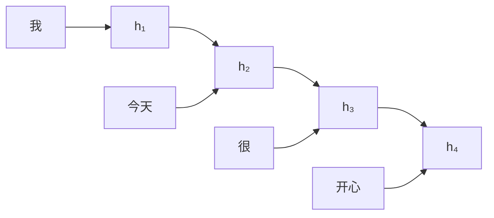
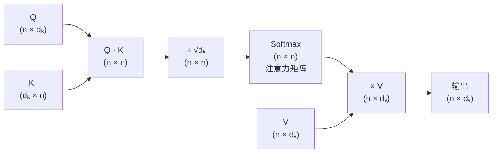
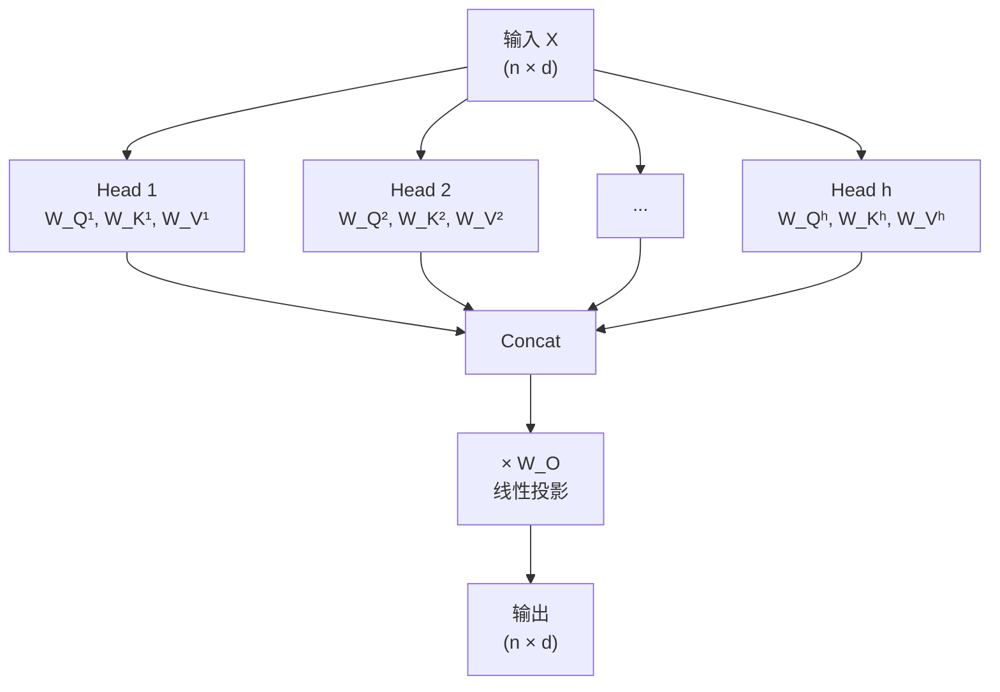
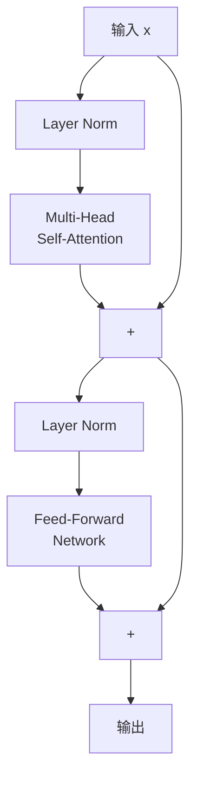
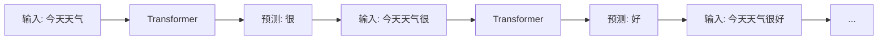
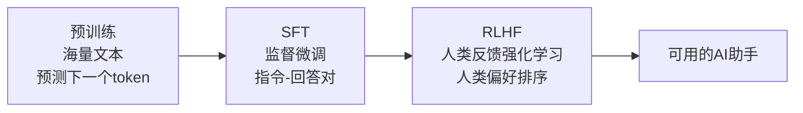

+++
title = "Transformer架构原理"
date = '2026-05-02T22:32:27+08:00'
draft = false
weight = 10
tags = ["AI", "LLM", "面试"]
categories = ["AI", "面试"]
+++
ChatGPT、Claude、Gemini——这些模型的核心都是同一个架构：**Transformer**。它在2017年由Google的论文"Attention Is All You Need"提出，彻底改变了自然语言处理（NLP）领域，随后席卷了计算机视觉、语音、蛋白质折叠等几乎所有AI领域。

我们从最直觉的角度出发，一步步搞清楚Transformer到底在做什么。

## 一、从序列到序列：Transformer要解决什么问题

### 1.1 语言的本质是序列

一句话是一个词的序列：

```
"我 今天 很 开心"  →  [我, 今天, 很, 开心]
```

语言模型的核心任务是：给定前面的词，预测下一个词。

```
"我 今天 很" → ?（开心？难过？忙碌？）
```

但词与词之间的关系非常复杂。"它"指代谁？"银行"是河岸还是金融机构？这取决于上下文中其他词的信息。

### 1.2 RNN的困境

在Transformer之前，处理序列的主流方法是循环神经网络（RNN）。RNN像一个人从左到右逐词阅读，用一个"记忆状态"来记住看过的内容：



问题在于：
- **长距离依赖困难**：信息需要经过很多步才能从序列开头传到末尾，容易丢失
- **无法并行**：必须逐步处理，前一步完成才能开始后一步，训练很慢

Transformer的核心洞察是：**不需要逐步处理，让序列中的每个位置直接与所有其他位置交互**。这就是"注意力（Attention）"机制。

## 二、词嵌入：给词语一个数学身份

### 2.1 从独热编码到词向量

计算机不认识"猫"、"狗"这样的文字。我们需要把词转换成数字。

最朴素的方式是**独热编码（One-Hot Encoding）**：假设词汇表有50,000个词，每个词用一个50,000维的向量表示，只有对应位置是1，其余全是0。

```
"猫" → [0, 0, ..., 1, ..., 0, 0]    (第3721个位置是1)
"狗" → [0, 0, ..., 0, 1, ..., 0, 0]  (第5042个位置是1)
```

问题：在这种表示下，"猫"和"狗"的距离与"猫"和"经济学"的距离一样远——完全丢失了语义信息。

**词嵌入（Word Embedding）**把每个词映射到一个低维稠密向量（通常几百到几千维），使得语义相近的词在向量空间中也相近：

```
"猫" → [0.21, -0.45, 0.73, 0.12, ...]   (d维向量)
"狗" → [0.19, -0.41, 0.68, 0.15, ...]   (与"猫"很近)
"经济" → [-0.82, 0.33, -0.15, 0.91, ...] (与"猫"很远)
```

### 2.2 Token与分词

现代语言模型并不以"词"为单位，而是以 **Token** 为单位。Tokenizer会将文本切分成子词（subword）：

```
"unhappiness" → ["un", "happi", "ness"]
```

这样做的好处是：
- 词汇表大小可控（通常30,000~100,000个token）
- 能处理从未见过的新词（通过子词组合）

在后续的讨论中，我们用"token"代替"词"。

### 2.3 位置编码

注意力机制是对称的——它不关心token的顺序。但"猫吃鱼"和"鱼吃猫"的含义完全不同。

**位置编码（Positional Encoding）**给每个位置添加一个独特的"位置信号"，让模型知道token的顺序。

原始论文使用正弦/余弦函数：

$$PE_{(pos, 2i)} = \sin\left(\frac{pos}{10000^{2i/d}}\right)$$
$$PE_{(pos, 2i+1)} = \cos\left(\frac{pos}{10000^{2i/d}}\right)$$

其中 $pos$ 是位置，$i$ 是维度索引，$d$ 是嵌入维度。

直觉理解：每个位置对应一个独特的频率组合，就像给每个座位分配了一个独特的"频率指纹"。不同频率的正弦波在不同位置交织出独特的模式，让模型能区分位置1和位置100。

最终，每个token的初始表示 = 词嵌入 + 位置编码：

$$\mathbf{x}_i = \text{Embedding}(\text{token}_i) + \text{PE}(i)$$

## 三、注意力机制：Transformer的灵魂

### 3.1 注意力的直觉

考虑这个句子：

> "那只猫坐在垫子上，因为**它**很舒服。"

"它"指的是什么？是"猫"还是"垫子"？人类靠上下文理解——"舒服"更像是形容"垫子"的属性，所以"它"更可能指"垫子"。

注意力机制做的事情类似：**对于序列中的每个token，计算它应该"关注"其他哪些token多少。**

### 3.2 Query、Key、Value

注意力机制的核心概念可以用一个图书馆的类比来理解：

- **Query（查询）**：你去图书馆时心里想要找什么——"我想了解猫的行为"
- **Key（键）**：每本书封面上的标签——"动物行为学"、"量子物理"、"烹饪指南"
- **Value（值）**：每本书的实际内容

你用自己的Query与每本书的Key比对，找到匹配程度最高的书，然后主要阅读这些书的Value。

在Transformer中：

每个token的嵌入向量 $\mathbf{x}$ 通过三个不同的线性变换，生成三个向量：

$$\mathbf{q}_i = W_Q \mathbf{x}_i \quad \text{（Query：我在找什么信息？）}$$
$$\mathbf{k}_i = W_K \mathbf{x}_i \quad \text{（Key：我能提供什么信息？）}$$
$$\mathbf{v}_i = W_V \mathbf{x}_i \quad \text{（Value：我的实际内容）}$$

$W_Q$、$W_K$、$W_V$ 是可学习的参数矩阵。

### 3.3 注意力分数

Query和Key的点积衡量"匹配程度"：

$$\text{score}(i, j) = \mathbf{q}_i \cdot \mathbf{k}_j = \mathbf{q}_i^T \mathbf{k}_j$$

分数越高，表示token $i$ 越应该关注token $j$。

直觉理解点积：两个向量方向越一致（指向相似的方向），点积越大。Query和Key如果在向量空间中"指向同一方向"，意味着它们语义匹配度高。

### 3.4 缩放与Softmax

计算所有token对之间的分数后，需要两个处理步骤：

**缩放（Scaling）**：

$$\text{score}(i, j) = \frac{\mathbf{q}_i^T \mathbf{k}_j}{\sqrt{d_k}}$$

除以 $\sqrt{d_k}$（$d_k$ 是Key向量的维度）。为什么？如果 $d_k$ 很大，点积的值也会很大，导致Softmax输出极端（接近one-hot），梯度几乎为零。缩放让分布更平滑。

**Softmax归一化**：

$$\alpha_{ij} = \text{softmax}_j\left(\frac{\mathbf{q}_i^T \mathbf{k}_j}{\sqrt{d_k}}\right) = \frac{e^{\text{score}(i,j)}}{\sum_{l} e^{\text{score}(i,l)}}$$

Softmax将分数转换为概率分布：所有 $\alpha_{ij}$ 之和为1。$\alpha_{ij}$ 就是token $i$ 对token $j$ 的**注意力权重**。

### 3.5 加权聚合

最后，用注意力权重对所有Value向量做加权平均：

$$\text{Attention}(\mathbf{q}_i) = \sum_{j} \alpha_{ij} \mathbf{v}_j$$

直觉：每个token的新表示是所有token Value的加权组合，权重取决于Query-Key的匹配程度。关注度越高的token，其Value贡献越大。

### 3.6 矩阵形式

把所有token的Q、K、V堆叠成矩阵，整个注意力计算可以一行写完：

$$\text{Attention}(Q, K, V) = \text{softmax}\left(\frac{QK^T}{\sqrt{d_k}}\right)V$$

这个公式就是著名的 **Scaled Dot-Product Attention**。

让我们拆解这个矩阵运算的每一步：



其中 $n$ 是序列长度。$QK^T$ 的结果是一个 $n \times n$ 的矩阵——每个元素代表一对token之间的注意力分数。这也是Transformer的计算瓶颈：当序列很长时，这个 $n^2$ 的注意力矩阵变得非常大。

### 3.7 因果注意力掩码

在语言模型的训练中（如GPT），我们预测下一个token时不能偷看未来。这通过**因果掩码（Causal Mask）**实现：

```
注意力矩阵（mask前）:        mask:                    注意力矩阵（mask后）:
                                                    
  今 天 很 开 心               1  0  0  0  0           今 -∞ -∞ -∞ -∞
  0.3 0.2 0.1 0.2 0.2         1  1  0  0  0           0.3 天 -∞ -∞ -∞
  0.1 0.4 0.2 0.1 0.2    ×    1  1  1  0  0    →      0.1 0.4 很 -∞ -∞
  0.2 0.1 0.3 0.2 0.2         1  1  1  1  0           0.2 0.1 0.3 开 -∞
  0.1 0.2 0.2 0.3 0.2         1  1  1  1  1           0.1 0.2 0.2 0.3 心
```

mask为0的位置被设为 $-\infty$，经过Softmax后变为0，确保每个token只能看到自己和之前的token。

## 四、多头注意力：从不同角度看世界

### 4.1 为什么需要多头

一个注意力头只能学习一种"关注模式"。但语言中存在多种不同类型的关系：

- 语法关系："the cat **sat**" → "sat"需要关注主语"cat"
- 指代关系："**它**很舒服" → "它"需要关注"垫子"
- 修饰关系："**很**开心" → "很"修饰"开心"

一个注意力头很难同时捕捉所有这些关系。

### 4.2 多头注意力的实现

**多头注意力（Multi-Head Attention）**并行运行多个注意力头，每个头有自己独立的 $W_Q$、$W_K$、$W_V$：



每个头的维度是 $d_k = d / h$（$d$ 是模型维度，$h$ 是头数）。比如 $d=512, h=8$，则每个头的维度是64。

所有头的输出拼接后，通过一个线性投影 $W_O$ 映射回原始维度：

$$\text{MultiHead}(Q, K, V) = \text{Concat}(\text{head}_1, ..., \text{head}_h) \cdot W_O$$

总参数量没有因为多头而增加（每个头的维度更小了），但模型获得了从多个"视角"分析序列的能力。

### 4.3 头的分工

训练后的不同头确实会学到不同的模式。研究发现：
- 某些头专注于语法关系（主语-动词一致）
- 某些头专注于相邻token
- 某些头专注于长距离指代
- 某些头甚至学会了"句子结构"

## 五、Transformer Block的完整结构

注意力只是Transformer的一部分。一个完整的 **Transformer Block** 还包含其他关键组件。

### 5.1 Feed-Forward Network（FFN）

注意力层之后是一个逐位置的前馈网络。对序列中的每个token，独立地应用同一个两层全连接网络：

$$\text{FFN}(\mathbf{x}) = W_2 \cdot \text{GELU}(W_1 \mathbf{x} + \mathbf{b}_1) + \mathbf{b}_2$$

- $W_1$：将维度从 $d$ 扩展到 $4d$（通常是4倍扩展）
- GELU：激活函数
- $W_2$：将维度从 $4d$ 压缩回 $d$

FFN的作用是什么？注意力层负责token之间的信息交换，FFN负责对每个token的表示做非线性变换——可以理解为"思考"和"加工"信息。

有研究认为，FFN层充当了一种"键值记忆"：$W_1$ 的每一行是一个"模式检测器"，$W_2$ 的对应列是"匹配到该模式时要添加的信息"。

### 5.2 残差连接（Residual Connection）

每个子层（注意力层、FFN层）都包裹在一个残差连接中：

$$\mathbf{x} = \mathbf{x} + \text{SubLayer}(\mathbf{x})$$

残差连接的好处：
- 梯度可以直接跳过子层传播，缓解梯度消失
- 允许模型选择性地使用或忽略每个子层的输出
- 使得训练非常深的网络成为可能（GPT-3有96层）

### 5.3 层归一化（Layer Normalization）

对每个token的向量做归一化，使其均值为0、方差为1：

$$\text{LayerNorm}(\mathbf{x}) = \gamma \odot \frac{\mathbf{x} - \mu}{\sqrt{\sigma^2 + \epsilon}} + \beta$$

其中 $\mu$ 和 $\sigma^2$ 是该向量所有元素的均值和方差，$\gamma$ 和 $\beta$ 是可学习的缩放和偏移参数。

层归一化稳定了训练过程，防止中间表示的数值随层数增加而失控。

### 5.4 完整的Transformer Block



这个结构叫做 **Pre-Norm**（先归一化再计算），也有 **Post-Norm**（先计算再归一化）的变体。现代大模型大多使用Pre-Norm，因为训练更稳定。

一个完整的Transformer就是将这样的Block堆叠 $N$ 层（GPT-2用了12~48层，GPT-3用了96层）。

## 六、Transformer的两种范式

### 6.1 Encoder-Only（如BERT）

只使用编码器，每个token可以看到序列中所有其他token（双向注意力）：

```
输入: [CLS] 我 今天 很 开心 [SEP]
         ↕    ↕    ↕   ↕    ↕
       所有token互相可见
```

适合理解类任务：文本分类、命名实体识别、句子相似度等。

### 6.2 Decoder-Only（如GPT）

只使用解码器，每个token只能看到自己和之前的token（因果注意力）：

```
输入: 我 今天 很 开心
      ↓
     "我"只能看到自己
        ↓
       "今天"能看到"我"和自己
           ↓
          "很"能看到"我""今天"和自己
              ↓
             "开心"能看到所有前面的token和自己
```

适合生成类任务：文本生成、对话、代码补全。现代大语言模型几乎都采用这种架构。

### 6.3 Encoder-Decoder（如原始Transformer、T5）

编码器处理输入序列，解码器生成输出序列。解码器通过**交叉注意力（Cross-Attention）**从编码器获取信息：

```
Encoder: "I love cats"  →  编码表示
                              ↓ (Cross-Attention)
Decoder: "我 爱 猫" ← 逐词生成
```

适合序列到序列任务：翻译、摘要等。

| 架构 | 注意力类型 | 代表模型 | 典型应用 |
|------|----------|---------|---------|
| Encoder-Only | 双向 | BERT, RoBERTa | 文本理解、分类 |
| Decoder-Only | 因果（单向） | GPT系列, Claude, LLaMA | 文本生成、对话 |
| Encoder-Decoder | 编码器双向 + 解码器因果 | T5, BART | 翻译、摘要 |

## 七、GPT的工作原理：从预测下一个Token说起

### 7.1 预训练目标

GPT（Generative Pre-trained Transformer）的训练目标极其简单：**给定前面的所有token，预测下一个token。**

```
训练数据: "我 今天 很 开心"

训练样本:
  输入: "我"           → 标签: "今天"
  输入: "我 今天"       → 标签: "很"
  输入: "我 今天 很"    → 标签: "开心"
```

损失函数是交叉熵——衡量预测的概率分布与真实token的差距。

### 7.2 生成过程

训练完成后，生成文本是一个自回归（autoregressive）过程：



每一步：
1. 将当前序列输入Transformer
2. 取最后一个位置的输出向量
3. 通过一个线性层映射到词汇表大小
4. 用Softmax得到每个token的概率
5. 根据概率采样（或取最大概率的token）
6. 将采样的token添加到序列末尾
7. 重复

### 7.3 温度与采样策略

预测时并不总是选概率最高的token（贪心解码），而是使用**温度（Temperature）**控制随机性：

$$P(w_i) = \frac{e^{z_i / T}}{\sum_j e^{z_j / T}}$$

- $T = 0$（极限情况）：总是选最大概率的token，输出确定且保守
- $T = 1$：按原始概率分布采样
- $T > 1$：分布更平坦，增加随机性和创造力

**Top-p（Nucleus Sampling）**：只从累积概率前p%的token中采样，既保留了多样性，又避免了选到概率极低的离谱token。

## 八、参数规模与计算

### 8.1 一个Transformer Block的参数量

假设模型维度为 $d$，头数为 $h$：

| 组件 | 参数 | 数量 |
|------|-----|------|
| Q投影 | $W_Q$ | $d \times d$ |
| K投影 | $W_K$ | $d \times d$ |
| V投影 | $W_V$ | $d \times d$ |
| 输出投影 | $W_O$ | $d \times d$ |
| FFN第一层 | $W_1$ | $d \times 4d$ |
| FFN第二层 | $W_2$ | $4d \times d$ |
| Layer Norm (x2) | $\gamma, \beta$ | $4d$ |
| **单层总计** | | **约 $12d^2$** |

对于GPT-3（$d = 12288$, $N = 96$层）：

$$\text{总参数} \approx 96 \times 12 \times 12288^2 + \text{嵌入层} \approx 175B$$

1750亿参数。

### 8.2 注意力的计算复杂度

注意力的核心运算 $QK^T$ 的复杂度是 $O(n^2 d)$，其中 $n$ 是序列长度。这意味着：

| 序列长度 | 注意力矩阵大小 | 相对计算量 |
|---------|--------------|----------|
| 1,024 | 1M | 1x |
| 4,096 | 16.7M | 16x |
| 32,768 | 1B | 1024x |
| 131,072 | 17.2B | 16384x |

这就是为什么早期的GPT模型上下文窗口只有2048个token。后来通过各种技术（稀疏注意力、FlashAttention、旋转位置编码等）才逐步扩展到128K甚至更长。

## 九、KV Cache：推理优化的关键

### 9.1 自回归推理的冗余

在生成第 $t$ 个token时，需要计算前面所有token的注意力。但前 $t-1$ 个token的K和V在上一步已经算过了。

**KV Cache** 把已计算的K和V缓存起来，每次只计算新token的Q、K、V：

```
第1步: 计算 K₁, V₁          → 缓存 [K₁], [V₁]
第2步: 计算 K₂, V₂          → 缓存 [K₁,K₂], [V₁,V₂]
第3步: 计算 K₃, V₃          → 缓存 [K₁,K₂,K₃], [V₁,V₂,V₃]
       Q₃ 与 [K₁,K₂,K₃] 计算注意力
```

这将每步的计算从 $O(t^2)$ 降低到 $O(t)$。但代价是显存占用——对于长序列和大模型，KV Cache可能占用几十GB的显存。

### 9.2 KV Cache的优化

- **Multi-Query Attention (MQA)**：所有头共享K和V，只有Q不同。显存减少为原来的 $1/h$
- **Grouped-Query Attention (GQA)**：折中方案，每几个Q头共享一组KV。LLaMA 2和3使用这种方式
- **量化**：将KV Cache从FP16量化到INT8/INT4

## 十、训练Transformer

### 10.1 预训练

在海量文本数据上进行自监督学习。GPT-3的训练数据约3000亿token，涵盖互联网文本、书籍、维基百科等。

训练过程：
1. 将文本切分为固定长度的序列
2. 对每个序列，预测下一个token
3. 用交叉熵损失 + 反向传播 + AdamW优化器更新参数
4. 重复，直到损失收敛

### 10.2 微调与对齐

预训练后的模型会"续写"文本，但不一定听从指令。让模型变成"助手"需要额外的训练步骤：



- **SFT（Supervised Fine-Tuning）**：在人工编写的"指令-高质量回答"数据上训练
- **RLHF（Reinforcement Learning from Human Feedback）**：让人类对模型的多个回答排序，训练一个奖励模型，再用强化学习优化模型的输出

## 十一、总结

Transformer的核心思想可以概括为：

1. **自注意力**：让序列中的每个位置直接关注所有其他位置，一步到位获取全局信息
2. **多头并行**：从多个"视角"分析关系
3. **残差 + 归一化**：让深层训练成为可能
4. **前馈网络**：逐位置的非线性变换，加工注意力收集的信息
5. **堆叠**：重复上述结构，逐层提炼越来越抽象的表示

```
Token序列 → 嵌入+位置编码 → [Self-Attention → FFN] × N层 → 预测下一个Token
```

从2017年的原始论文到今天的大语言模型，Transformer的基本结构几乎没有改变。真正的突破来自于**规模**——更多的参数、更多的数据、更多的计算。这暗示了一个深刻的道理：有时候，一个简洁而通用的架构，配合足够的规模，就能涌现出惊人的能力。

但大模型也有局限——它的知识冻结在训练数据截止日期，无法获取实时信息，也不擅长需要精确检索的任务。为了解决这些问题，人们发展出了 **RAG（检索增强生成）** 技术，这将是下一篇文章的主题。
