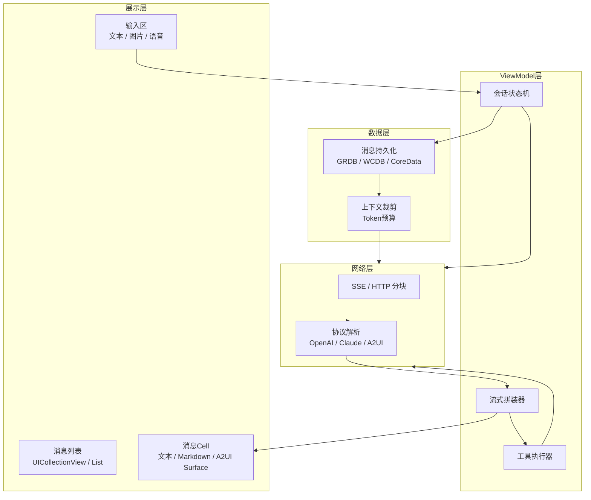
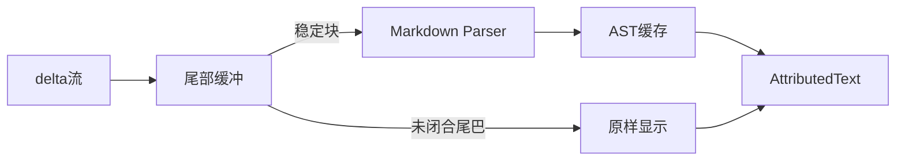
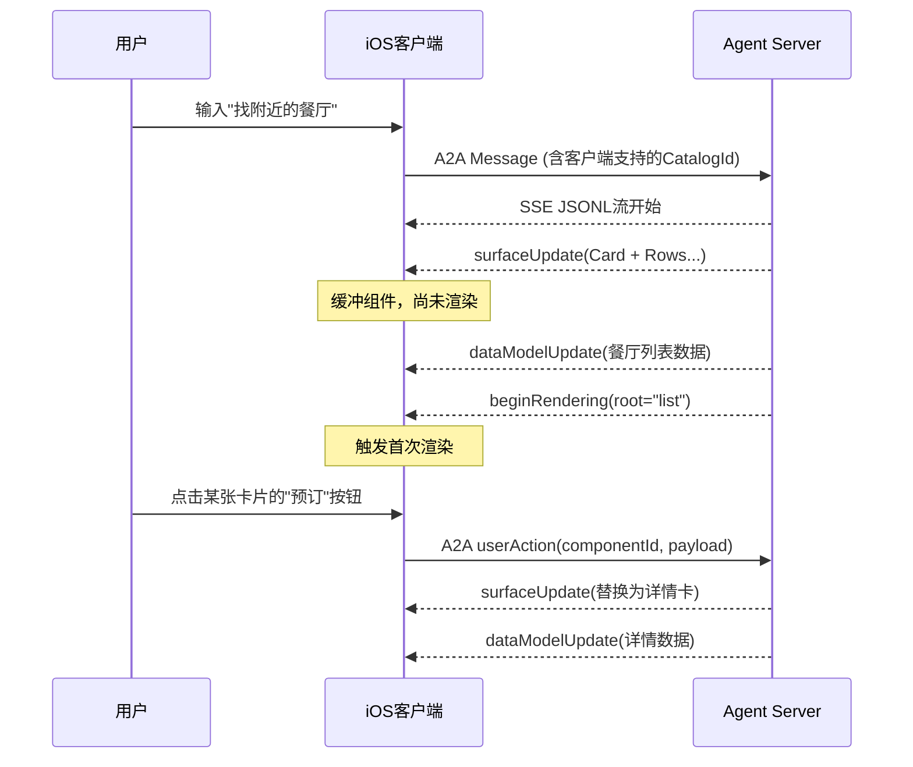
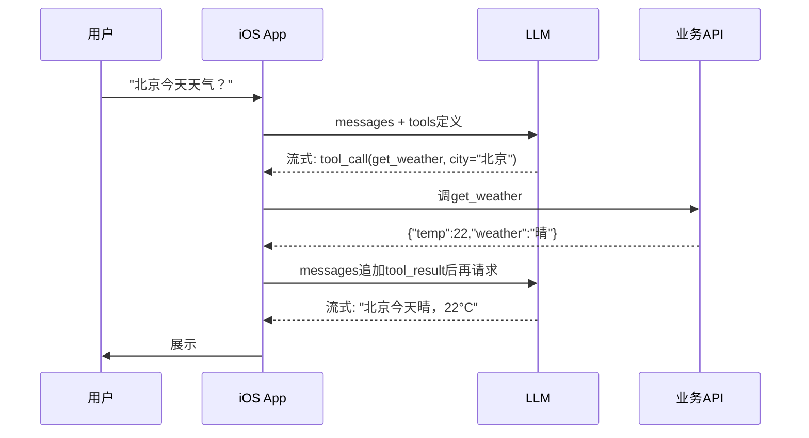

+++
title = "iOS中AI Chat实战"
date = '2026-05-02T22:32:27+08:00'
draft = false
weight = 11
tags = ["AI", "LLM", "面试"]
categories = ["AI", "面试"]
+++
做一个能跑的AI聊天Demo只需要几十行代码：拼一个HTTP请求、把模型返回的文本显示出来即可。但要做一个**达到生产级体验**的AI Chat，就会面对一堆并不"AI"的工程问题：字怎么一个个"蹦"出来？Markdown怎么边流边渲染？模型想让前端弹一个卡片甚至一个表单，该怎么办？用户点击卡片里的按钮怎么回传给模型？

本文以iOS为实现目标，系统梳理AI Chat的工程架构，重点讲清楚两件事：**流式输出**与**A2UI（Agent to UI）**，同时覆盖工具调用、取消、多模态、端侧推理等常见高级能力。

## 一、整体架构

一个完整的iOS AI Chat客户端，通常可以拆成如下几层：



几个关键特征：

- **单向数据流**：用户输入 → 网络 → 增量事件 → ViewModel合并 → UI重绘，避免在多个地方并行改UI。
- **增量而非覆盖**：模型输出是"delta流"，要像"打字机"那样追加，而不是每次用完整文本刷新Cell。
- **解析与渲染分离**：网络层只负责把原始SSE字节切成业务事件，UI层只负责绘制，中间用一个清晰的事件模型连接。

## 二、流式输出：让字"蹦"出来

### 2.1 为什么一定要流式

LLM输出一段几百字的回答可能需要5~10秒。如果等完整响应再显示，用户只能看着loading转圈，主观体感会糟糕到让人想关App。流式输出把"首token延迟"压缩到几百毫秒级，让用户在看到第一个字开始就能边读边想。

### 2.2 传输层选型

| 方案 | 适用场景 | iOS支持 |
|------|----------|---------|
| SSE (Server-Sent Events) | 服务器→客户端单向推送，LLM输出首选 | 原生`URLSession.bytes(for:)` |
| HTTP Chunked | 自定义分块协议，延迟接近SSE | 原生支持 |
| WebSocket | 需要双向实时（语音对话、A2UI带回调） | `URLSessionWebSocketTask` |
| gRPC Streaming | 内部私有协议，二进制高效 | 需接入gRPC-Swift |

主流的OpenAI、Anthropic、Gemini、国内通义/智谱等全部默认使用SSE。下面聚焦SSE的iOS实现。

### 2.3 SSE协议速览

SSE的报文格式极简，每行一个字段，`\n\n`分隔一条event：

```
data: {"choices":[{"delta":{"content":"你"}}]}

data: {"choices":[{"delta":{"content":"好"}}]}

data: [DONE]
```

规范字段只有`event / data / id / retry`，LLM场景一般只用`data`。

### 2.4 iOS 15+ 的原生实现

`URLSession.bytes(for:)`返回一个`AsyncBytes`，可以逐行异步遍历，天然契合SSE：

```swift
struct ChatStreamClient {
    let endpoint: URL
    let apiKey: String

    func stream(messages: [ChatMessage]) -> AsyncThrowingStream<ChatDelta, Error> {
        AsyncThrowingStream { continuation in
            let task = Task {
                do {
                    var req = URLRequest(url: endpoint)
                    req.httpMethod = "POST"
                    req.setValue("Bearer \(apiKey)", forHTTPHeaderField: "Authorization")
                    req.setValue("text/event-stream", forHTTPHeaderField: "Accept")
                    req.httpBody = try JSONEncoder().encode(
                        ChatRequest(messages: messages, stream: true)
                    )

                    let (bytes, response) = try await URLSession.shared.bytes(for: req)
                    guard let http = response as? HTTPURLResponse, http.statusCode == 200 else {
                        throw ChatError.badStatus
                    }

                    for try await line in bytes.lines {
                        guard line.hasPrefix("data: ") else { continue }
                        let payload = line.dropFirst(6)
                        if payload == "[DONE]" {
                            continuation.finish()
                            return
                        }
                        if let data = payload.data(using: .utf8),
                           let delta = try? JSONDecoder().decode(ChatDelta.self, from: data) {
                            continuation.yield(delta)
                        }
                    }
                    continuation.finish()
                } catch {
                    continuation.finish(throwing: error)
                }
            }
            continuation.onTermination = { _ in task.cancel() }
        }
    }
}
```

几个重点：

- `bytes.lines`会自动处理换行，无须手写缓冲拼接。
- `continuation.onTermination`把`AsyncStream`的取消传递到`Task`，用户点"停止生成"时才能真正终止连接。
- 一定要在`URLSessionConfiguration`上打开`waitsForConnectivity = true`、并配好`timeoutIntervalForRequest`（SSE连接很长，不能用默认60s）。

### 2.5 消费流的ViewModel

UI层看到的应该是"一条不断增长的助手消息"，ViewModel负责把delta拼装起来：

```swift
@MainActor
final class ChatViewModel: ObservableObject {
    @Published var messages: [ChatMessage] = []
    private var streamTask: Task<Void, Never>?

    func send(_ text: String) {
        messages.append(.user(text))
        let assistantId = UUID()
        messages.append(.assistant(id: assistantId, text: ""))

        streamTask = Task {
            do {
                for try await delta in client.stream(messages: messages) {
                    appendDelta(delta.content, to: assistantId)
                }
            } catch is CancellationError {
            } catch {
                appendDelta("\n[error: \(error)]", to: assistantId)
            }
        }
    }

    func stop() {
        streamTask?.cancel()
    }

    private func appendDelta(_ chunk: String, to id: UUID) {
        guard let idx = messages.firstIndex(where: { $0.id == id }) else { return }
        messages[idx].text += chunk
    }
}
```

### 2.6 刷新节流

模型在峰值时每秒能吐出几十个delta，如果每个delta都触发一次SwiftUI重新diff、或者UIKit的`UICollectionView`布局，在长消息下会掉帧。常见优化：

- **时间窗口合并**：16ms或33ms内的delta合并成一次UI刷新，对齐到`CADisplayLink`的一帧。
- **仅脏区刷新**：UIKit下只更新最后一个Cell的高度与文本，不做`reloadData`。
- **分段富文本**：已稳定的前缀转成`NSAttributedString`缓存，只有"尾巴"那段重新计算。

```swift
final class StreamThrottler {
    private var pending = ""
    private var timer: DispatchSourceTimer?
    private let onFlush: (String) -> Void

    init(interval: Double = 1.0 / 30, onFlush: @escaping (String) -> Void) {
        self.onFlush = onFlush
        let t = DispatchSource.makeTimerSource(queue: .main)
        t.schedule(deadline: .now(), repeating: interval)
        t.setEventHandler { [weak self] in self?.flush() }
        t.resume()
        self.timer = t
    }

    func append(_ chunk: String) { pending += chunk }
    private func flush() {
        guard !pending.isEmpty else { return }
        let s = pending; pending = ""
        onFlush(s)
    }
    deinit { timer?.cancel() }
}
```

## 三、流式Markdown渲染

LLM回答里经常带粗体、列表、代码块，直接显示纯文本体验很差；但渲染器基本都要求"完整结构"，边流边渲染就会遇到**半闭合标签**问题，例如已经出来了`` ` ``还没等到右边的`` ` ``。

工程上的常见做法：

1. **尾部缓冲**：维护一个滑动尾巴（比如最后32个字符），只把"已经稳定"的前缀丢给Markdown解析器，尾巴以原始文本显示。一旦尾巴形成闭合结构就合入稳定区。
2. **按块解析**：Markdown具备块级语法（段落、列表、代码块），可以按换行切块，只对"当前最后一个块"局部重解析，过往块的AST结果缓存复用。
3. **代码块特殊处理**：代码块是生成中最长、最容易出现半闭合状态的结构。检测到开头```` ``` ````就切到"原样显示+等待闭合"的分支，闭合前不做语法高亮，闭合后异步着色。
4. **渲染库选择**：
   - `AttributedString`（iOS 15+）：原生支持Markdown初始化，胜在零依赖；对代码块、表格支持弱。
   - `MarkdownUI`：SwiftUI原生，样式灵活，适合中等复杂度。
   - `cmark-gfm`：通过C库拿到AST，自己绘制，复杂但最快最稳。大厂Chat类产品多走这条路。



## 四、A2UI：从"文字流"走向"组件流"

### 4.1 为什么需要A2UI

纯Markdown够用的前提是**信息是"读"的**。一旦信息是"要交互"的——一张餐厅卡片、一张含CTA按钮的行程、一张可填写的表单——Markdown就乏力了。过去常见的两种妥协方案都有硬伤：

| 方案 | 问题 |
|------|------|
| 返回HTML让WebView渲染 | 性能差、交互不原生、难以接入业务能力 |
| 返回自定义DSL由App静态解析 | 模型要"学"这个DSL、扩展新组件必须发版 |

**A2UI（Agent to UI）**是Google在2025年推出、2026年进入SwiftUI生态的协议，核心思路是：

- 模型输出的**不是HTML、不是代码，而是一段声明式的JSONL**；
- 客户端内置一个**Catalog**（组件目录），把JSON里的`Card`、`Row`、`Column`、`Button`映射到**原生SwiftUI/UIKit控件**；
- JSONL天然流式，UI可以**边收边渲染**，交互事件通过A2A消息回传给Agent。

一句话概括：**把Function Calling反过来——不是LLM调用工具返回文字，而是LLM直接"写"一段UI**。

### 4.2 协议核心概念

A2UI只定义了4种服务器→客户端消息：

| 消息 | 作用 |
|------|------|
| `surfaceUpdate` | 提供组件定义（组件树的节点），追加或更新 |
| `dataModelUpdate` | 更新数据模型（与UI结构解耦的状态） |
| `beginRendering` | 告诉客户端"数据够了，可以首屏渲染了"，带根节点ID |
| `deleteSurface` | 移除某个UI区域 |

两个关键设计：

1. **Surface（界面区域）**：每条AI回复可以是一个独立Surface。一场对话里可以同时存在多个Surface（主聊天区、侧边栏等）。
2. **Flat Adjacency List（扁平邻接表）**：组件不是嵌套JSON树，而是一组带`id`的扁平节点，子节点通过引用ID连接。这是专门为LLM生成设计的——LLM写嵌套深的JSON非常容易出错，写扁平列表则稳得多。

### 4.3 一个完整的JSONL示例

渲染一张用户资料卡：

```json
{"surfaceUpdate":{"components":[{"id":"root","component":{"Column":{"children":{"explicitList":["card"]}}}}]}}
{"surfaceUpdate":{"components":[{"id":"card","component":{"Card":{"child":"col"}}}]}}
{"surfaceUpdate":{"components":[{"id":"col","component":{"Column":{"children":{"explicitList":["name","bio"]}}}}]}}
{"surfaceUpdate":{"components":[{"id":"name","component":{"Text":{"usageHint":"h3","text":{"literalString":"A2A Fan"}}}}]}}
{"surfaceUpdate":{"components":[{"id":"bio","component":{"Text":{"text":{"literalString":"Building beautiful apps from a single codebase."}}}}]}}
{"dataModelUpdate":{"contents":{}}}
{"beginRendering":{"root":"root"}}
```

要点：

- 每一行都是独立合法的JSON，天然可流式。
- 在收到`beginRendering`之前客户端**只缓冲不渲染**，避免"闪一下不完整UI"。
- 文本来源可以是`literalString`（写死）或`dataBinding`（绑定到数据模型的JSON Pointer），后者支持"不改UI结构只换内容"的高效刷新。

### 4.4 数据流



### 4.5 SwiftUI渲染器的实现思路

社区已有开源SwiftUI渲染器（例如`a2ui-swiftui`），核心思路可以拆成四步：

**步骤1：定义Catalog——把协议里的组件类型映射到原生View**

```swift
protocol A2UIComponent: View {
    init(node: A2UINode, context: A2UIContext)
}

struct BasicCatalog: A2UICatalog {
    static let components: [String: any A2UIComponent.Type] = [
        "Text":   A2UIText.self,
        "Column": A2UIColumn.self,
        "Row":    A2UIRow.self,
        "Card":   A2UICard.self,
        "Button": A2UIButton.self,
        "Image":  A2UIImage.self,
    ]
}
```

**步骤2：解析JSONL流 → 组件Map + 数据模型**

```swift
@MainActor
final class SurfaceViewModel: ObservableObject {
    @Published private(set) var components: [String: A2UINode] = [:]
    @Published private(set) var dataModel: JSONValue = .object([:])
    @Published private(set) var rootId: String?

    func ingest(_ line: String) throws {
        let msg = try JSONDecoder().decode(A2UIMessage.self, from: Data(line.utf8))
        switch msg {
        case .surfaceUpdate(let s):
            for c in s.components { components[c.id] = c }
        case .dataModelUpdate(let d):
            dataModel.merge(d.contents)
        case .beginRendering(let b):
            rootId = b.root
        case .deleteSurface:
            components.removeAll(); rootId = nil
        }
    }
}
```

**步骤3：根据rootId递归构建SwiftUI树**

```swift
struct A2UISurfaceView: View {
    @StateObject var vm: SurfaceViewModel
    let onAction: (A2UIAction) -> Void

    var body: some View {
        if let root = vm.rootId, let node = vm.components[root] {
            A2UIRender(node: node, components: vm.components,
                       dataModel: vm.dataModel, onAction: onAction)
        } else {
            ProgressView()
        }
    }
}

struct A2UIRender: View {
    let node: A2UINode
    let components: [String: A2UINode]
    let dataModel: JSONValue
    let onAction: (A2UIAction) -> Void

    var body: some View {
        switch node.type {
        case "Column":
            VStack(alignment: .leading) {
                ForEach(node.children, id: \.self) { childId in
                    if let c = components[childId] {
                        A2UIRender(node: c, components: components,
                                   dataModel: dataModel, onAction: onAction)
                    }
                }
            }
        case "Text":
            Text(node.resolvedText(with: dataModel))
        case "Button":
            Button(node.resolvedText(with: dataModel)) {
                onAction(.userAction(componentId: node.id))
            }
        default:
            EmptyView()
        }
    }
}
```

**步骤4：把userAction回传给Agent**

A2UI定义用户事件通过A2A消息（一般同一条SSE连接或另起一个HTTP POST）回发：

```json
{
  "userAction": {
    "surfaceId": "msg_42",
    "componentId": "btn_reserve",
    "value": { "restaurantId": "r_88" }
  }
}
```

Agent收到后继续向同一Surface推送`surfaceUpdate`或`dataModelUpdate`，实现**不刷新整页、只改变所需组件**的交互闭环。

### 4.6 在Chat中的集成形态

AI Chat里每条助手消息是一条Cell。常见的做法是给消息增加一个`renderKind`字段：

```swift
enum RenderKind {
    case markdown(String)
    case a2ui(SurfaceViewModel)
}
```

流式时，先尝试把前几行JSON解析成A2UI消息：能解析 → 走A2UI通道；不能 → 降级成Markdown流。这样业务代码几乎不用关心"这次Agent到底返了什么"。

### 4.7 A2UI vs Markdown vs WebView

| 维度 | Markdown | HTML/WebView | A2UI |
|------|----------|--------------|------|
| 原生渲染 | 是 | 否 | 是 |
| 可交互 | 低 | 高 | 高 |
| 流式友好 | 有半闭合问题 | 一般 | 原生为流式设计 |
| 跨平台复用 | 文本 | HTML | 同一份协议 |
| 对LLM生成友好度 | 高 | 低 | 高（扁平结构） |
| 安全性 | 高 | 低（需XSS防御） | 高（无可执行代码） |

## 五、Function Calling：让模型"调API"

Chat不只是"说"，还要"做"。查天气、查订单、下单机票——这些都靠Function Calling。



iOS侧实现有两个关键点：

**工具注册**：用Swift Macro或者字典把原生函数包装成JSON Schema。

```swift
struct Tool {
    let name: String
    let description: String
    let schema: [String: Any]
    let invoke: ([String: Any]) async throws -> String
}

let weatherTool = Tool(
    name: "get_weather",
    description: "获取城市天气",
    schema: ["type":"object","properties":["city":["type":"string"]],"required":["city"]],
    invoke: { params in
        guard let city = params["city"] as? String else { throw ToolError.badParam }
        return try await WeatherAPI.fetch(city: city)
    }
)
```

**流式中的tool_call累积**：OpenAI在流里会把`tool_calls`的参数JSON拆成多个delta（`{"cit`...`y":"北`...`京"}`），需要按`index`累加到稳定后再执行：

```swift
var accum: [Int: PartialToolCall] = [:]
for try await delta in stream {
    for call in delta.toolCalls ?? [] {
        accum[call.index, default: .init()].merge(call)
    }
    if delta.finishReason == "tool_calls" {
        for (_, call) in accum { try await execute(call) }
    }
}
```

## 六、其他常见高级能力

### 6.1 取消与停止生成

用户按"停止"按钮需要立即生效：

```swift
func stop() {
    streamTask?.cancel()
}
```

SSE连接在`Task.cancel()`后，`URLSession.bytes`的`for try await`会抛出`CancellationError`，进而释放socket。服务端应尽量基于`request.isCancelled`做短路，避免无效计费。

### 6.2 断线续传

网络抖动是客户端日常。两种策略：

- **软续传**：记录已收到的token，断线后发`Last-Event-ID`或自定义`resume_token`让Agent从上次断点继续（需服务端支持）。
- **硬重发**：丢弃已收到的部分，用同一条消息重新请求，UI上展示"重新生成"。

### 6.3 上下文与Token预算

对话越长、每次请求就越贵越慢。实战中要做：

- **窗口滑动**：只带最近N轮。
- **摘要折叠**：把前面N-1轮用小模型做个summary，作为system消息塞回。
- **RAG检索**：更早的内容存向量库，按问题相关度召回。

```swift
func buildContext(history: [ChatMessage], budget: Int) -> [ChatMessage] {
    var cost = 0
    var kept: [ChatMessage] = []
    for msg in history.reversed() {
        let t = tokenizer.count(msg.text)
        if cost + t > budget { break }
        cost += t
        kept.insert(msg, at: 0)
    }
    return kept
}
```

### 6.4 多模态输入

iOS端常见的扩展输入：

- **图片**：`PhotosPicker` → 压缩至长边1024 → base64或上传OSS → `image_url`字段。
- **语音**：`SFSpeechRecognizer`转文字，或直接上传PCM用Whisper/Realtime API。
- **文件**：PDF/Word用`PDFKit` / `NSAttributedString`解析后抽文本，或者走服务端解析。

### 6.5 消息持久化

推荐用GRDB或WCDB存储，关键字段：

```sql
CREATE TABLE message (
  id TEXT PRIMARY KEY,
  conversation_id TEXT,
  role TEXT,          -- user / assistant / tool / system
  content TEXT,
  a2ui_payload TEXT,  -- A2UI的原始JSONL
  tool_calls TEXT,
  created_at INTEGER,
  status INTEGER      -- 生成中 / 成功 / 失败 / 已取消
);
```

"生成中"的消息也要入库，App被杀或crash时靠它做恢复。

### 6.6 端侧推理：Apple Intelligence与CoreML

iOS 18起苹果开放了设备端的`Foundation Models`框架，对隐私敏感且简单的任务（打标、分类、摘要）完全可以本地完成：

```swift
import FoundationModels

let session = LanguageModelSession()
let reply = try await session.respond(to: "把这段对话总结成一句话：...")
```

优点：零延迟、零成本、完全离线；缺点：模型能力有限，复杂推理仍需云端。实战常做**两级路由**：先用端侧小模型判定是否需要上云。

### 6.7 安全与隐私

- **API Key绝不落端**：App只调自家网关，网关再签名调LLM，避免Key泄露被盗刷。
- **输入/输出审核**：接一个内容安全服务（阿里绿网、腾讯天御、自研敏感词库），流式场景下要增量审核，命中立即cancel流。
- **A2UI安全红利**：A2UI刻意不允许任意可执行代码，只能从Catalog里挑组件，天然规避了HTML/JS方案的XSS风险。这也是苹果生态对接LLM UI的关键价值。

## 七、性能与体验优化清单

| 问题 | 表现 | 对策 |
|------|------|------|
| 列表滚动掉帧 | 长对话滚到中部卡顿 | Cell异步排版（Texture/布局缓存）、图片异步解码 |
| 流式时首屏慢 | 第一个字要2秒以上 | 提前建立TLS连接、走HTTP/2长连接复用、接入CDN就近节点 |
| 内存持续增长 | 聊了几百轮APP被kill | 超过阈值的消息在内存中只保留摘要，原文走DB懒加载 |
| 输入框输入卡 | 打字有迟滞 | 输入框与消息列表解耦，不要放同一个ObservableObject |
| 键盘遮挡 | 底部消息被键盘盖住 | 监听`keyboardLayoutGuide`（iOS 15+）或自管`inputAccessoryView` |
| 震动与动画 | 消息到达无反馈 | `UIImpactFeedbackGenerator`在首token到达时做轻震动 |

## 八、推荐的模块划分

做到产品级，文件组织建议按"数据流而非功能"分：

```
Chat/
├── Transport/           # SSE、WebSocket、A2A
│   ├── SSEClient.swift
│   └── A2AChannel.swift
├── Protocol/            # 协议解析
│   ├── OpenAIParser.swift
│   ├── A2UIParser.swift
│   └── ToolCallAccumulator.swift
├── Domain/              # 纯业务模型
│   ├── ChatMessage.swift
│   └── Conversation.swift
├── Storage/             # 持久化
│   └── MessageDAO.swift
├── Render/
│   ├── Markdown/
│   └── A2UI/            # Catalog + SurfaceView
├── Feature/
│   ├── ChatViewModel.swift
│   └── ChatView.swift
└── Tools/               # Function Calling工具集
    ├── WeatherTool.swift
    └── BookingTool.swift
```

`Transport`、`Protocol`、`Render`三层尤其要干净隔离：换模型供应商只改`Protocol`，换渲染方案（Markdown → A2UI）只改`Render`，业务代码零感知。
