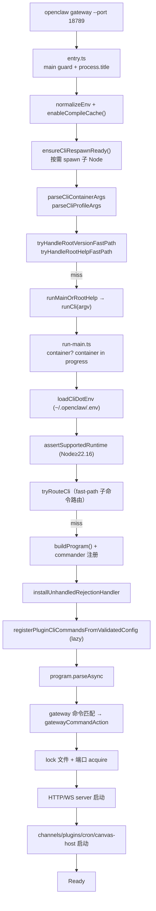

+++
title = "OpenClaw 源码导读（二）：Gateway 控制平面 — 一条 WebSocket 连上所有人"
date = '2026-05-02T22:32:27+08:00'
draft = false
weight = 16
tags = ["AI", "LLM", "面试", "OpenClaw"]
categories = ["AI", "面试"]
+++
> 在系列第一篇里我们看到，OpenClaw 的核心隐喻是 **"Gateway 是控制平面"**。它不存转储消息、不排队、不持久化事件流，而是一个长在 127.0.0.1:18789 上的**状态化 RPC 服务器**，所有客户端（CLI、macOS.app、iOS/Android Node、WebChat 浏览器、Canvas iframe）都靠一条 WebSocket 接入。
>
> 这一篇拆开控制平面的五个层面：
>
> 1. **进程入口**：CLI 怎么从 `openclaw gateway` 走到 Node 进程常驻
> 2. **WebSocket 协议**：握手帧、RPC 帧、Event 帧、状态快照与版本号
> 3. **鉴权矩阵**：Token / Password / Device Token / Bootstrap Token / Tailscale Whois / Trusted Proxy
> 4. **Pairing**：陌生客户端怎么合法加入（setup code、pairing store、allowFrom）
> 5. **Session 模型**：Session Key 组成规则、多 Agent 路由、Session ID 模糊匹配

> 注：下文所有 `src/` 路径都指 [openclaw/openclaw](https://github.com/openclaw/openclaw) 仓库根下。

---

## 一、CLI 到 Gateway 的六段路径

第一篇概览过 `src/entry.ts` 和 `src/cli/run-main.ts`，这里按调用序重新画一遍，把每个关键函数在 graph 上标出来：



### 1. 为什么要自己 `spawn` 自己

`ensureCliRespawnReady()` 是 `src/entry.ts` 里最容易被忽视但非常重要的段落：

```67:98:src/entry.ts
  function ensureCliRespawnReady(): boolean {
    const plan = buildCliRespawnPlan();
    if (!plan) {
      return false;
    }

    const child = spawn(process.execPath, plan.argv, {
      stdio: "inherit",
      env: plan.env,
    });

    attachChildProcessBridge(child);

    child.once("exit", (code, signal) => {
      if (signal) {
        process.exitCode = 1;
        return;
      }
      process.exit(code ?? 1);
    });
```

原因是 Node 的 V8 flag（`--max-old-space-size`、`--experimental-vm-modules`、`--enable-source-maps`）只能在 Node 进程启动瞬间生效。`openclaw` 作为 npm 全局命令被调起来时，`process.execPath` 就是 node 本体，但用户传的 `--profile dev`、`--verbose`、`OPENCLAW_HEAP_SIZE=8192` 这类参数需要转成对应的 V8 flag。做法就是：父进程先用"默认参数"启动，判断到需要调整 V8 flag 后，spawn 一个子进程带上正确的 flag 继续跑。

`attachChildProcessBridge(child)` 的作用是把 `SIGINT`/`SIGTERM` 转发给子进程、把子进程的 stdout/stderr/exit code 原样透出，使整个父子过程对用户完全透明。

### 2. Root Help / Version 的 Fast Path

OpenClaw 对 **"最轻量的请求在 < 50ms 内完成"** 这件事非常偏执：

- `tryHandleRootVersionFastPath`：`openclaw --version` → 直接读 `package.json` 的 `version` 字段，不装载任何其他模块。
- `tryHandleRootHelpFastPath`：`openclaw --help` → 先尝试读预生成的 `root-help-metadata`（构建时生成到 dist 里的静态 help 文本），miss 了才 `dynamic import('./cli/program/root-help.js')`。

这是因为 CI、用户的 shell completion、Homebrew/nix 构建时、daemon supervise 都会频繁调用这些命令，任何一次多几百毫秒的 TS 模块加载都会被放大上百倍。

### 3. Container/Profile 分派

`parseCliContainerArgs` 和 `parseCliProfileArgs` 负责把两组特殊 flag 从 argv 剥下来：

- `--container NAME`：把整个 CLI 调用丢到名为 NAME 的 Docker/Podman 容器里执行。实现见 `src/cli/container-target.ts`。
- `--profile dev|beta|stable`：切换 npm dist-tag + git 分支 + 配置 profile。

这两个 flag 的处理必须**在 Commander 之前完成**，因为 Commander 不认识它们，识别完就要提前 exec 出去或 respawn。

---

## 二、WebSocket 协议：一张帧图解

Gateway 对外暴露的唯一"语义接口"就是 WebSocket。客户端连上来之后，所有交互都被归一化成三种帧。我们从 `src/gateway/protocol/schema/frames.ts` 把它们翻出来。

### 1. 握手：`ConnectParams` → `HelloOk`

客户端发的第一帧是 `hello`，带上 `ConnectParams`：

```22:70:src/gateway/protocol/schema/frames.ts
export const ConnectParamsSchema = Type.Object(
  {
    minProtocol: Type.Integer({ minimum: 1 }),
    maxProtocol: Type.Integer({ minimum: 1 }),
    client: Type.Object(
      {
        id: GatewayClientIdSchema,
        displayName: Type.Optional(NonEmptyString),
        version: NonEmptyString,
        platform: NonEmptyString,
        deviceFamily: Type.Optional(NonEmptyString),
        modelIdentifier: Type.Optional(NonEmptyString),
        mode: GatewayClientModeSchema,
        instanceId: Type.Optional(NonEmptyString),
      },
      { additionalProperties: false },
    ),
    caps: Type.Optional(Type.Array(NonEmptyString, { default: [] })),
    commands: Type.Optional(Type.Array(NonEmptyString)),
    permissions: Type.Optional(Type.Record(NonEmptyString, Type.Boolean())),
    pathEnv: Type.Optional(Type.String()),
    role: Type.Optional(NonEmptyString),
    scopes: Type.Optional(Type.Array(NonEmptyString)),
    device: Type.Optional(
      Type.Object(
        {
          id: NonEmptyString,
          publicKey: NonEmptyString,
          signature: NonEmptyString,
          signedAt: Type.Integer({ minimum: 0 }),
          nonce: NonEmptyString,
        },
        { additionalProperties: false },
      ),
    ),
    auth: Type.Optional(
      Type.Object(
        {
          token: Type.Optional(Type.String()),
          bootstrapToken: Type.Optional(Type.String()),
          deviceToken: Type.Optional(Type.String()),
          password: Type.Optional(Type.String()),
        },
        { additionalProperties: false },
      ),
    ),
```

几个关键字段：

- **`minProtocol` / `maxProtocol`**：协议版本范围。Gateway 选一个双方都支持的最高版本回给客户端。
- **`client.mode`**：`GatewayClientModeSchema` 定义了客户端的身份（`cli` / `pi-agent` / `webchat` / `macos-app` / `ios-node` / `android-node` / …）。不同 mode 得到不同的默认 scope。
- **`caps`**：能力声明，例如 `canvas`、`voice-wake`、`screen-record`。Gateway 据此决定能把哪些 tool 路由给这个客户端。
- **`device`**：设备公钥 + 签名 + nonce——这是配对成功后客户端持久化的设备身份，后续所有连接都会带上。
- **`auth`**：四选一的凭据（token / bootstrapToken / deviceToken / password），对应下一节五种鉴权方式。

Gateway 收到后会做鉴权 + 注册 + 快照下发，返回 `HelloOk`：

```72:127:src/gateway/protocol/schema/frames.ts
export const HelloOkSchema = Type.Object(
  {
    type: Type.Literal("hello-ok"),
    protocol: Type.Integer({ minimum: 1 }),
    server: Type.Object(
      {
        version: NonEmptyString,
        connId: NonEmptyString,
      },
      { additionalProperties: false },
    ),
    features: Type.Object(
      {
        methods: Type.Array(NonEmptyString),
        events: Type.Array(NonEmptyString),
      },
      { additionalProperties: false },
    ),
    snapshot: SnapshotSchema,
    canvasHostUrl: Type.Optional(NonEmptyString),
    auth: Type.Optional(
      Type.Object(
        {
          deviceToken: Type.Optional(NonEmptyString),
          role: NonEmptyString,
          scopes: Type.Array(NonEmptyString),
          issuedAtMs: Type.Optional(Type.Integer({ minimum: 0 })),
          ...
        },
        { additionalProperties: false },
      ),
    ),
    policy: Type.Object(
      {
        maxPayload: Type.Integer({ minimum: 1 }),
        maxBufferedBytes: Type.Integer({ minimum: 1 }),
        tickIntervalMs: Type.Integer({ minimum: 1 }),
      },
      { additionalProperties: false },
    ),
  },
```

值得注意的字段：

- **`features.methods` / `features.events`**：Gateway 本次支持的 RPC 方法列表和事件类型列表。这让客户端可以自适应——新版本的 Gateway 多出来的方法，老客户端可以直接忽略。
- **`snapshot`**：当前完整的控制平面快照（Agents/Channels/Sessions/Presence/Config 都打包成一个 JSON）。客户端拿到即可渲染 UI。
- **`auth.deviceToken`**：如果握手时用的是 `bootstrapToken`（一次性配对 token），Gateway 在 `HelloOk` 里会**下发一个长期 `deviceToken` 给客户端**，客户端保存下来，下次直接用 deviceToken 免配对。
- **`policy.maxPayload` / `tickIntervalMs`**：连接级限制和 keepalive 间隔，由服务端决定。

### 2. RPC 帧：Request / Response / Event

握手完成后，帧格式就简化成三选一：

```139:177:src/gateway/protocol/schema/frames.ts
export const RequestFrameSchema = Type.Object(
  {
    type: Type.Literal("req"),
    id: NonEmptyString,
    method: NonEmptyString,
    params: Type.Optional(Type.Unknown()),
  },
  { additionalProperties: false },
);

export const ResponseFrameSchema = Type.Object(
  {
    type: Type.Literal("res"),
    id: NonEmptyString,
    ok: Type.Boolean(),
    payload: Type.Optional(Type.Unknown()),
    error: Type.Optional(ErrorShapeSchema),
  },
  { additionalProperties: false },
);

export const EventFrameSchema = Type.Object(
  {
    type: Type.Literal("event"),
    event: NonEmptyString,
    payload: Type.Optional(Type.Unknown()),
    seq: Type.Optional(Type.Integer({ minimum: 0 })),
    stateVersion: Type.Optional(StateVersionSchema),
  },
  { additionalProperties: false },
);

export const GatewayFrameSchema = Type.Union(
  [RequestFrameSchema, ResponseFrameSchema, EventFrameSchema],
  { discriminator: "type" },
);
```

这就是 **JSON-RPC 2.0 的精简变种**，加了两个关键设计：

- **双向 RPC**：`req` 既可以是客户端发给服务端（`agent.send`、`sessions.patch`），也可以是服务端发给客户端（`node.invoke`、`canvas.push`）。同一个 `id` 域在两个方向都起匹配作用。
- **Event 带 `stateVersion`**：状态类事件（如 session 被更新）会带上一个单调递增的全局 `stateVersion`，客户端断线重连时可以发 `?since=stateVersion` 让服务端只下发差量。

所有 RPC 方法的实现在 `src/gateway/server-methods/`，每个方法对应一个文件。例如：

```
gateway/server-methods/
├── agent.ts            # agent.send / agent.abort / agent.create-event
├── agents.ts           # agents.list / agents.patch
├── channels.ts         # channels.status / channels.send / channels.start
├── chat.ts             # chat.history / chat.inject / chat.abort
├── commands.ts         # commands.list / commands.run
├── config.ts           # config.get / config.patch
├── cron.ts             # cron.list / cron.add / cron.remove
├── devices.ts          # devices.list / devices.remove
├── diagnostics.ts      # diagnostics.run / doctor.run
├── models-auth-status.test.ts
├── nodes.ts            # node.list / node.describe / node.invoke / node.wake
└── pairing.ts          # pairing.issue / pairing.approve / pairing.revoke
```

路由由 `src/gateway/server/ws-connection/message-handler.ts` 完成，它维护一张 `method → handler` 的表，收到 `req` 帧后解 schema、跑 auth、调 handler、组 `res` 帧返回。

### 3. 连接隔离与载荷上限

```1:30:src/gateway/server-constants.ts
(见 ws-connection.ts 的 import)
```

从 `ws-connection.ts` 的前 120 行可以看到：

```16:16:src/gateway/server/ws-connection.ts
import { MAX_PAYLOAD_BYTES, MAX_PREAUTH_PAYLOAD_BYTES } from "../server-constants.js";
```

```107:117:src/gateway/server/ws-connection.ts
function isWsPayloadLimitError(err: unknown): boolean {
  if (!err || typeof err !== "object") {
    return false;
  }
  const code = (err as { code?: unknown }).code;
  if (code === "WS_ERR_UNSUPPORTED_MESSAGE_LENGTH") {
    return true;
  }
  const message = (err as { message?: unknown }).message;
  return typeof message === "string" && /max payload size exceeded/i.test(message);
}
```

Gateway 对每个 WS 连接设置两个 payload 上限：

- **`MAX_PREAUTH_PAYLOAD_BYTES`**：握手完成前（hello-ok 发出前）允许的最大帧大小——非常小，用来抵御慢读攻击。
- **`MAX_PAYLOAD_BYTES`**：握手后允许的最大帧（默认 16 MB 左右），够传一张 snapshot + 一张大图的 base64。

同时 `PreauthConnectionBudget` 还限制了未握手连接的总数，防止端口被握手泄漏攻击。

---

## 三、鉴权矩阵：6 种方式，1 张表

Gateway 支持的鉴权方式定义在 `src/gateway/auth.ts`：

```32:48:src/gateway/auth.ts
export type GatewayAuthResult = {
  ok: boolean;
  method?:
    | "none"
    | "token"
    | "password"
    | "tailscale"
    | "device-token"
    | "bootstrap-token"
    | "trusted-proxy";
  user?: string;
  reason?: string;
  /** Present when the request was blocked by the rate limiter. */
  rateLimited?: boolean;
  /** Milliseconds the client should wait before retrying (when rate-limited). */
  retryAfterMs?: number;
};
```

### 1. 六种方法各自的使用场景

| method | 触发条件 | 典型客户端 | 安全级别 |
|--------|---------|------------|---------|
| **none** | `gateway.auth.mode=none` + loopback 请求 | CLI 本机 | 仅限 127.0.0.1 |
| **token** | 配置了 `gateway.auth.token` 且客户端传 `auth.token` | CI/自动化脚本 | 共享密钥 |
| **password** | 配置了 `gateway.auth.password` 且客户端传 `auth.password` | Funnel 公网暴露 | 共享密码 |
| **tailscale** | 请求经 `tailscale serve` 转发，Whois 身份匹配 | 自己 tailnet 的设备 | 基于设备公钥 |
| **device-token** | 长期设备 token，配对时下发 | 已配对的 iOS/Android/macOS | 绑定设备 |
| **bootstrap-token** | 一次性配对 token（setup code 内含） | 首次配对的客户端 | 单次有效 |
| **trusted-proxy** | `X-Openclaw-User` 等自定义 header 由反代注入 | Cloudflare Access / Zitadel / Keycloak | 依赖反代 |

### 2. Tailscale 身份的验证逻辑

Tailscale Serve 是 OpenClaw 推荐的"tailnet 内零配置暴露"方式，但它需要 Gateway 能可靠地识别"这个请求真的经过了我的 tailscaled"。看 `auth.ts` 的实现：

```184:215:src/gateway/auth.ts
async function resolveVerifiedTailscaleUser(params: {
  req?: IncomingMessage;
  tailscaleWhois: TailscaleWhoisLookup;
}): Promise<{ ok: true; user: TailscaleUser } | { ok: false; reason: string }> {
  const { req, tailscaleWhois } = params;
  const tailscaleUser = getTailscaleUser(req);
  if (!tailscaleUser) {
    return { ok: false, reason: "tailscale_user_missing" };
  }
  if (!isTailscaleProxyRequest(req)) {
    return { ok: false, reason: "tailscale_proxy_missing" };
  }
  const clientIp = resolveTailscaleClientIp(req);
  if (!clientIp) {
    return { ok: false, reason: "tailscale_whois_failed" };
  }
  const whois = await tailscaleWhois(clientIp);
  if (!whois?.login) {
    return { ok: false, reason: "tailscale_whois_failed" };
  }
  if (normalizeLogin(whois.login) !== normalizeLogin(tailscaleUser.login)) {
    return { ok: false, reason: "tailscale_user_mismatch" };
  }
  return {
    ok: true,
    user: {
      login: whois.login,
      name: whois.name ?? tailscaleUser.name,
      profilePic: tailscaleUser.profilePic,
    },
  };
}
```

这个函数做了**三重校验**：

1. 请求的 HTTP header 里必须有 `tailscale-user-login`（由本机 tailscaled 的 Serve 自动注入）。
2. 请求必须来自 loopback 且携带 `x-forwarded-for` / `x-forwarded-proto` / `x-forwarded-host` 三件套——证明它真的经过了本机 tailscaled 的 proxy。
3. 反向查 `tailscaleWhois(clientIp)`：把转发链里解析出的远端 IP 回查到 tailnet 身份，比对 header 里的 login 是否一致——防止攻击者伪造 header。

三者任何一个 mismatch 都拒。同时 `shouldAllowTailscaleHeaderAuth` 只允许 `ws-control-ui` surface 走 Tailscale header 认证，普通 HTTP surface 不允许：

```307:309:src/gateway/auth.ts
function shouldAllowTailscaleHeaderAuth(authSurface: GatewayAuthSurface): boolean {
  return authSurface === "ws-control-ui";
}
```

这是为了**不让公开的 HTTP API 端点依赖 Tailscale header**，防止接了其他 WAF/反代后 header 被注入。

### 3. 速率限制

`authorizeTokenAuth` 是一个很典型的安全实践样本：

```337:359:src/gateway/auth.ts
function authorizeTokenAuth(params: {
  authToken?: string;
  connectToken?: string;
  limiter?: AuthRateLimiter;
  ip?: string;
  rateLimitScope: string;
}): GatewayAuthResult {
  if (!params.authToken) {
    return { ok: false, reason: "token_missing_config" };
  }
  if (!params.connectToken) {
    // Don't burn rate-limit slots for missing credentials — the client
    // simply hasn't provided a token yet (e.g. bare browser open).
    // Only actual *wrong* credentials should count as failures.
    return { ok: false, reason: "token_missing" };
  }
  if (!safeEqualSecret(params.connectToken, params.authToken)) {
    params.limiter?.recordFailure(params.ip, params.rateLimitScope);
    return { ok: false, reason: "token_mismatch" };
  }
  params.limiter?.reset(params.ip, params.rateLimitScope);
  return { ok: true, method: "token" };
}
```

三个细节：

- **`safeEqualSecret`**：常数时间比较，防止 timing attack。
- **"没传 token 不扣限流配额"**：只有真的传错 token 才 `recordFailure`。这是因为浏览器打开一个 URL 可能不带 token，友好地提示"请输密码"比直接 429 更好。
- **成功后 `reset`**：鉴权通过立即重置限流计数，避免用户输对之后还被限流。

---

## 四、Pairing：陌生客户端怎么合法加入

### 1. Setup Code 的结构

OpenClaw 的 `openclaw pairing setup` 会生成一个 base64url 编码的 setup code，扫到任何一个 iOS/macOS/Android 客户端就能完成配对。看它的 payload 定义和编码：

```28:32:src/pairing/setup-code.ts
export type PairingSetupPayload = {
  url: string;
  bootstrapToken: string;
};
```

```312:316:src/pairing/setup-code.ts
export function encodePairingSetupCode(payload: PairingSetupPayload): string {
  const json = JSON.stringify(payload);
  const base64 = Buffer.from(json, "utf8").toString("base64");
  return base64.replace(/\+/g, "-").replace(/\//g, "_").replace(/=+$/g, "");
}
```

**payload 里只有两个字段**：Gateway 的 WS URL + 一次性 bootstrap token。客户端扫码后：

1. 用 url 建 WS 连接。
2. 在 `hello.auth.bootstrapToken` 里把 token 发上来。
3. Gateway 校验 token 未过期、未使用，同意握手；在 `hello-ok.auth.deviceToken` 里下发**长期 device token**。
4. 客户端保存 deviceToken（iOS 写 Keychain、Android 写 EncryptedSharedPreferences、macOS 写 Keychain），下次直接用 deviceToken 免配对。

这种设计的好处：**setup code 出错只影响一次配对，长期凭证永远不走扫码链路**。

### 2. URL 怎么选

`resolveGatewayUrl` 里有一套非常细致的选 URL 逻辑：

```250:310:src/pairing/setup-code.ts
async function resolveGatewayUrl(
  cfg: OpenClawConfig,
  opts: {
    env: NodeJS.ProcessEnv;
    publicUrl?: string;
    preferRemoteUrl?: boolean;
    forceSecure?: boolean;
    runCommandWithTimeout?: PairingSetupCommandRunner;
    networkInterfaces: () => ReturnType<typeof os.networkInterfaces>;
  },
): Promise<ResolveUrlResult> {
  const scheme = resolveScheme(cfg, { forceSecure: opts.forceSecure });
  const port = resolveGatewayPort(cfg, opts.env);

  if (typeof opts.publicUrl === "string" && opts.publicUrl.trim()) {
    const url = normalizeUrl(opts.publicUrl, scheme);
    if (url) {
      return { url, source: "plugins.entries.device-pair.config.publicUrl" };
    }
    return { error: "Configured publicUrl is invalid." };
  }

  const remoteUrlRaw = cfg.gateway?.remote?.url;
  const remoteUrl =
    typeof remoteUrlRaw === "string" && remoteUrlRaw.trim()
      ? normalizeUrl(remoteUrlRaw, scheme)
      : null;
  if (opts.preferRemoteUrl && remoteUrl) {
    return { url: remoteUrl, source: "gateway.remote.url" };
  }

  const tailscaleMode = cfg.gateway?.tailscale?.mode ?? "off";
  if (tailscaleMode === "serve" || tailscaleMode === "funnel") {
    const host = await resolveTailnetHostWithRunner(opts.runCommandWithTimeout);
    if (!host) {
      return { error: "Tailscale Serve is enabled, but MagicDNS could not be resolved." };
    }
    return { url: `wss://${host}`, source: `gateway.tailscale.mode=${tailscaleMode}` };
  }

  if (remoteUrl) {
    return { url: remoteUrl, source: "gateway.remote.url" };
  }

  const bindResult = resolveGatewayBindUrl({
    bind: cfg.gateway?.bind,
    customBindHost: cfg.gateway?.customBindHost,
    scheme,
    port,
    pickTailnetHost: () => pickTailnetIPv4(opts.networkInterfaces),
    pickLanHost: () => pickLanIPv4(opts.networkInterfaces),
  });
  if (bindResult) {
    return bindResult;
  }

  return {
    error:
      "Gateway is only bound to loopback. Set gateway.bind=lan, enable tailscale serve, or configure plugins.entries.device-pair.config.publicUrl.",
  };
}
```

选 URL 的优先级：`publicUrl (显式配置)` > `preferRemoteUrl + remote.url` > `Tailscale serve/funnel` > `remote.url` > `LAN IP` > **loopback → 报错**。

最后一条"loopback 直接报错"是因为 setup code 是要被**手机或其他电脑扫的**，发个 `ws://127.0.0.1:18789` 手机过来扫根本连不上。这是 OpenClaw 一个很细节的体验：它主动把"会失败的场景"挡在生成环节。

### 3. Mobile Pairing 的 cleartext 门禁

同一个文件里的 `validateMobilePairingUrl` 给移动端配对加了额外护栏：

```108:124:src/pairing/setup-code.ts
function validateMobilePairingUrl(url: string, source?: string): string | null {
  if (isSecureWebSocketUrl(url)) {
    return null;
  }
  let parsed: URL;
  try {
    parsed = new URL(url);
  } catch {
    return "Resolved mobile pairing URL is invalid.";
  }
  const protocol =
    parsed.protocol === "https:" ? "wss:" : parsed.protocol === "http:" ? "ws:" : parsed.protocol;
  if (protocol !== "ws:" || isMobilePairingCleartextAllowedHost(parsed.hostname)) {
    return null;
  }
  return describeSecureMobilePairingFix(source);
}
```

配合 `isMobilePairingCleartextAllowedHost`：

```104:106:src/pairing/setup-code.ts
function isMobilePairingCleartextAllowedHost(host: string): boolean {
  return isLoopbackHost(host) || host === "10.0.2.2" || isPrivateLanIpHost(host);
}
```

规则很严：**移动端扫码只接受 wss://，除非 host 是 localhost、Android 模拟器的 10.0.2.2、或 RFC1918 私网段（10/172.16/192.168 + IPv6 link-local）**。任何公网 IP 上的 ws:// 都会被拒绝并给用户可操作的报错。

### 4. `allowFrom` 允许列表 vs DM Pairing

配对只是让一个**客户端设备**合法接入 Gateway，但**消息级别**的访问控制还有另一层——`allowFrom`：

- Channel 维度的 `allowFrom`：哪些 Telegram/WhatsApp/Slack 用户被允许发消息给 bot。
- `dmPolicy: "pairing"`：陌生人 DM 时，bot 自动回一条"请让主人批准"，然后主人在 Control UI 上 approve。

这套 DM Pairing 机制我们放到系列第四篇讲 Channels 时展开，此处不展开。

---

## 五、Session 模型：一条消息属于哪个对话

### 1. Session Key 的组成

OpenClaw 的 Session 不是简单的 "sessionId"——它有两层 key：

- **`sessionId`**：UUID v4，纯 session 的 ID。
- **`sessionKey`**：`<agent>:<channel>:<conversation>:<sessionId>` 形式的结构化 key。

Session ID 的正则定义简单明了：

```1:5:src/sessions/session-id.ts
export const SESSION_ID_RE = /^[0-9a-f]{8}-[0-9a-f]{4}-[0-9a-f]{4}-[0-9a-f]{4}-[0-9a-f]{12}$/i;

export function looksLikeSessionId(value: string): boolean {
  return SESSION_ID_RE.test(value.trim());
}
```

但 `sessionKey` 不是随意命名的，它携带了路由信息：比如 `main:telegram:12345:a1b2...`。这样的好处是：**给一条消息，Gateway 不用查数据库就能从 sessionKey 还原出 "Agent=main、Channel=telegram、会话 id=12345"**。

### 2. Session ID 的模糊匹配：为什么要做这个

用户在 CLI 里 `openclaw agent --session a1b2c` 这种缩写输入时，Gateway 要在多个 session 里找到唯一那个。看 `resolveSessionIdMatchSelection`：

```96:126:src/sessions/session-id-resolution.ts
export function resolveSessionIdMatchSelection(
  matches: Array<[string, SessionEntry]>,
  sessionId: string,
): SessionIdMatchSelection {
  if (matches.length === 0) {
    return { kind: "none" };
  }

  const canonicalMatches = collapseAliasMatches(
    normalizeSessionIdMatches(matches, normalizeLowercaseStringOrEmpty(sessionId)),
  );
  if (canonicalMatches.length === 1) {
    return { kind: "selected", sessionKey: canonicalMatches[0].sessionKey };
  }

  const structuralMatches = canonicalMatches.filter((match) => match.isStructural);
  const selectedStructuralMatch = selectFreshestUniqueMatch(structuralMatches);
  if (selectedStructuralMatch) {
    return { kind: "selected", sessionKey: selectedStructuralMatch.sessionKey };
  }
  if (structuralMatches.length > 1) {
    return { kind: "ambiguous", sessionKeys: structuralMatches.map((match) => match.sessionKey) };
  }

  const selectedCanonicalMatch = selectFreshestUniqueMatch(canonicalMatches);
  if (selectedCanonicalMatch) {
    return { kind: "selected", sessionKey: selectedCanonicalMatch.sessionKey };
  }

  return { kind: "ambiguous", sessionKeys: canonicalMatches.map((match) => match.sessionKey) };
}
```

逻辑是三级 fallback：

1. **canonical match**：先按"小写 sessionId 完全等于 key 的尾段"做规范化去重。如果唯一直接返回。
2. **structural match**：在所有 alias 里找"结构上看起来是这个 sessionId"的，选 `updatedAt` 最新的那个。
3. **freshest match**：到这里还有多个，就挑 updatedAt 最新的一个；仍无法断定唯一时返回 `ambiguous`，让用户自己澄清。

`isStructural` 的判断包含了 `normalizedRequestKey === normalizedSessionId` 和 `.endsWith(":${normalizedSessionId}")`——也就是既支持传完整 UUID，也支持传 `<agent>:<channel>:<conversation>:<uuid>` 的 request key。

这段代码的价值在于：**它让 CLI 体验逼近 git 的 SHA 缩写**。你 `openclaw agent --session a1b2c --message "xxx"` 就能发消息，Gateway 自动补全到唯一 session。

### 3. Session-scoped 配置覆盖

看 `src/sessions/` 的几个文件名就能猜到它的设计：

- `model-overrides.ts`：某个 session 可以单独 pin 一个模型（聊日程用 gpt-5 mini、写代码用 claude-opus-4）。
- `level-overrides.ts`：`thinkingLevel` 的 session 级覆盖。
- `send-policy.ts`：每条回复是"全部发出" / "分段发送" / "仅发最终 assistant text"。
- `session-chat-type.ts`：`dm` / `group` / `webchat` / `voice`——不同类型的 chat 有不同的默认行为。
- `session-lifecycle-events.ts`：session 的创建/重置/删除事件流。
- `transcript-events.ts`：每条 assistant/user 消息的归档事件。

Session-level overrides 是通过 WS `sessions.patch` 方法修改的，落盘后下次 agent turn 开始时自动应用。

---

## 六、小结：控制平面的五个不变量

看完 Gateway 这一大坨代码，我们可以抽出五个贯穿设计的不变量（invariant），它们是理解后续 Harness/Channels/Node 层的基础：

1. **Loopback 默认只绑 127.0.0.1**。任何向外暴露（LAN/Tailscale/Funnel/反代）都必须配套更强的 auth mode，文档和 `doctor` 命令会提示。
2. **凭据分级**：password/token（共享）→ deviceToken（设备绑定）→ bootstrapToken（一次性）→ Tailscale Whois（设备公钥）→ trusted-proxy（委托信任）。场景决定用哪一档，不能越级降级。
3. **所有跨进程通信都走 WS JSON-RPC**。连同一台机器的 macOS.app 也不用 Unix socket、不用 shared memory——牺牲一点延迟换来了拓扑一致性（本机/LAN/远程服务器都一套代码）。
4. **状态快照 + 版本号差量同步**。客户端永远能用 `stateVersion` 做增量恢复，断网重连零成本。
5. **Session Key 是路由 + 身份的统一**。一个 sessionKey 同时告诉系统 "消息来自哪个 channel、属于哪个 agent、对应哪段对话"，不需要再查表。

掌握了这五点，系列第三篇 "Agent Harness" 里，我们就能直接跳到"当 Gateway 收到 `agent.send` 请求后，怎么把它变成一次完整的 LLM turn + Tool 循环"。

---

> 下一篇预告：**OpenClaw 源码导读（三）：Agent Harness 与执行管线**，我们将钻进 `src/agents/pi-embedded-runner/run.ts` 这个 2160 行的"心脏"，看 OpenClaw 怎么用一套可插拔的 Harness 抽象，同时兼容 Anthropic/OpenAI/Google/Bedrock/Vertex 等十几种 LLM 的 Messages/Responses API。

---

## 参考文件列表

- `src/entry.ts` / `src/cli/run-main.ts`：CLI 入口 + respawn
- `src/gateway/protocol/schema/frames.ts`：WS 协议帧定义
- `src/gateway/server/ws-connection.ts`：WS 连接处理
- `src/gateway/server-methods/*.ts`：所有 RPC 方法实现
- `src/gateway/auth.ts`：鉴权 / 速率限制
- `src/gateway/auth-resolve.ts`：auth mode 决策
- `src/pairing/setup-code.ts`：配对 URL + bootstrap token
- `src/pairing/pairing-store.ts`：配对状态持久化
- `src/sessions/session-id.ts`、`session-id-resolution.ts`：Session ID 结构 + 模糊匹配
