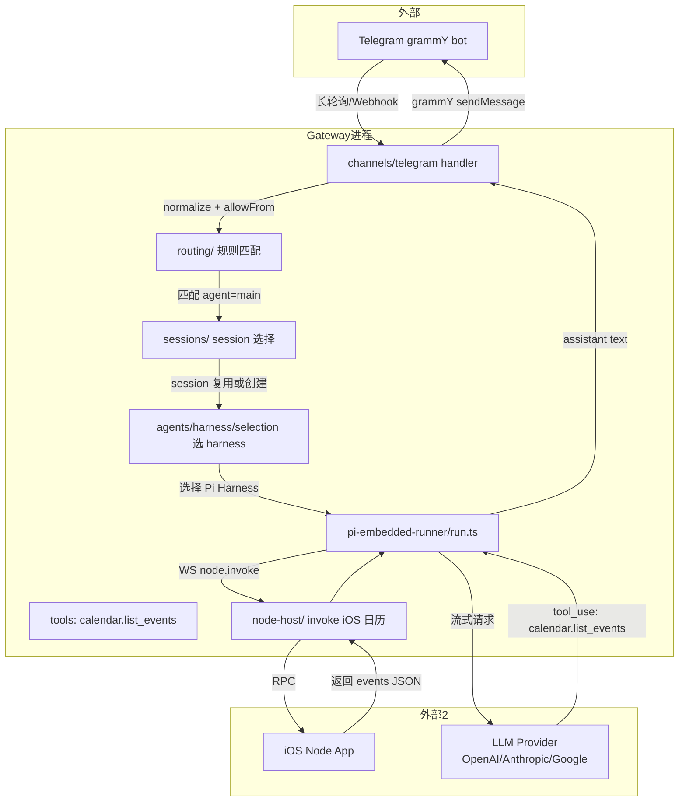

+++
title = "OpenClaw 源码导读（一）：架构总览 — 为\"单个主人\"而设计的 AI Gateway"
date = '2026-05-02T22:32:27+08:00'
draft = false
weight = 17
tags = ["AI", "LLM", "面试", "OpenClaw"]
categories = ["AI", "面试"]
+++
> 2025 年 11 月，[Peter Steinberger](https://steipete.me)（PSPDFKit 创始人、前著名 iOS 社区人物）把自己折腾出来的个人 AI 助手 Molty 开源为 **OpenClaw**。短短几个月，仓库吃到 35 万+ star、93 个 release、360 多个 contributor，核心代码量在 TypeScript/Swift/Kotlin/Go/Python 之间横跨 40 多万行。它和 Claude Code、Codex CLI 乍看都是"跑在本地的 CLI Agent"，但设计哲学完全不同——Claude Code 是一个**编程助手**，OpenClaw 是一个长在你设备上的**私人秘书**：它挂在 WhatsApp/Telegram/iMessage/微信 的 IM 客户端后面，能自己发消息、自己开浏览器、自己调用 iOS/Android 上的摄像头和麦克风。
>
> 本文是 OpenClaw 源码导读系列的第一篇，目标是把整个项目的"地图"摊开。先讲清楚它要解决什么问题、在怎样的信任模型下运行，再把仓库 100 多个顶层模块拎出来分类，最后给出后续系列文章的导航。

---

## 一、它到底是什么

### 1. 一句话定义

OpenClaw 官方给自己的定位是 _"Personal AI Assistant. Any OS. Any Platform. The lobster way."_ 翻译过来就是：**一个在你自己设备上运行、从你自己现有的聊天工具里和你对话的个人 AI 助手**。

这个定位里藏着三个关键差异：

- **Personal**：它不是多租户 SaaS，也不是团队协作工具，而是**单一主人**的私人助手。整个信任模型就是为"只有一个 operator"优化的。
- **Any OS / Any Platform**：Gateway 是 Node 进程，可以跑在 macOS/Linux/Windows(WSL2)、甚至 Fly.io/Docker/NAS 上；客户端包含 iOS/Android/macOS 原生 App，还有 Web Dashboard。
- **The lobster way**：作者把它拟人化成一只太空龙虾 Molty，这是一个品牌/吉祥物层面的设计，但也反映了项目的"玩心"。

### 2. 和 Claude Code 对比：两个相似却完全不同的 CLI Agent

由于作者 Steipete 本身是 Claude Code 的重度用户和 Anthropic 的合作者，社区最常问的问题就是"和 Claude Code 有啥区别"。这里先画一张对比表：

| 维度 | Claude Code | OpenClaw |
|------|------------|----------|
| **目标用户** | 软件工程师 | 普通 Power User（含工程师） |
| **主交互面** | 终端 REPL | IM 聊天窗口（WhatsApp/TG/iMessage…）+ 语音 + Canvas |
| **运行模型** | 单一请求–响应循环 | 多 Agent、多 Session 并发路由 |
| **Tool 焦点** | 文件/Bash/代码编辑 | 浏览器、摄像头、Canvas、IM 发消息、定位、日历 |
| **扩展协议** | MCP | MCP + Plugin SDK + Skills + Canvas A2UI + Node Protocol |
| **分发形态** | npm 包（bun 运行时） | npm 包 + macOS.app + iOS/Android .ipa/.apk + Docker |
| **部署拓扑** | 用户本机 1 个进程 | Gateway + 多客户端 + 多 Node 的分布式网络 |
| **信任模型** | 用户本人唯一操作者 | 单主人 + 陌生人 DM 配对 + 群组沙盒 |

可以概括为一句话：**Claude Code 是"跟代码对话的 CLI"，OpenClaw 是"跟生活对话的 Gateway"。**

### 3. 为什么叫 Gateway

这是 OpenClaw 最核心的架构隐喻。看它自己 README 里画的图：

```
WhatsApp / Telegram / Slack / Discord / iMessage / WeChat / QQ / ...
               │
               ▼
┌───────────────────────────────┐
│            Gateway            │
│       (control plane)         │
│     ws://127.0.0.1:18789      │
└──────────────┬────────────────┘
               │
               ├─ Pi agent (RPC)
               ├─ CLI (openclaw …)
               ├─ WebChat UI
               ├─ macOS app
               └─ iOS / Android nodes
```

`Gateway` 是一个常驻的 Node 进程，默认绑定 `127.0.0.1:18789`，通过 **WebSocket 协议**对外暴露 RPC。它本身不"说话"（不是那个 LLM Agent），它只做路由：

- **北向**：把来自 WhatsApp/TG/iMessage/WeChat 的消息，按 session 和 agent 的映射，投递给 Agent Harness 去跑。
- **南向**：把 Agent 产出的回复/工具调用，路由回对应的 IM 频道；同时把需要设备能力（摄像头/定位/屏幕录制）的调用路由到 iOS/Android/macOS Node。
- **东西向**：承载 Canvas/WebChat/Control UI 的 WS 连接、接收语音唤醒信号、托管 MCP 客户端。

所以在 OpenClaw 的词汇里：

- **Agent** 是一段 Prompt + Model + Tools + Workspace 的配置（不是进程），可以同时有多个。
- **Session** 是某个 Agent 在某个对话里的具体状态实例。
- **Channel** 是消息渠道（WhatsApp 是一个 Channel，Slack 是另一个）。
- **Node** 是提供设备能力的客户端（iOS node 能拍照、macOS node 能跑本地 bash）。
- **Gateway** 是一个 WebSocket 中枢，把上述四个概念串起来。

这种"Gateway + 多客户端"拓扑可以参考 AWS IoT Core 或 Matter 智能家居协议——把一个 IM 消息当成 IoT 事件，把 Agent 当成执行器。

---

## 二、仓库的骨架

### 1. 顶层目录一览

```bash
openclaw/
├── src/                 # Gateway + Agent + CLI 的 TypeScript 主代码
├── packages/            # 可独立发布的 SDK 包（plugin-sdk 等）
├── extensions/          # 官方/第三方 Plugin（memory-core 等）
├── skills/              # 预置 Skill 库（50+ 个）
├── apps/
│   ├── ios/             # iOS node + Canvas SwiftUI
│   ├── macos/           # macOS 菜单栏 + 语音唤醒
│   └── android/         # Android node Jetpack Compose
├── ui/                  # Vite 构建的 Web Dashboard 和 WebChat
├── docs/                # MintLify 文档（docs.openclaw.ai 的源）
├── scripts/             # 构建 / 发布 / 代码生成 工具
├── test-fixtures/       # 测试数据
└── Dockerfile*          # Gateway + Sandbox 镜像
```

这是一个典型的 **TypeScript monorepo**，用 pnpm workspaces + tsdown（tsup 的 rust 端重写）做构建。从 `tsconfig.core.json`、`tsconfig.extensions.json`、`tsconfig.plugin-sdk.dts.json` 这些拆分可以看出，**主代码、扩展、SDK 的类型检查是彼此隔离的**——这样一个 plugin 作者改 plugin-sdk 的时候不会把主干编译拖慢。

### 2. `src/` 的 100 个子目录怎么看

直接 `ls src/` 会吓一跳——100 个顶层条目，哪个是入口？下面按职责把它们重新分类：

**🔵 Gateway 层（控制平面）**

| 目录 | 职责 |
|------|------|
| `entry.ts` / `cli/` / `runtime.ts` | CLI 启动入口、参数解析、Profile/Container 分派 |
| `gateway/` | WebSocket server、RPC method 路由、auth、配置 |
| `daemon/` | 后台进程管理、launchd/systemd、lock 文件、自动重启 |
| `bootstrap/` | 启动早期的配置加载、日志初始化、Telemetry |
| `pairing/` | 客户端配对（pairing code / device pairing） |
| `secrets/` | 密钥管理（keychain / encrypted file） |

**🟢 Agent Runtime 层**

| 目录 | 职责 |
|------|------|
| `agents/` | Agent Harness 注册表、pi-embedded-runner、run 循环 |
| `agents/harness/` | Harness 抽象（把不同的 AI 运行时套在一起） |
| `agents/pi-embedded-runner/` | 基于 pi-mono 的默认 Harness 实现 |
| `context-engine/` | 上下文工程：system prompt、memory、skill 发现 |
| `memory/` / `memory-host-sdk/` | 长期记忆系统 |
| `commands/` | Slash 命令（/status、/reset、/think…） |
| `auto-reply/` | 自动回复逻辑（包含 thinking level 判断） |
| `chat/` | Chat 级别的 API（创建消息、中断、追加等） |

**🟠 IO / 能力层**

| 目录 | 职责 |
|------|------|
| `channels/` | 多渠道接入（WhatsApp/Telegram/Slack 等 25+ 个） |
| `canvas-host/` | Live Canvas（A2UI） host server |
| `node-host/` | 设备 Node 协议（iOS/Android/macOS 能力注册 + 调用） |
| `media/` / `media-understanding/` / `media-generation/` | 媒体处理（图像、音频、视频的理解 + 生成） |
| `realtime-voice/` / `realtime-transcription/` / `tts/` | 语音链路 |
| `web-search/` / `web-fetch/` / `proxy-capture/` | Web 搜索 + 抓取 |
| `image-generation/` / `video-generation/` / `music-generation/` | 生成式媒体工具 |
| `link-understanding/` / `markdown/` | 富文本解析 |

**🔴 扩展/插件层**

| 目录 | 职责 |
|------|------|
| `plugin-sdk/` | 对第三方开放的 SDK 公共 API |
| `plugins/` | Plugin 运行时（装载、权限、钩子） |
| `mcp/` | MCP (Model Context Protocol) 集成 |
| `hooks/` | 生命周期钩子系统 |
| `acp/` | ACP（Agent-to-Agent 协议） |
| `flows/` | 预置工作流 |

**🟣 安全/运维层**

| 目录 | 职责 |
|------|------|
| `security/` | 安全审计、敏感信息扫描 |
| `sessions/` | Session 生命周期、权限、pruning |
| `routing/` | 多 Agent 路由规则 |
| `cron/` | 定时任务调度 |
| `tasks/` | 异步任务队列 |
| `logging/` / `logger.ts` | 日志子系统（不是单一 logger，是面向每个子系统的隔离 logger） |
| `tui/` / `terminal/` / `interactive/` | 终端 UI 组件 |

**⚫ 基础设施**

| 目录 | 职责 |
|------|------|
| `infra/` | 500+ 个"小工具"：env 解析、错误格式化、DNS、path、proxy dispatcher 等 |
| `config/` | 配置 schema、路径解析、合并规则 |
| `shared/` / `utils/` | 跨模块共享工具函数 |
| `types/` / `compat/` | 公共类型、跨版本兼容层 |
| `test-helpers/` / `test-utils/` | 测试辅助 |

到这里就能回答"项目大吗"这个问题——**非常大**，但它的**领域划分其实很清晰**：所有东西都围绕"让 IM 消息流能够触达 Agent、并把 Agent 的工具调用反投射到设备/服务"这一条主线。

### 3. 数量级

- `src/` 下有 1500+ 个 `.ts` 文件（排除 `*.test.ts`）。
- `src/infra/` 单目录就有 500+ 个文件——因为它把几乎所有"通用 helper"都集中管理了（env.ts、dns.ts、backoff.ts、error-formatter.ts 等），这种极致粒度的拆分是 OpenClaw 一个有争议但非常显眼的工程风格。
- `src/agents/pi-embedded-runner/run.ts` 单文件 2160 行，是整个 Agent 循环的核心。
- `src/config/` 下有 260+ 个文件，因为配置 schema 是 TypeBox 自动生成 + Zod 校验的双层结构。

---

## 三、数据流：一条消息的生命周期

下面跟着一条"用户在 Telegram 发 `帮我看下今天日程` 给 bot"的消息，看它在 OpenClaw 内部会怎么流动。



这里有几个值得展开的细节：

1. **DM 的准入控制在 `channels/allow-from.ts` 和 `channels/allowlists/`**：陌生人发来第一条消息时，channel handler 先问 `dmPolicy`——如果是 `pairing`，就直接发一条"请输入配对码"回去，不进入 routing。
2. **routing 不只是"选 Agent"**：它还同时决定 `sandbox mode`（main session 直接运行 tools，非 main 进 Docker）、`groupActivation`（群里是否需要 @ 才触发）、`thinkingLevel`（此次 turn 用多高的思考档位）。
3. **Harness 选择**是可插拔的**：OpenClaw 并不把 pi-embedded-runner 硬编码成唯一的 Agent 实现。`agents/harness/selection.ts` 会按 provider + model 挑最合适的 harness——比如遇到 Anthropic 的 Messages API 走内置 pi，遇到 Codex 走 `codex-app-server-extensions`（Codex CLI 的封装）。
4. **Tool 调用会路由到 Node**：当 Agent 输出 `tool_use: calendar.list_events`，且这个 tool 的 provider 是某个 iOS node，Gateway 就通过 node 的 persistent WS 连接下发 `node.invoke` 请求，等待远端返回结果，再把结果塞回到 assistant turn 中继续 loop。这和 Claude Code 纯本地执行 tool 的模式完全不同。

---

## 四、三个关键设计决策

读过骨架之后，最值得记住的是 OpenClaw 的三个**反直觉但极其关键**的设计选择。

### 1. Gateway 是"控制平面"，不是"消息总线"

很多人第一次看到 WebSocket 中枢会以为它是 Kafka/NATS 那种"订阅–发布"的消息总线。事实上不是——Gateway 的 WS 连接是**双向 RPC**：

- 客户端连上来先做 `hello` → `hello-ok` 握手（见 `src/gateway/protocol/schema/frames.ts`）。
- 之后每条帧要么是 `req`（请求）、`res`（响应），要么是 `event`（单向事件）。
- `req/res` 有 `id` 字段做请求匹配，类似 JSON-RPC 2.0。
- 鉴权结果 / 会话快照 / Agent 列表都在 `hello-ok` 里一次性下发（`snapshot` 字段），之后通过 `event` 增量推送 `stateVersion`，客户端重连时可以带 `stateVersion` 做差量同步。

也就是说，Gateway 的设计更像一个**有状态的应用服务器**（Erlang/Elixir 风格），而不是一个无状态的事件流系统。

看一下它握手的协议帧 schema：

```22:70:src/gateway/protocol/schema/frames.ts
export const ConnectParamsSchema = Type.Object(
  {
    minProtocol: Type.Integer({ minimum: 1 }),
    maxProtocol: Type.Integer({ minimum: 1 }),
    client: Type.Object(
      {
        id: GatewayClientIdSchema,
        displayName: Type.Optional(NonEmptyString),
        version: NonEmptyString,
        platform: NonEmptyString,
        deviceFamily: Type.Optional(NonEmptyString),
        modelIdentifier: Type.Optional(NonEmptyString),
        mode: GatewayClientModeSchema,
        instanceId: Type.Optional(NonEmptyString),
      },
      { additionalProperties: false },
    ),
    caps: Type.Optional(Type.Array(NonEmptyString, { default: [] })),
    commands: Type.Optional(Type.Array(NonEmptyString)),
    permissions: Type.Optional(Type.Record(NonEmptyString, Type.Boolean())),
    pathEnv: Type.Optional(Type.String()),
    role: Type.Optional(NonEmptyString),
    scopes: Type.Optional(Type.Array(NonEmptyString)),
    device: Type.Optional(
      Type.Object(
        {
          id: NonEmptyString,
          publicKey: NonEmptyString,
          signature: NonEmptyString,
          signedAt: Type.Integer({ minimum: 0 }),
          nonce: NonEmptyString,
        },
        { additionalProperties: false },
      ),
    ),
```

注意这里既支持 `password` 又支持 `deviceToken` 还支持设备签名——这一套 schema 是为了把多种信任级别的客户端统一在一个 WS 握手里完成鉴权。

### 2. 用"Harness 抽象"代替"Agent Framework"

大部分 Agent 项目（LangChain、AutoGen、CrewAI）的核心是**自己定义一个 Agent 循环**。OpenClaw 不是，它把 Agent 循环抽象成一个接口叫 **Harness**：

```30:39:src/agents/harness/types.ts
export type AgentHarness = {
  id: string;
  label: string;
  pluginId?: string;
  supports(ctx: AgentHarnessSupportContext): AgentHarnessSupport;
  runAttempt(params: AgentHarnessAttemptParams): Promise<AgentHarnessAttemptResult>;
  compact?(params: AgentHarnessCompactParams): Promise<AgentHarnessCompactResult | undefined>;
  reset?(params: AgentHarnessResetParams): Promise<void> | void;
  dispose?(): Promise<void> | void;
};
```

只要实现 `runAttempt` 就能接入自己的 Agent 运行时。官方带了两个实现：

- **`builtin-pi`**：基于 [Mario Zechner 的 pi-mono](https://github.com/badlogic/pi-mono) 打造的内置 harness，支持所有主流 provider 的 Messages/Responses API（OpenAI、Anthropic、Google、Bedrock、Vertex、OpenRouter、MiniMax、Qwen…）。
- **`codex-app-server-extensions`**：把 Codex CLI 的 app-server 模式套在 Harness 里，让 OpenClaw 可以直接复用 Codex 的 agent 循环和 tool 调用。

这个设计带来的好处是：**未来 Anthropic 推出新的 Claude Code API、OpenAI 推出 Responses API 2.0，OpenClaw 只需要添加一个新 Harness，不用动 Gateway 和 channel 层**。这和 Harness Engineering 这一篇里讲的"Model + Harness = Agent"思想是完全一致的——作者 Steipete 非常认同 Anthropic 推崇的"Harness"观念，把它直接落到了架构层面。

### 3. 把"设备能力"也做成 RPC，不做成本地调用

最反直觉的设计：即使 Gateway 和 macOS app 都跑在同一台 Mac 上，它们**仍然通过 WebSocket + node.invoke RPC** 来互相调用能力——而不是直接 `child_process.spawn`。

这就是 `src/node-host/` 存在的原因。看它导出的关键接口：

```bash
node-host/
├── config.ts                       # Node 端配置
├── invoke.ts                       # 核心 invoke dispatcher
├── invoke-types.ts                 # request/response 类型
├── invoke-system-run.ts            # system.run 命令执行
├── invoke-system-run-plan.ts       # 执行计划（含权限检查）
├── invoke-system-run-allowlist.ts  # 命令白名单
├── exec-policy.ts                  # 执行策略
├── runner.ts                       # 通用 node runner
├── plugin-node-host.ts             # plugin 侧的 node host 集成
└── with-timeout.ts                 # 超时保护
```

每一个能力（`system.run`、`system.notify`、`camera.snap`、`screen.record`、`location.get`、`canvas.*`）都是通过 WS 双向 RPC 调用的。这带来四个好处：

- **Gateway 可以部署在 Linux 服务器上，Mac/iPhone 只做 Node**：只要 Node 和 Gateway 能通过 Tailscale/SSH 隧道对上 WS，能力就可用。
- **权限在 Node 侧就近判断**：iOS 的相册/相机权限、macOS 的 Screen Recording / Accessibility TCC 权限，都是 Node 自己在 Swift 层处理，Gateway 不需要关心 TCC。
- **能力发现是动态的**：`node.list` 返回当前挂接的所有 Node，`node.describe` 返回某个 Node 的能力清单 + 权限状态。Agent 在组装 Tool 列表时会动态过滤。
- **Agent 可以跨设备协作**："把今天在 iPhone 相册里拍的照片选 3 张贴到 Mac Canvas 上"，这个任务会跨两个 Node，在 OpenClaw 里很自然。

---

## 五、一个启动过程的快照

收尾之前，让我们从 `openclaw gateway --port 18789` 这条命令倒推一遍 OpenClaw 启动时做了什么。

### Step 1：CLI 入口 `src/entry.ts`

```38:66:src/entry.ts
if (
  !isMainModule({
    currentFile: fileURLToPath(import.meta.url),
    wrapperEntryPairs: [...ENTRY_WRAPPER_PAIRS],
  })
) {
  // Imported as a dependency — skip all entry-point side effects.
} else {
  process.title = "openclaw";
  ensureOpenClawExecMarkerOnProcess();
  installProcessWarningFilter();
  normalizeEnv();
  if (!isTruthyEnvValue(process.env.NODE_DISABLE_COMPILE_CACHE)) {
    try {
      enableCompileCache();
    } catch {
      // Best-effort only; never block startup.
    }
  }
```

注意这几行里藏了三个 Anti-pattern 的防御：

- **`isMainModule` 守卫**：bundler 会把 `entry.js` 当作共享依赖二次 import，如果不拦住，第二次 import 会再启一遍 Gateway 导致端口/lock 冲突。
- **`enableCompileCache()`**：Node 22+ 才有的 API，把 JS→字节码的编译结果缓存在 `~/.config/node/.compile_cache_v*`，二次启动能省掉 ~20-30% 的 TypeScript 模块装载时间。
- **`process.title = "openclaw"`**：让 `ps aux | grep openclaw` 和 Activity Monitor 能认出这是 OpenClaw 而不是通用 node。

### Step 2：Respawn 决策

```67:98:src/entry.ts
  function ensureCliRespawnReady(): boolean {
    const plan = buildCliRespawnPlan();
    if (!plan) {
      return false;
    }

    const child = spawn(process.execPath, plan.argv, {
      stdio: "inherit",
      env: plan.env,
    });

    attachChildProcessBridge(child);

    child.once("exit", (code, signal) => {
      if (signal) {
        process.exitCode = 1;
        return;
      }
      process.exit(code ?? 1);
    });
```

这里做了一个很微妙的设计——**自己 spawn 一个子 Node 进程继续跑**。原因是 Node 启动时传递的 `--max-old-space-size`、`--experimental-vm-modules`、`--enable-source-maps` 这些 flag 只能在"最初启动的那一刻"生效，而 OpenClaw 根据 argv（比如 `--verbose`、`--profile dev`）可能需要调整这些 flag，所以直接 respawn 一个子进程，让子进程带上正确的 V8 flag 继续跑。这是 Node CLI 领域常见但实现细节复杂的一个技巧。

### Step 3：分发到 `cli/run-main.ts`

```179:188:src/entry.ts
  import("./cli/run-main.js")
    .then(({ runCli }) => runCli(argv))
    .catch((error) => {
      console.error(
        "[openclaw] Failed to start CLI:",
        error instanceof Error ? (error.stack ?? error.message) : error,
      );
      process.exitCode = 1;
    });
```

注意这是 **dynamic import**——在命令行是 `openclaw --version` 或 `openclaw doctor` 等 fast-path 命令时，`run-main.js` 所在的整条模块树根本不会被装载。这也是为什么 `--version` 可以几乎瞬间返回的原因。

### Step 4：`runCli` 中的多次异步装载

```213:223:src/cli/run-main.ts
    const [
      { buildProgram },
      { runFatalErrorHooks },
      { installUnhandledRejectionHandler },
      { restoreTerminalState },
    ] = await Promise.all([
      import("./program.js"),
      import("../infra/fatal-error-hooks.js"),
      import("../infra/unhandled-rejections.js"),
      import("../terminal/restore.js"),
    ]);
```

四个并行的 dynamic import，每个都是按需加载、按依赖顺序并发——这是 OpenClaw 极度重视冷启动时间的体现。整个 CLI 的**冷启动预算是 300ms 内**（作者在 `AGENTS.md` 里写得很清楚），所以能延迟 import 的都延迟 import、能并发的都并发。

### Step 5：Commander 解析 + Plugin 注册

```265:290:src/cli/run-main.ts
    if (!shouldSkipPluginRegistration) {
      // Register plugin CLI commands before parsing
      const { registerPluginCliCommandsFromValidatedConfig } = await import("../plugins/cli.js");
      const config = await registerPluginCliCommandsFromValidatedConfig(
        program,
        undefined,
        undefined,
        {
          mode: "lazy",
          primary,
        },
      );
```

Plugin CLI 命令是**懒加载**的——只有当用户实际输入的 `primary`（第一个非 flag 参数）匹配到某个 plugin 时，才会去初始化那个 plugin。这让装了几十个 plugin 的用户也能保持命令行响应速度。

### Step 6：真正启动 Gateway

当用户输入的是 `openclaw gateway`，Commander 会路由到 `src/gateway/` 下的 `gateway-command.ts`。整个 Gateway 生命周期包括：

1. **读 `~/.openclaw/openclaw.json`** 配置 + schema 校验（`src/config/`）。
2. **Acquire port lock**（`src/daemon/` 下的 lock 文件），保证全局只有一个 Gateway。
3. **启动 HTTP + WebSocket server**（`src/gateway/server/`），默认 `127.0.0.1:18789`。
4. **装载 Plugin**（`src/plugins/`），解析 manifest、执行 boot。
5. **注册 Agent Harness**（`src/agents/harness/registry.ts`），builtin-pi 先注册。
6. **初始化 Channels**（`src/channels/`），对每个 enabled 的 channel 做 login/webhook 订阅。
7. **启动 Canvas Host**（`src/canvas-host/`），监听另一个端口供 A2UI iframe 加载。
8. **启动 Cron / Tasks / Memory 等后台服务**。
9. **暴露 Tailscale Serve / Funnel**（如果配置了）。

这条启动路径将是**系列第二篇**的重点。

---

## 六、系列文章导航

本文只是 OpenClaw 源码导读的地图篇，覆盖"它是什么、长什么样、核心哲学"。深入的源码解读分成三篇继续：

| 篇目 | 主题 | 关键源码 |
|------|------|----------|
| **（一）架构总览** | 项目定位 / 架构哲学 / 仓库结构 / 数据流 / 启动概览 | `src/entry.ts`, `src/cli/run-main.ts` |
| **（二）Gateway 控制平面** | WebSocket RPC 协议 / 鉴权与 Pairing / Session 模型 / Multi-Agent 路由 | `src/gateway/`, `src/sessions/`, `src/pairing/` |
| **（三）Agent Harness 与执行管线** | Harness 抽象 / pi-embedded-runner / Run attempt / Failover / Compaction | `src/agents/harness/`, `src/agents/pi-embedded-runner/` |
| **（四）Channels、Nodes 与扩展生态** | Channel SDK / DM Pairing / Canvas A2UI / Node 协议 / Plugin + Skills / 沙盒 | `src/channels/`, `src/node-host/`, `src/canvas-host/`, `src/plugin-sdk/`, `skills/` |

读完整个系列之后，你应该能回答这些问题：

- 一条微信消息怎么走到 GPT-5 手里、回答又是怎么发回微信的？
- Gateway 怎么做到"同一台机器上的 macOS app 也要走 WS"？
- 为什么 OpenClaw 要把 compaction/failover/retry 全做在 Harness 层而不是 LLM SDK 层？
- iOS node 上的摄像头 / 屏幕录制 / 位置服务是怎么被 Agent 调用的？
- 如果我要接一个新的 IM 平台（比如钉钉），要改几个文件？

---

## 参考资料

- OpenClaw GitHub：<https://github.com/openclaw/openclaw>
- OpenClaw 官方文档：<https://docs.openclaw.ai>
- Peter Steinberger 个人博客：<https://steipete.me>
- pi-mono（Harness 基础）：<https://github.com/badlogic/pi-mono>
- Anthropic 的 Harness Engineering：见系列文章 [`Harness Engineering`]()
- 可对照阅读的 CLI Agent：[`Claude Code 源码导读`]()
