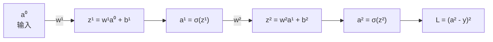
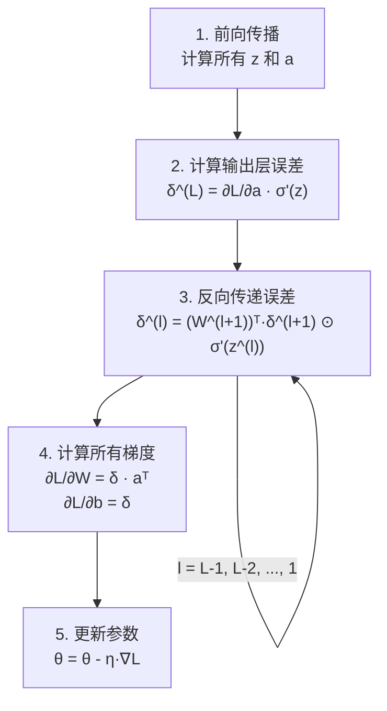
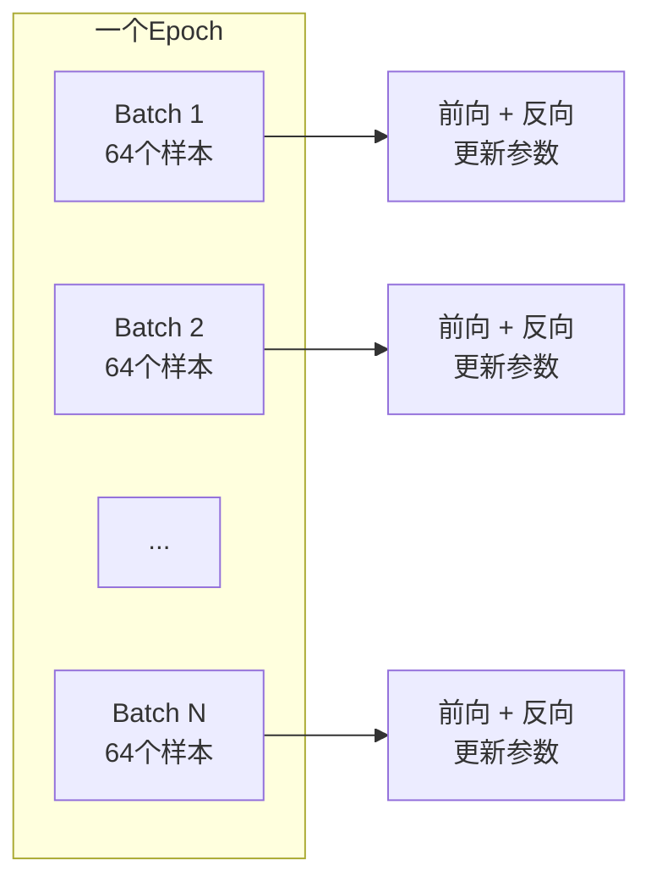
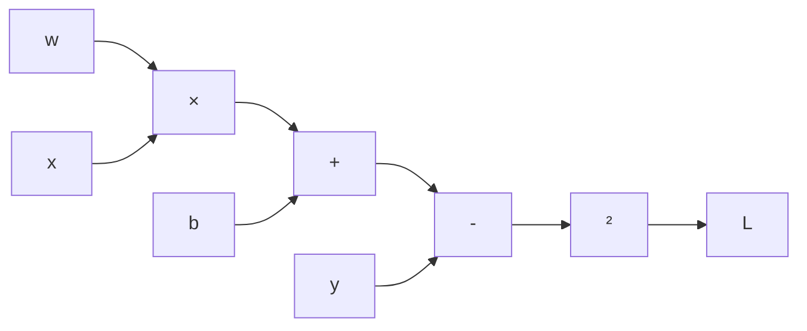
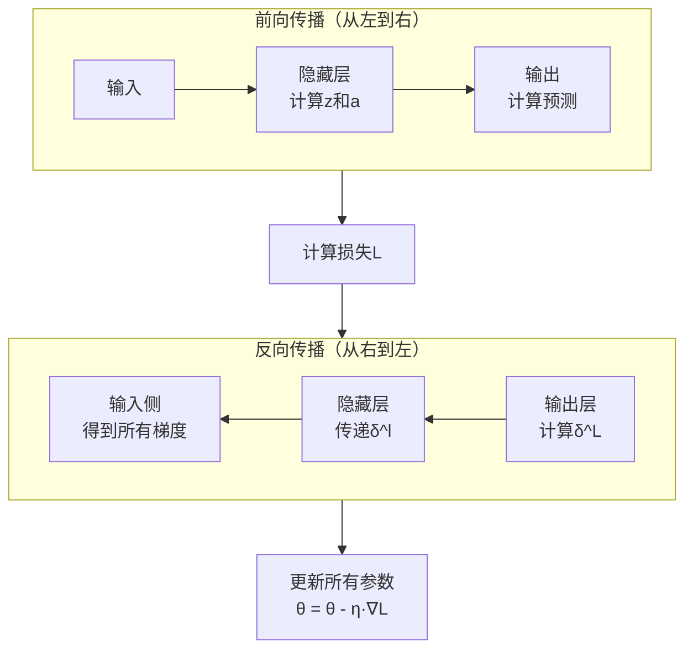

+++
title = "反向传播算法"
date = '2026-05-02T22:32:27+08:00'
draft = false
weight = 12
tags = ["AI", "LLM", "面试"]
categories = ["AI", "面试"]
+++
在上一篇文章中，我们构建了一个神经网络，了解了前向传播是如何产生预测的，也知道了损失函数可以衡量预测有多差。但我们遗留了最核心的问题：**那13,002个参数到底该怎么调整，才能让网络变得更好？**

这就是反向传播算法（Backpropagation）要回答的问题。它是神经网络学习的核心引擎，几乎所有现代深度学习的训练都建立在它之上。

## 一、梯度下降：从直觉开始

### 1.1 一个简单的类比

想象你站在一片浓雾中的山地上，看不到全貌，但你能感受到脚下地面的倾斜方向。你的目标是找到最低的山谷。最自然的策略是什么？

**顺着脚下最陡的下坡方向走一小步。**

这就是**梯度下降（Gradient Descent）**的核心思想。

### 1.2 数学表述

假设损失函数 $L$ 取决于所有参数 $\theta = (w_1, w_2, ..., w_n, b_1, b_2, ..., b_m)$。

**梯度**是一个向量，指向损失增长最快的方向：

$$\nabla L = \left(\frac{\partial L}{\partial w_1}, \frac{\partial L}{\partial w_2}, \cdots, \frac{\partial L}{\partial b_m}\right)$$

梯度的每个分量告诉我们：如果微微增大某个参数，损失会增加多少。

要降低损失，我们朝梯度的**反方向**迈步：

$$\theta_{\text{new}} = \theta_{\text{old}} - \eta \cdot \nabla L$$

其中 $\eta$ 是**学习率（learning rate）**，控制每一步的步长。

### 1.3 学习率的微妙之处

| 学习率 | 下降行为 | 结果 |
|:---:|:---|:---|
| 太小 | 每步挪动极小，到达局部最小值后就停住了，无法跳出 | 收敛极慢，可能困在局部最小值 |
| 太大 | 一步跨过了最低点，又跨回来，反复来回 | 在最低点附近震荡，甚至发散 |
| 合适 | 每步大小适中，沿着曲面稳步走向谷底 | 稳步下降，逐渐逼近最优解 |

### 1.4 梯度下降的关键问题

现在整个问题归结为一件事：**怎么高效地计算 $\nabla L$，即损失对每一个参数的偏导数？**

你可能会想：对每个参数微微扰动一下，看看损失变化了多少。但如果有13,002个参数，每个参数都扰动一次，就需要做13,002次前向传播——太慢了。

反向传播的天才之处在于：只需要一次前向传播和一次反向传播，就能算出所有参数的梯度。

## 二、从链式法则开始

### 2.1 复合函数的导数

反向传播的数学基础是微积分中的**链式法则（Chain Rule）**。

如果 $y = f(g(x))$，那么：

$$\frac{dy}{dx} = \frac{dy}{dg} \cdot \frac{dg}{dx}$$

直觉理解：$x$ 的微小变化首先影响 $g$，然后 $g$ 的变化影响 $y$。总效应是两个效应的乘积。

让我们用一个具体的数值例子感受一下：

$$y = (3x + 2)^2$$

设 $g = 3x + 2$，$y = g^2$。

当 $x = 1$ 时：
- $g = 5$，$y = 25$
- $\frac{dg}{dx} = 3$：$x$ 增加一点点，$g$ 增加3倍
- $\frac{dy}{dg} = 2g = 10$：$g$ 增加一点点，$y$ 增加10倍
- $\frac{dy}{dx} = 10 \times 3 = 30$：$x$ 增加一点点，$y$ 增加30倍

### 2.2 多变量链式法则

在神经网络中，一个变量通常通过多条路径影响最终的损失。此时需要对每条路径的贡献求和：

如果 $L$ 通过 $z_1, z_2, ..., z_k$ 间接依赖于 $w$，那么：

$$\frac{\partial L}{\partial w} = \sum_{i=1}^{k} \frac{\partial L}{\partial z_i} \cdot \frac{\partial z_i}{\partial w}$$

## 三、反向传播的推导

让我们用一个足够简单但能说明一切的例子来推导反向传播。

### 3.1 一个最小的网络

考虑一个只有单条路径的简化网络：



这里我们用最简单的均方误差作为损失函数：$L = (a^{(2)} - y)^2$，其中 $y$ 是真实标签。

我们的目标是求 $\frac{\partial L}{\partial w^{(1)}}$——损失对第一层权重的敏感度。

### 3.2 逐步展开链式法则

从损失 $L$ 到权重 $w^{(1)}$，中间经过了这些环节：

$$L \leftarrow a^{(2)} \leftarrow z^{(2)} \leftarrow a^{(1)} \leftarrow z^{(1)} \leftarrow w^{(1)}$$

根据链式法则：

$$\frac{\partial L}{\partial w^{(1)}} = \frac{\partial L}{\partial a^{(2)}} \cdot \frac{\partial a^{(2)}}{\partial z^{(2)}} \cdot \frac{\partial z^{(2)}}{\partial a^{(1)}} \cdot \frac{\partial a^{(1)}}{\partial z^{(1)}} \cdot \frac{\partial z^{(1)}}{\partial w^{(1)}}$$

让我们逐一计算每个偏导数：

**第一步**：损失对输出激活值的导数

$$\frac{\partial L}{\partial a^{(2)}} = 2(a^{(2)} - y)$$

如果预测接近真实值，这个值很小（网络已经做得不错了）；如果偏差大，这个值很大（需要大幅调整）。

**第二步**：激活值对加权和的导数

$$\frac{\partial a^{(2)}}{\partial z^{(2)}} = \sigma'(z^{(2)})$$

这就是Sigmoid函数的导数。对于Sigmoid：$\sigma'(z) = \sigma(z)(1 - \sigma(z))$。

这里有一个重要的隐患：当 $z$ 的绝对值很大时，$\sigma'(z)$ 接近0——这就是**梯度消失问题**的根源，后面会详细讨论。

**第三步**：加权和对上一层激活值的导数

$$\frac{\partial z^{(2)}}{\partial a^{(1)}} = w^{(2)}$$

这很直观：$z^{(2)} = w^{(2)} a^{(1)} + b^{(2)}$，所以对 $a^{(1)}$ 的偏导就是 $w^{(2)}$。

**第四步**：上一层激活值对其加权和的导数

$$\frac{\partial a^{(1)}}{\partial z^{(1)}} = \sigma'(z^{(1)})$$

**第五步**：加权和对权重的导数

$$\frac{\partial z^{(1)}}{\partial w^{(1)}} = a^{(0)}$$

因为 $z^{(1)} = w^{(1)} a^{(0)} + b^{(1)}$。

### 3.3 完整结果

把所有项乘起来：

$$\frac{\partial L}{\partial w^{(1)}} = 2(a^{(2)} - y) \cdot \sigma'(z^{(2)}) \cdot w^{(2)} \cdot \sigma'(z^{(1)}) \cdot a^{(0)}$$

注意这个表达式从右到左的阅读顺序：

$$a^{(0)} \xrightarrow{\sigma'(z^{(1)})} \xrightarrow{w^{(2)}} \xrightarrow{\sigma'(z^{(2)})} \xrightarrow{2(a^{(2)}-y)} L$$

**每一步都是信息向前传播时各环节的局部导数，而整体梯度是这些局部导数的连乘积。**

同样，损失对偏置 $b^{(1)}$ 的梯度是：

$$\frac{\partial L}{\partial b^{(1)}} = 2(a^{(2)} - y) \cdot \sigma'(z^{(2)}) \cdot w^{(2)} \cdot \sigma'(z^{(1)}) \cdot 1$$

唯一的区别是最后一项：$\frac{\partial z^{(1)}}{\partial b^{(1)}} = 1$（偏置的系数永远是1）。

## 四、推广到真实的网络

### 4.1 符号约定

在真实的多层、多神经元网络中，我们需要更精确的符号：

- $a_j^{(l)}$：第 $l$ 层第 $j$ 个神经元的激活值
- $w_{jk}^{(l)}$：从第 $l-1$ 层第 $k$ 个神经元到第 $l$ 层第 $j$ 个神经元的权重
- $b_j^{(l)}$：第 $l$ 层第 $j$ 个神经元的偏置
- $z_j^{(l)}$：第 $l$ 层第 $j$ 个神经元的加权和

### 4.2 定义误差信号

为了让推导更简洁，我们定义一个关键中间量——**误差信号（error signal）**：

$$\delta_j^{(l)} = \frac{\partial L}{\partial z_j^{(l)}}$$

它衡量的是：如果第 $l$ 层第 $j$ 个神经元的加权和 $z$ 发生微小变化，损失会变化多少。

一旦我们知道了所有的 $\delta$，就能立刻算出所有参数的梯度：

$$\frac{\partial L}{\partial w_{jk}^{(l)}} = \delta_j^{(l)} \cdot a_k^{(l-1)}$$

$$\frac{\partial L}{\partial b_j^{(l)}} = \delta_j^{(l)}$$

这两个公式非常优雅。权重的梯度等于"误差信号乘以输入激活值"；偏置的梯度就是误差信号本身。

### 4.3 反向传播的四个核心公式

反向传播算法可以被浓缩为四个公式：

**公式1：输出层的误差**

$$\delta_j^{(L)} = \frac{\partial L}{\partial a_j^{(L)}} \cdot \sigma'(z_j^{(L)})$$

（损失对输出的敏感度，乘以激活函数的导数）

**公式2：误差的反向传播**

$$\delta_j^{(l)} = \left(\sum_{i} w_{ij}^{(l+1)} \delta_i^{(l+1)}\right) \cdot \sigma'(z_j^{(l)})$$

这是核心递推公式。它说：第 $l$ 层的误差等于下一层误差的加权回传，再乘以激活函数的导数。

用矩阵形式写更简洁：

$$\boldsymbol{\delta}^{(l)} = \left((W^{(l+1)})^T \boldsymbol{\delta}^{(l+1)}\right) \odot \sigma'(\mathbf{z}^{(l)})$$

其中 $\odot$ 表示逐元素乘法（Hadamard积）。

**公式3：权重梯度**

$$\frac{\partial L}{\partial w_{jk}^{(l)}} = \delta_j^{(l)} \cdot a_k^{(l-1)}$$

**公式4：偏置梯度**

$$\frac{\partial L}{\partial b_j^{(l)}} = \delta_j^{(l)}$$

### 4.4 算法流程



关键观察：

1. 前向传播从输入到输出，反向传播从输出到输入——所以叫"反向"传播
2. 前向传播时需要保存每一层的 $z$ 和 $a$，反向传播时会用到
3. 整个过程只需要一次前向传播 + 一次反向传播，就得到了所有参数的梯度

## 五、一个完整的数值例子

让我们用具体数字走一遍。考虑一个极简网络：2个输入，2个隐藏神经元，1个输出。

### 5.1 网络结构与初始参数

```
输入: x₁ = 0.5, x₂ = 0.8
真实标签: y = 1

权重和偏置:
W¹ = [[0.1, 0.3],    b¹ = [0.2, 0.1]
      [0.2, 0.4]]
      
W² = [[0.5, 0.6]]    b² = [0.3]
```

### 5.2 前向传播

**隐藏层：**

$$z_1^{(1)} = 0.1 \times 0.5 + 0.3 \times 0.8 + 0.2 = 0.49$$
$$z_2^{(1)} = 0.2 \times 0.5 + 0.4 \times 0.8 + 0.1 = 0.52$$

$$a_1^{(1)} = \sigma(0.49) = 0.6201$$
$$a_2^{(1)} = \sigma(0.52) = 0.6271$$

**输出层：**

$$z^{(2)} = 0.5 \times 0.6201 + 0.6 \times 0.6271 + 0.3 = 0.9863$$

$$a^{(2)} = \sigma(0.9863) = 0.7283$$

**损失（均方误差）：**

$$L = (0.7283 - 1)^2 = 0.0738$$

### 5.3 反向传播

**输出层误差：**

$$\delta^{(2)} = 2(0.7283 - 1) \cdot \sigma'(0.9863)$$
$$= 2 \times (-0.2717) \times 0.7283 \times (1 - 0.7283)$$
$$= -0.5434 \times 0.1978$$
$$= -0.1075$$

**隐藏层误差：**

$$\delta_1^{(1)} = w_{11}^{(2)} \cdot \delta^{(2)} \cdot \sigma'(z_1^{(1)}) = 0.5 \times (-0.1075) \times 0.6201 \times (1-0.6201) = -0.01267$$

$$\delta_2^{(1)} = w_{12}^{(2)} \cdot \delta^{(2)} \cdot \sigma'(z_2^{(1)}) = 0.6 \times (-0.1075) \times 0.6271 \times (1-0.6271) = -0.01509$$

**权重梯度（输出层）：**

$$\frac{\partial L}{\partial w_{11}^{(2)}} = \delta^{(2)} \cdot a_1^{(1)} = -0.1075 \times 0.6201 = -0.0667$$

$$\frac{\partial L}{\partial w_{12}^{(2)}} = \delta^{(2)} \cdot a_2^{(1)} = -0.1075 \times 0.6271 = -0.0674$$

**权重梯度（隐藏层），以 $w_{11}^{(1)}$ 为例：**

$$\frac{\partial L}{\partial w_{11}^{(1)}} = \delta_1^{(1)} \cdot x_1 = -0.01267 \times 0.5 = -0.00634$$

### 5.4 参数更新

设学习率 $\eta = 0.5$：

$$w_{11}^{(2)} \leftarrow 0.5 - 0.5 \times (-0.0667) = 0.5334$$

$$w_{11}^{(1)} \leftarrow 0.1 - 0.5 \times (-0.00634) = 0.1032$$

每个参数都朝着减小损失的方向微调了一小步。经过成千上万次这样的迭代，网络就能逐渐学会正确的映射。

## 六、随机梯度下降与Mini-batch

### 6.1 朴素梯度下降的问题

理论上，我们应该在所有训练数据上计算损失和梯度，然后更新一次参数。但如果有60,000个训练样本，每次更新都遍历一遍全部数据，速度太慢了。

### 6.2 随机梯度下降（SGD）

**随机梯度下降**每次只用一个样本来估计梯度：

```
for each epoch:
    打乱训练数据
    for each 样本 (x, y):
        前向传播
        计算损失
        反向传播
        更新参数
```

优点是更新频率极高（每个样本更新一次），但梯度估计噪声很大，优化路径很震荡。

### 6.3 Mini-batch梯度下降

实践中最常用的折中方案是 **Mini-batch 梯度下降**：将训练数据分成小批次（通常32、64、128或256个样本），每个batch计算一次平均梯度并更新。



| 方法 | Batch大小 | 梯度质量 | 更新频率 | GPU利用率 |
|------|----------|---------|---------|----------|
| 批量梯度下降 | 全部数据 | 最准确 | 最低 | 最高 |
| 随机梯度下降 | 1 | 噪声最大 | 最高 | 最低 |
| Mini-batch | 32~256 | 较好 | 适中 | 较高 |

Mini-batch的一个意外好处是：梯度中的噪声实际上可以帮助跳出局部最小值，找到更好的解。

## 七、梯度消失与梯度爆炸

### 7.1 梯度消失问题

回顾反向传播的误差传递公式：

$$\boldsymbol{\delta}^{(l)} = \left((W^{(l+1)})^T \boldsymbol{\delta}^{(l+1)}\right) \odot \sigma'(\mathbf{z}^{(l)})$$

每向前传一层，梯度都要乘以一个 $\sigma'(z)$。

对于Sigmoid函数，$\sigma'(z)$ 的最大值只有0.25（在 $z=0$ 时取到）：

```
σ'(z)
0.25 |        *
     |      *   *
     |    *       *
     |  *           *
0    |*               *
     +---------+---------→ z
              0
```

这意味着每经过一层，梯度至少缩小到原来的1/4。如果有10层隐藏层：

$$\text{梯度衰减} \leq (0.25)^{10} = 0.000000954$$

最前面几层的梯度几乎为零——参数根本学不动。这就是为什么早期的深层网络无法训练。

### 7.2 ReLU：梯度消失的解药

ReLU的导数是：

$$\text{ReLU}'(z) = \begin{cases} 1 & \text{if } z > 0 \\ 0 & \text{if } z \leq 0 \end{cases}$$

当 $z > 0$ 时，导数恒为1——梯度可以无衰减地传播。这是ReLU成为现代网络默认激活函数的主要原因。

但ReLU有自己的问题：**Dead ReLU**。如果某个神经元的 $z$ 始终为负，它的梯度永远是0，该神经元"死了"，再也无法被激活。解决方案包括Leaky ReLU（$z<0$ 时给一个小斜率）和He初始化。

### 7.3 梯度爆炸问题

与梯度消失相反，如果权重矩阵的特征值大于1，梯度在反向传播中会指数级增长，导致参数更新量过大，训练不稳定。

常见解决方案：
- **梯度裁剪（Gradient Clipping）**：当梯度的范数超过阈值时，等比例缩小
- **合理的权重初始化**：如Xavier初始化、He初始化
- **Batch Normalization**：对每层的输出做归一化
- **残差连接（Skip Connection）**：让梯度可以跳过某些层直接传播

## 八、优化器的进化

朴素的SGD只是起点。实践中有一系列更智能的优化算法：

### 8.1 动量（Momentum）

想象一个球在损失函数的地形上滚动。朴素SGD像是在光滑冰面上走路——每一步只考虑脚下的坡度。Momentum则像是有惯性的球——会累积之前的运动方向：

$$v_t = \beta v_{t-1} + \nabla L$$
$$\theta = \theta - \eta \cdot v_t$$

$\beta$ 通常取0.9。好处是：
- 在持续向同一方向下降时，速度越来越快
- 在来回震荡的方向上，震荡会被抵消

### 8.2 Adam（Adaptive Moment Estimation）

Adam是目前最广泛使用的优化器，结合了Momentum和自适应学习率：

$$m_t = \beta_1 m_{t-1} + (1-\beta_1) \nabla L \quad \text{（一阶矩估计，类似Momentum）}$$
$$v_t = \beta_2 v_{t-1} + (1-\beta_2) (\nabla L)^2 \quad \text{（二阶矩估计，梯度的方差）}$$

$$\hat{m}_t = \frac{m_t}{1 - \beta_1^t}, \quad \hat{v}_t = \frac{v_t}{1 - \beta_2^t} \quad \text{（偏差校正）}$$

$$\theta = \theta - \eta \cdot \frac{\hat{m}_t}{\sqrt{\hat{v}_t} + \epsilon}$$

直觉理解：
- 对于梯度大的参数（经常被更新的方向），Adam自动减小学习率
- 对于梯度小的参数（稀少更新的方向），Adam自动增大学习率
- 这让每个参数有了自己"定制"的学习率

### 8.3 优化器对比

| 优化器 | 核心思想 | 常用场景 |
|-------|---------|---------|
| SGD | 最基础，只用当前梯度 | 简单问题，配合学习率调度 |
| SGD + Momentum | 累积历史梯度方向 | CNN训练 |
| RMSProp | 自适应学习率 | RNN训练 |
| Adam | Momentum + 自适应学习率 | 通用默认选择 |
| AdamW | Adam + 权重衰减 | Transformer训练 |

## 九、自动微分

### 9.1 为什么不用手动推导

在实际的深度学习框架（PyTorch、TensorFlow等）中，你不需要手动推导每个操作的梯度。框架使用**自动微分（Automatic Differentiation）**技术。

核心思想是将整个前向计算记录为一个**计算图（Computational Graph）**，然后利用链式法则自动反向计算梯度。

### 9.2 计算图的直觉

考虑 $L = (w \cdot x + b - y)^2$：



前向传播：从左到右计算每个节点的值。

反向传播：从右到左，每个节点根据其局部导数传递梯度。每个基本操作（加、乘、求幂等）的导数都是已知的简单规则。

框架的做法是：
1. 前向传播时，构建计算图并记录每步的中间值
2. 调用 `.backward()` 时，自动从输出到输入遍历计算图，用链式法则算出每个参数的梯度
3. 梯度存储在每个参数的 `.grad` 属性中

这就是为什么在PyTorch中训练一个网络如此简洁：

```python
output = model(input)
loss = criterion(output, target)
loss.backward()          # 自动计算所有梯度
optimizer.step()         # 用梯度更新参数
```

四行代码背后，就是完整的前向传播、反向传播和参数更新。

## 十、总结：反向传播的精髓

反向传播并不是一个高深莫测的黑魔法。它的核心思想可以总结为一句话：

**利用链式法则，从输出层到输入层逐层计算损失对每个参数的偏导数，然后用这些偏导数（梯度）指导参数更新。**



它之所以强大，是因为：
1. **高效**：一次前向 + 一次反向就得到所有梯度，复杂度与前向传播同阶
2. **通用**：适用于任何可微分的网络结构
3. **可组合**：每个操作只需知道自己的局部导数，全局梯度通过链式法则自动组合

有了反向传播这个学习引擎，我们就有能力训练任意深度和宽度的网络。而这个工具最辉煌的应用之一，就是训练 **Transformer** 架构——它彻底改变了自然语言处理领域，也是现代大语言模型的基石。这将是下一篇文章的主题。
